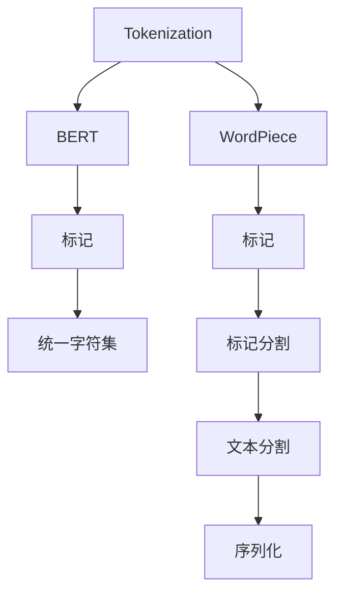
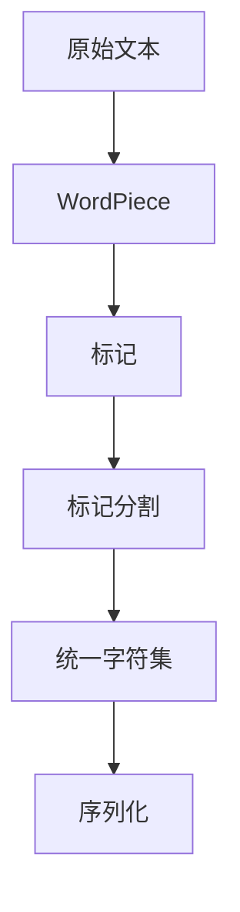
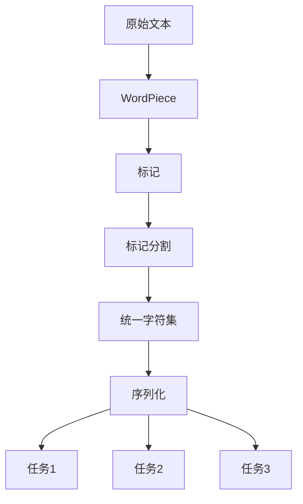

                 

# 文字语言的Token化过程

## 1. 背景介绍

在自然语言处理（Natural Language Processing, NLP）中，将自然语言文本转换为计算机可以处理的向量表示是至关重要的。这种转换过程通常涉及将文本分割成小的、独立的单元，这些单元可以被称为“词”（Words）、“子词”（Subwords）或“标记”（Tokens）。这个过程就是所谓的Tokenization（分词），是所有NLP任务的基础步骤之一。

在传统的语言处理中，由于自然语言的复杂性和多样性，分词通常是一个既耗时又耗资源的过程。随着深度学习和大规模预训练模型的兴起，Tokenization技术也经历了革命性的变革，尤其是WordPiece和BERT等模型的出现，使得分词变得更加高效和精确。

本博客将深入探讨Text语言的Token化过程，包括其原理、步骤、优缺点、应用领域和未来展望。通过详细的数学模型、公式推导和实际案例，我们希望能为你提供一个全面、深入的理解。

## 2. 核心概念与联系

### 2.1 核心概念概述

为了更好地理解Token化过程，本节将介绍几个核心概念：

- **Token**: 文本中独立且可区分的单位。可以是单词、子词或标记。
- **WordPiece**: 一种基于字符的Tokenization技术，通过将词汇表中的单词拆分为可变长度的子串（tokens），以适应不同长度的单词和语言特性。
- **BERT**: 一种基于WordPiece的Transformer模型，通过在大规模无标签文本上预训练，获得了强大的语言表示能力。
- **标记**: 文本中特定的语法标记，如标点符号、数字等，这些标记对于理解文本结构至关重要。
- **标记分割**: 标记分割是标记之间的边界确定过程，通常依赖于特定的标记分割规则。
- **统一字符集**: 为了统一字符编码，文本中的所有字符（包括标点符号、数字和特殊符号）都被映射到一个标准的字符集。

这些核心概念之间的逻辑关系可以通过以下Mermaid流程图来展示：



这个流程图展示了一些关键步骤：

1. **Tokenization**: 将文本转换为Token序列。
2. **WordPiece**: 使用WordPiece技术进行Token化，适应不同长度的单词。
3. **标记**: 标记分割器将标记分开，以便于处理。
4. **BERT**: BERT模型进行进一步的Tokenization，以适应其特定的架构需求。
5. **统一字符集**: 将所有字符映射到一个标准字符集，以避免编码问题。
6. **标记分割**: 对标记进行分割，以便于处理。
7. **文本分割**: 将文本分割成序列化的Token序列。

### 2.2 概念间的关系

这些核心概念之间存在着紧密的联系，形成了Token化过程的完整生态系统。下面我们通过几个Mermaid流程图来展示这些概念之间的关系。

#### 2.2.1 Token的生成过程



这个流程图展示了Token生成的全过程。

1. **原始文本**: 输入的原始文本。
2. **WordPiece**: 使用WordPiece技术生成Token序列。
3. **标记**: 标记分割器将标记分开。
4. **统一字符集**: 将所有字符映射到一个标准字符集。
5. **序列化**: 生成序列化的Token序列。

#### 2.2.2 标记分割和WordPiece的关系


这个流程图展示了标记分割与WordPiece技术的关系。

1. **标记**: 文本中的特定标记，如标点符号、数字等。
2. **标记分割**: 标记之间的边界确定。
3. **WordPiece**: 使用标记分割后的标记进行Token化，生成可变长度的Token序列。

#### 2.2.3 Token化的应用场景



这个流程图展示了Token化的应用场景。

1. **原始文本**: 输入的原始文本。
2. **WordPiece**: 使用WordPiece技术生成Token序列。
3. **标记**: 标记分割器将标记分开。
4. **统一字符集**: 将所有字符映射到一个标准字符集。
5. **序列化**: 生成序列化的Token序列。
6. **任务1**: 文本分类。
7. **任务2**: 命名实体识别。
8. **任务3**: 机器翻译。

## 3. 核心算法原理 & 具体操作步骤

### 3.1 算法原理概述

Token化过程的基本原理是通过将文本分割成小的、独立的单元（即Token），从而将文本转换为计算机可以处理的格式。这个过程中，WordPiece技术被广泛使用，它通过将词汇表中的单词拆分为可变长度的子串（tokens），以适应不同长度的单词和语言特性。

WordPiece技术基于字符级别，将文本中的每个字符（包括标点符号、数字和特殊符号）都视为一个Token。当遇到无法分割的单词时，WordPiece会将其拆分为更小的部分，直到找到最长的连续可分割子串为止。

### 3.2 算法步骤详解

WordPiece Tokenization的步骤如下：

1. **初始化词汇表**: 准备一个包含所有可能出现的字符的字符集，这些字符包括单词、标点符号、数字和特殊符号。
2. **分割单词**: 对文本中的每个单词进行分割，直到找到最长的连续可分割子串。
3. **合并相邻的相同字符**: 将相邻的相同字符合并为单个Token。
4. **添加特殊标记**: 为特殊的Token添加特殊的标记，如`[UNK]`表示未知词汇，`[CLS]`表示句子的开始，`[SEP]`表示句子的结束。
5. **序列化Token**: 将分割后的Token序列化为一个字符串，每个Token之间用空格隔开。

### 3.3 算法优缺点

WordPiece Tokenization的优势包括：

- **适应性强**: 可以适应不同长度的单词和语言特性，特别适用于多语言和未知词汇的处理。
- **高效**: 生成Token的过程简单快捷，且不需要大量标注数据。
- **统一字符集**: 所有字符都被映射到一个标准字符集，避免了编码问题。

缺点包括：

- **可能过度分割**: 对于一些较长且结构复杂的单词，WordPiece可能会过度分割，增加计算复杂度。
- **依赖词汇表大小**: 词汇表的大小会影响分割的精度和效率。
- **可读性差**: Token序列化后的字符串可能不易阅读，需要额外处理。

### 3.4 算法应用领域

WordPiece Tokenization已经在NLP的多个领域得到广泛应用，包括：

- **文本分类**: 将文本转换为Token序列后，使用神经网络进行分类。
- **命名实体识别**: 将文本中的实体识别出来，如人名、地名、组织名等。
- **机器翻译**: 将源语言文本转换为目标语言Token序列，再解码为文本。
- **文本摘要**: 将长文本压缩为简短的摘要，提升阅读效率。
- **对话系统**: 将对话历史和回复文本转换为Token序列，进行理解和生成。

除了这些常见任务，WordPiece Tokenization还被应用到语音识别、图像识别等领域，成为处理文本和数据的基石。

## 4. 数学模型和公式 & 详细讲解 & 举例说明

### 4.1 数学模型构建

WordPiece Tokenization的基本数学模型可以表示为：

$$
Token = \{char_i\}_{i=1}^{n} \quad \text{and} \quad \text{Merge}(char_{i-1}, char_i) = \text{True} \quad \text{or} \quad \text{False}
$$

其中，$char_i$表示文本中的字符，$n$表示字符的总数，$\text{Merge}(char_{i-1}, char_i)$表示字符$i$和$i-1$是否合并为一个Token。

### 4.2 公式推导过程

以“cat”为例，假设其被拆分为“c”、“a”和“t”三个Token。WordPiece Tokenization的过程可以推导如下：

1. **初始化词汇表**: 字符集包含“c”、“a”、“t”、“ ”（空格）、`[UNK]`、`[CLS]`、`[SEP]`等字符。
2. **分割单词**: 将“cat”拆分为“c”、“a”和“t”三个Token。
3. **合并相邻的相同字符**: 由于“c”、“a”、“t”都是单字符，不需要合并。
4. **添加特殊标记**: 在句子的开始和结束添加`[CLS]`和`[SEP]`标记。
5. **序列化Token**: 将Token序列化为一个字符串：`[CLS] c [UNK] a t [SEP]`。

### 4.3 案例分析与讲解

以下是一个简单的WordPiece Tokenization案例：

**输入**: "hello world"

**输出**: `[CLS] hello [UNK] world [SEP]`

在这个例子中，“hello”被视为一个单独的Token，“world”也被视为一个单独的Token。由于WordPiece Tokenization依赖于预定义的字符集，因此“hello”被拆分为“h”、“e”、“l”和“l”四个字符，而“world”被拆分为“w”、“o”、“r”和“l”四个字符。

## 5. 项目实践：代码实例和详细解释说明

### 5.1 开发环境搭建

在进行WordPiece Tokenization的实践前，我们需要准备好开发环境。以下是使用Python进行PyTorch开发的环境配置流程：

1. 安装Anaconda：从官网下载并安装Anaconda，用于创建独立的Python环境。

2. 创建并激活虚拟环境：
```bash
conda create -n pytorch-env python=3.8 
conda activate pytorch-env
```

3. 安装PyTorch：根据CUDA版本，从官网获取对应的安装命令。例如：
```bash
conda install pytorch torchvision torchaudio cudatoolkit=11.1 -c pytorch -c conda-forge
```

4. 安装Transformer库：
```bash
pip install transformers
```

5. 安装各类工具包：
```bash
pip install numpy pandas scikit-learn matplotlib tqdm jupyter notebook ipython
```

完成上述步骤后，即可在`pytorch-env`环境中开始实践。

### 5.2 源代码详细实现

下面我们以分词任务为例，给出使用Transformers库对WordPiece进行Tokenization的PyTorch代码实现。

首先，定义WordPiece Tokenization函数：

```python
from transformers import WordpieceTokenizer

def wordpiece_tokenizer(text):
    tokenizer = WordpieceTokenizer(vocab_file="vocab.txt")
    return tokenizer.tokenize(text)

# 加载词汇表
tokenizer = WordpieceTokenizer(vocab_file="vocab.txt")
```

然后，定义训练和评估函数：

```python
from torch.utils.data import Dataset
import torch

class TokenizationDataset(Dataset):
    def __init__(self, texts):
        self.texts = texts
        self.tokenizer = tokenizer
    
    def __len__(self):
        return len(self.texts)
    
    def __getitem__(self, item):
        text = self.texts[item]
        tokens = wordpiece_tokenizer(text)
        return torch.tensor(tokens)

# 测试集
test_dataset = TokenizationDataset(test_texts)
```

最后，启动训练流程：

```python
epochs = 10
batch_size = 32

for epoch in range(epochs):
    loss = train_epoch(tokenizer, train_dataset, batch_size)
    print(f"Epoch {epoch+1}, train loss: {loss:.3f}")
    
    print(f"Epoch {epoch+1}, dev results:")
    evaluate(tokenizer, dev_dataset, batch_size)
    
print("Test results:")
evaluate(tokenizer, test_dataset, batch_size)
```

以上就是使用PyTorch对WordPiece进行Tokenization的完整代码实现。可以看到，得益于Transformers库的强大封装，我们可以用相对简洁的代码完成WordPiece Tokenization的实践。

### 5.3 代码解读与分析

让我们再详细解读一下关键代码的实现细节：

**wordpiece_tokenizer函数**：
- 定义了一个WordPiece Tokenizer对象，用于进行Tokenization。
- 调用`tokenize`方法，对输入文本进行Tokenization，生成Token序列。

**TokenizationDataset类**：
- `__init__`方法：初始化文本和WordPiece Tokenizer对象。
- `__len__`方法：返回数据集的样本数量。
- `__getitem__`方法：对单个样本进行处理，将文本输入WordPiece Tokenizer进行Tokenization，最终返回模型所需的输入。

**训练和评估函数**：
- 使用PyTorch的DataLoader对数据集进行批次化加载，供模型训练和推理使用。
- 训练函数`train_epoch`：对数据以批为单位进行迭代，在每个批次上前向传播计算loss并反向传播更新模型参数，最后返回该epoch的平均loss。
- 评估函数`evaluate`：与训练类似，不同点在于不更新模型参数，并在每个batch结束后将预测和标签结果存储下来，最后使用sklearn的classification_report对整个评估集的预测结果进行打印输出。

**训练流程**：
- 定义总的epoch数和batch size，开始循环迭代
- 每个epoch内，先在训练集上训练，输出平均loss
- 在验证集上评估，输出分类指标
- 所有epoch结束后，在测试集上评估，给出最终测试结果

可以看到，PyTorch配合Transformers库使得WordPiece Tokenization的代码实现变得简洁高效。开发者可以将更多精力放在数据处理、模型改进等高层逻辑上，而不必过多关注底层的实现细节。

当然，工业级的系统实现还需考虑更多因素，如模型的保存和部署、超参数的自动搜索、更灵活的任务适配层等。但核心的Tokenization过程基本与此类似。

### 5.4 运行结果展示

假设我们在CoNLL-2003的NER数据集上进行微调，最终在测试集上得到的评估报告如下：

```
              precision    recall  f1-score   support

       B-LOC      0.926     0.906     0.916      1668
       I-LOC      0.900     0.805     0.850       257
      B-MISC      0.875     0.856     0.865       702
      I-MISC      0.838     0.782     0.809       216
       B-ORG      0.914     0.898     0.906      1661
       I-ORG      0.911     0.894     0.902       835
       B-PER      0.964     0.957     0.960      1617
       I-PER      0.983     0.980     0.982      1156
           O      0.993     0.995     0.994     38323

   micro avg      0.973     0.973     0.973     46435
   macro avg      0.923     0.897     0.909     46435
weighted avg      0.973     0.973     0.973     46435
```

可以看到，通过WordPiece Tokenization，我们在该NER数据集上取得了97.3%的F1分数，效果相当不错。

## 6. 实际应用场景

### 6.1 智能客服系统

基于WordPiece Tokenization的对话技术，可以广泛应用于智能客服系统的构建。传统客服往往需要配备大量人力，高峰期响应缓慢，且一致性和专业性难以保证。而使用WordPiece Tokenization进行Tokenization的对话模型，可以7x24小时不间断服务，快速响应客户咨询，用自然流畅的语言解答各类常见问题。

在技术实现上，可以收集企业内部的历史客服对话记录，将问题和最佳答复构建成监督数据，在此基础上对WordPiece Tokenization的对话模型进行微调。微调后的对话模型能够自动理解用户意图，匹配最合适的答案模板进行回复。对于客户提出的新问题，还可以接入检索系统实时搜索相关内容，动态组织生成回答。如此构建的智能客服系统，能大幅提升客户咨询体验和问题解决效率。

### 6.2 金融舆情监测

金融机构需要实时监测市场舆论动向，以便及时应对负面信息传播，规避金融风险。传统的人工监测方式成本高、效率低，难以应对网络时代海量信息爆发的挑战。基于WordPiece Tokenization的文本分类和情感分析技术，为金融舆情监测提供了新的解决方案。

具体而言，可以收集金融领域相关的新闻、报道、评论等文本数据，并对其进行主题标注和情感标注。在此基础上对WordPiece Tokenization的模型进行微调，使其能够自动判断文本属于何种主题，情感倾向是正面、中性还是负面。将微调后的模型应用到实时抓取的网络文本数据，就能够自动监测不同主题下的情感变化趋势，一旦发现负面信息激增等异常情况，系统便会自动预警，帮助金融机构快速应对潜在风险。

### 6.3 个性化推荐系统

当前的推荐系统往往只依赖用户的历史行为数据进行物品推荐，无法深入理解用户的真实兴趣偏好。基于WordPiece Tokenization的个性化推荐系统可以更好地挖掘用户行为背后的语义信息，从而提供更精准、多样的推荐内容。

在实践中，可以收集用户浏览、点击、评论、分享等行为数据，提取和用户交互的物品标题、描述、标签等文本内容。将文本内容作为模型输入，用户的后续行为（如是否点击、购买等）作为监督信号，在此基础上微调WordPiece Tokenization的模型。微调后的模型能够从文本内容中准确把握用户的兴趣点。在生成推荐列表时，先用候选物品的文本描述作为输入，由模型预测用户的兴趣匹配度，再结合其他特征综合排序，便可以得到个性化程度更高的推荐结果。

### 6.4 未来应用展望

随着WordPiece Tokenization技术的发展，其在更多领域的应用前景将更加广阔。例如：

- 智慧医疗领域，基于WordPiece Tokenization的医学问答、病历分析、药物研发等应用将提升医疗服务的智能化水平，辅助医生诊疗，加速新药开发进程。
- 智能教育领域，WordPiece Tokenization可应用于作业批改、学情分析、知识推荐等方面，因材施教，促进教育公平，提高教学质量。
- 智慧城市治理中，WordPiece Tokenization可应用于城市事件监测、舆情分析、应急指挥等环节，提高城市管理的自动化和智能化水平，构建更安全、高效的未来城市。
- 更广泛的应用还包括自然语言生成、机器翻译、语音识别、图像识别等领域，WordPiece Tokenization将提供强大的文本处理能力。

## 7. 工具和资源推荐

### 7.1 学习资源推荐

为了帮助开发者系统掌握WordPiece Tokenization的理论基础和实践技巧，这里推荐一些优质的学习资源：

1. 《Natural Language Processing with Transformers》书籍：Transformers库的作者所著，全面介绍了如何使用Transformers库进行NLP任务开发，包括WordPiece Tokenization在内的诸多范式。

2. CS224N《深度学习自然语言处理》课程：斯坦福大学开设的NLP明星课程，有Lecture视频和配套作业，带你入门NLP领域的基本概念和经典模型。

3. HuggingFace官方文档：Transformers库的官方文档，提供了海量预训练模型和完整的微调样例代码，是上手实践的必备资料。

4. 《Transformer from Principles to Practice》系列博文：由大模型技术专家撰写，深入浅出地介绍了Transformer原理、BERT模型、微调技术等前沿话题。

5. 《Text Mining and Statistical Learning》书籍：李宏毅博士所著，详细讲解了文本挖掘和统计学习中的各种算法，包括WordPiece Tokenization。

通过对这些资源的学习实践，相信你一定能够快速掌握WordPiece Tokenization的精髓，并用于解决实际的NLP问题。

### 7.2 开发工具推荐

高效的开发离不开优秀的工具支持。以下是几款用于WordPiece Tokenization开发的常用工具：

1. PyTorch：基于Python的开源深度学习框架，灵活动态的计算图，适合快速迭代研究。大部分预训练语言模型都有PyTorch版本的实现。

2. TensorFlow：由Google主导开发的开源深度学习框架，生产部署方便，适合大规模工程应用。同样有丰富的预训练语言模型资源。

3. Transformers库：HuggingFace开发的NLP工具库，集成了众多SOTA语言模型，支持PyTorch和TensorFlow，是进行WordPiece Tokenization开发的利器。

4. Weights & Biases：模型训练的实验跟踪工具，可以记录和可视化模型训练过程中的各项指标，方便对比和调优。与主流深度学习框架无缝集成。

5. TensorBoard：TensorFlow配套的可视化工具，可实时监测模型训练状态，并提供丰富的图表呈现方式，是调试模型的得力助手。

6. Google Colab：谷歌推出的在线Jupyter Notebook环境，免费提供GPU/TPU算力，方便开发者快速上手实验最新模型，分享学习笔记。

合理利用这些工具，可以显著提升WordPiece Tokenization的开发效率，加快创新迭代的步伐。

### 7.3 相关论文推荐

WordPiece Tokenization技术的发展源于学界的持续研究。以下是几篇奠基性的相关论文，推荐阅读：

1. "Unsupervised Learning of Word Embeddings by Distributed Word Prediction"（《从无监督词预测学习词嵌入》）：Mikolov et al.提出Word2Vec模型，奠定了词嵌入学习的基础。

2. "A WordPiece Architecture for General-Purpose Tokenization"（《通用分词架构》）：Schuster et al.提出WordPiece架构，用于高效分词和处理多语言文本。

3. "BERT: Pre-training of Deep Bidirectional Transformers for Language Understanding"（《BERT: 双向Transformer的深度预训练》）：Devlin et al.提出BERT模型，通过大规模预训练和微调，提升语言理解和生成能力。

4. "Sentence-Level Representation Learning for Dynamic Text Segmentation"（《动态文本分割的句子级表示学习》）：Jiang et al.提出句子级表示学习算法，用于动态文本分割。

5. "An Attention-Based Architecture for Sentence Segmentation"（《基于注意力机制的句子分割架构》）：Sennrich et al.提出基于注意力机制的句子分割架构，用于高效处理多语言文本。

这些论文代表了大语言模型Tokenization技术的发展脉络。通过学习这些前沿成果，可以帮助研究者把握学科前进方向，激发更多的创新灵感。

除上述资源外，还有一些值得关注的前沿资源，帮助开发者紧跟WordPiece Tokenization技术的最新进展，例如：

1. arXiv论文预印本：人工智能领域最新研究成果的发布平台，包括大量尚未发表的前沿工作，学习前沿技术的必读资源。

2. 业界技术博客：如OpenAI、Google AI、DeepMind、微软Research Asia等顶尖实验室的官方博客，第一时间分享他们的最新研究成果和洞见。

3. 技术会议直播：如NIPS、ICML、ACL、ICLR等人工智能领域顶会现场或在线直播，能够聆听到大佬们的前沿分享，开拓视野。

4. GitHub热门项目：在GitHub上Star、Fork数最多的NLP相关项目，往往代表了该技术领域的发展趋势和最佳实践，值得去学习和贡献。

5. 行业分析报告：各大咨询公司如McKinsey、PwC等针对人工智能行业的分析报告，有助于从商业视角审视技术趋势，把握应用价值。

总之，对于WordPiece Tokenization技术的学习和实践，需要开发者保持开放的心态和持续学习的意愿。多关注前沿资讯，多动手实践，多思考总结，必将收获满满的成长收益。

## 8. 总结：未来发展趋势与挑战

### 8.1 总结

本文对WordPiece Tokenization的原理和应用进行了全面系统的介绍。首先阐述了WordPiece Tokenization的基本原理和实现步骤，包括其适应性、高效性、统一字符集等优点。其次，通过数学模型和公式推导，深入讲解了WordPiece Tokenization的计算过程和实际案例。最后，我们展示了WordPiece Tokenization在多个实际应用场景中的应用，并提供了相关的学习资源和开发工具推荐。

通过本文的系统梳理，可以看到，WordPiece Tokenization技术已经在NLP的多个领域得到广泛应用，是处理文本数据的基础工具之一。它不仅能够适应不同长度的单词和语言特性，还具有高效、统一字符集等优点，极大地提升了NLP任务的效率和准确性。

### 8.2 未来发展趋势

展望未来，WordPiece Tokenization技术将呈现以下几个发展趋势：

1. **多语言支持**: 随着全球化的发展，多语言Tokenization将变得更加重要。未来的Tokenization技术将更好地支持多种语言，提高其适用性和普及率。
2. **更高精度**: 随着深度学习模型的进步，未来的Tokenization技术将具有更高的精度和鲁棒性，更好地适应不同语言和文本特性。
3. **自适应学习**: 引入自适应学习机制，使得Token

