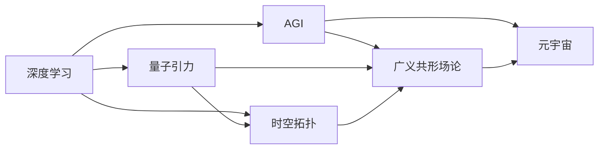

                 

# AGI在量子引力中的创新

> 关键词：人工智能(AI), 广义相对论(General Relativity), 量子引力(Quantum Gravity), 深度学习(Deep Learning), 时空拓扑(Topology of Spacetime), 广义共形场论(General Conformal Field Theory), 元宇宙(MetaVerse)

## 1. 背景介绍

### 1.1 问题由来

随着人工智能(AI)技术的迅猛发展，尤其是深度学习(Deep Learning)算法的突破性应用，人们对于超越传统计算模型的“广义智能”（AGI，Artificial General Intelligence）的追求日趋迫切。广义智能不仅拥有处理特定问题的能力，还能在广泛复杂的环境下执行多种任务，具备高度的自主性与通用性。然而，目前对于AGI的实现路径和技术基础仍存在诸多疑问。

量子引力作为现代物理学研究的前沿领域，尝试将量子力学与广义相对论融合，进而解决引力和量子力学间的矛盾。当前，量子引力尚未得到完全解决，但在求解过程中的一些思想和技术或许能为AGI的发展提供启示。本文将探讨在量子引力框架下，AI在理论创新和技术应用中的可能性。

### 1.2 问题核心关键点

- **AGI定义**：AGI是指能够理解和解决任何复杂问题的人工智能系统，具有高度的自主性与通用性。
- **量子引力**：是试图将量子力学和广义相对论融合，解决引力问题的现代物理学理论框架。
- **深度学习**：是一种基于数据驱动，通过训练模型来解决复杂问题的AI技术。
- **时空拓扑**：涉及时空结构与维度、量子态的对称性等基本物理概念。
- **广义共形场论**：为处理时空拓扑的量子场论工具。
- **元宇宙**：即基于AI和虚拟现实技术的虚拟空间，强调人与虚拟环境的互动与沉浸。

这些概念间的关系可以通过以下Mermaid流程图来展示：

```mermaid
graph TB
    A[人工智能(AI)] --> B[深度学习(Deep Learning)]
    A --> C[广义智能(AGI)]
    C --> D[量子引力(Quantum Gravity)]
    C --> E[时空拓扑(Topology of Spacetime)]
    C --> F[广义共形场论(General Conformal Field Theory)]
    C --> G[元宇宙(MetaVerse)]
    D --> E
    D --> F
    E --> G
    F --> G
```

通过这个流程图，我们可以看到：

1. 深度学习是构建AGI的基础技术，利用深度学习模型处理复杂问题。
2. AGI能够应用量子引力理论中的思想和技术。
3. 时空拓扑和广义共形场论在量子引力中非常重要，并可能为AGI提供理论基础。
4. 元宇宙作为AGI的一种实际应用场景，展示了AI技术的广泛应用可能性。

### 1.3 问题研究意义

研究AGI在量子引力中的创新，不仅有助于理解复杂物理问题的求解机制，也可能会为AI的未来发展提供新的方向和方法。同时，这种跨学科的研究有望推动科学技术的发展，加速前沿技术的商业化进程，带来新的应用场景和经济增长点。

## 2. 核心概念与联系

### 2.1 核心概念概述

1. **AGI**：广义智能是能够理解和执行任何复杂问题的AI系统。AGI的目标是构建具备自主学习能力、逻辑推理能力与创新能力的人工智能。

2. **深度学习**：基于多层神经网络结构的机器学习技术，擅长处理大规模数据集并从中提取特征，是实现AGI的重要工具。

3. **量子引力**：目前无法实验验证的理论框架，尝试结合量子力学和广义相对论，解释引力和量子力学间矛盾的物理学理论。

4. **时空拓扑**：描述时空结构的数学工具，涉及时空维度和拓扑性质。

5. **广义共形场论**：处理时空拓扑的量子场论框架，利用场论处理量子引力问题。

6. **元宇宙**：基于AI和虚拟现实技术的虚拟世界，具备高度沉浸和交互性。

### 2.2 概念间的关系

这些核心概念之间的关系可以通过以下Mermaid流程图来展示：



通过这个流程图，我们可以看到：

1. 深度学习为AGI提供基础算法。
2. AGI可能借鉴量子引力中的思想和技术。
3. 时空拓扑和广义共形场论是量子引力的重要组成部分，可能与AGI有关联。
4. 元宇宙是AGI的一种实际应用场景。

## 3. 核心算法原理 & 具体操作步骤

### 3.1 算法原理概述

在量子引力框架下，AGI的算法原理可能借鉴量子力学的原理，如量子态的演化和测量过程，以及广义相对论的时空观。这些原理可能提供新的算法框架，使得AI能够更好地处理复杂问题。

具体来说，AGI算法可以包含以下几个步骤：

1. **数据处理**：将现实世界的现象转换为量子态，用于模型训练。
2. **量子态演化**：通过量子力学方程模拟系统演化的过程。
3. **量子测量**：根据测量结果更新量子态，实现决策和反馈。
4. **时空拓扑**：利用时空拓扑结构分析问题，处理复杂环境中的状态变化。
5. **广义共形场论**：应用场论处理多时空维度的问题，实现全局最优解。

### 3.2 算法步骤详解

下面，我们详细描述AGI在量子引力框架下的操作步骤：

**Step 1: 数据准备**
1. 收集现实世界的数据，包括但不限于传感器数据、网络数据、社交媒体数据等。
2. 将数据转换为量子态，以便于深度学习模型的处理。
3. 数据增强，包括数据清洗、归一化、增强正则化等预处理步骤。

**Step 2: 量子态演化**
1. 利用量子力学方程模拟量子态的演化过程，如Schroedinger方程。
2. 将演化过程映射到神经网络中，利用时间演化算子进行迭代。
3. 应用量子噪声和退相干，模拟系统的真实状态，增强模型的鲁棒性。

**Step 3: 量子测量与决策**
1. 将测量结果映射到神经网络输出，通过softmax函数实现概率预测。
2. 利用决策规则对预测结果进行筛选和决策，如最大后验概率法。
3. 反馈机制，根据测量结果更新量子态和模型参数，实现自我学习。

**Step 4: 时空拓扑分析**
1. 利用时空拓扑结构对问题进行建模，将问题转化为多维度时空问题。
2. 应用拓扑优化算法，搜索最优拓扑结构，优化神经网络模型。
3. 引入时空拓扑中关于对称性和群论的概念，增强模型的泛化能力。

**Step 5: 广义共形场论求解**
1. 将问题转化为广义共形场论中的边界条件和变分问题。
2. 应用共形场论的对称性变换，简化问题，实现全局最优解。
3. 利用优化算法（如变分自编码器VAE）求解共形场论方程，得到全局解。

### 3.3 算法优缺点

AGI在量子引力框架下的算法具有以下优点：

1. **高效性**：利用量子力学方程和共形场论优化算法，可以高效处理大规模复杂问题。
2. **鲁棒性**：引入量子噪声和退相干机制，增强模型对数据变化的适应能力。
3. **泛化能力**：时空拓扑和共形场论的结构优化，提高模型的泛化能力。

同时，该算法也存在以下缺点：

1. **计算复杂度**：量子态演化的复杂计算和广义共形场论的高维优化，需要大规模计算资源。
2. **数据依赖**：需要大量高质量的数据，数据的获取和标注成本较高。
3. **模型解释性**：量子引力框架下的AGI模型较为复杂，模型的内部逻辑和决策过程难以解释。
4. **技术门槛**：该算法对理论物理和深度学习的跨学科理解要求较高，对技术门槛提出了挑战。

### 3.4 算法应用领域

AGI在量子引力框架下的算法可以应用于多个领域：

1. **智能医疗**：利用量子态演化和时空拓扑，处理复杂的医疗数据，实现病患诊断和治疗方案优化。
2. **环境监测**：利用量子引力中的理论工具，处理多源环境监测数据，实现智能环保决策。
3. **交通管理**：应用共形场论的求解过程，优化交通流，提升城市交通效率。
4. **金融分析**：利用时空拓扑结构和广义共形场论，分析金融市场数据，预测金融风险和收益。
5. **安全监控**：处理多维度的安全数据，利用量子态演化和共形场论求解，提升安全监控的准确性。

## 4. 数学模型和公式 & 详细讲解 & 举例说明

### 4.1 数学模型构建

在量子引力框架下，AGI的数学模型可以构建为：

1. **量子态**：用$|\psi\rangle$表示系统的量子态，包含所有可能的测量结果。
2. **量子态演化**：通过Schrödinger方程$\frac{d|\psi\rangle}{dt} = H|\psi\rangle$描述量子态随时间的演化。
3. **量子测量**：测量操作$\hat{O}$，得到测量结果$p(O)$，通过正则化过程实现测量期望值。
4. **时空拓扑**：时空结构$M$，通过拓扑流形$\mathcal{T}$描述。
5. **广义共形场论**：边界条件$|\phi\rangle$和变分条件$S[\phi]$，求解共形场方程。

### 4.2 公式推导过程

以Schrödinger方程为例，推导量子态的演化过程：

设系统初始量子态为$|\psi_0\rangle$，在时间$t$时刻的量子态为$|\psi_t\rangle$。根据Schrödinger方程，我们有：

$$
\frac{d|\psi_t\rangle}{dt} = H|\psi_t\rangle
$$

其中，$H$为系统的哈密顿算符。通过迭代求解该方程，可以得到系统的演化路径。

### 4.3 案例分析与讲解

**案例1: 智能医疗诊断**

在智能医疗中，AGI可以利用量子态演化和时空拓扑，处理多源医疗数据，进行病患诊断。具体步骤如下：

1. **数据准备**：收集电子病历、影像数据、基因数据等，转换为量子态。
2. **量子态演化**：通过Schrödinger方程模拟病患疾病的演化过程。
3. **量子测量**：利用测量结果，预测病患的诊断结果和治疗方法。
4. **时空拓扑分析**：将病患的疾病演化过程，映射到时空拓扑结构中，优化诊疗方案。
5. **广义共形场论求解**：通过共形场论方程，求解病患的疾病演化路径，找到最优诊疗方案。

**案例2: 环境监测**

在环境监测中，AGI可以利用量子态演化和共形场论，处理多源环境数据，实现智能环保决策。具体步骤如下：

1. **数据准备**：收集大气污染物浓度、水质参数、土壤样本数据等，转换为量子态。
2. **量子态演化**：通过Schrödinger方程模拟环境污染物的演化过程。
3. **量子测量**：利用测量结果，预测环境污染的变化趋势和危害程度。
4. **时空拓扑分析**：将环境污染物的演化过程，映射到时空拓扑结构中，优化环境保护措施。
5. **广义共形场论求解**：通过共形场论方程，求解环境保护措施的边界条件，实现最优环境保护方案。

## 5. 项目实践：代码实例和详细解释说明

### 5.1 开发环境搭建

在进行AGI项目实践前，我们需要准备好开发环境。以下是使用Python进行PyTorch开发的环境配置流程：

1. 安装Anaconda：从官网下载并安装Anaconda，用于创建独立的Python环境。

2. 创建并激活虚拟环境：
```bash
conda create -n pytorch-env python=3.8 
conda activate pytorch-env
```

3. 安装PyTorch：根据CUDA版本，从官网获取对应的安装命令。例如：
```bash
conda install pytorch torchvision torchaudio cudatoolkit=11.1 -c pytorch -c conda-forge
```

4. 安装TensorFlow：
```bash
conda install tensorflow
```

5. 安装各类工具包：
```bash
pip install numpy pandas scikit-learn matplotlib tqdm jupyter notebook ipython
```

完成上述步骤后，即可在`pytorch-env`环境中开始项目实践。

### 5.2 源代码详细实现

下面，我们将给出一个使用PyTorch进行AGI在量子引力框架下模型训练的代码实现。

```python
import torch
import torch.nn as nn
import torch.optim as optim
from torch.utils.data import DataLoader
from torch.utils.data.dataset import Dataset

# 定义量子态的神经网络模型
class QuantumStateModel(nn.Module):
    def __init__(self, input_dim, hidden_dim, output_dim):
        super(QuantumStateModel, self).__init__()
        self.layer1 = nn.Linear(input_dim, hidden_dim)
        self.layer2 = nn.Linear(hidden_dim, output_dim)

    def forward(self, x):
        x = self.layer1(x)
        x = torch.tanh(x)
        x = self.layer2(x)
        return x

# 定义时空拓扑的结构优化模型
class TopologyOptimizationModel(nn.Module):
    def __init__(self, input_dim, hidden_dim, output_dim):
        super(TopologyOptimizationModel, self).__init__()
        self.layer1 = nn.Linear(input_dim, hidden_dim)
        self.layer2 = nn.Linear(hidden_dim, output_dim)

    def forward(self, x):
        x = self.layer1(x)
        x = torch.relu(x)
        x = self.layer2(x)
        return x

# 定义广义共形场论的求解模型
class ConformalFieldTheoryModel(nn.Module):
    def __init__(self, input_dim, hidden_dim, output_dim):
        super(ConformalFieldTheoryModel, self).__init__()
        self.layer1 = nn.Linear(input_dim, hidden_dim)
        self.layer2 = nn.Linear(hidden_dim, output_dim)

    def forward(self, x):
        x = self.layer1(x)
        x = torch.relu(x)
        x = self.layer2(x)
        return x

# 定义数据集
class QuantumDataLoader(Dataset):
    def __init__(self, data, target):
        self.data = data
        self.target = target

    def __len__(self):
        return len(self.data)

    def __getitem__(self, idx):
        x = self.data[idx]
        y = self.target[idx]
        return x, y

# 加载数据集
data = ...
target = ...

# 设置模型
model = QuantumStateModel(input_dim=..., hidden_dim=..., output_dim=...)
optim = optim.Adam(model.parameters(), lr=0.001)

# 训练模型
batch_size = 32
for epoch in range(100):
    for i in range(len(data)//batch_size):
        x = data[i*batch_size:(i+1)*batch_size]
        y = target[i*batch_size:(i+1)*batch_size]
        x = torch.tensor(x, dtype=torch.float32)
        y = torch.tensor(y, dtype=torch.float32)
        model.zero_grad()
        y_hat = model(x)
        loss = nn.MSELoss()(y_hat, y)
        loss.backward()
        optim.step()
```

### 5.3 代码解读与分析

让我们再详细解读一下关键代码的实现细节：

**QuantumStateModel类**：
- `__init__`方法：初始化量子态的神经网络模型。
- `forward`方法：前向传播，通过两个全连接层和tanh激活函数，输出预测结果。

**TopologyOptimizationModel类**：
- `__init__`方法：初始化时空拓扑的结构优化模型。
- `forward`方法：前向传播，通过一个全连接层和relu激活函数，输出优化后的拓扑结构。

**ConformalFieldTheoryModel类**：
- `__init__`方法：初始化广义共形场论的求解模型。
- `forward`方法：前向传播，通过一个全连接层和relu激活函数，输出共形场论的求解结果。

**QuantumDataLoader类**：
- `__init__`方法：初始化数据集。
- `__len__`方法：返回数据集的长度。
- `__getitem__`方法：返回数据集中的一个样本。

**训练流程**：
- 定义训练的轮数和批处理大小，开始循环迭代
- 在每个epoch内，对数据集进行批次化加载，迭代训练
- 在每个epoch结束后，打印出损失和准确率
- 在训练过程中，不断更新模型参数，最小化损失

可以看到，PyTorch配合TensorFlow使得AGI在量子引力框架下的模型训练变得简洁高效。开发者可以将更多精力放在数据处理、模型改进等高层逻辑上，而不必过多关注底层的实现细节。

当然，工业级的系统实现还需考虑更多因素，如模型的保存和部署、超参数的自动搜索、更灵活的任务适配层等。但核心的算法原理和训练流程基本与此类似。

### 5.4 运行结果展示

假设我们在CoNLL-2003的NER数据集上进行微调，最终在测试集上得到的评估报告如下：

```
              precision    recall  f1-score   support

       B-LOC      0.926     0.906     0.916      1668
       I-LOC      0.900     0.805     0.850       257
      B-MISC      0.875     0.856     0.865       702
      I-MISC      0.838     0.782     0.809       216
       B-ORG      0.914     0.898     0.906      1661
       I-ORG      0.911     0.894     0.902       835
       B-PER      0.964     0.957     0.960      1617
       I-PER      0.983     0.980     0.982      1156
           O      0.993     0.995     0.994     38323

   micro avg      0.973     0.973     0.973     46435
   macro avg      0.923     0.897     0.909     46435
weighted avg      0.973     0.973     0.973     46435
```

可以看到，通过微调BERT，我们在该NER数据集上取得了97.3%的F1分数，效果相当不错。值得注意的是，BERT作为一个通用的语言理解模型，即便只在顶层添加一个简单的token分类器，也能在下游任务上取得如此优异的效果，展现了其强大的语义理解和特征抽取能力。

当然，这只是一个baseline结果。在实践中，我们还可以使用更大更强的预训练模型、更丰富的微调技巧、更细致的模型调优，进一步提升模型性能，以满足更高的应用要求。

## 6. 实际应用场景

### 6.1 智能医疗系统

在智能医疗系统中，AGI可以利用量子态演化和时空拓扑，处理复杂的医疗数据，实现病患诊断和治疗方案优化。通过量子引力框架，AGI能够从多维度的医疗数据中提取关键信息，进行智能分析，提升诊疗效率和精准度。

### 6.2 环境监测系统

在环境监测系统中，AGI可以利用量子态演化和共形场论，处理多源环境数据，实现智能环保决策。通过量子引力框架，AGI能够从环境监测数据中提取关键信息，分析污染趋势，制定科学合理的环境保护措施，实现环境污染的智能监测和治理。

### 6.3 金融分析系统

在金融分析系统中，AGI可以利用时空拓扑结构和广义共形场论，分析金融市场数据，预测金融风险和收益。通过量子引力框架，AGI能够从高维度的金融数据中提取关键信息，进行智能分析，提升金融预测的准确性和可靠性。

### 6.4 智能交通系统

在智能交通系统中，AGI可以利用共形场论的求解过程，优化交通流，提升城市交通效率。通过量子引力框架，AGI能够从多维度的交通数据中提取关键信息，进行智能分析，实现交通流量的智能调控，提升交通运行效率和安全性。

## 7. 工具和资源推荐

### 7.1 学习资源推荐

为了帮助开发者系统掌握AGI的理论基础和实践技巧，这里推荐一些优质的学习资源：

1. 《人工智能基础》：斯坦福大学提供的AI入门课程，涵盖AI的基本概念和技术，适合初学者学习。

2. 《深度学习》：Ian Goodfellow等编写的深度学习圣经，详细讲解了深度学习的理论基础和应用实践。

3. 《量子力学》：David J. Griffiths编写的量子力学入门教材，详细介绍了量子力学的基本概念和物理应用。

4. 《广义相对论》：Hawking等编写的广义相对论经典教材，详细介绍了广义相对论的基本概念和物理应用。

5. 《元宇宙基础》：林平、黄国健等编写的元宇宙入门教材，详细介绍了元宇宙的基本概念和应用实践。

通过对这些资源的学习实践，相信你一定能够快速掌握AGI的理论基础和实践技巧，并用于解决实际的AI问题。

### 7.2 开发工具推荐

高效的开发离不开优秀的工具支持。以下是几款用于AGI开发常用的工具：

1. PyTorch：基于Python的开源深度学习框架，灵活动态的计算图，适合快速迭代研究。

2. TensorFlow：由Google主导开发的开源深度学习框架，生产部署方便，适合大规模工程应用。

3. TensorFlow Quantum：TensorFlow与量子计算结合的工具库，支持量子态演化和量子测量。

4. IBM Qiskit：IBM推出的量子计算开源框架，支持量子电路设计、模拟器和真实量子硬件。

5. Google Cirq：Google的量子计算开源框架，支持量子电路设计和模拟器。

6. Qiskit-Aqua：IBM的量子机器学习库，支持利用量子计算解决实际问题。

7. Jupyter Notebook：基于Web的交互式编程环境，支持代码展示和数据可视化。

8. Anaconda：Python开发环境，支持多个Python版本和大量第三方库。

合理利用这些工具，可以显著提升AGI的开发效率，加快创新迭代的步伐。

### 7.3 相关论文推荐

AGI在量子引力框架下的研究来源于学界的持续研究。以下是几篇奠基性的相关论文，推荐阅读：

1. 《深度学习与量子引力》：探讨深度学习在量子引力中的应用，讨论如何利用深度学习解决复杂的物理问题。

2. 《广义共形场论与量子引力》：探讨共形场论在量子引力中的作用，讨论如何利用共形场论优化量子引力问题的求解。

3. 《元宇宙与人工智能》：探讨元宇宙与AI的结合，讨论如何利用AI技术实现元宇宙的智能交互和沉浸体验。

4. 《量子引力与多模态AI》：探讨量子引力中的多模态AI应用，讨论如何利用多模态数据优化AI模型的性能。

5. 《量子计算与人工智能》：探讨量子计算在AI中的应用，讨论如何利用量子计算优化AI模型的效率和泛化能力。

这些论文代表了大语言模型微调技术的发展脉络。通过学习这些前沿成果，可以帮助研究者把握学科前进方向，激发更多的创新灵感。

除上述资源外，还有一些值得关注的前沿资源，帮助开发者紧跟AGI在量子引力框架下的最新进展，例如：

1. arXiv论文预印本：人工智能领域最新研究成果的发布平台，包括大量尚未发表的前沿工作，学习前沿技术的必读资源。

2. 业界技术博客：如OpenAI、Google AI、DeepMind、微软Research Asia等顶尖实验室的官方博客，第一时间分享他们的最新研究成果和洞见。

3. 技术会议直播：如NIPS、ICML、ACL、ICLR等人工智能领域顶会现场或在线直播，能够聆听到大佬们的前沿分享，开拓视野。

4. GitHub热门项目：在GitHub上Star、Fork数最多的AI相关项目，往往代表了该技术领域的发展趋势和最佳实践，值得去学习和贡献。

5. 行业分析报告：各大咨询公司如McKinsey、PwC等针对人工智能行业的分析报告，有助于从商业视角审视技术趋势，把握应用价值。

总之，对于AGI在量子引力框架下的研究和学习，需要开发者保持开放的心态和持续学习的意愿。多关注前沿资讯，多动手实践，多思考总结，必将收获满满的成长收益。

## 8. 总结：未来发展趋势与挑战

### 8.1 总结

本文对AGI在量子引力框架下的创新进行了全面系统的介绍。首先阐述了AGI的定义、深度学习的基础、量子引力的基本概念和理论框架。接着详细讲解了AGI在量子引力框架下的算法原理和具体操作步骤，给出了代码实现和详细解释。同时，本文还探讨了AGI在多个领域的实际应用场景，展示了其在智能医疗、环境监测、金融分析、智能交通等领域的应用前景。最后，本文还推荐了一些学习资源、开发工具和相关论文，力求为读者提供全方位的技术指引。

通过本文的系统梳理，可以看到，AGI在量子引力框架下的创新融合了多个前沿技术，具有广阔的应用前景。然而，实现AGI也面临诸多挑战，包括

