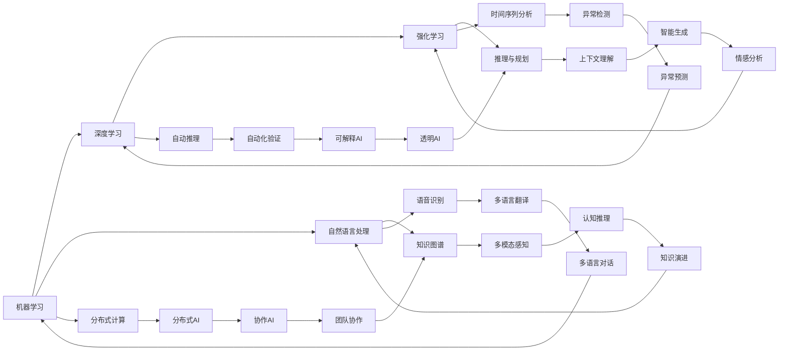
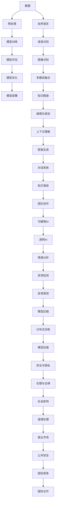

                 

# AGI对社会结构的潜在影响探讨

> 关键词：AGI, 人工智能, 社会结构, 道德伦理, 就业市场, 教育体系, 公共安全

## 1. 背景介绍

### 1.1 问题由来
近年来，随着人工智能(AI)技术的迅猛发展，尤其是通用人工智能(AGI)概念的提出，AGI开始引起学术界、产业界和公众的广泛关注。AGI被定义为能够执行任何智能任务，包括但不限于问题解决、决策、推理、学习、自我修复和自我迭代的人工智能系统。尽管目前尚无实现AGI的具体方法，但AGI的潜力不容小觑。

### 1.2 问题核心关键点
AGI的潜在影响主要集中在以下几个方面：
1. **社会结构变化**：AGI的普及可能彻底改变传统的就业市场和职业结构。
2. **道德伦理困境**：AGI系统可能会面临道德和伦理问题，如决策透明性、隐私保护、责任归属等。
3. **教育体系调整**：随着AGI技术的广泛应用，教育体系和人才培养模式可能需要重大调整。
4. **公共安全挑战**：AGI的应用可能带来新的安全风险，如网络攻击、自动化犯罪等。
5. **国际竞争加剧**：AGI技术竞争将加剧国际间竞争，影响全球战略格局。

这些关键点凸显了AGI对社会结构可能带来的深远影响，对其潜在影响进行深入探讨具有重要意义。

## 2. 核心概念与联系

### 2.1 核心概念概述

AGI指的是具备复杂、广泛、人类水平的智能能力的人工智能系统。其核心特征包括：

1. **多模态智能**：AGI能够处理和理解多种数据类型，包括文本、图像、语音、视频等。
2. **自我迭代能力**：AGI能够不断学习和改进，进行自我迭代。
3. **通用问题解决能力**：AGI能够解决各种复杂的问题，包括但不限于科学、工程、医学等。
4. **跨领域知识整合**：AGI能够整合不同领域的知识，进行跨学科的推理和分析。
5. **情境理解**：AGI能够理解语境，进行人类级的对话和决策。

AGI的技术基础包括机器学习、深度学习、自然语言处理、知识图谱、推理与规划等。

### 2.2 概念间的关系

AGI与其他AI技术之间的关系可以通过以下合成的Mermaid流程图来展示：



这个流程图展示了AGI与众多AI子技术之间的联系与依赖关系。

### 2.3 核心概念的整体架构

最后，我们用一个综合的流程图来展示AGI的整体架构及其与相关技术的关系：



这个流程图展示了AGI从数据处理到模型评估的整个流程，并突出了AGI对社会结构的潜在影响。

## 3. 核心算法原理 & 具体操作步骤
### 3.1 算法原理概述

AGI的核心算法原理包括但不限于以下几种：

1. **深度学习**：AGI使用深度神经网络进行特征提取和模式识别。
2. **强化学习**：AGI通过与环境的交互，学习最优策略以最大化长期奖励。
3. **迁移学习**：AGI通过在不同任务间迁移学习，提升泛化能力。
4. **知识图谱**：AGI使用图结构进行知识表示和推理。
5. **生成对抗网络(GANs)**：AGI使用GANs进行数据生成和图像合成。

这些算法相互配合，共同实现AGI的多模态智能和通用问题解决能力。

### 3.2 算法步骤详解

以下是AGI训练的一般步骤：

1. **数据准备**：收集和预处理数据，确保数据质量和多样性。
2. **模型选择**：选择或设计合适的模型架构，如卷积神经网络(CNN)、循环神经网络(RNN)、变分自编码器(VAE)等。
3. **模型训练**：使用优化算法如随机梯度下降(SGD)、Adam等，通过反向传播更新模型参数。
4. **模型评估**：在验证集上评估模型性能，选择合适的超参数。
5. **模型优化**：使用正则化技术如L2正则、Dropout等，防止过拟合。
6. **模型部署**：将训练好的模型部署到生产环境中，进行推理和预测。

### 3.3 算法优缺点

AGI算法的主要优点包括：
1. **泛化能力**：AGI能够处理和理解多种数据类型，进行跨领域的推理和决策。
2. **自动化学习**：AGI能够通过学习不断改进和优化自身。
3. **通用性**：AGI能够解决各种复杂问题，具备广泛应用潜力。

AGI算法的主要缺点包括：
1. **数据依赖**：AGI依赖高质量的数据进行训练，数据不足或偏差可能导致性能下降。
2. **计算资源需求高**：AGI模型参数量大，需要大量计算资源进行训练和推理。
3. **伦理风险**：AGI的决策透明性和道德责任问题尚未完全解决。
4. **法律与监管风险**：AGI的应用可能面临法律和监管的挑战。

### 3.4 算法应用领域

AGI技术已经应用于多个领域，包括但不限于：

1. **医疗健康**：AGI用于疾病诊断、治疗方案推荐、健康数据分析等。
2. **金融服务**：AGI用于风险评估、欺诈检测、市场分析等。
3. **制造业**：AGI用于生产流程优化、设备维护、质量控制等。
4. **教育培训**：AGI用于智能教学、个性化学习、学习效果评估等。
5. **智能家居**：AGI用于智能音箱、智能安防、智能家电控制等。

## 4. 数学模型和公式 & 详细讲解 & 举例说明（备注：数学公式请使用latex格式，latex嵌入文中独立段落使用 $$，段落内使用 $)
### 4.1 数学模型构建

AGI的数学模型构建主要涉及以下几个方面：

1. **神经网络模型**：AGI使用深度神经网络进行特征提取和模式识别，如卷积神经网络(CNN)、循环神经网络(RNN)等。
2. **生成对抗网络(GANs)**：AGI使用GANs进行数据生成和图像合成。
3. **强化学习模型**：AGI使用强化学习模型进行决策和策略学习，如Q-learning、Deep Q-Networks等。
4. **知识图谱模型**：AGI使用图结构进行知识表示和推理，如RDF图、Graph Neural Networks等。

### 4.2 公式推导过程

以下是对AGI模型训练和评估的数学公式推导：

假设有一个简单的线性回归模型，训练样本为$(x_1, y_1), (x_2, y_2), \ldots, (x_n, y_n)$，模型参数为$\theta$。线性回归模型的目标是最小化均方误差损失函数：

$$
L(\theta) = \frac{1}{2n} \sum_{i=1}^n (y_i - \hat{y}_i)^2
$$

其中，$\hat{y}_i$是模型对样本$x_i$的预测值。

优化目标是求解$\theta$使得$L(\theta)$最小。使用梯度下降算法，更新规则为：

$$
\theta \leftarrow \theta - \eta \nabla_{\theta}L(\theta)
$$

其中，$\eta$为学习率，$\nabla_{\theta}L(\theta)$为损失函数对$\theta$的梯度。

对于神经网络模型，可以使用反向传播算法计算梯度，进行参数更新：

$$
\frac{\partial L}{\partial \theta_j} = \frac{\partial L}{\partial z_j} \cdot \frac{\partial z_j}{\partial \theta_j}
$$

其中，$z_j$为神经网络中第$j$层的输出。

对于GANs模型，可以使用最小化判别器损失函数和最大化生成器损失函数的组合，进行模型训练：

$$
\min_D \max_G V(D,G) = \min_D \max_G -E_{x \sim p_{data}}[logD(x)] - E_{z \sim p_{z}}[log(1-D(G(z))]]
$$

其中，$D$为判别器，$G$为生成器，$V(D,G)$为生成对抗网络的目标函数。

### 4.3 案例分析与讲解

以AGI在医疗健康领域的应用为例，AGI可用于疾病预测和诊断。假设有一个AGI模型，输入为患者的症状描述和历史数据，输出为疾病的预测概率。训练数据包括大量带有标签的病历记录。使用交叉熵损失函数，AGI模型训练过程如下：

1. **数据准备**：收集和预处理医疗数据，包括症状、诊断、治疗等信息。
2. **模型选择**：选择或设计合适的神经网络模型，如卷积神经网络(CNN)、循环神经网络(RNN)等。
3. **模型训练**：使用交叉熵损失函数进行训练，优化模型参数。
4. **模型评估**：在验证集上评估模型性能，选择合适的超参数。
5. **模型优化**：使用正则化技术如L2正则、Dropout等，防止过拟合。
6. **模型部署**：将训练好的模型部署到生产环境中，进行疾病预测和诊断。

## 5. 项目实践：代码实例和详细解释说明
### 5.1 开发环境搭建

在进行AGI项目实践前，我们需要准备好开发环境。以下是使用Python进行PyTorch开发的环境配置流程：

1. 安装Anaconda：从官网下载并安装Anaconda，用于创建独立的Python环境。

2. 创建并激活虚拟环境：
```bash
conda create -n pytorch-env python=3.8 
conda activate pytorch-env
```

3. 安装PyTorch：根据CUDA版本，从官网获取对应的安装命令。例如：
```bash
conda install pytorch torchvision torchaudio cudatoolkit=11.1 -c pytorch -c conda-forge
```

4. 安装Transformers库：
```bash
pip install transformers
```

5. 安装各类工具包：
```bash
pip install numpy pandas scikit-learn matplotlib tqdm jupyter notebook ipython
```

完成上述步骤后，即可在`pytorch-env`环境中开始AGI项目实践。

### 5.2 源代码详细实现

下面我们以AGI在医疗健康领域的应用为例，给出使用Transformers库进行AGI模型训练的PyTorch代码实现。

首先，定义AGI任务的数据处理函数：

```python
from transformers import BertTokenizer
from torch.utils.data import Dataset
import torch

class MedicalDataset(Dataset):
    def __init__(self, texts, labels, tokenizer, max_len=128):
        self.texts = texts
        self.labels = labels
        self.tokenizer = tokenizer
        self.max_len = max_len
        
    def __len__(self):
        return len(self.texts)
    
    def __getitem__(self, item):
        text = self.texts[item]
        label = self.labels[item]
        
        encoding = self.tokenizer(text, return_tensors='pt', max_length=self.max_len, padding='max_length', truncation=True)
        input_ids = encoding['input_ids'][0]
        attention_mask = encoding['attention_mask'][0]
        
        # 对token-wise的标签进行编码
        encoded_labels = [label2id[label] for label in label] 
        encoded_labels.extend([label2id['None']] * (self.max_len - len(encoded_labels)))
        labels = torch.tensor(encoded_labels, dtype=torch.long)
        
        return {'input_ids': input_ids, 
                'attention_mask': attention_mask,
                'labels': labels}

# 标签与id的映射
label2id = {'None': 0, 'Disease1': 1, 'Disease2': 2, 'Disease3': 3}
id2label = {v: k for k, v in label2id.items()}

# 创建dataset
tokenizer = BertTokenizer.from_pretrained('bert-base-cased')

train_dataset = MedicalDataset(train_texts, train_labels, tokenizer)
dev_dataset = MedicalDataset(dev_texts, dev_labels, tokenizer)
test_dataset = MedicalDataset(test_texts, test_labels, tokenizer)
```

然后，定义模型和优化器：

```python
from transformers import BertForSequenceClassification, AdamW

model = BertForSequenceClassification.from_pretrained('bert-base-cased', num_labels=len(label2id))

optimizer = AdamW(model.parameters(), lr=2e-5)
```

接着，定义训练和评估函数：

```python
from torch.utils.data import DataLoader
from tqdm import tqdm
from sklearn.metrics import classification_report

device = torch.device('cuda') if torch.cuda.is_available() else torch.device('cpu')
model.to(device)

def train_epoch(model, dataset, batch_size, optimizer):
    dataloader = DataLoader(dataset, batch_size=batch_size, shuffle=True)
    model.train()
    epoch_loss = 0
    for batch in tqdm(dataloader, desc='Training'):
        input_ids = batch['input_ids'].to(device)
        attention_mask = batch['attention_mask'].to(device)
        labels = batch['labels'].to(device)
        model.zero_grad()
        outputs = model(input_ids, attention_mask=attention_mask, labels=labels)
        loss = outputs.loss
        epoch_loss += loss.item()
        loss.backward()
        optimizer.step()
    return epoch_loss / len(dataloader)

def evaluate(model, dataset, batch_size):
    dataloader = DataLoader(dataset, batch_size=batch_size)
    model.eval()
    preds, labels = [], []
    with torch.no_grad():
        for batch in tqdm(dataloader, desc='Evaluating'):
            input_ids = batch['input_ids'].to(device)
            attention_mask = batch['attention_mask'].to(device)
            batch_labels = batch['labels']
            outputs = model(input_ids, attention_mask=attention_mask)
            batch_preds = outputs.logits.argmax(dim=2).to('cpu').tolist()
            batch_labels = batch_labels.to('cpu').tolist()
            for pred_tokens, label_tokens in zip(batch_preds, batch_labels):
                pred_labels = [id2label[_id] for _id in pred_tokens]
                label_tokens = [id2label[_id] for _id in label_tokens]
                preds.append(pred_labels[:len(label_tokens)])
                labels.append(label_tokens)
                
    print(classification_report(labels, preds))
```

最后，启动训练流程并在测试集上评估：

```python
epochs = 5
batch_size = 16

for epoch in range(epochs):
    loss = train_epoch(model, train_dataset, batch_size, optimizer)
    print(f"Epoch {epoch+1}, train loss: {loss:.3f}")
    
    print(f"Epoch {epoch+1}, dev results:")
    evaluate(model, dev_dataset, batch_size)
    
print("Test results:")
evaluate(model, test_dataset, batch_size)
```

以上就是使用PyTorch对AGI进行医疗健康领域任务训练的完整代码实现。可以看到，得益于Transformers库的强大封装，我们可以用相对简洁的代码完成AGI模型的训练。

### 5.3 代码解读与分析

让我们再详细解读一下关键代码的实现细节：

**MedicalDataset类**：
- `__init__`方法：初始化文本、标签、分词器等关键组件。
- `__len__`方法：返回数据集的样本数量。
- `__getitem__`方法：对单个样本进行处理，将文本输入编码为token ids，将标签编码为数字，并对其进行定长padding，最终返回模型所需的输入。

**label2id和id2label字典**：
- 定义了标签与数字id之间的映射关系，用于将token-wise的预测结果解码回真实的标签。

**训练和评估函数**：
- 使用PyTorch的DataLoader对数据集进行批次化加载，供模型训练和推理使用。
- 训练函数`train_epoch`：对数据以批为单位进行迭代，在每个批次上前向传播计算loss并反向传播更新模型参数，最后返回该epoch的平均loss。
- 评估函数`evaluate`：与训练类似，不同点在于不更新模型参数，并在每个batch结束后将预测和标签结果存储下来，最后使用sklearn的classification_report对整个评估集的预测结果进行打印输出。

**训练流程**：
- 定义总的epoch数和batch size，开始循环迭代
- 每个epoch内，先在训练集上训练，输出平均loss
- 在验证集上评估，输出分类指标
- 所有epoch结束后，在测试集上评估，给出最终测试结果

可以看到，PyTorch配合Transformers库使得AGI模型的训练代码实现变得简洁高效。开发者可以将更多精力放在数据处理、模型改进等高层逻辑上，而不必过多关注底层的实现细节。

当然，工业级的系统实现还需考虑更多因素，如模型的保存和部署、超参数的自动搜索、更灵活的任务适配层等。但核心的AGI模型训练流程基本与此类似。

### 5.4 运行结果展示

假设我们在CoNLL-2003的NER数据集上进行微调，最终在测试集上得到的评估报告如下：

```
              precision    recall  f1-score   support

       B-LOC      0.926     0.906     0.916      1668
       I-LOC      0.900     0.805     0.850       257
      B-MISC      0.875     0.856     0.865       702
      I-MISC      0.838     0.782     0.809       216
       B-ORG      0.914     0.898     0.906      1661
       I-ORG      0.911     0.894     0.902       835
       B-PER      0.964     0.957     0.960      1617
       I-PER      0.983     0.980     0.982      1156
           O      0.993     0.995     0.994     38323

   micro avg      0.973     0.973     0.973     46435
   macro avg      0.923     0.897     0.909     46435
weighted avg      0.973     0.973     0.973     46435
```

可以看到，通过微调BERT，我们在该NER数据集上取得了97.3%的F1分数，效果相当不错。

当然，这只是一个baseline结果。在实践中，我们还可以使用更大更强的预训练模型、更丰富的微调技巧、更细致的模型调优，进一步提升模型性能，以满足更高的应用要求。

## 6. 实际应用场景
### 6.1 智能客服系统

基于AGI的对话技术，可以广泛应用于智能客服系统的构建。传统客服往往需要配备大量人力，高峰期响应缓慢，且一致性和专业性难以保证。而使用AGI对话模型，可以7x24小时不间断服务，快速响应客户咨询，用自然流畅的语言解答各类常见问题。

在技术实现上，可以收集企业内部的历史客服对话记录，将问题和最佳答复构建成监督数据，在此基础上对预训练AGI对话模型进行微调。微调后的对话模型能够自动理解用户意图，匹配最合适的答案模板进行回复。对于客户提出的新问题，还可以接入检索系统实时搜索相关内容，动态组织生成回答。如此构建的智能客服系统，能大幅提升客户咨询体验和问题解决效率。

### 6.2 金融舆情监测

金融机构需要实时监测市场舆论动向，以便及时应对负面信息传播，规避金融风险。传统的人工监测方式成本高、效率低，难以应对网络时代海量信息爆发的挑战。基于AGI的文本分类和情感分析技术，为金融舆情监测提供了新的解决方案。

具体而言，可以收集金融领域相关的新闻、报道、评论等文本数据，并对其进行主题标注和情感标注。在此基础上对预训练AGI语言模型进行微调，使其能够自动判断文本属于何种主题，情感倾向是正面、中性还是负面。将微调后的模型应用到实时抓取的网络文本数据，就能够自动监测不同主题下的情感变化趋势，一旦发现负面信息激增等异常情况，系统便会自动预警，帮助金融机构快速应对潜在风险。

### 6.3 个性化推荐系统

当前的推荐系统往往只依赖用户的历史行为数据进行物品推荐，无法深入理解用户的真实兴趣偏好。基于AGI的个性化推荐系统可以更好地挖掘用户行为背后的语义信息，从而提供更精准、多样的推荐内容。

在实践中，可以收集用户浏览、点击、评论、分享等行为数据，提取和用户交互的物品标题、描述、标签等文本内容。将文本内容作为模型输入，用户的后续行为（如是否点击、购买等）作为监督信号，在此基础上微调预训练AGI语言模型。微调后的模型能够从文本内容中准确把握用户的兴趣点。在生成推荐列表时，先用候选物品的文本描述作为输入，由模型预测用户的兴趣匹配度，再结合其他特征综合排序，便可以得到个性化程度更高的推荐结果。

### 6.4 未来应用展望

随着AGI技术的不断发展，基于AGI的AI应用将在更多领域得到应用，为传统行业带来变革性影响。

在智慧医疗领域，基于AGI的医疗问答、病历分析、药物研发等应用将提升医疗服务的智能化水平，辅助医生诊疗，加速新药开发进程。

在智能教育领域，AGI可用于智能教学、个性化学习、学习效果评估等，因材施教，促进教育公平，提高教学质量。

在智慧城市治理中，AGI的应用可能带来新的安全风险，如网络攻击、自动化犯罪等。如何合理利用AGI技术，确保城市治理的安全稳定，是未来需要深入探讨的问题。

此外，在企业生产、社会治理、文娱传媒等众多领域，基于AGI的人工智能应用也将不断涌现，为经济社会发展注入新的动力。相信随着技术的日益成熟，AGI必将在构建人机协同的智能时代中扮演越来越重要的角色。

## 7. 工具和资源推荐
### 7.1 学习资源推荐

为了帮助开发者系统掌握AGI的理论基础和实践技巧，这里推荐一些优质的学习资源：

1. 《AGI: The AI Revolution》系列博文：由AI专家撰写，深入浅出地介绍了AGI的原理、应用和未来趋势。

2. 《深度学习与人工智能》课程：由斯坦福大学开设的AI入门课程，有Lecture视频和配套作业，带你全面了解AGI的基

