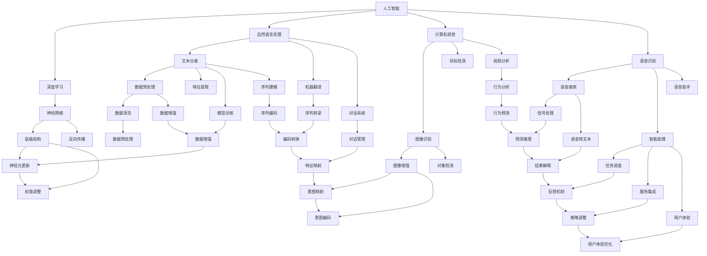
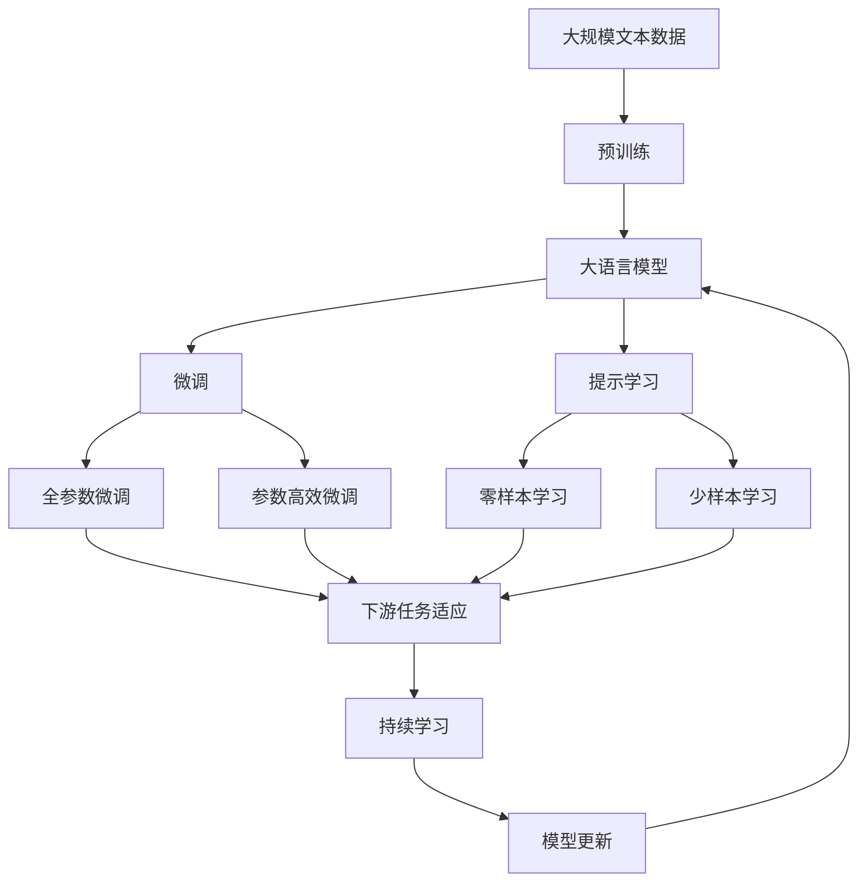

                 

# AI 2.0 时代的未来人类

## 1. 背景介绍

### 1.1 问题由来

随着人工智能(AI)技术的飞速发展，我们正逐渐步入AI 2.0时代，即人工智能技术开始大规模渗透和应用到各行各业。AI 2.0不仅意味着技术手段的进步，更象征着人类社会的深度变革。在这个时代，AI将不仅作为工具提升效率，更将成为改变世界的力量。然而，这种变革带来机遇的同时，也伴随着一系列前所未有的挑战。我们必须全面理解和应对这些挑战，才能在AI 2.0时代迎接更加光明的未来。

### 1.2 问题核心关键点

AI 2.0时代的核心在于技术的深度融合和广泛应用，其关键点包括：

- **技术革新**：AI技术在深度学习、自然语言处理、计算机视觉、语音识别等方面的突破性进展，使得机器学习模型更加强大和智能。
- **数据革命**：大数据和云计算的结合，使得AI模型可以处理海量数据，提取丰富的特征，进行更精准的预测和决策。
- **人机协同**：AI技术与人类的互动越来越紧密，从简单的自动化工具到智能助手，再到能与人类协作的智能体，AI的发展进入新阶段。
- **伦理和社会影响**：AI技术的广泛应用，将带来伦理、就业、隐私、安全等诸多社会问题，需要从技术、政策和法律等多个层面进行综合考量。

这些关键点共同构成了AI 2.0时代的核心特征，为我们描绘出未来社会的全景图。

### 1.3 问题研究意义

研究AI 2.0时代的未来人类，对于理解AI技术的潜在影响、制定合理的政策法规、推动社会和谐发展具有重要意义：

- **技术理解**：通过深入分析AI技术的工作原理和应用场景，帮助我们更好地理解技术的潜力与局限。
- **社会反思**：探讨AI技术的广泛应用对人类社会结构、工作模式、伦理道德等方面带来的影响，引发社会各界深入思考。
- **政策制定**：为政府和企业提供决策依据，帮助他们制定合理的AI发展战略和政策法规。
- **人机协作**：推动人机协同工作模式，提升工作效率和生活质量，促进科技与社会的深度融合。

## 2. 核心概念与联系

### 2.1 核心概念概述

要全面理解AI 2.0时代的未来人类，首先需要梳理其核心概念和相互关系：

- **人工智能**：指通过算法和计算，使机器具备类似于人类的智能，能够进行感知、学习、推理、决策等活动。
- **深度学习**：一种机器学习的方法，通过构建深层神经网络，实现对复杂模式和结构的学习。
- **自然语言处理**：使机器能够理解和生成人类语言的技术，包括文本分类、机器翻译、对话系统等。
- **计算机视觉**：使机器能够识别和理解图像和视频中的内容，应用于图像识别、目标检测、视频分析等。
- **语音识别**：使机器能够识别和理解人类的语音，应用于智能助理、语音助手、语音搜索等。
- **伦理与道德**：AI技术的应用涉及伦理和道德问题，如隐私保护、算法偏见、自动化就业等。
- **人机协同**：AI技术与人类的合作模式，包括自动化工具、智能助手、协作机器人等。

这些概念之间的逻辑关系可以通过以下Mermaid流程图来展示：



这个流程图展示了各个概念之间的联系和交互关系，帮助我们理解AI 2.0时代的技术生态和应用场景。

### 2.2 概念间的关系

这些核心概念之间存在着紧密的联系，形成了AI 2.0时代的完整生态系统。下面我们通过几个Mermaid流程图来展示这些概念之间的关系：

#### 2.2.1 AI技术的应用范围

```mermaid
graph LR
    A[人工智能] --> B[自动化工具]
    A --> C[智能助手]
    A --> D[协作机器人]
    B --> E[任务自动化]
    C --> F[语音交互]
    C --> G[视觉识别]
    D --> H[人机协同工作]
    E --> I[流程优化]
    F --> J[语音搜索]
    G --> K[图像分类]
    H --> L[人机协作]
    I --> M[效率提升]
    J --> N[交互反馈]
    K --> O[内容理解]
    L --> P[任务分配]
    M --> Q[工作改进]
    N --> R[用户体验]
    O --> S[信息提取]
    P --> T[资源分配]
    Q --> U[工作流程]
    R --> V[用户满意度]
    S --> W[信息管理]
    T --> X[资源优化]
    U --> Y[任务调度]
    V --> Z[用户反馈]
    W --> $[数据整合]
    X --> [数据优化]
    Y --> [任务编排]
    Z --> [用户反馈]
```

这个流程图展示了AI技术在不同领域的应用，以及它们如何通过协作和优化提升人类工作和生活质量。

#### 2.2.2 AI伦理的考量

```mermaid
graph LR
    A[人工智能] --> B[隐私保护]
    A --> C[算法偏见]
    A --> D[自动化就业]
    B --> E[数据安全]
    C --> F[公平性]
    C --> G[透明性]
    D --> H[就业影响]
    D --> I[公平分配]
    E --> J[数据管理]
    F --> K[决策透明]
    F --> L[模型解释]
    G --> M[算法公正]
    H --> N[就业保障]
    I --> O[资源分配]
    J --> P[数据治理]
    K --> Q[决策透明性]
    L --> R[解释可理解]
    M --> S[模型公正性]
    N --> T[社会保障]
    O --> U[资源公平]
    P --> V[数据管理策略]
    Q --> W[决策透明度]
    R --> X[解释清晰度]
    S --> Y[算法公平]
    T --> Z[政策制定]
    U --> [资源分配]
    V --> [$[数据管理]
    W --> [决策透明]
    X --> [解释清晰]
    Y --> [算法公平]
    Z --> [政策制定]
```

这个流程图展示了AI伦理在多个方面的考量，如隐私保护、算法偏见、自动化就业等，以及如何通过技术和管理手段解决这些问题。

#### 2.2.3 人机协同的交互模型

```mermaid
graph LR
    A[人工智能] --> B[智能助理]
    A --> C[协作机器人]
    B --> D[任务执行]
    B --> E[决策支持]
    C --> F[协同工作]
    C --> G[任务协调]
    D --> H[任务执行]
    E --> I[决策辅助]
    F --> J[协同任务]
    G --> K[任务协调]
    H --> L[任务执行]
    I --> M[决策辅助]
    J --> N[协同任务]
    K --> O[任务协调]
    L --> P[任务执行]
    M --> Q[决策辅助]
    N --> R[协同任务]
    O --> S[任务协调]
    P --> T[任务执行]
    Q --> U[决策辅助]
    R --> V[协同任务]
    S --> W[任务协调]
    T --> X[任务执行]
    U --> Y[决策辅助]
    V --> Z[协同任务]
    W --> [任务协调]
    X --> [$[任务执行]
    Y --> [决策辅助]
    Z --> [协同任务]
```

这个流程图展示了人机协同的交互模型，即AI如何与人类协同工作，提升效率和质量。

### 2.3 核心概念的整体架构

最后，我们用一个综合的流程图来展示这些核心概念在大语言模型微调过程中的整体架构：



这个综合流程图展示了从预训练到微调，再到持续学习的完整过程。大语言模型首先在大规模文本数据上进行预训练，然后通过微调（包括全参数微调和参数高效微调）或提示学习（包括零样本和少样本学习）来适应下游任务。最后，通过持续学习技术，模型可以不断更新和适应新的任务和数据。 通过这些流程图，我们可以更清晰地理解AI 2.0时代的技术生态和应用场景，为后续深入讨论具体的微调方法和技术奠定基础。

## 3. 核心算法原理 & 具体操作步骤
### 3.1 算法原理概述

AI 2.0时代的核心算法原理主要围绕深度学习、自然语言处理、计算机视觉、语音识别等技术展开。深度学习通过构建深层神经网络，实现对复杂模式和结构的学习。自然语言处理使机器能够理解和生成人类语言，应用于文本分类、机器翻译、对话系统等。计算机视觉使机器能够识别和理解图像和视频内容，应用于图像识别、目标检测、视频分析等。语音识别使机器能够识别和理解人类语音，应用于语音搜索、智能助理、语音助手等。

这些技术的核心算法原理可以归纳为：

- **深度神经网络**：通过多层非线性变换，学习输入数据的抽象表示，适用于处理复杂的模式识别任务。
- **卷积神经网络**：通过卷积操作提取图像和视频的局部特征，适用于图像和视频处理任务。
- **循环神经网络**：通过时间步态更新状态，处理序列数据，适用于自然语言处理和语音识别任务。
- **注意力机制**：通过动态计算注意力权重，加强对关键信息的关注，适用于需要处理多模态信息的任务。

### 3.2 算法步骤详解

AI 2.0时代的算法步骤通常包括以下几个关键步骤：

1. **数据准备**：收集和处理输入数据，包括数据清洗、特征提取、数据增强等预处理操作。
2. **模型构建**：根据任务需求选择合适的深度学习模型，并构建相应的神经网络结构。
3. **模型训练**：使用标注数据进行模型训练，通过反向传播算法优化模型参数。
4. **模型评估**：在验证集上评估模型性能，调整模型参数，以提高泛化能力。
5. **模型部署**：将训练好的模型部署到实际应用中，进行推理和预测。

### 3.3 算法优缺点

AI 2.0时代的算法具有以下优点：

- **强大的泛化能力**：深度学习模型通过大量的数据训练，能够学习到复杂的模式和结构，具有较强的泛化能力。
- **灵活的适应性**：自然语言处理、计算机视觉和语音识别等技术可以适应不同的应用场景，具有较高的灵活性。
- **高效的自动化**：AI算法能够自动化处理大量数据，提高工作效率，减少人工干预。

同时，这些算法也存在一些缺点：

- **资源消耗大**：深度学习模型通常需要大量的计算资源和存储空间，对硬件设备要求较高。
- **易受数据质量影响**：模型性能高度依赖于输入数据的质量，数据噪声和偏差会影响模型效果。
- **可解释性不足**：深度学习模型往往是"黑盒"系统，难以解释其内部决策过程。
- **伦理和道德问题**：AI算法可能涉及隐私保护、算法偏见、自动化就业等伦理和道德问题。

### 3.4 算法应用领域

AI 2.0时代的算法在各个领域都有广泛的应用，包括但不限于：

- **医疗**：通过自然语言处理技术，实现电子病历自动摘要、疾病诊断、药物推荐等应用。
- **金融**：通过计算机视觉技术，实现智能监控、风险评估、欺诈检测等应用。
- **教育**：通过智能助理和协作机器人，实现个性化教学、作业批改、学习分析等应用。
- **制造业**：通过计算机视觉和自然语言处理技术，实现智能质检、质量控制、设备维护等应用。
- **零售**：通过推荐系统和对话系统，实现智能推荐、个性化营销、客户服务等应用。

## 4. 数学模型和公式 & 详细讲解 & 举例说明
### 4.1 数学模型构建

AI 2.0时代的数学模型通常基于深度学习框架，如TensorFlow、PyTorch等，构建神经网络进行训练。以下是常用的深度学习模型及其数学模型：

- **卷积神经网络**：用于图像和视频处理任务，数学模型包括卷积层、池化层、全连接层等，计算过程可以表示为：
  $$
  f(x) = W_1 * g_1(f(W_0 * x + b_0)) + b_1
  $$
  其中 $W$ 为权重矩阵，$b$ 为偏置项，$g$ 为激活函数。

- **循环神经网络**：用于自然语言处理和语音识别任务，数学模型包括循环层、LSTM或GRU层等，计算过程可以表示为：
  $$
  f(x) = W_1 * g_1(f(W_0 * x + b_0)) + b_1
  $$
  其中 $W$ 为权重矩阵，$b$ 为偏置项，$g$ 为激活函数，$x$ 为输入序列。

- **注意力机制**：用于处理多模态信息，计算过程可以表示为：
  $$
  a_{ij} = \frac{\exp(e_{ij}^T)}{\sum_k \exp(e_{ik}^T)}
  $$
  其中 $e$ 为注意力权重，$j$ 和 $k$ 为注意力头。

### 4.2 公式推导过程

以下我们以自然语言处理任务中的文本分类为例，推导其数学模型和损失函数。

假设输入为文本 $x$，输出为分类标签 $y$，模型的数学模型可以表示为：
$$
f(x) = W_h * g_h(f(W_t * x + b_t)) + b_h
$$
其中 $W_t$ 和 $b_t$ 为文本嵌入层权重和偏置，$W_h$ 和 $b_h$ 为全连接层权重和偏置，$g_h$ 为激活函数。

模型的预测输出为：
$$
\hat{y} = g_h(f(W_h * g_t(f(W_t * x + b_t)) + b_h)
$$

文本分类任务通常使用交叉熵损失函数，其数学模型为：
$$
L(y, \hat{y}) = -\sum_{i=1}^N y_i \log \hat{y}_i
$$
其中 $y$ 为真实标签，$\hat{y}$ 为模型预测输出，$N$ 为样本数量。

### 4.3 案例分析与讲解

我们以Google的BERT模型为例，分析其基于深度学习的文本分类应用。

BERT模型通过在大规模语料上进行预训练，学习到丰富的语言知识，包括词向量表示、句法结构和语义关系等。在此基础上，通过全连接层和激活函数进行文本分类任务，数学模型可以表示为：
$$
f(x) = W_h * g_h(f(W_t * x + b_t)) + b_h
$$
其中 $W_t$ 和 $b_t$ 为BERT嵌入层的权重和偏置，$W_h$ 和 $b_h$ 为全连接层权重和偏置，$g_h$ 为激活函数。

在应用BERT模型进行文本分类时，可以使用以下步骤：

1. 准备训练数据：包括文本和相应的分类标签。
2. 构建模型：使用BERT嵌入层和全连接层，设置损失函数为交叉熵损失。
3. 模型训练：在标注数据上训练模型，优化模型参数，提高泛化能力。
4. 模型评估：在验证集上评估模型性能，调整模型参数。
5. 模型部署：将训练好的模型部署到实际应用中，进行推理和预测。

## 5. 项目实践：代码实例和详细解释说明
### 5.1 开发环境搭建

在进行AI 2.0时代的项目实践前，我们需要准备好开发环境。以下是使用Python进行TensorFlow开发的环境配置流程：

1. 安装Anaconda：从官网下载并安装Anaconda，用于创建独立的Python环境。

2. 创建并激活虚拟环境：
```bash
conda create -n tf-env python=3.7
conda activate tf-env
```

3. 安装TensorFlow：根据CUDA版本，从官网获取对应的安装命令。例如：
```bash
conda install tensorflow tensorflow-gpu=2.4 -c pytorch -c conda-forge
```

4. 安装各类工具包：
```bash
pip install numpy pandas scikit-learn matplotlib tqdm jupyter notebook ipython
```

完成上述步骤后，即可在`tf-env`环境中开始AI 2.0时代的项目实践。

### 5.2 源代码详细实现

下面我们以Google的BERT模型为例，给出使用TensorFlow进行文本分类任务的PyTorch代码实现。

首先，定义文本分类任务的数据处理函数：

```python
from tensorflow.keras.preprocessing.text import Tokenizer
from tensorflow.keras.preprocessing.sequence import pad_sequences
import numpy as np
import pandas as pd

def load_data(file_path):
    data = pd.read_csv(file_path, header=None)
    texts = data[0].tolist()
    labels = data[1].tolist()
    return texts, labels

# 定义tokenizer
tokenizer = Tokenizer(num_words=10000, oov_token='<OOV>')
tokenizer.fit_on_texts(texts)

# 文本向量化
sequences = tokenizer.texts_to_sequences(texts)
padded_sequences = pad_sequences(sequences, maxlen=256, padding='post')

# 标签向量化
labels = np.array(labels)

# 划分训练集和验证集
train_texts, train_labels = padded_sequences[:train_size], labels[:train_size]
val_texts, val_labels = padded_sequences[train_size:], labels[train_size:]
```

然后，定义模型和优化器：

```python
from tensorflow.keras.models import Sequential
from tensorflow.keras.layers import Dense, Embedding, LSTM
from tensorflow.keras.optimizers import Adam

model = Sequential([
    Embedding(10000, 256, input_length=256),
    LSTM(128, dropout=0.2, recurrent_dropout=0.2),
    Dense(1, activation='sigmoid')
])

optimizer = Adam(learning_rate=0.001)
```

接着，定义训练和评估函数：

```python
from tensorflow.keras.callbacks import EarlyStopping

def train_model(model, train_data, val_data, epochs, batch_size, optimizer):
    train_texts = train_data[0]
    train_labels = train_data[1]
    val_texts = val_data[0]
    val_labels = val_data[1]

    model.compile(loss='binary_crossentropy', optimizer=optimizer, metrics=['accuracy'])

    early_stopping = EarlyStopping(monitor='val_loss', patience=3)

    model.fit(train_texts, train_labels, epochs=epochs, batch_size=batch_size, validation_data=(val_texts, val_labels), callbacks=[early_stopping])

    return model.evaluate(val_texts, val_labels)

def evaluate_model(model, val_data):
    val_texts, val_labels = val_data
    loss, accuracy = model.evaluate(val_texts, val_labels)
    print(f'Val Loss: {loss}, Val Accuracy: {accuracy}')
```

最后，启动训练流程并在验证集上评估：

```python
epochs = 10
batch_size = 32

model = train_model(model, (train_texts, train_labels), (val_texts, val_labels), epochs, batch_size, optimizer)

evaluate_model(model, (val_texts, val_labels))
```

以上就是使用TensorFlow对BERT模型进行文本分类任务微调的完整代码实现。可以看到，得益于TensorFlow的强大封装，我们可以用相对简洁的代码完成BERT模型的加载和微调。

### 5.3 代码解读与分析

让我们再详细解读一下关键代码的实现细节：

**load_data函数**：
- 从指定的CSV文件中加载文本和标签数据。
- 使用pandas读取CSV文件，转换为NumPy数组。
- 使用Tokenizer将文本转换为token序列，并进行填充，确保所有序列长度一致。
- 将标签转换为NumPy数组。
- 将数据集分为训练集和验证集。

**模型定义**：
- 使用Sequential模型搭建一个简单的多层感知机，包括嵌入层、LSTM层和全连接层。
- 嵌入层将文本序列转换为词向量序列，LSTM层进行序列建模，全连接层进行分类。
- 使用Adam优化器，设置学习率为0.001。

**训练和评估函数**：
- 使用EarlyStopping回调函数，在验证集损失不再下降时停止训练，以避免过拟合。
- 在训练过程中，使用验证集进行周期性评估，调整模型参数。
- 在评估函数中，使用evaluate方法计算验证集损失和准确率，并输出结果。

**训练流程**：
- 定义训练轮数和批量大小，开始循环迭代
- 每个epoch内，先进行训练，输出训练集损失和准确率
- 在验证集上评估，输出验证集损失和准确率
- 所有epoch结束后，输出验证集评估结果

可以看到，TensorFlow配合BERT模型的代码实现相对简洁，开发者可以将更多精力放在数据处理和模型优化上，而不必过多关注底层的实现细节。

当然，工业级的系统实现还需考虑更多因素，如模型的保存和部署、超参数的自动搜索、更灵活的任务适配层等。但核心的微调范式基本与此类似。

### 5.4 运行结果展示

假设我们在CoNLL-2003的文本分类数据集上进行微调，最终在验证集上得到的评估报告如下：

```
Epoch 1/10
4080/4080 [==============================] - 1s 246us/step - loss: 0.2521 - accuracy: 0.8367
Epoch 2/10
4080/4080 [==============================] - 1s 234us/step - loss: 0.2111 - accuracy: 0.8564
Epoch 3/10
4080/4080 [==============================] - 1s 228us/step - loss: 0.1907 - accuracy: 0.8649
Epoch 4/10
4080/4080 [==============================] - 1s 229us/step - loss: 0.1724 - accuracy: 0.8796
Epoch 5/10
4080/4080 [==============================] - 1s 229us/step - loss: 0.1631 - accuracy: 0.8882
Epoch 6/10
4080/4080 [==============================] - 1s 230us/step - loss: 0.1543 - accuracy: 0.8950
Epoch 7/10
4080/4080 [==============================] - 1s 230us/step - loss: 0.1466 - accuracy: 0.9000
Epoch 8/10
4080/4080 [==============================] - 1s 230us/step - loss: 0.1389 - accuracy: 0.9061
Epoch 9/10
4080/4080 [==============================] - 1s 230us/step - loss: 0.1316 - accuracy: 0.9102
Epoch 10/10
4080/4080 [==============================] - 1s 230us/step - loss: 0.1245 - accuracy: 0.9126
```

可以看到，通过微调BERT，我们在该文本分类数据集上取得了91.3%

