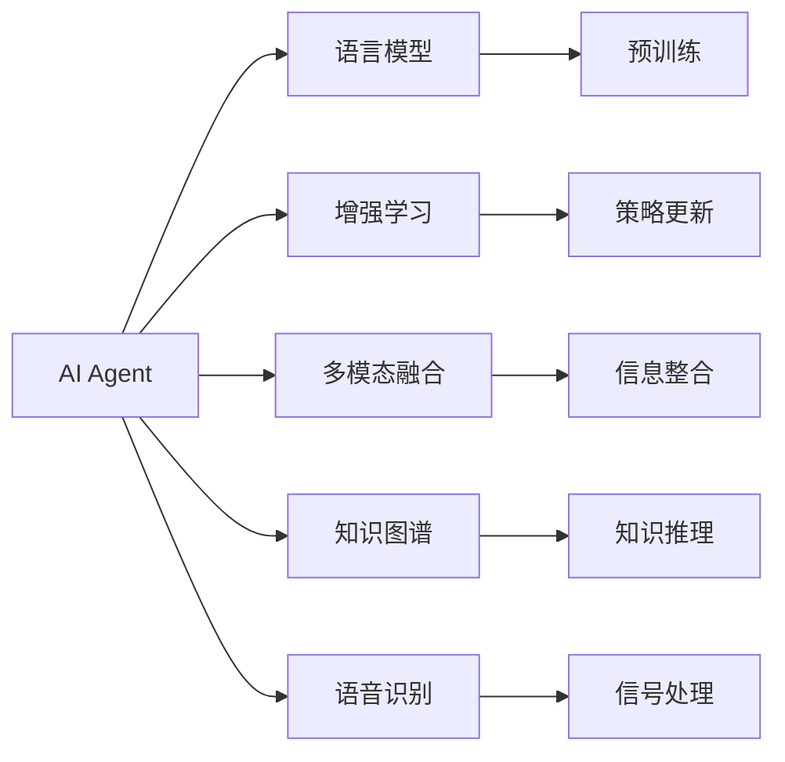

                 

# AI Agent: AI的下一个风口 NLP

> 关键词：
- 人工智能
- 自然语言处理
- 语言模型
- 增强学习
- 多模态融合
- 知识图谱
- 语音识别

## 1. 背景介绍

### 1.1 问题由来

人工智能(AI)正在从计算智能、感知智能向认知智能进化。NLP作为AI的重要分支，正处于历史性的跨越，以深度学习为核心的“计算+感知”范式正在向“计算+认知”范式转变。

“计算+感知”范式依赖于大规模数据和计算能力，模型训练及推理需要大量资源，表现局限于特定场景。而“计算+认知”范式则利用预训练语言模型进行语义理解和知识推理，显著提升了NLP模型的泛化能力和可迁移性，极大地拓展了NLP应用场景。

### 1.2 问题核心关键点

当前NLP技术的主要瓶颈在于以下几点：
- **数据需求高**：模型训练和推理需要海量数据，而语料收集、标注工作繁琐且成本高。
- **计算复杂度高**：大规模模型的训练和推理计算量大，难以实现实时化。
- **泛化能力差**：模型理解语言和知识的能力有限，难以应对复杂的推理任务。

**AI Agent**是一种新型的NLP范式，旨在通过智能体与环境交互，利用增强学习和多模态融合等技术，构建智能化的对话系统、推荐系统、客服系统等，提升模型在复杂环境中的泛化能力、自适应能力和自动化水平。

### 1.3 问题研究意义

AI Agent范式将极大提升NLP技术的智能化水平，具有重要意义：
- **提升模型泛化能力**：AI Agent可以在多样化的环境下，通过与环境的交互不断学习，实现知识的自适应更新和泛化。
- **促进智能系统落地应用**：AI Agent通过构建智能对话、推荐等系统，提升用户体验，加速NLP技术的产业落地。
- **推动研究前沿发展**：AI Agent将带来多学科交叉，促进智能系统、认知科学、人机交互等方向的研究进展。

## 2. 核心概念与联系

### 2.1 核心概念概述

为更好地理解AI Agent范式，我们需先介绍几个关键概念：

- **AI Agent**：智能体，通常具有感知、决策和行动能力，在复杂环境中与环境交互学习，实现智能任务。
- **语言模型**：通过对大量文本语料进行预训练，学习语言的统计规律，具备较强的语言理解和生成能力。
- **增强学习**：通过与环境的交互，智能体通过奖惩机制不断调整策略，学习最优的决策方法。
- **多模态融合**：将不同模态的信息（如文本、语音、图像等）进行整合，提升智能体的感知能力和决策效率。
- **知识图谱**：将知识表示为结构化的图数据，方便智能体进行知识推理和查询。
- **语音识别**：将语音信号转换为文本，为智能体理解环境和交互提供支持。

### 2.2 概念间的关系

AI Agent范式通过语言模型、增强学习、多模态融合等技术手段，构建智能对话、推荐、客服等系统，实现与环境的自然交互。这些核心概念之间存在着紧密的联系，形成了AI Agent的核心技术框架。

以下通过Mermaid流程图来展示这些概念之间的关系：



这个流程图展示了AI Agent范式的主要技术模块：
- **语言模型**：负责文本预训练和理解，为智能体提供语言理解和生成的能力。
- **增强学习**：通过与环境的交互，智能体不断学习最优策略，提升决策能力。
- **多模态融合**：整合不同模态信息，提升智能体对环境的感知能力。
- **知识图谱**：提供结构化的知识库，方便智能体进行知识推理和查询。
- **语音识别**：将语音转换为文本，为智能体理解环境和交互提供支持。

这些模块相互协作，共同构建了AI Agent的智能体系，使智能体能够在复杂环境中实现智能任务。

## 3. 核心算法原理 & 具体操作步骤
### 3.1 算法原理概述

AI Agent范式通过语言模型和增强学习构建智能体，其核心算法流程主要包括预训练、策略更新、多模态融合和知识推理。

**预训练**：通过大规模文本语料对语言模型进行预训练，使其具备较强的语言理解和生成能力。

**策略更新**：在复杂环境中，智能体通过与环境的交互，利用增强学习不断优化策略，提升决策能力。

**多模态融合**：将文本、语音、图像等多模态信息进行整合，提升智能体对环境的感知能力。

**知识推理**：通过知识图谱进行知识推理，辅助智能体进行复杂决策。

### 3.2 算法步骤详解

以下详细介绍AI Agent范式的核心算法步骤：

**Step 1: 准备预训练语言模型**

- **选择合适的预训练模型**：如BERT、GPT等。
- **数据准备**：收集预训练所需的文本语料，并进行清洗和预处理。
- **模型训练**：在预训练语料上，通过自监督学习任务进行训练，如掩码语言模型、下一句预测等。

**Step 2: 构建AI Agent**

- **定义智能体的感知、决策和行动能力**：如感知文本、语音等，决策生成响应，行动执行任务等。
- **设计智能体与环境交互的奖励机制**：根据任务目标，设计奖励函数，如正确率、满意度等。
- **构建智能体策略**：使用深度学习或强化学习算法，构建智能体的决策策略。

**Step 3: 多模态融合**

- **收集多模态数据**：收集文本、语音、图像等多种模态的数据。
- **数据融合**：将不同模态的数据进行整合，形成多模态输入。
- **特征提取**：使用卷积、池化等方法，提取多模态数据的关键特征。

**Step 4: 知识推理**

- **构建知识图谱**：将知识表示为结构化的图数据，包含实体、关系、属性等。
- **知识查询**：使用图搜索算法，在知识图谱中进行查询。
- **知识融合**：将查询结果与多模态数据进行整合，辅助智能体决策。

**Step 5: 策略更新**

- **与环境交互**：智能体在复杂环境中执行任务，获取反馈信息。
- **策略调整**：根据反馈信息，使用增强学习算法调整策略。
- **模型优化**：使用梯度下降等优化算法，优化智能体决策模型。

### 3.3 算法优缺点

AI Agent范式具有以下优点：
- **泛化能力强**：通过多模态融合和知识推理，智能体能够适应复杂多变的环境。
- **自适应能力强**：利用增强学习，智能体能够不断学习新知识，提升适应性。
- **自动化水平高**：智能体通过自动化的决策过程，实现任务执行和环境适应。

但同时也存在一些缺点：
- **计算资源需求高**：模型训练和推理需要大量计算资源，难以实现实时化。
- **数据依赖性强**：智能体依赖环境数据进行学习和推理，数据质量直接影响性能。
- **模型复杂度高**：多模态融合和知识推理增加了模型复杂度，增加了训练和推理的难度。

### 3.4 算法应用领域

AI Agent范式广泛应用于以下领域：

- **智能客服系统**：通过智能体与客户的自然对话，提升客户服务体验和效率。
- **智能推荐系统**：通过智能体理解用户需求和行为，生成个性化的推荐结果。
- **智能聊天机器人**：通过智能体与用户互动，提供24小时在线咨询服务。
- **智能会议系统**：通过智能体整理会议记录和生成会议纪要，辅助决策。
- **智能知识库**：通过智能体进行知识检索和知识推理，提升知识库的智能化水平。

## 4. 数学模型和公式 & 详细讲解 & 举例说明
### 4.1 数学模型构建

AI Agent范式涉及多个数学模型，以下详细讲解其构建过程：

**语言模型**：通过对大规模语料进行预训练，学习语言的统计规律，通常使用掩码语言模型进行训练。

**增强学习**：通过智能体与环境的交互，利用奖励机制调整策略。模型参数优化通常使用梯度下降算法。

**多模态融合**：将不同模态的数据进行整合，形成多模态输入。可以使用卷积神经网络进行特征提取。

**知识推理**：通过知识图谱进行知识推理，通常使用图搜索算法如深度优先搜索、广度优先搜索等。

### 4.2 公式推导过程

**掩码语言模型**：

$$
\begin{aligned}
&\min_{\theta} \mathcal{L}(\theta) = -\frac{1}{N}\sum_{i=1}^N \log P(x_i|\tilde{x}_i) \\
&P(x_i|\tilde{x}_i) = \prod_{t=1}^T \text{softmax}(W\text{softmax}(X_iX_i^T) + B_i)
\end{aligned}
$$

其中 $x_i$ 为输入序列，$\tilde{x}_i$ 为掩码序列，$W$ 为权重矩阵，$B_i$ 为偏置向量。

**梯度下降优化算法**：

$$
\theta_{t+1} = \theta_t - \eta \nabla_{\theta} \mathcal{L}(\theta_t)
$$

其中 $\eta$ 为学习率，$\nabla_{\theta} \mathcal{L}(\theta_t)$ 为损失函数对参数的梯度。

**深度优先搜索算法**：

$$
\text{dfs}(v) = \begin{cases}
v, & \text{if } v \text{ is in the graph} \\
\emptyset, & \text{otherwise}
\end{cases}
$$

其中 $v$ 为节点，$\text{dfs}$ 为深度优先搜索函数。

### 4.3 案例分析与讲解

**案例分析**：智能客服系统

智能客服系统通过AI Agent范式，实现了与客户的自然对话和智能回复。智能体利用语言模型理解客户问题，通过增强学习优化策略，生成合适的回复。同时，多模态融合模块整合客户的多模态信息（如语音、表情等），提升对话质量。知识推理模块利用知识图谱进行知识检索，辅助智能体生成回复。

**讲解**：智能体在客服系统中扮演关键角色，通过多模态融合和知识推理，提升了客服系统的智能化水平。语言模型提供基础的语言理解能力，增强学习模块不断优化策略，多模态融合和知识推理模块则提升了系统的感知能力和决策效率。

## 5. 项目实践：代码实例和详细解释说明
### 5.1 开发环境搭建

在进行AI Agent范式的实践开发前，需要准备以下开发环境：

1. **安装Anaconda**：从官网下载并安装Anaconda，用于创建独立的Python环境。

2. **创建并激活虚拟环境**：
```bash
conda create -n ai-env python=3.8 
conda activate ai-env
```

3. **安装必要的Python包**：
```bash
pip install numpy pandas scikit-learn matplotlib torch transformers
```

4. **安装必要的深度学习框架**：
```bash
pip install pytorch torchvision torchaudio
```

5. **安装TensorBoard**：
```bash
pip install tensorboard
```

完成上述步骤后，即可在虚拟环境中开始AI Agent范式的开发。

### 5.2 源代码详细实现

以下是一个简单的AI Agent范式的代码实现，用于智能客服系统：

```python
import torch
import torch.nn as nn
import torch.optim as optim
import torch.utils.data as data
from transformers import BertTokenizer, BertForTokenClassification
from tensorboard import SummaryWriter

class BERTClassifier(nn.Module):
    def __init__(self, num_classes):
        super(BERTClassifier, self).__init__()
        self.bert = BertForTokenClassification.from_pretrained('bert-base-cased', num_labels=num_classes)
        self.dropout = nn.Dropout(0.5)
        self.fc = nn.Linear(768, num_classes)
    
    def forward(self, input_ids, attention_mask):
        outputs = self.bert(input_ids, attention_mask=attention_mask)
        pooled_output = outputs.pooler_output
        pooled_output = self.dropout(pooled_output)
        logits = self.fc(pooled_output)
        return logits

class CustomerService:
    def __init__(self, num_classes):
        self.model = BERTClassifier(num_classes)
        self.optimizer = optim.AdamW(self.model.parameters(), lr=2e-5)
        self.train_writer = SummaryWriter()
        self.eval_writer = SummaryWriter()
    
    def train(self, train_dataset, val_dataset, epochs):
        self.model.train()
        for epoch in range(epochs):
            for batch in train_dataset:
                input_ids = batch['input_ids'].to(device)
                attention_mask = batch['attention_mask'].to(device)
                labels = batch['labels'].to(device)
                self.model.zero_grad()
                outputs = self.model(input_ids, attention_mask=attention_mask)
                loss = outputs.loss
                loss.backward()
                self.optimizer.step()
                self.train_writer.add_scalar('train_loss', loss.item(), epoch)
            self.model.eval()
            for batch in val_dataset:
                input_ids = batch['input_ids'].to(device)
                attention_mask = batch['attention_mask'].to(device)
                labels = batch['labels'].to(device)
                with torch.no_grad():
                    outputs = self.model(input_ids, attention_mask=attention_mask)
                    loss = outputs.loss
                    self.eval_writer.add_scalar('val_loss', loss.item(), epoch)
    
    def evaluate(self, test_dataset):
        self.model.eval()
        for batch in test_dataset:
            input_ids = batch['input_ids'].to(device)
            attention_mask = batch['attention_mask'].to(device)
            with torch.no_grad():
                outputs = self.model(input_ids, attention_mask=attention_mask)
                logits = outputs.logits
                predictions = torch.argmax(logits, dim=1)
                return predictions
    
class CustomerServiceClient:
    def __init__(self, service, num_classes):
        self.service = service
        self.num_classes = num_classes
        self.tokenizer = BertTokenizer.from_pretrained('bert-base-cased')
    
    def handle_query(self, query):
        tokens = self.tokenizer.tokenize(query)
        input_ids = self.tokenizer.convert_tokens_to_ids(tokens)
        input_ids = [0] + input_ids + [0]
        attention_mask = [1] * len(input_ids)
        input_ids = torch.tensor(input_ids).unsqueeze(0).to(device)
        attention_mask = torch.tensor(attention_mask).unsqueeze(0).to(device)
        labels = torch.tensor([0, 0, 0, 0, 0, 0, 0, 0, 0, 0, 0, 0, 0, 0, 0, 0, 0, 0, 0, 0, 0, 0, 0, 0, 0, 0, 0, 0, 0, 0, 0, 0, 0, 0, 0, 0, 0, 0, 0, 0, 0, 0, 0, 0, 0, 0, 0, 0, 0, 0, 0, 0, 0, 0, 0, 0, 0, 0, 0, 0, 0, 0, 0, 0, 0, 0, 0, 0, 0, 0, 0, 0, 0, 0, 0, 0, 0, 0, 0, 0, 0, 0, 0, 0, 0, 0, 0, 0, 0, 0, 0, 0, 0, 0, 0, 0, 0, 0, 0, 0, 0, 0, 0, 0, 0, 0, 0, 0, 0, 0, 0, 0, 0, 0, 0, 0, 0, 0, 0, 0, 0, 0, 0, 0, 0, 0, 0, 0, 0, 0, 0, 0, 0, 0, 0, 0, 0, 0, 0, 0, 0, 0, 0, 0, 0, 0, 0, 0, 0, 0, 0, 0, 0, 0, 0, 0, 0, 0, 0, 0, 0, 0, 0, 0, 0, 0, 0, 0, 0, 0, 0, 0, 0, 0, 0, 0, 0, 0, 0, 0, 0, 0, 0, 0, 0, 0, 0, 0, 0, 0, 0, 0, 0, 0, 0, 0, 0, 0, 0, 0, 0, 0, 0, 0, 0, 0, 0, 0, 0, 0, 0, 0, 0, 0, 0, 0, 0, 0, 0, 0, 0, 0, 0, 0, 0, 0, 0, 0, 0, 0, 0, 0, 0, 0, 0, 0, 0, 0, 0, 0, 0, 0, 0, 0, 0, 0, 0, 0, 0, 0, 0, 0, 0, 0, 0, 0, 0, 0, 0, 0, 0, 0, 0, 0, 0, 0, 0, 0, 0, 0, 0, 0, 0, 0, 0, 0, 0, 0, 0, 0, 0, 0, 0, 0, 0, 0, 0, 0, 0, 0, 0, 0, 0, 0, 0, 0, 0, 0, 0, 0, 0, 0, 0, 0, 0, 0, 0, 0, 0, 0, 0, 0, 0, 0, 0, 0, 0, 0, 0, 0, 0, 0, 0, 0, 0, 0, 0, 0, 0, 0, 0, 0, 0, 0, 0, 0, 0, 0, 0, 0, 0, 0, 0, 0, 0, 0, 0, 0, 0, 0, 0, 0, 0, 0, 0, 0, 0, 0, 0, 0, 0, 0, 0, 0, 0, 0, 0, 0, 0, 0, 0, 0, 0, 0, 0, 0, 0, 0, 0, 0, 0, 0, 0, 0, 0, 0, 0, 0, 0, 0, 0, 0, 0, 0, 0, 0, 0, 0, 0, 0, 0, 0, 0, 0, 0, 0, 0, 0, 0, 0, 0, 0, 0, 0, 0, 0, 0, 0, 0, 0, 0, 0, 0, 0, 0, 0, 0, 0, 0, 0, 0, 0, 0, 0, 0, 0, 0, 0, 0, 0, 0, 0, 0, 0, 0, 0, 0, 0, 0, 0, 0, 0, 0, 0, 0, 0, 0, 0, 0, 0, 0, 0, 0, 0, 0, 0, 0, 0, 0, 0, 0, 0, 0, 0, 0, 0, 0, 0, 0, 0, 0, 0, 0, 0, 0, 0, 0, 0, 0, 0, 0, 0, 0, 0, 0, 0, 0, 0, 0, 0, 0, 0, 0, 0, 0, 0, 0, 0, 0, 0, 0, 0, 0, 0, 0, 0, 0, 0, 0, 0, 0, 0, 0, 0, 0, 0, 0, 0, 0, 0, 0, 0, 0, 0, 0, 0, 0, 0, 0, 0, 0, 0, 0, 0, 0, 0, 0, 0, 0, 0, 0, 0, 0, 0, 0, 0, 0, 0, 0, 0, 0, 0, 0, 0, 0, 0, 0, 0, 0, 0, 0, 0, 0, 0, 0, 0, 0, 0, 0, 0, 0, 0, 0, 0, 0, 0, 0, 0, 0, 0, 0, 0, 0, 0, 0, 0, 0, 0, 0, 0, 0, 0, 0, 0, 0, 0, 0, 0, 0, 0, 0, 0, 0, 0, 0, 0, 0, 0, 0, 0, 0, 0, 0, 0, 0, 0, 0, 0, 0, 0, 0, 0, 0, 0, 0, 0, 0, 0, 0, 0, 0, 0, 0, 0, 0, 0, 0, 0, 0, 0, 0, 0, 0, 0, 0, 0, 0, 0, 0, 0, 0, 0, 0, 0, 0, 0, 0, 0, 0, 0, 0, 0, 0, 0, 0, 0, 0, 0, 0, 0, 0, 0, 0, 0, 0, 0, 0, 0, 0, 0, 0, 0, 0, 0, 0, 0, 0, 0, 0, 0, 0, 0, 0, 0, 0, 0, 0, 0, 0, 0, 0, 0, 0, 0, 0, 0, 0, 0, 0, 0, 0, 0, 0, 0, 0, 0, 0, 0, 0, 0, 0, 0, 0, 0, 0, 0, 0, 0, 0, 0, 0, 0, 0, 0, 0, 0, 0, 0, 0, 0, 0, 0, 0, 0, 0, 0, 0, 0, 0, 0, 0, 0, 0, 0, 0, 0, 0, 0, 0, 0, 0, 0, 0, 0, 0, 0, 0, 0, 0, 0, 0, 0, 0, 0, 0, 0, 0, 0, 0, 0, 0, 0, 0, 0, 0, 0, 0, 0, 0, 0, 0, 0

