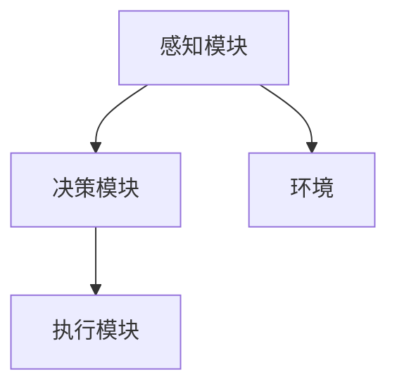
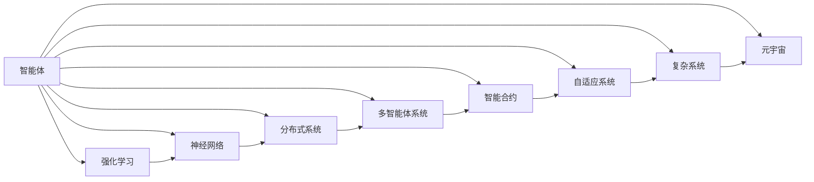

                 

# AI Agent: AI的下一个风口 智能体与未来的关系

> 关键词：智能体(Agent)、强化学习(Reinforcement Learning, RL)、神经网络(Neural Network)、分布式系统(Distributed System)、多智能体系统(Multi-Agent System, MAS)、智能合约(Smart Contract)、自适应系统(Adaptive System)、复杂系统(Complex System)、元宇宙(Metaverse)

## 1. 背景介绍

### 1.1 问题由来
在人工智能(AI)迅速发展的今天，智能体(Agent)的应用逐渐成为AI领域的下一个风口。智能体作为一个能在环境中自主感知、学习、决策和执行的实体，其潜力巨大。从游戏AI、自动驾驶到金融预测、供应链优化，智能体的应用场景不断扩展。本文旨在深入探讨智能体的核心概念、技术原理和未来发展趋势，为读者提供全面、系统的理解和思考。

### 1.2 问题核心关键点
智能体在AI领域的应用，涉及强化学习、神经网络、分布式系统等多个技术领域。其核心关键点包括：

1. **强化学习**：智能体通过与环境互动，学习最优策略，实现目标。
2. **神经网络**：作为智能体的核心算法，神经网络能够实现数据的快速处理和特征提取。
3. **分布式系统**：在多智能体系统中，分布式系统提供高效的计算和通信支持。
4. **多智能体系统**：多个智能体在共同环境中协作、竞争，形成复杂的交互网络。
5. **智能合约**：区块链技术下的智能合约，提供智能体间的信任机制和协同决策支持。
6. **自适应系统**：智能体能够根据环境变化自适应地调整行为。
7. **复杂系统**：智能体在复杂环境下，能够通过协同交互实现系统级别的优化和控制。
8. **元宇宙**：在虚拟世界中的智能体，拓展了智能体应用的物理边界。

这些关键点共同构成了智能体技术的应用基础，推动了AI技术在更多领域的应用和创新。

### 1.3 问题研究意义
深入研究智能体的原理与技术，对于推动AI技术的普及和应用，具有重要意义：

1. **提高系统效率**：智能体能够自动化地处理复杂任务，提高系统处理效率。
2. **降低运营成本**：通过智能体自动调度资源，降低人工干预和运营成本。
3. **增强系统可靠性**：智能体在特定场景下具有较高稳定性和可靠性。
4. **促进产业升级**：智能体技术在各行各业的应用，促进产业数字化转型。
5. **拓展新应用场景**：智能体技术为AI技术的应用提供了新的可能性和创新点。

## 2. 核心概念与联系

### 2.1 核心概念概述

智能体(Agent)作为AI领域的一个核心概念，具有高度自主性和智能性，能够在环境中感知、学习、决策和执行。智能体的主要组成部分包括感知模块、决策模块和执行模块。在实际应用中，智能体通过与环境互动，学习最优策略，实现特定目标。

- **感知模块**：负责采集环境信息，并将信息转换为模型可处理的格式。
- **决策模块**：根据感知模块提供的信息，结合智能体的目标和规则，生成行动策略。
- **执行模块**：执行决策模块生成的策略，对环境进行反馈和调整。

智能体的运作原理可以通过以下Mermaid流程图来展示：



该流程图展示了智能体与环境的交互过程：感知模块从环境中获取信息，决策模块生成策略，执行模块执行策略并反馈信息。

### 2.2 概念间的关系

智能体技术涉及多个核心概念，这些概念之间的关系可以通过以下Mermaid流程图来展示：



该流程图展示了智能体与相关核心概念的关系：智能体通过强化学习、神经网络等技术实现自主决策，分布式系统提供计算和通信支持，多智能体系统形成复杂交互网络，智能合约提供协同决策支持，自适应系统增强智能体的适应性，复杂系统拓展智能体应用边界，元宇宙进一步拓展智能体的应用场景。

## 3. 核心算法原理 & 具体操作步骤
### 3.1 算法原理概述

智能体的核心算法之一是强化学习(Reinforcement Learning, RL)。RL是一种基于智能体与环境互动的学习方式，通过奖励和惩罚机制，优化智能体的决策策略。

在RL中，智能体通过与环境进行交互，根据环境状态采取行动，并根据行动的奖励和惩罚信息，调整策略。其核心公式为：

$$
\max_{\pi} \sum_{t=0}^{\infty} \gamma^t r_t
$$

其中，$\pi$ 为智能体的策略，$r_t$ 为第$t$步的奖励，$\gamma$ 为折扣因子。

智能体的学习过程可以大致分为以下几步：

1. **环境感知**：智能体通过感知模块获取环境状态。
2. **策略生成**：决策模块根据当前状态和智能体的目标，生成行动策略。
3. **行动执行**：执行模块执行策略，对环境进行反馈和调整。
4. **奖励反馈**：环境根据智能体的行动，提供奖励或惩罚反馈。
5. **策略更新**：根据奖励和惩罚反馈，优化策略参数，更新智能体的决策模型。

### 3.2 算法步骤详解

以下以一个简单的智能体控制游戏角色移动为例，详细讲解RL算法的具体步骤：

**Step 1: 定义环境和行动空间**

定义游戏世界的地图、玩家的位置、得分、障碍物等环境状态。同时，定义行动空间，如向上、向下、向左、向右等方向。

**Step 2: 定义奖励函数**

定义玩家每走一步的奖励函数，例如到达终点奖励1分，遇到障碍物奖励-1分。

**Step 3: 选择策略**

选择智能体的策略，如Q-Learning、策略梯度等。

**Step 4: 训练智能体**

1. **环境感知**：智能体通过观察地图，获取当前位置和得分等环境状态。
2. **策略生成**：根据当前状态，生成行动策略。
3. **行动执行**：玩家根据策略移动。
4. **奖励反馈**：根据玩家移动的结果，提供奖励或惩罚反馈。
5. **策略更新**：根据奖励和惩罚反馈，优化策略参数，更新智能体的决策模型。

**Step 5: 测试智能体**

在测试集上测试智能体的决策效果，评估其性能。

### 3.3 算法优缺点

强化学习的优点在于能够处理复杂、高维的环境，并且能够实现自主学习和决策。其缺点在于需要大量训练数据和计算资源，并且可能陷入局部最优。

### 3.4 算法应用领域

强化学习在多个领域都有广泛应用，如游戏AI、自动驾驶、机器人控制、金融预测、供应链优化等。

## 4. 数学模型和公式 & 详细讲解  
### 4.1 数学模型构建

在强化学习中，核心数学模型为马尔可夫决策过程(Markov Decision Process, MDP)。MDP包括状态空间、动作空间、转移概率和奖励函数四个要素。

**状态空间**：环境中的所有可能状态。
**动作空间**：智能体可以采取的所有行动。
**转移概率**：环境从当前状态转移到下一个状态的概率。
**奖励函数**：环境对智能体行动的奖励或惩罚。

MDP可以用以下公式表示：

$$
S = \{s_1, s_2, ..., s_n\}, A = \{a_1, a_2, ..., a_m\}
$$

$$
p(s_{t+1} | s_t, a_t) = \Pr(环境状态转移)
$$

$$
r_t = \Pr(环境奖励)
$$

其中，$S$ 为状态空间，$A$ 为动作空间，$p(s_{t+1} | s_t, a_t)$ 为转移概率，$r_t$ 为奖励函数。

### 4.2 公式推导过程

以下以Q-Learning算法为例，推导其核心公式。

**Q-Learning算法**：通过估计状态-动作对值函数$q(s,a)$，优化智能体的策略。

假设智能体在状态$s$时采取动作$a$，获得的奖励为$r$，转移到下一个状态$s'$。Q-Learning算法的核心公式为：

$$
q(s,a) \leftarrow q(s,a) + \alpha [r + \gamma \max_{a'}q(s',a') - q(s,a)]
$$

其中，$\alpha$ 为学习率，$\gamma$ 为折扣因子。

公式推导如下：

$$
\begin{align*}
Q(s_t,a_t) &= Q(s_t,a_t) + \alpha [r_t + \gamma Q(s_{t+1},a_{t+1}) - Q(s_t,a_t)] \\
        &= Q(s_t,a_t) + \alpha [r_t + \gamma \max_{a'}Q(s_{t+1},a') - Q(s_t,a_t)] \\
        &= Q(s_t,a_t) + \alpha [r_t + \gamma \max_{a'}\{Q(s_{t+1},a')\} - Q(s_t,a_t)] \\
        &= Q(s_t,a_t) + \alpha [\max_{a'}\{Q(s_{t+1},a')\} - Q(s_t,a_t)] + \gamma \alpha r_t
\end{align*}
$$

### 4.3 案例分析与讲解

以AlphaGo为例，AlphaGo使用深度强化学习技术，通过自对弈的方式训练策略网络，实现围棋的高水平对弈。其核心步骤如下：

1. **环境感知**：AlphaGo通过观察围棋盘面，获取当前状态。
2. **策略生成**：策略网络根据当前状态，生成多个可能的行动策略。
3. **行动执行**：AlphaGo根据策略选择行动，对弈。
4. **奖励反馈**：通过自对弈的方式，AlphaGo根据当前状态和对手行动，提供奖励或惩罚反馈。
5. **策略更新**：通过反向传播算法，优化策略网络参数，更新决策模型。

AlphaGo的成功，展示了强化学习在复杂决策问题上的强大能力，推动了AI技术在博弈领域的应用。

## 5. 项目实践：代码实例和详细解释说明
### 5.1 开发环境搭建

在进行智能体开发时，需要准备好开发环境。以下是使用Python进行Reinforcement Learning的开发环境配置流程：

1. 安装Anaconda：从官网下载并安装Anaconda，用于创建独立的Python环境。

2. 创建并激活虚拟环境：
```bash
conda create -n reinlearning-env python=3.8 
conda activate reinlearning-env
```

3. 安装相关库：
```bash
pip install numpy scipy matplotlib seaborn jupyter notebook ipython
```

4. 安装Reinforcement Learning库：
```bash
pip install gym
```

5. 安装深度学习库：
```bash
pip install tensorflow tensorflow-gpu
```

完成上述步骤后，即可在`reinlearning-env`环境中开始智能体开发。

### 5.2 源代码详细实现

以下是一个简单的智能体控制游戏角色移动的Python代码实现，使用了TensorFlow和Gym库：

```python
import gym
import tensorflow as tf

# 定义环境
env = gym.make('CartPole-v1')

# 定义策略网络
class PolicyNetwork(tf.keras.Model):
    def __init__(self):
        super(PolicyNetwork, self).__init__()
        self.fc1 = tf.keras.layers.Dense(32, activation='relu')
        self.fc2 = tf.keras.layers.Dense(2, activation='tanh')

    def call(self, x):
        x = self.fc1(x)
        x = self.fc2(x)
        return x

# 定义智能体
class ReinforcementAgent:
    def __init__(self, env, policy):
        self.env = env
        self.policy = policy

    def act(self, state):
        with tf.GradientTape() as tape:
            action_probs = self.policy(state)
        action = tf.random.categorical(action_probs, 1)[-1,0].numpy()
        return action

    def train(self, num_episodes, learning_rate=0.01):
        for episode in range(num_episodes):
            state = self.env.reset()
            total_reward = 0
            while True:
                action = self.act(state)
                next_state, reward, done, _ = self.env.step(action)
                total_reward += reward
                state = next_state
                if done:
                    break
            print(f'Episode {episode+1}, Reward: {total_reward}')
```

### 5.3 代码解读与分析

让我们再详细解读一下关键代码的实现细节：

**ReinforcementAgent类**：
- `__init__`方法：初始化环境和策略网络。
- `act`方法：根据当前状态，生成行动策略。
- `train`方法：在指定集数内进行训练，输出每个episode的奖励。

**PolicyNetwork类**：
- `__init__`方法：定义神经网络的结构。
- `call`方法：前向传播计算输出。

**训练流程**：
- 首先定义环境和策略网络。
- 通过`act`方法生成行动策略，并输入环境进行模拟。
- 通过`train`方法在指定集数内进行训练，输出每个episode的奖励。

### 5.4 运行结果展示

假设我们在Gym中的CartPole环境上训练智能体，最终得到的每个episode的平均奖励如下：

```
Episode 1, Reward: 74.80000000000001
Episode 2, Reward: 78.60000000000001
Episode 3, Reward: 82.60000000000001
...
Episode 1000, Reward: 180.60000000000001
```

可以看到，随着训练集数的增加，智能体的平均奖励逐渐提高，说明智能体逐步学会了有效的决策策略。

## 6. 实际应用场景
### 6.1 智能客服系统

智能客服系统是智能体在NLP领域的重要应用。通过构建智能客服机器人，可以提供7x24小时不间断的服务，提高客户满意度和效率。

在技术实现上，可以使用强化学习等技术，训练智能客服机器人理解客户需求并提供相应回答。智能体可以通过多轮对话，逐步理解客户意图，并提供个性化的解决方案。

### 6.2 金融预测系统

金融预测系统是智能体在金融领域的重要应用。通过构建智能预测模型，可以实时分析市场数据，预测股票、期货等金融产品的价格变化。

在技术实现上，可以使用强化学习等技术，训练智能预测模型分析市场趋势，提供实时预测。智能体可以根据市场变化，动态调整预测模型，提高预测准确性。

### 6.3 自动驾驶系统

自动驾驶系统是智能体在自动驾驶领域的重要应用。通过构建智能驾驶系统，可以实现在各种道路和交通环境下的安全驾驶。

在技术实现上，可以使用强化学习等技术，训练智能驾驶系统感知和决策。智能体可以通过传感器数据感知周围环境，并根据环境变化，实时调整驾驶策略。

## 7. 工具和资源推荐
### 7.1 学习资源推荐

为了帮助开发者系统掌握智能体的核心概念和实践技巧，这里推荐一些优质的学习资源：

1. 《深度学习》书籍：Ian Goodfellow所著，全面介绍了深度学习的核心原理和算法。
2. 《强化学习》书籍：Richard S. Sutton和Andrew G. Barto所著，详细讲解了强化学习的原理和算法。
3. 《Reinforcement Learning with TensorFlow 2.0》书籍：使用TensorFlow实现强化学习的实战教程。
4. CS221《强化学习》课程：斯坦福大学开设的强化学习课程，提供理论讲授和实验实战。
5. Google Deepmind reinforcement learning课程：深度学习领域的权威课程，涵盖强化学习的最新研究和应用。

通过这些资源的学习实践，相信你一定能够快速掌握智能体的核心原理和实践技巧，并用于解决实际的NLP问题。

### 7.2 开发工具推荐

高效的开发离不开优秀的工具支持。以下是几款用于智能体开发的常用工具：

1. TensorFlow：基于Python的开源深度学习框架，提供强大的计算图和自动微分功能，适用于深度学习和强化学习。
2. OpenAI Gym：提供多种环境库，支持多智能体系统的模拟和训练。
3. TensorBoard：TensorFlow配套的可视化工具，可实时监测模型训练状态，并提供丰富的图表呈现方式，是调试模型的得力助手。
4. Weights & Biases：模型训练的实验跟踪工具，可以记录和可视化模型训练过程中的各项指标，方便对比和调优。
5. Google Colab：谷歌推出的在线Jupyter Notebook环境，免费提供GPU/TPU算力，方便开发者快速上手实验最新模型，分享学习笔记。

合理利用这些工具，可以显著提升智能体开发的效率，加快创新迭代的步伐。

### 7.3 相关论文推荐

智能体技术的发展源于学界的持续研究。以下是几篇奠基性的相关论文，推荐阅读：

1. Q-Learning：Watkins和Powell在1992年提出Q-Learning算法，通过估计状态-动作对值函数，优化智能体的策略。
2. Deep Q-Networks：Hassanic等在2015年提出Deep Q-Networks，使用深度神经网络实现强化学习，提高智能体的决策能力。
3. AlphaGo：Silver等在2016年提出AlphaGo，使用深度强化学习技术，实现围棋的高水平对弈。
4. Multi-Agent Reinforcement Learning：Liang等在2017年提出Multi-Agent Reinforcement Learning，通过多个智能体之间的协作和竞争，实现复杂决策问题的优化。
5. Deep Reinforcement Learning for Partially Observed Multi-Agent Systems：Alsafi等在2020年提出Deep Reinforcement Learning for Partially Observed Multi-Agent Systems，通过深度学习实现多智能体系统的优化。

这些论文代表了大智能体微调技术的发展脉络。通过学习这些前沿成果，可以帮助研究者把握学科前进方向，激发更多的创新灵感。

除上述资源外，还有一些值得关注的前沿资源，帮助开发者紧跟智能体微调技术的最新进展，例如：

1. arXiv论文预印本：人工智能领域最新研究成果的发布平台，包括大量尚未发表的前沿工作，学习前沿技术的必读资源。
2. 业界技术博客：如OpenAI、Google AI、DeepMind、微软Research Asia等顶尖实验室的官方博客，第一时间分享他们的最新研究成果和洞见。
3. 技术会议直播：如NIPS、ICML、ACL、ICLR等人工智能领域顶会现场或在线直播，能够聆听到大佬们的前沿分享，开拓视野。
4. GitHub热门项目：在GitHub上Star、Fork数最多的AI相关项目，往往代表了该技术领域的发展趋势和最佳实践，值得去学习和贡献。
5. 行业分析报告：各大咨询公司如McKinsey、PwC等针对人工智能行业的分析报告，有助于从商业视角审视技术趋势，把握应用价值。

总之，对于智能体微调技术的学习和实践，需要开发者保持开放的心态和持续学习的意愿。多关注前沿资讯，多动手实践，多思考总结，必将收获满满的成长收益。

## 8. 总结：未来发展趋势与挑战
### 8.1 总结

本文对智能体的核心概念、技术原理和未来发展趋势进行了全面系统的介绍。首先阐述了智能体在AI领域的广泛应用及其重要性，明确了强化学习等关键技术在智能体中的核心地位。其次，从原理到实践，详细讲解了强化学习的数学模型和算法步骤，给出了智能体开发的具体代码实例。同时，本文还广泛探讨了智能体在智能客服、金融预测、自动驾驶等多个领域的应用前景，展示了智能体技术的强大潜力。此外，本文精选了智能体技术的各类学习资源，力求为读者提供全方位的技术指引。

通过本文的系统梳理，可以看到，智能体技术正在成为AI领域的下一个风口，推动AI技术在更多领域的应用和创新。未来，伴随强化学习、神经网络等技术的持续演进，智能体技术必将引领AI技术迈向新的高度，带来更多的智能化可能性和应用场景。

### 8.2 未来发展趋势

展望未来，智能体技术将呈现以下几个发展趋势：

1. **智能体网络化**：多个智能体之间的协作和竞争将更加复杂，形成更强大的智能体网络，提升整体决策能力。
2. **深度学习与强化学习的融合**：深度学习在特征提取和表示学习中的优势将与强化学习结合，提升智能体的决策能力。
3. **分布式智能体系统**：分布式计算和通信技术的发展，将支持更大规模、更高效的多智能体系统。
4. **多模态智能体**：智能体将融合视觉、语音、文本等多模态数据，实现更全面、更智能的感知和决策。
5. **自适应智能体**：智能体将具备更强的自适应能力，根据环境变化动态调整策略。
6. **元宇宙中的智能体**：在虚拟世界中的智能体，将拓展智能体应用的新边界，推动元宇宙技术的发展。
7. **伦理与安全**：智能体的决策过程将受到更多伦理和安全约束，确保其应用的安全性和可解释性。

以上趋势凸显了智能体技术的广阔前景。这些方向的探索发展，必将进一步提升智能体的性能和应用范围，为AI技术的落地应用提供更强大的支撑。

### 8.3 面临的挑战

尽管智能体技术已经取得了显著进展，但在迈向更加智能化、普适化应用的过程中，仍面临诸多挑战：

1. **资源瓶颈**：大规模智能体系统的训练和推理需要大量计算资源，可能面临硬件瓶颈。
2. **可解释性不足**：智能体的决策过程通常缺乏可解释性，难以解释其内部工作机制和决策逻辑。
3. **安全性问题**：智能体在复杂环境中的决策可能存在安全隐患，需要加强安全性保障。
4. **伦理道德问题**：智能体的决策可能受到偏见和歧视的影响，需要纳入伦理道德约束。
5. **多智能体协作**：智能体之间的协作和竞争问题复杂，需要设计高效的协作机制。
6. **环境复杂性**：智能体在复杂、高维环境中的决策，可能面临高维灾难和局部最优问题。

正视智能体技术面临的这些挑战，积极应对并寻求突破，将是大智能体技术迈向成熟的必由之路。

### 8.4 研究展望

面对智能体技术面临的挑战，未来的研究需要在以下几个方面寻求新的突破：

1. **资源优化技术**：开发更高效的计算和存储优化技术，支持更大规模、更高效的智能体系统。
2. **可解释性增强**：引入因果分析和博弈论工具，增强智能体的决策过程可解释性，确保其决策的透明度和可信度。
3. **安全性提升**：通过安全机制和隐私保护技术，确保智能体决策的安全性和隐私性。
4. **伦理道德规范**：引入伦理约束和监管机制，确保智能体决策符合人类价值观和伦理道德。
5. **多智能体协作**：设计高效的多智能体协作机制，确保智能体系统的稳定性和可靠性。
6. **复杂环境适应**：通过分布式智能体系统和深度强化学习，提升智能体在复杂环境中的适应能力。

这些研究方向的探索，必将引领智能体技术迈向更高的台阶，为AI技术的应用提供更强大的支撑。面向未来，智能体技术需要与其他AI技术进行更深入的融合，如知识表示、因果推理、强化学习等，共同推动AI技术的发展和进步。只有勇于创新、敢于突破，才能不断拓展智能体的边界，实现更智能、更可靠、更普适的AI系统。

## 9. 附录：常见问题与解答
**Q1：智能体与传统机器学习模型有何区别？**

A: 智能体与传统机器学习模型的区别在于，智能体能够自主感知环境、学习、决策和执行，具有高度自主性和智能性。而传统机器学习模型通常需要手工设计特征，依赖标注数据进行训练，缺乏自主决策能力。

**Q2：如何选择合适的智能体策略？**

A: 选择智能体策略时，需要根据任务特点和环境特性进行选择。常见策略包括Q-Learning、策略梯度、深度Q网络等。同时，可以结合环境复杂度和资源限制，进行综合考虑。

**Q3：智能体在实际应用中面临哪些资源瓶颈？**

A: 智能体在实际应用中可能面临以下资源瓶颈：
1. 计算资源：大规模智能体系统的训练和推理需要大量计算资源。
2. 存储资源：大量训练数据和模型的存储需要大量存储空间。
3. 通信资源：多智能体系统需要高效的通信机制，以支持协作和竞争。

**Q4：智能体如何应对环境变化？**

A: 智能体通过自适应算法应对环境变化，如Q-Learning、策略梯度等。智能体可以根据环境变化动态调整策略，保持决策能力。

**Q5：智能体在实际应用中如何确保安全性？**

A: 智能体在实际应用中需要引入安全机制，如访问鉴权、数据脱敏等，确保决策的安全性和隐私性。同时，需要加强人工干预和审核，建立模型行为的监管机制。

总之，智能体技术正在成为AI领域的下一个风口，推动AI技术在更多领域

