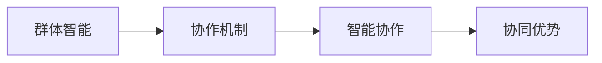

                 

# AI Agent“三驾马车” ：个体智能、群体智能和智能协作

## 1. 背景介绍

在人工智能(AI)技术迅猛发展的今天，我们越来越频繁地听到“AI”这个词。然而，“AI”到底是什么？人工智能又具体分为哪些方向？要回答这个问题，就必须先理解AI系统在智能的表现形式上分为个体智能、群体智能和智能协作三种。其中，个体智能是最基础的智能形式，群体智能和智能协作则是建立在个体智能的基础上，进一步提升AI系统的能力，以适应更加复杂多变的环境和任务。

在本文中，我们将重点介绍个体智能、群体智能和智能协作这“三驾马车”，深入探讨它们之间的联系和区别，以及各自在实际应用中的表现形式。

## 2. 核心概念与联系

### 2.1 核心概念概述

**个体智能(Individual Intelligence)**：通常指一个AI系统（比如一个人工智能助手、聊天机器人或者一个简单的自动化脚本）的智能水平，这是AI最基础的形式，也是最容易被理解的智能表现。

**群体智能(Collective Intelligence)**：指多个个体智能系统通过协作，形成的一种比单个系统更强大的智能形式。例如，一群聊天机器人可以协作处理复杂问题，一个团队的智能系统可以综合多个个体的优点，从而提升整体能力。

**智能协作(Intelligent Collaboration)**：指多个智能体通过协同工作，实现比单独工作更优的效果。例如，多机器人系统、人机协作系统等。

这三种智能形式之间的联系可以通过以下Mermaid流程图展示：


从图中可以看出，个体智能是群体智能和智能协作的基础，群体智能又进一步促进了智能协作的发展。在人机协同系统中，智能协作更是发挥着至关重要的作用。

### 2.2 概念间的关系

个体智能、群体智能和智能协作之间存在着复杂的相互作用和演化关系，可以通过以下两种关系图来进一步展示。

#### 2.2.1 个体智能和群体智能的关系


个体智能通过协作机制形成群体智能，协同优势是群体智能相对于个体智能的优势。例如，多个聊天机器人协作处理问题时，可以通过互相之间的交流和协调，比单个机器人更快速、更准确地解决复杂问题。

#### 2.2.2 群体智能和智能协作的关系



群体智能通过协作机制形成智能协作，同样，协同优势也是智能协作相对于群体智能的优势。例如，多机器人的协同工作可以完成单个机器人无法完成的任务，提高系统的效率和效果。

### 2.3 核心概念的整体架构

通过上述两种关系图，我们可以得出以下核心概念的整体架构：


在这个架构中，个体智能是基础，通过协作机制形成群体智能，群体智能再进一步通过协作机制形成智能协作。在人机协同系统中，智能协作发挥着关键的协同作用。

## 3. 核心算法原理 & 具体操作步骤
### 3.1 算法原理概述

个体智能、群体智能和智能协作的实现原理可以归纳为以下几点：

1. **个体智能**：通常采用监督学习、强化学习等机器学习算法，通过对大量数据的训练，使AI系统具备基本的学习能力。例如，监督学习可以通过标签数据训练分类器，而强化学习则通过奖励机制训练决策模型。

2. **群体智能**：需要设计复杂的协作机制，使多个个体智能系统能够进行有效的信息交流和任务分配。例如，在分布式系统中，需要设计消息队列、分布式协调服务（如Zookeeper）等基础设施，以支持系统的协同工作。

3. **智能协作**：同样需要设计复杂的协作机制，但与群体智能不同的是，智能协作更加注重任务的分配和执行，需要系统具有更强的任务调度能力。例如，多机器人系统需要设计高效的调度算法，以优化机器人的工作负载。

### 3.2 算法步骤详解

在实际应用中，个体智能、群体智能和智能协作的具体操作步骤如下：

**个体智能**：
1. 收集数据并进行预处理，获得监督信号。
2. 选择合适的机器学习算法（如监督学习、强化学习等），设计模型架构。
3. 使用训练数据对模型进行训练。
4. 对训练后的模型进行评估，验证模型的性能。

**群体智能**：
1. 设计协作机制，如消息队列、分布式协调服务（如Zookeeper）等。
2. 创建多个个体智能系统，并在系统中实现协作机制。
3. 在协作系统中进行数据处理和任务分配，进行信息交流。
4. 对协作系统进行优化和测试，验证系统性能。

**智能协作**：
1. 设计任务调度算法，分配和执行任务。
2. 在系统中实现任务调度算法，优化资源分配。
3. 对协作系统进行评估和优化，验证系统的协同效果。

### 3.3 算法优缺点

#### 个体智能的优缺点：

**优点**：
1. 操作简单，易于实现。
2. 独立性高，不受其他系统影响。
3. 适用于一些简单且易于自动化处理的任务。

**缺点**：
1. 无法应对复杂多变的环境。
2. 缺乏协作机制，难以处理大规模任务。

#### 群体智能的优缺点：

**优点**：
1. 能够处理大规模复杂任务。
2. 通过协作机制，能够提升整体系统的效率和效果。
3. 具有更强的鲁棒性和容错性。

**缺点**：
1. 协作机制复杂，设计难度大。
2. 系统复杂度较高，调试和维护难度大。

#### 智能协作的优缺点：

**优点**：
1. 高效处理大规模任务。
2. 能够利用系统的协作机制，提升整体系统的效率和效果。
3. 能够实现动态任务调度，优化资源利用。

**缺点**：
1. 系统设计复杂，需要设计高效的协作机制。
2. 需要处理大规模数据的同步和通信，性能消耗较大。

### 3.4 算法应用领域

**个体智能**：适用于一些简单且易于自动化的任务，例如文本分类、图像识别、自动化脚本等。

**群体智能**：适用于大规模复杂任务，例如多机器人协作、智能交通系统、群体决策系统等。

**智能协作**：适用于需要高效协同处理的任务，例如多机器人协同导航、智能物流系统、人机协同交互系统等。

## 4. 数学模型和公式 & 详细讲解  
### 4.1 数学模型构建

个体智能、群体智能和智能协作的数学模型构建可以从以下几方面入手：

**个体智能**：
- 使用监督学习算法（如分类器），建立模型$f(x) = \hat{y}$，其中$x$为输入特征，$y$为标签。

**群体智能**：
- 设计协作机制，如消息队列、分布式协调服务（如Zookeeper）等。
- 在协作系统中进行数据处理和任务分配，使用协作算法如MapReduce、分布式机器学习算法等。

**智能协作**：
- 设计任务调度算法，优化资源分配。
- 使用协作算法如多机器人调度算法、智能交通系统调度算法等。

### 4.2 公式推导过程

以个体智能为例，假设我们使用监督学习算法构建一个分类器。分类器的损失函数为$L(y,\hat{y}) = -y\log\hat{y} - (1-y)\log(1-\hat{y})$，其中$y$为标签，$\hat{y}$为预测结果。

根据梯度下降算法，模型的更新公式为：
$$
\theta \leftarrow \theta - \eta\nabla_{\theta}L(y,\hat{y})
$$

其中$\eta$为学习率，$\nabla_{\theta}L(y,\hat{y})$为损失函数对模型参数的梯度。

### 4.3 案例分析与讲解

以一个简单的多机器人协同导航为例，分析群体智能和智能协作的实现过程。

假设有一个由5个机器人组成的团队，需要协同导航到一个指定的位置。每个机器人都有各自的传感器和控制器，需要设计一个协作机制来协调它们的行为。

**群体智能**：
- 设计消息队列，用于机器人之间的信息交换。
- 使用分布式协调服务（如Zookeeper），实现机器人的同步和调度。
- 每个机器人定期向消息队列发送位置信息和状态信息，其他机器人接收信息并更新自己的导航策略。

**智能协作**：
- 设计一个任务调度算法，如多机器人调度算法。
- 分配任务，每个机器人都执行自己分配到的子任务，协同导航到目标位置。
- 使用机器学习算法优化导航策略，提高团队的协同效果。

## 5. 项目实践：代码实例和详细解释说明
### 5.1 开发环境搭建

在进行个体智能、群体智能和智能协作的项目实践时，需要准备以下开发环境：

1. **Python环境**：安装Python 3.7及以上版本，并确保pip能够正常工作。
2. **深度学习框架**：安装TensorFlow、PyTorch等深度学习框架。
3. **分布式框架**：安装Hadoop、Spark等分布式计算框架。
4. **消息队列**：安装RabbitMQ、Kafka等消息队列系统。
5. **协作服务**：安装Zookeeper、Consul等协作服务。

在以上环境中，使用Python语言进行开发，可以使用TensorFlow、PyTorch等深度学习框架实现个体智能，使用Hadoop、Spark等分布式框架实现群体智能，使用消息队列和协作服务实现智能协作。

### 5.2 源代码详细实现

以一个简单的多机器人协同导航为例，给出代码实现。

**机器人状态更新模块**：

```python
import tensorflow as tf
import numpy as np

class Robot:
    def __init__(self, state):
        self.state = state
        self.sensor = tf.placeholder(tf.float32, shape=[3])
    
    def update_state(self, sensor, learning_rate):
        self.state += learning_rate * (sensor - self.state)
    
class RobotGroup:
    def __init__(self, robots):
        self.robots = robots
        self.state_mean = tf.reduce_mean(tf.map_fn(lambda x: x.state, self.robots), axis=0)
    
    def update_state(self, sensors, learning_rate):
        for robot in self.robots:
            robot.update_state(sensors, learning_rate)
    
    def get_state_mean(self):
        return self.state_mean
```

**消息队列模块**：

```python
import kafka
import json

class KafkaProducer:
    def __init__(self, topic, server):
        self.producer = kafka.KafkaProducer(bootstrap_servers=server, value_serializer=json.dumps)
        self.topic = topic
    
    def send_message(self, message):
        self.producer.send(self.topic, message)
    
class KafkaConsumer:
    def __init__(self, topic, server):
        self.consumer = kafka.KafkaConsumer(self.topic, bootstrap_servers=server, value_deserializer=json.loads)
    
    def receive_message(self):
        for message in self.consumer:
            return json.loads(message.value)
```

**协作服务模块**：

```python
from kazoo.client import KazooClient

class ZookeeperClient:
    def __init__(self, server):
        self.zk = KazooClient(hosts=server)
    
    def create_node(self, path, value):
        self.zk.create(path, value)
    
    def delete_node(self, path):
        self.zk.delete(path)
    
    def get_node(self, path):
        return self.zk.get(path)
```

**任务调度模块**：

```python
import multiprocessing
from multiprocessing import Pool, Process, Value

class TaskScheduler:
    def __init__(self, num_processors):
        self.num_processors = num_processors
        self.pool = Pool(processes=num_processors)
    
    def schedule_task(self, task, *args):
        result = self.pool.apply_async(task, args)
        return result.get()
    
    def stop(self):
        self.pool.close()
        self.pool.join()
```

**代码解读与分析**：

**机器人状态更新模块**：
- 定义一个`Robot`类，表示单个机器人，包含其状态和传感器信息。
- 定义一个`RobotGroup`类，表示一个机器人群体，包含多个`Robot`实例，计算群体的状态平均值。
- 每个机器人在每次收到传感器信息后，根据当前状态和传感器信息，使用梯度下降算法更新状态。

**消息队列模块**：
- 定义一个`KafkaProducer`类，用于将传感器信息发送到消息队列中。
- 定义一个`KafkaConsumer`类，用于从消息队列中接收传感器信息。

**协作服务模块**：
- 定义一个`ZookeeperClient`类，用于与Zookeeper协作服务进行通信，创建、删除和获取节点。

**任务调度模块**：
- 定义一个`TaskScheduler`类，用于调度任务。
- 使用`multiprocessing`库中的`Pool`类实现任务调度，可以同时运行多个任务。

### 5.3 运行结果展示

假设我们在一个由5个机器人组成的团队中，每个机器人都能够独立获取到传感器信息，并且通过消息队列进行通信。使用Kafka作为消息队列，Zookeeper作为协作服务，使用梯度下降算法优化每个机器人的状态，实现协同导航。

在运行一段时间后，我们可以得到每个机器人的最终状态，这些状态可以通过协作服务进行查看和分析。

## 6. 实际应用场景
### 6.1 智能客服系统

智能客服系统是一种典型的群体智能应用，它通过多个聊天机器人的协同工作，实现24小时不间断服务。在智能客服系统中，每个聊天机器人都可以独立处理简单的客户咨询，但当遇到复杂问题时，可以通过协作机制，将问题转发给其他聊天机器人进行处理。

智能客服系统可以分为以下几个部分：
- 数据收集：收集客户的咨询记录，标注数据集。
- 模型训练：使用监督学习算法训练聊天机器人模型。
- 模型微调：使用微调算法优化聊天机器人的性能。
- 协作机制：使用消息队列、分布式协调服务实现机器人的协作。

### 6.2 自动驾驶系统

自动驾驶系统是一种典型的智能协作应用，它通过多辆车的协同工作，实现道路安全、交通高效等目标。在自动驾驶系统中，每个车辆都可以独立感知和决策，但当遇到复杂情况时，可以通过协作机制，将信息共享给其他车辆进行处理。

自动驾驶系统可以分为以下几个部分：
- 数据收集：收集车辆传感器数据，标注数据集。
- 模型训练：使用监督学习算法训练车辆的感知和决策模型。
- 模型微调：使用微调算法优化车辆的感知和决策性能。
- 协作机制：使用车辆之间的通信协议，实现车辆的协同工作。

### 6.3 智能物流系统

智能物流系统是一种典型的群体智能应用，它通过多个机器人的协同工作，实现仓储管理和物流配送等任务。在智能物流系统中，每个机器人都可以独立处理简单的物流任务，但当遇到复杂任务时，可以通过协作机制，将任务分配给其他机器人进行处理。

智能物流系统可以分为以下几个部分：
- 数据收集：收集物流数据，标注数据集。
- 模型训练：使用监督学习算法训练机器人的感知和决策模型。
- 模型微调：使用微调算法优化机器人的感知和决策性能。
- 协作机制：使用机器人之间的通信协议，实现机器人的协作。

## 7. 工具和资源推荐
### 7.1 学习资源推荐

为了帮助开发者深入理解个体智能、群体智能和智能协作的技术，这里推荐一些优质的学习资源：

1. **《深度学习》书籍**：Ian Goodfellow等人所著的《深度学习》一书，全面介绍了深度学习的基本概念和算法，是学习AI技术的重要参考书籍。
2. **《分布式系统原理与实践》书籍**：Joseph Gribble等人所著的《分布式系统原理与实践》一书，深入浅出地介绍了分布式系统的设计原理和实践方法，是学习分布式计算的重要参考书籍。
3. **Kaggle竞赛平台**：Kaggle是一个数据科学竞赛平台，提供大量的数据集和竞赛任务，可以帮助开发者练习和应用个体智能、群体智能和智能协作的技术。
4. **TensorFlow官方文档**：TensorFlow是Google开发的深度学习框架，提供了丰富的API和示例代码，可以帮助开发者学习如何使用TensorFlow实现个体智能和群体智能。
5. **Spark官方文档**：Spark是Apache基金会开发的分布式计算框架，提供了丰富的API和示例代码，可以帮助开发者学习如何使用Spark实现群体智能和智能协作。

### 7.2 开发工具推荐

为了提高个体智能、群体智能和智能协作项目的开发效率，以下是几款常用的开发工具：

1. **Jupyter Notebook**：一个免费的开源笔记本环境，支持Python、R等语言，可以方便地进行数据分析和模型训练。
2. **PyCharm**：一个商业级的Python IDE，提供了强大的代码编辑器、调试工具和集成开发环境，支持分布式计算和协作开发。
3. **Hadoop**：一个开源的分布式计算框架，可以处理大规模数据集，支持MapReduce、Spark等分布式计算任务。
4. **Kafka**：一个开源的消息队列系统，支持分布式、高可靠的消息传递，适合应用于群体智能和智能协作场景。
5. **Zookeeper**：一个开源的协作服务，支持分布式协调服务、配置管理等功能，适合应用于群体智能和智能协作场景。

### 7.3 相关论文推荐

个体智能、群体智能和智能协作技术的发展源于学界的持续研究，以下是几篇奠基性的相关论文，推荐阅读：

1. **Deep Reinforcement Learning for Robotic Manipulation**：Tan等人在2018年发表的论文，介绍了使用深度强化学习实现机器人协同控制的方法。
2. **Multi-Agent Reinforcement Learning**：Lanctot等人2018年发表的论文，介绍了使用多智能体强化学习实现协同控制的方法。
3. **Hierarchical Reinforcement Learning for Multi-Agent Robotics**：Gammell等人在2020年发表的论文，介绍了使用层次化强化学习实现机器人协同控制的方法。

这些论文代表了个体智能、群体智能和智能协作技术的发展脉络。通过学习这些前沿成果，可以帮助研究者把握学科前进方向，激发更多的创新灵感。

## 8. 总结：未来发展趋势与挑战
### 8.1 总结

本文对个体智能、群体智能和智能协作这“三驾马车”进行了全面系统的介绍。首先阐述了这三种智能形式的定义和基本原理，明确了它们之间的联系和区别，以及各自在实际应用中的表现形式。其次，从算法原理和具体操作步骤上，详细讲解了这三种智能形式的实现方法，并给出了代码实例和运行结果展示。最后，我们介绍了这些智能形式在实际应用中的场景，并推荐了相关的学习资源和开发工具。

通过本文的系统梳理，可以看到，个体智能、群体智能和智能协作技术在AI领域具有广泛的应用前景，为构建智能系统提供了重要的技术支撑。未来，伴随这些技术的持续演进，我们相信AI系统将会在更多领域大放异彩，推动人工智能技术的进一步发展。

### 8.2 未来发展趋势

展望未来，个体智能、群体智能和智能协作技术将呈现以下几个发展趋势：

1. **深度强化学习的应用**：深度强化学习将会被更多地应用于群体智能和智能协作领域，使AI系统能够更好地处理复杂多变的环境和任务。

2. **分布式计算的发展**：分布式计算框架如Hadoop、Spark将会得到更广泛的应用，支持大规模数据的处理和计算。

3. **协作机制的优化**：未来的协作机制将会更加高效和灵活，支持更复杂和多样的任务调度和信息共享。

4. **多模态智能的应用**：未来的AI系统将会支持多模态智能，结合视觉、听觉、触觉等多种模态的信息，提升系统的感知能力和决策能力。

5. **人机协同的提升**：人机协同技术将会得到更广泛的应用，AI系统将能够更好地与人类协作，共同完成任务。

### 8.3 面临的挑战

尽管个体智能、群体智能和智能协作技术已经取得了显著进展，但在迈向更加智能化、普适化应用的过程中，仍面临着诸多挑战：

1. **数据隐私和安全**：在群体智能和智能协作中，数据隐私和安全问题尤为突出，如何保护数据隐私和安全，是亟待解决的问题。

2. **模型鲁棒性和稳定性**：现有模型在处理复杂多变的环境和任务时，鲁棒性和稳定性仍需提高，如何在不同的环境和任务下保持模型的稳定性，是重要的研究方向。

3. **协作机制的复杂性**：现有的协作机制仍较为复杂，如何设计更简单、更高效的协作机制，是未来的研究方向。

4. **模型的可解释性和透明性**：现有模型多为黑盒系统，缺乏可解释性和透明性，如何设计更透明、更可解释的模型，是未来的研究方向。

5. **多智能体系统的一致性**：在多智能体系统中，如何确保各个智能体的一致性和协同效果，是未来的研究方向。

### 8.4 研究展望

未来，个体智能、群体智能和智能协作技术的研究方向将会更加多样化和精细化，需要从以下几个方面进行突破：

1. **分布式协同学习**：研究如何在分布式系统中进行协同学习，提升模型的泛化能力和鲁棒性。

2. **多模态智能融合**：研究如何融合多模态信息，提升系统的感知能力和决策能力。

3. **人机协同交互**：研究如何设计更高效、更自然的人机协同交互机制，提升系统的协作效果。

4. **数据隐私保护**：研究如何在群体智能和智能协作中保护数据隐私，确保数据安全。

5. **模型可解释性**：研究如何设计更透明、更可解释的模型，提高系统的可信度和可靠性。

6. **协作机制优化**：研究如何设计更简单、更高效的协作机制，提升系统的协作效果。

## 9. 附录：常见问题与解答

**Q1：个体智能、群体智能和智能协作有什么区别？**

A: 个体智能指一个AI系统的智能水平，群体智能指多个AI系统通过协作形成的更强大的智能，智能协作指多个AI系统通过协同工作实现比单独工作更优的效果。个体智能是群体智能和智能协作的基础，群体智能和智能协作是建立在个体智能之上的更高级别的智能形式。

**Q2：如何设计高效的协作机制？**

A: 设计高效的协作机制需要考虑以下几个方面：
1. 信息传递的效率和可靠性，可以使用消息队列、分布式协调服务等技术实现信息传递。
2. 任务分配和调度的合理性，可以使用多智能体协同算法、任务调度算法等技术实现任务分配和调度。
3. 系统的容错性和稳定性，需要设计冗余机制和容错机制，确保系统的高可用性和稳定性。

**Q3：如何实现智能系统的可解释性？**

A: 实现智能系统的可解释性需要考虑以下几个方面：
1. 模型设计透明，可以使用符号化的规则和知识库，结合神经网络模型实现可解释性。
2. 输出结果透明，可以使用可解释的模型和算法，输出透明的决策过程。
3. 系统设计透明，可以使用可视化工具和界面，展示系统的运行状态和决策过程。

通过以上几个方面的努力，可以实现智能系统的可解释性和透明性，提升系统的可信度和可靠性。

**Q4：多智能体系统的协作效果如何提升？**

A: 提升多智能体系统的协作效果需要考虑以下几个方面：
1. 任务分配和调度的合理性，可以使用多智能体协同算法、任务调度算法等技术实现任务分配和调度。
2. 信息传递的效率和可靠性，可以使用消息队列、分布式协调服务等技术实现信息传递。
3. 系统的容错性和稳定性，需要设计冗余机制和容错机制，确保系统的高可用性和稳定性。

通过以上几个方面的努力，可以实现多智能体系统的协作效果，提升系统的性能和效果。

**Q5：分布式计算在AI系统中的应用有哪些？**

A: 分布式计算在AI系统中的应用包括：
1. 数据处理和存储，使用分布式计算框架处理大规模数据集。
2. 模型训练和优化，使用分布式计算框架加速模型的训练和优化过程。
3. 智能系统协同，使用分布式计算框架实现智能系统的协同工作。

分布式计算框架如Hadoop、Spark等，已经成为AI系统的重要组成部分，能够有效支持大规模数据的处理和计算。

---

作者：禅与计算机程序设计艺术 / Zen and the Art of Computer Programming

