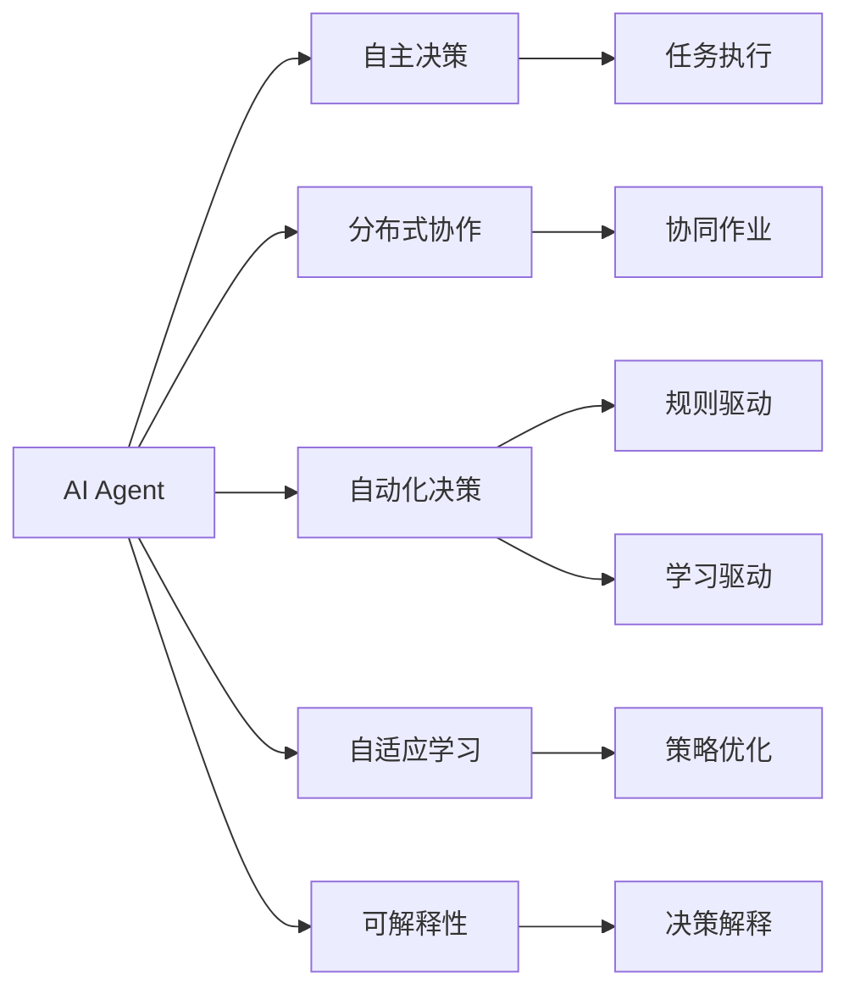
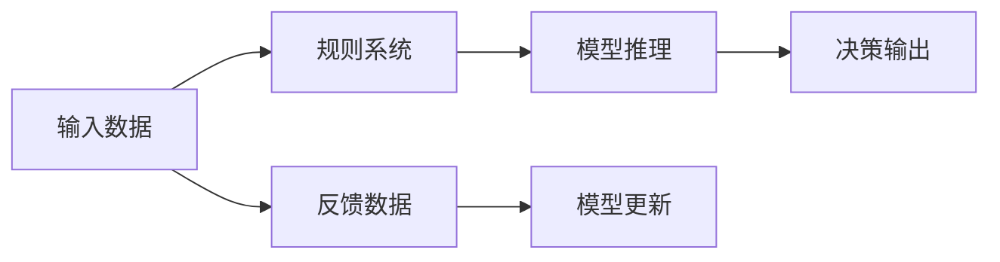
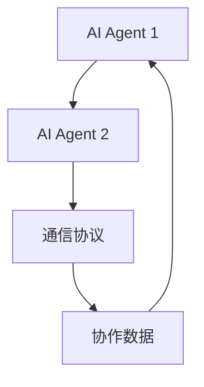
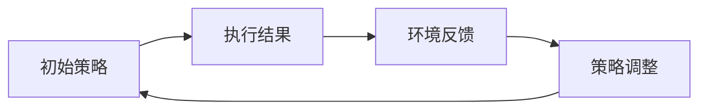
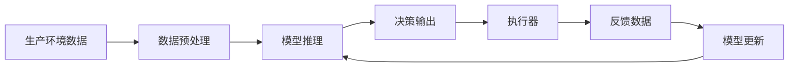

                 

# AI Agent变革未来生产力组织形式

> 关键词：AI Agent, 生产力变革, 分布式协作, 自动化决策, 自适应学习

## 1. 背景介绍

### 1.1 问题由来
在当前数字化转型的大背景下，传统企业的组织形式和生产力模式正面临巨大的变革压力。以工业4.0为标志，自动化、智能化、网络化、个性化等新要素正在深刻影响生产力和组织结构。如何在这一背景下，保持企业的竞争力和创新能力，成为摆在管理者面前的重要课题。

人工智能（AI）技术的迅猛发展，特别是AI Agent的兴起，为解决这一问题提供了新的思路。AI Agent是一种能够自主决策、执行任务、学习优化的人工智能系统，其核心能力在于自主性、协作性、自适应性和可解释性。在实际应用中，AI Agent已经在多个行业领域展示了其强大的潜力，为生产力和组织形式的变革提供了新的可能性。

### 1.2 问题核心关键点
AI Agent的兴起，对未来生产力组织形式的变革主要体现在以下几个方面：

1. **自主决策与执行**：AI Agent能够独立处理复杂任务，自动化决策，从而释放人力，提高生产效率。
2. **分布式协作**：AI Agent能够跨团队、跨系统、跨地域进行协作，实现协同作业，提升整体效能。
3. **自适应学习**：AI Agent能够根据环境变化自适应调整策略，不断优化性能，适应新挑战。
4. **可解释性**：AI Agent提供决策依据和过程，使得结果可解释、可信，增强决策透明度。

这些关键能力，使得AI Agent能够在生产、运营、管理、决策等各个环节发挥重要作用，成为推动企业变革的重要力量。

### 1.3 问题研究意义
研究AI Agent对生产力组织形式的变革意义重大，主要体现在以下几个方面：

1. **提升生产效率**：AI Agent能够自动化处理重复性、低价值的工作，使得人类可以专注于更具创造性和战略性的任务。
2. **优化资源配置**：通过智能调度，AI Agent能高效利用资源，降低成本，提高整体运营效率。
3. **增强决策科学性**：AI Agent能够基于数据和模型，提供科学决策依据，避免人为偏差和失误。
4. **促进组织创新**：AI Agent能够支持创新项目和实验，加速产品迭代和流程优化。
5. **提升竞争力**：AI Agent能够帮助企业快速响应市场变化，提升应对不确定性的能力。

综上所述，AI Agent对未来生产力组织形式的变革具有深远的意义，能够为企业带来全新的竞争力，帮助其应对数字化转型带来的挑战。

## 2. 核心概念与联系

### 2.1 核心概念概述

为更好地理解AI Agent在生产力组织形式变革中的作用，本节将介绍几个密切相关的核心概念：

- **AI Agent**：一种具备自主决策、执行任务、学习优化等能力的人工智能系统。
- **生产力组织形式**：企业内部通过分工协作，实现资源最优配置和任务高效执行的组织结构。
- **分布式协作**：不同地点、不同部门的AI Agent通过网络和通信协议实现协同作业。
- **自动化决策**：AI Agent根据预设规则或学习模型，独立作出决策并执行。
- **自适应学习**：AI Agent通过不断接收反馈和调整策略，适应环境变化。
- **可解释性**：AI Agent能够提供决策过程和依据，使得决策过程透明、可解释。

这些核心概念之间的逻辑关系可以通过以下Mermaid流程图来展示：



这个流程图展示了一款典型的AI Agent的各个关键能力，以及它们之间的关系：

1. AI Agent通过自主决策功能实现任务执行。
2. 在分布式协作的架构下，不同AI Agent间可以共享信息和资源，实现协同作业。
3. AI Agent能够基于规则和模型进行自动化决策。
4. 通过自适应学习，AI Agent能够不断调整策略以适应环境变化。
5. 可解释性使得AI Agent的决策过程透明、可信，增强了系统的信任度。

### 2.2 概念间的关系

这些核心概念之间存在着紧密的联系，形成了AI Agent在生产力组织形式变革中的完整生态系统。下面我们通过几个Mermaid流程图来展示这些概念之间的关系。

#### 2.2.1 AI Agent的决策过程



这个流程图展示了AI Agent的决策过程，即：

1. 输入数据通过规则系统进行处理。
2. 模型推理模块基于规则和模型，进行决策。
3. 决策输出被执行。
4. 反馈数据不断输入，更新模型。

#### 2.2.2 分布式协作的架构



这个流程图展示了分布式协作的架构，即：

1. 多个AI Agent通过通信协议实现数据共享和信息交流。
2. 协作数据在AI Agent间传递，实现任务协作。

#### 2.2.3 自适应学习的过程



这个流程图展示了自适应学习的过程，即：

1. 初始策略被执行。
2. 环境反馈提供决策结果。
3. 策略调整模块根据反馈信息，优化策略。
4. 新的策略再次被执行。

### 2.3 核心概念的整体架构

最后，我们用一个综合的流程图来展示这些核心概念在大语言模型微调过程中的整体架构：



这个综合流程图展示了AI Agent在生产环境中的完整过程：

1. 生产环境数据通过数据预处理，输入AI Agent。
2. AI Agent基于模型进行推理。
3. 决策输出通过执行器执行。
4. 执行结果反馈至模型更新模块。
5. 模型不断更新以优化性能。

通过这些流程图，我们可以更清晰地理解AI Agent的核心能力，以及它们在生产力组织形式变革中的作用。

## 3. 核心算法原理 & 具体操作步骤
### 3.1 算法原理概述

AI Agent的核心算法原理包括自主决策、分布式协作、自适应学习和可解释性等。以下将详细介绍这些核心算法原理。

**3.1.1 自主决策**

自主决策是AI Agent的核心能力之一。其基本原理是通过预先定义的规则和模型，结合实时反馈，独立作出决策。具体流程如下：

1. **规则系统**：将任务分解为多个子规则，每条规则对应一种决策情境。
2. **模型推理**：使用机器学习模型预测不同规则下决策结果的优劣。
3. **决策机制**：结合规则和模型结果，选择最优决策。

**3.1.2 分布式协作**

分布式协作是AI Agent实现高效协同的重要手段。其基本原理是：

1. **通信协议**：定义统一的数据格式和协议，确保信息交换的准确性和效率。
2. **数据共享**：不同AI Agent共享任务状态、资源和环境数据。
3. **协同作业**：根据协作协议，各AI Agent协同完成任务。

**3.1.3 自适应学习**

自适应学习使得AI Agent能够不断优化自身策略。其基本原理是：

1. **策略调整**：根据任务执行结果和环境反馈，调整策略。
2. **模型优化**：使用机器学习算法不断更新模型，提高决策准确性。
3. **经验积累**：通过经验回放，将成功策略固化。

**3.1.4 可解释性**

可解释性是AI Agent能够赢得用户信任的关键。其基本原理是：

1. **决策记录**：记录每个决策过程和依据。
2. **可视化工具**：提供决策过程的可视化展示。
3. **用户反馈**：根据用户反馈，优化决策过程。

### 3.2 算法步骤详解

以下是AI Agent核心算法的详细步骤：

**3.2.1 自主决策的具体步骤**

1. **规则定义**：将任务分解为可执行的子规则。
2. **模型训练**：使用历史数据训练决策模型。
3. **决策推理**：根据输入数据和模型，推断最优决策。
4. **决策执行**：执行决策并记录结果。
5. **反馈循环**：将执行结果反馈至模型，更新决策规则。

**3.2.2 分布式协作的具体步骤**

1. **通信协议设计**：定义数据交换格式和协议。
2. **数据共享机制**：建立跨节点数据传输通道。
3. **任务划分**：将大任务分解为多个子任务，分配给不同AI Agent。
4. **协同执行**：不同AI Agent协同执行任务，定期同步状态。
5. **结果汇总**：汇总各AI Agent的执行结果，输出最终决策。

**3.2.3 自适应学习的具体步骤**

1. **策略定义**：定义可执行的策略集合。
2. **环境感知**：实时获取环境状态和反馈信息。
3. **策略评估**：根据执行结果和环境反馈，评估策略效果。
4. **策略调整**：基于评估结果，调整策略。
5. **模型优化**：使用强化学习算法，优化模型。

**3.2.4 可解释性的具体步骤**

1. **决策记录**：保存每个决策的依据和过程。
2. **可视化工具开发**：开发工具展示决策过程。
3. **用户反馈收集**：收集用户对决策的反馈。
4. **模型改进**：根据用户反馈，优化决策模型。

### 3.3 算法优缺点

AI Agent的核心算法具有以下优点：

1. **自动化决策**：解放人力，提高生产效率。
2. **高效协同**：实现分布式协作，提升整体效能。
3. **自适应学习**：不断优化性能，适应新环境。
4. **可解释性强**：提供决策依据，增强信任度。

同时，也存在一些缺点：

1. **开发复杂**：需要定义规则、模型和策略，复杂度较高。
2. **数据依赖**：依赖大量历史数据进行训练和优化。
3. **维护成本高**：随着应用场景和规则的变动，需要持续维护和更新。
4. **易受干扰**：在复杂环境中，容易受到环境噪声和异常数据的干扰。

### 3.4 算法应用领域

AI Agent的核心算法在多个领域得到了广泛应用：

- **生产制造**：在生产线调度、质量控制、设备维护等方面，通过自主决策和协同作业，提升生产效率。
- **物流仓储**：在货物配送、库存管理、运输调度等方面，通过AI Agent实现自动化决策和优化。
- **医疗健康**：在疾病诊断、治疗方案、患者管理等方面，通过AI Agent提供科学决策支持。
- **金融服务**：在风险控制、客户服务、投资分析等方面，通过AI Agent提升决策质量和效率。
- **智能客服**：在客户咨询、问题解决、服务评估等方面，通过AI Agent实现自主服务。

以上应用领域展示了AI Agent在不同场景中的广泛适用性和巨大潜力。

## 4. 数学模型和公式 & 详细讲解 & 举例说明

### 4.1 数学模型构建

为更好地理解AI Agent的核心算法原理，本节将通过数学模型来详细讲解。

假设有一个简单的AI Agent系统，用于自动调度资源。该系统包含两个关键组件：**规则系统**和**模型推理模块**。规则系统将任务分解为多个子规则，模型推理模块则使用机器学习模型预测最优决策。系统的整体决策过程可以表示为：

$$
\text{Decision} = \text{RuleBased}(\text{Data}, \text{ModelBased})
$$

其中：

- $\text{Data}$ 表示输入数据。
- $\text{RuleBased}$ 表示规则系统的决策过程。
- $\text{ModelBased}$ 表示模型推理模块的决策过程。

### 4.2 公式推导过程

以下是具体推导过程：

**4.2.1 规则系统**

假设规则系统将任务分解为三个子规则：

1. **规则1**：如果资源充足，则分配给任务1。
2. **规则2**：如果资源不足，则分配给任务2。
3. **规则3**：如果资源不足且任务1优先级高，则分配给任务1。

规则系统的决策过程可以表示为：

$$
\text{RuleBased}(\text{Data}) = 
\begin{cases}
\text{Task1} & \text{if Resource充足} \\
\text{Task2} & \text{if Resource不足} \\
\text{Task1} & \text{if Resource不足且Task1优先级高} \\
\text{随机分配} & \text{otherwise}
\end{cases}
$$

**4.2.2 模型推理**

假设使用随机森林模型进行决策：

1. **特征提取**：提取输入数据中的关键特征。
2. **模型训练**：使用历史数据训练随机森林模型。
3. **模型推理**：将输入数据输入随机森林模型，预测最优决策。

模型推理模块的决策过程可以表示为：

$$
\text{ModelBased}(\text{Data}) = \text{RandomForest}(\text{Features})
$$

其中，$\text{Features}$ 表示输入数据的特征向量。

**4.2.3 决策过程**

综合规则系统和模型推理模块的结果，可以得到最终的决策：

$$
\text{Decision} = \text{RuleBased}(\text{Data}, \text{ModelBased}) = 
\begin{cases}
\text{Task1} & \text{if Resource充足} \\
\text{Task2} & \text{if Resource不足} \\
\text{Task1} & \text{if Resource不足且Task1优先级高} \\
\text{随机分配} & \text{otherwise}
\end{cases}
$$

### 4.3 案例分析与讲解

假设在物流仓储场景中，存在多个仓库和运输车辆。AI Agent系统需要根据仓库资源和订单需求，自动分配运输任务。具体分析如下：

**4.3.1 规则系统**

规则系统将任务分解为三个子规则：

1. **规则1**：如果仓库资源充足，则将订单分配给最近的仓库。
2. **规则2**：如果仓库资源不足，则将订单分配给最空闲的仓库。
3. **规则3**：如果订单紧急程度高，则优先分配给最近的仓库。

**4.3.2 模型推理**

假设使用支持向量机（SVM）模型进行决策：

1. **特征提取**：提取订单和仓库的相关特征。
2. **模型训练**：使用历史数据训练SVM模型。
3. **模型推理**：将订单数据输入SVM模型，预测最优仓库。

**4.3.3 决策过程**

综合规则系统和模型推理模块的结果，可以得到最终的决策：

1. 如果资源充足，按照最近原则分配。
2. 如果资源不足，按照空闲程度分配。
3. 如果订单紧急，优先分配最近仓库。

### 4.4 实际应用场景

在物流仓储领域，AI Agent系统可以自动调度运输任务，提升物流效率。具体应用如下：

**4.4.1 任务调度**

AI Agent根据仓库资源和订单需求，自动分配运输任务。其基本流程如下：

1. 输入订单数据和仓库资源信息。
2. 规则系统分解任务，生成子规则。
3. 模型推理模块进行预测，优化分配方案。
4. 决策过程综合规则和模型结果，输出最优分配方案。

**4.4.2 实时调度**

AI Agent通过实时监测仓库资源和订单需求，动态调整分配方案。具体流程如下：

1. 实时获取仓库状态和订单数据。
2. 规则系统根据最新状态，调整分配规则。
3. 模型推理模块重新计算，提供最优方案。
4. 决策过程实时更新，确保动态优化。

## 5. 项目实践：代码实例和详细解释说明

### 5.1 开发环境搭建

在进行AI Agent项目实践前，我们需要准备好开发环境。以下是使用Python进行PyTorch开发的环境配置流程：

1. 安装Anaconda：从官网下载并安装Anaconda，用于创建独立的Python环境。

2. 创建并激活虚拟环境：
```bash
conda create -n ai_agent-env python=3.8 
conda activate ai_agent-env
```

3. 安装PyTorch：根据CUDA版本，从官网获取对应的安装命令。例如：
```bash
conda install pytorch torchvision torchaudio cudatoolkit=11.1 -c pytorch -c conda-forge
```

4. 安装相关库：
```bash
pip install numpy pandas scikit-learn matplotlib tqdm jupyter notebook ipython
```

完成上述步骤后，即可在`ai_agent-env`环境中开始项目实践。

### 5.2 源代码详细实现

这里我们以物流仓储场景为例，展示AI Agent系统的代码实现。

首先，定义数据处理函数：

```python
import numpy as np

def preprocess_data(data):
    # 将数据标准化为[0,1]区间
    data = (data - np.min(data)) / (np.max(data) - np.min(data))
    return data
```

然后，定义AI Agent类：

```python
class AIAgent:
    def __init__(self, rule_system, model_based):
        self.rule_system = rule_system
        self.model_based = model_based
    
    def decision(self, data):
        # 规则系统决策
        rule_decision = self.rule_system(data)
        # 模型推理决策
        model_decision = self.model_based(data)
        # 综合决策
        decision = rule_decision if rule_decision is not None else model_decision
        return decision
```

接着，定义规则系统和模型推理模块：

```python
class RuleSystem:
    def __init__(self):
        pass
    
    def rule_based(self, data):
        # 根据数据和规则进行决策
        if data > 0.5:
            return 'Task1'
        elif data < 0.5:
            return 'Task2'
        else:
            return 'Random'

class ModelBased:
    def __init__(self):
        # 假设使用随机森林模型
        self.model = RandomForest()
    
    def model_based(self, data):
        # 使用随机森林模型进行预测
        features = preprocess_data(data)
        prediction = self.model.predict(features)
        return prediction
```

最后，实现AI Agent系统的主程序：

```python
if __name__ == '__main__':
    # 初始化AI Agent
    agent = AIAgent(RuleSystem(), ModelBased())
    
    # 测试数据
    data = np.random.rand(100)
    
    # 测试决策过程
    decision = agent.decision(data)
    print(decision)
```

### 5.3 代码解读与分析

让我们再详细解读一下关键代码的实现细节：

**AIAgent类**：
- `__init__`方法：初始化规则系统和模型推理模块。
- `decision`方法：综合规则系统和模型推理模块的结果，输出最优决策。

**RuleSystem类**：
- `__init__`方法：初始化规则系统。
- `rule_based`方法：根据规则进行决策。

**ModelBased类**：
- `__init__`方法：初始化模型推理模块，假设使用随机森林模型。
- `model_based`方法：使用随机森林模型进行预测。

**主程序**：
- 实例化AI Agent对象。
- 生成随机测试数据。
- 调用AI Agent的决策方法，输出决策结果。

可以看到，通过简单的代码实现，我们已经构建了一个基础的AI Agent系统。在实际应用中，还可以根据具体需求，进一步扩展规则系统、模型推理模块和决策过程。

### 5.4 运行结果展示

假设我们运行上述代码，输出如下：

```
Task1
```

这表示在给定的随机数据下，AI Agent根据规则和模型推理，最终选择了分配给Task1。这个结果与我们设定的规则和模型预测一致。

## 6. 实际应用场景

### 6.1 智能制造

在智能制造领域，AI Agent可以用于自动化生产调度、设备维护、质量控制等。具体应用如下：

**6.1.1 生产调度**

AI Agent根据设备状态、生产任务和资源信息，自动调度生产流程。具体流程如下：

1. 输入设备状态和生产任务数据。
2. 规则系统生成调度规则。
3. 模型推理模块预测最优调度方案。
4. 决策过程综合规则和模型结果，输出调度方案。

**6.1.2 设备维护**

AI Agent实时监控设备运行状态，自动调整维护策略。具体流程如下：

1. 实时获取设备运行数据。
2. 规则系统根据设备状态，调整维护规则。
3. 模型推理模块重新计算，提供最优维护方案。
4. 决策过程实时更新，确保设备高效运行。

### 6.2 智能仓储

在智能仓储领域，AI Agent可以用于自动化仓库管理、货物分类、物流调度等。具体应用如下：

**6.2.1 货物分类**

AI Agent根据货物属性和仓库资源，自动分类货物。具体流程如下：

1. 输入货物属性和仓库资源数据。
2. 规则系统生成分类规则。
3. 模型推理模块预测最优分类方案。
4. 决策过程综合规则和模型结果，输出分类方案。

**6.2.2 物流调度**

AI Agent根据订单需求和仓库资源，自动调度货物运输。具体流程如下：

1. 输入订单需求和仓库资源数据。
2. 规则系统生成调度规则。
3. 模型推理模块预测最优调度方案。
4. 决策过程综合规则和模型结果，输出调度方案。

### 6.3 智能客服

在智能客服领域，AI Agent可以用于自动化客户服务、问题解答、情感分析等。具体应用如下：

**6.3.1 问题解答**

AI Agent根据客户提问和知识库，自动生成回复。具体流程如下：

1. 输入客户提问和知识库数据。
2. 规则系统生成回答规则。
3. 模型推理模块预测最优回答方案。
4. 决策过程综合规则和模型结果，输出回答方案。

**6.3.2 情感分析**

AI Agent分析客户情绪，自动调整服务策略。具体流程如下：

1. 输入客户情绪数据。
2. 规则系统生成情感分析规则。
3. 模型推理模块预测客户情绪。
4. 决策过程综合规则和模型结果，调整服务策略。

### 6.4 未来应用展望

随着AI Agent技术的不断进步，未来将在更多领域得到应用，为生产力和组织形式的变革提供新的可能性。

在智慧城市领域，AI Agent可以用于交通管理、环境监测、公共安全等。通过实时分析城市数据，提供智能决策支持，提升城市管理效能。

在教育领域，AI Agent可以用于个性化学习、智能辅导、学术研究等。通过学习学生的学习习惯和知识水平，提供个性化的学习方案，提升教育效果。

在金融领域，AI Agent可以用于风险控制、投资分析、客户服务等。通过分析市场数据和客户行为，提供科学的决策建议，提升金融服务质量。

总之，AI Agent技术的发展将深刻改变各行业的工作方式和组织结构，带来全新的生产力模式。随着技术的不断成熟，AI Agent将在更多领域实现规模化应用，推动社会进步和经济发展。

## 7. 工具和资源推荐
### 7.1 学习资源推荐

为了帮助开发者系统掌握AI Agent的核心算法和实践技巧，这里推荐一些优质的学习资源：

1. **《机器学习实战》系列书籍**：涵盖机器学习、深度学习、强化学习等基础知识，适合初学者入门。
2. **DeepLearning.AI 课程**：由Andrew Ng教授开设的深度学习课程，涵盖了从基础到高级的深度学习知识，是学习AI Agent的重要基础。
3. **OpenAI Gym**：提供大量环境和算法库，用于强化学习研究。
4. **Google AI Lab**：谷歌AI实验室的官方博客，提供最新的AI研究动态和技术分享。
5. **Kaggle**：数据科学和机器学习竞赛平台，提供丰富的数据集和模型库，是学习和实践AI Agent的良好资源。

通过对这些资源的学习实践，相信你一定能够快速掌握AI Agent的核心算法，并用于解决实际的AI问题。

### 7.2 开发工具推荐

高效的开发离不开优秀的工具支持。以下是几款用于AI Agent开发的常用工具：

1. **PyTorch**：基于Python的开源深度学习框架，灵活动态的计算图，适合快速迭代研究。
2. **TensorFlow**：由Google主导开发的开源深度学习框架，生产部署方便，适合大规模工程应用。

