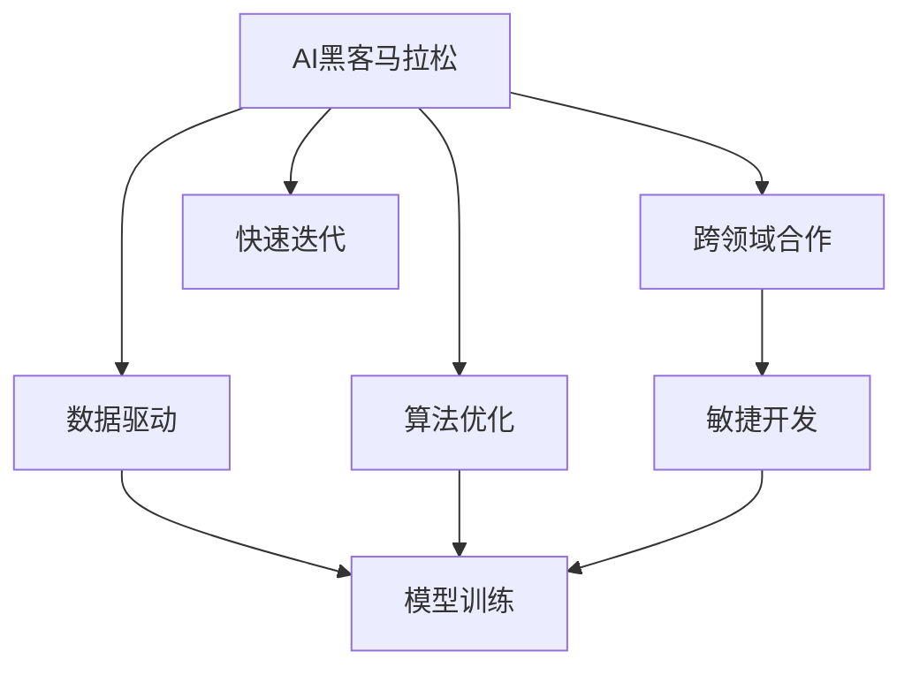

                 

# AI hackathon中的创新与未来

> 关键词：AI hackathon, 创新, 未来趋势, 算法, 实践, 工具推荐, 学习资源

## 1. 背景介绍

### 1.1 问题由来

在当今人工智能(AI)的浪潮中，黑客马拉松(hackathon)成为了推动技术创新和应用落地的重要平台。hackathon不仅仅是软件开发者的编码比赛，更是跨领域团队合作、快速迭代、解决问题和展现创意的舞台。在AI hackathon中，参赛团队需要解决各种实际问题，提出创新解决方案，推动技术的进步和应用的普及。

### 1.2 问题核心关键点

AI hackathon的核心在于通过跨领域团队合作，快速迭代出具有创新性、可实现性和可落地性的解决方案。其关键点包括：

1. **跨领域合作**：AI黑客马拉松集结来自计算机科学、数据科学、商业分析、设计等多个领域的专家，共同解决复杂问题。
2. **快速迭代**：在有限的时间内，通过敏捷开发和原型快速迭代，不断调整和优化解决方案。
3. **实际问题导向**：从现实问题出发，提出切实可行的解决方案，并展示其实际应用效果。
4. **创新性**：鼓励新思路、新算法和新方法，推动技术边界和应用领域的扩展。

### 1.3 问题研究意义

AI hackathon对技术创新和应用推广具有重要意义：

1. **推动技术进步**：通过问题导向的竞赛，快速迭代和优化算法，推动AI技术的研究和发展。
2. **促进应用落地**：将前沿技术转化为具体应用，解决实际问题，加速AI技术的产业化进程。
3. **培养创新人才**：在实践中培养跨领域的创新能力和团队协作精神，为未来AI领域的可持续发展提供人才保障。
4. **跨领域交流**：促进不同领域的知识交流与融合，拓宽AI应用场景，推动AI技术在各行各业的应用。

## 2. 核心概念与联系

### 2.1 核心概念概述

为了更好地理解AI hackathon中创新与未来发展的关系，本节将介绍几个关键概念及其之间的联系。

#### 2.1.1 AI黑客马拉松

AI黑客马拉松是一个集结各领域专家，在限定时间内通过团队协作，提出和实现创新解决方案的平台。其核心在于将实际问题转化为技术挑战，通过迭代和优化快速推出可落地的应用。

#### 2.1.2 快速迭代与敏捷开发

快速迭代和敏捷开发是AI黑客马拉松中常用的方法。通过小步快跑、不断验证和调整，确保每个阶段的产品都能满足实际需求，提高开发效率和质量。

#### 2.1.3 数据驱动与算法优化

在AI黑客马拉松中，数据驱动是核心思想之一。通过收集和分析数据，指导算法的设计和优化，确保解决方案的有效性。同时，算法优化也是提高模型性能、实现创新的关键环节。

#### 2.1.4 跨领域协作与知识融合

AI黑客马拉松的成功离不开跨领域的协作与知识融合。不同领域的专家能够互补优势，提出创新性的解决方案。

### 2.2 概念间的关系

这些核心概念之间存在着紧密的联系，形成了AI黑客马拉松创新与未来发展的完整生态系统。下面通过一个Mermaid流程图来展示这些概念之间的关系：



这个流程图展示了大规模语言模型微调过程中各个概念的关系：

1. AI黑客马拉松作为平台，集结跨领域的团队。
2. 通过敏捷开发和快速迭代，不断优化解决方案。
3. 数据驱动确保模型训练的有效性。
4. 算法优化提升模型性能。

这些概念共同构成了AI黑客马拉松的创新与未来发展框架，使其能够在各种场景下推动技术进步和应用推广。

## 3. 核心算法原理 & 具体操作步骤
### 3.1 算法原理概述

AI黑客马拉松中的算法创新主要围绕以下几个核心原理展开：

1. **数据增强**：通过数据增强技术，扩充训练集，提高模型的泛化能力。
2. **迁移学习**：利用预训练模型作为初始化参数，进行微调，提升模型性能。
3. **对抗训练**：引入对抗样本，增强模型鲁棒性，防止过拟合。
4. **集成学习**：通过模型集成，提高模型的稳定性和准确性。

这些原理构成了AI黑客马拉松算法创新的基础，推动了技术的不断进步。

### 3.2 算法步骤详解

以下是AI黑客马拉松中算法创新的具体操作步骤：

**Step 1: 数据预处理**

1. **数据收集与标注**：收集与问题相关的数据集，并进行标注。数据标注需要充分考虑数据的多样性和代表性。
2. **数据清洗与预处理**：去除噪声和异常值，进行标准化和归一化处理。

**Step 2: 模型设计与训练**

1. **模型选择与调整**：根据问题特点选择合适的模型，并根据数据分布进行调整。常用的模型包括决策树、随机森林、神经网络等。
2. **模型训练与优化**：使用优化算法对模型进行训练，并通过交叉验证等方法进行调参和优化。

**Step 3: 模型评估与迭代**

1. **模型评估**：使用测试集对模型进行评估，根据评估结果进行迭代。
2. **算法创新与改进**：结合实际问题需求，进行算法创新和改进，如引入新算法、调整模型结构等。

**Step 4: 应用部署与优化**

1. **模型部署**：将模型部署到实际应用中，进行性能测试。
2. **性能优化**：根据实际应用情况，对模型进行优化，如提升推理速度、降低内存占用等。

### 3.3 算法优缺点

AI黑客马拉松中的算法创新具有以下优点：

1. **高效快速**：通过敏捷开发和快速迭代，在短时间内提出解决方案，提升研发效率。
2. **针对性**：针对实际问题进行算法设计，确保解决方案的可行性和落地性。
3. **创新性**：结合跨领域知识，提出创新性的算法和解决方案。

同时，也存在以下缺点：

1. **资源限制**：在有限的时间内，资源和数据受限，可能影响算法优化和模型性能。
2. **问题复杂**：一些复杂问题难以在短时间内得到完美的解决方案。
3. **迭代次数有限**：每次迭代时间较短，可能导致一些算法未能充分验证和优化。

### 3.4 算法应用领域

AI黑客马拉松中的算法创新广泛应用于各个领域，例如：

1. **医疗诊断**：通过AI技术辅助医生进行疾病诊断和治疗方案优化。
2. **金融风控**：使用AI技术进行信用评估和风险控制，降低金融风险。
3. **智能交通**：利用AI技术优化交通流量，提高交通效率和安全性。
4. **智能客服**：通过AI技术提升客户服务体验，提高客户满意度。
5. **智能制造**：利用AI技术进行生产过程优化，提高生产效率和质量。

## 4. 数学模型和公式 & 详细讲解 & 举例说明

### 4.1 数学模型构建

在AI黑客马拉松中，数学模型是算法创新的核心。以下是常见的数学模型及其构建方法：

1. **线性回归模型**：用于解决连续变量的预测问题，公式为：$y = \beta_0 + \beta_1 x_1 + \beta_2 x_2 + \cdots + \beta_n x_n + \epsilon$。
2. **逻辑回归模型**：用于解决分类问题，公式为：$\ln \frac{p(y=1)}{1-p(y=1)} = \beta_0 + \beta_1 x_1 + \beta_2 x_2 + \cdots + \beta_n x_n$。
3. **决策树模型**：用于解决分类和回归问题，公式为：$T = \bigcup_{i=1}^m T_i$，其中$T_i$为决策树的分支节点。

### 4.2 公式推导过程

以线性回归模型为例，推导其最小二乘法解法：

1. **模型建立**：$y = \beta_0 + \beta_1 x_1 + \beta_2 x_2 + \cdots + \beta_n x_n + \epsilon$
2. **损失函数**：$L(\beta) = \frac{1}{2N} \sum_{i=1}^N (y_i - (\beta_0 + \beta_1 x_{i1} + \beta_2 x_{i2} + \cdots + \beta_n x_{in}))^2$
3. **梯度下降**：$\nabla_{\beta} L(\beta) = \frac{1}{N} \sum_{i=1}^N (y_i - \hat{y_i})(x_{i1}, x_{i2}, \cdots, x_{in})^T$
4. **参数更新**：$\beta_{k+1} = \beta_k - \eta \nabla_{\beta} L(\beta_k)$

### 4.3 案例分析与讲解

以医疗诊断问题为例，展示线性回归模型的应用：

假设有一组患者数据，包括年龄、性别、血压、血糖等特征，以及是否患糖尿病的标签。目标是通过线性回归模型预测患糖尿病的概率。

首先，对数据进行预处理和标准化：

```python
import pandas as pd
from sklearn.model_selection import train_test_split
from sklearn.linear_model import LinearRegression
from sklearn.metrics import mean_squared_error

# 读取数据
data = pd.read_csv('diabetes.csv')

# 划分训练集和测试集
X = data[['age', 'gender', 'blood_pressure', 'blood_glucose']]
y = data['diabetes']
X_train, X_test, y_train, y_test = train_test_split(X, y, test_size=0.2, random_state=42)

# 标准化数据
from sklearn.preprocessing import StandardScaler
scaler = StandardScaler()
X_train = scaler.fit_transform(X_train)
X_test = scaler.transform(X_test)

# 建立模型
model = LinearRegression()
model.fit(X_train, y_train)

# 预测
y_pred = model.predict(X_test)

# 评估
mse = mean_squared_error(y_test, y_pred)
print('Mean Squared Error:', mse)
```

通过模型评估和调参，可以得到较好的预测效果。

## 5. 项目实践：代码实例和详细解释说明

### 5.1 开发环境搭建

在AI黑客马拉松中，开发环境搭建是项目成功的基础。以下是常用的开发环境搭建步骤：

1. **安装Python**：在参赛团队中，确保每个人都能安装Python 3.x及以上版本。
2. **安装相关库**：安装常用的Python库，如NumPy、Pandas、Scikit-learn等。
3. **配置IDE**：使用Jupyter Notebook、PyCharm等IDE进行代码编写和调试。
4. **数据管理**：使用Git等版本控制系统管理数据和代码，确保团队成员协作顺畅。

### 5.2 源代码详细实现

以下是一个医疗诊断的Python代码实现，展示线性回归模型的应用：

```python
import pandas as pd
from sklearn.model_selection import train_test_split
from sklearn.linear_model import LinearRegression
from sklearn.metrics import mean_squared_error

# 读取数据
data = pd.read_csv('diabetes.csv')

# 划分训练集和测试集
X = data[['age', 'gender', 'blood_pressure', 'blood_glucose']]
y = data['diabetes']
X_train, X_test, y_train, y_test = train_test_split(X, y, test_size=0.2, random_state=42)

# 标准化数据
from sklearn.preprocessing import StandardScaler
scaler = StandardScaler()
X_train = scaler.fit_transform(X_train)
X_test = scaler.transform(X_test)

# 建立模型
model = LinearRegression()
model.fit(X_train, y_train)

# 预测
y_pred = model.predict(X_test)

# 评估
mse = mean_squared_error(y_test, y_pred)
print('Mean Squared Error:', mse)
```

### 5.3 代码解读与分析

代码中，我们首先使用Pandas读取数据，然后通过Scikit-learn的train_test_split函数将数据划分为训练集和测试集。接着，使用StandardScaler对数据进行标准化，以提高模型性能。最后，使用LinearRegression模型进行训练和预测，并使用mean_squared_error函数评估模型效果。

## 6. 实际应用场景

### 6.4 未来应用展望

AI黑客马拉松中的算法创新将在未来得到广泛应用，以下是几个可能的未来应用场景：

1. **智慧城市**：通过AI技术优化城市管理，提高资源利用效率和公共服务水平。
2. **智能家居**：利用AI技术提升家居智能化水平，提高生活质量和安全性。
3. **智能交通**：利用AI技术优化交通流量，提高交通效率和安全性。
4. **医疗健康**：通过AI技术辅助医生进行疾病诊断和治疗方案优化，提高医疗服务质量。
5. **金融服务**：使用AI技术进行信用评估和风险控制，降低金融风险。

## 7. 工具和资源推荐

### 7.1 学习资源推荐

为了帮助开发者系统掌握AI黑客马拉松的理论基础和实践技巧，这里推荐一些优质的学习资源：

1. **《Python数据科学手册》**：深入浅出地介绍了Python在数据科学中的应用，包括数据处理、机器学习等。
2. **Coursera AI课程**：提供从基础到高级的AI课程，涵盖机器学习、深度学习、计算机视觉等领域。
3. **Kaggle竞赛平台**：提供各种AI竞赛和数据集，帮助开发者实践和提升AI技术。
4. **GitHub开源项目**：展示各领域的最新AI项目和技术，提供学习和贡献的机会。

通过这些资源的学习实践，相信你一定能够快速掌握AI黑客马拉松的核心技术和创新方法。

### 7.2 开发工具推荐

高效的工具是实现AI黑客马拉松项目成功的关键。以下是几款用于AI开发的常用工具：

1. **Jupyter Notebook**：开源的交互式Python环境，支持代码编写、数据可视化等。
2. **PyCharm**：商业级的Python IDE，提供丰富的代码调试和性能优化功能。
3. **TensorFlow**：由Google主导的开源深度学习框架，支持分布式计算和GPU加速。
4. **Scikit-learn**：常用的Python机器学习库，提供丰富的模型和算法。
5. **Git**：版本控制系统，支持代码协作和项目管理。

这些工具能够显著提升开发效率和代码质量，使开发者能够更加专注于算法创新和问题解决。

### 7.3 相关论文推荐

AI黑客马拉松中的算法创新离不开相关论文的支撑。以下是几篇奠基性的相关论文，推荐阅读：

1. **《深度学习》（Goodfellow等）**：全面介绍了深度学习的基本原理和应用，是深度学习领域的经典教材。
2. **《机器学习实战》（Peter Harrington）**：通过实战案例介绍了机器学习算法和应用，适合初学者和实践者。
3. **《强化学习》（Richard Sutton等）**：介绍了强化学习的基本理论和应用，涵盖决策、控制、游戏等多个领域。
4. **《统计学习方法》（李航）**：介绍了统计学习的基本理论和应用，涵盖分类、回归、聚类等多个领域。

这些论文代表了大规模语言模型微调技术的发展脉络。通过学习这些前沿成果，可以帮助研究者把握学科前进方向，激发更多的创新灵感。

除上述资源外，还有一些值得关注的前沿资源，帮助开发者紧跟AI黑客马拉松的最新进展，例如：

1. **arXiv论文预印本**：人工智能领域最新研究成果的发布平台，包括大量尚未发表的前沿工作，学习前沿技术的必读资源。
2. **人工智能会议直播**：如NeurIPS、ICML、ACL等人工智能领域顶会现场或在线直播，能够聆听到大佬们的前沿分享，开拓视野。
3. **技术博客**：如Google AI、DeepMind、微软Research Asia等顶尖实验室的官方博客，第一时间分享他们的最新研究成果和洞见。
4. **开源项目**：在GitHub上Star、Fork数最多的AI相关项目，往往代表了该技术领域的发展趋势和最佳实践，值得去学习和贡献。
5. **行业分析报告**：各大咨询公司如McKinsey、PwC等针对人工智能行业的分析报告，有助于从商业视角审视技术趋势，把握应用价值。

总之，对于AI黑客马拉松技术的学习和实践，需要开发者保持开放的心态和持续学习的意愿。多关注前沿资讯，多动手实践，多思考总结，必将收获满满的成长收益。

## 8. 总结：未来发展趋势与挑战

### 8.1 研究成果总结

AI黑客马拉松中的算法创新推动了AI技术的不断进步和应用落地。通过跨领域协作、快速迭代和数据驱动，团队能够在有限的时间内提出切实可行的解决方案，解决实际问题。

### 8.2 未来发展趋势

AI黑客马拉松中的算法创新将呈现以下几个发展趋势：

1. **深度学习与强化学习的融合**：结合深度学习和强化学习，推动AI技术的不断突破。
2. **跨领域知识的融合**：通过跨领域的知识融合，提出更具创新性的解决方案。
3. **联邦学习与隐私保护**：通过联邦学习等技术，保护数据隐私，提高模型泛化能力。
4. **边缘计算与实时推理**：利用边缘计算等技术，提升AI系统的实时性和稳定性。
5. **人工智能伦理与社会责任**：关注AI技术的伦理和社会责任，推动人工智能的可持续发展。

### 8.3 面临的挑战

尽管AI黑客马拉松中的算法创新取得了显著成果，但在迈向更加智能化、普适化应用的过程中，仍面临诸多挑战：

1. **数据隐私与安全**：如何在保护数据隐私的同时，利用数据推动算法创新。
2. **算法透明性与可解释性**：如何提高算法的透明性与可解释性，满足监管要求和用户信任。
3. **模型鲁棒性与泛化能力**：如何在实际应用中提高模型的鲁棒性和泛化能力，避免过拟合和灾难性遗忘。
4. **跨领域知识的整合**：如何更好地整合跨领域的知识，提高AI系统的综合能力。
5. **资源优化与高效部署**：如何在资源有限的情况下，优化算法和模型，实现高效部署。

### 8.4 研究展望

面向未来，AI黑客马拉松中的算法创新需要在以下几个方面寻求新的突破：

1. **无监督与半监督学习**：探索无监督和半监督学习范式，降低对标注数据的依赖，提高模型的泛化能力。
2. **多模态数据融合**：探索多模态数据融合技术，提高AI系统的感知能力和适应能力。
3. **跨领域知识图谱**：构建跨领域知识图谱，提高AI系统的综合能力和创新能力。
4. **自适应学习与在线学习**：探索自适应学习与在线学习技术，提高AI系统的适应能力和实时性。
5. **伦理与法律保障**：探索AI技术的伦理与法律保障机制，推动人工智能的可持续发展。

这些研究方向将推动AI黑客马拉松技术迈向更高的台阶，为构建安全、可靠、可解释、可控的智能系统铺平道路。只有勇于创新、敢于突破，才能不断拓展AI技术的边界，让智能技术更好地造福人类社会。

## 9. 附录：常见问题与解答

**Q1：AI黑客马拉松中的数据处理需要注意哪些问题？**

A: 数据处理是AI黑客马拉松中的关键环节，需要注意以下问题：

1. **数据清洗**：去除噪声和异常值，提高数据质量。
2. **数据标准化**：对数据进行标准化和归一化处理，提高模型性能。
3. **数据增强**：通过数据增强技术，扩充训练集，提高模型的泛化能力。
4. **数据平衡**：确保不同类别的数据分布均衡，避免模型偏向于多数类别。

**Q2：AI黑客马拉松中的算法创新需要考虑哪些因素？**

A: 算法创新需要考虑以下因素：

1. **问题导向**：确保算法创新针对实际问题，提高解决方案的可行性和落地性。
2. **跨领域知识**：结合跨领域知识，提出更具创新性的算法。
3. **数据驱动**：利用数据驱动，指导算法设计和优化。
4. **快速迭代**：通过快速迭代，不断调整和优化算法。

**Q3：AI黑客马拉松中的项目实践有哪些关键步骤？**

A: AI黑客马拉松中的项目实践关键步骤包括：

1. **数据预处理**：收集、清洗和标准化数据。
2. **模型设计与训练**：选择合适的模型，并根据数据分布进行调整和训练。
3. **模型评估与迭代**：使用测试集评估模型，并进行迭代优化。
4. **应用部署与优化**：将模型部署到实际应用中，进行性能测试和优化。

**Q4：AI黑客马拉松中的学习资源推荐有哪些？**

A: 以下是一些AI黑客马拉松中的学习资源推荐：

1. **《Python数据科学手册》**：深入浅出地介绍了Python在数据科学中的应用。
2. **Coursera AI课程**：提供从基础到高级的AI课程。
3. **Kaggle竞赛平台**：提供各种AI竞赛和数据集。
4. **GitHub开源项目**：展示各领域的最新AI项目和技术。

**Q5：AI黑客马拉松中的开发工具推荐有哪些？**

A: 以下是一些AI黑客马拉松中的开发工具推荐：

1. **Jupyter Notebook**：开源的交互式Python环境。
2. **PyCharm**：商业级的Python IDE。
3. **TensorFlow**：由Google主导的开源深度学习框架。
4. **Scikit-learn**：常用的Python机器学习库。
5. **Git**：版本控制系统。

这些工具能够显著提升开发效率和代码质量，使开发者能够更加专注于算法创新和问题解决。

---

作者：禅与计算机程序设计艺术 / Zen and the Art of Computer Programming

