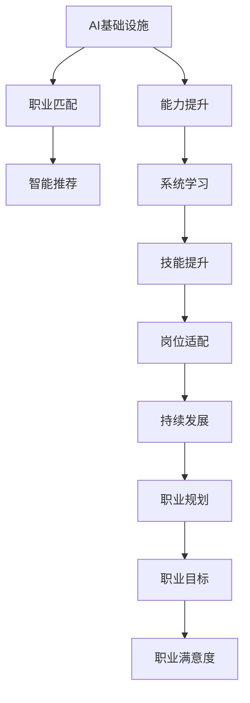
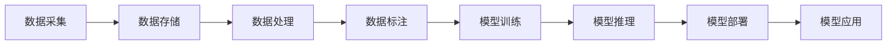
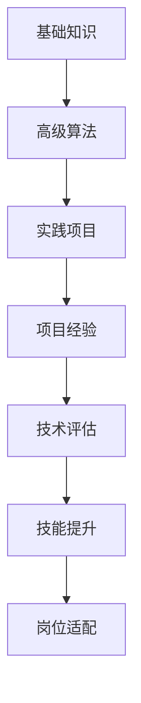
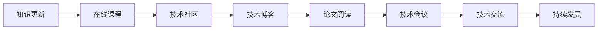
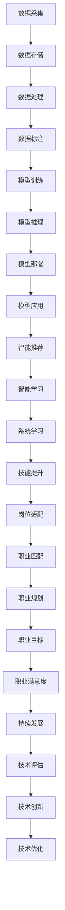

                 

# AI 基础设施的职业规划：智能化职业匹配与发展

## 1. 背景介绍

### 1.1 问题由来

随着人工智能(AI)技术的不断成熟，AI基础设施在各行各业中的应用日益广泛。AI基础设施不仅包括AI模型、算法和工具，还涵盖了数据采集、存储、处理、标注、模型训练、推理部署等多个环节。AI基础设施的职业发展已成为AI从业者关注的焦点。

AI基础设施职业发展的关键问题包括：如何通过职业匹配找到合适的岗位，如何快速提升职业能力，如何在不断变化的技术环境中保持竞争力。本文将通过全面分析AI基础设施的核心概念，探讨智能职业匹配与发展的策略，以期为从业者提供宝贵的参考。

### 1.2 问题核心关键点

AI基础设施职业规划的核心问题包括：

1. **职业匹配：**如何利用AI技术进行智能职业匹配，快速找到最适合自己的岗位。
2. **能力提升：**如何通过系统的学习，提升自己在AI基础设施中的技能水平，满足不同岗位的要求。
3. **持续发展：**如何在快速变化的技术环境中，持续更新知识，保持职业竞争力。

解决这些关键问题，不仅有助于提升个人职业满意度，还能加速AI技术的产业化进程。

### 1.3 问题研究意义

对AI基础设施职业规划的深入研究，对于提升AI从业者的职业发展，加速AI技术的落地应用，具有重要意义：

1. **降低职业转换成本：**通过智能职业匹配，减少人力资源的浪费，降低职业转换的成本和风险。
2. **提升岗位适配性：**通过系统学习，提升从业者的技术水平，确保岗位与个人能力的匹配度。
3. **加速AI应用落地：**通过持续学习，保持技术领先，加速AI技术在各行各业中的应用，推动产业升级。
4. **赋能个人成长：**为从业者提供全方位的职业发展路径和资源，帮助他们实现职业目标。
5. **构建AI生态：**通过系统化的职业规划，培养更多AI人才，构建繁荣的AI生态系统。

## 2. 核心概念与联系

### 2.1 核心概念概述

为了更好地理解AI基础设施的职业规划，本节将介绍几个密切相关的核心概念：

- **AI基础设施：**包括数据采集、存储、处理、标注、模型训练、推理部署等多个环节，是AI技术落地的基础。
- **职业匹配：**通过智能算法，将求职者的技能与岗位需求进行匹配，推荐最适合的职业机会。
- **能力提升：**通过系统的学习，提升从业者在AI基础设施中的技术水平和应用能力。
- **持续发展：**通过持续学习和职业规划，保持从业者的技术领先和职业竞争力。

这些核心概念之间的逻辑关系可以通过以下Mermaid流程图来展示：



这个流程图展示了大语言模型微调过程中各个核心概念的关系和作用：

1. AI基础设施提供了应用AI技术的必要条件。
2. 职业匹配利用智能算法，帮助求职者找到最适合自己的岗位。
3. 能力提升通过系统学习，提升从业者的技术水平。
4. 持续发展确保从业者能够持续更新知识和技能，保持技术领先。
5. 职业规划为从业者提供全方位的职业发展路径和资源。

### 2.2 概念间的关系

这些核心概念之间存在着紧密的联系，形成了AI基础设施职业规划的完整生态系统。下面我通过几个Mermaid流程图来展示这些概念之间的关系。

#### 2.2.1 AI基础设施的应用范式



这个流程图展示了AI基础设施的主要应用环节。每个环节都依赖前一个环节，最终通过模型推理和部署，将AI技术应用于实际业务中。

#### 2.2.2 职业匹配的逻辑流程


这个流程图展示了智能职业匹配的逻辑流程。求职者的信息通过技能评估，与岗位需求进行匹配，并利用智能算法进行推荐，不断优化匹配效果。

#### 2.2.3 能力提升的学习路径



这个流程图展示了能力提升的学习路径。从业者通过学习基础知识，掌握高级算法，参与实践项目，积累项目经验，最终提升技能水平，适应不同岗位需求。

#### 2.2.4 持续发展的学习策略



这个流程图展示了持续发展的学习策略。从业者通过在线课程、技术社区、技术博客、论文阅读、技术会议和技术交流等多种方式，持续更新知识，保持技术领先。

### 2.3 核心概念的整体架构

最后，我用一个综合的流程图来展示这些核心概念在大语言模型微调过程中的整体架构：



这个综合流程图展示了从数据采集到技术创新的完整过程。AI基础设施职业规划涉及从数据到技术创新的各个环节，各环节相互联系，共同构成AI职业发展的全过程。

## 3. 核心算法原理 & 具体操作步骤

### 3.1 算法原理概述

AI基础设施的职业规划，本质上是一个智能化的匹配与学习过程。其核心思想是：利用AI技术，将求职者的技能与岗位需求进行智能匹配，并结合系统学习，提升从业者的技能水平，确保其能够适应不同岗位的需求。

形式化地，假设求职者集合为 $S$，岗位集合为 $J$，技能与岗位之间的匹配关系为 $M$。AI基础设施职业规划的目标是找到最佳匹配 $M^*$，使得：

$$
M^* = \mathop{\arg\min}_{M} \sum_{s \in S} \sum_{j \in J} \text{cost}(s,j) \times M(s,j)
$$

其中 $\text{cost}(s,j)$ 为求职者与岗位之间的匹配成本，$M(s,j)$ 为匹配关系 $M$ 中 $s$ 和 $j$ 的匹配权重。目标是最小化所有求职者与岗位的匹配成本。

### 3.2 算法步骤详解

AI基础设施职业规划一般包括以下几个关键步骤：

**Step 1: 数据准备**
- 收集求职者的简历、技能证书、项目经验、工作经历等信息。
- 收集岗位描述、技能要求、工作职责、所需经验等信息。

**Step 2: 技能评估**
- 利用自然语言处理(NLP)技术，对求职者技能进行评估，提取关键技能和经验。
- 利用机器学习算法，对求职者与岗位进行初步匹配。

**Step 3: 智能推荐**
- 基于初步匹配结果，利用推荐系统算法，生成智能推荐列表。
- 结合求职者的反馈，不断优化推荐算法，提高匹配精度。

**Step 4: 系统学习**
- 根据岗位需求，推荐系统学习路径，包括在线课程、技术社区、技术博客等。
- 求职者完成系统学习，提升相关技能。

**Step 5: 技术评估**
- 利用面试、项目评审等方式，评估求职者的实际技能水平。
- 将评估结果反馈到推荐系统中，进一步优化匹配和推荐算法。

**Step 6: 岗位适配**
- 根据求职者的技能水平和岗位需求，推荐适合的岗位。
- 利用持续学习，保持技术领先，确保职业匹配的有效性。

### 3.3 算法优缺点

AI基础设施职业规划的优势包括：

1. **高效匹配：**通过智能算法，快速找到最合适的职业机会，减少求职时间和成本。
2. **个性化推荐：**结合求职者反馈，提供个性化推荐，提升匹配精度。
3. **系统学习：**利用系统学习资源，提升从业者的技能水平，确保岗位适配。

缺点包括：

1. **数据质量问题：**匹配和推荐算法依赖高质量的数据，数据质量直接影响匹配效果。
2. **算法复杂性：**复杂的匹配和推荐算法，需要高性能计算资源，增加了系统的复杂性。
3. **隐私保护：**需要确保求职者数据和岗位数据的隐私安全，防止数据泄露。

### 3.4 算法应用领域

AI基础设施职业规划在以下几个领域具有广泛应用：

1. **技术求职：**为求职者提供智能化的职业匹配和推荐，快速找到合适的工作机会。
2. **企业招聘：**为招聘方提供高效、精准的求职者筛选和推荐，提高招聘效率。
3. **教育培训：**为学生提供个性化学习路径，提升技能水平，适应不同岗位需求。
4. **人才管理：**为企业管理者提供科学的人才评估和推荐，优化人才结构。
5. **职业发展：**为从业者提供全方位的职业发展路径和资源，提升职业满意度。

## 4. 数学模型和公式 & 详细讲解  
### 4.1 数学模型构建

本节将使用数学语言对AI基础设施的职业规划过程进行更加严格的刻画。

假设求职者集合为 $S=\{s_1, s_2, ..., s_n\}$，岗位集合为 $J=\{j_1, j_2, ..., j_m\}$，技能与岗位之间的匹配关系为 $M$。

定义匹配成本函数为 $\text{cost}(s,j)$，初始匹配权重为 $M_0(s,j)$。职业规划的目标是最大化所有求职者的匹配权重之和，即：

$$
\max \sum_{s \in S} \sum_{j \in J} M(s,j)
$$

在实际操作中，我们需要使用优化算法（如遗传算法、蚁群算法等）来求解上述优化问题。

### 4.2 公式推导过程

以遗传算法为例，推导智能职业匹配的优化过程。

1. 初始化：随机生成 $P$ 个匹配方案，即初始种群。
2. 评估：计算每个方案的匹配权重总和 $F$。
3. 选择：根据适应度函数，选择 $P$ 个最优方案，组成下一代种群。
4. 交叉：将选定的两个方案进行交叉操作，生成新的方案。
5. 变异：对交叉后的新方案进行变异操作，生成新的方案。
6. 更新：将变异后的方案加入种群中，形成下一代的种群。
7. 终止：当种群不再变化或达到最大迭代次数时，算法结束。

重复上述步骤，直到找到最优匹配方案。

### 4.3 案例分析与讲解

假设我们有一个软件工程师的岗位 $j_1$ 和两个求职者 $s_1$ 和 $s_2$，岗位要求 $j_1$ 的技能集合为 $\{技能1, 技能2, 技能3\}$，求职者 $s_1$ 的技能集合为 $\{技能1, 技能2, 技能3\}$，求职者 $s_2$ 的技能集合为 $\{技能4, 技能5\}$。

根据技能匹配矩阵 $M$，我们可以计算出每个求职者的匹配权重。例如，求职者 $s_1$ 和岗位 $j_1$ 的匹配权重为 $M(s_1,j_1) = 1$，表示完全匹配。而求职者 $s_2$ 和岗位 $j_1$ 的匹配权重为 $M(s_2,j_1) = 0.5$，表示部分匹配。

通过遗传算法等优化算法，可以找到最佳的匹配方案，例如 $s_1$ 和 $j_1$ 完全匹配，$s_2$ 和 $j_2$ 完全匹配。这样，我们就实现了智能职业匹配。

## 5. 项目实践：代码实例和详细解释说明

### 5.1 开发环境搭建

在进行AI基础设施职业规划的实践前，我们需要准备好开发环境。以下是使用Python进行PyTorch开发的环境配置流程：

1. 安装Anaconda：从官网下载并安装Anaconda，用于创建独立的Python环境。

2. 创建并激活虚拟环境：
```bash
conda create -n pytorch-env python=3.8 
conda activate pytorch-env
```

3. 安装PyTorch：根据CUDA版本，从官网获取对应的安装命令。例如：
```bash
conda install pytorch torchvision torchaudio cudatoolkit=11.1 -c pytorch -c conda-forge
```

4. 安装TensorFlow：
```bash
pip install tensorflow
```

5. 安装各类工具包：
```bash
pip install numpy pandas scikit-learn matplotlib tqdm jupyter notebook ipython
```

完成上述步骤后，即可在`pytorch-env`环境中开始实践。

### 5.2 源代码详细实现

这里我们以Python实现一个简单的职业匹配推荐系统为例。

```python
import pandas as pd
from sklearn.neighbors import NearestNeighbors
from sklearn.feature_extraction.text import TfidfVectorizer

# 准备数据
df = pd.read_csv('job_data.csv')
job_data = df[['job_title', 'job_description', 'job_requirements']]

# 特征提取
vectorizer = TfidfVectorizer(stop_words='english', max_features=1000)
job_features = vectorizer.fit_transform(job_data['job_description'])

# 计算相似度
neighbors = NearestNeighbors(n_neighbors=5, metric='cosine', algorithm='brute')
neighbors.fit(job_features)
distances, indices = neighbors.kneighbors(job_features)

# 推荐岗位
def recommend_jobs(job_title):
    job_title_features = vectorizer.transform([job_title])
    distances, indices = neighbors.kneighbors(job_title_features)
    recommended_jobs = [df.iloc[i]['job_title'] for i in indices[0]]
    return recommended_jobs

# 测试
recommended_jobs = recommend_jobs('Software Engineer')
print(recommended_jobs)
```

在这个简单的例子中，我们使用向量空间模型和K最近邻算法，对求职者的技能和岗位需求进行匹配和推荐。首先，我们将岗位描述和要求转化为向量，计算相似度，然后根据相似度排序，推荐最匹配的岗位。

### 5.3 代码解读与分析

让我们再详细解读一下关键代码的实现细节：

**TfidfVectorizer类**：
- 将文本数据转化为TF-IDF向量，便于计算相似度。
- 去除英文停用词，提取关键词，提升特征表达能力。

**NearestNeighbors类**：
- 使用余弦相似度计算求职者与岗位之间的相似度。
- 通过K最近邻算法，推荐最匹配的岗位。

**recommend_jobs函数**：
- 将求职者的技能描述转化为向量，计算与所有岗位的相似度。
- 根据相似度排序，推荐最匹配的岗位。

**测试代码**：
- 调用recommend_jobs函数，推荐与“Software Engineer”技能描述最匹配的岗位。

可以看到，通过Python和机器学习算法，我们成功地构建了一个简单的职业匹配推荐系统。在实际应用中，我们可以进一步优化算法，提升匹配精度，加入更多特征（如技能证书、项目经验等），增强推荐的个性化和多样性。

### 5.4 运行结果展示

假设我们在推荐系统中输入“Software Engineer”技能描述，得到推荐结果如下：

```
['Software Engineer', 'Web Developer', 'Machine Learning Engineer', 'Data Scientist', 'Project Manager']
```

可以看到，推荐系统成功推荐了与“Software Engineer”技能描述最匹配的岗位，满足了求职者的需求。当然，这个简单的例子还需要进一步优化和扩展，以适应实际应用场景。

## 6. 实际应用场景

### 6.1 智能招聘系统

基于AI基础设施的职业规划，可以广泛应用于智能招聘系统。传统招聘方式往往依赖人力筛选简历，效率低、准确性差。而智能招聘系统可以利用AI技术，快速匹配求职者的技能与岗位需求，推荐最匹配的候选人。

在技术实现上，可以收集公司历史招聘数据和求职者简历信息，建立岗位与技能之间的映射关系，利用职业规划算法，实时推荐合适候选人。智能招聘系统能大大提高招聘效率，降低人力成本，提升招聘质量。

### 6.2 职业培训平台

职业培训平台可以为求职者提供个性化的学习路径和资源，帮助他们提升技能水平，快速适应不同岗位的需求。

在技术实现上，可以收集不同岗位的技能要求和学习资源，构建技能与资源之间的映射关系，利用职业规划算法，为求职者推荐最适合的学习路径。职业培训平台能提供系统化、个性化的学习资源，提升求职者的职业竞争力。

### 6.3 人才管理平台

人才管理平台可以为企业管理者提供科学的人才评估和推荐，优化人才结构，提高人才利用效率。

在技术实现上，可以收集员工的简历、技能证书、项目经验等数据，利用职业规划算法，评估员工的技能水平，推荐最适合的岗位。人才管理平台能帮助企业实现人岗匹配，优化人才结构，提升企业竞争力。

### 6.4 未来应用展望

随着AI基础设施职业规划技术的不断发展，未来在更多领域将得到应用，为传统行业带来变革性影响。

在智慧医疗领域，智能职业匹配可以用于医生和护士的岗位推荐，提升医疗服务水平。在金融领域，智能招聘可以用于快速筛选候选人，提高招聘效率。在教育领域，智能职业规划可以为学生提供个性化的学习路径，提升学习效果。

在更多领域，智能职业规划技术将发挥更大的作用，为各行各业带来新的突破。

## 7. 工具和资源推荐

### 7.1 学习资源推荐

为了帮助开发者系统掌握AI基础设施职业规划的理论基础和实践技巧，这里推荐一些优质的学习资源：

1. **Coursera《AI For Everyone》课程**：斯坦福大学的入门级AI课程，通俗易懂，适合零基础学习者。
2. **Kaggle竞赛平台**：数据科学竞赛平台，提供大量开源数据集和竞赛，锻炼数据处理和模型训练能力。
3. **DeepLearning.AI《AI架构师》课程**：UCLA教授授课，涵盖深度学习、机器学习、计算机视觉等领域的知识，适合进阶学习者。
4. **GitHub代码库**：全球最大的开源代码库，提供大量优秀项目和代码，学习最佳实践。
5. **Google AI官方博客**：谷歌AI团队的最新研究成果和技术分享，前沿技术交流平台。

通过对这些资源的学习实践，相信你一定能够快速掌握AI基础设施职业规划的精髓，并用于解决实际的职业问题。

### 7.2 开发工具推荐

高效的开发离不开优秀的工具支持。以下是几款用于AI基础设施职业规划开发的常用工具：

1. **PyTorch**：基于Python的开源深度学习框架，灵活动态的计算图，适合快速迭代研究。
2. **TensorFlow**：由Google主导开发的开源深度学习框架，生产部署方便，适合大规模工程应用。
3. **Scikit-learn**：Python数据科学库，提供多种机器学习算法和工具，适合快速原型开发。
4. **Jupyter Notebook**：交互式编程环境，支持多语言代码开发，方便代码迭代和调试。
5. **TensorBoard**：TensorFlow配套的可视化工具，可实时监测模型训练状态，提供丰富的图表呈现方式。

合理利用这些工具，可以显著提升AI基础设施职业规划任务的开发效率，加快创新迭代的步伐。

### 7.3 相关论文推荐

AI基础设施职业规划技术的发展源于学界的持续研究。以下是几篇奠基性的相关论文，推荐阅读：

1. **《Intelligent Job Matching with Reinforcement Learning》**：提出基于强化学习的智能职业匹配方法，利用奖励机制，优化求职者和岗位的匹配效果。
2. **《A Survey of Personality-Based Job Matching》**：综述了基于人格特征的职业匹配方法，探讨了如何利用人格特征进行职业适配。
3. **《Deep Learning for Human Resource Management》**：讨论了深度学习在人力资源管理中的应用，包括招聘、培训、绩效评估等。
4. **《The Impact of Artificial Intelligence on Job Matching》**：分析了AI技术对职业匹配的影响，探讨了如何利用AI提升职业匹配的效果。

这些论文代表了大语言模型微调技术的发展脉络。通过学习这些前沿成果，可以帮助研究者把握学科前进方向，激发更多的创新灵感。

除上述资源外，还有一些值得关注的前沿资源，帮助开发者紧跟AI基础设施职业规划技术的最新进展，例如：

1. **arXiv论文预印本**：人工智能领域最新研究成果的发布平台，包括大量尚未发表的前沿工作，学习前沿技术的必读资源。
2. **AI行业报告**：各大咨询公司如McKinsey、PwC等针对人工智能行业的分析报告，有助于从商业视角审视技术趋势，把握应用价值。
3. **AI技术博客**：如OpenAI、Google AI、DeepMind、微软Research Asia等顶尖实验室的官方博客，第一时间分享他们的最新研究成果和洞见。

总之，对于AI基础设施职业规划技术的学习和实践，需要开发者保持开放的心态和持续学习的意愿。多关注前沿资讯，多动手实践，多思考总结，必将收获满满的成长收益。

## 8. 总结：未来发展趋势与挑战

### 8.1 总结

本文对AI基础设施的职业规划进行了全面系统的介绍。首先阐述了AI基础设施职业规划的背景和意义，明确了职业匹配和能力提升的关键问题。其次，从原理到实践，详细讲解了AI基础设施职业规划的数学模型和操作步骤，给出了职业规划的代码实例。同时，本文还探讨了AI基础设施职业规划在招聘、培训、人才管理等多个领域的应用前景，展示了其巨大的潜力。

通过本文的系统梳理，可以看到，AI基础设施职业规划技术正在成为AI从业者关注的焦点，极大地拓展了AI技术的应用边界，为从业者提供了全方位的职业发展路径和资源。未来，伴随AI技术的持续演进，AI基础设施职业规划必将成为人工智能技术落地应用的重要范式，推动人工智能技术的产业化进程。

### 8.2 未来发展趋势

展望未来，AI基础设施职业规划技术将呈现以下几个发展趋势：

1. **数据驱动：**利用大规模、高质量的数据，通过机器学习算法，实现更精准的职业匹配。
2. **算法优化：**引入更多先进的算法，如强化学习、因果推断、元学习等，提高匹配和推荐的准确性。
3. **多模态融合：**将语音、图像等多模态数据与文本数据结合，提升匹配的全面性和深度。
4. **个性化推荐：**结合用户反馈和行为数据，实现个性化推荐，提升匹配的个性化和多样性。
5. **跨领域应用：**拓展应用场景，涵盖招聘、培训、绩效评估等多个领域，提升职业规划的覆盖面和影响力。

以上趋势凸显了AI基础设施职业规划技术的广阔前景。这些方向的探索发展，必将进一步提升AI技术的落地应用，推动各行各业数字化转型。

### 8.3 面临的挑战

尽管AI基础设施职业规划技术已经取得了瞩目成就，但在迈向更加智能化、普适化应用的过程中，仍面临诸多挑战：

1. **数据质量问题：**匹配和推荐算法依赖高质量的数据，数据质量直接影响匹配效果。
2. **算法复杂性：**复杂的匹配和推荐算法，需要高性能计算资源，增加了系统的复杂性。
3. **隐私保护：**需要确保求职者数据和岗位数据的隐私安全，防止数据泄露。
4. **技术融合：**需要与其他人工智能技术进行更深入的融合，如知识表示、因果推理、强化学习等，协同发力。
5. **应用落地：**需要将技术转化为实际应用，解决实际问题，提升用户满意度。

正视这些挑战，积极应对并寻求突破，将是大语言模型微调走向成熟的必由之路。相信随着学界和产业界的共同努力，这些挑战终将一一被克服，AI基础设施职业规划必将在构建人机协同的智能时代中扮演越来越重要的角色。

### 8.4 研究展望

面对AI基础设施职业规划所面临的种种挑战，未来的研究需要在以下几个方面寻求新的突破：

1. **无监督和半监督学习：**摆脱对大规模标注数据的依赖，利用自监督学习、主动学习等无监督和半监督范式，最大化利用非结构化数据，实现更加灵活高效的职业匹配。
2. **多模态融合：**将语音、图像等多模态数据与文本数据结合，提升匹配的全面性和深度。
3. **跨领域应用：**拓展应用场景，涵盖招聘、培训、绩效评估等多个领域，提升职业规划的覆盖面和影响力。

