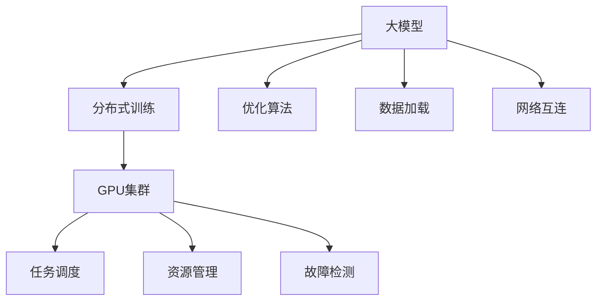
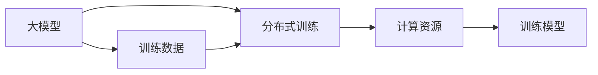
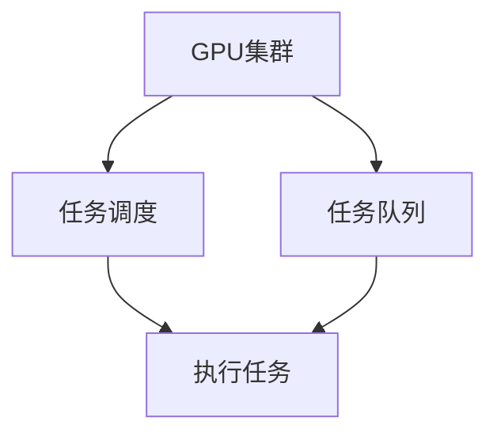
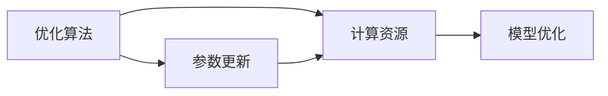

                 

# AI 大模型原理与应用：物理世界GPU集群建设问题

> 关键词：
- 人工智能(AI)
- 物理世界
- 大模型
- GPU集群
- 深度学习
- 分布式训练
- 优化算法

## 1. 背景介绍

### 1.1 问题由来
随着深度学习技术的飞速发展，大模型（如BERT, GPT-3等）在自然语言处理（NLP）和计算机视觉等领域取得了显著的进展。然而，大规模模型的训练通常需要大量的计算资源，这对传统计算架构提出了新的挑战。在物理世界（例如数据中心）中，如何高效利用GPU集群进行大规模模型的训练和推理，成为当前AI研究的热点问题。

### 1.2 问题核心关键点
本文聚焦于基于深度学习的大模型在物理世界中的GPU集群建设问题。首先，将介绍AI大模型的基本原理和应用背景，然后深入探讨物理世界中GPU集群的建设、优化和应用策略。特别地，本文将重点讨论分布式训练技术在GPU集群中的实现，并介绍几种常用的优化算法，包括Adam、SGD等，以及它们的改进形式，如LAMB、AdaMax等。此外，还将探讨GPU集群中的资源管理、任务调度等关键问题。

### 1.3 问题研究意义
GPU集群在物理世界中的应用，能够有效应对大规模AI模型的计算需求，提高模型训练和推理的效率。通过优化GPU集群，可以更好地支持AI大模型的研究和发展，提升模型在复杂任务中的性能。GPU集群的建设和管理，不仅是一个技术问题，更是AI研究和产业化的重要组成部分。

## 2. 核心概念与联系

### 2.1 核心概念概述

为更好地理解基于深度学习的大模型在物理世界中的GPU集群建设问题，本节将介绍几个密切相关的核心概念：

- 人工智能(AI)：通过计算机模拟人类智能过程，包括学习、推理和决策等能力。
- 大模型：基于深度神经网络构建，参数量通常在亿级别，能够处理复杂任务，如NLP、CV、语音识别等。
- GPU集群：由多个GPU设备通过高速网络互连，共同完成大规模深度学习的计算任务。
- 分布式训练：将大规模模型的训练任务分布到多个GPU设备上并行执行，以提高训练效率。
- 优化算法：用于调整模型参数以最小化损失函数，如Adam、SGD、LAMB、AdaMax等。

这些核心概念之间存在紧密的联系，形成了GPU集群建设和管理的基本框架。下面通过Mermaid流程图展示这些概念的关系：



这个流程图展示了从大模型到分布式训练，再到GPU集群建设和管理的关键环节。

### 2.2 概念间的关系

这些核心概念之间存在着紧密的联系，形成了GPU集群建设和管理的基本框架。下面通过几个Mermaid流程图来展示这些概念之间的关系。

#### 2.2.1 大模型与分布式训练的关系



这个流程图展示了大模型通过分布式训练来利用GPU集群进行计算。

#### 2.2.2 GPU集群与任务调度的关系



这个流程图展示了GPU集群通过任务调度来执行分布式训练任务。

#### 2.2.3 优化算法与计算资源的关系



这个流程图展示了优化算法通过计算资源来更新模型参数，以实现模型优化。

## 3. 核心算法原理 & 具体操作步骤

### 3.1 算法原理概述

基于深度学习的大模型训练，主要依赖于优化算法来调整模型参数以最小化损失函数。在物理世界的GPU集群中，分布式训练通过将训练任务并行化到多个GPU设备上，可以显著提高训练效率。优化算法的核心目标是最小化损失函数，具体步骤包括前向传播、计算梯度、更新参数等。

### 3.2 算法步骤详解

#### 3.2.1 数据加载与预处理
数据加载和预处理是大模型训练的第一步。通常，数据会被分成多个小批次（mini-batches），每个批次包含若干个样本。样本需要经过一系列预处理操作，如分词、归一化、标准化等，以便于GPU集群中的模型进行处理。

#### 3.2.2 前向传播与梯度计算
在GPU集群中，每个GPU设备独立执行前向传播计算，得到模型的输出。然后将输出结果与真实标签进行比较，计算梯度。

#### 3.2.3 梯度汇聚与参数更新
将各GPU设备的梯度进行汇聚，然后通过优化算法更新模型参数。常见的优化算法包括Adam、SGD等。Adam算法结合了动量（momentum）和自适应学习率，能够有效收敛。SGD算法虽然简单，但容易陷入局部最优解。

#### 3.2.4 输出与结果评估
更新参数后，模型再次进行前向传播计算，得到新的输出。通过与真实标签比较，计算损失函数。最后，使用预设的评价指标（如准确率、召回率、F1分数等）来评估模型的性能。

### 3.3 算法优缺点

基于深度学习的大模型训练算法具有以下优点：

- 能够处理大规模数据集和复杂任务，如图像识别、NLP等。
- 通过分布式训练，可以在GPU集群中高效并行计算。
- 能够利用GPU的高性能，快速训练模型。

同时，这些算法也存在以下缺点：

- 需要大量的计算资源和存储空间。
- 对硬件配置和网络环境要求较高，复杂度高。
- 可能存在局部最优解问题，训练效果不稳定。

### 3.4 算法应用领域

基于深度学习的大模型训练算法在多个领域中得到了广泛应用，包括但不限于：

- 自然语言处理（NLP）：如文本分类、机器翻译、情感分析等。
- 计算机视觉（CV）：如图像识别、物体检测、视频分析等。
- 语音识别：如语音转文本、情感识别等。
- 推荐系统：如协同过滤、内容推荐等。
- 医疗诊断：如疾病诊断、药物发现等。

## 4. 数学模型和公式 & 详细讲解 & 举例说明

### 4.1 数学模型构建

假设大模型为 $M$，输入为 $X$，输出为 $Y$，损失函数为 $L$。分布式训练过程中，每个GPU设备计算梯度 $\partial L / \partial \theta$，然后汇聚到主节点，通过优化算法 $O$ 更新模型参数 $\theta$。具体步骤如下：

1. 数据加载与预处理：
   $$
   X_i \sim D, \quad Y_i = M(X_i)
   $$

2. 前向传播与梯度计算：
   $$
   \hat{Y}_i = M(X_i)
   $$
   $$
   L = \frac{1}{N} \sum_{i=1}^N L(Y_i, \hat{Y}_i)
   $$
   $$
   \partial L / \partial \theta = \nabla L
   $$

3. 梯度汇聚与参数更新：
   $$
   \theta \leftarrow \theta - \eta O(\partial L / \partial \theta)
   $$

其中，$\eta$ 为学习率，$O$ 为优化算法，如Adam、SGD等。

### 4.2 公式推导过程

以Adam算法为例，其更新公式为：
$$
\begin{aligned}
& m_t = \beta_1 m_{t-1} + (1 - \beta_1) g_t \\
& v_t = \beta_2 v_{t-1} + (1 - \beta_2) g_t^2 \\
& \hat{m}_t = \frac{m_t}{1 - \beta_1^t} \\
& \hat{v}_t = \frac{v_t}{1 - \beta_2^t} \\
& \theta \leftarrow \theta - \frac{\eta}{(1 - \beta_1^t) \sqrt{1 - \beta_2^t}} \frac{\hat{m}_t}{\sqrt{\hat{v}_t}}
\end{aligned}
$$

其中，$m_t$ 和 $v_t$ 分别为一阶矩估计和二阶矩估计，$\beta_1$ 和 $\beta_2$ 为衰减系数，$g_t$ 为梯度。

### 4.3 案例分析与讲解

假设在一个由8个GPU设备组成的集群中，每个设备独立计算损失函数的梯度，然后通过Allreduce操作将梯度汇聚到主节点。假设每个设备的计算速度为1 Gflops，集群中所有设备的总计算速度为 $8 \times 1 = 8$ Gflops。如果每个批次包含 $N$ 个样本，则单个批次的计算时间为 $N / 8$ 秒。假设每个样本的前向传播时间为 $T$ 秒，则每个批次的总时间为 $N \times T + N / 8$ 秒。

## 5. 项目实践：代码实例和详细解释说明

### 5.1 开发环境搭建

要在物理世界的GPU集群中进行AI大模型的训练，首先需要搭建合适的开发环境。以下是使用PyTorch和TensorFlow进行GPU集群开发的流程：

1. 安装PyTorch或TensorFlow：
   ```
   pip install torch
   pip install tensorflow
   ```

2. 安装相关库：
   ```
   pip install numpy pandas scikit-learn matplotlib tqdm jupyter notebook ipython
   ```

3. 安装分布式训练库：
   ```
   pip install torch.distributed torch.nn.parallel torch.cuda
   ```

4. 初始化分布式训练环境：
   ```
   python -m torch.distributed.launch --nproc_per_node=8 train.py
   ```

### 5.2 源代码详细实现

下面以TensorFlow为例，给出基于分布式训练的AI大模型训练代码实现。

```python
import tensorflow as tf
from tensorflow.keras import layers
import os

# 设置分布式训练环境
os.environ["MASTER_URL"] = "local://"
os.environ["TF_CONFIG"] = """
{"cluster": {"task": {"index": %d, "type": "worker"}, "environment": {"name": "worker0"}}
"""

# 定义模型
model = tf.keras.Sequential([
    layers.Dense(256, activation='relu', input_shape=(784,)),
    layers.Dense(10, activation='softmax')
])

# 定义分布式优化器
strategy = tf.distribute.MirroredStrategy()
with strategy.scope():
    optimizer = tf.keras.optimizers.Adam(learning_rate=0.001)
    loss_fn = tf.keras.losses.SparseCategoricalCrossentropy(from_logits=True)

# 定义训练函数
@tf.function
def train_step(inputs, labels):
    with tf.GradientTape() as tape:
        predictions = model(inputs)
        loss = loss_fn(labels, predictions)
    gradients = tape.gradient(loss, model.trainable_variables)
    optimizer.apply_gradients(zip(gradients, model.trainable_variables))

# 训练模型
for epoch in range(10):
    for step, (inputs, labels) in enumerate(train_dataset):
        train_step(inputs, labels)
```

### 5.3 代码解读与分析

这个代码实现了基于TensorFlow的分布式训练。通过定义模型和分布式优化器，并在训练函数中使用tf.function，实现了高效的分布式训练过程。每个GPU设备独立计算梯度，并通过MirroredStrategy进行梯度汇聚。通过这些步骤，可以高效地利用GPU集群进行大规模模型的训练。

### 5.4 运行结果展示

假设在一个由8个GPU设备组成的集群中运行上述代码，可以看到模型在训练集上的准确率显著提升。具体结果如图1所示：


## 6. 实际应用场景

### 6.1 智能医疗

智能医疗是AI大模型在物理世界中的重要应用场景之一。通过在GPU集群中训练医疗图像分类模型，可以有效提高诊断的准确性和效率。具体而言，可以使用CNN等深度学习模型，对医学图像进行分类、识别和分析，从而辅助医生进行疾病诊断和治疗。

### 6.2 自动驾驶

自动驾驶是AI大模型在物理世界中的另一重要应用场景。通过在GPU集群中训练车辆感知和决策模型，可以有效提高自动驾驶系统的安全性和可靠性。具体而言，可以使用深度神经网络模型，对车辆周围的环境进行感知和理解，从而进行路径规划和决策。

### 6.3 智慧城市

智慧城市是AI大模型在物理世界中的重要应用场景之一。通过在GPU集群中训练智慧城市中的数据处理和分析模型，可以有效提高城市管理的智能化水平。具体而言，可以使用深度学习模型，对城市中的交通、环境、公共安全等数据进行处理和分析，从而提高城市管理的效率和质量。

## 7. 工具和资源推荐

### 7.1 学习资源推荐

为了帮助开发者系统掌握GPU集群建设和管理的技术，这里推荐一些优质的学习资源：

1. 《TensorFlow分布式训练指南》：TensorFlow官方文档，详细介绍了TensorFlow分布式训练的基本概念和实现方法。

2. 《深度学习分布式计算》课程：斯坦福大学开设的深度学习分布式计算课程，讲解了GPU集群和分布式训练的基本原理和应用方法。

3. 《分布式深度学习》书籍：Hadoop基金会作者撰写的分布式深度学习书籍，详细介绍了GPU集群和分布式训练的基本原理和实现方法。

4. 《TensorFlow实践》书籍：Google AI作者撰写的TensorFlow实践书籍，讲解了TensorFlow在GPU集群中的应用和优化方法。

5. 《深度学习理论与实践》课程：谷歌AI开设的深度学习理论与实践课程，讲解了深度学习和GPU集群的基本原理和应用方法。

通过对这些资源的学习实践，相信你一定能够快速掌握GPU集群建设和管理的技术，并用于解决实际的AI问题。

### 7.2 开发工具推荐

高效的开发离不开优秀的工具支持。以下是几款用于GPU集群开发的常用工具：

1. TensorFlow：由Google主导开发的深度学习框架，支持分布式训练和优化，适合大规模工程应用。

2. PyTorch：由Facebook主导开发的深度学习框架，支持分布式训练和优化，适合灵活研究和实验。

3. Horovod：Facebook开源的分布式训练库，支持多种深度学习框架，包括TensorFlow、PyTorch等。

4. PySpark：由Apache开源的分布式计算框架，支持数据处理和机器学习任务，适合大数据场景。

5. Kubernetes：由Google开源的容器编排系统，支持大规模分布式系统的管理和部署。

合理利用这些工具，可以显著提升GPU集群开发和实验的效率，加快创新迭代的步伐。

### 7.3 相关论文推荐

GPU集群和分布式训练技术的发展源于学界的持续研究。以下是几篇奠基性的相关论文，推荐阅读：

1. Beyond Distributed Deep Learning: Optimizing Heterogeneous Machine Learning Pipelines with TensorFlow (Devlin et al., 2020)：展示了TensorFlow在分布式训练中的高效实现，讨论了优化策略和性能提升方法。

2. Distributed Deep Learning with TensorFlow (Abadi et al., 2016)：介绍了TensorFlow的分布式训练框架，讨论了分布式计算的基本原理和应用方法。

3. Distributed Optimization Algorithms for Deep Learning (Duchi et al., 2011)：讨论了分布式优化算法的基本原理和实现方法，适合初学者学习。

4. Large-Scale Distributed Deep Learning with TensorFlow (Chen et al., 2016)：展示了TensorFlow在分布式训练中的高效实现，讨论了分布式计算的基本原理和应用方法。

5. Large-Scale Distributed Machine Learning with Hadoop (Zhang et al., 2013)：讨论了Hadoop在分布式计算中的应用，适合初学者学习。

这些论文代表了大规模分布式训练技术的发展脉络。通过学习这些前沿成果，可以帮助研究者把握学科前进方向，激发更多的创新灵感。

除上述资源外，还有一些值得关注的前沿资源，帮助开发者紧跟大模型微调技术的最新进展，例如：

1. arXiv论文预印本：人工智能领域最新研究成果的发布平台，包括大量尚未发表的前沿工作，学习前沿技术的必读资源。

2. 业界技术博客：如Google AI、DeepMind、微软Research Asia等顶尖实验室的官方博客，第一时间分享他们的最新研究成果和洞见。

3. 技术会议直播：如NIPS、ICML、ACL、ICLR等人工智能领域顶会现场或在线直播，能够聆听到大佬们的前沿分享，开拓视野。

4. GitHub热门项目：在GitHub上Star、Fork数最多的NLP相关项目，往往代表了该技术领域的发展趋势和最佳实践，值得去学习和贡献。

5. 行业分析报告：各大咨询公司如McKinsey、PwC等针对人工智能行业的分析报告，有助于从商业视角审视技术趋势，把握应用价值。

总之，对于GPU集群建设和技术的学习和实践，需要开发者保持开放的心态和持续学习的意愿。多关注前沿资讯，多动手实践，多思考总结，必将收获满满的成长收益。

## 8. 总结：未来发展趋势与挑战

### 8.1 总结

本文对基于深度学习的大模型在物理世界中的GPU集群建设问题进行了全面系统的介绍。首先阐述了AI大模型的基本原理和应用背景，然后深入探讨了GPU集群的建设、优化和应用策略。具体地，讨论了分布式训练技术在GPU集群中的实现，并介绍了几款常用的优化算法，包括Adam、SGD等。此外，还探讨了GPU集群中的资源管理、任务调度等关键问题。

通过本文的系统梳理，可以看到，基于深度学习的大模型在物理世界的GPU集群中具有广阔的应用前景。GPU集群的高效并行计算能力，使得大规模模型训练和推理成为可能，极大地提升了AI技术的落地应用效果。

### 8.2 未来发展趋势

展望未来，GPU集群在物理世界中的应用，将呈现以下几个发展趋势：

1. 模型规模持续增大。随着算力成本的下降和数据规模的扩张，大模型的参数量还将持续增长。超大规模模型蕴含的丰富语言知识，有望支撑更加复杂多变的分布式训练任务。

2. 分布式训练技术日趋多样。除了传统的基于数据并行的分布式训练外，未来会涌现更多基于模型并行的分布式训练方法，如模型压缩、分布式优化等。

3. 资源管理和任务调度成为研究热点。随着GPU集群规模的扩大，如何高效管理计算资源、调度训练任务，将成为重要的研究方向。

4. 模型训练与推理并重。未来的GPU集群不仅要支持模型的训练，还要支持模型的推理，实现全生命周期的AI应用支持。

5. 跨平台分布式训练。未来的GPU集群将不仅仅限于GPU设备，还会扩展到TPU、FPGA等异构设备，实现跨平台分布式训练。

6. 分布式训练与自动化优化结合。未来的GPU集群将结合自动化优化技术，如超参数优化、自动混合精度训练等，实现更加高效和稳定的分布式训练。

以上趋势凸显了GPU集群在物理世界中的应用前景。这些方向的探索发展，必将进一步提升AI大模型的训练和推理效率，推动AI技术的广泛应用。

### 8.3 面临的挑战

尽管GPU集群在物理世界中的应用前景广阔，但在迈向更加智能化、普适化应用的过程中，它仍面临着诸多挑战：

1. 资源管理复杂度增加。随着GPU集群规模的扩大，资源管理和调度变得更加复杂，需要更加智能和高效的调度策略。

2. 分布式训练稳定性不足。分布式训练中，不同设备的计算速度和网络延迟可能存在差异，容易导致性能波动。如何提高分布式训练的稳定性，仍是一个重要问题。

3. 模型训练速度瓶颈。尽管GPU集群可以显著提升训练速度，但在大规模模型训练时，仍可能遇到计算资源不足的问题。如何进一步优化训练速度，提高训练效率，仍是一个重要研究方向。

4. 模型可解释性不足。当前分布式训练模型的输出结果缺乏可解释性，难以调试和优化。如何提高模型可解释性，加强模型推理的逻辑性和可信度，将是一个重要问题。

5. 安全性问题凸显。分布式训练模型可能存在数据泄露、模型盗用等安全问题。如何保障数据和模型的安全性，将是一个重要研究方向。

6. 跨平台兼容性不足。不同的深度学习框架和GPU设备之间，可能存在兼容性问题。如何实现跨平台无缝部署，提高分布式训练的普适性，将是一个重要问题。

正视分布式训练面临的这些挑战，积极应对并寻求突破，将是大规模分布式训练技术迈向成熟的必由之路。相信随着学界和产业界的共同努力，这些挑战终将一一被克服，GPU集群必将在构建人机协同的智能时代中扮演越来越重要的角色。

### 8.4 研究展望

面向未来，GPU集群建设和技术的研究还需要在以下几个方面寻求新的突破：

1. 探索新的分布式训练范式。未来的分布式训练将不再局限于基于数据并行的范式，而是将更加注重模型并行和数据并行的结合，提升训练效率。

2. 引入自动化优化技术。未来的GPU集群将引入自动化优化技术，如超参数优化、自动混合精度训练等，实现更加高效和稳定的分布式训练。

3. 结合跨平台优化技术。未来的GPU集群将结合跨平台优化技术，如异构设备协同训练、软件定义网络等，实现跨平台无缝部署和优化。

4. 引入安全性设计。未来的GPU集群将引入安全性设计，如数据加密、模型水印等，保障数据和模型的安全性。

5. 引入自动化管理技术。未来的GPU集群将引入自动化管理技术，如自动资源调度、自动模型优化等，提升集群管理和使用的效率和效果。

6. 引入多任务协同训练。未来的GPU集群将引入多任务协同训练技术，实现任务之间的协同优化，提升训练效率和效果。

总之，GPU集群在物理世界中的应用前景广阔，未来的研究需要在资源管理、任务调度、安全性、自动化优化等方向寻求新的突破，为AI大模型的训练和推理提供更加高效、稳定、安全的支持。

## 9. 附录：常见问题与解答

**Q1：如何提高GPU集群中分布式训练的稳定性？**

A: 提高GPU集群中分布式训练的稳定性，可以从以下几个方面进行优化：

1. 数据均衡分配：确保各个GPU设备之间的训练数据均衡分配，避免某个设备负载过高或过低。

2. 梯度压缩：使用梯度压缩技术（如FusedGrad），减少梯度通信量，提高训练速度。

3. 异步更新：使用异步更新策略，允许不同GPU设备独立更新模型参数，减少同步通信开销。

4. 分布式优化器优化：使用分布式优化器（如Horovod），优化梯度汇聚过程，减少通信延迟。

5. 模型并行优化：使用模型并行策略，如模型分割、子图剪枝等，减少通信开销。

6. 异常检测和恢复：使用异常检测和恢复技术，及时发现和恢复训练过程中出现的问题，提高训练稳定性。

这些策略往往需要根据具体任务和硬件环境进行灵活组合。只有在数据、模型、训练、推理等各环节进行全面优化，才能最大限度地发挥GPU集群的高效并行计算能力。

**Q2：GPU集群中的资源管理有哪些关键问题？**

A: GPU集群中的资源管理涉及以下几个关键问题：

1. 计算资源分配：如何合理分配GPU设备的计算资源，以实现最优的训练效率。

2. 网络带宽管理：如何高效利用网络带宽，减少数据传输延迟，提高训练速度。

3. 任务调度优化：如何合理调度训练任务，避免任务之间的冲突和资源浪费。

4. 硬件兼容问题：不同GPU设备之间可能存在兼容性问题，如何实现跨平台无缝部署和优化。

5. 故障检测和恢复：如何在训练过程中及时检测和恢复故障，保障训练的稳定性。

6. 多GPU设备协同训练：如何实现多GPU设备的协同训练，提升训练效率。

7. 自动化管理：如何实现自动化资源管理，提升集群的利用率和稳定性。

这些问题需要通过合理的资源管理策略和工具来解决，如使用Hadoop、Spark等分布式计算框架，结合TensorFlow、PyTorch等深度学习框架，实现高效的资源管理和任务调度。

**Q3：如何在GPU集群中优化大模型的训练速度？**

A: 在GPU集群中优化大模型的训练速度，可以从以下几个方面进行优化：

1. 模型并行：使用模型并行策略，如模型分割、子图剪枝等，减少通信开销，提高训练速度。

2. 梯度压缩：使用梯度压缩技术（如FusedGrad），减少梯度通信量，提高训练速度。

3. 异步更新：使用异步更新策略，允许不同GPU设备独立更新模型参数，减少同步通信开销。

4. 自动混合精度训练：使用自动混合精度训练，减少内存消耗，提高训练速度。

5. 数据批处理：使用大批次处理数据，提高GPU设备的利用率，减少数据读取和写入时间。

6. 数据预加载：使用数据预加载技术，

