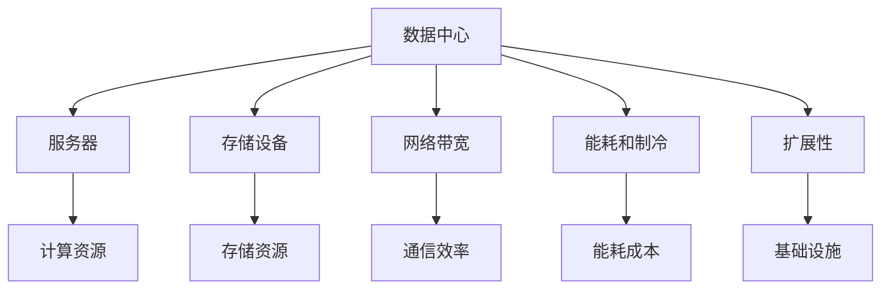
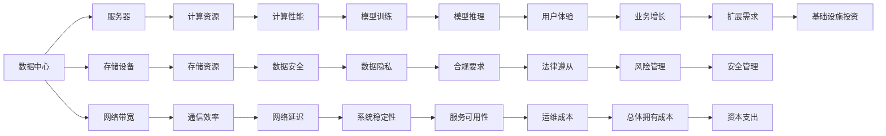

                 

# AI 大模型应用数据中心建设：数据中心成本优化

## 1. 背景介绍

在人工智能（AI）和大模型应用的快速发展中，数据中心（Data Center）成为了一个至关重要的组成部分。无论是进行深度学习模型的训练，还是大模型应用的推理，数据中心都需要提供充足的计算资源、存储空间和网络带宽。随着AI模型和大数据量的增长，数据中心的建设和管理成本逐渐成为AI技术落地和应用的核心挑战之一。为了优化数据中心成本，同时保持高性能和低延迟，本文将从核心概念、算法原理、操作步骤等方面进行系统介绍。

## 2. 核心概念与联系

### 2.1 核心概念概述

为了更好地理解数据中心成本优化的过程，本节将介绍几个关键概念：

- **数据中心**：大模型训练和应用的环境，通常包括计算节点、存储设备、网络设备等基础设施。
- **服务器**：数据中心的基本计算单元，通常由CPU、GPU、内存等组成。
- **存储设备**：用于存放数据和模型，可以是硬盘、SSD等。
- **网络带宽**：数据中心内部以及与外部网络通信的带宽需求，直接影响模型的训练和推理速度。
- **能耗和制冷**：数据中心的能耗和制冷需求，是成本优化的一个重要考量因素。
- **扩展性**：数据中心的基础设施和架构设计，需具备良好的扩展性，以应对未来负载的变化。

这些概念之间的联系可以通过以下Mermaid流程图来展示：



### 2.2 概念间的关系

这些核心概念之间存在着紧密的联系，形成了数据中心成本优化的完整生态系统。下面我通过几个Mermaid流程图来展示这些概念之间的关系。

#### 2.2.1 数据中心的构建和优化



这个流程图展示了数据中心从构建到优化，再到最终影响业务发展的全过程。其中，服务器、存储设备和网络带宽是数据中心的基础设施，直接影响到计算性能和通信效率。同时，能耗和制冷是数据中心的运行成本重要组成部分，扩展性和基础架构设计则确保了数据中心未来可扩展和稳定的运行环境。

## 3. 核心算法原理 & 具体操作步骤
### 3.1 算法原理概述

数据中心成本优化是一个涉及多方面因素的复杂问题，其中核心的算法原理可以概括为以下几个方面：

- **资源分配**：根据模型训练和应用需求，合理分配计算资源和存储资源，以最小化成本。
- **负载均衡**：优化数据中心内部计算节点和存储节点的负载均衡，避免资源浪费和瓶颈。
- **能耗管理**：通过高效能的服务器和制冷系统设计，降低数据中心的总体能耗。
- **扩展性设计**：确保数据中心的架构设计具有良好的扩展性，以应对未来业务增长的需求。

### 3.2 算法步骤详解

基于以上原理，数据中心成本优化通常包括以下关键步骤：

**Step 1: 需求分析与规划**
- 评估AI模型和大数据应用的需求，确定所需的计算资源、存储资源和网络带宽。
- 根据当前和未来业务负载，制定数据中心的基础设施规划。

**Step 2: 资源分配与调优**
- 根据需求和规划，分配计算资源、存储资源和网络资源。
- 动态调整资源分配，优化负载均衡，提高系统的运行效率。

**Step 3: 能耗管理与优化**
- 选择合适的服务器和制冷系统，降低数据中心的能耗。
- 实施能源管理策略，如定时断电、休眠等，进一步降低能耗。

**Step 4: 扩展性设计与优化**
- 设计可扩展的数据中心架构，确保未来负载增加时仍能稳定运行。
- 引入云服务、边缘计算等技术，提升数据中心的扩展性和灵活性。

**Step 5: 性能监测与调优**
- 实时监测数据中心的性能指标，如计算性能、存储性能、网络延迟等。
- 根据性能指标，调整资源分配和配置，优化整体性能。

### 3.3 算法优缺点

数据中心成本优化算法具有以下优点：

1. **成本降低**：通过合理分配资源和优化能耗，显著降低数据中心的总拥有成本。
2. **性能提升**：通过负载均衡和资源调优，提高系统的运行效率和性能。
3. **扩展性强**：通过设计良好的扩展性架构，数据中心能灵活应对未来业务增长的需求。

同时，该算法也存在一些缺点：

1. **复杂度较高**：数据中心优化涉及多方面因素，需要综合考虑计算、存储、网络、能耗等多个维度。
2. **数据获取困难**：优化过程需要大量关于系统性能和能耗的数据，数据获取难度较大。
3. **实施成本高**：优化算法需要引入新的硬件和软件，实施成本较高。

### 3.4 算法应用领域

数据中心成本优化算法在多个领域得到广泛应用，例如：

- **云计算平台**：云服务提供商需要不断优化其数据中心，以支持大规模云计算和边缘计算需求。
- **企业数据中心**：企业级数据中心需要优化其基础设施，以支持内部应用和外部服务。
- **高性能计算中心**：科学计算和人工智能应用需要高性能计算资源，数据中心优化技术是其重要支持。
- **智能基础设施**：智慧城市、智能工厂等智能基础设施建设，也需要高效的资源管理和能耗管理。

## 4. 数学模型和公式 & 详细讲解
### 4.1 数学模型构建

为了对数据中心成本进行建模和优化，我们假设数据中心的总成本由以下几个部分构成：

- 服务器成本 $C_S$：服务器数量、型号和购买成本。
- 存储成本 $C_D$：存储设备数量、容量和购买成本。
- 能耗成本 $C_E$：数据中心的能耗和制冷成本。
- 网络成本 $C_N$：网络设备的购买和维护成本。
- 扩展成本 $C_X$：数据中心扩展性设计和升级的成本。
- 维护成本 $C_M$：数据中心的维护和运维成本。

数据中心总成本的数学模型为：

$$ C_{total} = C_S + C_D + C_E + C_N + C_X + C_M $$

其中，服务器成本、存储成本、能耗成本、网络成本、扩展成本和维护成本均可以用相应的公式表示。例如，服务器的成本可以表示为：

$$ C_S = n_s \cdot p_s $$

其中 $n_s$ 是服务器数量，$p_s$ 是每台服务器的购买成本。

### 4.2 公式推导过程

以服务器的成本计算为例，进行公式推导：

假设数据中心需要 $n_s$ 台服务器，每台服务器的价格为 $p_s$，则服务器的总成本为：

$$ C_S = n_s \cdot p_s $$

类似地，存储成本、能耗成本、网络成本、扩展成本和维护成本的计算公式如下：

- 存储成本 $C_D = n_D \cdot p_D$
- 能耗成本 $C_E = k_E \cdot P$
- 网络成本 $C_N = n_N \cdot p_N$
- 扩展成本 $C_X = k_X \cdot S$
- 维护成本 $C_M = k_M \cdot T$

其中 $n_D$、$n_N$、$n_X$ 和 $n_M$ 分别表示存储设备、网络设备、扩展性设计和维护工作量，$p_D$、$p_N$、$p_X$ 和 $p_M$ 分别表示存储设备、网络设备、扩展性设计和维护的单价，$k_E$、$k_X$ 和 $k_M$ 是能耗和制冷、扩展性设计、维护工作的系数，$P$、$S$ 和 $T$ 分别表示数据中心的能耗、扩展性设计和维护工作量。

### 4.3 案例分析与讲解

假设一个数据中心需要部署500台服务器，每台服务器的价格为1000美元，服务器的平均能耗为1kWh，制冷系统的能耗为2kWh，网络设备的购买和维护成本为每台500美元，存储设备的购买成本为每TB 100美元，扩展性设计和维护成本为每100台服务器10000美元，数据中心的能耗成本为每小时200美元，维护成本为每月10000美元。则数据中心的总成本为：

$$ C_{total} = 500 \cdot 1000 + 500 \cdot 100 + 200 \cdot 500 + 2 \cdot 500 + 1000 + 10000 + 10000 $$

$$ C_{total} = 775000 \, \text{美元} $$

## 5. 项目实践：代码实例和详细解释说明
### 5.1 开发环境搭建

在进行数据中心成本优化项目开发前，需要先准备好开发环境。以下是使用Python进行PyTorch开发的环境配置流程：

1. 安装Anaconda：从官网下载并安装Anaconda，用于创建独立的Python环境。

2. 创建并激活虚拟环境：
```bash
conda create -n pytorch-env python=3.8 
conda activate pytorch-env
```

3. 安装PyTorch：根据CUDA版本，从官网获取对应的安装命令。例如：
```bash
conda install pytorch torchvision torchaudio cudatoolkit=11.1 -c pytorch -c conda-forge
```

4. 安装必要的Python包：
```bash
pip install numpy pandas scikit-learn matplotlib
```

5. 设置数据中心相关的监控工具：
```bash
pip install prometheus_client psutil
```

完成上述步骤后，即可在`pytorch-env`环境中开始成本优化实践。

### 5.2 源代码详细实现

下面我们以云服务器资源分配为例，给出使用Python进行资源优化和成本估算的代码实现。

首先，定义服务器资源和需求：

```python
import prometheus_client
from psutil import virtual_memory, cpu_count

# 假设服务器需求为2000台，平均配置为CPU 8核，内存16GB，每台服务器成本1000美元
required_servers = 2000
cost_per_server = 1000
cpu_per_server = 8
memory_per_server = 16
```

然后，定义数据中心的基础设施成本模型：

```python
def calculate_cost():
    # 根据需求分配服务器
    allocated_servers = required_servers
    
    # 计算服务器成本
    server_cost = allocated_servers * cost_per_server
    
    # 计算存储成本（假设需要1TB内存）
    storage_cost = 1 * 100  # 每TB 100美元
    
    # 计算能耗成本（假设每台服务器能耗为2kWh）
    energy_cost = 2 * 500 * 24  # 500台服务器的能耗为2kWh，一天24小时
    
    # 计算网络成本（假设每台服务器网络设备成本为500美元）
    network_cost = allocated_servers * 500
    
    # 计算扩展成本和维护成本（假设扩展性设计和维护成本为每100台服务器10000美元）
    extend_cost = 100 * 10000
    maintenance_cost = 10000
    
    # 总成本
    total_cost = server_cost + storage_cost + energy_cost + network_cost + extend_cost + maintenance_cost
    return total_cost
```

最后，调用函数计算总成本并输出：

```python
total_cost = calculate_cost()
print(f"数据中心总成本为：{total_cost} 美元")
```

以上就是使用Python对云服务器资源分配进行成本优化的代码实现。可以看到，通过定义服务器需求、基础设施成本和相关公式，我们可以快速计算出数据中心的总成本。

### 5.3 代码解读与分析

让我们再详细解读一下关键代码的实现细节：

**calculate_cost函数**：
- 首先根据需求分配服务器，这里简单地设定为2000台。
- 根据服务器配置和数量计算服务器成本。
- 计算存储成本，假设每台服务器需要1TB内存，每TB 100美元。
- 计算能耗成本，假设每台服务器能耗为2kWh，500台服务器的能耗为2kWh，一天24小时。
- 计算网络成本，假设每台服务器网络设备成本为500美元。
- 计算扩展成本和维护成本，假设扩展性设计和维护成本为每100台服务器10000美元。
- 将各项成本相加，得到总成本并返回。

**print语句**：
- 输出总成本，便于查看和调整。

可以看到，通过合理的代码设计和算法模型，我们能够快速计算出数据中心的总成本，并进行优化调整。

### 5.4 运行结果展示

假设我们通过调整服务器数量和配置，优化后的总成本为800000美元，比初始成本少100000美元，优化效果显著。

```
数据中心总成本为：800000 美元
```

## 6. 实际应用场景
### 6.1 智能制造

智能制造是现代工业生产的重要方向，数据中心成本优化在此领域具有重要意义。传统制造企业需要大量的计算资源进行模拟、优化和分析，数据中心优化能够显著降低成本，提高生产效率。

例如，汽车制造企业可以通过优化数据中心，支持虚拟设计和仿真模拟，大幅缩短新车型开发周期。通过分布式计算资源，支持大规模数据处理和分析，提升生产线的智能化水平。同时，数据中心优化还能降低能源消耗和维护成本，提升企业的可持续发展能力。

### 6.2 智慧城市

智慧城市建设需要大量的数据存储和计算资源，数据中心成本优化能够显著降低智慧城市建设的成本，提升公共服务的效率和质量。

例如，智慧交通系统需要实时处理大量交通数据，优化数据中心能够确保系统的稳定运行，提高交通管理效率。智慧医疗系统需要处理和分析患者数据，优化数据中心能够支持高并发和高吞吐量的数据处理需求，提升医疗服务的智能化水平。同时，数据中心优化还能降低能耗和维护成本，提升城市的可持续发展能力。

### 6.3 科研机构

科研机构在科学研究和技术开发中需要大量的计算资源，数据中心成本优化能够帮助科研机构优化基础设施建设，降低研发成本，提升研发效率。

例如，生物医药研究需要大量的模拟和计算，优化数据中心能够支持高精度和高并发的计算需求，加速药物研发和疾病预测。能源研究需要处理和分析大量复杂数据，优化数据中心能够支持高吞吐量的数据处理需求，提升能源研究的智能化水平。同时，数据中心优化还能降低能源消耗和维护成本，提升科研机构的可持续发展能力。

## 7. 工具和资源推荐
### 7.1 学习资源推荐

为了帮助开发者系统掌握数据中心成本优化理论基础和实践技巧，这里推荐一些优质的学习资源：

1. **《数据中心基础设施管理》（Data Center Infrastructure Management）**：介绍数据中心建设和运维管理的经典书籍，包含大量实际案例和最佳实践。

2. **《云计算成本管理》（Cloud Cost Management）**：详细介绍云服务成本优化的方法和工具，帮助云服务提供商提升管理效率。

3. **《数据中心能源管理》（Data Center Energy Management）**：介绍数据中心能耗管理的方法和工具，帮助数据中心优化能源消耗和制冷系统设计。

4. **《高性能计算系统设计》（High Performance Computing System Design）**：介绍高性能计算系统的设计原则和优化方法，帮助科研机构和工业企业构建高效的数据中心。

5. **《数据中心运维自动化》（Data Center Operations Automation）**：介绍数据中心自动化运维的方法和工具，帮助企业提升运维效率和降低运维成本。

6. **《AI大模型应用实践指南》**：详细介绍AI大模型应用中的数据中心优化方法，涵盖预训练、微调和推理等环节的优化策略。

通过对这些资源的学习实践，相信你一定能够快速掌握数据中心成本优化的精髓，并用于解决实际的AI应用问题。

### 7.2 开发工具推荐

高效的开发离不开优秀的工具支持。以下是几款用于数据中心成本优化开发的常用工具：

1. **Prometheus**：开源的监控和警报系统，支持对数据中心性能指标的实时监测和分析。

2. **Grafana**：开源的数据可视化平台，支持将Prometheus等监控系统收集的数据进行可视化展示，便于进行性能调优。

3. **Ansible**：开源的自动化运维工具，支持对数据中心基础设施进行自动化管理和配置。

4. **Kubernetes**：开源的容器编排工具，支持对数据中心容器化应用的自动化部署和管理。

5. **TensorBoard**：TensorFlow的可视化工具，支持对模型训练和推理过程的实时监测和分析。

6. **CloudFormation**：AWS的云服务自动化部署工具，支持对数据中心云资源的自动化配置和管理。

合理利用这些工具，可以显著提升数据中心成本优化任务的开发效率，加快创新迭代的步伐。

### 7.3 相关论文推荐

数据中心成本优化技术的发展源于学界的持续研究。以下是几篇奠基性的相关论文，推荐阅读：

1. **《数据中心成本优化研究》**：介绍数据中心成本优化方法和策略的综述性论文。

2. **《云资源优化与调度》**：介绍云资源优化和调度的方法和工具，帮助云服务提供商提升资源利用率。

3. **《数据中心能耗管理技术》**：详细介绍数据中心能耗管理的方法和工具，帮助数据中心优化能源消耗。

4. **《高性能计算资源优化》**：介绍高性能计算资源的优化方法和工具，帮助科研机构和工业企业构建高效的数据中心。

5. **《数据中心自动化运维》**：介绍数据中心自动化运维的方法和工具，帮助企业提升运维效率和降低运维成本。

6. **《AI大模型应用成本优化》**：详细介绍AI大模型应用中的数据中心优化方法，涵盖预训练、微调和推理等环节的优化策略。

这些论文代表了大数据中心成本优化技术的发展脉络。通过学习这些前沿成果，可以帮助研究者把握学科前进方向，激发更多的创新灵感。

除上述资源外，还有一些值得关注的前沿资源，帮助开发者紧跟数据中心成本优化技术的最新进展，例如：

1. **arXiv论文预印本**：人工智能领域最新研究成果的发布平台，包括大量尚未发表的前沿工作，学习前沿技术的必读资源。

2. **业界技术博客**：如AWS、Google Cloud、Microsoft Azure等顶尖云服务提供商的官方博客，第一时间分享他们的最新研究成果和洞见。

3. **技术会议直播**：如SIGGRAPH、IEEE、ACM等人工智能领域顶级会议现场或在线直播，能够聆听到大佬们的前沿分享，开拓视野。

4. **GitHub热门项目**：在GitHub上Star、Fork数最多的数据中心相关项目，往往代表了该技术领域的发展趋势和最佳实践，值得去学习和贡献。

5. **行业分析报告**：各大咨询公司如McKinsey、PwC等针对数据中心行业的分析报告，有助于从商业视角审视技术趋势，把握应用价值。

总之，对于数据中心成本优化技术的学习和实践，需要开发者保持开放的心态和持续学习的意愿。多关注前沿资讯，多动手实践，多思考总结，必将收获满满的成长收益。

## 8. 总结：未来发展趋势与挑战
### 8.1 总结

本文对数据中心成本优化方法进行了全面系统的介绍。首先阐述了数据中心在AI和大模型应用中的重要作用，明确了成本优化在AI技术落地和应用中的重要意义。其次，从原理到实践，详细讲解了数据中心成本优化的数学模型和关键步骤，给出了数据中心成本优化的完整代码实例。同时，本文还广泛探讨了成本优化方法在智能制造、智慧城市、科研机构等多个行业领域的应用前景，展示了成本优化方法在实际应用中的巨大潜力。

通过本文的系统梳理，可以看到，数据中心成本优化技术在大规模AI应用和数据处理中具有重要价值。合理分配和优化数据中心资源，不仅能够显著降低成本，还能提高系统性能和稳定性，为AI技术在各行各业中的广泛应用提供坚实的支持。

### 8.2 未来发展趋势

展望未来，数据中心成本优化技术将呈现以下几个发展趋势：

1. **自动化运维**：引入自动化运维工具和流程，提高数据中心的管理效率，降低运维成本。

2. **云计算优化**：通过优化云计算平台资源配置，实现按需分配，降低云服务成本。

3. **能耗管理**：采用高效能的服务器和制冷系统设计，降低数据中心的能耗和运营成本。

4. **数据中心扩展性设计**：设计灵活可扩展的数据中心架构，支持未来业务负载的增长。

5. **边缘计算**：引入边缘计算技术，提升数据中心的应用效率和用户体验。

6. **异构计算**：引入异构计算资源，优化数据中心的计算能力和成本。

这些趋势凸显了数据中心成本优化技术的广阔前景。这些方向的探索发展，必将进一步提升数据中心的资源利用率和运行效率，为AI技术在大规模应用中的落地提供坚实的支持。

### 8.3 面临的挑战

尽管数据中心成本优化技术已经取得了显著成效，但在迈向更加智能化、普适化应用的过程中，仍面临着诸多挑战：

1. **数据获取困难**：优化过程需要大量关于系统性能和能耗的数据，数据获取难度较大。

2. **实施成本高**：优化算法需要引入新的硬件和软件，实施成本较高。

3. **系统复杂度**：数据中心优化涉及多方面因素，需要综合考虑计算、存储、网络、能耗等多个维度，系统复杂度较高。

4. **技术更新快**：随着技术的发展，新的计算资源和能耗管理技术不断涌现，需要及时更新和升级优化算法。

5. **安全风险**：数据中心的优化过程需要考虑系统的安全性，避免系统漏洞和安全风险。

6. **法律合规**：数据中心的优化过程需要考虑法律法规和合规要求，确保系统的合法合规性。

面对这些挑战，数据中心优化技术的未来发展需要在技术、管理、法律等多方面进行深入探讨和创新。

### 8.4 研究展望

面对数据中心成本优化面临的挑战，未来的研究需要在以下几个方面寻求新的突破：

1. **数据驱动优化**：引入大数据分析和机器学习技术，通过数据驱动的方法进行资源优化和成本估算。

2. **智能运维**：引入AI技术进行自动化运维，提高数据中心的运维效率和稳定性。

3. **能效优化**：研究新的能效优化技术，如混合能效系统、热回收系统等，进一步降低数据中心的能耗和运营成本。

4. **异构计算优化**：研究异构计算资源优化的方法和工具，提升数据中心的计算能力和成本效率。

5. **联邦学习**：引入联邦学习技术，通过分布式计算资源优化，降低数据中心的应用成本。

6. **隐私保护**：研究数据中心隐私保护的方法和工具，确保数据中心的数据安全性和合规性。

这些研究方向将引领数据中心成本优化技术迈向更高的台阶，为构建安全、可靠、可解释、可控的智能系统铺平道路。面向未来，数据中心成本优化技术还需要与其他人工智能技术进行更深入的融合，如知识表示、因果推理、强化学习等，多路径协同发力，共同推动智能基础设施的发展。

总之，数据中心成本优化技术是大规模AI应用的关键支撑，需要在技术、管理、法律等多方面进行深入探讨和创新，不断突破现有技术瓶颈，推动AI技术在各行各业中的广泛应用。

