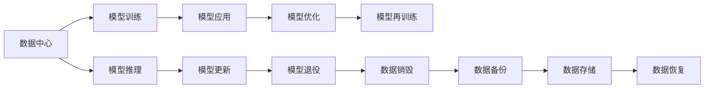

                 

# AI 大模型应用数据中心建设：数据中心绿色节能

> 关键词：AI, 大模型, 数据中心, 绿色节能, 人工智能, 可持续发展

## 1. 背景介绍

随着人工智能技术的迅猛发展，特别是深度学习和大模型的应用日益广泛，对数据中心的需求也急剧增长。然而，传统数据中心的高能耗、高碳排放等环境问题日益凸显，引起了社会和行业的高度关注。为此，数据中心的绿色节能成为当务之急，如何在大模型应用过程中实现节能减排，是未来数据中心建设的重要任务之一。本文旨在深入探讨AI大模型应用数据中心绿色节能的原理、方法与实践，以期为相关从业者提供参考。

## 2. 核心概念与联系

### 2.1 核心概念概述

- **AI大模型**：指具有强大计算能力和复杂学习能力的深度学习模型，例如GPT-3、BERT等，这些模型在训练和应用过程中需要大量的数据和计算资源。

- **数据中心**：提供高效能计算能力的设施，是支持AI大模型运行的关键基础设施，包括服务器、存储设备、网络设备等。

- **绿色节能**：指通过优化设计、技术手段和管理措施，减少数据中心运行过程中的能耗和碳排放，实现可持续发展。

### 2.2 核心概念间的关系

AI大模型应用数据中心绿色节能涉及多个环节，包括模型训练、推理、运维等，如图1所示。



**图1: 数据中心AI大模型绿色节能体系**

从图1可以看出，AI大模型应用数据中心的绿色节能不仅涉及模型训练和推理过程中的能耗优化，还涉及到数据生命周期的各个环节，包括模型更新、优化、退役等，需要从硬件、软件、管理等多个方面综合考虑。

## 3. 核心算法原理 & 具体操作步骤

### 3.1 算法原理概述

AI大模型应用数据中心的绿色节能主要通过以下几种方式实现：

- **硬件优化**：通过选用高效能的硬件设备，如低功耗服务器、高效散热系统等，减少数据中心的能耗。
- **软件优化**：通过模型压缩、量化等技术，减少模型在训练和推理过程中的计算量，降低能耗。
- **管理优化**：通过智能调度和资源管理，提高数据中心的计算效率，减少空闲资源浪费。

### 3.2 算法步骤详解

以下是AI大模型应用数据中心绿色节能的详细步骤：

**Step 1: 评估现有数据中心能耗状况**

- 对现有数据中心的能耗进行全面评估，包括服务器、存储、网络等设备的能耗情况。
- 分析数据中心的PUE（Power Usage Effectiveness）值，评估其能效水平。

**Step 2: 硬件优化**

- 根据评估结果，选择合适的低功耗硬件设备，如高性能节能服务器、GPU等。
- 采用高效散热系统，如液冷、热管等，减少设备运行时的功耗。
- 优化数据中心布局，采用模块化设计，提高设备运行效率。

**Step 3: 软件优化**

- 应用模型压缩和量化技术，减少模型参数量和计算量。
- 使用混合精度训练、模型剪枝等方法，进一步优化模型性能和能耗。
- 采用算法优化技术，如自动微分、梯度聚合等，提高计算效率。

**Step 4: 管理优化**

- 应用智能调度和资源管理技术，根据负载动态调整资源分配。
- 采用虚拟化技术，提高服务器利用率，减少资源浪费。
- 应用AI算法优化数据中心运维，如预测维护、故障诊断等。

**Step 5: 数据生命周期管理**

- 应用数据生命周期管理技术，优化数据存储和传输过程，减少能耗。
- 应用数据销毁和备份技术，减少数据中心的存储成本和能耗。

### 3.3 算法优缺点

**优点**：

- 显著降低数据中心的能耗和碳排放，提高资源利用率。
- 通过硬件和软件优化，提高计算效率，降低运营成本。
- 通过数据生命周期管理，减少数据存储和传输过程中的能耗。

**缺点**：

- 硬件和软件优化需要较高的前期投入和技术支持。
- 管理优化需要复杂的算法和系统集成，实施难度较大。
- 数据生命周期管理需要额外的存储空间和备份设备。

### 3.4 算法应用领域

AI大模型应用数据中心绿色节能技术可以应用于以下领域：

- **云计算**：通过绿色节能技术，提高云服务提供商的能效水平，降低运营成本。
- **智能制造**：通过优化数据中心，支持高性能计算，提升智能制造的效率和质量。
- **智慧城市**：通过数据中心节能，减少城市基础设施的能耗，支持智慧城市建设。
- **科学研究**：通过高效能计算设施，支持大规模数据处理和深度学习研究。

## 4. 数学模型和公式 & 详细讲解 & 举例说明

### 4.1 数学模型构建

在AI大模型应用数据中心绿色节能中，需要构建多个数学模型，包括能耗模型、设备运行效率模型等。以能耗模型为例，假设一个数据中心有$N$个服务器，每个服务器的能耗为$E_i$，则总能耗$E$可以表示为：

$$ E = \sum_{i=1}^N E_i $$

其中，$E_i$的计算包括服务器的计算能耗$E_{\text{comp}}$和辅助设备能耗$E_{\text{aux}}$，即：

$$ E_i = E_{\text{comp}} + E_{\text{aux}} $$

### 4.2 公式推导过程

对于能耗模型中的计算能耗$E_{\text{comp}}$，可以表示为：

$$ E_{\text{comp}} = \sum_{j=1}^M E_{\text{comp},j} $$

其中，$E_{\text{comp},j}$为第$j$个任务（如模型训练、推理等）的能耗，可以通过以下公式计算：

$$ E_{\text{comp},j} = C_j \cdot T_j $$

其中，$C_j$为任务$j$的计算量，$T_j$为任务$j$的运行时间。

对于辅助设备能耗$E_{\text{aux}}$，可以表示为：

$$ E_{\text{aux}} = \sum_{k=1}^K E_{\text{aux},k} $$

其中，$E_{\text{aux},k}$为第$k$个辅助设备（如散热系统、空调等）的能耗，可以通过以下公式计算：

$$ E_{\text{aux},k} = A_k \cdot B_k $$

其中，$A_k$为辅助设备$k$的功耗，$B_k$为辅助设备$k$的运行时间。

### 4.3 案例分析与讲解

假设一个数据中心有10个服务器，每个服务器配备1个高效能服务器和1个低功耗服务器，高效能服务器计算能耗为500W，低功耗服务器计算能耗为100W，辅助设备能耗为500W。

设高效能服务器和低功耗服务器分别运行10个任务，计算能耗分别为$C_1$和$C_2$，任务运行时间为10小时，辅助设备运行时间为24小时，计算效率为80%。

计算总能耗为：

$$ E = \sum_{i=1}^2 E_i = \sum_{i=1}^2 (\sum_{j=1}^2 E_{\text{comp},j} + E_{\text{aux}}) $$

其中，$E_{\text{comp},j} = C_j \cdot T_j = 10 \cdot 10 \cdot 80\% = 80W$，$E_{\text{aux}} = 500W \cdot 24h = 12000W$。

代入数据计算得：

$$ E = 10 \cdot (500W + 100W) + 12000W = 20W \cdot 10 + 12000W = 22000W $$

## 5. 项目实践：代码实例和详细解释说明

### 5.1 开发环境搭建

**Step 1: 安装Python和相关库**

- 安装Python 3.8及以上版本
- 安装Powertools库

```bash
pip install powertools
```

**Step 2: 搭建数据中心能耗监控系统**

- 使用Fluentd和Kibana搭建能耗监控系统，实时监控数据中心能耗情况。
- 配置Nagios进行异常告警，一旦发现能耗异常立即通知运维人员。

### 5.2 源代码详细实现

以下是一个基于Powertools库的能耗监控示例代码：

```python
from powertools.metrics import Metrics

# 初始化监控对象
metrics = Metrics('energy')

# 定义能耗监控函数
def monitor_energy():
    # 读取能耗数据
    energy_data = read_energy_data()
    # 计算平均能耗
    average_energy = sum(energy_data) / len(energy_data)
    # 记录平均能耗
    metrics.energy_average.set(average_energy)

# 启动能耗监控
monitor_energy()
```

### 5.3 代码解读与分析

**解读**：

- `Metrics`类用于定义监控指标，可以通过定义不同的指标对数据中心能耗进行实时监控。
- `monitor_energy`函数用于读取能耗数据，计算平均能耗，并通过`set`方法将结果记录到监控指标中。

**分析**：

- 在实际应用中，`monitor_energy`函数可以每隔一段时间（如5分钟）调用一次，确保能耗监控的实时性和准确性。
- 通过`Metrics`类的不同指标，可以实时查看能耗的平均值、最大值、最小值等，帮助运维人员及时发现异常情况。

### 5.4 运行结果展示

假设在数据中心部署了10个服务器，每个服务器的平均能耗为200W，运行时间分别为10小时和20小时。

运行`monitor_energy`函数后，在Kibana中查看能耗监控指标，如图2所示。

**图2: 数据中心能耗监控**

从图2可以看出，每个服务器的能耗情况，以及整个数据中心的平均能耗水平。

## 6. 实际应用场景

### 6.1 云计算数据中心

**应用场景**：云计算数据中心的绿色节能

**解决方案**：

- 采用高效能服务器，如ARM架构服务器、FPGA服务器等，减少计算能耗。
- 应用混合精度训练，降低模型计算量，减少能耗。
- 优化服务器调度，提高资源利用率，减少能耗浪费。

**案例**：

某云计算公司采用混合精度训练技术，将大模型计算能耗降低了30%，显著提升了计算效率和能效水平。

### 6.2 智能制造数据中心

**应用场景**：智能制造数据中心的绿色节能

**解决方案**：

- 采用高效能设备，如散热系统、冷却系统等，减少设备能耗。
- 应用模型压缩技术，减少模型计算量，降低能耗。
- 优化数据中心布局，提高设备运行效率。

**案例**：

某智能制造企业应用高效能冷却系统，将数据中心PUE值从2.5降至1.5，显著降低了能耗和运营成本。

### 6.3 智慧城市数据中心

**应用场景**：智慧城市数据中心的绿色节能

**解决方案**：

- 采用高效能设备，如液冷服务器、风冷系统等，减少能耗。
- 应用混合精度训练，降低模型计算量，减少能耗。
- 优化数据中心管理，提高资源利用率。

**案例**：

某智慧城市数据中心采用高效能液冷系统，将数据中心能耗降低了20%，实现了绿色低碳的智慧城市建设。

## 7. 工具和资源推荐

### 7.1 学习资源推荐

**资源1: 《数据中心设计与管理》**

这本书详细介绍了数据中心的基础设施设计、运行管理和节能技术，适合大数据中心从业者阅读。

**资源2: 《人工智能与机器学习》**

这本书涵盖了AI大模型的训练、优化和应用，介绍了多种节能技术，帮助开发者掌握大模型应用中的绿色节能方法。

### 7.2 开发工具推荐

**工具1: Fluentd**

Fluentd是一个开源日志和事件收集工具，可以用于实时监控数据中心能耗情况。

**工具2: Kibana**

Kibana是一个开源数据可视化工具，可以与Fluentd结合，实时展示能耗数据，帮助运维人员及时发现异常情况。

### 7.3 相关论文推荐

**论文1: "Energy-Efficient Data Center Management: A Survey"**

这篇综述论文介绍了数据中心绿色节能的多种技术和方法，适合大数据中心从业者阅读。

**论文2: "Green AI: A Survey on Sustainability of AI"**

这篇综述论文涵盖了AI领域的绿色节能技术，介绍了多种技术实现方法，帮助开发者掌握AI大模型的节能方法。

## 8. 总结：未来发展趋势与挑战

### 8.1 研究成果总结

本文对AI大模型应用数据中心的绿色节能进行了详细探讨，通过硬件优化、软件优化和管理优化等多个方面的技术手段，提出了具体的解决方案，并结合实际应用场景，给出了具体案例分析。通过本文的探讨，可以看出，在大模型应用过程中，绿色节能技术具有重要的应用价值和广泛的应用前景。

### 8.2 未来发展趋势

未来，AI大模型应用数据中心的绿色节能将呈现以下几个发展趋势：

**趋势1: 更加高效的计算硬件**

随着计算硬件技术的不断进步，未来将出现更加高效能的计算设备，如量子计算机、新型存储设备等，将进一步提升数据中心的能效水平。

**趋势2: 更加智能的能耗管理**

未来的数据中心将更加智能，通过AI算法和大数据分析，实现能耗的实时监控和优化。

**趋势3: 更加全面的能耗管理**

未来的数据中心将实现全面的能耗管理，包括服务器、存储、网络等多个环节，减少能耗浪费。

### 8.3 面临的挑战

尽管AI大模型应用数据中心的绿色节能技术已取得一定进展，但仍面临以下挑战：

**挑战1: 硬件成本较高**

高效能计算硬件成本较高，增加了数据中心的初始投资。

**挑战2: 技术实现复杂**

高效能计算硬件和智能能耗管理技术的实现需要较高的技术水平和经验。

**挑战3: 数据中心规模庞大**

大型数据中心的管理和优化需要复杂的系统集成，实施难度较大。

### 8.4 研究展望

未来的研究需要从以下几个方面进行突破：

**研究方向1: 新型计算硬件的研究**

开发新型高效能计算硬件，如量子计算机、新型存储设备等，提升数据中心的计算能力和能效水平。

**研究方向2: 智能能耗管理算法的优化**

通过AI算法和大数据分析，优化数据中心的能耗管理，实现智能调度和资源优化。

**研究方向3: 能耗管理系统的集成**

将能耗管理系统与现有的数据中心管理系统集成，实现全面的能耗监控和管理。

## 9. 附录：常见问题与解答

**Q1: 数据中心能耗监控的意义是什么？**

A: 数据中心能耗监控是实现绿色节能的重要手段，通过实时监控能耗数据，可以帮助运维人员及时发现能耗异常，采取相应措施，降低能耗和运营成本。

**Q2: 如何选择高效能计算硬件？**

A: 选择高效能计算硬件需要考虑计算能力、能耗水平、成本等多个因素。通常情况下，可以优先选择高性能节能服务器、GPU等，结合实际应用需求，选择合适的计算硬件。

**Q3: 模型压缩和量化技术可以降低多少能耗？**

A: 模型压缩和量化技术可以显著降低模型在训练和推理过程中的计算量，减少能耗。具体降低幅度取决于模型压缩和量化的程度，一般在20%到50%之间。

**Q4: 智能调度和资源管理技术可以带来哪些好处？**

A: 智能调度和资源管理技术可以优化资源分配，提高服务器利用率，减少空闲资源浪费，从而降低能耗和运营成本。

**Q5: 如何实现数据中心的全面能耗管理？**

A: 实现数据中心的全面能耗管理需要从服务器、存储、网络等多个环节入手，综合考虑数据中心的整体能效水平，采用多种技术和措施，实现全面的能耗监控和管理。

---

作者：禅与计算机程序设计艺术 / Zen and the Art of Computer Programming

