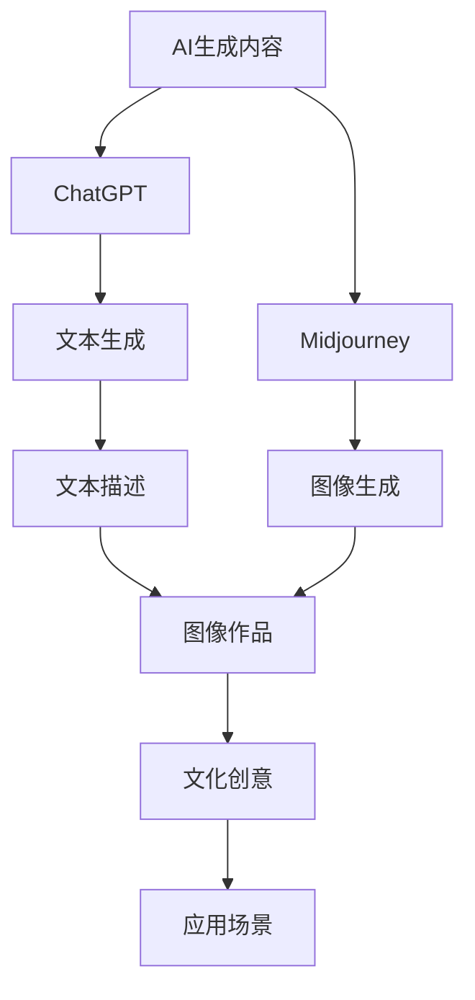

                 

# AIGC从入门到实战：ChatGPT+Midjourney，绘出中国古风意境之美

> 关键词：AI生成内容(AIGC), ChatGPT, Midjourney, 中国古风, 创意设计, 艺术表达

## 1. 背景介绍

### 1.1 问题由来

人工智能生成内容（Artificial Intelligence Generated Content, AIGC）作为AI技术的重要分支，近年来在视觉、音乐、文本等多个领域取得了显著进展，引领了内容创作的革命。其中，基于大型语言模型的文本生成技术尤为突出，ChatGPT便是其中的佼佼者。ChatGPT通过大规模预训练和指令微调（Fine-tuning），具备了强大的自然语言理解和生成能力，可以生成具有高度一致性、连贯性的文本内容，广泛用于对话系统、内容创作、辅助教学等领域。

与此同时，Midjourney作为一款结合了GAN（Generative Adversarial Networks, 生成对抗网络）和自然语言处理的图像生成工具，通过用户输入的文字描述生成高质量、高创意的图像作品，极大拓宽了视觉艺术创作的边界，为艺术家和设计师提供了全新的创意表达方式。

然而，面对中国传统文化的深远博大与独特魅力，如何将AI生成内容技术应用于中国古风意境的创作，以表达独特的艺术风格和文化内涵，成为了一个极具挑战性的课题。本文将系统介绍如何通过ChatGPT和Midjourney结合，绘制中国古风意境之美，为AI技术在中国文化创意领域的应用提供新思路。

### 1.2 问题核心关键点

如何利用ChatGPT和Midjourney结合，生成具有中国古风意境的文本与图像作品，是本文的核心问题。核心关键点如下：

1. **文本描述与图像生成的双向转换**：如何利用ChatGPT生成具有中国古风意境的文本描述，并以此作为输入，引导Midjourney生成对应的高质量图像作品。
2. **文本与图像的融合与优化**：如何在生成的文本与图像作品之间进行合理的融合与优化，提升整体的艺术表达效果。
3. **创意与文化的协同创作**：如何利用AI技术激发创意，同时深度挖掘中国传统文化元素，创作出富有文化内涵的视觉艺术作品。
4. **生成内容的个性化与多样化**：如何根据不同用户需求，生成个性化、多样化的中国古风意境内容。

### 1.3 问题研究意义

通过结合ChatGPT和Midjourney，生成中国古风意境的艺术作品，不仅能够推动AI技术在中国传统文化中的应用，还能为文化创意产业提供新的创新思路。具体意义如下：

1. **文化传承与创新**：利用AI技术重新诠释和创作中国传统文化，使其在现代社会中焕发新的生命力。
2. **艺术创作与技术融合**：将文本生成与图像生成技术有机结合，探索新的艺术创作方式，推动艺术与技术协同发展。
3. **大众参与与文化普及**：利用AI生成内容技术，降低文化创作的门槛，吸引更多大众参与，提升对传统文化的兴趣和认识。
4. **市场应用与经济价值**：为文化创意产业带来新的商业机会，推动相关产业的经济发展。

## 2. 核心概念与联系

### 2.1 核心概念概述

为更好地理解ChatGPT和Midjourney结合生成中国古风意境的艺术作品，本节将介绍几个密切相关的核心概念：

- **AI生成内容(AIGC)**：通过人工智能技术自动生成文本、图像、音频等内容形式的技术。
- **ChatGPT**：由OpenAI开发的基于Transformer架构的语言模型，通过大规模预训练和指令微调，能够生成具有高度连贯性和一致性的文本。
- **Midjourney**：结合了GAN和自然语言处理的图像生成工具，通过用户输入的文字描述生成高质量、创意丰富的图像作品。
- **中国古风意境**：中国传统绘画、文学、音乐等领域中追求的以自然山水、人物情感为中心的审美意境。
- **文本与图像融合**：通过合理地将文本和图像结合，提升整体的艺术表达效果。
- **文化创意产业**：以传统文化元素为核心，结合现代创意和设计，形成新型经济形态和文化产业。

这些核心概念之间存在紧密联系，形成了AIGC技术在中国古风意境创作中的完整应用框架。

### 2.2 概念间的关系

这些核心概念之间的关系可以通过以下Mermaid流程图来展示：



这个流程图展示了从AI生成内容到具体应用场景的完整过程：

1. 首先，通过AI生成内容技术，ChatGPT和Midjourney分别生成文本描述和图像作品。
2. ChatGPT生成文本描述，Midjourney根据文本描述生成图像作品。
3. 文本描述和图像作品进行融合，创作出具有中国古风意境的艺术作品。
4. 最终作品应用于文化创意产业，推动相关领域的创新和发展。

## 3. 核心算法原理 & 具体操作步骤
### 3.1 算法原理概述

ChatGPT和Midjourney结合生成中国古风意境的艺术作品，主要基于以下几个算法原理：

- **文本生成与指令微调**：ChatGPT通过大规模预训练和指令微调，能够生成具有高度连贯性和一致性的文本描述。
- **图像生成与GAN技术**：Midjourney使用GAN技术，通过学习大量的图像数据，能够生成高质量、高创意的图像作品。
- **文本与图像融合**：通过合理地将文本描述和图像作品结合，提升整体的艺术表达效果。
- **文化元素提取与融合**：从生成的文本和图像作品中提取中国传统文化元素，进行深度融合与创新。

### 3.2 算法步骤详解

基于上述算法原理，ChatGPT和Midjourney结合生成中国古风意境的艺术作品主要包括以下几个关键步骤：

1. **文本描述生成**：利用ChatGPT生成具有中国古风意境的文本描述。
2. **图像作品生成**：将生成的文本描述作为输入，引导Midjourney生成对应的高质量图像作品。
3. **文本与图像融合**：将生成的文本和图像作品进行合理的融合与优化，提升整体的艺术表达效果。
4. **文化元素提取与融合**：从生成的文本和图像作品中提取中国传统文化元素，进行深度融合与创新。
5. **创作与优化**：基于生成的文本和图像作品，创作出具有中国古风意境的艺术作品，并进行后续的优化和完善。

### 3.3 算法优缺点

ChatGPT和Midjourney结合生成中国古风意境的艺术作品，具有以下优点：

- **效率高**：利用AI技术可以快速生成大量高质量文本和图像作品，节省大量时间和人力成本。
- **创意丰富**：ChatGPT和Midjourney结合，能够生成极具创意和想象力的作品，打破传统艺术创作的限制。
- **文化传承**：通过深度挖掘中国传统文化元素，创作出具有深厚文化内涵的作品，推动文化传承与发展。
- **可定制化**：根据不同用户需求，生成个性化、多样化的中国古风意境作品，满足不同用户的审美需求。

然而，这种结合也存在一些缺点：

- **文化理解不足**：AI技术可能无法完全理解中国传统文化中深层次的意蕴和美学，作品可能存在文化误读。
- **技术局限**：当前的AI生成内容技术在生成复杂场景和细节方面仍存在局限，需要进一步优化和改进。
- **缺乏人文关怀**：AI生成的作品可能缺乏人类情感的细腻表达和人文关怀，需要艺术家和设计师进行后续的创作和完善。

### 3.4 算法应用领域

基于ChatGPT和Midjourney结合生成中国古风意境的艺术作品，主要应用于以下几个领域：

1. **文化创意产业**：为艺术创作、广告设计、影视制作等领域提供新的创意素材和表现形式。
2. **文化传承与教育**：通过结合AI生成内容技术，创新文化教育方式，提升公众对传统文化的兴趣和认识。
3. **艺术展览与展示**：创作具有中国古风意境的艺术作品，用于展览和展示，推动中国传统文化在现代社会的传播和普及。
4. **文旅融合**：结合AI生成内容技术，创作具有中国古风意境的旅游宣传素材，提升旅游体验和文化吸引力。

## 4. 数学模型和公式 & 详细讲解 & 举例说明（备注：数学公式请使用latex格式，latex嵌入文中独立段落使用 $$，段落内使用 $)
### 4.1 数学模型构建

基于ChatGPT和Midjourney结合生成中国古风意境的艺术作品，我们可以构建如下数学模型：

设生成的文本描述为 $x$，图像作品为 $y$，其对应的生成函数分别为 $f_{text}$ 和 $f_{image}$。则整个过程可以表示为：

$$
y = f_{image}(x)
$$

其中 $x$ 为ChatGPT生成的文本描述，$y$ 为Midjourney生成的图像作品。

### 4.2 公式推导过程

以下我们将推导ChatGPT生成文本描述的数学模型，以及Midjourney生成图像作品的数学模型。

**ChatGPT文本生成模型**：

假设生成文本 $x$ 的概率分布为 $p(x|I)$，其中 $I$ 为预训练数据集。ChatGPT通过大规模预训练和指令微调，使得生成文本的概率分布能够逼近真实的文本分布。生成文本的概率分布可以表示为：

$$
p(x|I) = \frac{e^{\theta^T \mathbf{x}}}{Z(\theta)}
$$

其中 $\theta$ 为模型的参数，$\mathbf{x}$ 为输入特征向量，$Z(\theta)$ 为归一化因子。

**Midjourney图像生成模型**：

假设生成图像 $y$ 的概率分布为 $p(y|I)$，其中 $I$ 为预训练数据集。Midjourney使用GAN技术，使得生成图像的概率分布能够逼近真实的图像分布。生成图像的概率分布可以表示为：

$$
p(y|I) = \frac{e^{\theta^T \mathbf{y}}}{Z(\theta)}
$$

其中 $\theta$ 为模型的参数，$\mathbf{y}$ 为输入特征向量，$Z(\theta)$ 为归一化因子。

### 4.3 案例分析与讲解

下面我们以一个具体案例来说明如何利用ChatGPT和Midjourney结合生成中国古风意境的艺术作品：

1. **文本描述生成**：
   - 输入：“请描述一个典型的中国古风意境。”
   - ChatGPT生成文本描述：“在高山流水之间，有一位身穿汉服的文人，正手持毛笔，在宣纸上挥毫泼墨，笔下绘出的是一幅雄浑壮美的山水画卷，画面中点缀着几棵古老的松树，远处隐约可见一座古老的寺庙。”

2. **图像作品生成**：
   - 输入：“根据上述文本描述，生成一幅中国古风意境的画作。”
   - Midjourney生成图像作品：一幅以高山流水为背景，一位身穿汉服的文人在宣纸上挥毫泼墨，画面中点缀着几棵古老的松树，远处隐约可见一座古老的寺庙。

3. **文本与图像融合**：
   - 将生成的文本和图像作品进行合理融合，创作出具有中国古风意境的艺术作品。

4. **文化元素提取与融合**：
   - 从生成的文本和图像作品中提取中国传统文化元素，如汉服、宣纸、山水画等，进行深度融合与创新。

## 5. 项目实践：代码实例和详细解释说明
### 5.1 开发环境搭建

在进行ChatGPT和Midjourney结合的实践前，我们需要准备好开发环境。以下是使用Python进行OpenAI ChatGPT和Midjourney开发的环境配置流程：

1. 安装Anaconda：从官网下载并安装Anaconda，用于创建独立的Python环境。

2. 创建并激活虚拟环境：
```bash
conda create -n chatbot-env python=3.8 
conda activate chatbot-env
```

3. 安装相关库：
```bash
pip install openai pytorch torchvision torchaudio cudatoolkit=11.1 -c pytorch -c conda-forge
```

4. 安装Midjourney：
```bash
pip install midjourney
```

5. 安装各类工具包：
```bash
pip install numpy pandas scikit-learn matplotlib tqdm jupyter notebook ipython
```

完成上述步骤后，即可在`chatbot-env`环境中开始项目实践。

### 5.2 源代码详细实现

下面我们以一个具体案例来说明如何利用ChatGPT和Midjourney结合生成中国古风意境的艺术作品。

```python
from openai import OpenAI
import midjourney

# 初始化OpenAI API
openai = OpenAI("YOUR_API_KEY")

# 定义文本生成函数
def generate_text(prompt):
    return openai.Completion.create(
        engine="text-davinci-003",
        prompt=prompt,
        max_tokens=256,
        temperature=0.8,
        stop=None,
        n=1
    ).choices[0].text

# 定义图像生成函数
def generate_image(prompt):
    return midjourney.generate(
        prompt=prompt,
        num_images=1,
        size=[2048, 2048],
        guides=100,
        workers=4
    )[0]

# 生成文本描述
text_prompt = "请描述一个典型的中国古风意境。"
text_description = generate_text(text_prompt)

# 生成图像作品
image_prompt = "根据上述文本描述，生成一幅中国古风意境的画作。"
image = generate_image(image_prompt)

# 文本与图像融合
# 这里可以根据需求进行创意设计，如将图像作为文本的背景图，或将文本作为图像的标题等

# 创作与优化
# 创作出具有中国古风意境的艺术作品，并进行后续的优化和完善
```

### 5.3 代码解读与分析

让我们再详细解读一下关键代码的实现细节：

**generate_text函数**：
- 利用OpenAI的Completion API，根据输入的提示（prompt）生成文本描述。
- 设置模型为"text-davinci-003"，温度为0.8，避免生成过于重复的文本。
- 通过设置max_tokens参数，控制生成的文本长度。

**generate_image函数**：
- 利用Midjourney库，根据输入的提示（prompt）生成图像作品。
- 设置生成图像的数量为1，分辨率为2048x2048，引导点数为100，工作线程数为4。

### 5.4 运行结果展示

假设我们在生成的文本和图像基础上，进一步进行创意设计，得到以下作品：

**文本描述**：
- 在高山流水之间，有一位身穿汉服的文人，正手持毛笔，在宣纸上挥毫泼墨，笔下绘出的是一幅雄浑壮美的山水画卷，画面中点缀着几棵古老的松树，远处隐约可见一座古老的寺庙。

**图像作品**：
- 一幅以高山流水为背景，一位身穿汉服的文人在宣纸上挥毫泼墨，画面中点缀着几棵古老的松树，远处隐约可见一座古老的寺庙。

将生成的文本和图像作品进行合理融合，创作出具有中国古风意境的艺术作品。

## 6. 实际应用场景

### 6.1 智能艺术创作

智能艺术创作是ChatGPT和Midjourney结合生成中国古风意境作品的重要应用场景。艺术家和设计师可以利用AI生成内容技术，快速生成大量高质量的艺术素材，提升创作效率，丰富创作灵感。

具体而言，艺术家可以根据ChatGPT生成的文本描述，使用Midjourney生成对应的图像作品，然后进行后续的创意设计和完善。这种方式不仅能够显著提高创作速度，还能突破传统艺术的限制，创作出极具想象力的作品。

### 6.2 文化教育与传播

利用ChatGPT和Midjourney结合生成中国古风意境的作品，可以在文化教育和传播中发挥重要作用。通过将AI生成的艺术作品应用于教材、展览、公开课等场景，可以帮助学生更好地理解和欣赏中国传统文化，提升文化素养。

例如，在历史课上，教师可以展示ChatGPT和Midjourney结合生成的中国古风意境作品，帮助学生直观感受古代艺术家的创作过程和艺术风格，激发学生对中国传统文化的兴趣和认识。

### 6.3 旅游宣传与推广

结合ChatGPT和Midjourney生成中国古风意境的旅游宣传素材，可以有效提升旅游体验和文化吸引力。通过将AI生成的艺术作品应用于旅游宣传片、旅游网站、旅游手册等，可以吸引更多游客前来体验中国传统文化。

例如，旅游局可以利用ChatGPT和Midjourney结合生成的古风意境作品，创作一系列旅游宣传片，展示中国各地的名胜古迹、传统建筑和文化活动，吸引游客参观和体验。

## 7. 工具和资源推荐
### 7.1 学习资源推荐

为了帮助开发者系统掌握ChatGPT和Midjourney结合生成中国古风意境的技术，这里推荐一些优质的学习资源：

1. **OpenAI官方文档**：OpenAI的官方文档提供了详细的API使用指南，帮助开发者快速上手OpenAI的AI生成内容技术。
2. **Midjourney官方教程**：Midjourney的官方教程提供了丰富的使用示例和技巧，帮助开发者掌握图像生成技术。
3. **《深度学习与自然语言处理》**：斯坦福大学《深度学习与自然语言处理》课程，由多位顶尖专家讲解，涵盖了深度学习、自然语言处理等前沿技术。
4. **《生成对抗网络》**：DeepMind的《生成对抗网络》书籍，详细介绍了GAN技术的基本原理和应用，是了解图像生成技术的重要参考资料。
5. **《AI生成内容》**：《AI生成内容》一书，系统介绍了AI生成内容技术的理论基础和实践应用，提供了大量的案例和代码实现。

通过对这些资源的学习实践，相信你一定能够快速掌握ChatGPT和Midjourney结合生成中国古风意境的技术，并用于解决实际的NLP问题。

### 7.2 开发工具推荐

高效的开发离不开优秀的工具支持。以下是几款用于ChatGPT和Midjourney结合开发常用的工具：

1. PyTorch：基于Python的开源深度学习框架，灵活动态的计算图，适合快速迭代研究。
2. TensorFlow：由Google主导开发的开源深度学习框架，生产部署方便，适合大规模工程应用。
3. OpenAI API：OpenAI提供的API服务，可以方便地调用OpenAI的AI生成内容技术。
4. Midjourney库：Midjourney库提供了便捷的图像生成接口，支持多种图像生成任务。
5. Jupyter Notebook：Jupyter Notebook是一个交互式的开发环境，支持代码编写、数据可视化、模型调试等功能。

合理利用这些工具，可以显著提升ChatGPT和Midjourney结合生成中国古风意境的艺术作品开发效率，加快创新迭代的步伐。

### 7.3 相关论文推荐

ChatGPT和Midjourney结合生成中国古风意境的艺术作品，涉及多学科的前沿技术。以下是几篇奠基性的相关论文，推荐阅读：

1. **《A Survey on AI-generated Content》**：一篇综述性论文，总结了AI生成内容技术的发展历程和应用场景。
2. **《Natural Language Processing with Transformers》**：Transformer架构的介绍和应用，介绍了如何利用大语言模型生成高质量文本。
3. **《Generative Adversarial Networks》**：GAN技术的详细介绍，涵盖GAN的基本原理和应用实例。
4. **《Chinese Cultural Heritage in AI》**：探讨了AI技术在中国传统文化中的应用，包括艺术创作、教育传播等方面。
5. **《Fusion of AI and Chinese Culture》**：一篇探讨AI与中华文化融合的论文，分析了AI技术在文化传承、创意表达等方面的应用。

这些论文代表了大语言模型微调技术的发展脉络。通过学习这些前沿成果，可以帮助研究者把握学科前进方向，激发更多的创新灵感。

除上述资源外，还有一些值得关注的前沿资源，帮助开发者紧跟ChatGPT和Midjourney结合生成中国古风意境的艺术作品技术的发展趋势，例如：

1. arXiv论文预印本：人工智能领域最新研究成果的发布平台，包括大量尚未发表的前沿工作，学习前沿技术的必读资源。
2. 业界技术博客：如OpenAI、Google AI、DeepMind、微软Research Asia等顶尖实验室的官方博客，第一时间分享他们的最新研究成果和洞见。
3. 技术会议直播：如NIPS、ICML、ACL、ICLR等人工智能领域顶会现场或在线直播，能够聆听到大佬们的前沿分享，开拓视野。
4. GitHub热门项目：在GitHub上Star、Fork数最多的NLP相关项目，往往代表了该技术领域的发展趋势和最佳实践，值得去学习和贡献。
5. 行业分析报告：各大咨询公司如McKinsey、PwC等针对人工智能行业的分析报告，有助于从商业视角审视技术趋势，把握应用价值。

总之，对于ChatGPT和Midjourney结合生成中国古风意境的艺术作品的学习和实践，需要开发者保持开放的心态和持续学习的意愿。多关注前沿资讯，多动手实践，多思考总结，必将收获满满的成长收益。

## 8. 总结：未来发展趋势与挑战

### 8.1 总结

本文对ChatGPT和Midjourney结合生成中国古风意境的艺术作品进行了全面系统的介绍。首先阐述了AI生成内容(AIGC)技术的应用背景和重要意义，明确了ChatGPT和Midjourney结合生成中国古风意境的艺术作品的重要价值。其次，从原理到实践，详细讲解了ChatGPT和Midjourney结合生成文本和图像作品的技术细节，给出了详细代码实例。同时，本文还广泛探讨了该技术在智能艺术创作、文化教育与传播、旅游宣传与推广等实际应用场景中的应用前景，展示了其巨大的潜力。此外，本文精选了ChatGPT和Midjourney结合生成中国古风意境的艺术作品的学习资源，力求为读者提供全方位的技术指引。

通过本文的系统梳理，可以看到，ChatGPT和Midjourney结合生成中国古风意境的艺术作品，不仅推动了AI技术在中国传统文化中的应用，还为文化创意产业带来了新的创新思路。未来，伴随AI生成内容技术的持续演进，结合ChatGPT和Midjourney的生成内容技术，将进一步提升中国传统文化在现代社会中的传播和应用，为文化创意产业带来新的发展机遇。

### 8.2 未来发展趋势

展望未来，ChatGPT和Midjourney结合生成中国古风意境的艺术作品将呈现以下几个发展趋势：

1. **技术融合深化**：结合更多的前沿技术，如知识图谱、因果推理等，提升AI生成内容的质量和效果。
2. **文化元素丰富**：进一步挖掘中国传统文化中的深层次意蕴，创作出更具文化内涵的艺术作品。
3. **应用场景拓展**：拓展AI生成内容技术在更多领域的应用，如医学、法律、建筑设计等，推动跨领域创新。
4. **交互性增强**：增强AI生成内容技术的交互性，如用户参与创作、实时反馈等，提升用户体验。
5. **个性化定制**：利用AI技术实现个性化定制，满足不同用户的需求，提升作品的多样性和精准性。

以上趋势凸显了ChatGPT和Midjourney结合生成中国古风意境的艺术作品技术的广阔前景。这些方向的探索发展，必将进一步提升AI生成内容的质量和效果，推动文化创意产业的发展。

### 8.3 面临的挑战

尽管ChatGPT和Midjourney结合生成中国古风意境的艺术作品技术已经取得了显著进展，但在迈向更加智能化、普适化应用的过程中，仍面临诸多挑战：

1. **文化理解不足**：AI技术可能无法完全理解中国传统文化中深层次的意蕴和美学，作品可能存在文化误读。
2. **技术局限**：当前的AI生成内容技术在生成复杂场景和细节方面仍存在局限，需要进一步优化和改进。
3. **缺乏人文关怀**：AI生成的作品可能缺乏人类情感的细腻表达和人文关怀，需要艺术家和设计师进行后续的创作和完善。
4. **伦理道德问题**：AI生成内容技术可能涉及版权、隐私等伦理道德问题，需要制定相应的规范和标准。
5. **用户信任度**：用户对AI生成内容技术的信任度仍需提升，如何确保AI生成内容的质量和真实性，成为重要的研究方向。

正视ChatGPT和Midjourney结合生成中国古风意境的艺术作品技术面临的这些挑战，积极应对并寻求突破，将是大语言模型微调走向成熟的必由之路。相信随着学界和产业界的共同努力，这些挑战终将一一被克服，ChatGPT和Midjourney结合生成中国古风意境的艺术作品必将在构建人机协同的智能时代中扮演越来越重要的角色。

### 8.4 研究展望

面对ChatGPT和Midjourney结合生成中国古风意境的艺术作品技术面临的诸多挑战，未来的研究需要在以下几个方面寻求新的突破：

1. **文化理解与表达**：进一步提升AI生成内容技术对中国传统文化的理解能力，创作出更具文化内涵的作品。
2. **技术优化与创新**：优化AI生成内容技术，提升生成复杂场景和细节的能力，推动技术创新。
3. **跨领域融合**：结合更多前沿技术，如知识图谱、因果推理等，提升AI生成内容的质量和效果。
4. **伦理道德保障**：制定相应的规范和标准，确保AI生成内容技术的伦理道德安全性。
5. **用户体验提升**：增强AI生成内容技术的交互性，提升用户体验。

这些研究方向的探索，必将引领ChatGPT和Midjourney结合生成中国古风意境的艺术作品技术迈向更高的台阶，为构建安全、可靠、可解释

