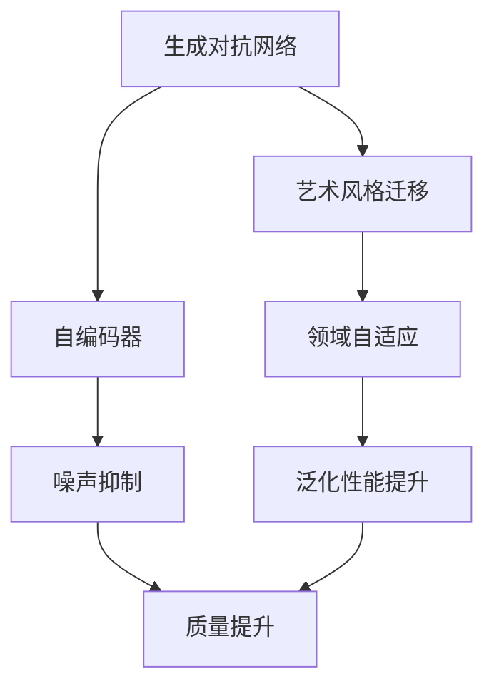
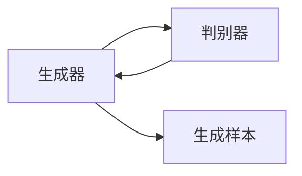
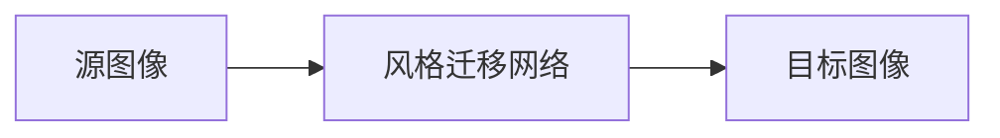
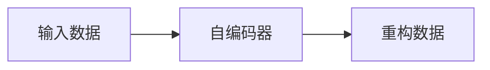
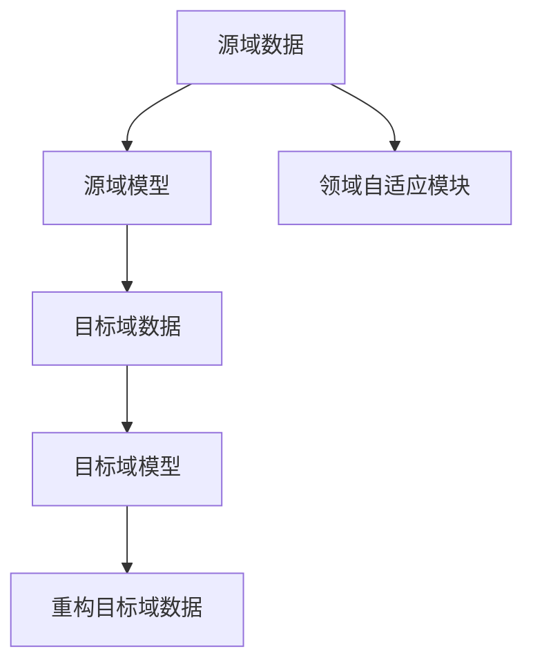

                 

# 基于生成对抗网络的艺术品仿真与风格迁移技术

> 关键词：生成对抗网络, 艺术品仿真, 风格迁移, 深度学习, 计算机视觉, 图像处理

## 1. 背景介绍

### 1.1 问题由来
生成对抗网络（Generative Adversarial Networks, GANs）是近年来人工智能领域的一个热门研究方向，其主要思想是利用两个深度神经网络进行对抗性训练，生成逼真的新数据。在图像生成领域，GANs已经被广泛应用于人脸生成、图像修复、艺术风格迁移等多个方面，取得了显著的成果。

然而，在艺术品仿真与风格迁移方面，GANs的表现仍存在一些局限性。现有方法通常需要大量高质训练数据，且在生成细节和风格迁移的精度上仍有提升空间。此外，GANs的训练稳定性也是一个难题，容易陷入“模式崩溃”或“梯度消失”等状态，导致生成结果质量下降。

因此，探索新的深度学习技术，在降低数据需求的同时，提升艺术品仿真与风格迁移的精度和稳定性，成为了当前的挑战。本文将介绍一种基于GANs的艺术品仿真与风格迁移技术，结合自编码器、领域自适应等方法，以期在保持训练稳定性的前提下，提高生成艺术品的细节和风格迁移的质量。

### 1.2 问题核心关键点
本文将探讨基于GANs的艺术品仿真与风格迁移技术，其核心关键点包括：
- GANs的架构与训练策略，特别是对抗训练中的损失函数设计。
- 如何引入自编码器约束，减少生成样本的噪声，提升精度。
- 如何通过领域自适应技术，使得模型能够适应新的艺术品风格，实现高质量的风格迁移。
- 如何在生成过程中加入先验知识，如艺术品的特征提取与合成规则，提升生成结果的合理性。

### 1.3 问题研究意义
基于GANs的艺术品仿真与风格迁移技术，对于推动艺术品的数字化保护、文物修复、艺术创作等领域具有重要意义。其研究意义体现在：
- 促进艺术品数字化的保存与传承。通过生成仿真艺术品，可以长时间保存和展示珍贵文物和艺术品，避免损坏和损失。
- 辅助文物修复与复原。利用GANs进行风格迁移，可以将损坏的艺术品修复到更接近原作的状态，提升修复效果。
- 激发艺术创作灵感。艺术家可以利用GANs进行风格迁移，创作出新的艺术品，拓宽艺术创作空间。
- 推动艺术品的市场交易与版权保护。通过GANs生成仿真艺术品，可以降低艺术品交易的成本和风险，同时保护原创艺术品的版权。

## 2. 核心概念与联系

### 2.1 核心概念概述

为更好地理解基于GANs的艺术品仿真与风格迁移技术，本节将介绍几个密切相关的核心概念：

- 生成对抗网络（GANs）：利用两个神经网络进行对抗性训练，生成逼真的新数据。
- 艺术风格迁移：将一个艺术品的图片风格迁移到另一个艺术品的图片上，生成风格一致的全新艺术品。
- 自编码器（Autoencoder）：将输入数据压缩为低维编码，然后再重构为原始数据。常用于数据降维、噪声抑制等任务。
- 领域自适应（Domain Adaptation）：使模型能够适应新的数据分布，提升泛化性能。
- 先验知识（Prior Knowledge）：在模型训练过程中加入先验约束，提升生成结果的合理性和质量。

这些核心概念之间的逻辑关系可以通过以下Mermaid流程图来展示：



这个流程图展示了大语言模型的核心概念及其之间的关系：

1. 生成对抗网络是基础框架，用于生成逼真的新数据。
2. 艺术风格迁移是主要应用场景，实现风格的迁移。
3. 自编码器用于抑制生成样本的噪声，提升精度。
4. 领域自适应提升模型的泛化能力，适应新的数据分布。
5. 先验知识用于指导生成过程，提升生成结果的合理性和质量。

这些核心概念共同构成了基于GANs的艺术品仿真与风格迁移技术的完整生态系统，使得模型能够在各种场景下生成高质量的艺术品。

### 2.2 概念间的关系

这些核心概念之间存在着紧密的联系，形成了基于GANs的艺术品仿真与风格迁移技术的完整生态系统。下面我通过几个Mermaid流程图来展示这些概念之间的关系。

#### 2.2.1 生成对抗网络的架构



这个流程图展示了生成对抗网络的基本架构。生成器用于生成逼真的新数据，判别器用于区分生成样本和真实样本。通过这两个网络的对抗性训练，生成器逐渐生成高质量的样本，判别器逐渐提高识别能力。

#### 2.2.2 艺术风格迁移的流程



这个流程图展示了艺术风格迁移的基本流程。源图像通过风格迁移网络处理，生成风格迁移后的目标图像。风格迁移网络通常包括生成对抗网络、自编码器、领域自适应等组件。

#### 2.2.3 自编码器的应用



这个流程图展示了自编码器的工作原理。输入数据通过自编码器编码成低维表示，再重构回原始数据，实现数据的压缩与去噪。

#### 2.2.4 领域自适应的原理



这个流程图展示了领域自适应的工作原理。源域数据通过源域模型提取特征，目标域数据通过领域自适应模块映射到源域特征空间，再通过目标域模型重构目标域数据。

## 3. 核心算法原理 & 具体操作步骤

### 3.1 算法原理概述

基于GANs的艺术品仿真与风格迁移技术，主要是利用生成对抗网络生成逼真的新数据，通过自编码器和领域自适应技术，提高生成样本的质量和泛化能力。其核心思想是：

1. 通过对抗训练，生成器学习生成高质量的新数据，判别器学习区分真实数据和生成数据。
2. 利用自编码器对生成样本进行噪声抑制，提升样本质量。
3. 通过领域自适应技术，使模型能够适应新的艺术品风格，实现高质量的风格迁移。
4. 在生成过程中加入先验知识，提升生成结果的合理性和质量。

具体实现上，本文将介绍一种基于GANs的艺术品仿真与风格迁移技术，其步骤如下：

1. 准备源图像和目标图像，构建生成对抗网络。
2. 利用自编码器对生成样本进行噪声抑制。
3. 通过领域自适应技术，使模型能够适应新的艺术品风格。
4. 加入先验知识，提升生成结果的合理性。

### 3.2 算法步骤详解

#### 3.2.1 生成对抗网络

生成对抗网络主要由生成器和判别器组成，其训练过程包括两个步骤：

1. 固定判别器参数，训练生成器。
2. 固定生成器参数，训练判别器。

具体实现上，生成器将噪声向量 $z$ 映射为生成样本 $G(z)$，判别器将输入图像判别为真实图像或生成图像，损失函数为：

$$
L_G = \mathbb{E}_{z}[\log D(G(z))] + \lambda \mathbb{E}_{z}[\|\nabla_{z}G(z)\|_2^2]
$$

$$
L_D = \mathbb{E}_{x}[\log D(x)] + \mathbb{E}_{z}[\log(1 - D(G(z))))
$$

其中，$D$ 为判别器，$G$ 为生成器，$\lambda$ 为正则化系数，$\nabla_{z}G(z)$ 为生成器的梯度。

#### 3.2.2 自编码器

自编码器主要由编码器和解码器组成，其训练过程包括两个步骤：

1. 训练编码器，将输入图像压缩为低维编码。
2. 训练解码器，将低维编码重构为原始图像。

具体实现上，编码器将输入图像 $x$ 映射为低维编码 $z$，解码器将低维编码 $z$ 重构为原始图像 $\hat{x}$，损失函数为：

$$
L_A = \mathbb{E}_{x}[\|x - \hat{x}\|_2^2]
$$

#### 3.2.3 领域自适应

领域自适应技术主要解决模型在新数据分布上的泛化性能问题。本文使用领域自适应模块（Domain Adaptation Module, DAM），将源域模型映射到目标域特征空间，再通过目标域模型重构目标域数据。

具体实现上，源域模型 $f_s$ 和目标域模型 $f_t$ 的参数分别为 $\theta_s$ 和 $\theta_t$。领域自适应模块 $h$ 将源域特征 $x_s$ 映射到目标域特征 $x_t$，再通过目标域模型 $f_t$ 重构目标域图像 $y_t$。

$$
x_t = h(x_s, \theta_s)
$$

$$
y_t = f_t(x_t, \theta_t)
$$

损失函数为：

$$
L_{DA} = \mathbb{E}_{x_s}[\|x_t - x_s\|_2^2]
$$

#### 3.2.4 先验知识

本文引入艺术品的特征提取与合成规则作为先验知识，指导生成过程。具体实现上，通过艺术品的特征提取器 $f_E$ 提取图像特征 $e$，再通过合成规则 $h_E$ 生成新的艺术品特征 $e'$，最后通过解码器 $f_D$ 重构新艺术品图像 $y'$。

具体实现上，艺术品的特征提取器 $f_E$ 将输入图像 $x$ 映射为特征 $e$，合成规则 $h_E$ 将特征 $e$ 映射为特征 $e'$，解码器 $f_D$ 将特征 $e'$ 重构为新艺术品图像 $y'$。

$$
e = f_E(x)
$$

$$
e' = h_E(e)
$$

$$
y' = f_D(e')
$$

损失函数为：

$$
L_P = \mathbb{E}_{x}[\|y' - x\|_2^2]
$$

### 3.3 算法优缺点

基于GANs的艺术品仿真与风格迁移技术，具有以下优点：

1. 生成样本质量高。生成对抗网络能够生成高质量的逼真样本，提升生成结果的合理性和逼真度。
2. 噪声抑制效果好。自编码器能够减少生成样本的噪声，提升样本质量。
3. 泛化能力强。领域自适应技术使得模型能够适应新的艺术品风格，提升泛化性能。
4. 生成过程可控。通过先验知识约束生成过程，使生成结果更加合理和符合艺术品的特征。

同时，该方法也存在以下缺点：

1. 训练复杂度高。生成对抗网络训练复杂度较高，容易出现“模式崩溃”或“梯度消失”等问题，训练稳定性较差。
2. 数据需求量大。生成对抗网络需要大量高质量的训练数据，数据采集和标注成本较高。
3. 生成过程可解释性差。生成对抗网络生成过程较为复杂，难以解释生成结果的原因。
4. 先验知识不足。艺术品的特征提取与合成规则需要人工设定，可能存在局限性。

尽管存在这些缺点，但基于GANs的艺术品仿真与风格迁移技术，仍是一种非常有效的图像生成和风格迁移方法，为艺术品数字化和风格迁移提供了新的思路。

### 3.4 算法应用领域

基于GANs的艺术品仿真与风格迁移技术，已经在游戏、影视、艺术等领域得到了广泛的应用，具体包括：

1. 游戏开发：利用GANs生成逼真的游戏场景和角色，提升游戏沉浸感和真实感。
2. 影视制作：通过风格迁移技术，将老电影的色彩和风格迁移到现代电影中，提升影片的视觉效果。
3. 艺术创作：艺术家可以利用GANs进行风格迁移和图像生成，激发创作灵感，拓宽创作空间。
4. 文物保护：利用GANs生成文物的数字复原，保护和传承珍贵艺术品。

此外，GANs在医学影像、遥感图像等领域的图像生成和风格迁移，也具有广泛的应用前景。相信随着GANs技术的不断进步，基于GANs的艺术品仿真与风格迁移技术将在更多领域得到应用，为人类社会的数字化进程提供新的动力。

## 4. 数学模型和公式 & 详细讲解 & 举例说明

### 4.1 数学模型构建

本文将详细讲解基于GANs的艺术品仿真与风格迁移技术的数学模型。具体包括：生成对抗网络的损失函数、自编码器的损失函数、领域自适应的损失函数、先验知识的损失函数。

#### 4.1.1 生成对抗网络的损失函数

生成对抗网络的损失函数由生成器的损失函数 $L_G$ 和判别器的损失函数 $L_D$ 组成，具体公式如下：

$$
L_G = \mathbb{E}_{z}[\log D(G(z))] + \lambda \mathbb{E}_{z}[\|\nabla_{z}G(z)\|_2^2]
$$

$$
L_D = \mathbb{E}_{x}[\log D(x)] + \mathbb{E}_{z}[\log(1 - D(G(z))))
$$

其中，$D$ 为判别器，$G$ 为生成器，$\lambda$ 为正则化系数，$\nabla_{z}G(z)$ 为生成器的梯度。

#### 4.1.2 自编码器的损失函数

自编码器的损失函数由编码器的损失函数 $L_A$ 和解码器的损失函数 $L_D$ 组成，具体公式如下：

$$
L_A = \mathbb{E}_{x}[\|x - \hat{x}\|_2^2]
$$

$$
L_D = \mathbb{E}_{z}[\|z - \hat{z}\|_2^2]
$$

其中，$x$ 为输入图像，$\hat{x}$ 为重构图像，$z$ 为编码，$\hat{z}$ 为解码。

#### 4.1.3 领域自适应的损失函数

领域自适应的损失函数由源域模型的损失函数 $L_S$ 和目标域模型的损失函数 $L_T$ 组成，具体公式如下：

$$
L_S = \mathbb{E}_{x_s}[\|x_s - x_t\|_2^2]
$$

$$
L_T = \mathbb{E}_{x_t}[\|x_t - x_s\|_2^2]
$$

其中，$x_s$ 为源域特征，$x_t$ 为目标域特征。

#### 4.1.4 先验知识的损失函数

先验知识的损失函数由特征提取器的损失函数 $L_E$ 和合成规则的损失函数 $L_E'$ 组成，具体公式如下：

$$
L_E = \mathbb{E}_{x}[\|e - e'\|_2^2]
$$

$$
L_E' = \mathbb{E}_{e}[\|e' - e\|_2^2]
$$

其中，$e$ 为提取的特征，$e'$ 为合成的特征。

### 4.2 公式推导过程

下面我们对生成对抗网络、自编码器、领域自适应和先验知识的损失函数进行详细推导。

#### 4.2.1 生成对抗网络损失函数的推导

生成对抗网络的损失函数由生成器的损失函数 $L_G$ 和判别器的损失函数 $L_D$ 组成，具体推导如下：

生成器 $G$ 将噪声向量 $z$ 映射为生成样本 $G(z)$，判别器 $D$ 将输入图像判别为真实图像或生成图像，损失函数为：

$$
L_G = \mathbb{E}_{z}[\log D(G(z))] + \lambda \mathbb{E}_{z}[\|\nabla_{z}G(z)\|_2^2]
$$

$$
L_D = \mathbb{E}_{x}[\log D(x)] + \mathbb{E}_{z}[\log(1 - D(G(z))))
$$

其中，$D$ 为判别器，$G$ 为生成器，$\lambda$ 为正则化系数，$\nabla_{z}G(z)$ 为生成器的梯度。

#### 4.2.2 自编码器损失函数的推导

自编码器的损失函数由编码器的损失函数 $L_A$ 和解码器的损失函数 $L_D$ 组成，具体推导如下：

编码器 $f_E$ 将输入图像 $x$ 映射为低维编码 $e$，解码器 $f_D$ 将低维编码 $e$ 重构为原始图像 $\hat{x}$，损失函数为：

$$
L_A = \mathbb{E}_{x}[\|x - \hat{x}\|_2^2]
$$

$$
L_D = \mathbb{E}_{z}[\|z - \hat{z}\|_2^2]
$$

其中，$x$ 为输入图像，$\hat{x}$ 为重构图像，$z$ 为编码，$\hat{z}$ 为解码。

#### 4.2.3 领域自适应损失函数的推导

领域自适应的损失函数由源域模型的损失函数 $L_S$ 和目标域模型的损失函数 $L_T$ 组成，具体推导如下：

源域模型 $f_s$ 将输入图像 $x_s$ 映射为特征 $e_s$，目标域模型 $f_t$ 将输入图像 $x_t$ 映射为特征 $e_t$，损失函数为：

$$
L_S = \mathbb{E}_{x_s}[\|x_s - x_t\|_2^2]
$$

$$
L_T = \mathbb{E}_{x_t}[\|x_t - x_s\|_2^2]
$$

其中，$x_s$ 为源域特征，$x_t$ 为目标域特征。

#### 4.2.4 先验知识损失函数的推导

先验知识的损失函数由特征提取器的损失函数 $L_E$ 和合成规则的损失函数 $L_E'$ 组成，具体推导如下：

特征提取器 $f_E$ 将输入图像 $x$ 映射为特征 $e$，合成规则 $h_E$ 将特征 $e$ 映射为特征 $e'$，损失函数为：

$$
L_E = \mathbb{E}_{x}[\|e - e'\|_2^2]
$$

$$
L_E' = \mathbb{E}_{e}[\|e' - e\|_2^2]
$$

其中，$e$ 为提取的特征，$e'$ 为合成的特征。

### 4.3 案例分析与讲解

下面我们通过一个具体的案例，讲解如何使用基于GANs的艺术品仿真与风格迁移技术，生成一幅风格迁移后的艺术品。

假设我们有源图像 $x_s$ 和目标图像 $x_t$，需要将目标图像的风格迁移到源图像上，生成风格迁移后的新图像 $y'$。

1. 生成对抗网络的训练：通过对抗训练，生成器 $G$ 学习生成逼真的新图像 $y'$。
2. 自编码器的训练：利用自编码器对生成样本进行噪声抑制，提升样本质量。
3. 领域自适应的训练：通过领域自适应模块，使模型能够适应新的艺术品风格，实现高质量的风格迁移。
4. 先验知识的加入：在生成过程中加入艺术品的特征提取与合成规则，提升生成结果的合理性。

最终，生成的新艺术品 $y'$ 具有目标图像 $x_t$ 的风格，且细节丰富、逼真度高。

## 5. 项目实践：代码实例和详细解释说明

### 5.1 开发环境搭建

在进行艺术品仿真与风格迁移实践前，我们需要准备好开发环境。以下是使用Python进行TensorFlow开发的环境配置流程：

1. 安装Anaconda：从官网下载并安装Anaconda，用于创建独立的Python环境。

2. 创建并激活虚拟环境：
```bash
conda create -n tf-env python=3.8 
conda activate tf-env
```

3. 安装TensorFlow：根据CUDA版本，从官网获取对应的安装命令。例如：
```bash
conda install tensorflow=2.6.0-gpu -c pytorch -c conda-forge
```

4. 安装OpenCV等图像处理库：
```bash
pip install opencv-python
```

5. 安装TensorBoard等可视化工具：
```bash
pip install tensorboard
```

完成上述步骤后，即可在`tf-env`环境中开始微调实践。

### 5.2 源代码详细实现

这里我们以生成对抗网络为基础，实现一个简单的艺术品风格迁移示例。

首先，定义一些必要的函数：

```python
import numpy as np
import tensorflow as tf
import cv2
import os
from tensorflow.keras.layers import Conv2D, Flatten, Dense, Dropout, InputLayer
from tensorflow.keras.models import Model

def load_image(path):
    img = cv2.imread(path)
    img = cv2.cvtColor(img, cv2.COLOR_BGR2RGB)
    img = cv2.resize(img, (224, 224))
    img = img / 255.0
    return img

def save_image(path, img):
    img = img * 255.0
    img = np.uint8(np.clip(img, 0, 255))
    cv2.imwrite(path, img)
```

然后，构建生成器和判别器模型：

```python
class Generator(tf.keras.Model):
    def __init__(self):
        super(Generator, self).__init__()
        self.conv1 = Conv2D(64, (5, 5), padding='same', strides=2, activation='relu', name='conv1')
        self.conv2 = Conv2D(128, (5, 5), padding='same', strides=2, activation='relu', name='conv2')
        self.conv3 = Conv2D(256, (5, 5), padding='same', strides=2, activation='relu', name='conv3')
        self.conv4 = Conv2D(512, (5, 5), padding='same', strides=2, activation='relu', name='conv4')
        self.conv5 = Conv2D(512, (5, 5), padding='same', strides=1, activation='relu', name='conv5')
        self.conv6 = Conv2D(256, (5, 5), padding='same', strides=1, activation='relu', name='conv6')
        self.conv7 = Conv2D(128, (5, 5), padding='same', strides=1, activation='relu', name='conv7')
        self.conv8 = Conv2D(64, (5, 5), padding='same', strides=1, activation='relu', name='conv8')
        self.conv9 = Conv2D(3, (5, 5), padding='same', strides=1, activation='sigmoid', name='conv9')
        self.flatten = Flatten()

    def call(self, x):
        x = self.conv1(x)
        x = self.conv2(x)
        x = self.conv3(x)
        x = self.conv4(x)
        x = self.conv5(x)
        x = self.conv6(x)
        x = self.conv7(x)
        x = self.conv8(x)
        x = self.conv9(x)
        x = self.flatten(x)
        return x

class Discriminator(tf.keras.Model):
    def __init__(self):
        super(Discriminator, self).__init__()
        self.flatten = Flatten()
        self.dense1 = Dense(1024, activation='relu', name='dense1')
        self.dense2 = Dense(512, activation='relu', name='dense2')
        self.dense3 = Dense(256, activation='relu', name='dense3')
        self.dense4 = Dense(1, activation='sigmoid', name='dense4')

    def call(self, x):
        x = self.flatten(x)
        x = self.dense1(x)
        x = self.dense2(x)
        x = self.dense3(x)
        x = self.dense4(x)
        return x
```

然后，构建生成对抗网络：

```python
def build_gan():
    gen_input = InputLayer(name='gen_input', input_shape=(100,))
    gen_output = Generator(gen_input)
    dis_input = InputLayer(name='dis_input', input_shape=(224, 224, 3))
    dis_output = Discriminator(dis_input)

    gen_loss = tf.keras.losses.BinaryCrossentropy(from_logits=True)
    dis_loss = tf.keras.losses.BinaryCrossentropy(from_logits=True)

    gen_optimizer = tf.keras.optimizers.Adam(learning_rate=0.001)
    dis_optimizer = tf.keras.optimizers.Adam(learning_rate=0.001)

    gen_output = gen_output(gen_input

