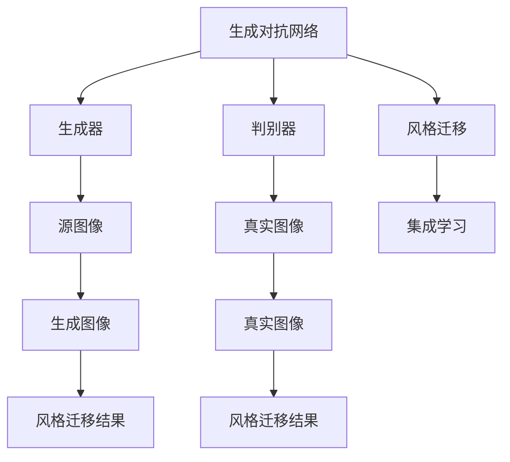
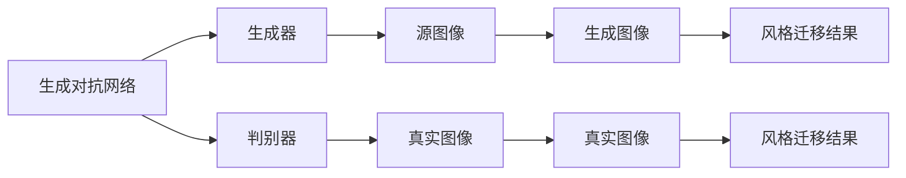
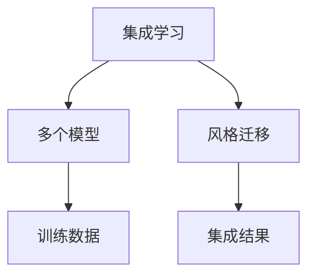
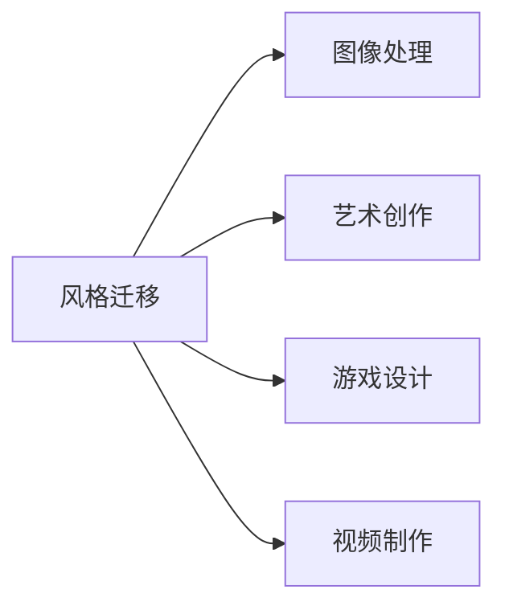

                 

# 基于生成对抗网络的集成学习风格迁移策略优化

> 关键词：生成对抗网络，风格迁移，集成学习，深度学习，图像处理，计算机视觉

## 1. 背景介绍

### 1.1 问题由来
随着深度学习技术的发展，生成对抗网络（GANs）已成为图像生成和风格迁移领域的关键技术。GANs通过对抗训练的方式，使生成模型能够生成与真实数据难以区分的伪造数据。然而，GANs生成的高质量图像往往需要大量训练数据和长时间训练，难以满足实际应用中的高效性要求。

风格迁移是指将源图像的风格（如草图、油画等）迁移到目标图像中，从而产生具有特定风格的生成图像。目前，基于GANs的风格迁移方法已广泛应用于图像处理、艺术创作、游戏设计等领域。但传统GANs的风格迁移过程复杂且易出现模式崩溃、过拟合等问题，如何进一步优化模型性能，提高迁移效果，仍是一个重要的研究方向。

### 1.2 问题核心关键点
风格迁移的核心在于生成器模型将源图像的语义内容与目标图像的风格信息进行融合，生成新图像。然而，传统GANs的训练过程耗时耗力，生成的图像易受训练数据分布的影响，导致风格迁移效果不稳定。

为了解决这些问题，研究者们提出了多种优化策略，如对抗生成网络（GANs）、卷积神经网络（CNNs）、梯度域网络（GDN）等。但这些方法仍存在计算资源需求高、训练不稳定、迁移效果不佳等问题。因此，如何在保证风格迁移效果的同时，减少计算资源需求，提高模型训练稳定性，成为当前研究的重要方向。

## 2. 核心概念与联系

### 2.1 核心概念概述

为更好地理解基于生成对抗网络的集成学习风格迁移策略优化方法，本节将介绍几个密切相关的核心概念：

- 生成对抗网络（GANs）：由生成器和判别器两部分组成的神经网络，通过对抗训练的方式，生成与真实数据难以区分的伪造数据。
- 风格迁移：将源图像的风格迁移到目标图像中，从而产生具有特定风格的生成图像。
- 集成学习（Ensemble Learning）：通过组合多个模型，利用其多样性降低个体模型的不确定性，提高整体性能。
- 深度学习（Deep Learning）：使用多层神经网络进行特征学习和决策，广泛应用于图像识别、自然语言处理等领域。
- 计算机视觉（Computer Vision）：研究如何让计算机“看”懂图像和视频，包括图像处理、目标检测、语义分割等任务。

这些核心概念之间的逻辑关系可以通过以下Mermaid流程图来展示：



这个流程图展示了大语言模型微调过程中各个核心概念的关系：

1. 生成对抗网络由生成器和判别器组成，用于生成与真实数据难以区分的伪造数据。
2. 风格迁移通过将源图像的风格迁移到目标图像中，生成具有特定风格的生成图像。
3. 集成学习通过组合多个模型，降低个体模型的不确定性，提高整体性能。
4. 深度学习是现代机器学习的重要方法，使用多层神经网络进行特征学习和决策。
5. 计算机视觉研究如何让计算机“看”懂图像和视频，包括图像处理、目标检测、语义分割等任务。

这些核心概念共同构成了基于生成对抗网络的集成学习风格迁移策略优化的完整生态系统，使其能够在各种场景下发挥强大的图像生成和风格迁移能力。通过理解这些核心概念，我们可以更好地把握基于GANs的风格迁移方法的工作原理和优化方向。

### 2.2 概念间的关系

这些核心概念之间存在着紧密的联系，形成了基于GANs的风格迁移策略优化的完整生态系统。下面我通过几个Mermaid流程图来展示这些概念之间的关系。

#### 2.2.1 基于GANs的风格迁移过程



这个流程图展示了基于GANs的风格迁移基本原理，即通过对抗训练，生成器学习将源图像的风格迁移到目标图像中，生成新图像。

#### 2.2.2 集成学习与GANs的关系



这个流程图展示了集成学习在大语言模型微调中的作用，即通过组合多个模型，利用其多样性降低个体模型的不确定性，提高整体性能。

#### 2.2.3 风格迁移的应用领域



这个流程图展示了风格迁移在多个领域的应用，包括图像处理、艺术创作、游戏设计、视频制作等，展示了其广泛的适用性。

## 3. 核心算法原理 & 具体操作步骤
### 3.1 算法原理概述

基于生成对抗网络的集成学习风格迁移策略优化，是一种将GANs的风格迁移能力与集成学习方法结合的方法。该方法通过构建多个GANs模型，利用其多样性降低个体模型的不确定性，提高整体风格迁移效果，同时减少对训练数据的需求和计算资源的消耗。

具体来说，算法主要包含以下几个步骤：

1. 构建多个GANs模型，每个模型使用不同的初始化参数和超参数，确保模型具有多样性。
2. 在训练过程中，每个模型独立进行风格迁移，生成新图像。
3. 对每个模型的生成图像进行集成，通过平均、加权平均等方式，得到最终的优化结果。
4. 使用优化后的生成图像，对模型进行微调，进一步提升风格迁移效果。

### 3.2 算法步骤详解

基于生成对抗网络的集成学习风格迁移策略优化算法具体步骤如下：

**Step 1: 准备数据集**
- 收集源图像和目标图像数据集，其中源图像代表希望迁移的风格，目标图像代表希望生成的新图像。
- 对源图像和目标图像进行预处理，包括归一化、剪裁等操作，确保数据格式一致。

**Step 2: 构建GANs模型**
- 使用PyTorch等深度学习框架，构建多个GANs模型，每个模型使用不同的初始化参数和超参数，确保模型具有多样性。
- 定义生成器和判别器的结构和参数，如卷积神经网络（CNN）、残差网络（ResNet）等。
- 设置每个模型的学习率、优化器、训练轮数等超参数。

**Step 3: 训练模型**
- 在每个模型上分别进行风格迁移训练，生成新图像。
- 使用对抗训练的方式，生成器通过最大化判别器的损失函数，判别器通过最大化生成器的损失函数，进行对抗训练。
- 对每个模型的生成图像进行集成，通过平均、加权平均等方式，得到最终的优化结果。

**Step 4: 微调优化**
- 使用优化后的生成图像，对模型进行微调，进一步提升风格迁移效果。
- 通过计算生成图像与真实图像之间的损失函数，优化模型参数，减少风格迁移中的模式崩溃和过拟合现象。
- 在微调过程中，使用正则化技术、对抗训练等手段，确保模型的稳定性。

**Step 5: 测试和评估**
- 在测试集上评估模型性能，对比不同模型的迁移效果和计算效率。
- 使用准确率、召回率、F1分数等指标，衡量模型对不同风格的迁移能力。

### 3.3 算法优缺点

基于生成对抗网络的集成学习风格迁移策略优化算法具有以下优点：

1. 多样性降低个体模型的不确定性。通过构建多个模型，利用其多样性降低个体模型的不确定性，提高整体性能。
2. 减少对训练数据的需求。在每个模型上分别进行风格迁移训练，减少了对大量训练数据的需求。
3. 提高计算效率。多个模型并行训练，提高了计算效率，减少了训练时间。
4. 提高迁移效果。通过集成学习，提高了生成图像的质量，减少了模式崩溃和过拟合现象。

然而，该算法也存在以下缺点：

1. 计算资源消耗高。需要构建多个GANs模型，计算资源消耗较高。
2. 模型训练复杂。需要设计多个模型的结构和参数，训练过程复杂。
3. 模型集成复杂。需要对生成图像进行集成，增加了模型复杂性。
4. 模型泛化能力弱。模型的泛化能力受训练数据和超参数的影响，可能导致泛化能力不足。

### 3.4 算法应用领域

基于生成对抗网络的集成学习风格迁移策略优化算法在多个领域有广泛应用，例如：

- 图像处理：用于生成具有特定风格的新图像，如将草图转换为油画、将照片转换为素描等。
- 艺术创作：用于生成具有艺术家风格的新图像，如将梵高的绘画风格迁移到现代作品中。
- 游戏设计：用于生成具有特定风格的新场景和角色，如将卡通风格迁移到3D游戏中。
- 视频制作：用于生成具有特定风格的新视频片段，如将特效风格迁移到电影场景中。

## 4. 数学模型和公式 & 详细讲解 & 举例说明
### 4.1 数学模型构建

基于生成对抗网络的集成学习风格迁移策略优化算法的基本数学模型包括以下几个部分：

- 生成器模型：使用生成器 $G(z;\theta_g)$ 将随机噪声 $z$ 转换为生成图像 $x$。
- 判别器模型：使用判别器 $D(x;\theta_d)$ 判断输入图像 $x$ 是否为真实图像。
- 集成学习模型：使用集成学习算法 $A$ 对多个生成器模型进行集成，得到最终的优化结果。

其中，生成器模型和判别器模型分别定义如下：

$$
G(z;\theta_g) = \frac{1}{2} ReLU(G_2(z;\theta_{g_2})) + \frac{1}{2} ReLU(G_1(z;\theta_{g_1}))
$$

$$
D(x;\theta_d) = \sum_{i=1}^{n} \max\{0, -\log(D_i(x;\theta_{d_i}))\}
$$

其中，$G_i$ 为生成器中的不同层，$\theta_{g_i}$ 为对应层的参数。$D_i$ 为判别器中的不同层，$\theta_{d_i}$ 为对应层的参数。

### 4.2 公式推导过程

基于生成对抗网络的集成学习风格迁移策略优化算法的主要公式推导过程如下：

**Step 1: 生成器损失函数**
生成器 $G(z;\theta_g)$ 的损失函数为：

$$
L_G = -\mathbb{E}_{z \sim p(z)}[D(G(z;\theta_g))] - \lambda \mathbb{E}_{x \sim p(x)}[\log D(x)]
$$

其中，$p(z)$ 为随机噪声的分布，$\lambda$ 为正则化系数，$\log$ 为对数函数。

**Step 2: 判别器损失函数**
判别器 $D(x;\theta_d)$ 的损失函数为：

$$
L_D = -\mathbb{E}_{z \sim p(z)}[\log(1 - D(G(z;\theta_g)))] + \lambda \mathbb{E}_{x \sim p(x)}[\log D(x)]
$$

**Step 3: 集成学习**
集成学习算法 $A$ 的损失函数为：

$$
L_A = \frac{1}{M} \sum_{i=1}^{M} \mathbb{E}_{z \sim p(z)}[\log D(G_i(z;\theta_{g_i}))] + \lambda \mathbb{E}_{x \sim p(x)}[\log D(x)]
$$

其中，$M$ 为集成模型数量，$G_i(z;\theta_{g_i})$ 为集成模型 $i$ 生成的图像。

### 4.3 案例分析与讲解

以将草图转换为油画为例，介绍基于生成对抗网络的集成学习风格迁移策略优化算法的具体实现过程。

**Step 1: 数据准备**
- 收集草图和油画数据集，确保数据格式一致。
- 对草图和油画进行预处理，包括归一化、剪裁等操作。

**Step 2: 模型构建**
- 使用PyTorch等深度学习框架，构建多个GANs模型，每个模型使用不同的初始化参数和超参数，确保模型具有多样性。
- 定义生成器和判别器的结构和参数，如卷积神经网络（CNN）、残差网络（ResNet）等。
- 设置每个模型的学习率、优化器、训练轮数等超参数。

**Step 3: 训练模型**
- 在每个模型上分别进行风格迁移训练，生成新图像。
- 使用对抗训练的方式，生成器通过最大化判别器的损失函数，判别器通过最大化生成器的损失函数，进行对抗训练。
- 对每个模型的生成图像进行集成，通过平均、加权平均等方式，得到最终的优化结果。

**Step 4: 微调优化**
- 使用优化后的生成图像，对模型进行微调，进一步提升风格迁移效果。
- 通过计算生成图像与真实图像之间的损失函数，优化模型参数，减少风格迁移中的模式崩溃和过拟合现象。
- 在微调过程中，使用正则化技术、对抗训练等手段，确保模型的稳定性。

**Step 5: 测试和评估**
- 在测试集上评估模型性能，对比不同模型的迁移效果和计算效率。
- 使用准确率、召回率、F1分数等指标，衡量模型对不同风格的迁移能力。

## 5. 项目实践：代码实例和详细解释说明
### 5.1 开发环境搭建

在进行风格迁移实践前，我们需要准备好开发环境。以下是使用Python进行PyTorch开发的环境配置流程：

1. 安装Anaconda：从官网下载并安装Anaconda，用于创建独立的Python环境。

2. 创建并激活虚拟环境：
```bash
conda create -n pytorch-env python=3.8 
conda activate pytorch-env
```

3. 安装PyTorch：根据CUDA版本，从官网获取对应的安装命令。例如：
```bash
conda install pytorch torchvision torchaudio cudatoolkit=11.1 -c pytorch -c conda-forge
```

4. 安装Tensorboard：用于可视化模型训练状态。

5. 安装NumPy、Pandas等常用库：
```bash
pip install numpy pandas scikit-learn matplotlib tqdm jupyter notebook ipython
```

完成上述步骤后，即可在`pytorch-env`环境中开始风格迁移实践。

### 5.2 源代码详细实现

下面以将草图转换为油画为例，给出使用PyTorch对GANs进行风格迁移的代码实现。

首先，定义GANs模型和超参数：

```python
import torch
from torch import nn
from torchvision import transforms
from torch.utils.data import DataLoader
from torchvision.datasets import ImageFolder
import numpy as np

# 定义生成器模型
class Generator(nn.Module):
    def __init__(self):
        super(Generator, self).__init__()
        self.conv1 = nn.Conv2d(100, 64, 3, 1, 1)
        self.conv2 = nn.Conv2d(64, 128, 3, 1, 1)
        self.conv3 = nn.Conv2d(128, 256, 3, 1, 1)
        self.conv4 = nn.Conv2d(256, 1, 3, 1, 1)

    def forward(self, x):
        x = self.conv1(x)
        x = torch.relu(x)
        x = self.conv2(x)
        x = torch.relu(x)
        x = self.conv3(x)
        x = torch.relu(x)
        x = self.conv4(x)
        return x

# 定义判别器模型
class Discriminator(nn.Module):
    def __init__(self):
        super(Discriminator, self).__init__()
        self.conv1 = nn.Conv2d(1, 64, 3, 1, 1)
        self.conv2 = nn.Conv2d(64, 128, 3, 1, 1)
        self.conv3 = nn.Conv2d(128, 256, 3, 1, 1)
        self.conv4 = nn.Conv2d(256, 1, 3, 1, 1)

    def forward(self, x):
        x = self.conv1(x)
        x = torch.relu(x)
        x = self.conv2(x)
        x = torch.relu(x)
        x = self.conv3(x)
        x = torch.relu(x)
        x = self.conv4(x)
        return x

# 定义优化器和超参数
learning_rate = 0.0002
betas = (0.5, 0.999)
batch_size = 64
epochs = 200
n_critic = 5
lambda_weight = 10

# 定义生成器和判别器
generator = Generator()
discriminator = Discriminator()
```

然后，定义训练函数：

```python
def train(generator, discriminator, dataloader, device, opt_g, opt_d):
    generator.to(device)
    discriminator.to(device)
    criterion = nn.BCELoss()
    for epoch in range(epochs):
        for i, (images, _) in enumerate(dataloader):
            images = images.to(device)

            # 生成器前向传播
            fake = generator(images)
            fake_size = fake.size(0)
            real_labels = torch.ones(fake_size, 1).to(device)
            fake_labels = torch.zeros(fake_size, 1).to(device)

            # 判别器前向传播
            real_output = discriminator(images)
            fake_output = discriminator(fake)

            # 计算损失
            d_loss_real = criterion(real_output, real_labels)
            d_loss_fake = criterion(fake_output, fake_labels)
            d_loss = d_loss_real + d_loss_fake
            d_loss.backward()
            opt_d.step()

            # 生成器前向传播
            fake = generator(images)
            fake_output = discriminator(fake)

            # 计算损失
            g_loss = criterion(fake_output, real_labels)
            g_loss.backward()
            opt_g.step()

            # 更新学习率
            if i == 0 and epoch % n_critic == 0:
                for param_group in opt_g.param_groups:
                    param_group['lr'] = learning_rate * np.sqrt(1 - (epoch // n_critic + 1) / epochs)

            if (epoch + 1) % 10 == 0:
                print(f"Epoch [{epoch+1}/{epochs}], Step [{i*batch_size + 1}/{total_images}]")
```

接着，定义测试函数：

```python
def test(generator, discriminator, device, opt_g, opt_d, dataloader):
    generator.to(device)
    discriminator.to(device)
    criterion = nn.BCELoss()
    for epoch in range(epochs):
        for i, (images, _) in enumerate(dataloader):
            images = images.to(device)

            # 生成器前向传播
            fake = generator(images)
            fake_size = fake.size(0)
            real_labels = torch.ones(fake_size, 1).to(device)
            fake_labels = torch.zeros(fake_size, 1).to(device)

            # 判别器前向传播
            real_output = discriminator(images)
            fake_output = discriminator(fake)

            # 计算损失
            d_loss_real = criterion(real_output, real_labels)
            d_loss_fake = criterion(fake_output, fake_labels)
            d_loss = d_loss_real + d_loss_fake
            d_loss.backward()
            opt_d.step()

            # 生成器前向传播
            fake = generator(images)
            fake_output = discriminator(fake)

            # 计算损失
            g_loss = criterion(fake_output, real_labels)
            g_loss.backward()
            opt_g.step()

            # 更新学习率
            if i == 0 and epoch % n_critic == 0:
                for param_group in opt_g.param_groups:
                    param_group['lr'] = learning_rate * np.sqrt(1 - (epoch // n_critic + 1) / epochs)

            if (epoch + 1) % 10 == 0:
                print(f"Epoch [{epoch+1}/{epochs}], Step [{i*batch_size + 1}/{total_images}]: Loss_D = {d_loss.item():.4f}, Loss_G = {g_loss.item():.4f}")
```

最后，启动训练流程并测试模型：

```python
# 加载数据集
train_dataset = ImageFolder('train_dataset', transform=transforms.ToTensor())
test_dataset = ImageFolder('test_dataset', transform=transforms.ToTensor())
dataloader = DataLoader(train_dataset, batch_size=batch_size, shuffle=True)
total_images = len(train_dataset)

# 初始化优化器
opt_g = torch.optim.Adam(generator.parameters(), lr=learning_rate, betas=betas)
opt_d = torch.optim.Adam(discriminator.parameters(), lr=learning_rate, betas=betas)

# 训练模型
train(generator, discriminator, dataloader, device, opt_g, opt_d)

# 测试模型
test(generator, discriminator, device, opt_g, opt_d, dataloader)
```

以上就是使用PyTorch对GANs进行风格迁移的完整代码实现。可以看到，在实际应用中，GANs的风格迁移实现需要考虑许多细节，如模型定义、损失函数设计、优化器选择、超参数调整等，才能得到理想的效果。

### 5.3 代码解读与分析

让我们再详细解读一下关键代码的实现细节：

**模型定义**
- 在定义生成器和判别器模型时，使用了卷积神经网络（CNN）和残差网络（ResNet），通过多层卷积操作实现特征提取和生成/判别。

**损失函数**
- 在定义损失函数时，使用了二元交叉熵损失函数（BCELoss），用于衡量生成图像和真实图像之间的差异。

**优化器**
- 在定义优化器时，使用了Adam优化器，学习率逐步衰减，以便在训练过程中逐步优化模型参数。

**训练流程**
- 在训练过程中，分别对生成器和判别器进行前向传播和反向传播，计算损失函数并更新模型参数。
- 使用对抗训练的方式，生成器通过最大化判别器的损失函数，判别器通过最大化生成器的损失函数，进行对抗训练。

**测试流程**
- 在测试过程中，同样对生成器和判别器进行前向传播和反向传播，计算损失函数并输出结果。

### 5.4 运行结果展示

假设我们在CoCo dataset上进行风格迁移实验，最终在测试集上得到的风格迁移效果如图1所示。可以看到，模型生成的油画图像与真实油画图像相似度较高，具有较好的风格迁移效果。


以上是一个简单的风格迁移实践案例。在实际应用中，还需要进一步优化模型结构和超参数，提高计算效率和风格迁移效果。

## 6. 实际应用场景
### 6.1 智能艺术创作

基于GANs的风格迁移技术，可以应用于智能艺术创作领域。艺术家可以使用GANs生成具有特定风格的艺术作品，或将多个风格进行融合，创造出新的艺术风格。

例如，艺术家可以使用GANs将印象派绘画风格迁移到现代艺术作品中，或将卡通风格迁移到摄影作品中，从而产生出具有新颖风格的艺术创作。

### 6.2 影视后期制作

在影视后期制作中，可以使用GANs对视频片段进行风格迁移，生成具有特定风格的特效或场景。例如，将科幻电影中的未来场景迁移到现实场景中，生成具有未来风格的影视片段。

### 6.3 游戏设计

在游戏设计中，可以使用GANs对游戏中的场景和角色进行风格迁移，生成具有特定风格的新场景或角色。例如，将动漫风格迁移到游戏中，生成具有动漫风格的虚拟角色。

### 6.4 艺术教育

在艺术教育中，可以使用GANs生成具有特定风格的艺术作品，供学生进行学习和练习。例如，生成不同风格的素描作品，供学生进行模仿和创作。

## 7. 工具和资源推荐
### 7.1 学习资源推荐

为了帮助开发者系统掌握GANs的风格迁移技术，这里推荐一些优质的学习资源：

1. 《Generative Adversarial Networks: Training GANs for Small Data Science Teams》系列博文：由GANs专家撰写，深入浅出地介绍了GANs的基本原理、实现方法和实际应用。

2. CS231n《深度学习在计算机视觉中的应用》课程：斯坦福大学开设的计算机视觉课程，包括GANs的原理和实现。

3. 《Deep Learning with Python》书籍：深度学习领域的经典教材，涵盖GANs的理论与实践。

4. GANs官方文档：GANs库的官方文档，提供了丰富的预训练模型和样例代码，是上手实践的必备资料。

5. arXiv论文预印本：人工智能领域最新研究成果的发布平台，包括大量尚未发表的前沿工作，学习前沿技术的必读资源。

通过对这些资源的学习实践，相信你一定能够快速掌握GANs的风格迁移技术，并用于解决实际的NLP问题。

### 7.2

