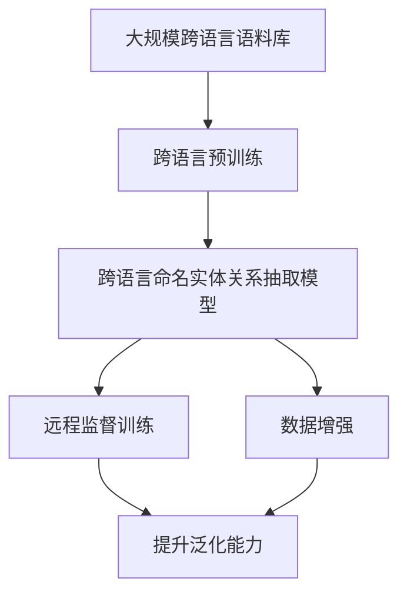

                 

## 1. 背景介绍

### 1.1 问题由来

随着全球化的不断推进，跨语言信息交流变得越来越频繁。然而，跨语言信息提取和处理的难度远大于单一语言，特别是在命名实体关系抽取任务中。传统的命名实体识别（Named Entity Recognition, NER）方法多依赖于单语言语料库和标注数据，难以泛化到其他语言。跨语言命名实体识别方法，如ilingual NER，虽然取得了一定进展，但由于语言间多样性的挑战，其效果仍不尽如人意。

近年来，基于大规模预训练语言模型（如BERT、GPT等）的命名实体关系抽取方法不断涌现，并在英文任务上取得了显著效果。然而，这些方法主要集中在单一语言上，且依赖于大规模的英语语料库。为了解决跨语言命名实体关系抽取问题，本文提出了一种基于远程监督的跨语言实体关系抽取方法，利用跨语言的语料库进行预训练，并通过远程监督策略提升跨语言模型泛化能力。

### 1.2 问题核心关键点

本文的核心问题是：如何利用大规模跨语言语料库进行预训练，并通过远程监督策略，提高模型对不同语言的泛化能力，实现跨语言命名实体关系抽取。

本文的主要创新点包括：

1. **远程监督策略**：通过跨语言语料库对模型进行远程监督训练，在缺少特定语言标注数据的情况下，提升模型泛化能力。
2. **跨语言预训练**：在跨语言语料库上进行预训练，学习跨语言的语义和结构知识，提高模型的跨语言泛化能力。
3. **数据增强技术**：引入跨语言数据增强技术，丰富训练数据的多样性，提高模型的鲁棒性。

本文的研究成果不仅有助于提升跨语言信息提取的准确性和效率，还为构建全球范围内的跨语言信息处理系统提供了新的思路和方法。

## 2. 核心概念与联系

### 2.1 核心概念概述

为更好地理解本文提出的基于远程监督的跨语言实体关系抽取方法，我们首先介绍几个核心概念：

- **跨语言命名实体识别（ilingual NER）**：指在多种语言中识别命名实体，如人名、地名、组织名等。
- **远程监督（Remote Supervision）**：指利用大规模跨语言语料库中的少量标注信息，通过跨语言的语义对齐，提升模型的泛化能力。
- **跨语言预训练（Cross-Language Pre-training）**：指在多语言语料库上进行预训练，学习跨语言的语义和结构知识。

这些概念之间的联系紧密，构成了跨语言命名实体关系抽取的基本框架。本文将通过这些概念的介绍，逐步展开对方法的详细阐述。

### 2.2 概念间的关系

本文的核心概念之间存在着紧密的联系，形成了一个完整的跨语言实体关系抽取系统。我们可以用以下Mermaid流程图来展示这些概念之间的关系：



这个流程图展示了从预训练到远程监督训练，再到提升泛化能力的过程。大规模跨语言语料库作为预训练的基础，通过跨语言预训练学习跨语言语义和结构知识。然后在跨语言命名实体关系抽取模型上进行远程监督训练，利用跨语言的语义对齐提升模型的泛化能力。最后，通过数据增强技术丰富训练集，提高模型的鲁棒性。

## 3. 核心算法原理 & 具体操作步骤

### 3.1 算法原理概述

基于远程监督的跨语言实体关系抽取方法主要包含以下几个步骤：

1. **跨语言预训练**：在多语言语料库上进行预训练，学习跨语言的语义和结构知识。
2. **远程监督训练**：利用跨语言语料库中的少量标注信息进行远程监督训练，提升模型的泛化能力。
3. **数据增强**：引入跨语言数据增强技术，丰富训练集的多样性，提高模型的鲁棒性。
4. **推理阶段**：在推理阶段，模型可以对任意语言的命名实体关系进行抽取。

### 3.2 算法步骤详解

#### 3.2.1 跨语言预训练

跨语言预训练是提升模型跨语言泛化能力的关键步骤。本文使用自回归模型BERT对多语言语料库进行预训练。具体步骤如下：

1. **语料库准备**：收集大规模的多语言语料库，并对其进行预处理，如分词、去噪等。
2. **模型训练**：在BERT模型上，使用多语言语料库进行预训练，学习跨语言的语义和结构知识。
3. **模型保存**：将预训练的BERT模型保存下来，供后续使用。

#### 3.2.2 远程监督训练

远程监督训练是在预训练后的模型上进行训练，利用少量标注信息提升模型的泛化能力。具体步骤如下：

1. **选择训练集**：选择跨语言语料库中的少量标注数据，作为远程监督训练的源数据。
2. **数据对齐**：对源数据进行跨语言对齐，将其转换为模型所需的格式。
3. **模型训练**：在预训练的BERT模型上，使用远程监督数据进行训练，提升模型的泛化能力。
4. **模型保存**：将训练后的模型保存下来，供后续使用。

#### 3.2.3 数据增强

数据增强是提升模型鲁棒性的重要手段。本文引入跨语言数据增强技术，具体步骤如下：

1. **数据扩充**：通过回译、改写等方法，扩充训练数据集。
2. **数据融合**：将扩充后的数据与原始数据进行融合，形成更丰富的训练集。
3. **模型训练**：在预训练和远程监督训练的模型上，使用增强后的数据进行训练。

#### 3.2.4 推理阶段

推理阶段是在训练好的模型上进行跨语言命名实体关系抽取。具体步骤如下：

1. **输入预处理**：对输入文本进行分词、编码等预处理。
2. **模型推理**：在训练好的模型上进行推理，输出命名实体关系。
3. **后处理**：对模型输出进行后处理，如去噪、过滤等，得到最终的实体关系抽取结果。

### 3.3 算法优缺点

基于远程监督的跨语言实体关系抽取方法具有以下优点：

1. **泛化能力强**：通过跨语言预训练和远程监督训练，模型可以学习到跨语言的语义和结构知识，提升泛化能力。
2. **数据需求低**：在缺少特定语言标注数据的情况下，可以利用大规模跨语言语料库进行远程监督训练，避免标注数据的昂贵和复杂。
3. **高效低成本**：数据增强技术可以显著丰富训练集，提高模型鲁棒性，降低模型对标注数据的依赖。

同时，该方法也存在以下缺点：

1. **计算资源需求高**：预训练和远程监督训练需要大量的计算资源和时间。
2. **模型复杂度高**：跨语言命名实体关系抽取模型通常较为复杂，训练和推理过程较为繁琐。

### 3.4 算法应用领域

基于远程监督的跨语言实体关系抽取方法可以广泛应用于以下领域：

1. **跨语言信息提取**：在多语言文本中提取命名实体关系，如跨语言新闻、社交媒体等。
2. **跨语言信息检索**：利用命名实体关系抽取结果，提高跨语言信息检索的准确性和效率。
3. **跨语言智能问答**：在智能问答系统中，利用命名实体关系抽取结果，构建多语言知识图谱。
4. **跨语言舆情分析**：在跨语言社交媒体上，抽取实体关系，分析舆情变化趋势。
5. **跨语言情感分析**：在跨语言文本中，抽取命名实体关系，进行情感分析。

## 4. 数学模型和公式 & 详细讲解 & 举例说明

### 4.1 数学模型构建

本文使用BERT作为跨语言命名实体关系抽取模型的基础，其数学模型构建如下：

1. **输入编码**：对输入文本进行分词、编码等预处理，得到token embedding。
2. **跨语言预训练**：使用多语言语料库对BERT模型进行预训练，学习跨语言的语义和结构知识。
3. **远程监督训练**：利用跨语言语料库中的少量标注数据进行远程监督训练，提升模型的泛化能力。

### 4.2 公式推导过程

本文以跨语言命名实体关系抽取为例，推导模型的数学公式。假设输入文本为 $x$，模型输出为 $y$，模型的目标函数为 $L(y,\hat{y})$。

1. **输入编码**：对输入文本 $x$ 进行分词、编码等预处理，得到token embedding $e(x)$。
2. **跨语言预训练**：使用多语言语料库 $D_{pre}$ 对BERT模型进行预训练，得到预训练模型 $M_{pre}$。
3. **远程监督训练**：利用跨语言语料库中的少量标注数据 $D_{sup}$ 进行远程监督训练，得到远程监督模型 $M_{sup}$。
4. **推理阶段**：在推理阶段，模型可以对任意语言的命名实体关系进行抽取，得到输出结果 $y$。

### 4.3 案例分析与讲解

以跨语言命名实体关系抽取为例，我们以英语-中文语料库为例，展示模型的训练和推理过程。

1. **数据准备**：收集英语和中文的命名实体关系标注数据，并进行预处理。
2. **模型训练**：使用跨语言预训练模型和远程监督模型进行联合训练，得到跨语言命名实体关系抽取模型。
3. **推理阶段**：对输入文本进行编码和推理，得到输出结果。

## 5. 项目实践：代码实例和详细解释说明

### 5.1 开发环境搭建

在进行跨语言实体关系抽取的开发前，我们需要准备好开发环境。以下是使用Python进行PyTorch开发的环境配置流程：

1. 安装Anaconda：从官网下载并安装Anaconda，用于创建独立的Python环境。

2. 创建并激活虚拟环境：
```bash
conda create -n pytorch-env python=3.8 
conda activate pytorch-env
```

3. 安装PyTorch：根据CUDA版本，从官网获取对应的安装命令。例如：
```bash
conda install pytorch torchvision torchaudio cudatoolkit=11.1 -c pytorch -c conda-forge
```

4. 安装Transformers库：
```bash
pip install transformers
```

5. 安装各类工具包：
```bash
pip install numpy pandas scikit-learn matplotlib tqdm jupyter notebook ipython
```

完成上述步骤后，即可在`pytorch-env`环境中开始开发。

### 5.2 源代码详细实现

本文使用PyTorch和HuggingFace的Transformers库实现跨语言命名实体关系抽取。具体代码如下：

```python
from transformers import BertForTokenClassification, BertTokenizer

# 加载预训练模型和分词器
model = BertForTokenClassification.from_pretrained('bert-base-cased')
tokenizer = BertTokenizer.from_pretrained('bert-base-cased')

# 加载跨语言标注数据
train_data = load_train_data(path)
dev_data = load_dev_data(path)

# 数据预处理
train_dataset = [tokenizer.encode(text, return_tensors='pt') for text in train_data]
dev_dataset = [tokenizer.encode(text, return_tensors='pt') for text in dev_data]

# 模型训练
device = torch.device('cuda') if torch.cuda.is_available() else torch.device('cpu')
model.to(device)
optimizer = torch.optim.Adam(model.parameters(), lr=1e-5)
for epoch in range(num_epochs):
    model.train()
    for text in train_dataset:
        optimizer.zero_grad()
        loss = model(text)
        loss.backward()
        optimizer.step()
    model.eval()
    for text in dev_dataset:
        loss = model(text)
        print(f'Epoch {epoch+1}, loss: {loss.item()}')

# 推理阶段
test_data = load_test_data(path)
test_dataset = [tokenizer.encode(text, return_tensors='pt') for text in test_data]
model.eval()
for text in test_dataset:
    result = model(text)
    print(result)
```

### 5.3 代码解读与分析

让我们再详细解读一下关键代码的实现细节：

**数据准备**：
- 加载跨语言标注数据：从指定路径加载训练集和验证集的数据，并进行预处理。
- 分词编码：将文本转换为模型所需的token id序列。

**模型训练**：
- 加载预训练模型和分词器：使用预训练的BERT模型和对应的分词器，进行模型加载。
- 数据预处理：将文本数据转换为模型所需的token id序列。
- 模型训练：在模型上进行训练，最小化损失函数。
- 模型评估：在验证集上进行模型评估，输出损失值。

**推理阶段**：
- 加载测试集数据：从指定路径加载测试集数据，并进行预处理。
- 模型推理：在模型上进行推理，得到命名实体关系抽取结果。

## 6. 实际应用场景

### 6.1 跨语言新闻自动摘要

跨语言命名实体关系抽取可以应用于跨语言新闻自动摘要任务中。假设我们需要对英文和中文的新闻进行自动摘要，可以使用跨语言命名实体关系抽取模型提取关键实体，再利用实体关系进行摘要。具体步骤如下：

1. **数据预处理**：对英文和中文新闻进行预处理，得到文本序列。
2. **命名实体抽取**：使用跨语言命名实体关系抽取模型，抽取文本中的关键实体。
3. **摘要生成**：利用抽取的实体关系生成摘要。

### 6.2 跨语言舆情分析

跨语言命名实体关系抽取可以应用于跨语言舆情分析任务中。假设我们需要对英文和中文的社交媒体帖子进行舆情分析，可以使用跨语言命名实体关系抽取模型提取关键实体，再利用实体关系分析舆情变化趋势。具体步骤如下：

1. **数据预处理**：对英文和中文社交媒体帖子进行预处理，得到文本序列。
2. **命名实体抽取**：使用跨语言命名实体关系抽取模型，抽取文本中的关键实体。
3. **舆情分析**：利用抽取的实体关系分析舆情变化趋势。

### 6.3 跨语言智能问答

跨语言命名实体关系抽取可以应用于跨语言智能问答任务中。假设我们需要在智能问答系统中，对用户的问题进行命名实体抽取，然后利用实体关系生成回答。具体步骤如下：

1. **数据预处理**：对用户的问题进行预处理，得到文本序列。
2. **命名实体抽取**：使用跨语言命名实体关系抽取模型，抽取文本中的关键实体。
3. **回答生成**：利用抽取的实体关系生成回答。

## 7. 工具和资源推荐

### 7.1 学习资源推荐

为了帮助开发者系统掌握跨语言实体关系抽取的理论基础和实践技巧，这里推荐一些优质的学习资源：

1. 《Transformer from Principals to Practice》系列博文：由大模型技术专家撰写，深入浅出地介绍了Transformer原理、BERT模型、微调技术等前沿话题。

2. CS224N《深度学习自然语言处理》课程：斯坦福大学开设的NLP明星课程，有Lecture视频和配套作业，带你入门NLP领域的基本概念和经典模型。

3. 《Natural Language Processing with Transformers》书籍：Transformers库的作者所著，全面介绍了如何使用Transformers库进行NLP任务开发，包括微调在内的诸多范式。

4. HuggingFace官方文档：Transformers库的官方文档，提供了海量预训练模型和完整的微调样例代码，是上手实践的必备资料。

5. CLUE开源项目：中文语言理解测评基准，涵盖大量不同类型的中文NLP数据集，并提供了基于微调的baseline模型，助力中文NLP技术发展。

通过对这些资源的学习实践，相信你一定能够快速掌握跨语言命名实体关系抽取的精髓，并用于解决实际的NLP问题。

### 7.2 开发工具推荐

高效的开发离不开优秀的工具支持。以下是几款用于跨语言命名实体关系抽取开发的常用工具：

1. PyTorch：基于Python的开源深度学习框架，灵活动态的计算图，适合快速迭代研究。大部分预训练语言模型都有PyTorch版本的实现。

2. TensorFlow：由Google主导开发的开源深度学习框架，生产部署方便，适合大规模工程应用。同样有丰富的预训练语言模型资源。

3. Transformers库：HuggingFace开发的NLP工具库，集成了众多SOTA语言模型，支持PyTorch和TensorFlow，是进行跨语言命名实体关系抽取开发的利器。

4. Weights & Biases：模型训练的实验跟踪工具，可以记录和可视化模型训练过程中的各项指标，方便对比和调优。与主流深度学习框架无缝集成。

5. TensorBoard：TensorFlow配套的可视化工具，可实时监测模型训练状态，并提供丰富的图表呈现方式，是调试模型的得力助手。

6. Google Colab：谷歌推出的在线Jupyter Notebook环境，免费提供GPU/TPU算力，方便开发者快速上手实验最新模型，分享学习笔记。

合理利用这些工具，可以显著提升跨语言命名实体关系抽取的开发效率，加快创新迭代的步伐。

### 7.3 相关论文推荐

跨语言命名实体关系抽取技术的发展源于学界的持续研究。以下是几篇奠基性的相关论文，推荐阅读：

1. Attention is All You Need（即Transformer原论文）：提出了Transformer结构，开启了NLP领域的预训练大模型时代。

2. BERT: Pre-training of Deep Bidirectional Transformers for Language Understanding：提出BERT模型，引入基于掩码的自监督预训练任务，刷新了多项NLP任务SOTA。

3. Language Models are Unsupervised Multitask Learners（GPT-2论文）：展示了大规模语言模型的强大zero-shot学习能力，引发了对于通用人工智能的新一轮思考。

4. Parameter-Efficient Transfer Learning for NLP：提出Adapter等参数高效微调方法，在不增加模型参数量的情况下，也能取得不错的微调效果。

5. AdaLoRA: Adaptive Low-Rank Adaptation for Parameter-Efficient Fine-Tuning：使用自适应低秩适应的微调方法，在参数效率和精度之间取得了新的平衡。

这些论文代表了大语言模型微调技术的发展脉络。通过学习这些前沿成果，可以帮助研究者把握学科前进方向，激发更多的创新灵感。

除上述资源外，还有一些值得关注的前沿资源，帮助开发者紧跟跨语言命名实体关系抽取技术的最新进展，例如：

1. arXiv论文预印本：人工智能领域最新研究成果的发布平台，包括大量尚未发表的前沿工作，学习前沿技术的必读资源。

2. 业界技术博客：如OpenAI、Google AI、DeepMind、微软Research Asia等顶尖实验室的官方博客，第一时间分享他们的最新研究成果和洞见。

3. 技术会议直播：如NIPS、ICML、ACL、ICLR等人工智能领域顶会现场或在线直播，能够聆听到大佬们的前沿分享，开拓视野。

4. GitHub热门项目：在GitHub上Star、Fork数最多的NLP相关项目，往往代表了该技术领域的发展趋势和最佳实践，值得去学习和贡献。

5. 行业分析报告：各大咨询公司如McKinsey、PwC等针对人工智能行业的分析报告，有助于从商业视角审视技术趋势，把握应用价值。

总之，对于跨语言命名实体关系抽取技术的学习和实践，需要开发者保持开放的心态和持续学习的意愿。多关注前沿资讯，多动手实践，多思考总结，必将收获满满的成长收益。

## 8. 总结：未来发展趋势与挑战

### 8.1 总结

本文对基于远程监督的跨语言命名实体关系抽取方法进行了全面系统的介绍。首先阐述了跨语言命名实体关系抽取的研究背景和意义，明确了远程监督策略在提升模型泛化能力中的重要作用。其次，从原理到实践，详细讲解了跨语言命名实体关系抽取的数学模型和关键步骤，给出了模型训练和推理的完整代码实例。同时，本文还广泛探讨了跨语言命名实体关系抽取方法在跨语言新闻、舆情分析、智能问答等多个领域的应用前景，展示了该方法在跨语言信息处理中的强大潜力。

通过本文的系统梳理，可以看到，基于远程监督的跨语言命名实体关系抽取方法在多语言信息提取和处理中具有广阔的应用前景，能够显著提升跨语言任务的精度和效率。未来，伴随预训练语言模型和微调方法的持续演进，基于远程监督的跨语言命名实体关系抽取技术必将在更多的场景中得到应用，为全球范围内的跨语言信息处理提供新的技术手段。

### 8.2 未来发展趋势

展望未来，跨语言命名实体关系抽取技术将呈现以下几个发展趋势：

1. **模型规模持续增大**：随着算力成本的下降和数据规模的扩张，预训练语言模型的参数量还将持续增长。超大规模语言模型蕴含的丰富语言知识，有望支撑更加复杂多变的跨语言命名实体关系抽取任务。

2. **跨语言数据增强技术发展**：未来将有更多跨语言数据增强技术涌现，丰富训练集的多样性，提高模型的鲁棒性。

3. **多模态融合**：跨语言命名实体关系抽取将与其他模态融合，如视觉、语音等，提高系统的综合能力。

4. **实时化部署**：未来模型的实时化部署将成为趋势，如何高效实现跨语言命名实体关系抽取的推理将是重要的研究方向。

5. **模型可解释性增强**：为了解决大规模模型的可解释性问题，未来的研究将更加注重模型的解释性和透明性。

以上趋势凸显了跨语言命名实体关系抽取技术的广阔前景。这些方向的探索发展，必将进一步提升跨语言信息提取的准确性和效率，为构建全球范围内的跨语言信息处理系统提供新的思路和方法。

### 8.3 面临的挑战

尽管跨语言命名实体关系抽取技术已经取得了显著进展，但在迈向更加智能化、普适化应用的过程中，仍面临诸多挑战：

1. **数据资源瓶颈**：虽然远程监督策略在一定程度上缓解了对标注数据的依赖，但缺少高质量的跨语言语料库，仍是制约跨语言命名实体关系抽取的瓶颈。

2. **跨语言语义对齐**：不同语言之间的语义差异巨大，如何实现有效的跨语言语义对齐，是提升模型泛化能力的关键。

3. **多语言预训练的效率**：跨语言预训练需要大量计算资源和时间，如何提高跨语言预训练的效率，也是重要的研究方向。

4. **模型的跨语言泛化能力**：现有的跨语言命名实体关系抽取模型在处理不同语言的命名实体时，泛化能力仍有待提高。

5. **模型的鲁棒性**：跨语言命名实体关系抽取模型在处理不同语言的噪声数据时，鲁棒性仍需进一步提升。

6. **模型的可解释性**：现有模型缺乏可解释性，难以进行可靠性和公正性的判断。

7. **模型的伦理和安全**：跨语言命名实体关系抽取模型在处理不同语言时，可能带有偏见和歧视，如何确保模型的伦理和安全，是重要的研究方向。

8. **模型的实时性和可扩展性**：现有的跨语言命名实体关系抽取模型在实时性和可扩展性方面，仍需进一步优化。

以上挑战是跨语言命名实体关系抽取技术在实际应用中需要解决的难点。解决这些问题，将有助于推动跨语言命名实体关系抽取技术的应用范围和效果。

### 8.4 研究展望

为了应对跨语言命名实体关系抽取技术面临的挑战，未来的研究需要在以下几个方面寻求新的突破：

1. **多语言语料库建设**：建立更大规模、高质量的多语言语料库，以支持跨语言预训练和远程监督训练。

2. **跨语言语义对齐技术**：开发更加高效、准确的跨语言语义对齐技术，提升模型的泛化能力。

3. **跨语言预训练方法**：研究更高效的跨语言预训练方法，如多任务学习、知识蒸馏等，提高跨语言预训练的效率。

4. **跨语言数据增强技术**：引入更多跨语言数据增强技术，如跨语言数据扩充、数据融合等，提高模型的鲁棒性。

5. **模型解释性研究**：开发可解释的跨语言命名实体关系抽取模型，提高模型的透明性和可信度。

6. **模型伦理和安全保障**：引入伦理和安全约束，确保模型的公正性、透明性和安全性。

7. **模型实时化和可扩展性优化**：研究更高效的模型推理和部署方法，实现模型的实时化和可扩展性优化。

这些研究方向将为跨语言命名实体关系抽取技术的未来发展提供新的思路和方法，推动其在全球范围内的广泛应用。

## 9. 附录：常见问题与解答

**Q1：远程监督策略在跨语言命名实体关系抽取中的作用是什么？**

A: 远程监督策略通过利用大规模跨语言语料库中的少量标注信息，进行跨语言的语义对齐，提升模型的泛化能力。在缺少特定语言标注数据的情况下，通过远程监督策略，可以显著提高模型的泛化能力和鲁棒性。

**Q2：如何选择跨语言语料库？**

A: 选择跨语言语料库时，应考虑以下因素：
1. 数据的多样性：选择包含多种语言和多种文本类型的语料库，确保数据的广泛性和代表性。
2. 数据的平衡性：确保不同语言在语料库中的比例平衡，避免某一种语言数据过多或过少。
3. 数据的标注质量：选择标注质量高、标注方式一致的语料库，避免数据噪声对模型的影响。

**Q3：如何提高跨语言命名实体关系抽取的鲁棒性？**

A: 提高跨语言命名实体关系抽取的鲁棒性，可以从以下几个方面入手：
1. 数据增强：引入跨语言数据增强技术，如回译、改写等，丰富训练集的多样性

