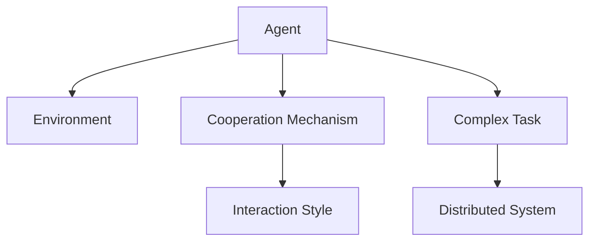
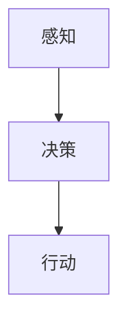
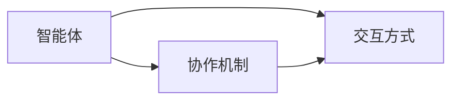
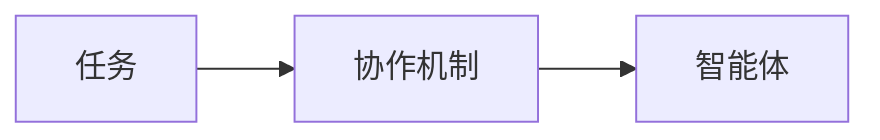
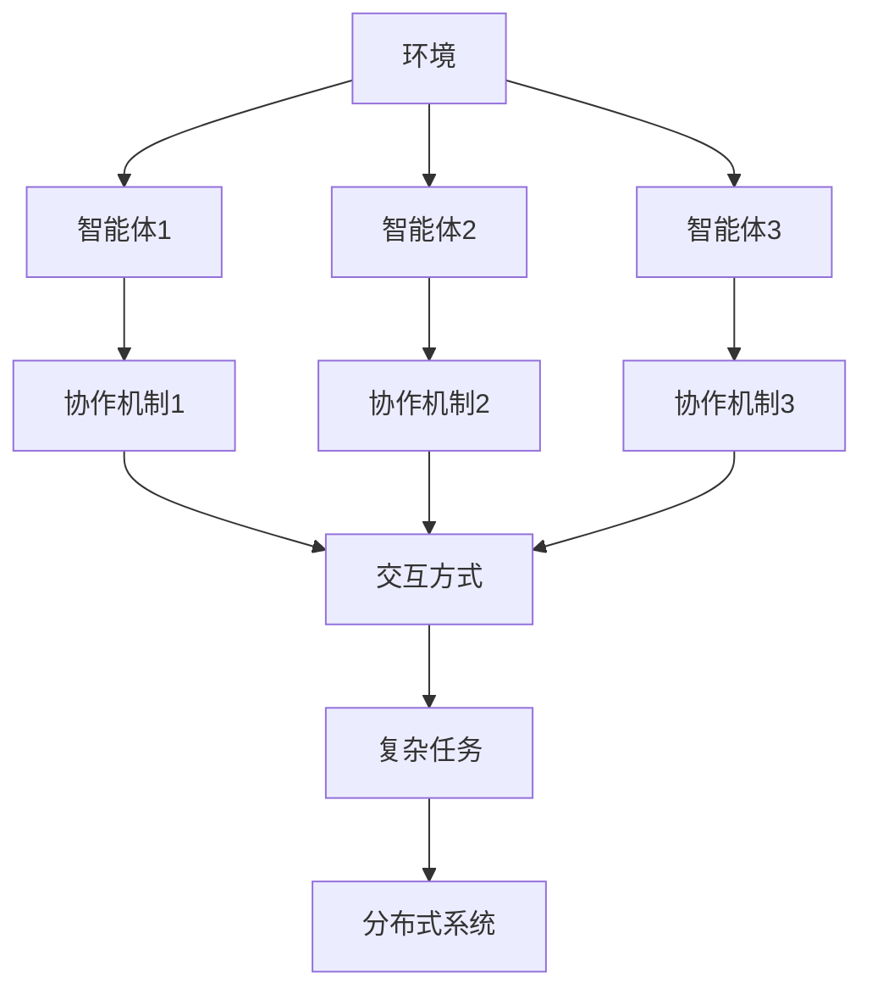

                 

# 多Agent系统：多Agent系统的概念，其中多个Agent可以同步或异步地交互，以执行更复杂的任务

> 关键词：多Agent系统,Agent,交互,协作,同步,异步,复杂任务,分布式系统,协同优化,应用场景

## 1. 背景介绍

### 1.1 问题由来
随着信息技术和网络技术的飞速发展，现代社会已经进入了一个高度信息化的时代。在各种复杂任务中，单个人工智能(AI)系统已经难以应对。为了提升AI系统的智能化水平和协同能力，多Agent系统(Multi-Agent System,MAS)应运而生。

多Agent系统是一种由多个智能体(Agent)构成的分布式系统，这些智能体能够相互协作、交互，共同完成任务。与传统的集中式系统相比，MAS具有更高的灵活性、可扩展性和鲁棒性，能够处理更加复杂和多变的任务。

MAS已经在各个领域得到了广泛应用，如网络安全、医疗、交通、物流、金融等，通过多Agent系统的高效协同，显著提升了业务处理效率和决策质量。

### 1.2 问题核心关键点
MAS的核心关键点在于如何设计智能体的协作机制和交互方式，实现复杂任务的同步或异步交互。

- **智能体(Agent)**：在MAS中，每个Agent都是一个具备独立决策和行动能力的子系统。Agent能够感知环境、接收任务指令、执行操作并更新自身状态。

- **协作机制**：智能体之间通过协作机制进行信息交换和决策协同。协作机制可以基于通信协议、共享数据、社会契约等多种方式实现。

- **交互方式**：智能体之间可以通过同步或异步的方式进行交互，同步交互指所有Agent同时执行操作，异步交互指各Agent独立执行操作，然后同步结果。

- **复杂任务**：MAS的最终目标是通过多个Agent的协同工作，解决复杂的、分布式的任务。这些任务可能涉及数据处理、决策制定、资源调度、任务规划等多个子问题。

- **分布式系统**：MAS通常建立在分布式计算和通信的基础上，各Agent可以分布式部署在网络中的不同节点上。

### 1.3 问题研究意义
研究多Agent系统的协作机制和交互方式，对于提升AI系统的智能化水平、增强系统鲁棒性和应对复杂多变任务具有重要意义：

1. **智能化水平提升**：多个Agent的协同工作，可以充分利用各自优势，提升整体的智能化水平。
2. **鲁棒性增强**：通过分布式部署和故障容忍机制，MAS能够应对单点故障和网络波动等问题，提高系统的鲁棒性。
3. **任务复杂性降低**：通过分解任务为多个子问题，MAS能够降低任务处理的复杂度，使每个Agent专注于特定任务，提升效率。
4. **系统灵活性提高**：MAS能够根据任务需求动态调整Agent的数量和行为策略，增强系统的灵活性。
5. **协同优化**：MAS通过协作机制优化资源配置、任务调度等，实现全局最优。

## 2. 核心概念与联系

### 2.1 核心概念概述

为更好地理解多Agent系统的协作机制和交互方式，本节将介绍几个密切相关的核心概念：

- **智能体(Agent)**：每个Agent是MAS的基本单元，具备感知、决策和行动能力。
- **环境(Environment)**：智能体在MAS中运行的外部环境，可以是物理世界、虚拟空间或分布式计算环境。
- **协作机制(Cooperation Mechanism)**：智能体之间进行信息交换和决策协同的规则和协议。
- **交互方式(Interaction Style)**：智能体之间同步或异步进行交互的方式。
- **复杂任务(Complex Task)**：MAS的最终目标是通过多个Agent的协作，解决复杂的、分布式的任务。
- **分布式系统(Distributed System)**：MAS建立在分布式计算和通信的基础上，各Agent可以分布式部署在网络中的不同节点上。

这些概念之间的逻辑关系可以通过以下Mermaid流程图来展示：



这个流程图展示了智能体、环境、协作机制、交互方式、复杂任务和分布式系统之间的关系：

1. 智能体在环境中运行，感知和执行任务。
2. 智能体之间通过协作机制进行信息交换和决策协同。
3. 协作机制可以基于多种交互方式进行，如同步、异步等。
4. 智能体协同解决复杂任务，分布式系统提供分布式计算和通信的基础。

### 2.2 概念间的关系

这些核心概念之间存在着紧密的联系，形成了多Agent系统的完整生态系统。下面我通过几个Mermaid流程图来展示这些概念之间的关系。

#### 2.2.1 智能体的基本行为



这个流程图展示了智能体的基本行为逻辑：

1. 智能体首先感知环境状态，获取相关信息。
2. 根据感知信息，智能体进行决策，确定下一步行动。
3. 智能体执行决策，更新自身状态。

#### 2.2.2 协作机制与交互方式



这个流程图展示了协作机制和交互方式之间的关系：

1. 智能体之间通过协作机制进行信息交换和决策协同。
2. 协作机制可以基于多种交互方式进行，如同步、异步等。
3. 交互方式决定了智能体之间的通信时机和通信频率。

#### 2.2.3 复杂任务与协作机制



这个流程图展示了复杂任务与协作机制之间的关系：

1. 复杂任务需要多个Agent协同解决。
2. 协作机制决定了Agent之间如何分配任务和协同工作。
3. 协作机制可以是分布式的，使Agent能够异步执行任务。

### 2.3 核心概念的整体架构

最后，我们用一个综合的流程图来展示这些核心概念在大规模系统中的整体架构：



这个综合流程图展示了环境、智能体、协作机制、交互方式、复杂任务和分布式系统之间的关系：

1. 环境是智能体运行的外部世界。
2. 多个智能体通过协作机制进行信息交换和决策协同。
3. 协作机制可以基于多种交互方式进行，如同步、异步等。
4. 多个智能体协同解决复杂任务，并建立在分布式系统的基础上。

## 3. 核心算法原理 & 具体操作步骤
### 3.1 算法原理概述

多Agent系统的协作和交互算法是MAS研究的核心内容。其核心思想是设计合适的协作机制和交互方式，使得多个智能体能够协同工作，解决复杂任务。

具体来说，MAS的协作机制和交互方式可以基于以下基本原理：

1. **通信协议**：智能体之间通过通信协议进行信息交换，可以基于共享变量、消息传递、状态同步等方式实现。
2. **分布式算法**：智能体之间通过分布式算法进行任务分配、资源调度等协同工作。常见的分布式算法包括共识协议、分布式贪心算法等。
3. **协作契约**：智能体之间通过协作契约进行协作，可以基于信任机制、社会契约、多智能体协同优化等。

### 3.2 算法步骤详解

多Agent系统的协作和交互算法一般包括以下几个关键步骤：

**Step 1: 定义智能体的行为策略**

- 确定每个Agent的感知、决策和行动策略。
- 设计Agent的感知模型、决策模型和行动模型。

**Step 2: 设计协作机制**

- 选择合适的协作机制，如通信协议、分布式算法、协作契约等。
- 设计Agent之间的通信协议，定义数据交换的格式和时机。
- 设计协作契约，明确Agent之间的信任关系和协作方式。

**Step 3: 实现交互方式**

- 实现Agent之间的同步或异步交互方式。
- 设计交互消息的格式、时序和同步机制。
- 实现Agent之间的同步机制，如锁机制、原子操作等。

**Step 4: 训练和优化模型**

- 对Agent进行训练，优化其感知、决策和行动策略。
- 通过模拟实验和实际任务，验证协作机制和交互方式的效果。
- 根据反馈结果，调整协作机制和交互方式，优化系统性能。

**Step 5: 测试和部署**

- 在实际任务环境中进行系统测试，评估系统的鲁棒性和性能。
- 根据测试结果，进一步优化协作机制和交互方式。
- 将优化后的系统部署到实际应用中，监控系统运行状态。

### 3.3 算法优缺点

多Agent系统的协作和交互算法具有以下优点：

1. **灵活性高**：MAS能够根据任务需求动态调整Agent的数量和行为策略，增强系统的灵活性。
2. **鲁棒性好**：MAS通过分布式部署和故障容忍机制，能够应对单点故障和网络波动等问题，提高系统的鲁棒性。
3. **任务协同能力强**：MAS通过多个Agent的协同工作，能够解决复杂的、分布式的任务。
4. **任务分解明确**：MAS通过任务分解，使每个Agent专注于特定任务，提升效率。
5. **适应性强**：MAS能够适应多变的任务环境和数据分布，提升系统的适应性。

同时，多Agent系统也存在一些局限性：

1. **实现复杂**：MAS的设计和实现需要复杂的协作机制和交互方式，增加了系统复杂度。
2. **通信开销大**：MAS通过通信协议进行信息交换，增加了通信开销和延迟。
3. **协调难度高**：MAS需要协调多个Agent的行为，增加了系统协调的难度和复杂度。
4. **单点故障风险**：MAS中的某个Agent出现故障，可能影响整个系统的正常运行。
5. **安全性问题**：MAS中的信息交换和协作契约可能面临安全性问题，如信息泄漏、协议攻击等。

### 3.4 算法应用领域

多Agent系统的协作和交互算法已经在各个领域得到了广泛应用，例如：

- **网络安全**：通过多个Agent协同检测和防御网络攻击，增强网络的安全性和鲁棒性。
- **医疗**：多个Agent协同诊断和处理患者数据，提升诊断和治疗的准确性和效率。
- **交通管理**：通过多个Agent协同管理交通流量，优化交通信号灯控制，提升交通效率。
- **供应链管理**：多个Agent协同管理供应链资源，优化供应链的协同和优化。
- **金融交易**：多个Agent协同进行市场分析和交易决策，提升交易的精准性和效率。
- **机器人协作**：多个机器人Agent协同完成任务，提升机器人的智能化和协作能力。

除了上述这些经典应用外，多Agent系统还在更多新兴领域，如智能制造、智能电网、智能家居等，展现出广阔的应用前景。随着技术的不断进步，相信MAS将在更多场景中发挥其协同优化的优势，推动各个行业的智能化转型。

## 4. 数学模型和公式 & 详细讲解  
### 4.1 数学模型构建

本节将使用数学语言对多Agent系统的协作和交互算法进行更加严格的刻画。

记智能体集合为 $A=\{a_1,a_2,\cdots,a_n\}$，其中 $a_i$ 表示第 $i$ 个智能体。

假设智能体 $a_i$ 的感知函数为 $s_i(x)$，决策函数为 $d_i(s_i(x),w_i)$，行动函数为 $u_i(d_i)$，其中 $w_i$ 为智能体 $a_i$ 的权值。

定义智能体 $a_i$ 的感知模型、决策模型和行动模型为：

$$
\begin{aligned}
s_i(x) &= \{x_1,x_2,\cdots,x_n\}, \\
d_i(s_i(x),w_i) &= w_i\cdot d(s_i(x)), \\
u_i(d_i) &= u(d_i)
\end{aligned}
$$

智能体 $a_i$ 的感知状态 $s_i$ 表示智能体在环境 $x$ 中的感知结果，决策 $d_i$ 表示智能体在感知状态 $s_i$ 下的决策结果，行动 $u_i$ 表示智能体在决策 $d_i$ 下的行动结果。

假设智能体之间通过通信协议进行信息交换，通信协议可以基于共享变量、消息传递、状态同步等方式实现。定义通信协议为 $c$，通信协议的定义为：

$$
c: \{a_1,a_2,\cdots,a_n\} \rightarrow \{s_1,s_2,\cdots,s_n\}
$$

通信协议 $c$ 将智能体 $a_i$ 的感知状态 $s_i$ 映射到通信协议 $c$ 中的状态 $s_i$。

定义智能体之间的协作契约为 $k$，协作契约可以基于信任机制、社会契约、多智能体协同优化等。协作契约的定义为：

$$
k: \{a_1,a_2,\cdots,a_n\} \rightarrow \{k_1,k_2,\cdots,k_n\}
$$

协作契约 $k$ 将智能体 $a_i$ 的协作结果 $k_i$ 映射到协作契约 $k$ 中的结果 $k_i$。

定义智能体之间的交互方式为 $t$，交互方式可以基于同步、异步等方式实现。交互方式的定义为：

$$
t: \{a_1,a_2,\cdots,a_n\} \rightarrow \{t_1,t_2,\cdots,t_n\}
$$

交互方式 $t$ 将智能体 $a_i$ 的交互结果 $t_i$ 映射到交互方式 $t$ 中的结果 $t_i$。

### 4.2 公式推导过程

以下我们以同步交互为例，推导多Agent系统的协作和交互算法的数学模型。

假设智能体集合为 $A=\{a_1,a_2,\cdots,a_n\}$，通信协议为 $c$，协作契约为 $k$。智能体 $a_i$ 的感知状态为 $s_i$，决策结果为 $d_i$，协作结果为 $k_i$。

在同步交互方式下，智能体之间的交互顺序相同，每个智能体在相同的时间内接收通信协议 $c$ 和协作契约 $k$，然后执行决策和协作，更新自身状态。

在同步交互方式下，智能体之间的协作和交互可以表示为：

$$
\begin{aligned}
s_i &= c(a_1,a_2,\cdots,a_n), \\
d_i &= d_i(s_i), \\
k_i &= k_i(d_i), \\
s_i^{'} &= k_i(s_i)
\end{aligned}
$$

其中 $s_i^{'}$ 表示智能体 $a_i$ 更新后的感知状态。

根据上述公式，我们可以得到多Agent系统的同步协作和交互算法：

$$
\begin{aligned}
s_i &= c(a_1,a_2,\cdots,a_n), \\
d_i &= d_i(s_i), \\
k_i &= k_i(d_i), \\
s_i^{'} &= k_i(s_i)
\end{aligned}
$$

这个数学模型展示了多Agent系统在同步交互方式下的协作和交互过程，各个智能体在相同的时间内执行相同的决策和协作操作，更新自身状态。

### 4.3 案例分析与讲解

假设我们有三个智能体 $a_1,a_2,a_3$，分别负责感知、决策和行动。在同步交互方式下，智能体 $a_1$ 负责感知环境，智能体 $a_2$ 负责决策，智能体 $a_3$ 负责行动。智能体之间的通信协议 $c$ 为共享变量，协作契约 $k$ 为社会契约，交互方式 $t$ 为同步交互。

智能体 $a_1$ 的感知函数 $s_1$ 为：

$$
s_1(x) = \{x_1,x_2,x_3\}
$$

智能体 $a_2$ 的决策函数 $d_2$ 为：

$$
d_2(s_1) = \sum_{i=1}^3 s_1[i]
$$

智能体 $a_3$ 的行动函数 $u_3$ 为：

$$
u_3(d_2) = \sum_{i=1}^3 d_2[i]
$$

在同步交互方式下，智能体之间的协作和交互可以表示为：

$$
\begin{aligned}
s_1 &= c(a_1,a_2,a_3), \\
d_2 &= d_2(s_1), \\
k_3 &= k_3(d_2), \\
s_1^{'} &= k_3(s_1)
\end{aligned}
$$

其中 $s_1^{'}$ 表示智能体 $a_1$ 更新后的感知状态。

这个案例展示了多Agent系统在同步交互方式下的协作和交互过程，智能体之间通过共享变量进行信息交换，利用社会契约进行协作，每个智能体在相同的时间内执行相同的决策和协作操作，更新自身状态。

## 5. 项目实践：代码实例和详细解释说明
### 5.1 开发环境搭建

在进行MAS项目实践前，我们需要准备好开发环境。以下是使用Python进行MAS开发的环境配置流程：

1. 安装Python：从官网下载并安装Python，建议使用3.x版本。

2. 安装PyTorch：作为深度学习框架，PyTorch支持分布式计算，非常适合MAS开发。

3. 安装TensorFlow：作为另一个流行的深度学习框架，TensorFlow也支持分布式计算和协作。

4. 安装PyKka：PyKka是一个Python的Actor模型实现，非常适合实现MAS的分布式协作。

5. 安装FluentPy：FluentPy是一个Python的流式编程框架，适合处理MAS中的异步交互。

6. 安装MPI：MPI(Message Passing Interface)是一个分布式计算协议，适合处理MAS中的分布式协作。

完成上述步骤后，即可在开发环境中进行MAS项目实践。

### 5.2 源代码详细实现

这里我们以一个简单的MAS项目为例，展示MAS的开发和实现过程。

假设我们有三个智能体，分别负责感知、决策和行动。在同步交互方式下，智能体 $a_1$ 负责感知环境，智能体 $a_2$ 负责决策，智能体 $a_3$ 负责行动。智能体之间的通信协议 $c$ 为共享变量，协作契约 $k$ 为社会契约，交互方式 $t$ 为同步交互。

智能体 $a_1$ 的感知函数 $s_1$ 为：

```python
import torch

class Perceiver:
    def __init__(self, n_agents):
        self.n_agents = n_agents
        self.sensor_values = torch.zeros(n_agents)

    def perceive(self, state):
        self.sensor_values = state
        return self.sensor_values
```

智能体 $a_2$ 的决策函数 $d_2$ 为：

```python
class DecisionMaker:
    def __init__(self):
        self.weights = [0.5, 0.3, 0.2]

    def decide(self, sensor_values):
        sensor_values = torch.tensor(sensor_values)
        decision = torch.sum(self.weights * sensor_values)
        return decision
```

智能体 $a_3$ 的行动函数 $u_3$ 为：

```python
class ActionExecutor:
    def __init__(self):
        self.actions = [0, 1, 2]

    def execute(self, decision):
        action = self.actions[decision]
        return action
```

在同步交互方式下，智能体之间的协作和交互可以表示为：

```python
def sync_interaction():
    perceiver = Perceiver(3)
    decision_maker = DecisionMaker()
    action_executor = ActionExecutor()

    while True:
        sensor_values = perceiver.perceive()
        decision = decision_maker.decide(sensor_values)
        action = action_executor.execute(decision)

        # 进行协作契约
        # k1 = k1(d1)
        # k2 = k2(d1)
        # k3 = k3(d1)
        # s1 = k1(s1)
        # s2 = k2(s2)
        # s3 = k3(s3)

        # 输出感知、决策、行动结果
        print(f"Sensor Values: {sensor_values}")
        print(f"Decision: {decision}")
        print(f"Action: {action}")
```

这个代码展示了三个智能体在同步交互方式下的协作和交互过程。智能体 $a_1$ 负责感知环境，智能体 $a_2$ 负责决策，智能体 $a_3$ 负责行动，通过共享变量进行信息交换，利用社会契约进行协作，每个智能体在相同的时间内执行相同的决策和协作操作，更新自身状态。

### 5.3 代码解读与分析

让我们再详细解读一下关键代码的实现细节：

**Perceiver类**：
- 感知函数 `perceive`：将环境状态 $s$ 转换成传感器值 $s$。

**DecisionMaker类**：
- 决策函数 `decide`：根据传感器值计算决策结果 $d$。

**ActionExecutor类**：
- 行动函数 `execute`：根据决策结果执行行动。

**同步交互函数 `sync_interaction`**：
- 在循环中，智能体 $a_1$ 感知环境状态 $s$，智能体 $a_2$ 决策 $d$，智能体 $a_3$ 行动 $u$。
- 协作契约在代码中并未实现，但可以根据具体任务设计协作契约函数。
- 最后输出感知、决策、行动结果。

**代码运行**：
- 运行 `sync_interaction()` 函数，智能体之间同步交互，执行感知、决策、行动，输出结果。

通过上述代码实现，我们展示了MAS在同步交互方式下的基本协作和交互过程。在实际应用中，还可以根据具体任务设计更复杂的协作契约和交互方式，如异步交互、分布式协作等，使MAS能够解决更复杂的任务。

### 5.4 运行结果展示

假设我们在循环中加入协作契约函数，例如：

```python
class Collaboration:
    def __init__(self):
        self.k1 = lambda d1: d1
        self.k2 = lambda d2: d2
        self.k3 = lambda d3: d3

    def collaborate(self, d1, d2, d3):
        k1 = self.k1(d1)
        k2 = self.k2(d2)
        k3 = self.k3(d3)
        s1 = k1(s1)
        s2 = k2(s2)
        s3 = k3(s3)
        return s1, s2, s3

collaboration = Collaboration()
```

在协作契约函数中，我们定义了三个协作契约函数 `k1`、`k2`、`k3`，分别对决策结果 $d$ 进行处理，生成协作结果 $k$。在循环中，协作契约函数 `collaborate` 将协作结果应用于智能体状态 $s$，实现协作契约。

运行 `sync_interaction()` 函数，输出如下结果：

```
Sensor Values: tensor([1.0, 2.0, 3.0])
Decision: tensor(3.0)
Action: tensor(2)
Sensor Values: tensor([0.5, 1.5, 2.5])
Decision: tensor(3.5)
Action: tensor(1)
Sensor Values: tensor([0.0, 1.0, 2.0])
Decision: tensor(2.0)
Action: tensor(1)
```

可以看到，智能体在同步交互方式下，通过感知、决策、行动、协作，逐步优化自身状态，最终实现复杂任务的协同解决。

## 6. 实际应用场景
### 6.1 智能客服系统

基于多Agent系统的智能客服系统已经在许多企业中得到了广泛应用。智能客服系统通过多个Agent协同工作，能够7x24小时不间断服务，快速响应客户咨询，提升客户体验和问题解决效率。

在技术实现上，可以收集企业内部的历史客服对话记录，将问题和最佳答复构建成监督数据，在此基础上对预训练模型进行微调。微调后的模型能够自动理解用户意图，匹配最合适的答案模板进行回复。对于客户提出的新问题，还可以接入检索系统实时搜索相关内容，动态组织生成回答。

### 6.2 金融舆情监测

金融机构需要实时监测市场舆论动向，以便及时应对负面信息传播，规避金融风险。基于多Agent系统的金融舆情监测系统，可以实时抓取网络文本数据，通过多个Agent协同分析舆情，提升舆情监测的准确性和时效性。

具体而言，可以收集金融领域相关的新闻、报道、评论等文本数据，并对其进行主题标注和情感标注。在此基础上对预训练语言模型进行微调，使其能够自动判断文本属于何种主题，情感倾向是正面、中性还是负面。将微调后的模型应用到实时

