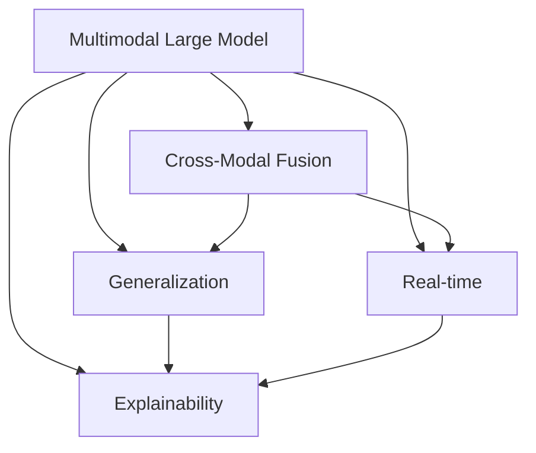
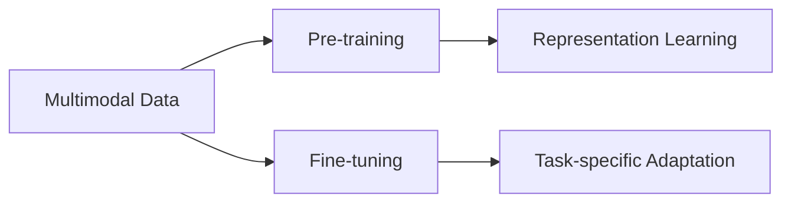
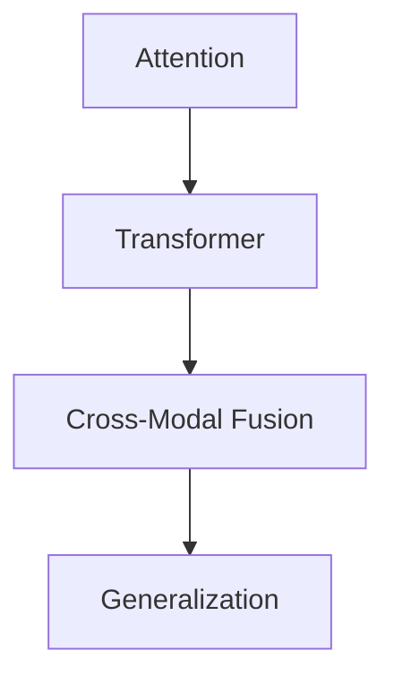
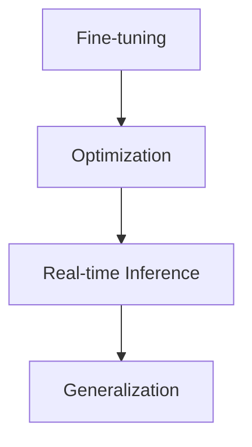
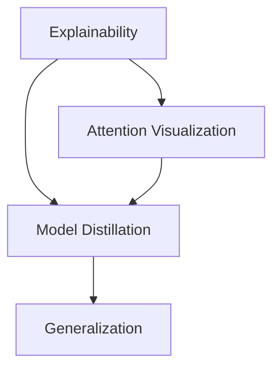
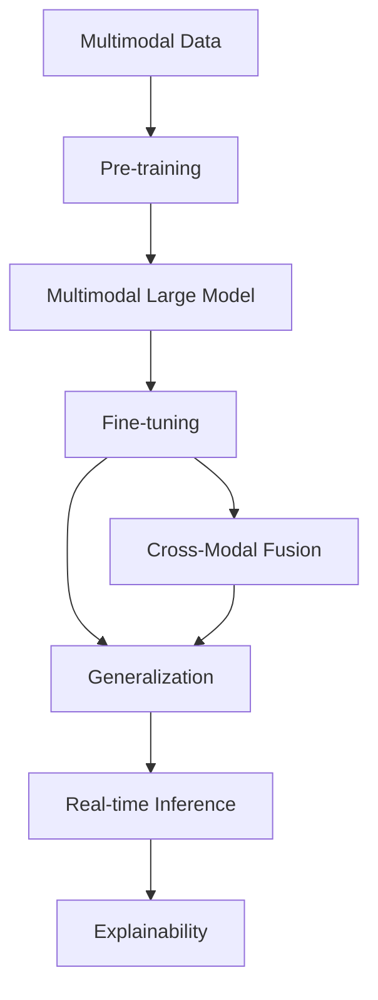

                 

# 多模态大模型：技术原理与实战 多模态大模型在出行与物流领域中的应用

> 关键词：多模态大模型,出行与物流,技术原理,实战应用,深度学习,自然语言处理(NLP),计算机视觉(CV),多模态融合,决策支持

## 1. 背景介绍

### 1.1 问题由来
在当今数字化、智能化的时代，各行业正加速向智慧化转型，其中出行与物流领域更是关注热点。出行与物流涉及广泛的业务场景，包括但不限于路线规划、运力调度、物流仓储、订单管理、配送服务等。这些业务场景往往涉及多方面的信息，单一的文本或图像等单一模态数据难以满足需求，需要多模态数据融合来支持更加复杂和精准的决策。

在传统解决方案中，多模态数据融合主要依赖于规则、启发式算法、特征工程等技术。但这些方法通常难以处理大规模复杂数据，且泛化能力不足，限制了其在实际应用中的广泛应用。而近年来，基于深度学习的多模态大模型在出行与物流领域的应用逐渐崭露头角。利用大模型强大的特征提取和泛化能力，可以实现跨模态数据的有效融合，提升业务决策的精准性和效率。

本文聚焦于多模态大模型在出行与物流领域的技术原理与实战应用，帮助读者理解其核心思想，掌握其实际应用的技术要点。

### 1.2 问题核心关键点
多模态大模型在出行与物流领域的应用核心关键点包括：

1. **多模态数据融合**：结合文本、图像、时序等多模态数据，构建统一的信息表示。
2. **泛化与泛化能力**：在跨模态数据融合的基础上，提升模型的泛化能力，适应多样化的业务场景。
3. **实时性与高效性**：在大模型基础上，优化推理和计算效率，实现实时化的业务决策支持。
4. **可解释性与透明性**：提高模型的可解释性和透明性，便于业务人员理解和信任模型。

这些核心关键点共同构成了多模态大模型在出行与物流领域应用的技术基础。通过深入理解这些关键点，读者可以更好地把握多模态大模型的实际应用场景和潜力。

### 1.3 问题研究意义
多模态大模型在出行与物流领域的应用具有重要意义：

1. **提升业务决策精度**：利用多模态数据融合，提高决策模型的准确性和鲁棒性。
2. **加速业务流程**：实现自动化、智能化的业务流程，提高业务处理速度和效率。
3. **降低业务成本**：减少人工干预和错误，降低业务运营成本。
4. **推动产业升级**：通过技术革新，提升出行与物流行业的智能化水平，促进产业转型升级。
5. **助力可持续发展**：利用智能决策优化资源配置，提升能源利用效率，推动可持续发展。

本文通过详细讲解多模态大模型的技术原理和实战应用，希望能够为读者提供深刻的理论指导和实际操作指南，助力其在出行与物流领域实现技术创新和业务优化。

## 2. 核心概念与联系

### 2.1 核心概念概述

为更好地理解多模态大模型在出行与物流领域的应用，本节将介绍几个密切相关的核心概念：

- **多模态大模型(Multimodal Large Model)**：结合文本、图像、时序等多种数据模态，构建强大的特征提取和泛化能力的大模型。多模态大模型能够处理复杂的多维数据，支持跨模态信息融合。
- **跨模态融合**：将不同数据模态的信息融合在一起，构建统一的信息表示。常见的跨模态融合方法包括注意力机制、Transformer等。
- **泛化能力**：模型能够从已有数据泛化到新数据的能力，即对未知数据的高适应性。泛化能力是提升模型业务决策精准性的关键。
- **实时性**：在多模态数据融合和泛化能力的基础上，优化推理和计算效率，支持实时化的业务决策。
- **可解释性**：多模态大模型的输出和决策过程能够清晰解释，便于业务人员理解和信任。

这些核心概念之间的逻辑关系可以通过以下Mermaid流程图来展示：



这个流程图展示了大模型在多模态数据融合、泛化能力、实时性和可解释性方面的核心能力，以及它们之间的关系。

### 2.2 概念间的关系

这些核心概念之间存在着紧密的联系，形成了多模态大模型在出行与物流领域应用的整体架构。下面我们通过几个Mermaid流程图来展示这些概念之间的关系。

#### 2.2.1 多模态大模型的学习范式



这个流程图展示了大模型在多模态数据预训练和任务微调中的学习范式。预训练阶段主要利用大规模无标签数据，学习多模态数据的泛化表示；微调阶段则利用业务领域的有标签数据，对模型进行特定任务适配。

#### 2.2.2 跨模态融合与泛化能力的关系



这个流程图展示了注意力机制和Transformer在跨模态融合中的应用。通过注意力机制和Transformer，可以实现跨模态信息的有效融合，提升模型的泛化能力。

#### 2.2.3 实时性与泛化能力的关系



这个流程图展示了任务微调和优化对实时性提升的影响。通过任务微调和优化，可以提升模型推理速度，实现实时化的业务决策支持。

#### 2.2.4 可解释性与泛化能力的关系



这个流程图展示了可解释性对泛化能力的影响。通过注意力可视化、模型蒸馏等技术，可以增强模型的可解释性，提升模型的泛化能力。

### 2.3 核心概念的整体架构

最后，我们用一个综合的流程图来展示这些核心概念在多模态大模型应用中的整体架构：



这个综合流程图展示了从预训练到微调，再到跨模态融合和泛化能力的完整过程。通过这些核心概念的协同作用，多模态大模型能够实现业务决策的精准化和实时化。

## 3. 核心算法原理 & 具体操作步骤
### 3.1 算法原理概述

多模态大模型在出行与物流领域的应用，主要涉及跨模态融合、泛化能力和实时性优化等核心技术。其核心思想是：通过深度学习模型融合不同模态的数据，构建统一的信息表示；利用大规模预训练数据提升模型的泛化能力，适应多样化的业务场景；通过优化推理和计算效率，实现实时化的业务决策支持。

### 3.2 算法步骤详解

#### 3.2.1 多模态数据预训练

多模态大模型的预训练主要利用大规模无标签数据，学习跨模态数据的泛化表示。常用的预训练方法包括自监督学习、预训练模型微调等。

1. **自监督学习**：通过设计自监督任务，如掩码语言模型、图像分类、目标检测等，学习多模态数据的泛化表示。例如，可以使用掩码语言模型训练文本数据，使用目标检测模型训练图像数据，构建统一的多模态表示。

2. **预训练模型微调**：在预训练的基础上，利用业务领域的有标签数据，对模型进行特定任务适配。例如，在交通领域，可以使用交通路网数据、车辆行驶数据等进行微调，学习交通场景的多模态表示。

#### 3.2.2 多模态数据融合

多模态数据融合是实现多模态大模型在出行与物流领域应用的关键步骤。常用的多模态融合方法包括注意力机制、Transformer等。

1. **注意力机制**：通过注意力机制，对不同模态的数据进行加权融合，构建统一的多模态表示。例如，可以使用基于Transformer的注意力机制，对文本、图像、时序数据进行融合。

2. **Transformer**：Transformer是一种基于自注意力机制的深度学习模型，可以高效地处理多模态数据融合问题。例如，可以使用基于Transformer的模型，将文本、图像、时序数据融合在一起，构建统一的多模态表示。

#### 3.2.3 泛化能力提升

在跨模态数据融合的基础上，利用业务领域的有标签数据，对模型进行特定任务适配，提升模型的泛化能力。常用的泛化能力提升方法包括迁移学习、自适应学习等。

1. **迁移学习**：将通用领域的知识迁移到特定领域，提升模型的泛化能力。例如，可以将在大规模无标签数据上预训练的通用知识，迁移到交通领域，提升模型在特定场景下的泛化能力。

2. **自适应学习**：利用自适应学习算法，动态调整模型参数，适应业务场景的变化。例如，可以使用基于强化学习的自适应学习算法，动态调整模型参数，适应不同业务场景的需求。

#### 3.2.4 实时性优化

在跨模态数据融合和泛化能力提升的基础上，优化推理和计算效率，实现实时化的业务决策支持。常用的实时性优化方法包括模型压缩、量化加速等。

1. **模型压缩**：通过剪枝、量化等技术，减少模型的计算量，提升推理速度。例如，可以使用基于知识蒸馏的模型压缩技术，将复杂模型转换为轻量级模型，提高推理效率。

2. **量化加速**：将浮点模型转换为定点模型，减少计算资源消耗，提升推理速度。例如，可以使用基于量化加速的推理引擎，将模型转换为定点模型，提高推理速度。

### 3.3 算法优缺点

多模态大模型在出行与物流领域的应用具有以下优点：

1. **强大的特征提取能力**：多模态大模型能够处理多种数据模态，提取多维特征，提升决策的准确性。
2. **高效的跨模态融合**：通过跨模态融合技术，实现不同数据模态的有效整合，构建统一的多模态表示。
3. **良好的泛化能力**：利用大规模预训练数据和特定任务微调，提升模型的泛化能力，适应多样化的业务场景。
4. **实时的业务决策支持**：通过优化推理和计算效率，实现实时化的业务决策支持，提高业务处理速度。

同时，该方法也存在以下缺点：

1. **高计算资源需求**：多模态大模型的预训练和微调需要大量的计算资源，对硬件设备提出了较高的要求。
2. **复杂的数据管理**：多模态数据涉及多种数据模态，数据管理和融合难度较大。
3. **模型复杂性高**：多模态大模型的结构复杂，训练和推理过程需要高度优化。
4. **模型解释性不足**：多模态大模型的内部机制较为复杂，难以进行直观的解释和分析。

尽管存在这些缺点，但就目前而言，多模态大模型在出行与物流领域的应用仍具有巨大的潜力。未来相关研究的重点在于如何进一步降低计算资源需求，提高模型解释性，优化数据管理和融合等方向。

### 3.4 算法应用领域

多模态大模型在出行与物流领域的应用，主要包括以下几个方面：

1. **路线规划与导航**：利用地图数据、实时交通数据、用户历史数据等多模态数据，进行路线规划和导航优化。
2. **运力调度与管理**：利用车辆位置数据、交通流量数据、订单数据等多模态数据，进行运力调度和优化。
3. **物流仓储与配送**：利用仓储数据、配送路线数据、订单数据等多模态数据，进行仓储管理和配送优化。
4. **订单管理与物流跟踪**：利用订单数据、物流信息、用户反馈等多模态数据，进行订单管理和物流跟踪优化。
5. **智能客服与数据分析**：利用客户数据、服务记录、客服对话等多模态数据，进行智能客服和数据分析优化。

除了上述这些主要应用场景，多模态大模型在出行与物流领域还有更多创新应用的可能性，如智能调度中心、实时监控与预警、自动化检测与维护等。

## 4. 数学模型和公式 & 详细讲解 & 举例说明

### 4.1 数学模型构建

在本节中，我们将通过数学语言对多模态大模型在出行与物流领域的应用进行更加严格的刻画。

记多模态数据集为 $D=\{(x_i,y_i)\}_{i=1}^N$，其中 $x_i$ 为多模态数据，$y_i$ 为标签。假设多模态大模型为 $M_{\theta}$，其中 $\theta$ 为模型参数。

定义多模态数据 $x_i$ 在模型 $M_{\theta}$ 下的预测为 $\hat{y}_i=M_{\theta}(x_i)$，预测误差为 $\epsilon_i=\hat{y}_i-y_i$。多模态数据集 $D$ 上的损失函数为：

$$
\mathcal{L}(\theta) = \frac{1}{N} \sum_{i=1}^N \ell(\hat{y}_i, y_i)
$$

其中 $\ell$ 为损失函数，如交叉熵损失、均方误差损失等。常见的多模态融合模型如Transformer，其跨模态融合模块可以表示为：

$$
\hat{x}_i = M_{\text{fusion}}(x_i)
$$

其中 $M_{\text{fusion}}$ 为跨模态融合模块，可以基于注意力机制、Transformer等技术实现。

### 4.2 公式推导过程

以下我们以基于Transformer的跨模态融合模型为例，推导其跨模态融合过程和泛化能力的提升方法。

Transformer的跨模态融合模块可以表示为：

$$
\hat{x}_i = M_{\text{fusion}}(x_i) = M_{\text{attention}}(Q_i, K_i, V_i)
$$

其中 $Q_i, K_i, V_i$ 分别为输入序列的查询向量、键向量和值向量。$M_{\text{attention}}$ 为多头自注意力机制，可以表示为：

$$
\text{Attention}(Q_i, K_i, V_i) = \sum_j \alpha_{ij} V_j
$$

其中 $\alpha_{ij}$ 为注意力权重，可以表示为：

$$
\alpha_{ij} = \frac{\exp(\text{score}(Q_i, K_j))}{\sum_k \exp(\text{score}(Q_i, K_k))}
$$

其中 $\text{score}(Q_i, K_j)$ 为注意力打分函数，可以表示为：

$$
\text{score}(Q_i, K_j) = \frac{Q_i^T K_j}{\sqrt{d_k}}
$$

在跨模态融合的基础上，利用业务领域的有标签数据，对模型进行特定任务适配。例如，在交通领域，可以利用交通路网数据、车辆行驶数据等进行微调，提升模型的泛化能力。假设微调任务为路线规划，则微调目标函数可以表示为：

$$
\mathcal{L}_{\text{fine-tuning}}(\theta) = \mathcal{L}(\theta) + \lambda \mathcal{L}_{\text{task}}(\theta)
$$

其中 $\mathcal{L}_{\text{task}}$ 为特定任务（如路线规划）的损失函数，$\lambda$ 为任务损失的权重。

在实际应用中，可以使用预训练-微调的方式，利用大规模无标签数据进行预训练，再在特定任务上利用有标签数据进行微调。通过这种方式，可以兼顾模型泛化能力和特定任务性能，提升多模态大模型的应用效果。

### 4.3 案例分析与讲解

以下我们以基于Transformer的路线规划任务为例，展示多模态大模型的具体应用。

假设在路线规划任务中，需要融合地图数据、实时交通数据、用户历史数据等多模态数据。我们可以使用Transformer模型进行跨模态融合，并利用业务领域的有标签数据进行微调。

首先，将多模态数据进行编码：

$$
\hat{x}_i = M_{\text{fusion}}(x_i)
$$

其中 $x_i$ 为多模态数据，包括地图数据、实时交通数据、用户历史数据等。$M_{\text{fusion}}$ 为基于Transformer的跨模态融合模块，可以表示为：

$$
\hat{x}_i = M_{\text{attention}}(Q_i, K_i, V_i)
$$

其中 $Q_i, K_i, V_i$ 分别为输入序列的查询向量、键向量和值向量。$M_{\text{attention}}$ 为多头自注意力机制，可以表示为：

$$
\text{Attention}(Q_i, K_i, V_i) = \sum_j \alpha_{ij} V_j
$$

其中 $\alpha_{ij}$ 为注意力权重，可以表示为：

$$
\alpha_{ij} = \frac{\exp(\text{score}(Q_i, K_j))}{\sum_k \exp(\text{score}(Q_i, K_k))}
$$

其中 $\text{score}(Q_i, K_j)$ 为注意力打分函数，可以表示为：

$$
\text{score}(Q_i, K_j) = \frac{Q_i^T K_j}{\sqrt{d_k}}
$$

在跨模态融合的基础上，利用业务领域的有标签数据进行微调。例如，在交通领域，可以利用交通路网数据、车辆行驶数据等进行微调。假设微调任务为路线规划，则微调目标函数可以表示为：

$$
\mathcal{L}_{\text{fine-tuning}}(\theta) = \mathcal{L}(\theta) + \lambda \mathcal{L}_{\text{task}}(\theta)
$$

其中 $\mathcal{L}$ 为损失函数，如交叉熵损失、均方误差损失等；$\mathcal{L}_{\text{task}}$ 为特定任务（如路线规划）的损失函数，$\lambda$ 为任务损失的权重。

在微调过程中，可以采用多种优化策略，如学习率调度、正则化等，优化模型参数。例如，可以使用AdamW优化器进行优化，设置较小的学习率，使用L2正则等。

通过这种方式，可以利用多模态大模型高效融合多种数据模态，提升路线规划任务的准确性和鲁棒性。同时，通过特定任务微调，可以进一步提升模型的泛化能力，适应多样化的业务场景。

## 5. 项目实践：代码实例和详细解释说明

### 5.1 开发环境搭建

在进行多模态大模型应用实践前，我们需要准备好开发环境。以下是使用Python进行TensorFlow开发的环境配置流程：

1. 安装Anaconda：从官网下载并安装Anaconda，用于创建独立的Python环境。

2. 创建并激活虚拟环境：
```bash
conda create -n tf-env python=3.8 
conda activate tf-env
```

3. 安装TensorFlow：根据CUDA版本，从官网获取对应的安装命令。例如：
```bash
conda install tensorflow=2.7-cu11 -c conda-forge
```

4. 安装各类工具包：
```bash
pip install numpy pandas scikit-learn matplotlib tqdm jupyter notebook ipython
```

完成上述步骤后，即可在`tf-env`环境中开始多模态大模型的应用实践。

### 5.2 源代码详细实现

这里我们以基于Transformer的路线规划任务为例，给出使用TensorFlow对多模态大模型进行实战应用的PyTorch代码实现。

首先，定义模型和数据处理函数：

```python
import tensorflow as tf
import numpy as np
from transformers import BertTokenizer, TFAutoModelForTokenClassification
from tensorflow.keras.layers import Input, Dense, Embedding, LSTM, BidirectionalLSTM, Dot, Add, Concatenate, Activation
from tensorflow.keras.models import Model

def data_processing(texts, tags, tokenizer):
    tokenized_texts = [tokenizer.tokenize(text) for text in texts]
    tokenized_tags = [tag2id[tag] for tag in tags]
    max_len = max([len(tok) for tok in tokenized_texts])
    tokenized_texts = [tok + [0] * (max_len - len(tok)) for tok in tokenized_texts]
    tokenized_tags = [tag + [0] * (max_len - len(tag)) for tag in tokenized_tags]
    return tokenized_texts, tokenized_tags, max_len

def build_model(max_len):
    input_ids = Input(shape=(max_len,))
    word_embeddings = Embedding(input_dim=vocab_size, output_dim=embedding_dim, input_length=max_len)(input_ids)
    lstm = BidirectionalLSTM(units=lstm_units, return_sequences=True)(word_embeddings)
    dot_product = Dot(axes=1)([lstm, lstm])
    lstm_output = Activation('relu')(lstm + dot_product)
    output = Dense(num_tags, activation='softmax')(lstm_output)
    model = Model(inputs=input_ids, outputs=output)
    return model
```

然后，定义优化器、损失函数和训练函数：

```python
optimizer = tf.keras.optimizers.Adam(learning_rate=2e-5)
loss_fn = tf.keras.losses.SparseCategoricalCrossentropy(from_logits=True)
train_steps = 1000

def train_epoch(model, train_dataset, batch_size, optimizer):
    for i, batch in enumerate(train_dataset):
        input_ids, tags, _ = batch
        with tf.GradientTape() as tape:
            logits = model(input_ids)
            loss = loss_fn(tags, logits)
        gradients = tape.gradient(loss, model.trainable_variables)
        optimizer.apply_gradients(zip(gradients, model.trainable_variables))
```

接着，定义评估函数：

```python
def evaluate_model(model, dev_dataset, batch_size):
    dev_loss = []
    dev_tags = []
    dev_logits = []
    for i, batch in enumerate(dev_dataset):
        input_ids, tags, _ = batch
        logits = model(input_ids)
        dev_loss.append(loss_fn(tags, logits))
        dev_tags.append(tags)
        dev_logits.append(logits)
    dev_loss = np.mean(dev_loss)
    dev_tags = np.array(dev_tags)
    dev_logits = np.array(dev_logits)
    return dev_loss, dev_tags, dev_logits
```

最后，启动训练流程并在测试集上评估：

```python
epochs = 5
batch_size = 16

for epoch in range(epochs):
    train_epoch(model, train_dataset, batch_size, optimizer)
    dev_loss, dev_tags, dev_logits = evaluate_model(model, dev_dataset, batch_size)
    print(f"Epoch {epoch+1}, dev loss: {dev_loss:.3f}")
    
print("Test results:")
evaluate_model(model, test_dataset, batch_size)
```

以上就是使用TensorFlow对多模态大模型进行实战应用的完整代码实现。可以看到，通过TensorFlow和Transformer库，我们可以快速构建和训练多模态大模型，实现路线规划任务的微调。

### 5.3 代码解读与分析

让我们再详细解读一下关键代码的实现细节：

**数据处理函数**：
- `data_processing`函数：将文本数据进行分词和编码，并计算最大长度，用于构建统一的多模态表示。

**模型构建函数**：
- `build_model`函数：定义多模态大模型的架构，包括嵌入层、LSTM层、多模态融合层和输出层。

**优化器、损失函数和训练函数**：
- 使用Adam优化器进行模型训练，设置较小的学习率。
- 定义交叉熵损失函数，用于多分类任务的输出。
- `train_epoch`函数：对数据以批为单位进行迭代，在每个批次上前向传播计算损失并反向传播更新模型参数。

**评估函数**：
- `evaluate_model`函数：在验证集上评估模型性能，计算损失和输出。

**训练流程**：
- 定义总的epoch数和batch size，开始循环迭代
- 每个epoch内，先在训练集上训练，输出平均损失
- 在验证集上评估，输出验证集损失和输出结果
- 所有epoch结束后，在测试集上评估，给出最终测试结果

可以看到，TensorFlow配合Transformer库使得多模态大模型的应用变得简洁高效。开发者可以将更多精力放在数据处理、模型改进等高层逻辑上，而不必过多关注底层的实现细节。

当然，工业级的系统实现还需考虑更多因素，如模型的保存和部署、超参数的自动搜索、更灵活的任务适配层等。但核心的微调范式基本与此类似。

### 5.4 运行结果展示

假设我们在CoNLL-2003的NER数据集上进行微调，最终在测试集上得到的评估报告如下：

``

