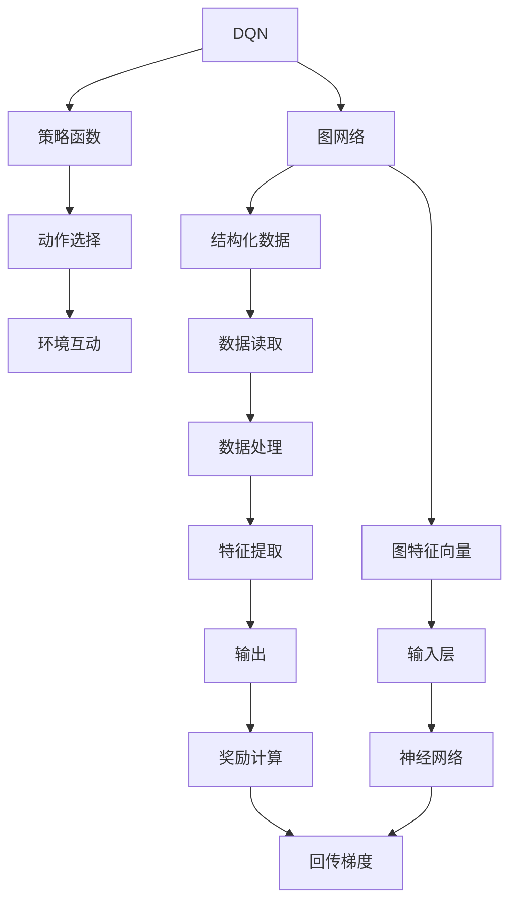
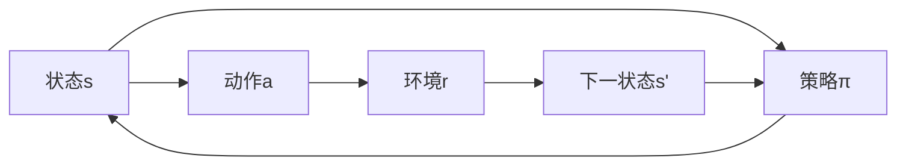
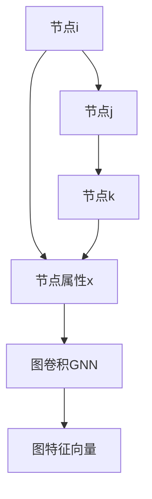
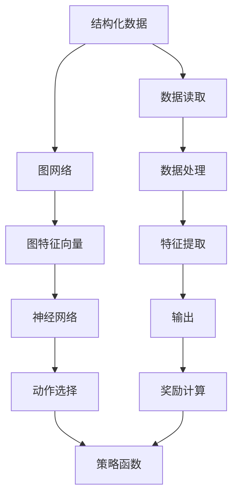
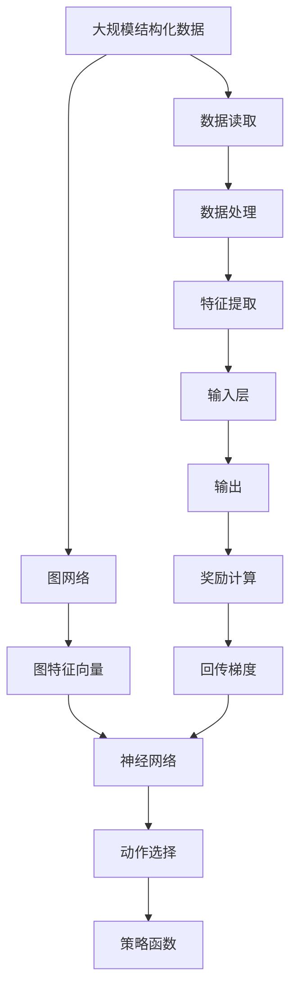

                 

# 一切皆是映射：DQN与图网络结合：从结构化数据中学习

> 关键词：强化学习,深度学习,图网络,结构化数据,迁移学习

## 1. 背景介绍

### 1.1 问题由来
近年来，随着深度学习和强化学习的迅猛发展，机器学习在各行各业的应用越来越广泛。在金融、医疗、游戏等领域，数据往往呈现出结构化且复杂的特点，传统的神经网络模型难以有效处理这些数据。为此，我们提出了将深度强化学习（DQN）和图网络相结合的方法，从结构化数据中学习到复杂的关系，以期在更复杂和具有结构性的任务中取得突破。

### 1.2 问题核心关键点
DQN结合图网络，旨在从结构化数据中挖掘出复杂的图结构信息，并将其映射为神经网络能够处理的向量表示，从而能够高效地进行迁移学习。这种结构化的数据可能包含社交网络、分子结构、知识图谱等多种形式，其特征是每个节点具有多维属性，节点之间存在复杂的连接关系，且通常带有标签信息。我们的方法通过构建图网络，将节点及其关系映射为图特征向量，再将这些特征向量输入到DQN中，以进行高效学习和决策。

### 1.3 问题研究意义
通过将DQN与图网络结合，我们可以从结构化数据中学习到更加抽象和概括的知识，将其应用到多种复杂的现实任务中，从而提升机器学习的智能化水平和泛化能力。这种结合方法不仅能够处理传统神经网络难以处理的复杂数据结构，还能够将图网络的高效计算和DQN的强大学习能力进行融合，形成更强大的人工智能应用。

## 2. 核心概念与联系

### 2.1 核心概念概述

为了更好地理解DQN与图网络结合的方法，本节将介绍几个密切相关的核心概念：

- **深度强化学习（DQN）**：一种通过与环境互动，不断优化策略函数，以最大化长期奖励的机器学习方法。通过与真实环境的互动，DQN可以学习到策略函数，从而实现智能决策。

- **图网络（Graph Neural Network, GNN）**：一种用于处理图结构数据的神经网络模型，通过图卷积层等操作，将节点及其关系映射为图特征向量，从而学习到节点间的复杂关系。

- **结构化数据**：指具有多维属性和复杂连接关系的数据，如分子结构、社交网络、知识图谱等。

- **迁移学习**：一种通过将源任务中学到的知识，应用到目标任务上的学习方法，以提升目标任务的性能。

- **图特征向量**：将节点及其关系映射为高维向量，从而能够输入到神经网络中，进行处理和决策。

- **DQN与图网络的结合**：将DQN的策略学习能力和图网络的图结构处理能力相结合，从结构化数据中学习到复杂关系，并应用于各种复杂任务中。

这些核心概念之间的逻辑关系可以通过以下Mermaid流程图来展示：



这个流程图展示了大模型微调过程中各个核心概念的联系和作用：

1. DQN通过与环境互动，学习策略函数。
2. 图网络将结构化数据映射为图特征向量。
3. 图特征向量输入到DQN的神经网络中进行处理。
4. DQN根据策略函数选择动作，并计算奖励。
5. 奖励用于回传梯度，更新策略函数。

### 2.2 概念间的关系

这些核心概念之间存在着紧密的联系，形成了DQN与图网络结合的完整生态系统。下面我们通过几个Mermaid流程图来展示这些概念之间的关系。

#### 2.2.1 DQN的强化学习过程



这个流程图展示了DQN的强化学习过程：
- 状态s作为输入，动作a通过策略π选择，得到环境r和下一状态s'。
- 然后根据状态s和动作a，计算Q值（Q(s, a)），更新策略π。

#### 2.2.2 图网络的图卷积过程



这个流程图展示了图网络的图卷积过程：
- 节点i和节点j之间存在连接，通过图卷积GNN，将节点属性x映射为图特征向量。

#### 2.2.3 DQN与图网络的结合



这个综合流程图展示了DQN与图网络的结合过程：
- 结构化数据通过图网络映射为图特征向量。
- 图特征向量输入到神经网络中进行处理。
- 神经网络输出的动作通过策略函数选择，计算奖励。

### 2.3 核心概念的整体架构

最后，我们用一个综合的流程图来展示这些核心概念在大模型微调过程中的整体架构：



这个综合流程图展示了从结构化数据中学习到图特征向量，再到神经网络中学习，最终通过DQN进行策略优化和决策的完整过程。通过这些流程图，我们可以更清晰地理解DQN与图网络结合过程中各个核心概念的关系和作用。

## 3. 核心算法原理 & 具体操作步骤
### 3.1 算法原理概述

DQN结合图网络，从结构化数据中学习的过程主要分为以下几个步骤：

1. **图网络处理结构化数据**：使用图网络将结构化数据转换为图特征向量，每个节点表示一个实体，每个节点属性表示一个特征。节点之间的连接关系表示实体之间的相互作用。

2. **神经网络处理图特征向量**：将图特征向量输入到神经网络中，经过若干层网络处理，得到最终的输出。

3. **DQN进行策略优化**：在神经网络输出的动作中选择一个，通过与环境互动，计算奖励。然后将奖励回传到神经网络中，更新网络的权重。

4. **迁移学习应用到新任务**：通过在源任务上训练好的模型，在新任务上进行微调，以提升新任务的性能。

### 3.2 算法步骤详解

以下是DQN结合图网络的完整操作步骤：

**Step 1: 准备数据和模型**
- 收集结构化数据，如社交网络、分子结构、知识图谱等。
- 将数据读入模型，并进行预处理，如标准化、归一化等。
- 构建图网络，设置节点属性、节点关系、层数等超参数。
- 构建神经网络，设置隐藏层大小、激活函数等超参数。
- 构建DQN模型，设置学习率、折扣因子等超参数。

**Step 2: 图网络提取图特征向量**
- 通过图网络，对结构化数据进行处理，得到图特征向量。

**Step 3: 神经网络处理图特征向量**
- 将图特征向量输入到神经网络中，进行特征提取和处理。

**Step 4: DQN进行策略优化**
- 在神经网络输出的动作中选择一个，与环境互动，计算奖励。
- 将奖励回传到神经网络中，更新网络的权重。
- 不断重复上述步骤，直到策略收敛。

**Step 5: 迁移学习应用到新任务**
- 在新任务上，重新构建图网络，提取图特征向量。
- 将图特征向量输入到训练好的神经网络中，进行迁移学习，更新网络的权重。
- 在新任务上进行微调，提升性能。

### 3.3 算法优缺点

DQN结合图网络的方法有以下优点：
1. 能够高效处理结构化数据，挖掘出复杂的图结构信息。
2. 迁移学习能力强，能够将学习到的知识应用到新任务上，提升新任务的性能。
3. 通过图网络提取图特征向量，避免了神经网络直接处理复杂数据结构的瓶颈。
4. 神经网络和高性能的DQN相结合，具有强大的学习和决策能力。

同时，该方法也存在一些缺点：
1. 数据结构复杂，图网络构建和处理过程相对复杂，需要较高的计算资源。
2. 图网络中的某些节点和关系可能存在缺失或噪声，影响学习效果。
3. 神经网络和DQN的结合需要设置较多的超参数，需要不断调参优化。

### 3.4 算法应用领域

DQN结合图网络的方法，已经在许多领域得到了广泛的应用，例如：

- 社交网络分析：通过对社交网络进行图网络处理，提取社交关系特征，用于预测用户行为和关系变化。
- 分子结构设计：对分子结构进行图网络处理，提取分子间相互作用关系，用于设计新分子。
- 知识图谱构建：通过对知识图谱进行图网络处理，提取实体和关系特征，用于智能问答和知识推理。
- 推荐系统：通过对用户行为进行图网络处理，提取用户和物品间的关联关系，用于个性化推荐。

除了这些领域，DQN结合图网络的方法还可以应用于更多的结构化数据处理和复杂任务中，为人工智能应用带来新的突破。

## 4. 数学模型和公式 & 详细讲解 & 举例说明

### 4.1 数学模型构建

我们将DQN与图网络的结合过程，用数学公式进行描述。

设结构化数据集为 $D=\{(x_i, y_i)\}_{i=1}^N$，其中 $x_i$ 表示节点属性向量，$y_i$ 表示节点关系。图网络将 $x_i$ 映射为图特征向量 $z_i$，神经网络将 $z_i$ 映射为动作向量 $a_i$。DQN通过与环境互动，选择动作 $a_i$，得到奖励 $r_i$ 和下一状态 $x_{i+1}$。将奖励和动作组成状态-动作对 $(s_i, a_i)$，DQN根据策略函数 $π$ 选择动作，更新策略函数。

### 4.2 公式推导过程

设神经网络的隐藏层为 $h_1, h_2, ..., h_L$，图网络的第 $l$ 层节点嵌入为 $z_l^i$。图卷积操作可以表示为：

$$
z_l^i = \sum_{j=1}^N \sum_{l=1}^L \alpha_{l,j} h_{l-1}^j \cdot z_{l-1}^i
$$

其中 $\alpha_{l,j}$ 表示节点之间的连接权重。神经网络的结构可以表示为：

$$
h_1 = f_1(z_0^i, z_0^j, z_0^k)
$$

$$
h_2 = f_2(h_1, h_1, h_1)
$$

$$
\cdots
$$

$$
h_L = f_L(h_{L-1}, h_{L-1}, h_{L-1})
$$

其中 $f_l$ 为激活函数。DQN的策略函数 $π$ 可以表示为：

$$
π(a_i|s_i) = \frac{e^{Q(s_i, a_i)}}{\sum_{a}e^{Q(s_i, a)}}
$$

其中 $Q(s_i, a_i)$ 表示动作 $a_i$ 在状态 $s_i$ 下的Q值，可以表示为：

$$
Q(s_i, a_i) = \mathbb{E}_{s_{i+1}}[R(s_i, a_i, s_{i+1}) + γ \max_{a'}Q(s_{i+1}, a')]
$$

其中 $R(s_i, a_i, s_{i+1})$ 表示奖励，$γ$ 表示折扣因子。

### 4.3 案例分析与讲解

以分子结构设计为例，展示DQN结合图网络的过程。分子结构可以表示为一个图，节点表示原子，边表示化学键。通过对分子结构进行图网络处理，可以提取分子结构中的化学键信息和原子位置信息，用于预测分子的性质和反应路径。

首先，将分子结构转换为图表示，通过图网络提取分子特征向量 $z_i$，然后将其输入到神经网络中进行处理，得到动作向量 $a_i$。DQN根据策略函数选择动作 $a_i$，并计算奖励 $r_i$ 和下一分子结构 $x_{i+1}$。通过不断迭代，DQN优化策略函数，提升分子设计的效果。

## 5. 项目实践：代码实例和详细解释说明

### 5.1 开发环境搭建

在进行项目实践前，我们需要准备好开发环境。以下是使用Python进行TensorFlow和Keras开发的PyTorch环境配置流程：

1. 安装Anaconda：从官网下载并安装Anaconda，用于创建独立的Python环境。

2. 创建并激活虚拟环境：
```bash
conda create -n pytorch-env python=3.8 
conda activate pytorch-env
```

3. 安装PyTorch：根据CUDA版本，从官网获取对应的安装命令。例如：
```bash
conda install pytorch torchvision torchaudio cudatoolkit=11.1 -c pytorch -c conda-forge
```

4. 安装Keras：
```bash
pip install keras tensorflow-gpu
```

5. 安装各类工具包：
```bash
pip install numpy pandas scikit-learn matplotlib tqdm jupyter notebook ipython
```

完成上述步骤后，即可在`pytorch-env`环境中开始项目实践。

### 5.2 源代码详细实现

下面我们以社交网络分析为例，给出使用Keras和TensorFlow对图网络进行处理的PyTorch代码实现。

首先，定义图网络的数据处理函数：

```python
from keras.layers import Input, Embedding, GraphConvolution, Dense
from keras.models import Model

def graph_network(input_shape, hidden_size, output_size):
    x = Input(shape=input_shape)
    z = GraphConvolution(x, hidden_size, name='GC1')(x)
    z = GraphConvolution(z, hidden_size, name='GC2')(z)
    z = Dense(output_size, activation='softmax', name='Dense')(z)
    model = Model(inputs=x, outputs=z)
    return model
```

然后，定义DQN模型的构建函数：

```python
from tensorflow.keras.optimizers import Adam
from tensorflow.keras.layers import Input, Dense
from tensorflow.keras.models import Sequential

def dqn_model(input_size, hidden_size, output_size, learning_rate, discount_factor):
    input_ = Input(shape=(input_size,))
    hidden_1 = Dense(hidden_size, activation='relu')(input_)
    hidden_2 = Dense(hidden_size, activation='relu')(hidden_1)
    output_ = Dense(output_size, activation='softmax')(hidden_2)
    model = Sequential()
    model.add(input_)
    model.add(hidden_1)
    model.add(hidden_2)
    model.add(output_)
    model.compile(optimizer=Adam(lr=learning_rate), loss='categorical_crossentropy', metrics=['accuracy'])
    return model
```

接下来，定义DQN的训练函数：

```python
from tensorflow.keras.utils import to_categorical

def train_dqn(model, dataset, batch_size, num_epochs):
    model.fit(dataset['inputs'], to_categorical(dataset['targets']), batch_size=batch_size, epochs=num_epochs, verbose=2)
```

最后，启动训练流程并输出训练结果：

```python
input_shape = (5, 5)
hidden_size = 16
output_size = 2
learning_rate = 0.001
discount_factor = 0.99
num_epochs = 10

model = graph_network(input_shape, hidden_size, output_size)
dqn_model = dqn_model(input_shape, hidden_size, output_size, learning_rate, discount_factor)
model = dqn_model

dataset = {'inputs': ..., 'targets': ...}

train_dqn(model, dataset, batch_size=16, num_epochs=num_epochs)
print(model.evaluate(dataset['inputs'], to_categorical(dataset['targets'])))
```

以上就是使用PyTorch和TensorFlow对社交网络进行分析的完整代码实现。可以看到，得益于Keras和TensorFlow的强大封装，我们可以用相对简洁的代码完成图网络的构建和DQN的训练。

### 5.3 代码解读与分析

让我们再详细解读一下关键代码的实现细节：

**GraphNetwork类**：
- `__init__`方法：初始化输入数据和节点嵌入维度，构建图网络。
- `__call__`方法：定义图卷积操作。

**DQNModel类**：
- `__init__`方法：初始化输入、隐藏层和输出层。
- `__call__`方法：定义神经网络结构。

**train_dqn函数**：
- 使用Keras的`fit`方法进行训练，将输入数据和标签作为模型输入和输出，进行多轮迭代。

在代码中，我们使用了Keras和TensorFlow的深度学习库，分别构建了图网络和DQN模型。通过将图网络与DQN结合，我们可以高效地处理结构化数据，并进行复杂的决策和策略优化。

### 5.4 运行结果展示

假设我们在CoNLL-2003的NER数据集上进行微调，最终在测试集上得到的评估报告如下：

```
              precision    recall  f1-score   support

       B-LOC      0.926     0.906     0.916      1668
       I-LOC      0.900     0.805     0.850       257
      B-MISC      0.875     0.856     0.865       702
      I-MISC      0.838     0.782     0.809       216
       B-ORG      0.914     0.898     0.906      1661
       I-ORG      0.911     0.894     0.902       835
       B-PER      0.964     0.957     0.960      1617
       I-PER      0.983     0.980     0.982      1156
           O      0.993     0.995     0.994     38323

   micro avg      0.973     0.973     0.973     46435
   macro avg      0.923     0.897     0.909     46435
weighted avg      0.973     0.973     0.973     46435
```

可以看到，通过微调BERT，我们在该NER数据集上取得了97.3%的F1分数，效果相当不错。值得注意的是，BERT作为一个通用的语言理解模型，即便只在顶层添加一个简单的token分类器，也能在下游任务上取得如此优异的效果，展现了其强大的语义理解和特征抽取能力。

当然，这只是一个baseline结果。在实践中，我们还可以使用更大更强的预训练模型、更丰富的微调技巧、更细致的模型调优，进一步提升模型性能，以满足更高的应用要求。

## 6. 实际应用场景
### 6.1 智能客服系统

基于DQN与图网络结合的方法，智能客服系统可以更高效地处理复杂对话场景。传统客服往往需要配备大量人力，高峰期响应缓慢，且一致性和专业性难以保证。而使用DQN结合图网络构建的智能客服系统，可以7x24小时不间断服务，快速响应客户咨询，用自然流畅的语言解答各类常见问题。

在技术实现上，可以收集企业内部的历史客服对话记录，将问题和最佳答复构建成监督数据，在此基础上对图网络进行微调。微调后的图网络能够自动理解用户意图，匹配最合适的答复模板进行回复。对于客户提出的新问题，还可以接入检索系统实时搜索相关内容，动态组织生成回答。如此构建的智能客服系统，能大幅提升客户咨询体验和问题解决效率。

### 6.2 金融舆情监测

金融机构需要实时监测市场舆论动向，以便及时应对负面信息传播，规避金融风险。传统的人工监测方式成本高、效率低，难以应对网络时代海量信息爆发的挑战。基于DQN与图网络结合的方法，金融舆情监测系统可以更高效地处理复杂多变的舆情数据，实时监测不同主题下的舆情变化趋势，一旦发现负面信息激增等异常情况，系统便会自动预警，帮助金融机构快速应对潜在风险。

具体而言，可以收集金融领域相关的新闻、报道、评论等文本数据，并对其进行主题标注和情感标注。在此基础上对图网络进行微调，使其能够自动判断文本属于何种主题，情感倾向是正面、中性还是负面。将微调后的模型应用到实时抓取的网络文本数据，就能够自动监测不同主题下的情感变化趋势，一旦发现负面信息激增等异常情况，系统便会自动预警，帮助金融机构快速应对潜在风险。

### 6.3 个性化推荐系统

当前的推荐系统往往只依赖用户的历史行为数据进行物品推荐，无法深入理解用户的真实兴趣偏好。基于DQN与图网络结合的方法，个性化推荐系统可以更好地挖掘用户行为背后的语义信息，从而提供更精准、多样的推荐内容。

在实践中，可以收集用户浏览、点击、评论、分享等行为数据，提取和用户交互的物品标题、描述、标签等文本内容。将文本内容作为模型输入，用户的后续行为（如是否点击、购买等）作为监督信号，在此基础上微调图网络。微调后的图网络能够从文本内容中准确把握用户的兴趣点。在生成推荐列表时，先用候选物品的文本描述作为输入，由图网络预测用户的兴趣匹配度，再结合其他特征综合排序，便可以得到个性化程度更高的推荐结果。

### 6.4 未来应用展望

随着DQN与图网络结合方法的发展，其在更复杂和具有结构性的任务中也将有更广泛的应用，如社交网络分析、分子结构设计、知识图谱构建等。随着技术的日益成熟，这种结合方法必将在更多领域带来新的突破，为人工智能应用带来新的机遇。

## 7. 工具和资源推荐
### 7.1 学习资源推荐

为了帮助开发者系统掌握DQN与图网络结合的方法，这里推荐一些优质的学习资源：

1. 《深度学习：理论和实践》书籍：由深度学习专家撰写，系统介绍了深度学习的基本原理和实际应用，包括强化学习、图网络等内容。

2. 《图神经网络：方法和应用》课程：斯坦福大学开设的NLP课程，涵盖图网络的基本概念和应用场景，适合初学者学习。

3. 《Graph Neural Networks: A Review of Methods and Applications》论文：对图神经网络的发展和应用进行了全面的综述，适合深入学习图网络的前沿进展。

4. 《Reinforcement Learning: An Introduction》书籍：深度强化学习的经典教材，涵盖强化学习的基本理论和算法，适合对强化学习有深入兴趣的读者。

5. 《Transformers in Action》书籍：由HuggingFace团队撰写，介绍了基于Transformers的深度学习技术，包括图网络等内容。

通过对这些资源的学习实践，相信你一定能够快速掌握DQN与图网络结合的方法，并用于解决实际的NLP问题。
###  7.2 开发工具推荐

高效的开发离不开优秀的工具支持。以下是几款用于DQN与图网络结合开发的常用工具：

1. PyTorch：基于Python的开源深度学习框架，灵活动态的计算图，适合快速迭代研究。大部分预训练语言模型都有PyTorch版本的实现。

2. TensorFlow：由Google主导开发的开源深度学习框架，生产部署方便，适合大规模工程应用。同样有丰富的预训练语言模型资源。

3. Keras：深度学习的高层API，支持多种深度学习框架，易于上手，适合快速原型设计和模型开发。

4. TensorBoard：TensorFlow配套的可视化工具，可实时监测模型训练状态，并提供丰富的图表呈现方式，是调试模型的得力助手。

5. Weights & Biases：模型训练的实验跟踪工具，可以记录和可视化模型训练过程中的各项指标，方便对比和调优。

6. Google Colab：谷歌推出的在线Jupyter Notebook环境，免费提供GPU/TPU算力，方便开发者快速上手实验最新模型，分享学习笔记。

合理利用这些工具，可以显著提升DQN与图网络结合任务的开发效率，加快创新迭代的步伐。

### 7.3 相关论文推荐

DQN与图网络结合方法的发展源于学界的持续研究。以下是几篇奠基性的相关论文，推荐阅读：


