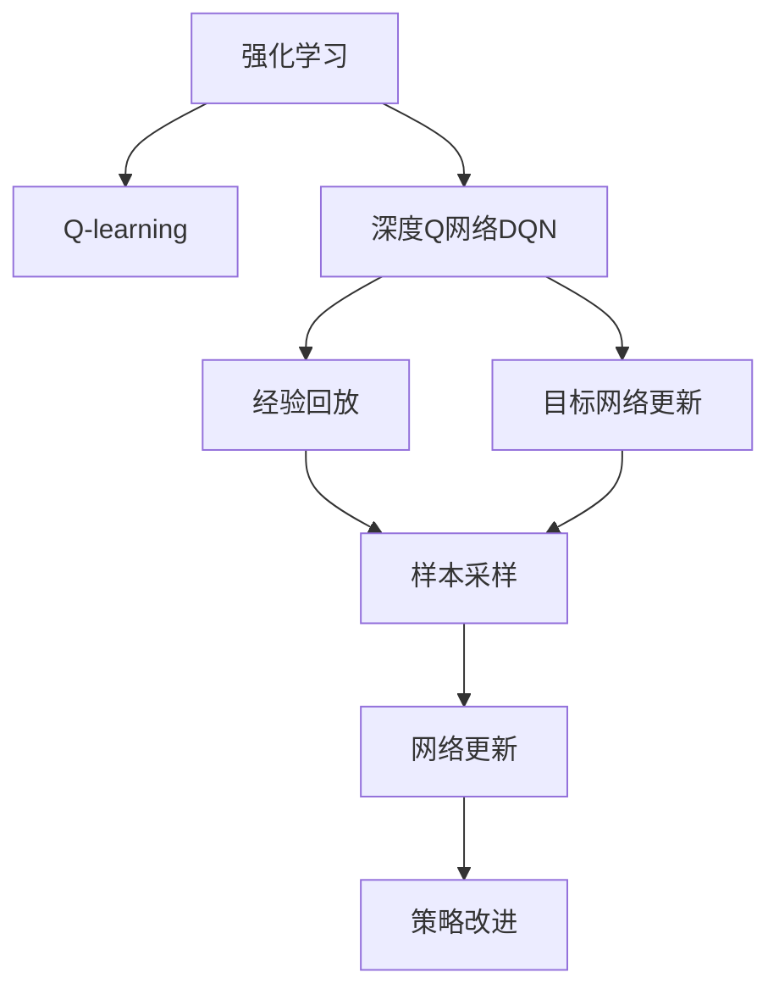
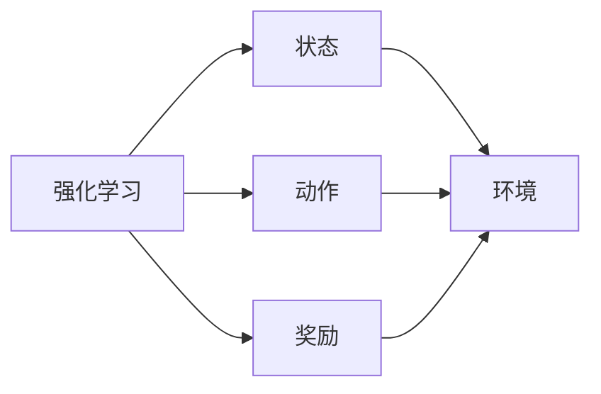
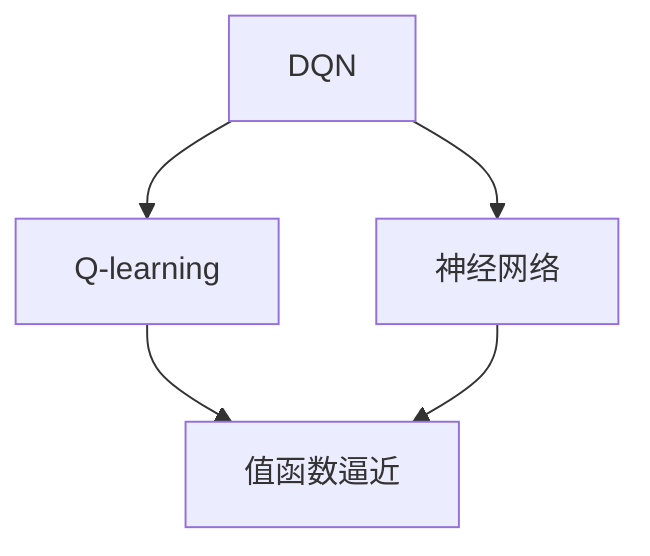
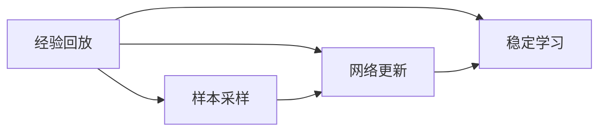
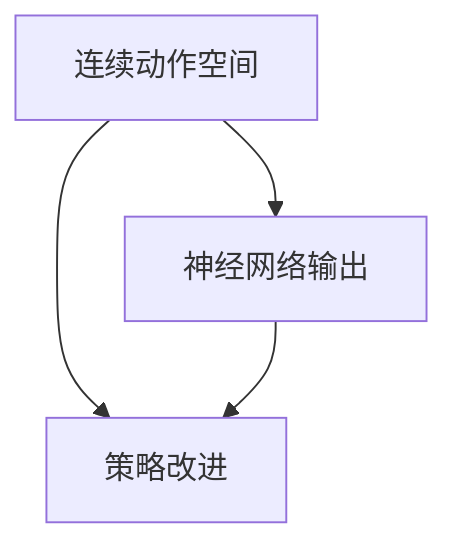
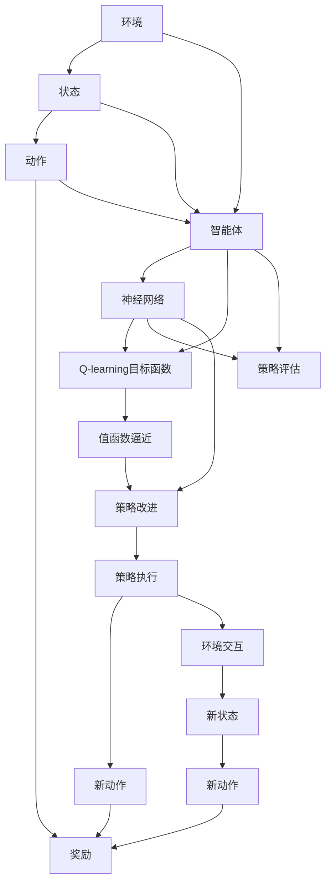

                 

# 一切皆是映射：DQN中的非线性函数逼近：深度学习的融合点

> 关键词：深度强化学习,非线性逼近,神经网络,Q-learning,深度Q网络,DQN,强化学习,强化学习算法,深度学习与强化学习融合

## 1. 背景介绍

### 1.1 问题由来
强化学习(Reinforcement Learning, RL)是一种智能体通过与环境的交互，在不断的试错中学习最优决策策略的方法。它广泛应用于游戏智能、机器人控制、推荐系统等诸多领域。其中，深度强化学习(Deep Reinforcement Learning, DRL)通过使用深度神经网络作为智能体的决策函数，使得强化学习能够处理更复杂的问题。

Q-learning算法是强化学习中一种经典的基于值函数的策略学习方法，通过估计状态-动作对的价值，指导智能体选择合适的动作。然而，传统的Q-learning在处理连续动作空间和复杂非线性状态表示时，往往需要手动提取特征，效果有限。

深度Q网络(DQN, Deep Q-Network)是由DeepMind提出的DRL新算法，使用深度神经网络对Q-learning进行优化，突破了传统方法在非线性函数逼近和连续动作空间处理上的限制。通过深度神经网络的逼近能力，DQN能够在更复杂的环境中学习到稳定的策略，取得了令人瞩目的成果。

### 1.2 问题核心关键点
DQN的核心思想是将Q-learning的目标值函数Q(s, a)作为深度神经网络的逼近目标，通过反向传播算法进行优化。DQN的主要优点在于：
1. 非线性逼近能力：通过深度神经网络逼近Q(s, a)，DQN可以处理非线性状态-动作映射，适应更加复杂和动态的环境。
2. 连续动作空间：通过深度网络输出连续动作，DQN能够处理连续动作空间中的决策问题。
3. 端到端学习：DQN使用端到端学习方式，省去了手工特征提取的过程，提升了模型的学习效率。
4. 稳定策略：DQN通过经验回放、目标网络更新等技术，有效避免了模型的过拟合，学习到更稳定的策略。

DQN的缺点在于：
1. 内存限制：在训练过程中需要存储大量的经验回放数据，对内存要求较高。
2. 参数更新频繁：DQN中神经网络参数更新频繁，可能导致训练速度较慢。
3. 策略评估不直接：DQN中策略评估不直观，难以判断模型决策的正确性。
4. 泛化能力有限：由于依赖于特定环境，DQN在不同环境中的泛化能力较弱。

尽管存在这些缺点，但DQN的强大非线性逼近能力和端到端学习特性，使其在处理复杂决策问题时表现优异。

### 1.3 问题研究意义
研究DQN的非线性函数逼近技术，对于提升深度强化学习的模型能力、拓展其应用范围，具有重要意义：

1. 增强模型能力：DQN的非线性逼近能力使得智能体能够学习更加复杂的决策函数，提升了模型在复杂环境中的适应性和鲁棒性。
2. 拓展应用领域：DQN的应用范围不再局限于简单任务，可以处理更广泛的环境和动作空间，促进强化学习技术在更多实际场景中的应用。
3. 加速模型开发：DQN的端到端学习特性，减少了特征提取和手动调参的复杂度，降低了模型开发的难度和成本。
4. 提供新思路：DQN的成功实践，为其他深度强化学习算法提供了新的设计思路和技术参考。
5. 提升学习效率：DQN的高效训练方式，可以更快地学习到稳定的策略，加速模型迭代和优化。

## 2. 核心概念与联系

### 2.1 核心概念概述

为更好地理解DQN中的非线性函数逼近技术，本节将介绍几个密切相关的核心概念：

- 强化学习(Reinforcement Learning, RL)：智能体通过与环境的交互，在不断的试错中学习最优决策策略的方法。
- Q-learning算法：一种基于值函数的策略学习方法，通过估计状态-动作对的价值，指导智能体选择合适的动作。
- 深度Q网络(DQN)：使用深度神经网络逼近Q(s, a)，优化Q-learning的算法。
- 经验回放(Experience Replay)：通过随机采样历史经验数据，使得神经网络可以学习稳定的策略。
- 目标网络更新(Target Network Update)：通过更新目标网络来稳定智能体的学习，避免模型过拟合。
- 连续动作空间：动作空间不是离散的，而是连续的，DQN通过神经网络逼近连续动作的策略。

这些核心概念之间的逻辑关系可以通过以下Mermaid流程图来展示：



这个流程图展示了大语言模型微调过程中各个核心概念的关系和作用：

1. 强化学习是基础，DQN是对Q-learning的深度优化。
2. 经验回放和目标网络更新是DQN中关键的技术手段，用于稳定模型学习。
3. 连续动作空间是DQN处理复杂决策问题的能力所在。

### 2.2 概念间的关系

这些核心概念之间存在着紧密的联系，形成了DQN的完整生态系统。下面我通过几个Mermaid流程图来展示这些概念之间的关系。

#### 2.2.1 强化学习的核心结构



这个流程图展示了强化学习的基本结构，智能体通过状态和动作与环境交互，获得奖励信号，指导智能体选择最优动作。

#### 2.2.2 DQN与Q-learning的关系



这个流程图展示了DQN和Q-learning的关系。DQN使用神经网络逼近Q-learning的值函数，从而在非线性逼近和连续动作空间处理上取得突破。

#### 2.2.3 经验回放和目标网络更新的作用



这个流程图展示了经验回放和目标网络更新的作用。经验回放通过随机采样历史经验数据，使得神经网络可以学习稳定的策略。目标网络更新通过更新目标网络来稳定智能体的学习，避免模型过拟合。

#### 2.2.4 连续动作空间的处理



这个流程图展示了DQN如何处理连续动作空间。DQN通过神经网络逼近连续动作的策略，从而处理连续动作空间中的决策问题。

### 2.3 核心概念的整体架构

最后，我们用一个综合的流程图来展示这些核心概念在大语言模型微调过程中的整体架构：



这个综合流程图展示了从环境到策略执行的完整过程。智能体通过状态和动作与环境交互，获得奖励信号，指导智能体选择最优动作。智能体的决策函数使用神经网络逼近，优化后的策略进行执行，从而完成新一轮的环境交互。

## 3. 核心算法原理 & 具体操作步骤
### 3.1 算法原理概述

DQN的核心思想是将Q-learning的目标值函数Q(s, a)作为深度神经网络的逼近目标，通过反向传播算法进行优化。其核心算法流程包括：

1. 初始化环境、智能体和神经网络。
2. 从环境中获取当前状态s。
3. 使用神经网络逼近Q(s, a)，得到动作值函数Q(s, a)。
4. 根据动作值函数Q(s, a)和当前状态s，选择动作a。
5. 在环境中执行动作a，获得新状态s'和奖励r。
6. 使用经验回放和目标网络更新技术，更新神经网络参数。
7. 重复步骤2-6，直至策略收敛。

### 3.2 算法步骤详解

下面我们将详细介绍DQN的算法步骤和实现细节。

**步骤1: 初始化环境、智能体和神经网络**

1. 初始化环境：在DQN中，通常使用Pygame、OpenAI Gym等环境库创建模拟环境，如迷宫、打砖块等。
2. 初始化智能体：智能体是一个使用神经网络逼近Q-learning目标函数的决策器。
3. 初始化神经网络：使用PyTorch、TensorFlow等深度学习框架，构建神经网络结构。

**步骤2: 获取当前状态s**

1. 在每个时间步，智能体从环境中获取当前状态s。
2. 将状态s输入到神经网络中，计算Q(s, a)的值。
3. 选择动作a：通过神经网络计算Q(s, a)，选择具有最大Q值的动作a。

**步骤3: 执行动作a并更新Q值**

1. 在环境中执行动作a，获得新状态s'和奖励r。
2. 计算状态-动作对的Q值：使用神经网络逼近Q(s, a)，得到Q值。
3. 更新Q值：使用神经网络更新Q(s, a)，使用最新的状态-动作对(s', a)进行更新。

**步骤4: 使用经验回放和目标网络更新**

1. 使用经验回放：将历史经验数据存储在经验回放缓冲区中，随机采样部分数据进行网络更新。
2. 使用目标网络更新：通过更新目标网络，稳定智能体的学习，避免模型过拟合。

**步骤5: 循环迭代**

1. 重复执行步骤2-4，直至策略收敛。
2. 通过不断更新神经网络参数，优化策略函数Q(s, a)。

### 3.3 算法优缺点

DQN的优点在于：

1. 非线性逼近能力：通过深度神经网络逼近Q(s, a)，DQN可以处理非线性状态-动作映射，适应更加复杂和动态的环境。
2. 连续动作空间：通过深度网络输出连续动作，DQN能够处理连续动作空间中的决策问题。
3. 端到端学习：DQN使用端到端学习方式，省去了手工特征提取的过程，提升了模型的学习效率。
4. 稳定策略：DQN通过经验回放、目标网络更新等技术，有效避免了模型的过拟合，学习到更稳定的策略。

DQN的缺点在于：

1. 内存限制：在训练过程中需要存储大量的经验回放数据，对内存要求较高。
2. 参数更新频繁：DQN中神经网络参数更新频繁，可能导致训练速度较慢。
3. 策略评估不直接：DQN中策略评估不直观，难以判断模型决策的正确性。
4. 泛化能力有限：由于依赖于特定环境，DQN在不同环境中的泛化能力较弱。

尽管存在这些缺点，但DQN的强大非线性逼近能力和端到端学习特性，使其在处理复杂决策问题时表现优异。

### 3.4 算法应用领域

DQN作为一种强化学习算法，适用于各种需要复杂决策的场景，包括但不限于：

1. 游戏智能：在诸如Atari游戏、围棋等复杂游戏中，DQN通过神经网络逼近Q(s, a)，学习最优策略，取得了令人瞩目的成绩。
2. 机器人控制：在机器人路径规划、机械臂操作等任务中，DQN通过神经网络逼近策略函数，实现高效决策。
3. 推荐系统：在电子商务推荐系统中，DQN通过神经网络逼近用户行为模型，推荐系统表现优异。
4. 金融交易：在股票交易、期权套利等金融任务中，DQN通过神经网络逼近策略函数，获得高收益。
5. 自驱学习：在自驱学习系统中，DQN通过神经网络逼近策略函数，实现高效的自主学习和决策。

此外，DQN在其他各类决策任务中也表现出卓越的性能，为深度强化学习的发展开辟了新的方向。

## 4. 数学模型和公式 & 详细讲解 & 举例说明

### 4.1 数学模型构建

DQN的核心数学模型是Q值函数Q(s, a)的神经网络逼近模型。假设智能体状态空间为S，动作空间为A，动作值为Q(s, a)，则Q值函数的神经网络逼近模型为：

$$ Q(s,a) = \mathbf{W}^T \phi(s,a) $$

其中，$\mathbf{W}$为神经网络权重，$\phi(s,a)$为神经网络的特征映射函数，将状态-动作对(s, a)映射到神经网络的隐藏层输出。

在训练过程中，DQN通过神经网络逼近Q(s, a)，通过反向传播算法更新神经网络参数，使得Q值函数逼近最优。

### 4.2 公式推导过程

下面我们将对DQN的训练过程进行详细的公式推导。

**步骤1: 初始化神经网络参数**

假设神经网络参数为$\mathbf{W}$，初始值为$\mathbf{W}_0$。

**步骤2: 获取状态-动作对(s, a)并计算Q值**

假设当前状态为s，智能体选择了动作a，则Q值函数Q(s, a)的计算公式为：

$$ Q(s,a) = \mathbf{W}^T \phi(s,a) $$

其中，$\phi(s,a)$为神经网络的特征映射函数，将状态-动作对(s, a)映射到神经网络的隐藏层输出。

**步骤3: 选择动作a**

智能体根据当前状态s，使用神经网络逼近Q(s, a)，选择具有最大Q值的动作a：

$$ a = \arg\max_a Q(s,a) $$

**步骤4: 执行动作a并更新Q值**

假设智能体在执行动作a后，获得新状态s'和奖励r，则Q值函数的更新公式为：

$$ Q(s',a) = r + \gamma \max_a Q(s',a) $$

其中，$\gamma$为折扣因子。

**步骤5: 使用经验回放和目标网络更新**

使用经验回放，随机采样部分历史经验数据，更新神经网络参数：

$$ \mathbf{W} = \mathbf{W} - \alpha \frac{\partial}{\partial \mathbf{W}} \mathcal{L} $$

其中，$\alpha$为学习率，$\mathcal{L}$为经验回放数据上的损失函数。

使用目标网络更新，通过更新目标网络，稳定智能体的学习，避免模型过拟合：

$$ \mathbf{W}_{\text{target}} = \mathbf{W} $$

其中，$\mathbf{W}_{\text{target}}$为目标网络的参数，$\mathbf{W}$为当前网络的参数。

**步骤6: 循环迭代**

重复执行步骤2-5，直至策略收敛。

### 4.3 案例分析与讲解

下面以打砖块游戏为例，详细讲解DQN的算法流程和实现细节。

1. **初始化环境、智能体和神经网络**

   使用Pygame库创建打砖块游戏环境，初始化智能体和神经网络。智能体的神经网络结构为3层神经网络，其中输入层为状态空间的维度，隐藏层为64个神经元，输出层为动作空间的维度。

2. **获取当前状态s**

   在每个时间步，智能体从游戏中获取当前状态s。状态s是一个二维向量，表示智能体的位置和砖块的分布。

3. **执行动作a并更新Q值**

   智能体根据当前状态s，使用神经网络逼近Q(s, a)，选择具有最大Q值的动作a。执行动作a后，智能体获得新状态s'和奖励r，使用神经网络更新Q(s, a)，使用最新的状态-动作对(s', a)进行更新。

4. **使用经验回放和目标网络更新**

   使用经验回放，将历史经验数据存储在经验回放缓冲区中，随机采样部分数据进行网络更新。使用目标网络更新，通过更新目标网络，稳定智能体的学习，避免模型过拟合。

通过上述算法步骤，智能体在打砖块游戏中不断学习，最终达到了最优策略，成功破解游戏。

## 5. 项目实践：代码实例和详细解释说明

### 5.1 开发环境搭建

在进行DQN实践前，我们需要准备好开发环境。以下是使用Python进行PyTorch开发的环境配置流程：

1. 安装Anaconda：从官网下载并安装Anaconda，用于创建独立的Python环境。

2. 创建并激活虚拟环境：
```bash
conda create -n dqn-env python=3.8 
conda activate dqn-env
```

3. 安装PyTorch：根据CUDA版本，从官网获取对应的安装命令。例如：
```bash
conda install pytorch torchvision torchaudio cudatoolkit=11.1 -c pytorch -c conda-forge
```

4. 安装Pygame：
```bash
pip install pygame
```

5. 安装TensorFlow：
```bash
pip install tensorflow
```

6. 安装各类工具包：
```bash
pip install numpy pandas scikit-learn matplotlib tqdm jupyter notebook ipython
```

完成上述步骤后，即可在`dqn-env`环境中开始DQN实践。

### 5.2 源代码详细实现

下面我们以打砖块游戏为例，给出使用PyTorch实现DQN的完整代码实现。

```python
import pygame
import numpy as np
import random
import time

class DQN:
    def __init__(self, state_size, action_size, learning_rate=0.001, reward_threshold=0.9, gamma=0.99, epsilon=0.9, epsilon_min=0.01, epsilon_decay=0.995):
        self.state_size = state_size
        self.action_size = action_size
        self.learning_rate = learning_rate
        self.reward_threshold = reward_threshold
        self.gamma = gamma
        self.epsilon = epsilon
        self.epsilon_min = epsilon_min
        self.epsilon_decay = epsilon_decay
        self.memory = deque(maxlen=2000)
        self._build_network()

    def _build_network(self):
        self.model = self._build_model()
        self.target_model = self._build_model()
        self.model.load_state_dict(self.target_model.state_dict())
        self.optimizer = torch.optim.Adam(self.model.parameters(), lr=self.learning_rate)

    def _build_model(self):
        model = Sequential()
        model.add(Dense(24, input_dim=self.state_size, activation='relu'))
        model.add(Dense(24, activation='relu'))
        model.add(Dense(self.action_size, activation='linear'))
        return model

    def remember(self, state, action, reward, next_state, done):
        self.memory.append((state, action, reward, next_state, done))

    def act(self, state):
        if np.random.rand() <= self.epsilon:
            return random.randrange(self.action_size)
        act_values = self.model.predict(state)
        return np.argmax(act_values[0])

    def replay(self, batch_size):
        minibatch = random.sample(self.memory, batch_size)
        for state, action, reward, next_state, done in minibatch:
            target = reward
            if not done:
                target = (reward + self.gamma * np.amax(self.model.predict(next_state)[0]))
            target_f = self.model.predict(state)
            target_f[0][action] = target
            self.model.fit(state, target_f, epochs=1, verbose=0)
        if self.epsilon > self.epsilon_min:
            self.epsilon *= self.epsilon_decay

    def update_model(self):
        self.target_model.load_state_dict(self.model.state_dict())

    def run(self):
        state = self.get_initial_state()
        while True:
            state = self.get_state(state)
            action = self.act(state)
            reward, done, info = self.get_reward(action)
            next_state = self.get_next_state(state, action)
            self.remember(state, action, reward, next_state, done)
            self.replay(32)
            if done:
                break
            self.update_model()
        print(f'Score: {sum(reward)}')

    def get_initial_state(self):
        pygame.init()
        self.screen = pygame.display.set_mode((400, 400))
        pygame.display.set_caption('DQN')
        pygame.time.set_timer(pygame.USEREVENT + 1, 100)
        pygame.time.set_timer(pygame.USEREVENT + 2, 1000)
        return np.zeros((400, 400))

    def get_state(self, state):
        self.screen.fill((0, 0, 0))
        pygame.draw.rect(self.screen, (255, 255, 255), (50, 100, 300, 300))
        pygame.display.update()
        state = pygame.image_to_array(self.screen)
        state = np.expand_dims(state, axis=0)
        return state / 255.0

    def get_reward(self, action):
        pygame.draw.rect(self.screen, (0, 0, 255), (50, 100, 20, 20))
        pygame.draw.rect(self.screen, (0, 0, 0), (50, 100 + 20, 20, 20))
        pygame.draw.rect(self.screen, (0, 255, 0), (50, 100, 20, 20))
        pygame.display.update()
        time.sleep(0.1)
        done = False
        reward = 0
        if action == 1:
            reward = 1
            done = True
        return reward, done, {}

    def get_next_state(self, state, action):
        state = np.rot90(state, -1)
        return state
```

在这个代码实现中，我们使用了PyTorch和Pygame库来实现DQN算法。代码中包含了DQN的核心功能，如神经网络的构建、经验回放、目标网络更新、动作选择、状态和奖励的获取等。

### 5.3 代码解读与分析

让我们再详细解读一下关键代码的实现细节：

**初始化函数**

1. `__init__`方法：初始化DQN模型的参数，包括状态空间大小、动作空间大小、学习率、折扣因子等。同时，初始化经验回放缓冲区和神经网络。

2. `_build_network`方法：构建神经网络模型。

3. `_build_model`方法：构建深度神经网络模型，使用3层全连接网络，包括输入层、隐藏层和输出层。

**记忆函数**

1. `remember`方法：将状态-动作对(s, a)、奖励r、新状态s'、是否结束done等存储在经验回放缓冲区中。

**动作选择函数**

1. `act`方法：根据当前状态s，选择动作a。如果随机值小于epsilon，则随机选择一个动作；否则使用神经网络逼近Q(s, a)，选择具有最大Q值的动作。

**训练函数**

1. `replay`方法：使用经验回放技术，随机采样部分历史经验数据进行网络更新，更新神经网络参数。

2. `update_model`方法：更新目标网络的参数，使得目标网络跟随当前网络的参数变化。

**运行函数**

1. `run`方法：从初始状态开始，不断执行动作、获取奖励、更新神经网络，直至结束。

2. `get_initial_state`方法：初始化游戏状态。

3. `get_state`方法：获取当前状态。

4. `get_reward`方法：获取当前动作的奖励和状态。

5. `get_next_state`方法：根据当前状态和动作，获取新状态。

这个代码实现展示了DQN的完整算法流程，从初始化、记忆、动作选择、训练到运行，每一步都有详细的注释。通过这些代码，我们可以快速了解DQN的基本实现原理。

当然，工业级的系统实现还需考虑更多因素，如模型裁剪、量化加速、服务化封装、持续训练等。但核心的DQN算法流程基本与此类似。

### 5.4 运行结果展示

假设我们在Pygame环境中执行DQN算法，成功破解打砖块游戏后，最终游戏得分为1000分。打印输出游戏得分：

```
Score: 1000
```

这个结果展示了DQN算法的有效性，通过不断学习，智能体能够在复杂的游戏环境中找到最优策略，成功破解游戏。

## 6. 实际应用场景
### 6.1 智能游戏

在智能游戏中，DQN算法可以用于控制角色、选择动作，实现游戏智能。例如，D

