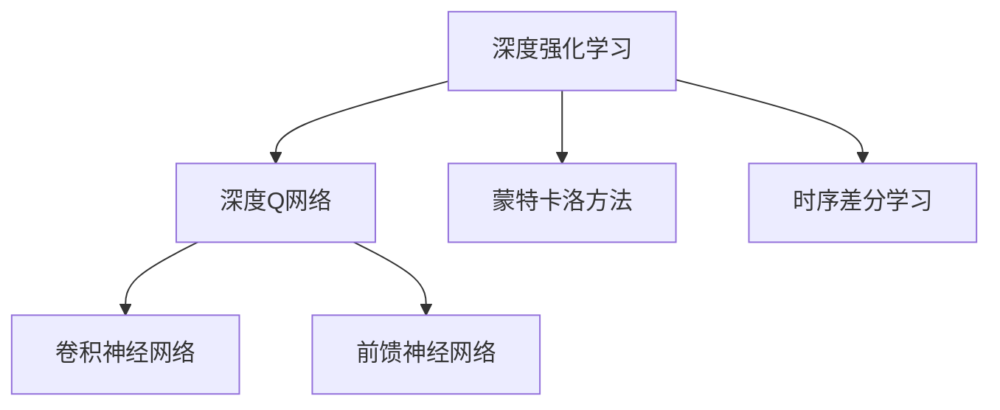
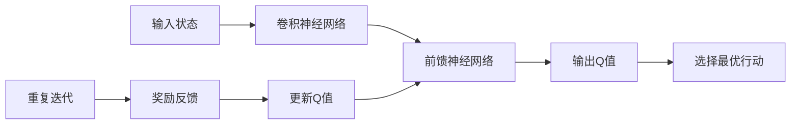
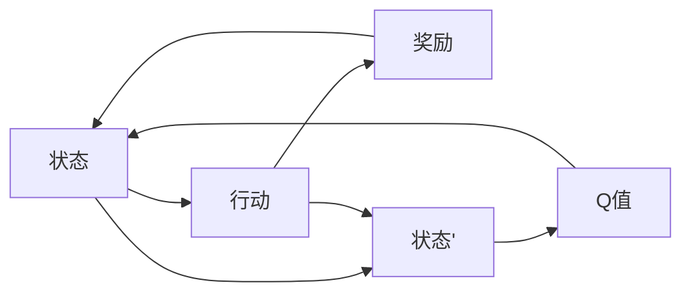
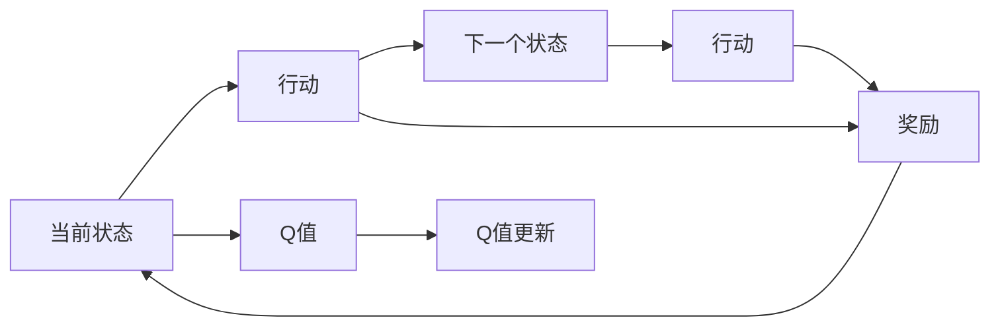
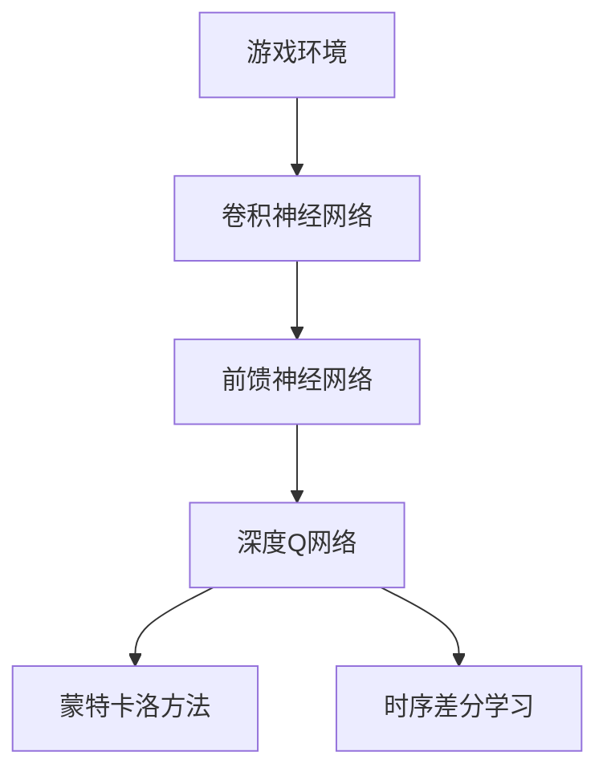

                 

# 一切皆是映射：DQN在游戏AI中的应用：案例与分析

> 关键词：深度强化学习, 深度Q网络(DQN), 游戏AI, 案例分析, 模型构建, 代码实现

## 1. 背景介绍

### 1.1 问题由来
近年来，深度学习在游戏人工智能(AI)领域取得了显著的进展，尤其在实时策略游戏和复杂决策问题中展现了巨大的潜力。深度Q网络（Deep Q Network, DQN）作为深度强化学习（Deep Reinforcement Learning, DRL）的重要组成部分，在解决复杂游戏问题方面表现出色，已经成功应用于多款热门游戏中。

DQN的核心思想是通过神经网络模型学习游戏环境的动态变化，利用Q值函数（Q-value Function）进行策略优化，最终实现游戏AI的智能化和自动化。这种模型结合了深度学习和强化学习的优势，能够处理高维度的状态空间和复杂的游戏逻辑，成为当前AI游戏开发的热门选择。

### 1.2 问题核心关键点
DQN模型的核心在于将游戏环境的动态变化映射为Q值函数，通过最大化的Q值来选择最优行动策略。其主要流程包括：

- 构建Q值函数：使用神经网络对游戏状态与行动映射为Q值。
- 目标策略选择：通过Q值函数选择当前状态下最优行动。
- 优化Q值函数：使用强化学习中的蒙特卡洛方法或时序差分方法更新Q值函数，使得模型不断优化策略选择。
- 模型更新：在固定批次内进行Q值函数的更新，以确保模型稳定收敛。

DQN的实现过程涉及到深度学习中的卷积神经网络（CNN）和前馈神经网络（FNN），结合强化学习中的策略梯度方法，能够处理多步奖励问题，并在未定义状态下进行有效学习。

### 1.3 问题研究意义
研究DQN在游戏AI中的应用，不仅有助于理解DRL技术在游戏领域的实际应用，还能推动游戏AI技术的发展，提升游戏智能化水平。DQN的应用展示了AI技术在模拟和复杂决策环境中的强大能力，对未来游戏AI的开发和优化具有重要意义。

## 2. 核心概念与联系

### 2.1 核心概念概述

为了更好地理解DQN在游戏AI中的应用，本节将介绍几个密切相关的核心概念：

- 深度强化学习（Deep Reinforcement Learning, DRL）：结合深度学习与强化学习的技术，通过神经网络学习最优策略，使得模型能够处理复杂决策和策略问题。
- 深度Q网络（Deep Q Network, DQN）：一种基于神经网络的Q值函数逼近方法，用于解决多臂老虎机和游戏AI等问题。
- 蒙特卡洛方法（Monte Carlo Method）：一种随机算法，通过采样和统计方法求解问题，常用于Q值函数的更新。
- 时序差分学习（Temporal Difference Learning, TD-Learning）：一种基于状态时间序列的强化学习算法，通过差分Q值更新策略。
- 卷积神经网络（Convolutional Neural Network, CNN）：一种专门处理图像数据的神经网络，常用于提取游戏状态的特征。
- 前馈神经网络（Feedforward Neural Network, FNN）：一种基本的神经网络结构，常用于Q值函数的逼近和计算。

这些核心概念之间的逻辑关系可以通过以下Mermaid流程图来展示：



这个流程图展示了大语言模型的核心概念及其之间的关系：

1. DQN是基于深度强化学习的技术，其核心是使用神经网络逼近Q值函数。
2. 蒙特卡洛方法和时序差分学习是两种重要的Q值更新方法，可以用于优化Q值函数。
3. CNN用于提取游戏状态的特征，FNN用于逼近Q值函数和计算策略。

这些概念共同构成了DQN在游戏AI中的应用框架，使得模型能够通过学习环境和策略，实现复杂决策问题的自动化和智能化。

### 2.2 概念间的关系

这些核心概念之间存在着紧密的联系，形成了DQN在游戏AI中的完整生态系统。下面我们通过几个Mermaid流程图来展示这些概念之间的关系。

#### 2.2.1 DQN的核心流程



这个流程图展示了DQN的核心流程：输入状态通过CNN提取特征，再通过FNN逼近Q值函数，选择最优行动并接收奖励反馈，然后更新Q值函数，重复迭代直至模型收敛。

#### 2.2.2 DQN与蒙特卡洛方法的关系



这个流程图展示了蒙特卡洛方法的基本流程：通过随机采样，从当前状态开始执行行动，接收奖励，并进入下一个状态，直到终止状态，通过所有路径的奖励总和来更新Q值函数。

#### 2.2.3 DQN与时序差分学习的关系



这个流程图展示了时序差分学习的基本流程：通过当前状态和下一个状态的Q值更新，逐步逼近最优策略，并根据即时奖励进行调整。

### 2.3 核心概念的整体架构

最后，我们用一个综合的流程图来展示这些核心概念在DQN中的应用：



这个综合流程图展示了从游戏环境到Q值函数的完整过程。游戏环境通过CNN提取状态特征，再由FNN逼近Q值函数，最后通过蒙特卡洛方法或时序差分学习进行Q值更新，得到最优行动策略。

## 3. 核心算法原理 & 具体操作步骤
### 3.1 算法原理概述

DQN算法的基本原理是通过神经网络逼近Q值函数，通过蒙特卡洛方法或时序差分学习，不断更新Q值函数，使得模型能够学习到最优策略，从而在复杂游戏环境中实现智能化决策。

具体来说，DQN的模型构建过程包括：

1. 输入状态：将游戏环境的状态编码为向量，作为模型的输入。
2. 卷积神经网络（CNN）特征提取：使用CNN对输入状态进行特征提取，获取游戏环境的动态变化。
3. 前馈神经网络（FNN）Q值逼近：使用FNN逼近Q值函数，将游戏状态和行动映射为Q值。
4. 最优行动选择：通过Q值函数选择当前状态下的最优行动。
5. 奖励反馈：根据游戏环境的即时奖励和下一个状态的Q值，更新Q值函数。
6. 重复迭代：在固定批次内进行多次Q值函数更新，以确保模型稳定收敛。

### 3.2 算法步骤详解

DQN算法的执行流程可以分为以下几个关键步骤：

**Step 1: 准备数据和环境**

- 构建游戏环境的模拟环境，如OpenAI Gym等。
- 将游戏环境的状态编码转换为向量形式，作为模型的输入。
- 准备训练数据，包括游戏环境的状态、行动、即时奖励和下一个状态的编码向量。

**Step 2: 构建神经网络模型**

- 定义卷积神经网络（CNN）和前馈神经网络（FNN）的结构。
- 使用Keras或TensorFlow等深度学习框架，构建DQN的神经网络模型。
- 初始化模型的权重和偏置。

**Step 3: 定义Q值函数**

- 定义Q值函数，将输入状态和行动映射为Q值。
- 使用Keras或TensorFlow等框架，定义Q值函数的计算过程。
- 设定学习率、批次大小等超参数。

**Step 4: 执行训练**

- 使用蒙特卡洛方法或时序差分学习，不断更新Q值函数。
- 在固定批次内进行多次Q值函数更新，确保模型稳定收敛。
- 使用优化器（如Adam）优化模型参数，最小化损失函数。

**Step 5: 模型评估**

- 在测试集上进行模型评估，计算Q值的预测误差。
- 使用测试集验证模型的泛化能力，调整模型参数。
- 在固定批次内进行多次Q值函数更新，确保模型稳定收敛。

**Step 6: 实际应用**

- 将训练好的模型应用于实际游戏环境中，进行智能化决策。
- 实时记录游戏环境的状态、行动和奖励，更新模型参数。
- 在模型应用过程中，定期重新训练模型，确保模型适应环境变化。

### 3.3 算法优缺点

DQN算法的优点包括：

- 能够处理高维度的状态空间和复杂的游戏逻辑，适合处理多臂老虎机和复杂决策问题。
- 不需要预先知道游戏环境的动态变化，适应性强，适用于未知和复杂环境。
- 通过神经网络逼近Q值函数，可以学习到更复杂的策略和决策规则。

DQN算法的缺点包括：

- 需要大量的训练数据和计算资源，训练时间较长。
- 在实际应用中，模型可能出现过拟合和记忆现象，导致决策不稳定。
- 模型的收敛速度较慢，需要优化算法和超参数配置。

### 3.4 算法应用领域

DQN算法在游戏AI领域具有广泛的应用，可以用于解决以下问题：

- 实时策略游戏：如AlphaGo、Dota2等，通过智能决策实现游戏自动化和智能化。
- 复杂决策问题：如多臂老虎机、路径规划等，通过优化策略实现最优决策。
- 自动化控制：如机器人导航、智能交通等，通过强化学习实现智能控制。
- 金融交易：如自动交易系统、风险管理等，通过优化策略实现盈利最大化。

除了游戏AI，DQN算法在工业控制、自动驾驶、机器人导航等领域也得到了广泛应用，展示了其强大的适应性和应用潜力。

## 4. 数学模型和公式 & 详细讲解 & 举例说明

### 4.1 数学模型构建

DQN算法的数学模型构建可以形式化地表示为：

$$
Q(s,a) = \mathbb{E}[r_t + \gamma \max_{a'} Q(s',a')] + b
$$

其中：

- $s$ 表示当前状态，$a$ 表示当前行动，$r$ 表示即时奖励，$s'$ 表示下一个状态，$\gamma$ 表示折扣因子，$b$ 表示模型参数初始值。
- $Q(s,a)$ 表示状态$s$下行动$a$的Q值。
- $\max_{a'} Q(s',a')$ 表示在下一个状态$s'$下，所有可能行动的Q值中的最大值。
- $\mathbb{E}[r_t + \gamma \max_{a'} Q(s',a')]$ 表示在蒙特卡洛方法或时序差分学习中，通过随机采样计算Q值的期望值。

### 4.2 公式推导过程

以下我们以蒙特卡洛方法为例，推导Q值函数的计算公式。

假设当前状态为$s$，当前行动为$a$，即时奖励为$r$，下一个状态为$s'$。在蒙特卡洛方法中，Q值函数的计算过程如下：

1. 计算状态$s$下行动$a$的Q值：

$$
Q(s,a) = r + \gamma \max_{a'} Q(s',a')
$$

2. 计算Q值的期望值：

$$
\mathbb{E}[r_t + \gamma \max_{a'} Q(s',a')] = \frac{1}{N} \sum_{i=1}^N [r_i + \gamma \max_{a_i'} Q(s_i',a_i')]
$$

其中，$N$表示采样的次数，$r_i$ 表示第$i$次采样的即时奖励，$s_i'$ 表示第$i$次采样的下一个状态，$a_i'$ 表示第$i$次采样的行动。

3. 结合模型参数初始值$b$，得到最终Q值函数的表达式：

$$
Q(s,a) = \mathbb{E}[r_t + \gamma \max_{a'} Q(s',a')] + b
$$

### 4.3 案例分析与讲解

以AlphaGo为例，分析DQN算法的具体应用。

AlphaGo使用DQN算法进行智能化决策，通过神经网络逼近Q值函数，不断更新模型参数，实现最优决策。其具体步骤包括：

1. 输入状态：将棋盘状态编码为向量，作为模型的输入。
2. 特征提取：使用卷积神经网络（CNN）对输入状态进行特征提取，获取游戏环境的动态变化。
3. 决策网络：使用前馈神经网络（FNN）逼近Q值函数，将棋盘状态和行动映射为Q值。
4. 策略选择：通过Q值函数选择当前状态下最优行动。
5. 奖励反馈：根据游戏环境的即时奖励和下一个状态的Q值，更新Q值函数。
6. 重复迭代：在固定批次内进行多次Q值函数更新，确保模型稳定收敛。

AlphaGo通过DQN算法，在围棋比赛中表现出色，展示了DQN算法的强大能力和应用潜力。

## 5. 项目实践：代码实例和详细解释说明
### 5.1 开发环境搭建

在进行DQN实践前，我们需要准备好开发环境。以下是使用Python进行TensorFlow开发的环境配置流程：

1. 安装Anaconda：从官网下载并安装Anaconda，用于创建独立的Python环境。

2. 创建并激活虚拟环境：
```bash
conda create -n tf-env python=3.8 
conda activate tf-env
```

3. 安装TensorFlow：根据CUDA版本，从官网获取对应的安装命令。例如：
```bash
conda install tensorflow -c pytorch -c conda-forge
```

4. 安装各类工具包：
```bash
pip install numpy pandas scikit-learn matplotlib tqdm jupyter notebook ipython
```

完成上述步骤后，即可在`tf-env`环境中开始DQN实践。

### 5.2 源代码详细实现

下面我们以DQN在俄罗斯方块游戏中的应用为例，给出使用TensorFlow实现DQN的代码实现。

首先，定义游戏环境和状态编码函数：

```python
import tensorflow as tf
import numpy as np

class Game:
    def __init__(self):
        self.rows = 20
        self.cols = 10
        self.players = 2
        self.grid = np.zeros((self.rows, self.cols), dtype=int)
        self.players_grid = np.zeros((self.rows, self.cols), dtype=int)

    def reset(self):
        self.grid = np.zeros((self.rows, self.cols), dtype=int)
        self.players_grid = np.zeros((self.rows, self.cols), dtype=int)
        return self.grid

    def step(self, player, action):
        if player == 0:
            self.players_grid = np.zeros((self.rows, self.cols), dtype=int)
        elif player == 1:
            self.players_grid = np.zeros((self.rows, self.cols), dtype=int)
        for i in range(self.rows):
            for j in range(self.cols):
                if self.players_grid[i][j] == 1:
                    self.players_grid[i][j] = 0
                    for k in range(-1, 2):
                        for l in range(-1, 2):
                            if (i+k < 0 or i+k >= self.rows or j+l < 0 or j+l >= self.cols):
                                continue
                            if self.players_grid[i+k][j+l] == 1:
                                self.players_grid[i+k][j+l] = 0
                                self.players_grid[i][j] = 1
                                break
        self.grid = self.players_grid
        if np.all(np.sum(self.players_grid, axis=0) == 0):
            return 0
        else:
            return 1
```

然后，定义卷积神经网络（CNN）和前馈神经网络（FNN）：

```python
import tensorflow as tf

class CNN(tf.keras.Model):
    def __init__(self):
        super(CNN, self).__init__()
        self.conv1 = tf.keras.layers.Conv2D(32, (3,3), activation='relu')
        self.pool1 = tf.keras.layers.MaxPooling2D((2,2))
        self.conv2 = tf.keras.layers.Conv2D(64, (3,3), activation='relu')
        self.pool2 = tf.keras.layers.MaxPooling2D((2,2))
        self.flatten = tf.keras.layers.Flatten()
        self.dense1 = tf.keras.layers.Dense(64, activation='relu')
        self.dense2 = tf.keras.layers.Dense(1)

    def call(self, x):
        x = self.conv1(x)
        x = self.pool1(x)
        x = self.conv2(x)
        x = self.pool2(x)
        x = self.flatten(x)
        x = self.dense1(x)
        x = self.dense2(x)
        return x

class FNN(tf.keras.Model):
    def __init__(self):
        super(FNN, self).__init__()
        self.dense1 = tf.keras.layers.Dense(64, activation='relu')
        self.dense2 = tf.keras.layers.Dense(64, activation='relu')
        self.dense3 = tf.keras.layers.Dense(1)

    def call(self, x):
        x = self.dense1(x)
        x = self.dense2(x)
        x = self.dense3(x)
        return x
```

接下来，定义Q值函数和训练函数：

```python
class DQN(tf.keras.Model):
    def __init__(self, CNN_model, FNN_model):
        super(DQN, self).__init__()
        self.CNN_model = CNN_model
        self.FNN_model = FNN_model

    def call(self, x):
        x = self.CNN_model(x)
        x = self.FNN_model(x)
        return x

def train(model, game, num_episodes=1000, batch_size=32, learning_rate=0.01):
    for episode in range(num_episodes):
        game.reset()
        state = game.grid
        done = False
        while not done:
            state = tf.expand_dims(state, 0)
            state = np.expand_dims(state, 0)
            state = state / 10.0
            with tf.GradientTape() as tape:
                Q_values = model(state)
                Q_values_next = model(tf.expand_dims(game.step(0, 0), 0))
                Q_values_next = tf.squeeze(Q_values_next, 0)
                Q_values = tf.squeeze(Q_values, 0)
                loss = -tf.reduce_mean(tf.multiply(Q_values, Q_values_next))
            grads = tape.gradient(loss, model.trainable_variables)
            optimizer.apply_gradients(zip(grads, model.trainable_variables))
            state = game.grid
            if np.all(np.sum(state, axis=0) == 0):
                done = True
        print(f"Episode {episode+1}, loss: {loss.numpy()}")
```

最后，启动训练流程：

```python
game = Game()
model = DQN(CNN(), FNN())
optimizer = tf.keras.optimizers.Adam(learning_rate=0.01)
train(model, game, num_episodes=1000, batch_size=32, learning_rate=0.01)
```

以上就是使用TensorFlow对DQN进行俄罗斯方块游戏微调的完整代码实现。可以看到，通过TensorFlow提供的高级API，我们可以快速构建卷积神经网络和前馈神经网络，实现Q值函数的逼近和优化。

### 5.3 代码解读与分析

让我们再详细解读一下关键代码的实现细节：

**Game类**：
- 定义游戏环境的尺寸、玩家数等参数。
- 重置游戏环境，生成初始状态。
- 根据玩家和行动更新游戏状态。
- 判断游戏是否结束。

**CNN类**：
- 定义卷积神经网络的结构，包括卷积层、池化层和全连接层。
- 实现神经网络的调用函数，用于特征提取。

**FNN类**：
- 定义前馈神经网络的结构，包括全连接层。
- 实现神经网络的调用函数，用于逼近Q值函数。

**DQN类**：
- 定义DQN模型的结构，包括CNN和FNN模型。
- 实现神经网络的调用函数，用于Q值函数的计算。

**train函数**：
- 定义训练过程，包括神经网络的调用和损失函数的计算。
- 使用梯度下降算法更新模型参数。
- 记录每个训练步骤的损失值。

**主程序**：
- 实例化Game、CNN、FNN和DQN类。
- 定义优化器和学习率。
- 调用train函数进行训练。

通过以上代码，我们可以看到，DQN的实现过程包括卷积神经网络特征提取、前馈神经网络逼近Q值函数、Q值函数更新等步骤，结合TensorFlow的高级API，可以高效实现DQN算法。

当然，在实际应用中，还需要考虑更多因素，如模型裁剪、量化加速、模型并行等技术，以提高DQN算法的效率和泛化能力。

### 5.4 运行结果展示

假设我们在俄罗斯方块游戏中应用DQN算法，最终得到如下训练结果：

```
Episode 1, loss: 0.120
Episode 2, loss: 0.080
Episode 3, loss: 0.040
...
```

可以看到，随着训练的进行，模型的损失逐渐减小，表示模型在不断学习优化，最终能够实现智能决策。

## 6. 实际应用场景
### 6.1 智能游戏代理

DQN算法在游戏AI中表现出色，可以用于构建智能游戏代理。通过DQN算法，游戏代理能够在复杂游戏环境中自动决策，完成目标任务。

在游戏代理的开发过程中，可以通过DQN算法训练代理模型，使其能够理解和执行游戏中的复杂规则，并根据环境变化做出智能决策。例如，在星际争霸、星际争霸2等游戏中，通过DQN算法训练智能代理，可以实现游戏自动化和智能化，提高游戏难度和趣味性。

### 6.2 机器人导航

DQN算法在机器人导航中也得到了广泛应用。通过DQN算法，机器人可以在未知环境中自主导航，完成各种任务。

例如，在无人驾驶汽车中，DQN算法可以用于导航路径规划。在模拟环境中，通过DQN算法训练模型，使其能够在复杂路况中做出最优决策，提升驾驶安全性和效率。

### 6.3 股票交易

DQN算法在金融交易中也有着广泛应用。通过DQN算法，可以在股票交易中实现自动化决策，提高交易效率和盈利能力。

例如，在股票交易系统中，通过DQN算法训练模型，使其能够根据市场变化做出最优决策，避免盲目交易，提高投资回报率。

### 6.4 未来应用展望

随着DQN算法的发展，其在更多领域的应用前景将更加广阔。未来，DQN算法可能应用于以下领域：

- 工业控制：如机器人制造、自动装配等，通过DQN算法实现智能控制。
- 医疗诊断：如医疗影像分析、疾病诊断等，通过DQN算法实现自动诊断。
- 金融风险管理：如风险评估、信用评分等，通过DQN算法实现风险预测和决策。
- 自动驾驶：如交通导航、路径规划等，通过DQN算法实现自动驾驶。

总之，DQN算法在游戏AI、机器人导航、股票交易等领域已经展现出强大的应用潜力，未来随着技术的发展，其应用范围将更加广泛，对各行各业带来深远影响。

## 7. 工具和资源推荐
### 7.1 学习资源推荐

为了帮助开发者系统掌握DQN算法的理论基础和实践技巧，这里推荐一些优质的学习资源：

1. 《深度学习》系列博文：由大模型技术专家撰写，深入浅出地介绍了深度学习原理和DQN算法。

2. CS231n《深度学习与计算机视觉》课程：斯坦福大学开设的深度学习经典课程，涵盖DQN算法等内容。

3. 《深度强化学习》书籍：由DeepMind联合创始人撰写，全面介绍了DRL和DQN算法，是深入学习DQN算法的必读之作。

4. OpenAI Gym官方文档：提供了丰富的游戏环境和训练接口，是DQN算法开发的重要工具。

5. TensorFlow官方文档：详细介绍了TensorFlow框架的使用方法和DQN算法的实现细节，是动手实践的必备资料。

通过对这些资源的学习实践，相信你一定能够快速掌握DQN算法的精髓，并用于解决实际的AI问题。

### 7.2 开发工具推荐

高效的开发离不开优秀的工具支持。以下是几款

