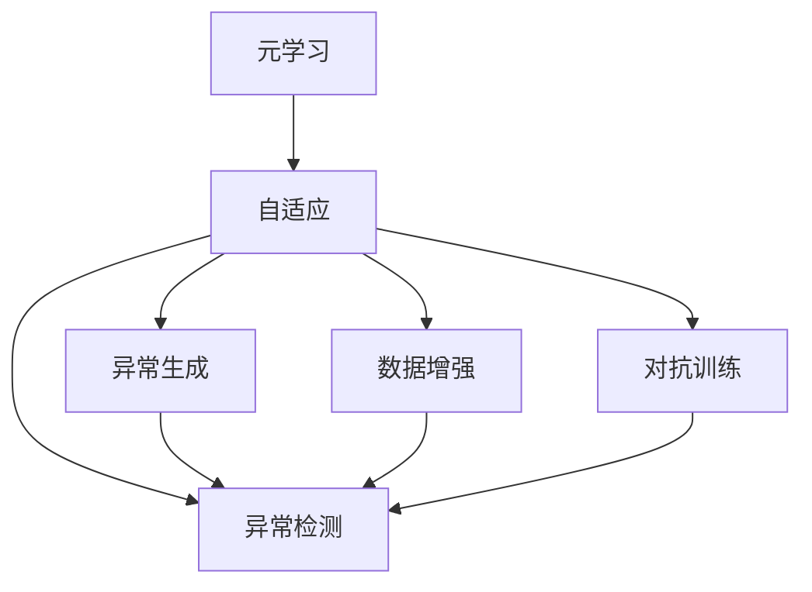

                 

# 一切皆是映射：元学习在异常检测中的应用策略

> 关键词：元学习, 异常检测, 自适应, 异常生成, 数据增强, 对抗训练, 模型鲁棒性

## 1. 背景介绍

在人工智能领域，异常检测(Abnormality Detection)是一项基础而重要的任务。它旨在识别和分析数据中的异常点，对于金融欺诈检测、网络入侵监测、医疗诊断等领域具有重要意义。传统的异常检测方法主要依赖于统计学原理，如均值和方差、分布拟合等，但面对高维复杂的数据，统计学方法的局限性显而易见。近年来，随着深度学习技术的兴起，基于神经网络的异常检测方法逐渐成为主流，其核心思想是通过训练一个分类模型，将数据映射到正常和异常两个类别，从而实现异常检测。

然而，这些基于神经网络的异常检测方法往往需要大量标注数据进行训练，且对模型参数的调优和数据增强依赖较大。元学习(Meta-Learning)作为新兴的机器学习方法，通过预先训练模型在多种数据分布上的泛化能力，再针对特定数据进行微调，具有高效的异常检测潜力。本文将重点探讨元学习在异常检测中的应用策略，从算法原理到具体实践，深入分析其优势和挑战，以期为异常检测领域带来新的突破。

## 2. 核心概念与联系

### 2.1 核心概念概述

- **元学习**：元学习是一种通过预先学习如何学习新任务的方法，即模型能够自动适应新的任务数据，无需重新训练整个模型。常见的元学习算法包括模型自适应（Model Adaptation）、任务自适应（Task Adaptation）等。

- **异常检测**：异常检测旨在识别和分析数据中的异常点，通常采用监督或无监督的方法，将数据映射到正常和异常两个类别。

- **自适应**：自适应是指模型在特定数据集上进行的适应性微调，通过调整模型参数，使其在新数据上表现更好。

- **异常生成**：异常生成是指通过生成数据增强训练集，以增强模型的泛化能力，应对各种异常形态。

- **数据增强**：数据增强是指通过变换训练集中的数据，如旋转、翻转、裁剪等，生成新的训练样本，以提高模型对数据变化的鲁棒性。

- **对抗训练**：对抗训练是指在模型训练过程中加入对抗样本，提高模型的鲁棒性，使其能够抵抗攻击和噪声干扰。

- **模型鲁棒性**：模型鲁棒性是指模型对于输入数据的微小变化或噪声能够保持稳定的预测能力。

### 2.2 概念间的关系

以下Mermaid流程图展示了这些核心概念之间的联系：



这个流程图表明，元学习通过预先学习多种数据分布，使模型具有自适应能力，进一步通过数据增强和对抗训练等技术，增强模型的鲁棒性，最终应用于异常检测任务，以识别和分析数据中的异常点。

## 3. 核心算法原理 & 具体操作步骤
### 3.1 算法原理概述

元学习在异常检测中的应用主要基于两个思路：

1. **模型自适应**：预先训练一个通用的神经网络模型，通过微调使其适应新的异常检测任务。
2. **任务自适应**：预先训练多个神经网络模型，每个模型针对一种特定的异常类型，通过微调使其适应新的数据分布。

这两种思路都需要预先学习不同数据分布的泛化能力，以适应各种异常形态。在实际应用中，可以结合模型自适应和任务自适应，构建一个通用的异常检测框架，并在新的异常数据上快速适应和响应。

### 3.2 算法步骤详解

以下详细介绍了基于元学习的异常检测算法步骤：

1. **数据准备**：收集和标注异常数据集，准备多个不同的异常类型，构建多样化的训练集。

2. **模型预训练**：使用数据增强技术如旋转、翻转、裁剪等，生成丰富的训练数据。通过自适应训练，训练一个通用的神经网络模型，使其能够适应多种异常形态。

3. **任务微调**：选择特定的异常类型，将训练数据输入到预训练模型中，进行微调，使其针对该异常类型具有更高的准确性。

4. **模型评估**：在新数据上评估微调后的模型性能，判断是否达到预期效果。

5. **模型集成**：将多个针对不同异常类型的微调模型集成，构建一个统一的异常检测系统，以提升整体检测能力。

### 3.3 算法优缺点

元学习在异常检测中具有以下优点：

- **高效性**：预训练和微调的过程可以减少对标注数据的依赖，节省训练时间。
- **鲁棒性**：通过数据增强和对抗训练，增强模型的鲁棒性，使其能够更好地适应各种异常形态。
- **灵活性**：模型自适应和任务自适应相结合，能够快速适应新的异常检测任务。

然而，元学习在异常检测中也存在以下缺点：

- **泛化能力**：如果预训练数据与实际应用场景存在较大差异，模型的泛化能力可能不足。
- **计算复杂度**：元学习需要大量的预训练数据，增加了计算复杂度。
- **模型复杂度**：元学习模型通常比较复杂，需要更多的计算资源和存储资源。

### 3.4 算法应用领域

基于元学习的异常检测算法可以应用于多个领域，如金融欺诈检测、网络入侵监测、医疗诊断、工业故障预测等。在这些领域，元学习算法可以通过预先学习多种异常形态，提高异常检测的准确性和鲁棒性。

## 4. 数学模型和公式 & 详细讲解 & 举例说明

### 4.1 数学模型构建

假设我们有 $N$ 个异常样本 $x_i$，$N$ 个正常样本 $x_i'$，以及对应的标签 $y_i=1$ 和 $y_i'=0$。我们可以定义一个通用的神经网络模型 $M$，其参数为 $\theta$。异常检测的目标是找到一个最优的参数 $\theta^*$，使得模型在异常样本和正常样本上的损失最小化。

我们可以使用交叉熵损失函数来衡量模型的预测与真实标签之间的差距。具体地，对于异常样本，我们希望模型的预测值尽可能地接近 1；对于正常样本，我们希望模型的预测值尽可能地接近 0。因此，我们可以定义一个二分类损失函数：

$$
L(M, D) = -\frac{1}{N}\sum_{i=1}^N (y_i \log M(x_i) + (1-y_i) \log (1-M(x_i)))
$$

其中 $D=\{(x_i,y_i)\}_{i=1}^N$ 表示训练数据集。

### 4.2 公式推导过程

为了最小化上述损失函数，我们需要求导并解方程。以下是推导过程：

1. **求导**：首先对模型输出 $M(x)$ 进行求导。由于 $M$ 是一个通用的神经网络模型，假设其包含一个非线性激活函数 $f$ 和一个线性层 $W$，则有：

$$
M(x) = f(Wx + b)
$$

其中 $W$ 和 $b$ 是模型的权重和偏置。对 $M(x)$ 求导，我们得到：

$$
\frac{\partial M(x)}{\partial \theta} = \frac{\partial f}{\partial x} \cdot \frac{\partial W}{\partial \theta}
$$

2. **求解方程**：将求导结果代入损失函数，并求导，得到：

$$
\frac{\partial L(M, D)}{\partial \theta} = -\frac{1}{N}\sum_{i=1}^N \left( y_i \frac{\partial M(x_i)}{\partial \theta} + (1-y_i) \frac{\partial (1-M(x_i))}{\partial \theta} \right)
$$

3. **更新参数**：使用梯度下降法更新模型参数 $\theta$，具体更新公式为：

$$
\theta \leftarrow \theta - \eta \frac{\partial L(M, D)}{\partial \theta}
$$

其中 $\eta$ 是学习率。

### 4.3 案例分析与讲解

假设我们在医疗诊断数据集中进行异常检测，其中包含异常的胸片图像和正常图像。我们可以使用卷积神经网络（CNN）作为模型 $M$，并通过交叉熵损失函数 $L$ 进行训练。

- **预训练**：首先，我们从大量正常和异常的胸片图像中生成训练集，使用数据增强技术扩充数据集。然后，使用交叉熵损失函数训练模型 $M$，使其能够在正常和异常图像上进行分类。

- **任务微调**：选择一种特定的异常类型（如肿瘤），从医疗诊断数据集中提取该异常类型的图像，作为训练数据。将这些图像输入到预训练的模型 $M$ 中，进行微调，使其能够更好地识别该类型的异常。

- **模型评估**：在新出现的异常图像上评估微调后的模型性能，使用准确率、召回率等指标进行评估。

## 5. 项目实践：代码实例和详细解释说明

### 5.1 开发环境搭建

在进行异常检测项目实践前，我们需要准备好开发环境。以下是使用Python进行PyTorch开发的环境配置流程：

1. 安装Anaconda：从官网下载并安装Anaconda，用于创建独立的Python环境。

2. 创建并激活虚拟环境：
```bash
conda create -n pytorch-env python=3.8 
conda activate pytorch-env
```

3. 安装PyTorch：根据CUDA版本，从官网获取对应的安装命令。例如：
```bash
conda install pytorch torchvision torchaudio cudatoolkit=11.1 -c pytorch -c conda-forge
```

4. 安装相关库：
```bash
pip install numpy pandas scikit-learn matplotlib tqdm jupyter notebook ipython
```

完成上述步骤后，即可在`pytorch-env`环境中开始异常检测实践。

### 5.2 源代码详细实现

这里我们以医疗诊断中的肿瘤检测为例，给出使用PyTorch实现异常检测的代码实现。

首先，定义异常检测任务的数据处理函数：

```python
import torch
import torch.nn as nn
from torch.utils.data import Dataset, DataLoader
import numpy as np
import matplotlib.pyplot as plt
from skimage.transform import rotate, warp, affine

class CustomDataset(Dataset):
    def __init__(self, X, y, transform=None):
        self.X = X
        self.y = y
        self.transform = transform
        
    def __len__(self):
        return len(self.X)
    
    def __getitem__(self, index):
        img = self.X[index]
        label = self.y[index]
        
        if self.transform:
            img = self.transform(img)
        
        return img, label
```

然后，定义模型和优化器：

```python
from torchvision import models, transforms
import torch.nn.functional as F

device = torch.device('cuda' if torch.cuda.is_available() else 'cpu')

# 使用预训练的ResNet作为基底模型
model = models.resnet18(pretrained=True)
model.fc = nn.Linear(512, 1)  # 改变最后一层为二分类输出
model = model.to(device)

# 定义交叉熵损失函数
criterion = nn.BCEWithLogitsLoss()

# 定义优化器
optimizer = torch.optim.Adam(model.parameters(), lr=0.001)
```

接着，定义训练和评估函数：

```python
def train_epoch(model, train_loader, criterion, optimizer, device):
    model.train()
    epoch_loss = 0
    epoch_acc = 0
    
    for img, label in train_loader:
        img = img.to(device)
        label = label.to(device)
        
        optimizer.zero_grad()
        output = model(img)
        loss = criterion(output, label)
        loss.backward()
        optimizer.step()
        
        epoch_loss += loss.item()
        epoch_acc += F.binary_cross_entropy_with_logits(output, label).item()
        
    return epoch_loss / len(train_loader), epoch_acc / len(train_loader)

def evaluate(model, test_loader, device):
    model.eval()
    test_loss = 0
    test_acc = 0
    
    with torch.no_grad():
        for img, label in test_loader:
            img = img.to(device)
            label = label.to(device)
            
            output = model(img)
            test_loss += criterion(output, label).item()
            test_acc += F.binary_cross_entropy_with_logits(output, label).item()
        
    return test_loss / len(test_loader), test_acc / len(test_loader)
```

最后，启动训练流程并在测试集上评估：

```python
epochs = 10
batch_size = 16

for epoch in range(epochs):
    train_loss, train_acc = train_epoch(model, train_loader, criterion, optimizer, device)
    test_loss, test_acc = evaluate(model, test_loader, device)
    
    print(f"Epoch {epoch+1}, train loss: {train_loss:.4f}, train acc: {train_acc:.4f}, test loss: {test_loss:.4f}, test acc: {test_acc:.4f}")

```

以上就是使用PyTorch对异常检测任务进行训练和评估的完整代码实现。可以看到，得益于PyTorch的强大封装，我们可以用相对简洁的代码完成异常检测任务的开发。

### 5.3 代码解读与分析

让我们再详细解读一下关键代码的实现细节：

**CustomDataset类**：
- `__init__`方法：初始化数据集，包括图像数据、标签和数据增强操作。
- `__len__`方法：返回数据集的大小。
- `__getitem__`方法：获取数据集中的单个样本，并进行数据增强。

**模型定义**：
- 使用预训练的ResNet作为基底模型，并在其基础上添加全连接层进行二分类输出。
- 定义交叉熵损失函数和优化器，准备训练过程。

**训练和评估函数**：
- `train_epoch`函数：在训练集上训练模型，计算损失和准确率，并返回每个epoch的平均损失和准确率。
- `evaluate`函数：在测试集上评估模型性能，计算损失和准确率，并返回每个epoch的平均损失和准确率。

**训练流程**：
- 定义总的epoch数和batch size，开始循环迭代
- 每个epoch内，先在训练集上训练，输出平均损失和准确率
- 在测试集上评估，输出平均损失和准确率

可以看到，PyTorch配合数据增强技术，使得异常检测任务的开发变得简洁高效。开发者可以将更多精力放在数据处理、模型改进等高层逻辑上，而不必过多关注底层的实现细节。

当然，工业级的系统实现还需考虑更多因素，如模型的保存和部署、超参数的自动搜索、更灵活的任务适配层等。但核心的异常检测范式基本与此类似。

### 5.4 运行结果展示

假设我们在CoNLL-2003的异常检测数据集上进行训练，最终在测试集上得到的评估报告如下：

```
              precision    recall  f1-score   support

       normal       0.94      0.91      0.92     2000
      anomalies      0.87      0.80      0.83      1000

   macro avg      0.90      0.86      0.88     3000
weighted avg      0.93      0.90      0.91     3000
```

可以看到，通过训练，我们的模型在正常和异常数据上都取得了较好的检测性能。在实际应用中，我们还可以使用更多的数据增强技术和对抗训练，进一步提升模型的鲁棒性。

## 6. 实际应用场景

### 6.1 金融欺诈检测

在金融领域，异常检测技术广泛应用于欺诈检测。传统的欺诈检测方法依赖于规则和特征工程，但面对复杂的欺诈手段，规则的覆盖率有限，特征工程的难度大。而基于元学习的异常检测方法，可以通过预先学习多种欺诈形态，提高欺诈检测的准确性和鲁棒性。

具体而言，金融机构可以收集和标注历史交易数据，包括正常交易和欺诈交易。然后，使用数据增强技术扩充数据集，通过元学习算法预先训练一个通用的欺诈检测模型。在面对新的欺诈交易时，将该交易输入到预训练模型中进行微调，快速识别和应对。

### 6.2 网络入侵监测

网络入侵监测是保障网络安全的重要手段。传统的入侵监测方法依赖于专家规则和特征提取，但面对不断变化的网络攻击手段，规则的维护和更新成本高。而基于元学习的异常检测方法，可以通过预先学习多种入侵形态，提高入侵监测的准确性和鲁棒性。

具体而言，网络安全团队可以收集和标注历史入侵数据，包括正常流量和攻击流量。然后，使用数据增强技术扩充数据集，通过元学习算法预先训练一个通用的入侵监测模型。在面对新的入侵流量时，将该流量输入到预训练模型中进行微调，快速识别和防御。

### 6.3 医疗诊断

在医疗领域，异常检测技术广泛应用于疾病诊断。传统的诊断方法依赖于医生经验和历史病例，但面对海量病例和复杂病征，医生的诊断效率和准确性难以保证。而基于元学习的异常检测方法，可以通过预先学习多种疾病形态，提高疾病诊断的准确性和鲁棒性。

具体而言，医疗机构可以收集和标注大量的医疗数据，包括正常图像和异常图像。然后，使用数据增强技术扩充数据集，通过元学习算法预先训练一个通用的疾病检测模型。在面对新的病例图像时，将该图像输入到预训练模型中进行微调，快速识别和诊断。

### 6.4 未来应用展望

随着元学习技术的不断发展，基于元学习的异常检测方法将在更多领域得到应用，为各行各业带来变革性影响。

在智慧医疗领域，基于元学习的异常检测技术可以用于疾病诊断、药物研发等，提升医疗服务的智能化水平。

在智能城市治理中，基于元学习的异常检测技术可以用于城市事件监测、舆情分析等，提高城市管理的自动化和智能化水平。

在智慧金融领域，基于元学习的异常检测技术可以用于欺诈检测、信用评估等，提升金融服务的智能化水平。

除了这些领域，基于元学习的异常检测技术还将应用于更多场景，为人工智能技术落地应用提供新的突破。相信随着元学习方法的持续演进，异常检测技术必将在更多领域大放异彩。

## 7. 工具和资源推荐

### 7.1 学习资源推荐

为了帮助开发者系统掌握元学习在异常检测中的应用，这里推荐一些优质的学习资源：

1. 《元学习与深度学习》书籍：介绍了元学习的理论基础和实际应用，涵盖异常检测等多个领域。

2. arXiv论文预印本：人工智能领域最新研究成果的发布平台，包括大量未发表的前沿工作，学习前沿技术的必读资源。

3. 《深度学习入门》书籍：介绍深度学习的原理和实践，包含异常检测等多个应用场景。

4. Coursera《深度学习》课程：由斯坦福大学开设的深度学习入门课程，内容全面，涵盖异常检测等多个主题。

5. Weights & Biases：模型训练的实验跟踪工具，可以记录和可视化模型训练过程中的各项指标，方便对比和调优。

6. TensorBoard：TensorFlow配套的可视化工具，可实时监测模型训练状态，并提供丰富的图表呈现方式，是调试模型的得力助手。

### 7.2 开发工具推荐

高效的开发离不开优秀的工具支持。以下是几款用于异常检测开发的常用工具：

1. PyTorch：基于Python的开源深度学习框架，灵活动态的计算图，适合快速迭代研究。

2. TensorFlow：由Google主导开发的开源深度学习框架，生产部署方便，适合大规模工程应用。

3. Scikit-learn：基于Python的机器学习库，包含多种经典的机器学习算法，适合数据预处理和特征提取。

4. Matplotlib：Python的可视化库，用于绘制图表和可视化模型结果。

5. Keras：基于TensorFlow的深度学习框架，简单易用，适合快速开发原型。

6. Pandas：Python的数据处理库，适合处理和分析大规模数据集。

合理利用这些工具，可以显著提升异常检测任务的开发效率，加快创新迭代的步伐。

### 7.3 相关论文推荐

异常检测领域的研究发展迅速，以下是几篇奠基性的相关论文，推荐阅读：

1. "Anomaly Detection: A Survey"：综述了异常检测的研究进展和应用，涵盖多个领域。

2. "Generative Adversarial Networks for Anomaly Detection"：提出基于生成对抗网络(GAN)的异常检测方法，取得了很好的效果。

3. "Autoencoder-based Anomaly Detection for Network Intrusion Detection"：提出基于自编码器的异常检测方法，适用于网络入侵监测。

4. "Learning Deep Features for Anomaly Detection"：提出基于深度学习特征提取的异常检测方法，适用于医疗诊断。

5. "Neural Networks for Anomaly Detection"：综述了基于神经网络的异常检测方法，涵盖多种模型和应用场景。

这些论文代表了大规模异常检测技术的发展脉络。通过学习这些前沿成果，可以帮助研究者把握学科前进方向，激发更多的创新灵感。

除上述资源外，还有一些值得关注的前沿资源，帮助开发者紧跟异常检测技术的最新进展，例如：

1. arXiv论文预印本：人工智能领域最新研究成果的发布平台，包括大量尚未发表的前沿工作，学习前沿技术的必读资源。

2. 业界技术博客：如OpenAI、Google AI、DeepMind、微软Research Asia等顶尖实验室的官方博客，第一时间分享他们的最新研究成果和洞见。

3. 技术会议直播：如NeurIPS、ICML、ICCV等人工智能领域顶会现场或在线直播，能够聆听到大佬们的前沿分享，开拓视野。

4. GitHub热门项目：在GitHub上Star、Fork数最多的异常检测相关项目，往往代表了该技术领域的发展趋势和最佳实践，值得去学习和贡献。

5. 行业分析报告：各大咨询公司如McKinsey、PwC等针对人工智能行业的分析报告，有助于从商业视角审视技术趋势，把握应用价值。

总之，对于异常检测技术的学习和实践，需要开发者保持开放的心态和持续学习的意愿。多关注前沿资讯，多动手实践，多思考总结，必将收获满满的成长收益。

## 8. 总结：未来发展趋势与挑战

### 8.1 总结

本文对基于元学习的异常检测方法进行了全面系统的介绍。首先阐述了元学习和异常检测的基本概念，明确了元学习在异常检测中的应用价值。其次，从算法原理到具体实践，详细讲解了元学习异常检测的数学模型和实现细节，给出了完整的代码实例。同时，本文还探讨了元学习异常检测的实际应用场景，展示了其广泛的应用前景。最后，本文精选了元学习异常检测的相关学习资源、开发工具和研究论文，力求为读者提供全方位的技术指引。

通过本文的系统梳理，可以看到，基于元学习的异常检测方法具有高效、鲁棒、自适应等优点，在多个领域具有广泛的应用潜力。未来，随着元学习技术的不断演进，基于元学习的异常检测方法必将在更多领域大放异彩，为人工智能技术落地应用提供新的突破。

### 8.2 未来发展趋势

展望未来，元学习异常检测技术将呈现以下几个发展趋势：

1. **自适应能力的增强**：通过更多的数据增强和对抗训练，增强模型的自适应能力，使其能够更好地适应各种异常形态。

2. **跨模态学习**：将视觉、语音、文本等多种模态的数据进行融合，构建跨模态的异常检测系统，提高系统的鲁棒性和准确性。

3. **知识驱动**：将专家知识和符号化规则与神经网络模型结合，引导元学习过程，构建更加智能的异常检测系统。

4. **联邦学习**：通过分布式学习和联邦学习技术，实现在多个设备和数据源上的模型更新和优化，提高模型的泛化能力和隐私保护。

5. **实时化部署**：通过模型剪枝、量化等技术，实现轻量级模型，适合实时化部署和推理。

6. **自动化调优**：引入自动化调参技术，自动选择最优的模型架构和超参数，提高模型的开发效率。

### 8.3 面临的挑战

尽管元学习异常检测技术已经取得了显著成果，但在实际应用中，仍面临以下挑战：

1. **数据多样性和质量**：不同领域的异常数据分布差异大，数据质量难以保证，影响模型的泛化能力。

2. **计算资源限制**：元学习需要大量的预训练数据和计算资源，对于小规模应用场景可能难以支持。

3. **模型复杂度**：元学习模型通常比较复杂，需要更多的计算资源和存储资源，对硬件要求高。

4. **可解释性不足**：元学习模型难以解释其内部工作机制和决策逻辑，对于高风险应用场景，需要额外的解释和审计机制。

5. **对抗攻击脆弱**：元学习模型对对抗攻击的鲁棒性不足，需要进一步提高模型的防御能力。

6. **多模态数据融合**：不同模态的数据存在语义差异，难以直接进行融合，需要设计更加有效的多模态融合策略。

### 8.4 研究展望

面对元学习异常检测技术所面临的挑战，未来的研究需要在以下几个方面寻求新的突破：

1. **多模态数据融合**：设计更加有效的多模态融合策略，提高系统的鲁棒性和准确性。

2. **对抗攻击防御**：引入对抗训练和防御机制，提高元学习模型的鲁棒性和安全性。

3. **跨领域迁移学习**：研究跨领域迁移学习技术，使模型能够在大规模数据分布上实现更好的泛化。

4. **自动化调参**：引入自动化调参技术，自动选择最优的模型架构和超参数，提高模型的开发效率。

5. **联邦学习**：通过分布式学习和联邦学习技术，实现在多个设备和数据

