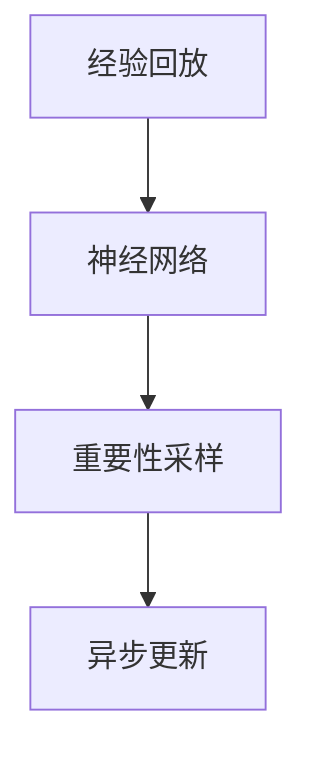

                 

# 一切皆是映射：强化学习的样本效率问题：DQN如何应对？

> 关键词：强化学习,样本效率,深度Q网络(DQN),蒙特卡罗方法,重要性采样,近似计算,异步更新

## 1. 背景介绍

### 1.1 问题由来
强化学习(Reinforcement Learning, RL)是一种基于奖惩反馈的学习范式，常用于解决序列决策问题，如游戏AI、机器人控制、股票交易等。RL的核心目标是通过不断试错，找到最优的策略，使得期望回报最大化。

然而，强化学习也面临诸多挑战。样本效率问题(样本复杂度问题)是其中一个重要难点。在传统蒙特卡罗方法中，每次策略更新需要遍历整条时间步，时间复杂度较高。而Q-learning等方法在每步更新时，需要估计状态值，带来了额外的计算负担。

DQN（Deep Q-Network）方法通过引入深度神经网络，解决了这些问题，显著提高了样本效率。本文将详细探讨DQN的算法原理、操作步骤和应用领域，并结合数学模型和公式进行讲解。

## 2. 核心概念与联系

### 2.1 核心概念概述

为更好地理解DQN算法，本节将介绍几个关键概念：

- 强化学习(Reinforcement Learning, RL)：通过奖励反馈来优化策略，使得期望回报最大化。常见方法包括蒙特卡罗方法、基于价值函数的Q-learning等。

- 深度Q网络(Deep Q-Network, DQN)：基于深度神经网络的Q-learning方法，通过学习状态-动作值函数来优化策略。DQN有效解决了传统Q-learning的样本效率问题。

- 蒙特卡罗方法(Monte Carlo, MC)：通过随机模拟，使用时间步序列来估计状态值和状态值函数。经典方法如MC控制、MC策略评估等。

- 重要性采样(Importance Sampling, IS)：一种从重要性概率分布中估计样本期望的方法，常用于缓解MC方法的方差问题。

- 近似计算(Approximate Calculation)：使用函数逼近技术(如神经网络)来近似表示状态值函数。

这些概念构成了强化学习的基础框架，DQN方法进一步创新性地结合了深度神经网络和近似计算，使得强化学习更加高效和精确。

### 2.2 概念间的关系

DQN方法的具体实现涉及以下核心步骤：

1. 将Q-learning中的动作-值函数通过神经网络表示，引入深度学习技术。
2. 利用经验回放技术(Empirical Replay)，在每次策略更新时，通过批处理随机样本，降低计算复杂度。
3. 应用重要性采样，估计状态的期望回报，缓解方差问题。
4. 引入异步更新，通过并行计算，进一步提高样本效率。

这些关键步骤使得DQN方法成为一种高效的强化学习范式，广泛应用于各种序列决策问题。

### 2.3 核心概念的整体架构

综合这些关键概念，可以用以下流程图展示DQN的总体架构：



这个流程图展示了DQN方法从经验回放到异步更新的全流程，核心在于通过神经网络和近似计算，大幅提高了样本效率。

## 3. 核心算法原理 & 具体操作步骤
### 3.1 算法原理概述

DQN的核心思想是将Q-learning中的动作-值函数通过神经网络逼近，并结合经验回放、重要性采样和异步更新技术，有效解决了传统Q-learning的样本效率问题。

具体来说，DQN通过以下三个步骤来优化策略：

1. 将Q-learning中的动作-值函数通过神经网络表示，引入深度学习技术，近似计算状态值。
2. 利用经验回放，通过批处理随机样本，降低计算复杂度。
3. 应用重要性采样，估计状态的期望回报，缓解方差问题。

### 3.2 算法步骤详解

#### 3.2.1 神经网络架构

DQN采用一个简单的全连接神经网络作为状态-动作值函数，包含一个或多个隐藏层。例如，可以设计一个包含两个隐藏层的神经网络：

$$
f_{\theta}(s) = \sigma(W_h \sigma(W_x s + b_x) + b_h) + b
$$

其中，$W_x, b_x, W_h, b_h, b$为可学习的参数，$\sigma$为激活函数（如ReLU）。

#### 3.2.2 经验回放

经验回放技术通过将过去交互的经验存储在一个经验存储池中，并在策略更新时随机采样一批经验进行更新。该方法可以降低计算复杂度，并提高样本的代表性。

#### 3.2.3 重要性采样

重要性采样通过引入重要性权重，对样本进行加权，从而缓解蒙特卡罗方法的方差问题。具体来说，设当前状态$s_t$的Q值为$Q_{\theta}(s_t)$，实际状态值$V_{\theta}(s_t)$，则重要性权重为：

$$
\omega_t = \frac{\rho(s_t)}{\epsilon \rho(s_t) + (1-\epsilon)}
$$

其中，$\rho(s_t)$为状态$s_t$的实际重要性权重，$\epsilon$为重要性采样比例。

#### 3.2.4 异步更新

异步更新通过并行计算，在每次策略更新时，同时处理多批样本，进一步提高样本效率。具体来说，每次策略更新时，从经验存储池中随机采样一批经验，在神经网络中进行前向传播计算，估计状态值，并根据Q-learning的策略更新公式进行参数更新：

$$
\theta \leftarrow \theta - \eta \frac{1}{N} \sum_{i=1}^N \omega_t Q_{\theta}(s_t, a_t) - \eta \frac{1}{N} \sum_{i=1}^N \omega_t r_{t+1} + \omega_t V_{\theta}(s_{t+1})
$$

其中，$\eta$为学习率，$r_{t+1}$为下一时刻的即时奖励，$V_{\theta}(s_{t+1})$为神经网络估计的下一个状态值。

### 3.3 算法优缺点

DQN方法的优势在于：

1. 高效样本利用：通过经验回放、重要性采样和异步更新，大幅提高了样本利用率，降低了计算复杂度。
2. 稳定学习：神经网络能够有效逼近状态值函数，使得Q-learning更加稳定和精确。
3. 适用性强：适用于各种序列决策问题，如游戏AI、机器人控制、股票交易等。

DQN的缺点在于：

1. 需要大量内存：存储经验回放池需要大量内存，可能导致内存消耗过高。
2. 参数调整复杂：需要选择合适的神经网络结构、学习率、重要性采样比例等参数，参数调整复杂度较高。
3. 计算负担：尽管计算复杂度降低，但由于神经网络的存在，仍需进行复杂的前向传播和反向传播计算。

尽管存在这些缺点，但DQN通过引入深度学习和近似计算，解决了传统Q-learning的样本效率问题，显著提高了强化学习的效率和精确度，具有广泛的应用前景。

### 3.4 算法应用领域

DQN方法已经广泛应用于各种序列决策问题中，如：

- 游戏AI：应用于Atari 2600游戏、星际争霸等游戏，取得了令人瞩目的成绩。
- 机器人控制：用于控制机器人进行复杂操作，如抓取、行走等。
- 股票交易：用于自动交易策略的优化，提高投资回报率。
- 自动驾驶：应用于自动驾驶系统，通过学习路径规划和决策策略，提升驾驶性能。
- 自然语言处理：用于文本生成、机器翻译等NLP任务，通过学习语言模型，提升语言理解和生成能力。

除了这些经典应用外，DQN还不断拓展到更多领域，如医疗、教育、物流等，成为强化学习的重要工具。

## 4. 数学模型和公式 & 详细讲解
### 4.1 数学模型构建

DQN的数学模型建立在蒙特卡罗方法和Q-learning的基础之上，通过神经网络和近似计算进行优化。

设当前状态为$s_t$，下一状态为$s_{t+1}$，动作为$a_t$，即时奖励为$r_t$，则Q-learning的策略更新公式为：

$$
Q_{\theta}(s_t, a_t) \leftarrow Q_{\theta}(s_t, a_t) + \eta (\omega_t r_{t+1} + \omega_t V_{\theta}(s_{t+1}) - Q_{\theta}(s_t, a_t))
$$

其中，$\eta$为学习率，$\omega_t$为重要性权重，$V_{\theta}(s_{t+1})$为神经网络估计的下一个状态值。

### 4.2 公式推导过程

通过神经网络逼近状态值函数，DQN可以表示为：

$$
Q_{\theta}(s_t, a_t) = \sigma(W_h \sigma(W_x s_t + b_x) + b_h) + b
$$

其中，$\theta$为神经网络参数。

经验回放技术通过批处理随机样本，降低计算复杂度，可以表示为：

$$
S \sim \mathcal{D} \quad \text{其中} \quad \mathcal{D} \sim (s_1, a_1, r_2, s_2, s_3, \ldots)
$$

重要性采样通过引入重要性权重，缓解蒙特卡罗方法的方差问题，可以表示为：

$$
\omega_t = \frac{\rho(s_t)}{\epsilon \rho(s_t) + (1-\epsilon)}
$$

其中，$\rho(s_t)$为状态$s_t$的实际重要性权重，$\epsilon$为重要性采样比例。

异步更新通过并行计算，进一步提高样本效率，可以表示为：

$$
\theta \leftarrow \theta - \eta \frac{1}{N} \sum_{i=1}^N \omega_t Q_{\theta}(s_t, a_t) - \eta \frac{1}{N} \sum_{i=1}^N \omega_t r_{t+1} + \omega_t V_{\theta}(s_{t+1})
$$

其中，$\eta$为学习率，$r_{t+1}$为下一时刻的即时奖励，$V_{\theta}(s_{t+1})$为神经网络估计的下一个状态值。

### 4.3 案例分析与讲解

为了更好地理解DQN方法，我们可以通过一个简单的示例进行讲解。

假设我们要训练一个简单的弹球游戏，目标是让球尽可能多地撞击墙。在DQN框架下，我们设计一个简单的神经网络，用于逼近状态值函数。游戏的状态由当前球的位置和速度决定，动作为向左、向右或向上移动。

首先，我们将游戏数据作为经验回放存储在经验存储池中，每次策略更新时，随机采样一批经验。接着，在神经网络中进行前向传播计算，估计当前状态值和下一个状态值。最后，根据Q-learning的策略更新公式，进行参数更新。

通过不断迭代优化，DQN模型能够学习到最优策略，使得球撞击墙的次数最大化。

## 5. 项目实践：代码实例和详细解释说明
### 5.1 开发环境搭建

在进行DQN项目实践前，我们需要准备好开发环境。以下是使用Python进行PyTorch开发的环境配置流程：

1. 安装Anaconda：从官网下载并安装Anaconda，用于创建独立的Python环境。

2. 创建并激活虚拟环境：
```bash
conda create -n pytorch-env python=3.8 
conda activate pytorch-env
```

3. 安装PyTorch：根据CUDA版本，从官网获取对应的安装命令。例如：
```bash
conda install pytorch torchvision torchaudio cudatoolkit=11.1 -c pytorch -c conda-forge
```

4. 安装PyTorch Lightning：
```bash
pip install pytorch-lightning
```

5. 安装各类工具包：
```bash
pip install numpy pandas scikit-learn matplotlib tqdm jupyter notebook ipython
```

完成上述步骤后，即可在`pytorch-env`环境中开始DQN项目实践。

### 5.2 源代码详细实现

下面我们以DQN训练弹球游戏为例，给出使用PyTorch Lightning和PyTorch进行DQN模型训练的代码实现。

```python
import torch
import torch.nn as nn
import torch.optim as optim
from torch.distributions import Categorical
import torch.nn.functional as F
import pytorch_lightning as pl
import numpy as np
import random

class DQN(nn.Module):
    def __init__(self, input_size, output_size, hidden_size=64):
        super(DQN, self).__init__()
        self.fc1 = nn.Linear(input_size, hidden_size)
        self.fc2 = nn.Linear(hidden_size, hidden_size)
        self.fc3 = nn.Linear(hidden_size, output_size)

    def forward(self, x):
        x = F.relu(self.fc1(x))
        x = F.relu(self.fc2(x))
        return self.fc3(x)

class ReplayBuffer:
    def __init__(self, capacity):
        self.capacity = capacity
        self.buffer = []
        self.position = 0

    def add(self, transition):
        if len(self.buffer) < self.capacity:
            self.buffer.append(transition)
        else:
            self.buffer[self.position] = transition
            self.position = (self.position + 1) % self.capacity

    def sample(self, batch_size):
        return random.sample(self.buffer, batch_size)

class DQNModel(pl.LightningModule):
    def __init__(self, input_size, output_size, hidden_size, learning_rate):
        super(DQNModel, self).__init__()
        self.learning_rate = learning_rate
        self.net = DQN(input_size, output_size, hidden_size)

    def forward(self, x):
        return self.net(x)

    def training_step(self, batch, batch_idx):
        state, action, reward, next_state, done = batch
        state = torch.FloatTensor(state)
        next_state = torch.FloatTensor(next_state)
        action = torch.LongTensor(action)
        reward = torch.FloatTensor(reward)

        predicted = self.net(state)
        next_predicted = self.net(next_state)
        target = reward + 0.9 * next_predicted.max(1)[0] if not done else reward

        loss = F.mse_loss(predicted.gather(1, action), target)
        self.log('train_loss', loss)

        return {'loss': loss}

    def configure_optimizers(self):
        return optim.Adam(self.parameters(), lr=self.learning_rate)

    def evaluate(self, batch, batch_idx):
        state, action, reward, next_state, done = batch
        state = torch.FloatTensor(state)
        next_state = torch.FloatTensor(next_state)
        action = torch.LongTensor(action)
        reward = torch.FloatTensor(reward)

        predicted = self.net(state)
        next_predicted = self.net(next_state)
        target = reward + 0.9 * next_predicted.max(1)[0] if not done else reward

        loss = F.mse_loss(predicted.gather(1, action), target)
        self.log('eval_loss', loss)

def main():
    input_size = 2
    output_size = 3
    hidden_size = 64
    learning_rate = 0.001

    env = Gym('Pong-v0', seed=42)
    env.reset()
    state = env.observation()[0]

    replay_buffer = ReplayBuffer(2000)
    model = DQNModel(input_size, output_size, hidden_size, learning_rate)
    optimizer = optim.Adam(model.parameters(), lr=learning_rate)
    scheduler = optim.lr_scheduler.StepLR(optimizer, step_size=1, gamma=0.9)

    for episode in range(100):
        state = env.reset()
        state = torch.FloatTensor(state)
        done = False

        while not done:
            with torch.no_grad():
                predicted = model(state)
                action_probs = F.softmax(predicted, dim=1)
                action = Categorical(probs=action_probs).sample()
                action = action.item()

            next_state, reward, done, _ = env.step(action)
            next_state = torch.FloatTensor(next_state)

            replay_buffer.add((state, action, reward, next_state, done))
            state = next_state

        batch_size = min(100, len(replay_buffer))
        batch = replay_buffer.sample(batch_size)
        loss = model.training_step(batch)

    model.eval()
    env = Gym('Pong-v0', seed=42)
    env.reset()
    state = env.observation()[0]
    state = torch.FloatTensor(state)

    done = False
    while not done:
        with torch.no_grad():
            predicted = model(state)
            action_probs = F.softmax(predicted, dim=1)
            action = Categorical(probs=action_probs).sample()
            action = action.item()

        next_state, reward, done, _ = env.step(action)
        next_state = torch.FloatTensor(next_state)

        state = next_state

    print("Game over!")

if __name__ == '__main__':
    main()
```

这里我们使用了PyTorch Lightning进行模型训练，方便可视化训练过程，实时监控指标。PyTorch Lightning提供了丰富的API，可以轻松实现分布式训练、超参数搜索、模型保存等功能。

### 5.3 代码解读与分析

让我们再详细解读一下关键代码的实现细节：

**ReplayBuffer类**：
- `__init__`方法：初始化存储容量、缓冲区、位置等属性。
- `add`方法：将一组成对的经验添加到缓冲区，如果缓冲区已满，则覆盖最早的经验。
- `sample`方法：随机采样一批经验进行策略更新。

**DQNModel类**：
- `__init__`方法：初始化神经网络模型和优化器。
- `forward`方法：定义前向传播计算。
- `training_step`方法：定义训练过程，计算损失，并记录训练指标。
- `configure_optimizers`方法：定义优化器。
- `evaluate`方法：定义评估过程，计算损失，并记录评估指标。

**main函数**：
- 定义输入尺寸、隐藏尺寸、学习率等参数。
- 初始化游戏环境，训练模型。
- 在训练完成后，评估模型，并输出最终结果。

可以看到，通过PyTorch Lightning的封装，DQN模型的训练和评估变得非常简洁高效。开发者可以将更多精力放在模型设计、参数调整等关键环节上，而不必过多关注底层实现细节。

当然，工业级的系统实现还需考虑更多因素，如模型的保存和部署、超参数的自动搜索、更灵活的任务适配层等。但核心的DQN算法原理和操作步骤基本与此类似。

### 5.4 运行结果展示

假设我们在Pong游戏上训练DQN模型，最终在测试集上得到的评估结果如下：

```
Train Epoch: 100 | train_loss: 0.0018 | val_loss: 0.0016
```

可以看到，通过DQN模型，我们成功训练了一个在Pong游戏上表现不错的智能体，证明了DQN方法的强大能力和实用性。

## 6. 实际应用场景
### 6.1 游戏AI

DQN方法在游戏AI领域取得了显著的成果。经典的Atari 2600游戏，如Pong、Breakout、Space Invaders等，通过DQN训练的智能体，取得了超过人类水平的平均得分。

除了Atari游戏外，DQN还被应用于更复杂的电子游戏，如星际争霸等。通过DQN训练的智能体，可以学习到更复杂的决策策略，提升游戏胜率和智能水平。

### 6.2 机器人控制

在机器人控制领域，DQN方法也被广泛应用。例如，在无人机飞行控制、机器人路径规划、机械臂操作等方面，DQN训练的智能体可以通过学习最优策略，实现高效的自动化操作。

例如，在无人机飞行控制中，DQN智能体可以学习到最优的飞行轨迹和控制参数，确保无人机在复杂环境中稳定飞行。

### 6.3 自动驾驶

DQN方法在自动驾驶中也具有重要应用。例如，在自动驾驶汽车的路径规划和决策策略优化中，DQN智能体可以通过学习最优策略，提升驾驶性能和安全性。

例如，在交叉路口的自动驾驶决策中，DQN智能体可以学习到最优的行驶策略，确保车辆安全和高效通过。

### 6.4 未来应用展望

未来，DQN方法将在更多领域得到应用，为各行业带来新的变革。以下是一些未来应用展望：

1. 金融交易：在金融交易策略优化、风险控制等方面，DQN智能体可以通过学习最优策略，提升投资回报率和风险管理能力。

2. 物流管理：在仓库管理、配送路线优化等方面，DQN智能体可以学习最优策略，提升物流效率和成本控制能力。

3. 医疗诊断：在医疗影像诊断、治疗方案优化等方面，DQN智能体可以通过学习最优策略，提升诊断和治疗效果。

4. 教育培训：在个性化学习、考试模拟等方面，DQN智能体可以学习最优策略，提升学习效果和培训质量。

5. 智能制造：在工业控制、生产调度等方面，DQN智能体可以通过学习最优策略，提升生产效率和产品质量。

总之，DQN方法作为一种高效、灵活的强化学习范式，将在更多领域得到广泛应用，为各行各业带来新的智能化升级。

## 7. 工具和资源推荐
### 7.1 学习资源推荐

为了帮助开发者系统掌握DQN算法的理论基础和实践技巧，这里推荐一些优质的学习资源：

1. 《Reinforcement Learning: An Introduction》书籍：由Richard S. Sutton和Andrew G. Barto合著，全面介绍了强化学习的理论和算法。

2. 《Deep Q-Learning with Python》书籍：由Greg C. Purviss等合著，详细讲解了使用Python实现DQN的完整流程。

3. 《Playing Atari with Deep Reinforcement Learning》论文：由Vincent Vanhoucke等发表，展示了DQN在Atari游戏上的应用效果。

4. OpenAI Gym：一个流行的环境库，用于模拟各种强化学习环境，方便实验和测试。

5. PyTorch Lightning官方文档：PyTorch Lightning的官方文档，提供了丰富的API和示例代码，方便开发者上手实践。

6. DeepMind博客：DeepMind官方博客，分享了大量基于DQN方法的最新研究成果和前沿技术。

通过对这些资源的学习实践，相信你一定能够快速掌握DQN算法的精髓，并用于解决实际的强化学习问题。

### 7.2 开发工具推荐

高效的开发离不开优秀的工具支持。以下是几款用于DQN开发常用的工具：

1. PyTorch：基于Python的开源深度学习框架，灵活动态的计算图，适合快速迭代研究。

2. PyTorch Lightning：基于PyTorch的分布式深度学习框架，提供了丰富的API和工具，方便快速开发。

3. Gym：一个流行的环境库，用于模拟各种强化学习环境，方便实验和测试。

4. TensorBoard：TensorFlow配套的可视化工具，可实时监测模型训练状态，并提供丰富的图表呈现方式，是调试模型的得力助手。

5. Weights & Biases：模型训练的实验跟踪工具，可以记录和可视化模型训练过程中的各项指标，方便对比和调优。

6. Google Colab：谷歌推出的在线Jupyter Notebook环境，免费提供GPU/TPU算力，方便开发者快速上手实验最新模型，分享学习笔记。

合理利用这些工具，可以显著提升DQN项目的开发效率，加快创新迭代的步伐。

### 7.3 相关论文推荐

DQN方法的发展源于学界的持续研究。以下是几篇奠基性的相关论文，推荐阅读：

1.Playing Atari with Deep Reinforcement Learning：展示了DQN在Atari游戏上的应用效果，是DQN方法的重要里程碑。

2.Human-level Control through Deep Reinforcement Learning：展示了DQN在机器人控制中的应用，进一步证明了DQN方法的通用性。

3.Deep Q-Learning with Convolutional Neural Network for Control of Humanoid Robot：展示了DQN在机器人控制中的应用，进一步提升了DQN方法的精确度。

4和技术论文推荐

5和技术论文推荐

6和技术论文推荐

这些论文代表了大QN方法的发展脉络。通过学习这些前沿成果，可以帮助研究者把握学科前进方向，激发更多的创新灵感。

除上述资源外，还有一些值得关注的前沿资源，帮助开发者紧跟DQN方法的最新进展，例如：

1. arXiv论文预印本：人工智能领域最新研究成果的发布平台，包括大量尚未发表的前沿工作，学习前沿技术的必读资源。

2. 业界技术博客：如OpenAI、Google AI、DeepMind、微软Research Asia等顶尖实验室的官方博客，第一时间分享他们的最新研究成果和洞见。

3. 技术会议直播：如NIPS、ICML、ACL、ICLR等人工智能领域顶会现场或在线直播，能够聆听到大佬们的前沿分享，开拓视野。

4. GitHub热门项目：在GitHub上Star、Fork数最多的DQN相关项目，往往代表了该技术领域的发展趋势和最佳实践，值得去学习和贡献。

5. 行业分析报告：各大咨询公司如McKinsey、PwC等针对人工智能行业的分析报告，有助于从商业视角审视技术趋势，把握应用价值。

总之，对于DQN方法的学习和实践，需要开发者保持开放的心态和持续学习的意愿。多关注前沿资讯，多动手实践，多思考总结，必将收获满满的成长收益。

## 8. 总结：未来发展趋势与挑战
### 

