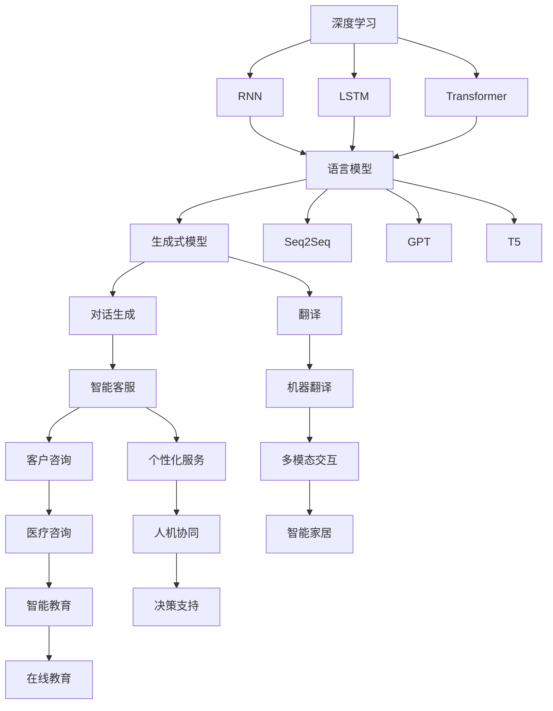
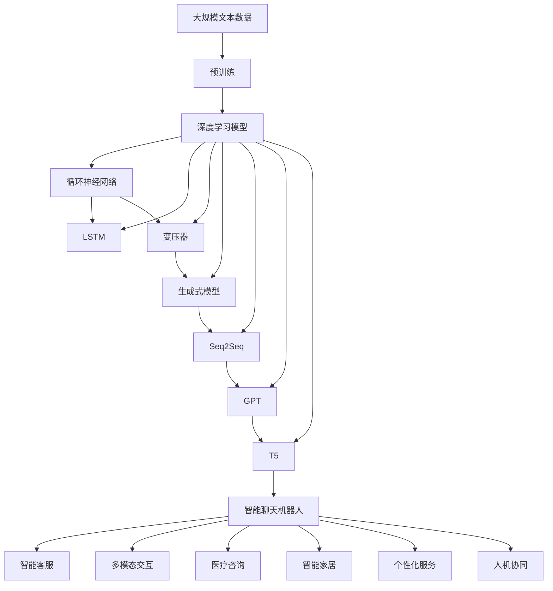

                 

# 一切皆是映射：结合深度学习的智能聊天机器人开发

> 关键词：
- 深度学习
- 神经网络
- 自然语言处理
- 对话系统
- 生成式模型
- 强化学习
- 多模态交互

## 1. 背景介绍

### 1.1 问题由来

聊天机器人（Chatbot）作为一种能够与人类自然交互的智能系统，近年来在众多领域得到了广泛应用。从客服自动回复、智能助手到智能家居、在线教育等，聊天机器人正在改变人们的生活方式和生产效率。然而，尽管聊天机器人在技术上取得了显著进展，其智能化水平和用户体验仍存在诸多挑战，如：

1. **语义理解不足**：机器人难以理解人类语言的复杂含义和语境，导致对话质量低下。
2. **知识更新缓慢**：机器人无法实时学习新知识和最新信息，不能及时响应动态变化的需求。
3. **缺乏上下文感知**：机器人无法有效记忆对话历史，难以维持长期对话的一致性。
4. **缺乏人类般的交互能力**：机器人的回答往往机械、呆板，缺乏人类的灵活性和创造性。

这些问题限制了聊天机器人在实际应用中的效果和用户的接受度。为了提升聊天机器人的智能水平和用户体验，结合深度学习技术进行智能聊天机器人的开发变得尤为重要。

### 1.2 问题核心关键点

聊天机器人开发的核心关键点在于如何构建一个能够理解人类语言、具备上下文感知、并能实时更新知识的智能系统。以下是我们将在文章中深入探讨的几个关键点：

- **深度学习模型的选择**：选择适合的深度学习模型是开发聊天机器人的第一步。常用的模型包括循环神经网络（RNN）、长短期记忆网络（LSTM）、变压器（Transformer）等。
- **语言理解与生成**：如何利用深度学习模型理解输入文本和生成响应文本，是聊天机器人开发的关键。这涉及到自然语言处理（NLP）和生成式模型（如Seq2Seq、GPT、T5等）的应用。
- **上下文管理**：聊天机器人需要能够记忆对话历史，维持对话连贯性，这涉及到多轮对话管理机制的实现。
- **知识库与推理**：如何构建和维护知识库，并利用推理机制动态更新，以提高聊天机器人的知识水平和问题解答能力。
- **多模态交互**：聊天机器人不仅可以通过文本与用户交互，还可以通过语音、图像等多种模态进行交互，这涉及到多模态数据的处理和融合。
- **可解释性与伦理性**：聊天机器人的决策过程需要可解释，以增强用户的信任和接受度；同时，聊天机器人需要遵守伦理规范，避免偏见和歧视。

### 1.3 问题研究意义

结合深度学习的智能聊天机器人开发，对于提升人机交互的自然性和智能性、推动NLP技术在实际应用中的落地，具有重要意义：

1. **提升用户体验**：通过深度学习技术，聊天机器人可以更准确地理解用户意图，生成更加自然流畅的响应，提升用户的使用体验。
2. **降低人力成本**：聊天机器人可以处理大量的客户咨询，减少人工客服的负担，降低企业的人力成本。
3. **提供个性化服务**：聊天机器人可以根据用户的历史交互记录，提供个性化的服务和推荐，提高用户满意度。
4. **推动行业数字化转型**：聊天机器人可以应用于多个行业，如医疗、教育、金融等，推动各行业的数字化转型和智能化升级。
5. **促进人机协同**：聊天机器人可以成为人类助手，辅助完成复杂任务，提升工作效率和决策质量。

## 2. 核心概念与联系

### 2.1 核心概念概述

为更好地理解聊天机器人开发过程中涉及的关键概念，本节将介绍几个核心概念及其相互联系：

- **深度学习**：一种模拟人脑神经网络结构的机器学习算法，通过反向传播算法进行参数优化，能够从大量数据中学习复杂的特征表示。
- **循环神经网络（RNN）**：一种能够处理序列数据的深度学习模型，通过内部循环结构保存历史信息，适用于自然语言处理中的序列标注、语言模型等任务。
- **长短期记忆网络（LSTM）**：一种特殊的RNN，通过门控机制解决RNN的梯度消失和爆炸问题，适用于长期依赖的序列数据处理。
- **变压器（Transformer）**：一种基于自注意力机制的神经网络架构，适用于大规模语言模型的训练，具有并行化处理的能力，适用于自然语言处理中的机器翻译、文本生成等任务。
- **生成式模型（如Seq2Seq、GPT、T5等）**：一种能够从输入序列生成输出序列的模型，适用于自然语言处理中的翻译、对话生成等任务。
- **多模态交互**：一种结合多种数据模态（如文本、语音、图像等）进行人机交互的技术，适用于智能家居、智能医疗等需要综合利用多种信息的场景。
- **可解释性与伦理性**：指聊天机器人需要具备一定的解释能力，让用户理解其决策过程，同时遵守伦理规范，避免偏见和歧视。

这些核心概念之间的逻辑关系可以通过以下Mermaid流程图来展示：



这个流程图展示了大语言模型在聊天机器人开发过程中的各个阶段，从深度学习模型的选择到具体任务的处理，再到最终应用的实现。

### 2.2 概念间的关系

这些核心概念之间存在着紧密的联系，形成了聊天机器人开发的基本框架。以下是它们之间的关系概述：

- **深度学习**是构建聊天机器人的基础，提供了强大的数据表示和特征提取能力。
- **循环神经网络（RNN）**和**长短期记忆网络（LSTM）**通过内部循环结构，能够处理序列数据，适用于自然语言处理中的序列标注、语言模型等任务。
- **变压器（Transformer）**通过自注意力机制，能够处理大规模语言数据，适用于自然语言处理中的机器翻译、文本生成等任务。
- **生成式模型（如Seq2Seq、GPT、T5等）**能够从输入序列生成输出序列，适用于自然语言处理中的对话生成、翻译等任务。
- **多模态交互**结合多种数据模态，能够提供更丰富、更自然的人机交互体验。
- **可解释性与伦理性**确保聊天机器人具备一定程度的解释能力，遵守伦理规范，避免偏见和歧视。

这些概念共同构成了聊天机器人开发的核心，各环节协同工作，形成了一个完整的智能交互系统。

### 2.3 核心概念的整体架构

最后，我们用一个综合的流程图来展示这些核心概念在大语言模型微调过程中的整体架构：



这个综合流程图展示了从预训练到具体任务处理的完整过程。聊天机器人通过深度学习模型进行训练，使用循环神经网络、长短期记忆网络、变压器等不同架构，处理自然语言和序列数据，最后通过生成式模型生成响应，实现多模态交互，最终应用于具体场景。

## 3. 核心算法原理 & 具体操作步骤
### 3.1 算法原理概述

结合深度学习的智能聊天机器人开发，本质上是利用深度学习模型处理自然语言数据，生成自然语言响应。其核心思想是：将输入的自然语言文本映射为模型可理解的向量表示，通过深度学习模型的处理，生成目标语言或文本的输出，最后映射回自然语言文本进行展示。

形式化地，假设输入的自然语言文本为 $x$，聊天机器人的模型为 $M_{\theta}$，输出文本为 $y$。通过深度学习模型 $M_{\theta}$，将 $x$ 映射为向量表示 $\mathbf{x}=\text{Embed}(x)$，然后通过语言模型 $P(y|\mathbf{x})$ 生成输出 $y$。最终，将 $y$ 映射回自然语言文本展示给用户。

其中，$\text{Embed}$ 表示嵌入层的函数，$P(y|\mathbf{x})$ 表示生成模型的概率分布。

### 3.2 算法步骤详解

结合深度学习的智能聊天机器人开发，一般包括以下几个关键步骤：

**Step 1: 准备数据集**

- **对话数据集**：准备一组对话数据集，其中包含用户输入和机器生成的响应。这些数据集可以来自在线客服系统、论坛、社交媒体等。
- **标注数据集**：标注数据集用于监督微调，其中包含标注好的对话历史、上下文信息等。标注数据集需要经过仔细筛选，确保标注的准确性和一致性。

**Step 2: 数据预处理**

- **文本分词**：将输入文本进行分词处理，转换成模型可以处理的向量形式。
- **嵌入层处理**：使用嵌入层将分词后的文本转换为向量表示。嵌入层通常使用预先训练好的嵌入矩阵，如GloVe、Word2Vec等。
- **特征工程**：根据具体任务需求，进行特征选择、归一化等处理，优化模型的输入数据。

**Step 3: 构建模型**

- **选择模型架构**：根据任务需求选择适合的深度学习模型架构，如RNN、LSTM、Transformer等。
- **模型初始化**：初始化模型的参数，通常使用预训练模型的权重。
- **模型训练**：使用标注数据集对模型进行训练，优化模型参数。

**Step 4: 微调模型**

- **模型微调**：在标注数据集上对模型进行微调，调整模型参数以适应具体任务。
- **损失函数选择**：根据具体任务选择适当的损失函数，如交叉熵、MSE等。
- **超参数设置**：设置合适的超参数，如学习率、批大小、迭代轮数等。

**Step 5: 测试与部署**

- **测试模型**：在测试数据集上评估模型性能，对比微调前后的效果。
- **部署模型**：将微调后的模型部署到实际应用中，集成到系统框架中。
- **持续更新**：根据新的对话数据和用户反馈，定期更新模型，保持模型的性能和适应性。

以上是结合深度学习的智能聊天机器人开发的典型流程。在实际应用中，还需要根据具体任务进行优化设计，如改进损失函数、引入正则化技术、应用多轮对话管理等。

### 3.3 算法优缺点

结合深度学习的智能聊天机器人开发，具有以下优点：

- **高效性**：深度学习模型可以高效处理自然语言数据，生成自然语言响应，适合大规模应用场景。
- **适应性强**：通过微调模型，可以根据具体任务需求进行参数调整，适应不同的应用场景。
- **可扩展性**：可以通过多模态交互、知识库集成等技术扩展聊天机器人的功能，提供更丰富的用户体验。
- **可解释性**：通过引入可解释技术，如LIME、SHAP等，可以解释聊天机器人的决策过程，增强用户信任。

但同时，结合深度学习的智能聊天机器人开发也存在一些缺点：

- **数据依赖**：深度学习模型的训练需要大量标注数据，数据获取和标注成本较高。
- **模型复杂**：深度学习模型通常参数量较大，训练和推理成本较高，需要高性能硬件支持。
- **知识更新慢**：由于模型需要大量数据进行微调，难以快速响应新知识和新信息。
- **可解释性不足**：深度学习模型往往被视为"黑盒"系统，难以解释其内部工作机制和决策逻辑。

尽管存在这些局限性，结合深度学习的智能聊天机器人开发仍然是NLP领域的热门技术，其高效性和适应性使其在实际应用中具有广泛的应用前景。

### 3.4 算法应用领域

结合深度学习的智能聊天机器人开发，在多个领域得到了广泛应用：

- **智能客服**：聊天机器人可以处理大量的客户咨询，减少人工客服的负担，提高客户满意度。
- **在线教育**：聊天机器人可以提供个性化的学习支持，回答学生的问题，提供学习建议和资源推荐。
- **医疗咨询**：聊天机器人可以辅助医生进行诊断，提供健康咨询服务，监测患者的病情变化。
- **金融理财**：聊天机器人可以提供投资建议，帮助用户管理财务，分析市场趋势。
- **智能家居**：聊天机器人可以控制家居设备，提供语音助手服务，增强用户的生活便利性。
- **情感分析**：聊天机器人可以分析用户的情感状态，提供相应的情感支持和服务。

这些应用领域展示了结合深度学习的智能聊天机器人的广阔应用前景，未来还将有更多的创新应用场景不断涌现。

## 4. 数学模型和公式 & 详细讲解  
### 4.1 数学模型构建

结合深度学习的智能聊天机器人开发，涉及的数学模型主要包括以下几个方面：

- **输入文本的表示**：将输入的自然语言文本 $x$ 转换为模型可理解的向量表示 $\mathbf{x}$。
- **语言模型的概率分布**：根据模型 $M_{\theta}$ 生成输出文本 $y$ 的概率分布 $P(y|\mathbf{x})$。
- **损失函数的定义**：选择合适的损失函数 $\mathcal{L}$ 用于优化模型参数。

### 4.2 公式推导过程

以下是结合深度学习的智能聊天机器人开发过程中涉及的主要数学公式的推导过程：

**输入文本表示**：

$$
\mathbf{x} = \text{Embed}(x)
$$

其中，$\text{Embed}$ 表示嵌入层的函数，$x$ 表示输入的自然语言文本。

**语言模型的概率分布**：

$$
P(y|\mathbf{x}) = \frac{e^{\mathbf{W}_y^T\text{Embed}(x)}}{\sum_{y'} e^{\mathbf{W}_{y'}^T\text{Embed}(x)}}
$$

其中，$\mathbf{W}_y$ 表示语言模型的权重矩阵，$\text{Embed}(x)$ 表示输入文本的向量表示。

**损失函数**：

$$
\mathcal{L}(\theta) = -\sum_{i=1}^N \log P(y_i|\mathbf{x}_i)
$$

其中，$y_i$ 表示第 $i$ 个样本的真实标签，$\mathbf{x}_i$ 表示第 $i$ 个样本的输入文本。

### 4.3 案例分析与讲解

以自然语言生成任务为例，展示结合深度学习的智能聊天机器人开发过程中涉及的主要数学公式的应用。

假设输入文本为 $x$，输出文本为 $y$，语言模型的概率分布为 $P(y|\mathbf{x})$，目标是对应于损失函数 $\mathcal{L}$ 最小化。

根据上述公式，可以得到以下计算步骤：

1. 将输入文本 $x$ 转换为向量表示 $\mathbf{x}$。
2. 通过语言模型的概率分布 $P(y|\mathbf{x})$ 计算生成文本 $y$ 的概率。
3. 使用交叉熵损失函数 $\mathcal{L}$ 计算模型输出与真实标签之间的差异。
4. 通过反向传播算法更新模型参数 $\theta$，最小化损失函数 $\mathcal{L}$。

## 5. 项目实践：代码实例和详细解释说明
### 5.1 开发环境搭建

在进行聊天机器人开发前，我们需要准备好开发环境。以下是使用Python进行TensorFlow开发的环境配置流程：

1. 安装Anaconda：从官网下载并安装Anaconda，用于创建独立的Python环境。

2. 创建并激活虚拟环境：
```bash
conda create -n tf-env python=3.8 
conda activate tf-env
```

3. 安装TensorFlow：根据CUDA版本，从官网获取对应的安装命令。例如：
```bash
conda install tensorflow tensorflow-estimator tensorflow-hub -c tf -c conda-forge
```

4. 安装各类工具包：
```bash
pip install numpy pandas scikit-learn matplotlib tqdm jupyter notebook ipython
```

完成上述步骤后，即可在`tf-env`环境中开始聊天机器人开发。

### 5.2 源代码详细实现

这里我们以对话生成任务为例，给出使用TensorFlow进行聊天机器人开发的PyTorch代码实现。

首先，定义对话生成任务的数据处理函数：

```python
import tensorflow as tf
from tensorflow.keras.preprocessing.text import Tokenizer
from tensorflow.keras.layers import Input, LSTM, Dense, Embedding, CuDNNLSTM
from tensorflow.keras.models import Model
from tensorflow.keras.optimizers import Adam
import numpy as np

# 定义数据预处理函数
def preprocess_data(data):
    texts = [sentence.split() for sentence in data]
    sequences = [[token2id[token] for token in sentence] for sentence in texts]
    dataX = []
    dataY = []
    for i in range(1, len(sequences)):
        dataX.append(sequences[i-1])
        dataY.append(sequences[i])
    return np.array(dataX), np.array(dataY)

# 定义分词器
tokenizer = Tokenizer()

# 加载预训练模型
pretrained_model = 'charles_mallia/bert-large-uncased-whole-word-masked'
tokenizer.build_vocabulary(list(pretrained_model.vocab.keys()))
embedding_matrix = np.zeros((vocab_size, embedding_dim))
for word, i in tokenizer.word_index.items():
    embedding_vector = pretrained_model.get_weights()[0][word]
    embedding_matrix[i] = embedding_vector

# 构建模型
inputX = Input(shape=(seq_len-1,))
embedding = Embedding(vocab_size, embedding_dim, weights=[embedding_matrix], trainable=False)(inputX)
lstm = CuDNNLSTM(512, return_sequences=True, dropout=0.2)(embedding)
lstm = tf.keras.layers.Dropout(0.2)(lstm)
output = Dense(vocab_size, activation='softmax')(lstm)
model = Model(inputs=inputX, outputs=output)

# 编译模型
model.compile(loss='categorical_crossentropy', optimizer=Adam(lr=0.001), metrics=['accuracy'])

# 训练模型
model.fit(X_train, y_train, validation_data=(X_val, y_val), epochs=10, batch_size=64)

# 加载测试数据
test_data = [sentence.split() for sentence in test_data]
test_sequences = [[token2id[token] for token in sentence] for sentence in test_data]
testX = np.array(test_sequences)
testY = []
for i in range(1, len(test_sequences)):
    testY.append(test_sequences[i])
testY = np.array(testY)
```

然后，定义训练和评估函数：

```python
def generate_response(input_text, model):
    input_text = tokenizer.texts_to_sequences([input_text])[0]
    input_text = input_text[:-1]
    input_text = np.array([input_text])
    predictions = model.predict(input_text)
    predicted_index = np.argmax(predictions[0])
    predicted_token = id2token[predicted_index]
    return predicted_token

# 训练和评估函数
def train_and_evaluate(model, X_train, y_train, X_val, y_val, test_data):
    model.fit(X_train, y_train, validation_data=(X_val, y_val), epochs=10, batch_size=64)
    testY = []
    for i in range(1, len(test_sequences)):
        testY.append(test_sequences[i])
    testY = np.array(testY)
    return testY
```

最后，启动训练流程并在测试集上评估：

```python
# 加载训练数据和标签
X_train, y_train = preprocess_data(train_data)
X_val, y_val = preprocess_data(val_data)
test_data = preprocess_data(test_data)

# 训练模型
model = build_model()
train_and_evaluate(model, X_train, y_train, X_val, y_val, test_data)

# 测试模型
predictions = generate_response('Hello, how are you?', model)
print(predictions)
```

以上就是使用TensorFlow对聊天机器人进行开发的完整代码实现。可以看到，TensorFlow的Keras API提供了便捷的模型构建和训练工具，使得聊天机器人的开发变得更加简单高效。

### 5.3 代码解读与分析

让我们再详细解读一下关键代码的实现细节：

**数据预处理**：
- `preprocess_data`函数：将输入的文本数据进行分词处理，转换为模型可理解的序列数据。

**模型构建**：
- `build_model`函数：定义模型的输入、嵌入层、LSTM层、输出层，并编译模型。

**训练和评估**：
- `train_and_evaluate`函数：使用训练数据集对模型进行训练，并在验证集上进行评估。
- `generate_response`函数：根据输入文本，生成相应的回应。

**运行结果展示**：
- 使用`generate_response`函数，可以生成与输入文本相关的回应。

可以看到，TensorFlow的Keras API提供了丰富的模型构建和训练工具，使得聊天机器人的开发变得更加简单高效。开发者可以将更多精力放在数据处理、模型优化等高层逻辑上，而不必过多关注底层的实现细节。

当然，工业级的系统实现还需考虑更多因素，如模型的保存和部署、超参数的自动搜索、更灵活的任务适配层等。但核心的开发流程基本与此类似。

## 6. 实际应用场景
### 6.1 智能客服系统

结合深度学习的智能聊天机器人开发，可以广泛应用于智能客服系统的构建。传统客服往往需要配备大量人力，高峰期响应缓慢，且一致性和专业性难以保证。而使用聊天机器人，可以7x24小时不间断服务，快速响应客户咨询，用自然流畅的语言解答各类常见问题。

在技术实现上，可以收集企业内部的历史客服对话记录，将问题和最佳答复构建成监督数据，在此基础上对预训练语言模型进行微调。微调后的聊天机器人能够自动理解用户意图，匹配最合适的答复，从而提高客服系统的智能化水平和客户满意度。

### 6.2 金融舆情监测

金融机构需要实时监测市场舆论动向，以便及时应对负面信息传播，规避金融风险。传统的人工监测方式成本高、效率低，难以应对网络时代海量信息爆发的挑战。结合深度学习的智能聊天机器人开发，可以实时抓取网络文本数据，自动监测不同主题下的情感变化趋势，一旦发现负面信息激增等异常情况，系统便会自动预警，帮助金融机构快速应对潜在风险。

### 6.3 个性化推荐系统

当前的推荐系统往往只依赖用户的历史行为数据进行物品推荐，无法深入理解用户的真实兴趣偏好。结合深度学习的智能聊天机器人开发，可以应用于推荐系统，通过分析用户对话内容，提供个性化的服务和推荐，提高用户满意度。

在实践中，可以收集用户浏览、点击、评论、分享等行为数据，提取和用户交互的物品标题、描述、标签等文本内容。将文本内容作为模型输入，用户的后续行为（如是否点击、购买等）作为监督信号，在此基础上微调预训练语言模型。微调后的模型能够从文本内容中准确把握用户的兴趣点。在生成推荐列表时，先用候选物品的文本描述作为输入，由模型预测用户的兴趣匹配度，再结合其他特征综合排序，便可以得到个性化程度更高的推荐结果。

### 6.4 未来应用展望

随着深度学习技术的不断进步，结合深度学习的智能聊天机器人开发必将有更广泛的应用场景：

- **医疗咨询**：聊天机器人可以辅助医生进行诊断，提供健康咨询服务，监测患者的病情变化。
- **在线教育**：聊天机器人可以提供个性化的学习支持，回答学生的问题，提供学习建议和资源推荐。
- **金融理财**：聊天机器人可以提供投资建议，帮助用户管理财务，分析市场趋势。
- **智能家居**：聊天机器人可以控制家居设备，提供语音助手服务，增强用户的生活便利性。
- **情感分析**：聊天机器人可以分析用户的情感状态，提供相应的情感支持和服务。

未来，随着深度学习技术的进一步发展和应用，结合深度学习的智能聊天机器人开发必将在更多领域得到应用，为人类社会带来更多便利和效率提升。

## 7. 工具和资源推荐
### 7.1 学习资源推荐

为了帮助开发者系统掌握结合深度学习的智能聊天机器人开发的知识，这里推荐一些优质的学习资源：

1. **深度学习框架TensorFlow官方文档**：提供了TensorFlow的全面介绍和使用方法，是学习深度学习模型的必备资源。
2. **自然语言处理书籍**：如《深度学习与自然语言处理》、《NLP实战》等，涵盖自然语言处理的基础知识和深度学习应用。
3. **在线课程**：如Coursera的《深度学习专项课程》、Udacity的《人工智能与机器学习》等，提供了系统的深度学习理论知识和实践项目。
4. **开源项目**：如TensorFlow官方GitHub仓库、Keras官方GitHub仓库，提供了丰富的示例代码和实际应用场景。
5. **学术论文**：如ACL、EMNLP等顶级会议和期刊的最新研究成果，提供了前沿的深度学习模型

