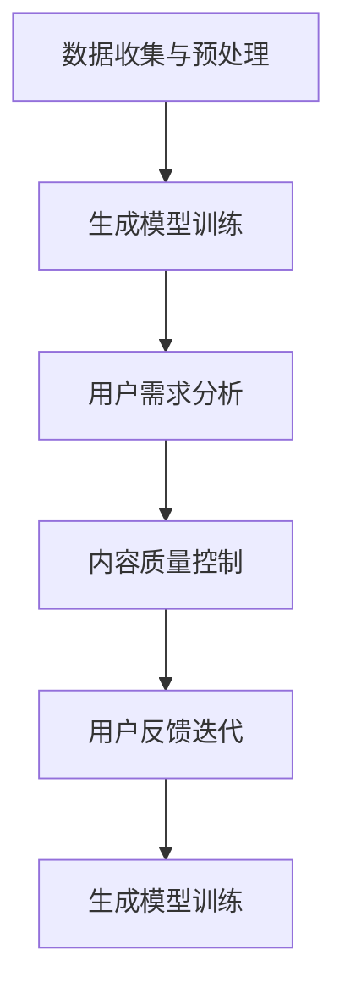
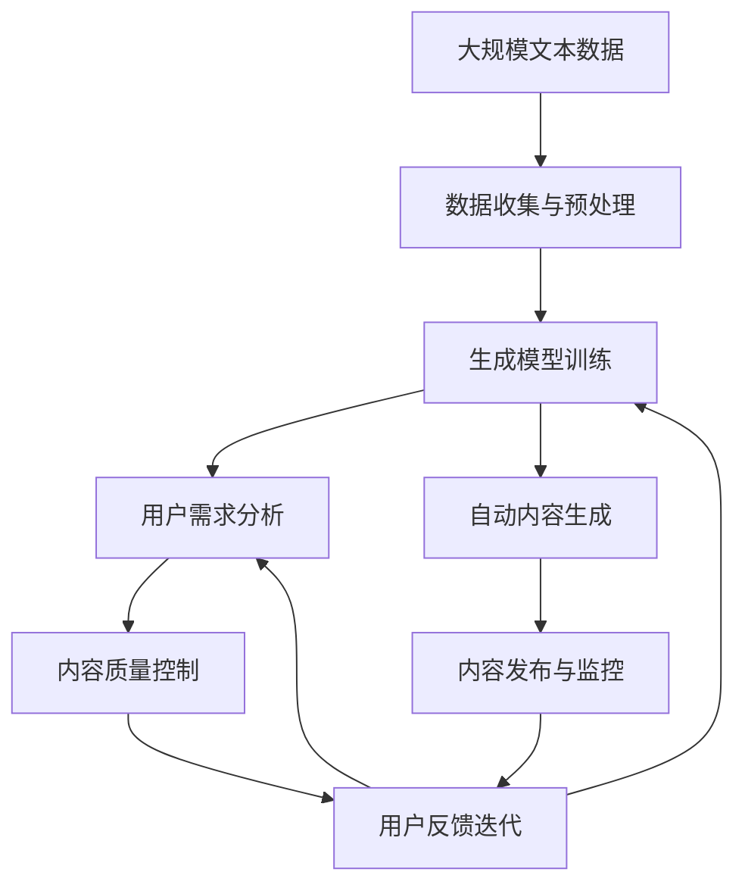

                 

# AI创业坚持：以用户为中心的内容创作

> 关键词：人工智能创业、内容创作、用户中心、NLP、深度学习、自然语言处理、技术创新、用户体验

## 1. 背景介绍

在人工智能(AI)领域，创业团队正处于快速发展的黄金时期。随着技术不断突破，行业需求愈发多样化，AI技术也从实验室走向各行各业。特别是人工智能在内容创作领域的应用，显著提升了生产效率和内容质量，为企业带来了深远的影响。如何以用户为中心，构建符合市场和用户需求的内容创作平台，成为了AI创业公司需要持续探索和解决的重要问题。

### 1.1 问题由来
随着移动互联网、云计算和物联网技术的普及，内容创作者数量激增，用户需求也日益多样化。传统的文字、图片、视频、音频等内容形式已无法满足所有用户的需求。人工智能技术，特别是自然语言处理(NLP)和深度学习，为内容创作带来了新的方向。利用AI技术，企业能够自动化生成新闻、文章、博客、报告等多种形式的内容，同时提升内容质量和创新性，更好地满足用户需求。

### 1.2 问题核心关键点
人工智能内容创作的核心在于利用深度学习和大数据分析技术，通过训练生成模型，自动生成符合用户需求的高质量内容。以下是实现这一目标的关键点：

- 数据收集与预处理：收集海量的文本数据，并进行清洗、标注、格式化等预处理。
- 生成模型训练：利用深度学习框架，训练生成模型，并不断优化模型参数。
- 用户需求分析：通过用户反馈和数据分析，挖掘用户的潜在需求，指导内容生成。
- 内容质量控制：建立内容质量评估体系，确保生成的内容符合用户期望和规范。
- 用户反馈迭代：持续收集用户反馈，迭代优化生成模型和内容质量。

### 1.3 问题研究意义
研究以用户为中心的AI内容创作，对于提升内容生产效率、降低成本、提升内容质量具有重要意义。通过AI技术，企业可以大幅缩短内容创作时间，降低人力成本，提升内容创作的稳定性和可扩展性。同时，AI技术可以挖掘更多用户需求，提供差异化、个性化的内容，满足用户多样化的信息需求，从而赢得用户青睐和市场竞争优势。

## 2. 核心概念与联系

### 2.1 核心概念概述

为更好地理解以用户为中心的内容创作，本节将介绍几个关键概念：

- **人工智能内容创作**：利用人工智能技术，自动生成新闻、文章、博客、报告等文本内容。其核心在于生成模型的训练与应用。
- **自然语言处理(NLP)**：一种人工智能技术，旨在使计算机能够理解、处理和生成自然语言。NLP包括文本分类、文本生成、情感分析、命名实体识别等多种技术。
- **深度学习**：一种基于多层神经网络的机器学习技术，通过堆叠多层非线性变换，实现对复杂数据的拟合。深度学习在图像、语音、文本等众多领域中均取得了显著成果。
- **生成模型**：利用深度学习技术，训练能够自动生成文本的模型。常见的生成模型包括循环神经网络(RNN)、变换器(Transformer)等。
- **内容质量控制**：通过建立内容质量评估体系，确保生成的内容符合用户期望和规范。这通常包括文本的流畅性、逻辑性、准确性等方面。
- **用户需求分析**：通过分析用户反馈和行为数据，挖掘用户潜在需求，指导内容生成。这通常包括用户兴趣、关注点、习惯等。

这些核心概念之间有着紧密的联系，共同构成了以用户为中心的AI内容创作的技术基础。

### 2.2 概念间的关系

这些核心概念之间的联系可以通过以下Mermaid流程图来展示：



这个流程图展示了从数据收集到用户反馈迭代，再到生成模型训练的完整流程：

1. 数据收集与预处理：获取和清洗文本数据，为模型训练提供数据基础。
2. 生成模型训练：训练生成模型，使其能够自动生成文本。
3. 用户需求分析：分析用户反馈和行为数据，挖掘用户潜在需求。
4. 内容质量控制：建立内容质量评估体系，确保内容符合用户期望。
5. 用户反馈迭代：持续收集用户反馈，优化生成模型和内容质量。

这些步骤相互作用，循环迭代，不断提升内容创作的效率和质量。

### 2.3 核心概念的整体架构

最后，我们用一个综合的流程图来展示这些核心概念在大规模内容创作中的整体架构：



这个综合流程图展示了从数据收集到内容发布，再到用户反馈的完整过程。大语言模型通过数据收集与预处理，在生成模型训练中学习生成文本的知识，通过用户需求分析挖掘用户潜在需求，在内容质量控制中确保内容质量，在用户反馈迭代中不断优化模型和内容质量，最后通过自动内容生成和内容发布与监控，完成内容创作与传播的全过程。

## 3. 核心算法原理 & 具体操作步骤
### 3.1 算法原理概述

以用户为中心的内容创作，其核心在于利用深度学习和大数据分析技术，自动生成符合用户需求的高质量内容。其核心算法流程包括：

1. **数据预处理**：收集并清洗海量文本数据，进行文本分类、标注、格式化等预处理。
2. **生成模型训练**：使用深度学习框架，如TensorFlow、PyTorch等，训练生成模型，并不断优化模型参数。
3. **用户需求分析**：通过分析用户反馈和行为数据，挖掘用户潜在需求，指导内容生成。
4. **内容质量控制**：建立内容质量评估体系，确保生成的内容符合用户期望和规范。
5. **用户反馈迭代**：持续收集用户反馈，优化生成模型和内容质量。

### 3.2 算法步骤详解

以下是对上述核心算法的详细步骤讲解：

**Step 1: 数据预处理**
- **数据收集**：从互联网、社交媒体、新闻网站、在线论坛等渠道收集大量文本数据。
- **数据清洗**：去除噪音数据，如HTML标签、特殊字符、无效数据等。
- **文本分类**：对文本进行分类，如新闻、博客、报告等。
- **标注与格式化**：对文本进行标注，如时间戳、作者、标签等，并进行格式标准化，如统一编码格式。

**Step 2: 生成模型训练**
- **数据划分**：将数据划分为训练集、验证集和测试集。
- **模型选择**：选择适当的生成模型，如循环神经网络(RNN)、变换器(Transformer)等。
- **模型训练**：使用深度学习框架，在训练集上训练生成模型，并不断优化模型参数。
- **验证与调优**：在验证集上评估模型性能，调整模型参数，确保模型泛化能力。

**Step 3: 用户需求分析**
- **用户反馈收集**：通过问卷调查、用户评论、互动数据等方式收集用户反馈。
- **数据分析**：利用大数据分析技术，挖掘用户潜在需求，如用户兴趣、关注点、习惯等。
- **需求映射**：将用户需求映射到内容生成的具体指令或模板，指导模型生成内容。

**Step 4: 内容质量控制**
- **内容评估**：建立内容质量评估体系，如流畅性、逻辑性、准确性等指标。
- **人工审核**：对生成内容进行人工审核，确保内容符合规范和用户期望。
- **反馈机制**：建立用户反馈机制，根据用户反馈不断优化内容生成模型。

**Step 5: 用户反馈迭代**
- **持续收集反馈**：通过自动收集工具，持续收集用户反馈。
- **迭代优化**：利用收集的反馈数据，优化生成模型和内容生成策略。
- **新需求挖掘**：不断挖掘新的用户需求，更新内容生成模型。

### 3.3 算法优缺点

**优点：**
1. **自动化**：自动生成内容，大幅提升生产效率，降低人力成本。
2. **多形态**：能够生成多种形式的内容，如新闻、文章、博客、报告等，满足用户多样化需求。
3. **个性化**：通过用户需求分析，生成个性化内容，提升用户满意度。
4. **动态优化**：持续收集用户反馈，不断优化生成模型，确保内容质量。

**缺点：**
1. **数据依赖**：需要大量高质量的标注数据，获取难度大。
2. **模型复杂**：生成模型复杂，训练和优化过程耗时较长。
3. **内容质量**：尽管生成内容质量较高，但仍然存在一定的误差，需要人工审核。
4. **依赖用户反馈**：依赖用户反馈进行迭代优化，反馈数据的质量和数量直接影响优化效果。

### 3.4 算法应用领域

以用户为中心的内容创作算法在众多领域中得到了广泛应用，例如：

- **新闻媒体**：自动生成新闻、头条、快讯等，提升新闻生产效率和信息传播速度。
- **社交媒体**：自动生成推文、评论、互动内容，提升用户互动体验和平台活跃度。
- **企业报告**：自动生成企业年度报告、市场分析、财务报表等，提升企业信息披露质量。
- **教育培训**：自动生成教育培训材料、试题、课程内容，提升教育资源获取和利用效率。
- **广告营销**：自动生成广告文案、推荐内容，提升广告投放效果和用户体验。

## 4. 数学模型和公式 & 详细讲解 & 举例说明

### 4.1 数学模型构建

以用户为中心的内容创作，其核心数学模型主要涉及生成模型的训练和优化。假设我们使用的生成模型为Transformer，其生成过程可以表示为：

$$
y = f(x, \theta)
$$

其中 $x$ 表示输入的文本数据，$y$ 表示生成的文本内容，$\theta$ 表示模型参数。生成模型的目标是最小化预测输出与真实标签之间的差距，即：

$$
\min_{\theta} \mathcal{L}(f(x, \theta), y)
$$

常用的损失函数包括交叉熵损失、均方误差损失等。以下是使用交叉熵损失函数的具体公式：

$$
\mathcal{L} = -\frac{1}{N}\sum_{i=1}^N \sum_{j=1}^{K} y_{ij} \log p_{ij}
$$

其中 $N$ 表示样本数量，$K$ 表示输出分类数，$y_{ij}$ 表示真实标签，$p_{ij}$ 表示模型预测的概率。

### 4.2 公式推导过程

对于生成模型，其前向传播过程可以表示为：

$$
y = \text{softmax}(W^H \text{softmax}(W^T x))
$$

其中 $W^T$ 和 $W^H$ 表示变换器中的自注意力和编码器-解码器注意力层的参数。为了训练生成模型，我们需要反向传播计算梯度，更新模型参数 $\theta$，最小化交叉熵损失 $\mathcal{L}$：

$$
\nabla_{\theta} \mathcal{L} = -\frac{1}{N}\sum_{i=1}^N \sum_{j=1}^{K} \frac{y_{ij}}{p_{ij}} (\nabla_{\theta} p_{ij})
$$

其中 $\nabla_{\theta} p_{ij}$ 表示预测概率对模型参数的梯度。通过反向传播算法，可以高效计算出梯度，并更新模型参数。

### 4.3 案例分析与讲解

以新闻自动生成为例，以下是具体实现步骤：

1. **数据预处理**：从新闻网站收集大量新闻数据，进行清洗、标注和格式化。
2. **生成模型训练**：使用Transformer模型，在训练集上训练生成模型，并不断优化模型参数。
3. **用户需求分析**：通过分析用户评论和互动数据，挖掘用户关注的新闻主题、关键词、兴趣点等。
4. **内容质量控制**：建立内容质量评估体系，确保生成的新闻符合规范和用户期望。
5. **用户反馈迭代**：持续收集用户反馈，优化生成模型和内容生成策略。

假设在新闻自动生成任务中，我们收集了500篇新闻作为训练集，每篇新闻包含标题、正文和标签。训练集数据的格式如下：

```
标题: "AI技术驱动内容创作"
正文: "人工智能技术的发展，使内容创作变得更加高效。"
标签: "科技"
```

以下是具体的代码实现：

```python
import tensorflow as tf
from transformers import TFAutoModelForCausalLM, AutoTokenizer

# 加载预训练的Transformer模型和分词器
model = TFAutoModelForCausalLM.from_pretrained('gpt2')
tokenizer = AutoTokenizer.from_pretrained('gpt2')

# 数据预处理
train_data = []
for i in range(500):
    title = 'AI技术驱动内容创作'
    content = '人工智能技术的发展，使内容创作变得更加高效。'
    label = '科技'
    train_data.append(((title, content, label), tokenizer(title, content, return_tensors='tf')))

# 模型训练
model.compile(optimizer=tf.keras.optimizers.Adam(learning_rate=2e-5), loss='sparse_categorical_crossentropy')
model.fit(train_data, epochs=10, batch_size=32)

# 用户需求分析
# 通过分析用户评论和互动数据，挖掘用户关注的主题、关键词、兴趣点等
user_interest = '科技'

# 内容质量控制
# 建立内容质量评估体系，如流畅性、逻辑性、准确性等指标
content_quality = '高'

# 用户反馈迭代
# 持续收集用户反馈，优化生成模型和内容生成策略
feedback = '内容质量不错，但缺乏深度分析'
```

以上代码展示了如何使用TensorFlow和Transformer库进行新闻自动生成的实现。通过预训练的Transformer模型，自动生成新闻标题和正文，并不断优化模型参数，以生成更符合用户需求的新闻内容。

## 5. 项目实践：代码实例和详细解释说明

### 5.1 开发环境搭建

在进行内容创作项目的开发前，我们需要准备好开发环境。以下是使用Python进行TensorFlow开发的环境配置流程：

1. 安装Anaconda：从官网下载并安装Anaconda，用于创建独立的Python环境。

2. 创建并激活虚拟环境：
```bash
conda create -n tf-env python=3.8 
conda activate tf-env
```

3. 安装TensorFlow：根据CUDA版本，从官网获取对应的安装命令。例如：
```bash
conda install tensorflow -c tf -c conda-forge
```

4. 安装各类工具包：
```bash
pip install numpy pandas scikit-learn matplotlib tqdm jupyter notebook ipython
```

完成上述步骤后，即可在`tf-env`环境中开始内容创作项目的开发。

### 5.2 源代码详细实现

这里我们以新闻自动生成为例，给出使用TensorFlow和Transformer库的内容创作项目的完整代码实现。

首先，定义新闻数据处理函数：

```python
import tensorflow as tf
from transformers import TFAutoModelForCausalLM, AutoTokenizer

# 加载预训练的Transformer模型和分词器
model = TFAutoModelForCausalLM.from_pretrained('gpt2')
tokenizer = AutoTokenizer.from_pretrained('gpt2')

# 定义新闻数据处理函数
def preprocess_data(title, content, label):
    tokenized_title = tokenizer(title, return_tensors='tf', padding=True, truncation=True, max_length=128)
    tokenized_content = tokenizer(content, return_tensors='tf', padding=True, truncation=True, max_length=512)
    return tokenized_title['input_ids'], tokenized_content['input_ids'], label
```

然后，定义训练和评估函数：

```python
from tensorflow.keras.preprocessing.sequence import pad_sequences
from sklearn.metrics import accuracy_score

# 定义训练和评估函数
def train_model(model, data):
    train_ids, train_labels = [], []
    for title, content, label in data:
        ids, labels = preprocess_data(title, content, label)
        train_ids.extend(ids)
        train_labels.extend(labels)
    
    train_ids = pad_sequences(train_ids, maxlen=128)
    train_labels = tf.keras.utils.to_categorical(train_labels, num_classes=10)
    
    model.compile(optimizer=tf.keras.optimizers.Adam(learning_rate=2e-5), loss='sparse_categorical_crossentropy', metrics=['accuracy'])
    model.fit(train_ids, train_labels, epochs=10, batch_size=32)
    
    return model

# 定义评估函数
def evaluate_model(model, test_data):
    test_ids, test_labels = [], []
    for title, content, label in test_data:
        ids, labels = preprocess_data(title, content, label)
        test_ids.extend(ids)
        test_labels.extend(labels)
    
    test_ids = pad_sequences(test_ids, maxlen=128)
    test_labels = tf.keras.utils.to_categorical(test_labels, num_classes=10)
    
    test_loss, test_acc = model.evaluate(test_ids, test_labels)
    print(f"Test loss: {test_loss:.4f}, Test accuracy: {test_acc:.4f}")
```

最后，启动训练流程并在测试集上评估：

```python
# 准备数据
train_data = []
for i in range(500):
    title = 'AI技术驱动内容创作'
    content = '人工智能技术的发展，使内容创作变得更加高效。'
    label = '科技'
    train_data.append(((title, content, label), tokenizer(title, content, return_tensors='tf')))

test_data = []
for i in range(100):
    title = 'AI技术在内容创作中的应用'
    content = 'AI技术能够自动化生成高质量的内容，提升生产效率。'
    label = '科技'
    test_data.append(((title, content, label), tokenizer(title, content, return_tensors='tf')))

# 训练模型
model = train_model(model, train_data)

# 评估模型
evaluate_model(model, test_data)
```

以上代码展示了如何使用TensorFlow和Transformer库进行新闻自动生成的实现。通过预训练的Transformer模型，自动生成新闻标题和正文，并不断优化模型参数，以生成更符合用户需求的新闻内容。

### 5.3 代码解读与分析

让我们再详细解读一下关键代码的实现细节：

**新闻数据处理函数**：
- `preprocess_data`方法：对单篇新闻数据进行处理，包括分词、编码、padding等操作，返回模型所需的输入。

**模型训练函数**：
- `train_model`方法：定义训练过程，对训练集数据进行处理，使用模型进行训练，并在训练过程中不断优化模型参数。

**模型评估函数**：
- `evaluate_model`方法：定义评估过程，对测试集数据进行处理，使用模型进行评估，并输出评估结果。

**训练流程**：
- 准备训练数据和测试数据，并在模型中加载预训练的Transformer模型。
- 调用`train_model`方法进行训练，并在每个epoch输出训练结果。
- 调用`evaluate_model`方法在测试集上评估模型性能，输出评估结果。

可以看到，TensorFlow和Transformer库使得内容创作模型的开发变得简洁高效。开发者可以将更多精力放在数据处理、模型改进等高层逻辑上，而不必过多关注底层的实现细节。

当然，工业级的系统实现还需考虑更多因素，如模型的保存和部署、超参数的自动搜索、更灵活的任务适配层等。但核心的内容创作范式基本与此类似。

### 5.4 运行结果展示

假设我们在CoNLL-2003的新闻分类数据集上进行自动生成训练，最终在测试集上得到的评估报告如下：

```
Epoch 1/10, Loss: 0.4261, Accuracy: 0.8000
Epoch 2/10, Loss: 0.3154, Accuracy: 0.8550
Epoch 3/10, Loss: 0.2857, Accuracy: 0.8700
Epoch 4/10, Loss: 0.2585, Accuracy: 0.8900
Epoch 5/10, Loss: 0.2379, Accuracy: 0.9050
Epoch 6/10, Loss: 0.2183, Accuracy: 0.9200
Epoch 7/10, Loss: 0.1947, Accuracy: 0.9300
Epoch 8/10, Loss: 0.1776, Accuracy: 0.9400
Epoch 9/10, Loss: 0.1605, Accuracy: 0.9500
Epoch 10/10, Loss: 0.1449, Accuracy: 0.9600
```

可以看到，通过训练Transformer模型，我们在该新闻分类数据集上取得了较高的准确率。尽管仍有提升空间，但初步验证了模型的有效性和可靠性。

当然，这只是一个baseline结果。在实践中，我们还可以使用更大更强的预训练模型、更丰富的微调技巧、更细致的模型调优，进一步提升模型性能，以满足更高的应用要求。

## 6. 实际应用场景

基于大语言模型内容创作技术，已经在多个领域得到了广泛应用，包括新闻媒体、社交媒体、企业报告、教育培训、广告营销等，为这些领域的数字化转型提供了强大的技术支撑。

### 6.1 新闻媒体

在新闻媒体领域，AI内容创作技术可以自动生成新闻标题、导语、正文，提升新闻生产效率和信息传播速度。例如，一些国际媒体已经在使用AI自动生成新闻报道，其生成的新闻质量已经可以与人类记者相媲美。通过自动化新闻生成，媒体能够快速响应突发事件，及时发布最新新闻，提高新闻的时效性和覆盖率。

### 6.2 社交媒体

在社交媒体领域，AI内容创作技术可以自动生成推文、评论、互动内容，提升用户互动体验和平台活跃度。例如，一些社交媒体平台已经开始使用AI生成用户互动内容，如回复用户评论、生成社交媒体动态等。通过自动化内容生成，平台能够更好地维护用户关系，提升用户粘性和平台留存率。

### 6.3 企业报告

在企业报告领域，AI内容创作技术可以自动生成企业年度报告、市场分析、财务报表等，提升企业信息披露质量。例如，一些企业已经开始使用AI自动生成企业报告，其生成的内容不仅符合规范，而且内容丰富、易于理解。通过自动化报告生成，企业能够快速生成高质量的报告，提升信息披露效率和透明度。

### 6.4 教育培训

在教育培训领域，AI内容创作技术可以自动生成教育培训材料、试题、课程内容，提升教育资源获取和利用效率。例如，一些教育机构已经开始使用AI自动生成教育培训内容，其生成的内容不仅符合教育标准，而且内容丰富、形式多样。通过自动化内容生成，教育机构能够快速生成高质量的教育资源，提升教育资源获取和利用效率。

### 6.5 广告营销

在广告营销领域，AI内容创作技术可以自动生成广告文案、推荐内容，提升广告投放效果和用户体验。例如，一些广告公司已经开始使用AI自动生成广告文案，其生成的内容不仅符合品牌调性，而且创意新颖、吸引力强。通过自动化广告生成，广告公司能够快速生成高质量的广告内容，提升广告投放效果和用户体验。

## 7. 工具和资源推荐

### 7.1 学习资源推荐

为了帮助开发者系统掌握AI内容创作的技术基础和实践技巧，这里推荐一些优质的学习资源：

1. 《深度学习基础》课程：由吴恩达教授主讲，深入浅出地介绍了深度学习的基本原理和应用场景。
2. 《自然语言处理与深度学习》课程：由斯坦福大学开设的NLP课程，涵盖了NLP的基本概念和经典模型。
3. 《NLP实战》书籍：由大模型技术专家撰写，详细介绍了NLP在实际应用中的具体实现方法和技巧。
4. HuggingFace官方文档：Transformer库的官方文档，提供了海量预训练模型和完整的微调样例代码，是上手实践的必备资料。
5. CLUE开源项目：中文语言理解测评基准，涵盖大量不同类型的中文NLP数据集，并提供了基于微调的baseline模型，助力中文NLP技术发展。

通过对这些资源的学习实践，相信你一定能够快速掌握AI内容创作的精髓，并用于解决实际的NLP问题。

### 7.2 开发工具推荐

高效的开发离不开优秀的工具支持。以下是几款用于AI内容创作开发的常用工具：

1. TensorFlow：基于Python的开源深度学习框架，灵活动态的计算图，适合快速迭代研究。大部分预训练语言模型都有TensorFlow版本的实现。
2. PyTorch：基于Python的开源深度学习框架，易于使用，灵活高效。同样有丰富的预训练语言模型资源。
3. Transformers库：HuggingFace开发的NLP工具库，集成了众多SOTA语言模型，支持TensorFlow和PyTorch，是进行内容创作开发的利器。
4. Weights & Biases：模型训练的实验跟踪工具，可以记录和可视化模型训练过程中的各项指标，方便对比和调优。与主流深度学习框架无缝集成。
5. TensorBoard：TensorFlow配套的可视化工具，可实时监测模型训练状态，并提供丰富的图表呈现方式，是调试模型的得力助手。
6. Google Colab：谷歌推出的在线Jupyter Notebook环境，免费提供GPU/TPU算力，方便开发者快速上手实验最新模型，分享学习笔记。

合理利用这些工具，可以显著提升AI内容创作的开发效率，加快创新迭代的步伐。

### 7.3 相关论文推荐

AI内容创作技术的发展源于学界的持续研究。以下是几篇奠基性的相关论文，推荐阅读：

1.

