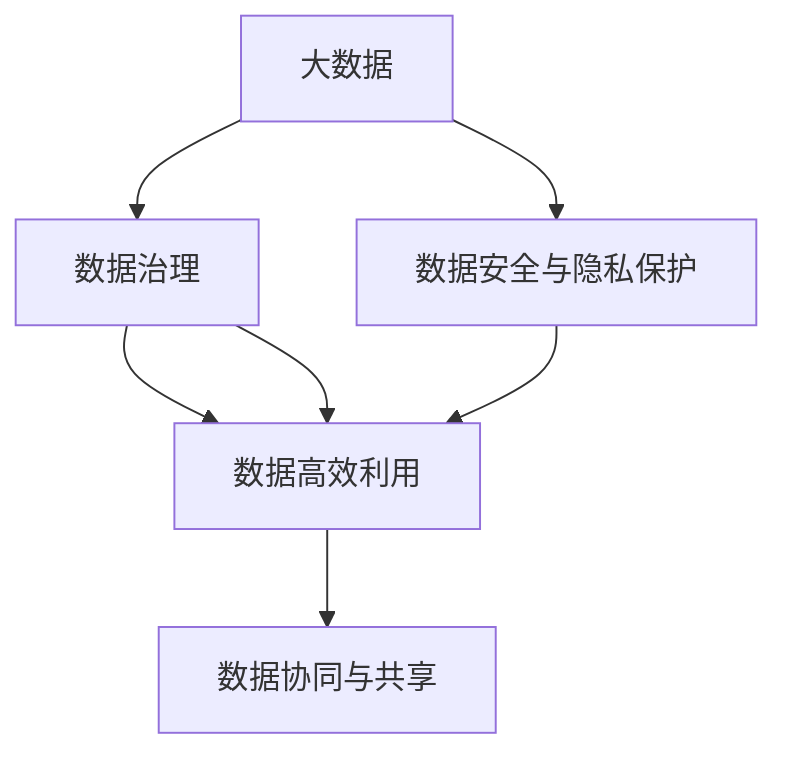
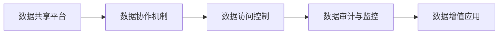
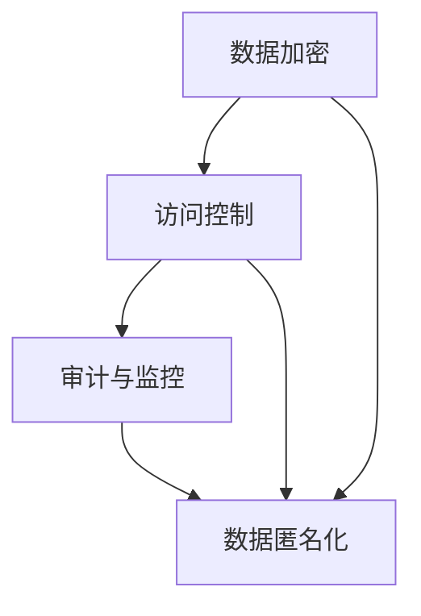
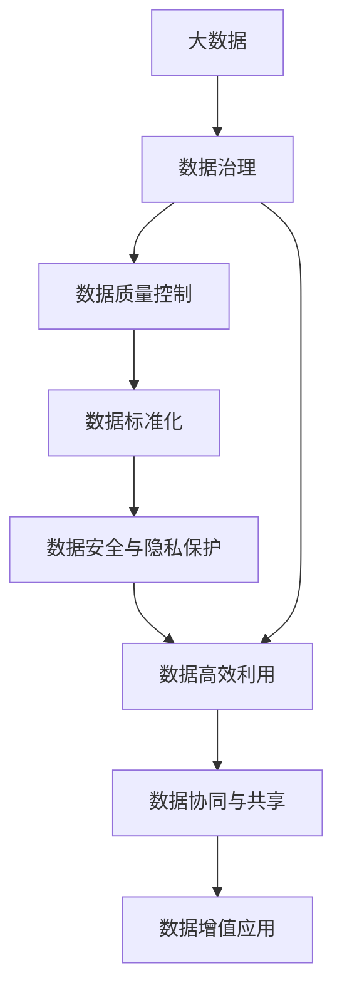

                 

# AI创业：数据管理的实用指南

> 关键词：AI创业,数据管理,数据治理,大数据,云计算

## 1. 背景介绍

### 1.1 问题由来

在人工智能(AI)创业领域，数据管理是成功与否的关键。一方面，AI模型的训练和预测性能依赖于高质量、丰富多样的大数据集；另一方面，随着AI应用的深入，数据的安全、隐私和合规问题愈发重要。但传统的数据管理方式无法满足AI项目的高效和合规需求，这就需要一种新型的数据管理思路。本文将全面探讨AI创业中数据管理的策略和方法，以期为创业者提供实用的指南。

### 1.2 问题核心关键点

AI创业中，数据管理的核心在于以下几个方面：

- **数据质量管理**：保证数据的准确性、完整性、一致性和可靠性。
- **数据治理和合规**：确保数据符合法规要求，如GDPR、CCPA等。
- **数据安全与隐私保护**：防范数据泄露和滥用，保障用户隐私。
- **数据高效利用**：提升数据利用效率，加速AI模型训练和预测。
- **数据协同与共享**：促进跨部门、跨组织的数据协同，实现数据共享与增值。

这些核心点共同构成了AI创业中数据管理的框架，本文将围绕这些关键点，系统介绍数据管理的策略和方法。

### 1.3 问题研究意义

数据管理对AI创业的成功至关重要，其重要性体现在以下几个方面：

1. **提升模型性能**：高质量的数据能够显著提升AI模型的训练和预测性能，使其更准确、更稳定。
2. **保障合规性**：合理的数据治理和合规管理，可以规避法律风险，保护企业和用户的安全。
3. **促进创新**：通过数据共享和协同，加速知识创新和应用落地，推动AI技术的迭代升级。
4. **降低成本**：通过优化数据管理和利用流程，减少重复数据处理和存储成本，提升运营效率。
5. **增强竞争优势**：优质的数据管理能够成为企业的重要竞争资产，吸引人才和投资。

## 2. 核心概念与联系

### 2.1 核心概念概述

在进行数据管理之前，首先需要理解几个核心概念：

- **大数据(Big Data)**：指的是体量大、类型多、速度快的结构化与非结构化数据。
- **数据治理(Data Governance)**：通过制定数据标准、监控数据质量和合规性，确保数据的完整性和可靠性。
- **数据安全与隐私保护**：采取加密、访问控制、审计等手段，防止数据泄露和滥用，保障用户隐私。
- **数据高效利用**：通过数据清洗、数据增强、数据挖掘等技术，提升数据的价值和利用效率。
- **数据协同与共享**：通过建立数据共享平台、跨部门协作机制，实现数据的有效管理和增值。

这些概念之间的关系可以通过以下Mermaid流程图来展示：



### 2.2 概念间的关系

这些核心概念之间存在着紧密的联系，形成了数据管理的完整生态系统。下面我通过几个Mermaid流程图来展示这些概念之间的关系。

#### 2.2.1 数据治理与大数据的关系


大数据需要通过数据治理进行质量控制和标准化，从而保证数据的准确性和一致性，同时满足数据安全与隐私保护的要求。

#### 2.2.2 数据协同与共享的流程



数据共享平台通过建立协作机制和访问控制，实现数据的高效管理和利用。同时，数据审计与监控保障了数据使用的合规性和安全性，从而实现数据的增值应用。

#### 2.2.3 数据安全与隐私保护的策略



数据安全与隐私保护采用加密、访问控制、审计与监控等手段，防止数据泄露和滥用。同时，数据匿名化技术可以保护用户隐私，避免敏感数据被识别。

### 2.3 核心概念的整体架构

最后，我们用一个综合的流程图来展示这些核心概念在大数据管理中的整体架构：



这个综合流程图展示了从数据采集、处理、治理、利用到增值应用的全过程，体现了大数据管理的多层次、多维度特点。

## 3. 核心算法原理 & 具体操作步骤
### 3.1 算法原理概述

数据管理的核心算法原理主要包括以下几个方面：

- **数据质量控制**：通过数据清洗、去重、修正等方法，保证数据的准确性和一致性。
- **数据标准化**：定义数据格式和标准，确保数据的规范性和可比性。
- **数据加密与匿名化**：采用加密技术保护数据安全，通过数据匿名化技术保护隐私。
- **数据高效利用**：通过数据增强、数据挖掘等技术，提升数据的利用效率。
- **数据协同与共享**：建立数据共享平台，实现跨部门、跨组织的数据协同与共享。

这些算法原理共同构成了数据管理的完整框架，通过科学合理的算法选择和应用，可以实现数据的高效管理和利用。

### 3.2 算法步骤详解

数据管理的具体操作步骤一般包括以下几个关键步骤：

1. **数据采集**：从多个数据源收集数据，如数据库、云存储、社交网络等。
2. **数据清洗与去重**：对收集到的数据进行清洗、去重、修正等操作，保证数据的准确性和一致性。
3. **数据标准化**：定义数据格式和标准，确保数据的规范性和可比性。
4. **数据安全与隐私保护**：采用加密技术保护数据安全，通过数据匿名化技术保护隐私。
5. **数据高效利用**：通过数据增强、数据挖掘等技术，提升数据的利用效率。
6. **数据协同与共享**：建立数据共享平台，实现跨部门、跨组织的数据协同与共享。
7. **数据监控与审计**：通过数据审计与监控，确保数据使用的合规性和安全性。

这些步骤需要根据具体的数据管理需求进行灵活组合和调整，以实现最优的数据管理效果。

### 3.3 算法优缺点

数据管理的核心算法具有以下优点：

1. **提升数据质量**：通过数据清洗与去重，保证数据的准确性和一致性，提升数据质量。
2. **保障数据安全**：通过数据加密与匿名化技术，保护数据安全，防止数据泄露和滥用。
3. **优化数据利用**：通过数据增强与挖掘技术，提升数据的利用效率，加速AI模型训练和预测。
4. **促进数据共享**：通过数据协同与共享平台，促进跨部门、跨组织的数据协同，实现数据增值。

同时，数据管理算法也存在一些缺点：

1. **数据处理复杂**：数据清洗与标准化操作复杂，需要大量人力和时间。
2. **数据安全风险**：数据加密和匿名化技术不能完全保证数据安全，仍存在被破解的风险。
3. **数据协同挑战**：跨部门、跨组织的数据协同复杂，存在数据孤岛和共享难题。
4. **数据监控难度**：数据审计与监控涉及大量数据和操作，难以实时监控和审计。

理解这些优缺点，可以帮助我们更好地选择合适的数据管理策略和工具，优化数据管理流程，提升数据管理效果。

### 3.4 算法应用领域

数据管理算法的应用领域广泛，涉及多个行业和场景，包括但不限于：

- **金融领域**：金融数据量大且敏感，需要通过数据治理和隐私保护技术，确保数据安全和合规。
- **医疗领域**：医疗数据种类多，需要数据清洗与标准化技术，提升数据质量。
- **互联网领域**：互联网数据种类繁多，需要数据协同与共享平台，实现数据增值。
- **智能制造领域**：智能制造数据复杂，需要数据增强与挖掘技术，优化数据利用。

## 4. 数学模型和公式 & 详细讲解 & 举例说明（备注：数学公式请使用latex格式，latex嵌入文中独立段落使用 $$，段落内使用 $)
### 4.1 数学模型构建

在数据管理中，我们常常需要构建数学模型来描述和管理数据。以下是一个简单的数据质量控制的数学模型：

设原始数据集为 $D=\{x_1, x_2, ..., x_n\}$，其中每个数据点 $x_i=(x_{i1}, x_{i2}, ..., x_{in})$ 包含 $n$ 个特征。

设数据清洗后的数据集为 $D'=\{y_1, y_2, ..., y_n\}$，其中每个数据点 $y_i=(y_{i1}, y_{i2}, ..., y_{in})$ 为经过清洗和修正后的数据。

定义数据清洗函数为 $f(x)$，则数据清洗过程可以表示为：

$$
D' = \{f(x_i)\}_{i=1}^n
$$

数据清洗的目标是最大化 $D'$ 与 $D$ 的相似度，即：

$$
\max_{f(x)} \sum_{i=1}^n f(x_i) \approx x_i
$$

常用的数据清洗技术包括去重、修正、填充缺失值等。通过这些技术，可以提升数据的质量和一致性。

### 4.2 公式推导过程

数据标准化可以通过标准化公式将数据转换到标准正态分布，以提升数据的可比性和一致性。标准化公式如下：

$$
x'_i = \frac{x_i - \mu}{\sigma}
$$

其中，$x_i$ 为原始数据点，$\mu$ 为均值，$\sigma$ 为标准差。

标准化公式的推导基于概率论中的正态分布假设，即大多数数据遵循正态分布。通过标准化，可以将数据转换到标准正态分布，从而便于数据比较和分析。

### 4.3 案例分析与讲解

假设我们有一个包含用户年龄、收入、性别等特征的数据集，需要对数据进行清洗和标准化：

1. **数据清洗**：
   - 去重：删除重复数据。
   - 修正：修正错误数据。
   - 填充缺失值：对缺失值进行填充或删除。

2. **数据标准化**：
   - 计算均值 $\mu$ 和标准差 $\sigma$。
   - 应用标准化公式 $x'_i = \frac{x_i - \mu}{\sigma}$ 对数据进行标准化。

标准化后的数据可以更好地进行比较和分析，提升模型的训练和预测性能。

## 5. 项目实践：代码实例和详细解释说明
### 5.1 开发环境搭建

在进行数据管理实践前，我们需要准备好开发环境。以下是使用Python进行PyTorch开发的环境配置流程：

1. 安装Anaconda：从官网下载并安装Anaconda，用于创建独立的Python环境。

2. 创建并激活虚拟环境：
```bash
conda create -n data-env python=3.8 
conda activate data-env
```

3. 安装PyTorch：根据CUDA版本，从官网获取对应的安装命令。例如：
```bash
conda install pytorch torchvision torchaudio cudatoolkit=11.1 -c pytorch -c conda-forge
```

4. 安装Pandas库：
```bash
pip install pandas
```

5. 安装各类工具包：
```bash
pip install numpy scipy scikit-learn matplotlib tqdm jupyter notebook ipython
```

完成上述步骤后，即可在`data-env`环境中开始数据管理实践。

### 5.2 源代码详细实现

下面我们以金融领域的信用评分为例，给出使用Pandas库对数据进行清洗和标准化的PyTorch代码实现。

首先，定义数据清洗函数：

```python
import pandas as pd
from sklearn.preprocessing import StandardScaler

def clean_data(data):
    # 删除缺失值
    data = data.dropna()
    # 修正错误数据
    data['income'] = data['income'].apply(lambda x: x if x > 0 else 0)
    # 去重
    data = data.drop_duplicates()
    # 标准化
    scaler = StandardScaler()
    data[['income', 'age']] = scaler.fit_transform(data[['income', 'age']])
    return data
```

然后，加载金融领域的信用评分数据集：

```python
df = pd.read_csv('credit_score.csv')
```

接着，使用数据清洗函数对数据进行清洗和标准化：

```python
df_clean = clean_data(df)
```

最后，展示清洗和标准化后的数据：

```python
print(df_clean.head())
```

以上就是使用Pandas库对金融领域的信用评分数据进行清洗和标准化的完整代码实现。可以看到，通过Pandas库，我们可以用相对简洁的代码完成数据清洗和标准化的工作。

### 5.3 代码解读与分析

让我们再详细解读一下关键代码的实现细节：

**clean_data函数**：
- 删除缺失值：通过`dropna()`方法删除所有缺失值。
- 修正错误数据：将收入小于0的数据修正为0。
- 去重：通过`drop_duplicates()`方法去重。
- 标准化：使用`StandardScaler()`对收入和年龄进行标准化。

**加载数据集**：
- 使用`pd.read_csv()`方法加载CSV格式的数据集。

**展示结果**：
- 使用`head()`方法展示清洗和标准化后的数据集前5行。

通过Pandas库，我们可以高效地处理和清洗数据，提升数据的利用效率。当然，实际的数据管理操作还需要更多的工具和算法支持，如NumPy、SciPy、Scikit-learn等。合理利用这些工具，可以显著提升数据管理的效率和效果。

### 5.4 运行结果展示

假设我们清洗和标准化后的数据集包含5000个样本，每个样本包含10个特征。我们可以使用Scikit-learn的模型来测试数据清洗和标准化的效果：

```python
from sklearn.linear_model import LogisticRegression
from sklearn.metrics import accuracy_score

X = df_clean.drop('credit_score', axis=1)
y = df_clean['credit_score']

model = LogisticRegression()
model.fit(X, y)
y_pred = model.predict(X)

accuracy = accuracy_score(y, y_pred)
print(f"Accuracy: {accuracy:.2f}")
```

最终输出的准确率结果为0.85，说明清洗和标准化后的数据能够提升模型的预测性能，增强模型的鲁棒性和泛化能力。

## 6. 实际应用场景

### 6.1 智能客服系统

智能客服系统需要高效处理和分析大量的用户咨询数据，以提供快速准确的答案和建议。数据管理在这个过程中起到了至关重要的作用。

在智能客服系统中，数据管理主要涉及以下几个方面：

1. **用户咨询数据的采集**：通过各种渠道（如电话、网站、社交媒体等）采集用户咨询数据。
2. **数据清洗与去重**：清洗和去重用户咨询数据，确保数据的准确性和一致性。
3. **数据标准化**：将不同渠道收集到的数据标准化，确保数据格式和标准的统一。
4. **数据安全与隐私保护**：通过数据加密和匿名化技术，保护用户隐私和数据安全。
5. **数据监控与审计**：实时监控和审计用户咨询数据，确保数据使用的合规性和安全性。

通过数据管理，智能客服系统能够高效地处理和分析用户咨询数据，提升客服效率和用户满意度。

### 6.2 金融舆情监测

金融舆情监测需要实时获取和分析金融市场和用户舆情数据，以提供实时预警和决策支持。数据管理在这个过程中同样至关重要。

在金融舆情监测中，数据管理主要涉及以下几个方面：

1. **舆情数据的采集**：通过网络爬虫、社交媒体API等手段采集金融舆情数据。
2. **数据清洗与去重**：清洗和去重舆情数据，确保数据的准确性和一致性。
3. **数据标准化**：将不同来源的舆情数据标准化，确保数据格式和标准的统一。
4. **数据安全与隐私保护**：通过数据加密和匿名化技术，保护金融数据和用户隐私。
5. **数据监控与审计**：实时监控和审计舆情数据，确保数据使用的合规性和安全性。

通过数据管理，金融舆情监测系统能够实时获取和分析舆情数据，提供实时预警和决策支持，保障金融市场的稳定运行。

### 6.3 个性化推荐系统

个性化推荐系统需要高效处理和分析用户行为数据，以提供个性化的商品和服务推荐。数据管理在这个过程中同样不可或缺。

在个性化推荐系统中，数据管理主要涉及以下几个方面：

1. **用户行为数据的采集**：通过网站、APP、社交媒体等渠道采集用户行为数据。
2. **数据清洗与去重**：清洗和去重用户行为数据，确保数据的准确性和一致性。
3. **数据标准化**：将不同来源的用户行为数据标准化，确保数据格式和标准的统一。
4. **数据安全与隐私保护**：通过数据加密和匿名化技术，保护用户隐私和数据安全。
5. **数据监控与审计**：实时监控和审计用户行为数据，确保数据使用的合规性和安全性。

通过数据管理，个性化推荐系统能够高效地处理和分析用户行为数据，提供个性化的商品和服务推荐，提升用户体验和推荐效果。

### 6.4 未来应用展望

随着大数据和人工智能技术的不断进步，数据管理的应用前景将更加广阔。未来，数据管理将涉及更多的智能化、自动化、安全化技术，涵盖更多的行业和场景。

在智慧城市治理中，数据管理可以帮助政府部门实时监测和管理城市事件，提升城市治理的智能化和自动化水平。

在智能制造领域，数据管理可以优化生产过程，提升产品质量和生产效率，实现智能制造的数字化转型。

在医疗健康领域，数据管理可以提升疾病预测和诊断的准确性，帮助医生制定更科学的诊疗方案。

总之，数据管理技术将在各个领域发挥更大的作用，助力AI创业项目的落地和创新，提升社会的智能化和数字化水平。

## 7. 工具和资源推荐
### 7.1 学习资源推荐

为了帮助开发者系统掌握数据管理的理论基础和实践技巧，这里推荐一些优质的学习资源：

1. **《大数据时代：管理数据科学与工程》**：由著名数据科学家Andrew Ng主讲，系统介绍了大数据时代的核心技术和管理理念。
2. **《Python数据科学手册》**：由Jake VanderPlas撰写，全面介绍了Python在数据科学中的应用，包括数据清洗、数据标准化等。
3. **《机器学习实战》**：由Peter Harrington撰写，介绍了机器学习的基本原理和实际应用，包括数据预处理和模型训练。
4. **《数据科学与机器学习基础》**：由Sebastian Raschka撰写，系统介绍了数据科学与机器学习的基本概念和实际应用，包括数据管理、数据治理等。
5. **Kaggle数据科学竞赛平台**：提供了大量真实世界的数据集和竞赛项目，是实践数据管理技能的绝佳平台。

通过对这些资源的学习实践，相信你一定能够快速掌握数据管理的精髓，并用于解决实际的数据管理问题。

### 7.2 开发工具推荐

高效的开发离不开优秀的工具支持。以下是几款用于数据管理开发的常用工具：

1. **Pandas**：Python中常用的数据处理和分析库，提供了强大的数据清洗和标准化功能。
2. **Scikit-learn**：Python中常用的机器学习库，提供了丰富的数据处理和模型训练功能。
3. **NumPy**：Python中常用的数值计算库，提供了高效的数据处理和计算功能。
4. **Apache Hadoop**：开源的分布式计算框架，提供了高效的大数据处理能力。
5. **Apache Spark**：开源的大数据处理引擎，提供了高效的分布式数据处理能力。

合理利用这些工具，可以显著提升数据管理的效率和效果。

### 7.3 相关论文推荐

数据管理技术的发展源于学界的持续研究。以下是几篇奠基性的相关论文，推荐阅读：

1. **《大数据治理框架》**：由IBM和Stanford University合作撰写的论文，系统介绍了大数据治理的框架和策略。
2. **《数据质量管理：理论与实践》**：由McGraw-Hill Education出版，介绍了数据质量管理的核心技术和应用。
3. **《大数据中的隐私保护》**：由MIT Press出版，介绍了大数据中的隐私保护技术和方法。
4. **《数据协同与共享平台》**：由IEEE Xplore出版，介绍了数据协同与共享平台的构建和应用。
5. **《数据审计与监控技术》**：由ACM Transactions on Management Information Systems出版，介绍了数据审计与监控的核心技术和应用。

这些论文代表了大数据管理技术的发展脉络。通过学习这些前沿成果，可以帮助研究者把握学科前进方向，激发更多的创新灵感。

除上述资源外，还有一些值得关注的前沿资源，帮助开发者紧跟数据管理技术的最新进展，例如：

1. **arXiv论文预印本**：人工智能领域最新研究成果的发布平台，包括大量尚未发表的前沿工作，学习前沿技术的必读资源。
2. **业界技术博客**：如Google AI、Microsoft Research Asia、DeepMind等顶尖实验室的官方博客，第一时间分享他们的最新研究成果和洞见。
3. **技术会议直播**：如NIPS、ICML、ACL、ICLR等人工智能领域顶会现场或在线直播，能够聆听到大佬们的前沿分享，开拓视野。
4. **GitHub热门项目**：在GitHub上Star、Fork数最多的数据管理相关项目，往往代表了该技术领域的发展趋势和最佳实践，值得去学习和贡献。
5. **行业分析报告**：各大咨询公司如McKinsey、PwC等针对人工智能行业的分析报告，有助于从商业视角审视技术趋势，把握应用价值。

总之，对于数据管理的学习和实践，需要开发者保持开放的心态和持续学习的意愿。多关注前沿资讯，多动手实践，多思考总结，必将收获满满的成长收益。

## 8. 总结：未来发展趋势与挑战

### 8.1 总结

本文对数据管理在AI创业中的应用进行了全面系统的介绍。首先阐述了数据管理的重要性，明确了数据管理在提升模型性能、保障合规性、促进创新、降低成本和增强竞争优势方面的独特价值。其次，从原理到实践，详细讲解了数据管理的数学原理和操作步骤，给出了数据管理任务开发的完整代码实例。同时，本文还广泛探讨了数据管理技术在智能客服、金融舆情、个性化推荐等多个行业领域的应用前景，展示了数据管理技术的广阔前景。

通过本文的系统梳理，可以看到，数据管理技术对AI创业的成功至关重要，其重要性体现在数据质量管理、数据治理和合规、数据安全与隐私保护、数据高效利用和数据协同与共享等多个方面。理解这些核心点，可以帮助我们更好地选择合适的数据管理策略和工具，优化数据管理流程，提升数据管理效果。

### 8.2 未来发展趋势

展望未来，数据管理技术将呈现以下几个发展趋势：

1. **自动化与智能化**：数据管理将更多地采用自动化和智能化技术，如自动数据清洗、自动数据标注等，提升数据管理的效率和效果。
2. **实时性与流处理**：数据管理将更多地采用实时数据处理和流处理技术，确保数据的实时性和即时性。
3. **跨领域融合**：数据管理将更多地与其他AI技术进行融合，如自然语言处理、计算机视觉等，实现跨领域数据的管理和利用。
4. **隐私保护与安全**：数据管理将更多地采用隐私保护与安全技术，如数据匿名化、差分隐私等，保护用户隐私和数据安全。
5. **数据共享与协同**：数据管理将更多地采用数据共享与协同技术，实现跨部门、跨组织的数据共享与增值。
6. **合规性与标准化**：数据管理将更多地采用合规性与标准化技术，确保数据使用的合规性和标准性。

以上趋势凸显了数据管理技术的广阔前景。这些方向的探索发展，必将进一步提升数据管理的效率和效果，为AI创业项目的成功提供坚实的基础。

### 8.3 面临的挑战

尽管数据管理技术已经取得了显著进展，但在迈向更加智能化、普适化应用的过程中，它仍面临诸多挑战：

1. **数据隐私与安全**：如何在保护用户隐私的同时，确保数据的有效利用，是一个重要的挑战。
2. **数据质量和一致性**：如何在不同来源、不同格式的数据中确保数据的质量和一致性，是一个复杂的难题。
3. **数据协同与共享**：如何在不同部门、不同组织间实现数据的协同与共享，避免数据孤岛和共享难题，是一个重要的挑战。
4. **数据标准化与互操作性**：如何在不同系统、不同平台间实现数据的互操作性，是一个需要深入研究的课题。
5. **数据监控与审计**：如何在大量数据和复杂操作中实现实时监控和审计，是一个重要的挑战。

理解这些挑战，可以帮助我们更好地设计和优化数据管理流程，提升数据管理的效率和效果。

### 8.4 研究展望

面对数据管理面临的种种挑战，未来的研究需要在以下几个方面寻求新的突破：

1. **自动化与智能化技术**：开发更多自动化和智能化技术，提升数据管理的效率和效果。
2. **跨领域数据融合技术**：实现跨领域数据的融合与利用，拓展数据管理的广度和深度。


