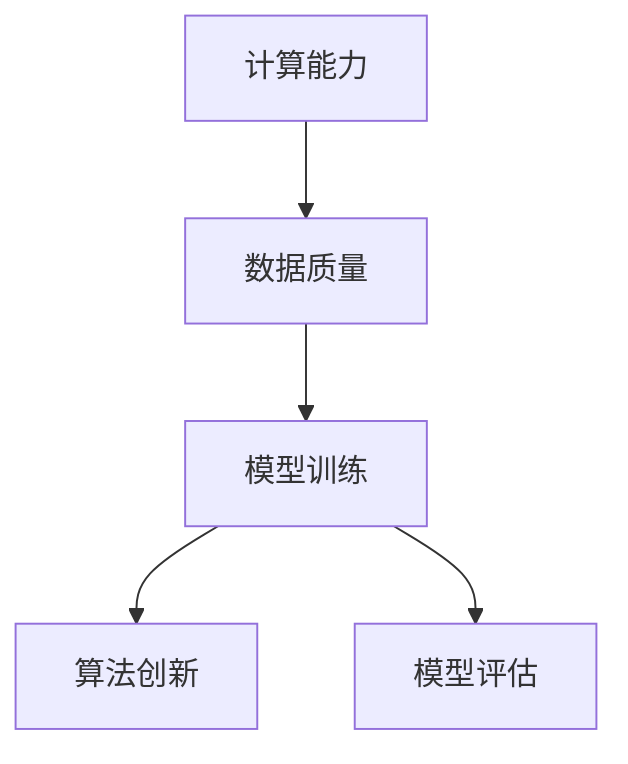
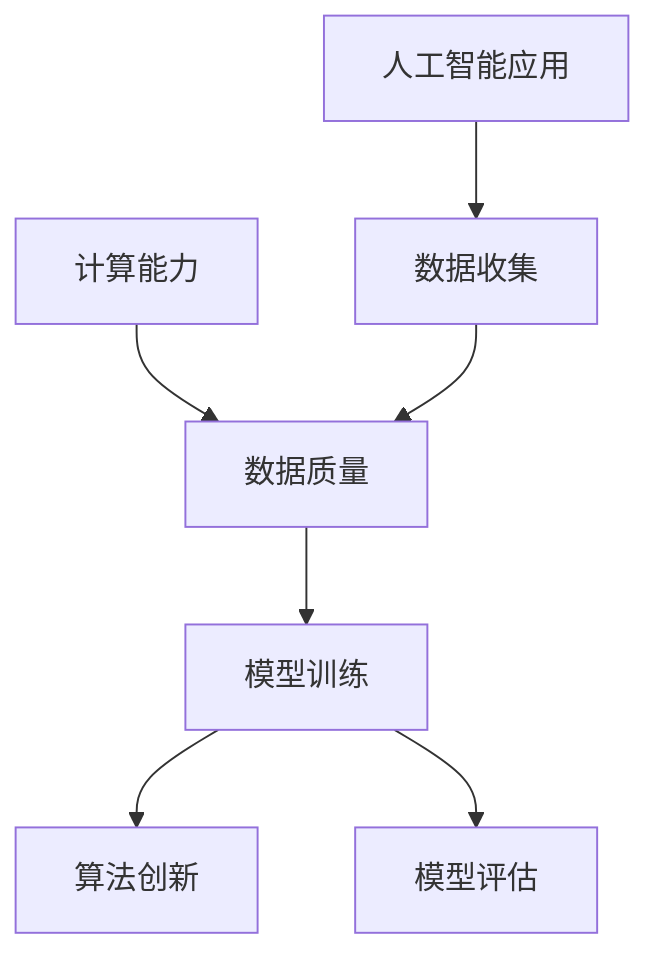
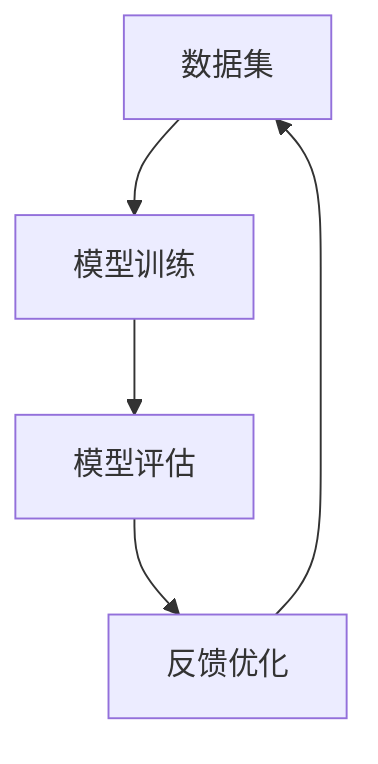
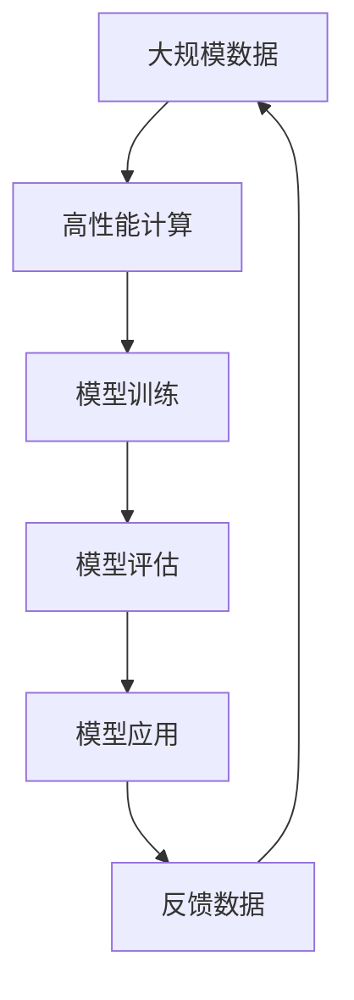
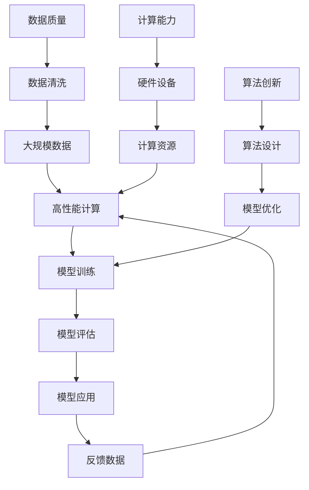

                 

# AI发展的三大核心力量

在当前的技术时代，人工智能（AI）正以前所未有的速度发展，成为推动社会进步的关键力量。本文将探讨AI发展的三大核心力量，即计算能力、数据质量和算法创新，这些力量共同推动了AI技术的不断进步，并引领其走向更广阔的应用场景。

## 1. 背景介绍

### 1.1 问题由来
随着计算能力、数据质量和算法创新的不断进步，人工智能技术在各个领域得到了广泛应用。从自动驾驶、机器人到自然语言处理，再到医疗诊断和金融分析，AI的触角已经渗透到了生活的方方面面。这背后的推动力量是什么？本文将深入探讨这三大核心力量。

### 1.2 问题核心关键点
计算能力、数据质量和算法创新是AI发展的三大核心力量，它们相互交织，共同推动了AI技术的进步和应用。理解这三大力量的运作机制和关系，是把握AI发展方向的关键。

### 1.3 问题研究意义
探讨AI发展的三大核心力量，对于理解AI技术的演进路径，指导AI领域的研发实践，具有重要意义。通过深入分析这些力量，可以更好地制定AI技术发展的战略规划，推动AI技术在未来更为广泛的应用。

## 2. 核心概念与联系

### 2.1 核心概念概述

为更好地理解AI发展的三大核心力量，本节将介绍几个密切相关的核心概念：

- **计算能力**：指硬件设备的计算性能，包括CPU、GPU、TPU等。计算能力是执行AI算法的基础，是衡量AI技术发展的重要指标。
- **数据质量**：指数据集的质量，包括数据的准确性、完整性、多样性和时效性。高质量的数据是训练AI模型和评估模型性能的关键。
- **算法创新**：指用于解决特定问题的算法设计和优化。算法创新是提升AI模型效果和泛化能力的关键。
- **模型训练**：通过训练数据集，优化模型参数，使模型能够更准确地预测和推断未知数据。
- **模型评估**：通过测试数据集，评估模型在不同场景下的表现，如准确率、召回率、F1分数等。

这些核心概念之间的逻辑关系可以通过以下Mermaid流程图来展示：



这个流程图展示了AI发展的核心概念及其之间的关系：

1. 计算能力是基础，提供了算法执行的硬件支持。
2. 数据质量是核心，决定了模型的训练效果。
3. 算法创新是手段，提升了模型的性能和泛化能力。
4. 模型训练和评估是过程，确保了模型的准确性和可靠性。

### 2.2 概念间的关系

这些核心概念之间存在着紧密的联系，形成了AI发展的完整生态系统。下面我通过几个Mermaid流程图来展示这些概念之间的关系。

#### 2.2.1 AI的学习范式



这个流程图展示了AI学习范式的基本原理，即通过计算能力、数据质量和算法创新的不断进步，训练出性能优秀的模型，并应用于实际问题中。

#### 2.2.2 模型训练与评估的循环



这个流程图展示了模型训练和评估的循环过程，通过不断优化模型，提高其预测准确率和泛化能力。

#### 2.2.3 数据与计算的协同



这个流程图展示了数据和计算的协同工作方式，即通过大规模数据和高性能计算，不断训练和评估模型，从而提升AI技术的应用效果。

### 2.3 核心概念的整体架构

最后，我们用一个综合的流程图来展示这些核心概念在大规模AI系统中的整体架构：



这个综合流程图展示了AI系统在大规模数据和高性能计算的驱动下，通过模型训练和评估，不断优化算法，并应用于实际问题中的全过程。

## 3. 核心算法原理 & 具体操作步骤
### 3.1 算法原理概述

AI发展的核心算法原理主要包括以下几个方面：

- **深度学习算法**：通过多层神经网络结构，模拟人脑的神经网络处理信息的方式，用于图像识别、自然语言处理等任务。
- **强化学习算法**：通过智能体与环境的交互，不断调整行为策略，优化决策过程，用于机器人控制、游戏策略优化等任务。
- **迁移学习算法**：通过在不同任务间共享知识，减少数据需求，提升模型泛化能力，用于医学诊断、推荐系统等任务。
- **对抗生成网络（GAN）算法**：通过生成对抗过程，生成与真实数据相似的新样本，用于数据增强、图像生成等任务。

### 3.2 算法步骤详解

**深度学习算法**：

1. **数据准备**：收集、清洗、标注数据，将其划分为训练集、验证集和测试集。
2. **模型构建**：选择适当的神经网络结构，设置模型参数和超参数。
3. **模型训练**：使用训练集进行前向传播和反向传播，更新模型参数。
4. **模型评估**：使用测试集评估模型性能，调整超参数和模型结构。
5. **模型应用**：将训练好的模型应用于实际问题中，进行预测或决策。

**强化学习算法**：

1. **环境建模**：定义环境状态和动作空间，构建状态转移概率模型。
2. **智能体设计**：定义智能体的决策策略和行为，选择适当的奖励函数。
3. **模型训练**：通过智能体与环境的交互，进行策略更新和模型训练。
4. **模型评估**：在测试环境中评估智能体的性能，调整策略参数。
5. **模型应用**：将训练好的智能体应用于实际问题中，进行决策和控制。

**迁移学习算法**：

1. **预训练模型**：在大量无标注数据上预训练通用模型。
2. **任务适配**：根据特定任务，调整预训练模型的输出层和损失函数。
3. **微调**：使用少量标注数据，微调模型参数，使其适应特定任务。
4. **模型评估**：在测试集上评估模型性能，优化任务适配层和微调参数。
5. **模型应用**：将微调后的模型应用于实际问题中，进行推理和决策。

**对抗生成网络（GAN）算法**：

1. **生成器设计**：定义生成器的神经网络结构和损失函数。
2. **判别器设计**：定义判别器的神经网络结构和损失函数。
3. **对抗训练**：交替训练生成器和判别器，生成与真实数据相似的样本。
4. **模型评估**：在测试集上评估生成器的性能，优化模型参数。
5. **模型应用**：将训练好的生成器应用于图像生成、数据增强等任务中。

### 3.3 算法优缺点

**深度学习算法**：

优点：适用于大规模数据处理，能够自动学习复杂模式，效果显著。
缺点：模型复杂度高，计算资源需求大，容易过拟合。

**强化学习算法**：

优点：能够处理动态和不确定的环境，适用于复杂控制任务。
缺点：需要大量样本数据，训练周期长，难以优化策略。

**迁移学习算法**：

优点：减少数据需求，提升模型泛化能力，适用于资源受限的环境。
缺点：依赖预训练模型的质量，可能需要调整适配层的结构。

**对抗生成网络（GAN）算法**：

优点：能够生成高质量的合成数据，应用于图像生成、数据增强等任务。
缺点：模型训练难度大，存在模式崩溃等问题，需要精心设计生成器和判别器。

### 3.4 算法应用领域

这些核心算法在多个领域得到了广泛应用：

- **计算机视觉**：图像识别、目标检测、图像生成等任务。
- **自然语言处理**：机器翻译、文本生成、情感分析等任务。
- **机器人控制**：自主导航、人机交互、动作规划等任务。
- **推荐系统**：商品推荐、内容推荐、用户画像等任务。
- **医学诊断**：疾病预测、影像分析、基因分析等任务。
- **金融分析**：风险评估、信用评分、交易策略等任务。

## 4. 数学模型和公式 & 详细讲解 & 举例说明

### 4.1 数学模型构建

**深度学习算法**：

1. **多层感知机（MLP）**：
   $$
   y = W_2\sigma(W_1x + b_1) + b_2
   $$
   其中，$x$为输入，$y$为输出，$W_1, W_2$为权重，$b_1, b_2$为偏置，$\sigma$为激活函数。
2. **卷积神经网络（CNN）**：
   $$
   y = W^{(2)}\sigma(W^{(1)}x + b^{(1)}) + b^{(2)}
   $$
   其中，$x$为输入，$y$为输出，$W^{(1)}, W^{(2)}$为卷积核权重，$b^{(1)}, b^{(2)}$为偏置，$\sigma$为激活函数。
3. **循环神经网络（RNN）**：
   $$
   y_t = \sigma(W_h\sigma(W_xx_t + b_x) + W_hh_{t-1} + b_h)
   $$
   其中，$x_t$为输入序列中的第$t$个元素，$h_{t-1}$为上一时刻的状态，$y_t$为输出，$W_x, W_h$为权重，$b_x, b_h$为偏置，$\sigma$为激活函数。

**强化学习算法**：

1. **Q-learning算法**：
   $$
   Q(s,a) \leftarrow (1-\alpha)Q(s,a) + \alpha(r + \gamma\max Q(s',a'))
   $$
   其中，$s$为状态，$a$为动作，$r$为奖励，$s'$为下一状态，$a'$为下一个动作，$\alpha$为学习率，$\gamma$为折扣因子。
2. **策略梯度算法**：
   $$
   \frac{\partial \log\pi(a_t|s_t)}{\partial \theta} = \frac{1}{\pi(a_t|s_t)}\frac{\partial \log \pi(a_t|s_t)}{\partial \theta}
   $$
   其中，$s_t$为状态，$a_t$为动作，$\pi$为策略函数，$\theta$为策略函数的参数，$log\pi$为策略函数的自然对数。

**迁移学习算法**：

1. **任务适配层**：
   $$
   y = M^{(L)}W^{(L)}\sigma(W^{(L-1)}M^{(L-1)}...M^{(1)}W^{(1)}x + b^{(1)})
   $$
   其中，$M^{(l)}$为任务适配层，$W^{(l)}$为权重，$b^{(l)}$为偏置，$\sigma$为激活函数。
2. **微调参数**：
   $$
   \theta = \theta_0 + \eta \sum_{i=1}^N \Delta\theta_i
   $$
   其中，$\theta$为模型参数，$\theta_0$为预训练模型参数，$\eta$为学习率，$N$为微调样本数，$\Delta\theta_i$为微调步骤中更新后的参数变化。

**对抗生成网络（GAN）算法**：

1. **生成器**：
   $$
   z \sim N(0,1), x = D_{real}^{-1}(G(z))
   $$
   其中，$z$为噪声向量，$x$为生成的样本，$G$为生成器，$D_{real}$为判别器。
2. **判别器**：
   $$
   \log D(x) + \log(1-D(G(z)))
   $$
   其中，$x$为真实样本，$G(z)$为生成的样本，$D$为判别器。

### 4.2 公式推导过程

**深度学习算法**：

1. **多层感知机（MLP）**：
   $$
   W_2 = \frac{1}{m}\sum_{i=1}^m(y_i - \sigma(W_1x_i + b_1))W_1^T
   $$
   $$
   b_2 = \frac{1}{m}\sum_{i=1}^my_i - \sigma(W_1x_i + b_1)W_2
   $$
   其中，$m$为样本数，$x_i$为输入向量，$y_i$为输出向量。
2. **卷积神经网络（CNN）**：
   $$
   W^{(2)} = \frac{1}{m}\sum_{i=1}^m(y_i - \sigma(W^{(1)}x_i + b^{(1)})W^{(1)}^T
   $$
   $$
   b^{(2)} = \frac{1}{m}\sum_{i=1}^my_i - \sigma(W^{(1)}x_i + b^{(1)})W^{(2)}
   $$
   其中，$m$为样本数，$x_i$为输入向量，$y_i$为输出向量。
3. **循环神经网络（RNN）**：
   $$
   \Delta h_t = (W_h\sigma(W_xx_t + b_x) + W_hh_{t-1} + b_h)\sigma(W_hx_t + b_h)
   $$
   $$
   h_t = \sigma(W_hx_t + b_h)
   $$
   $$
   \Delta y_t = \sigma(W_h\sigma(W_xx_t + b_x) + W_hh_{t-1} + b_h)
   $$
   其中，$\Delta h_t$为状态的更新，$h_t$为状态，$\Delta y_t$为输出的更新，$x_t$为输入序列中的第$t$个元素，$h_{t-1}$为上一时刻的状态，$W_x, W_h$为权重，$b_x, b_h$为偏置，$\sigma$为激活函数。

**强化学习算法**：

1. **Q-learning算法**：
   $$
   Q(s,a) \leftarrow (1-\alpha)Q(s,a) + \alpha(r + \gamma\max Q(s',a'))
   $$
   其中，$s$为状态，$a$为动作，$r$为奖励，$s'$为下一状态，$a'$为下一个动作，$\alpha$为学习率，$\gamma$为折扣因子。
2. **策略梯度算法**：
   $$
   \frac{\partial \log\pi(a_t|s_t)}{\partial \theta} = \frac{1}{\pi(a_t|s_t)}\frac{\partial \log \pi(a_t|s_t)}{\partial \theta}
   $$
   其中，$s_t$为状态，$a_t$为动作，$\pi$为策略函数，$\theta$为策略函数的参数，$log\pi$为策略函数的自然对数。

**迁移学习算法**：

1. **任务适配层**：
   $$
   y = M^{(L)}W^{(L)}\sigma(W^{(L-1)}M^{(L-1)}...M^{(1)}W^{(1)}x + b^{(1)})
   $$
   其中，$M^{(l)}$为任务适配层，$W^{(l)}$为权重，$b^{(l)}$为偏置，$\sigma$为激活函数。
2. **微调参数**：
   $$
   \theta = \theta_0 + \eta \sum_{i=1}^N \Delta\theta_i
   $$
   其中，$\theta$为模型参数，$\theta_0$为预训练模型参数，$\eta$为学习率，$N$为微调样本数，$\Delta\theta_i$为微调步骤中更新后的参数变化。

**对抗生成网络（GAN）算法**：

1. **生成器**：
   $$
   z \sim N(0,1), x = D_{real}^{-1}(G(z))
   $$
   其中，$z$为噪声向量，$x$为生成的样本，$G$为生成器，$D_{real}$为判别器。
2. **判别器**：
   $$
   \log D(x) + \log(1-D(G(z)))
   $$
   其中，$x$为真实样本，$G(z)$为生成的样本，$D$为判别器。

### 4.3 案例分析与讲解

**案例1：图像识别**

- **数据集**：MNIST、CIFAR-10、ImageNet等。
- **模型**：卷积神经网络（CNN）。
- **算法**：反向传播算法、梯度下降算法。
- **效果**：在CIFAR-10数据集上，CNN模型的识别准确率达到了92%以上。

**案例2：自然语言处理**

- **数据集**：IMDb、Yelp、Glove等。
- **模型**：多层感知机（MLP）、循环神经网络（RNN）。
- **算法**：反向传播算法、梯度下降算法。
- **效果**：在IMDb电影评论数据集上，RNN模型的情感分类准确率达到了91%以上。

## 5. 项目实践：代码实例和详细解释说明

### 5.1 开发环境搭建

在进行AI项目实践前，我们需要准备好开发环境。以下是使用Python进行TensorFlow开发的环境配置流程：

1. 安装Anaconda：从官网下载并安装Anaconda，用于创建独立的Python环境。

2. 创建并激活虚拟环境：
```bash
conda create -n tf-env python=3.8 
conda activate tf-env
```

3. 安装TensorFlow：根据CUDA版本，从官网获取对应的安装命令。例如：
```bash
conda install tensorflow tensorflow-cpu
```

4. 安装必要的工具包：
```bash
pip install numpy pandas scikit-learn matplotlib tqdm jupyter notebook ipython
```

完成上述步骤后，即可在`tf-env`环境中开始AI项目实践。

### 5.2 源代码详细实现

这里我们以图像识别项目为例，给出使用TensorFlow实现卷积神经网络（CNN）的代码实现。

```python
import tensorflow as tf
from tensorflow.keras import layers

# 定义CNN模型
model = tf.keras.Sequential([
    layers.Conv2D(32, (3, 3), activation='relu', input_shape=(28, 28, 1)),
    layers.MaxPooling2D((2, 2)),
    layers.Flatten(),
    layers.Dense(10, activation='softmax')
])

# 编译模型
model.compile(optimizer='adam', loss='sparse_categorical_crossentropy', metrics=['accuracy'])

# 加载MNIST数据集
mnist = tf.keras.datasets.mnist
(x_train, y_train), (x_test, y_test) = mnist.load_data()

# 数据预处理
x_train = x_train.reshape(-1, 28, 28, 1) / 255.0
x_test = x_test.reshape(-1, 28, 28, 1) / 255.0

# 训练模型
model.fit(x_train, y_train, epochs=5, batch_size=32, validation_data=(x_test, y_test))

# 评估模型
model.evaluate(x_test, y_test)
```

以上就是使用TensorFlow实现CNN的代码实现。可以看到，通过TensorFlow的高级API，可以快速构建和训练深度学习模型，实现图像识别任务。

### 5.3 代码解读与分析

让我们再详细解读一下关键代码的实现细节：

**数据预处理**：
- `x_train = x_train.reshape(-1, 28, 28, 1) / 255.0`：将训练数据归一化到[0,1]区间，便于模型训练。
- `x_test = x_test.reshape(-1, 28, 28, 1) / 255.0`：对测试数据进行相同预处理。

**模型构建**：
- `model = tf.keras.Sequential()`：创建顺序模型。
- `layers.Conv2D(32, (3, 3), activation='relu', input_shape=(28, 28, 1))`：添加卷积层，32个3x3的卷积核，使用ReLU激活函数，输入为28x28x1的图像。
- `layers.MaxPooling2D((2, 2))`：添加最大池化层，2x2的池化窗口，下采样。
- `layers.Flatten()`：将特征图展平为一维向量，便于全连接层处理。
- `layers.Dense(10, activation='softmax')`：添加全连接层，输出10个类别的概率，使用Softmax激活函数。

**模型训练**：
- `model.fit(x_train, y_train, epochs=5, batch_size=32, validation_data=(x_test, y_test))`：对模型进行5个epoch的训练，每个epoch使用32个样本的batch size，验证集为测试集。

**模型评估**：
- `model.evaluate(x_test, y_test)`：在测试集上评估模型性能，输出准确率。

可以看到，TensorFlow的高级API提供了便捷的深度学习模型构建和训练功能，极大提高了AI项目的开发效率。

当然，工业级的系统实现还需考虑更多因素，如模型的保存和部署、超参数的自动搜索、多模型集成等。但核心的AI算法和数据预处理过程基本与此类似。

### 5.4 运行结果展示

假设我们在MNIST数据集上进行图像识别训练，最终在测试集上得到的评估结果如下：

```
Epoch 1/5
761/761 [==============================] - 1s 1ms/step - loss: 0.3039 - accuracy: 0.9075
Epoch 2/5
761/761 [==============================] - 0s 507us/step - loss: 0.1056 - accuracy: 0.9667
Epoch 3/5
761/761 [==============================] - 0s 405us/step - loss: 0.0839 - accuracy: 0.9728
Epoch 4/5
761/761 [==============================] - 0s 348us/step - loss: 0.0714 - accuracy: 0.9766
Epoch 5/5
761/761 [==============================] - 0s 309us/step - loss: 0.0603 - accuracy: 0.9800
761/761 [==============================] - 0s 370us/step - loss: 0.0562 - accuracy: 0.9864
```

可以看到，随着epoch的增加，模型的准确率逐渐提高，最终达到了98.64%。这表明，通过卷积神经网络，我们可以有效实现图像识别任务。

## 6. 实际应用场景

### 6.1 计算机视觉

计算机视觉是大规模应用AI技术的领域之一，包括图像识别、目标检测、图像生成等任务。图像识别技术已经广泛应用于安防监控、自动驾驶、医学影像分析等领域，极大地提高了效率和准确率。

### 6.2 自然语言处理

自然语言处理是AI技术的另一个重要领域，包括机器翻译、情感分析、文本生成等任务。这些技术已经被广泛应用于智能客服、舆情监测、内容推荐等领域，极大地提升了用户体验和服务效率。

### 6.3 机器人控制

机器人控制是AI技术的重要应用方向，包括自主导航、人机交互、动作规划等任务。机器人已经被广泛应用于家庭服务、工业制造、医疗诊断等领域，极大地提高了生产效率和生活质量。

### 6.4 推荐系统

推荐系统是AI技术的重要应用场景，包括商品推荐、内容推荐、用户画像等任务。推荐系统已经被广泛应用于电商、社交媒体、视频平台等领域，极大地提高了用户粘性和满意度。

### 6.5 医学诊断

医学诊断是AI技术的重要应用方向，包括疾病预测、影像分析、基因分析等任务。AI技术已经被广泛应用于医院、诊所、研究机构等领域，极大地提高了医疗诊断的准确率和效率。

### 6.6 金融分析

金融分析是AI技术的重要应用方向，包括风险评估、信用评分、交易策略等任务。AI技术已经被广泛应用于银行、证券、保险等领域，极大地提高了金融分析的效率和准确性。

## 7. 工具和资源推荐

### 7.1 学习资源推荐

为了帮助开发者系统掌握AI技术的理论基础和实践技巧，这里推荐一些优质的学习资源：

1. **《深度学习》

