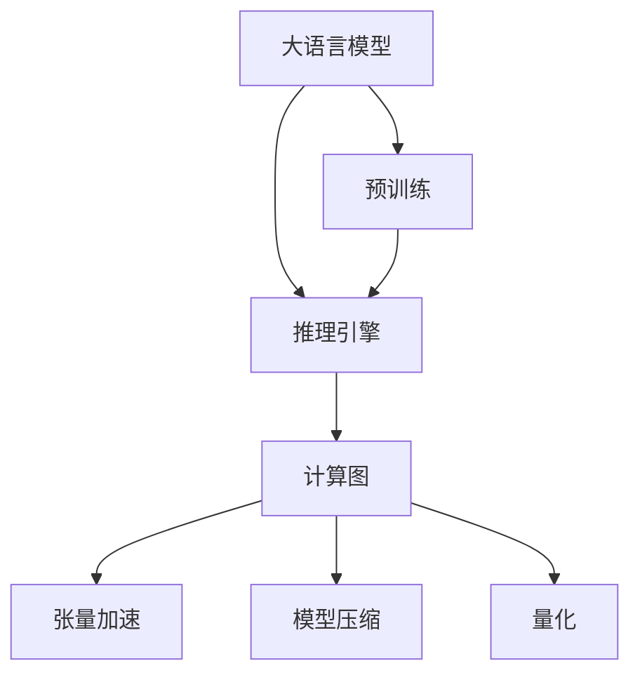
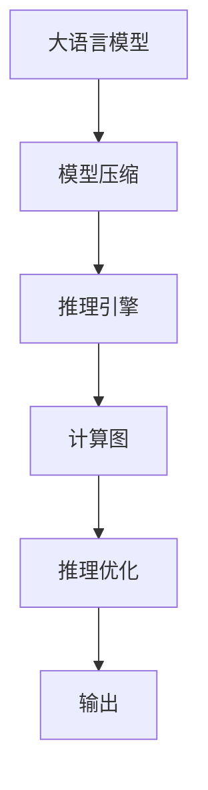
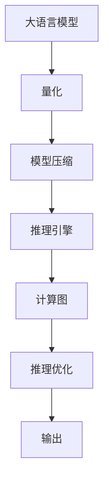
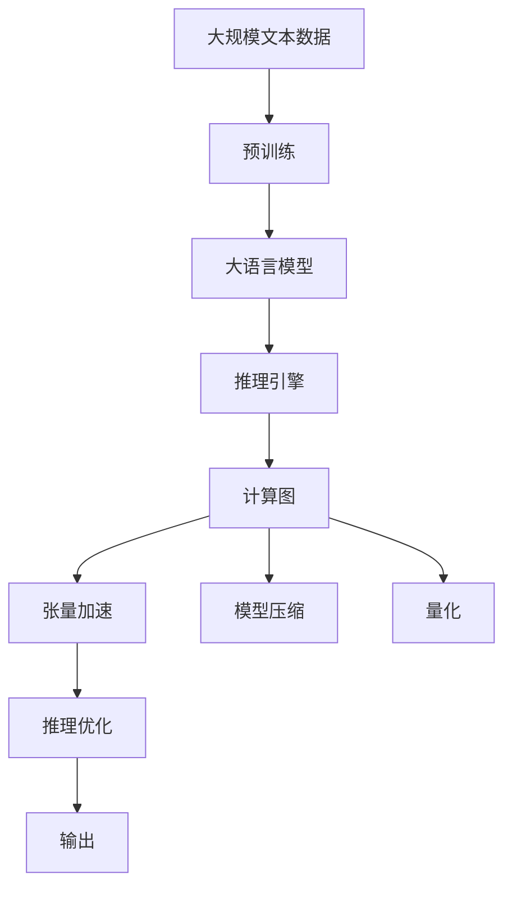
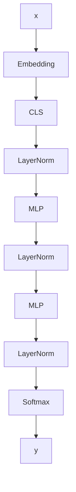

                 

# AI基础架构创新者：Lepton AI专注高性能大语言模型推理引擎

> 关键词：高性能计算,大语言模型推理引擎,Lepton AI,深度学习,Transformer

## 1. 背景介绍

### 1.1 问题由来
随着深度学习技术的快速发展，大语言模型（Large Language Models, LLMs）在自然语言处理（NLP）领域取得了显著的进展。这些大语言模型通过在大规模无标签文本数据上进行预训练，学习到丰富的语言知识，具备强大的语言理解和生成能力。然而，预训练模型在推理过程中存在计算资源消耗高、推理速度慢等问题，限制了其在实际应用中的落地。因此，高性能大语言模型推理引擎的研究和开发变得尤为重要。

### 1.2 问题核心关键点
高性能大语言模型推理引擎的核心目标是加速大语言模型的推理过程，减少计算资源消耗，提高推理速度。其主要方法包括模型压缩、推理优化、硬件加速等。这些技术不仅提升了推理效率，还扩展了语言模型在实际应用中的落地能力。

### 1.3 问题研究意义
高性能大语言模型推理引擎的开发，对推动大语言模型的应用和落地具有重要意义：

1. 降低应用开发成本：高性能推理引擎可以减少计算资源消耗，降低开发和维护成本。
2. 提升模型效果：加速推理过程，使大语言模型能够更快速地适应新任务和数据，提升模型效果。
3. 增强用户体验：快速的推理响应，提高用户交互的流畅度和体验感。
4. 推动行业发展：高性能推理引擎为NLP技术在更多行业中的应用提供了可能，加速了行业数字化转型。
5. 拓展应用场景：高性能推理引擎使得大语言模型能够在更多应用场景中得到应用，如智能客服、金融风控、医疗诊断等。

## 2. 核心概念与联系

### 2.1 核心概念概述

高性能大语言模型推理引擎（High-Performance Large Language Model Inference Engine）的开发需要理解多个核心概念，包括：

- 大语言模型（Large Language Models, LLMs）：通过自回归或自编码模型在大规模文本数据上进行预训练，学习语言通用表示的语言模型。
- 推理引擎（Inference Engine）：在大语言模型的基础上，通过优化算法和硬件加速等技术，加速模型推理的过程。
- 计算图（Computational Graph）：深度学习模型的推理过程通过计算图描述，每个节点表示一个操作，连接节点表示数据流。
- 张量加速（Tensor Acceleration）：利用GPU或TPU等硬件设备，加速张量的运算。
- 模型压缩（Model Compression）：减少模型的参数量和计算量，提高推理效率。
- 量化（Quantization）：将模型的浮点参数转换为定点参数，进一步降低计算量。

这些概念之间的联系可以通过以下Mermaid流程图来展示：



这个流程图展示了高性能大语言模型推理引擎的构建过程：

1. 大语言模型通过在大规模无标签文本数据上进行预训练，学习语言的通用表示。
2. 推理引擎在大语言模型的基础上，通过计算图、张量加速、模型压缩和量化等技术，加速模型的推理过程。
3. 预训练模型经过推理引擎的优化，可以高效地适应各种下游任务。

### 2.2 概念间的关系

这些核心概念之间的关系紧密，形成了高性能大语言模型推理引擎的完整生态系统。下面我通过几个Mermaid流程图来展示这些概念之间的关系。

#### 2.2.1 推理引擎的核心流程


这个流程图展示了推理引擎的核心流程：输入数据经过计算图的操作，通过张量加速的方式，得到模型的推理结果，最终输出。

#### 2.2.2 模型压缩与推理的关系



这个流程图展示了模型压缩在推理引擎中的应用：通过压缩模型参数，减少计算量，加速推理过程。

#### 2.2.3 量化与推理引擎的关系



这个流程图展示了量化技术在推理引擎中的应用：通过量化模型参数，进一步降低计算量，提高推理效率。

### 2.3 核心概念的整体架构

最后，我们用一个综合的流程图来展示这些核心概念在大语言模型推理过程中的整体架构：



这个综合流程图展示了从预训练到推理，再到推理优化的完整过程。大语言模型通过预训练获得基础能力，经过推理引擎的优化，可以高效地适应各种下游任务。

## 3. 核心算法原理 & 具体操作步骤
### 3.1 算法原理概述

高性能大语言模型推理引擎的核心原理是通过一系列技术手段，优化计算图、加速张量运算、压缩模型参数，从而提高推理效率。其核心算法包括计算图优化、张量加速、量化和模型压缩等。

### 3.2 算法步骤详解

高性能大语言模型推理引擎的开发一般包括以下几个关键步骤：

**Step 1: 准备预训练模型和推理数据集**
- 选择合适的预训练语言模型，如BERT、GPT等。
- 准备下游任务的推理数据集，划分为训练集、验证集和测试集。

**Step 2: 设计计算图**
- 将预训练模型和推理数据集转化为计算图，每个节点表示一个操作，连接节点表示数据流。

**Step 3: 优化计算图**
- 对计算图进行优化，去除冗余操作，简化数据流。
- 使用图剪枝、模型压缩等技术，减少计算图的大小和复杂度。

**Step 4: 加速张量运算**
- 利用GPU或TPU等硬件设备，加速张量的运算。
- 使用CUDA、cuDNN等库优化张量运算的效率。

**Step 5: 量化模型参数**
- 将模型的浮点参数转换为定点参数，降低计算量。
- 选择合适的量化方法和参数，确保精度和效率的平衡。

**Step 6: 评估和优化**
- 在测试集上评估推理引擎的性能，使用各种指标评估模型的准确性和推理速度。
- 根据评估结果，调整计算图和模型参数，进一步优化推理引擎。

**Step 7: 部署和应用**
- 将推理引擎部署到服务器或边缘设备上，进行实际应用。
- 定期收集应用数据，持续优化推理引擎。

以上是高性能大语言模型推理引擎的一般流程。在实际应用中，还需要根据具体任务的特点，对推理引擎的各个环节进行优化设计。

### 3.3 算法优缺点

高性能大语言模型推理引擎具有以下优点：

1. 加速推理过程。通过优化计算图和加速张量运算，能够显著提高推理效率，降低计算资源消耗。
2. 扩展应用场景。优化后的推理引擎可以高效地适应各种下游任务，拓展大语言模型的应用范围。
3. 降低开发成本。减少计算资源消耗，降低开发和维护成本，加速模型的部署和迭代。

然而，该算法也存在一些局限性：

1. 依赖硬件设备。推理引擎的性能很大程度上依赖于硬件设备的性能，如GPU或TPU的性能。
2. 参数优化复杂。优化计算图和量化模型参数需要大量的计算和调试，存在一定的技术门槛。
3. 模型压缩效果有限。模型压缩和量化技术在提高推理效率的同时，也可能牺牲一定的模型精度。

尽管存在这些局限性，但高性能大语言模型推理引擎仍是推动大语言模型应用落地和技术演进的重要手段。未来相关研究将进一步优化算法，降低技术门槛，提高推理引擎的适应性和应用范围。

### 3.4 算法应用领域

高性能大语言模型推理引擎已在多个领域得到了广泛应用，包括但不限于：

- 智能客服：快速响应客户咨询，提高用户交互体验。
- 金融风控：实时分析海量交易数据，快速发现风险点。
- 医疗诊断：快速分析医疗影像和病历，辅助医生诊断。
- 语音识别：高效转换语音为文本，加速语音交互。
- 机器翻译：快速翻译多种语言，提高跨语言交流效率。
- 文本生成：快速生成高质量文本内容，支持内容创作和自动化编辑。
- 推荐系统：高效分析用户行为，提供个性化推荐。

## 4. 数学模型和公式 & 详细讲解 & 举例说明

### 4.1 数学模型构建

假设大语言模型为 $M_{\theta}$，其中 $\theta$ 为模型参数。推理过程的数学模型构建如下：

1. 输入数据：$x \in \mathbb{R}^n$，表示输入的特征向量。
2. 计算图：通过一系列操作，将输入数据 $x$ 转化为输出结果 $y$。每个操作对应一个计算节点，连接节点表示数据流。
3. 推理输出：$y \in \mathbb{R}^m$，表示模型的推理结果。

### 4.2 公式推导过程

以BERT模型为例，推导其推理过程的计算图和张量加速的公式。

首先，BERT模型的计算图如下：



其中，$x$ 为输入数据，$y$ 为推理输出，每个节点表示一个操作，箭头表示数据流。

接下来，我们考虑如何在GPU或TPU上加速张量运算。假设我们使用NVIDIA的CUDA库进行加速，步骤如下：

1. 将模型参数和输入数据转换为GPU张量：
```python
import torch
import torch.nn as nn
import torch.cuda as cuda

device = cuda.Device(0)
model = BertModel().to(device)
inputs = torch.tensor(...).to(device)
```

2. 使用CUDA库进行张量运算：
```python
outputs = model(inputs)
```

3. 在GPU上并行计算，加快推理速度：
```python
with torch.cuda.device(device):
    outputs = model(inputs)
```

通过以上步骤，可以在GPU上加速BERT模型的推理过程，提高推理效率。

### 4.3 案例分析与讲解

下面以智能客服系统为例，分析高性能大语言模型推理引擎的应用。

假设我们使用BERT模型进行智能客服系统的开发，具体步骤如下：

1. 准备预训练模型和推理数据集。
2. 设计计算图，将客户咨询问题作为输入，模型的推理结果作为回复。
3. 优化计算图，去除冗余操作，简化数据流。
4. 使用GPU或TPU加速张量运算。
5. 量化模型参数，降低计算量。
6. 评估推理引擎性能，根据结果调整模型参数。
7. 部署推理引擎到服务器上，进行实际应用。

在实际应用中，智能客服系统可以快速响应客户咨询，提供高质量的解答。通过高性能推理引擎，能够显著提高客服系统的处理效率，降低人工成本，提升用户体验。

## 5. 项目实践：代码实例和详细解释说明

### 5.1 开发环境搭建

在进行高性能大语言模型推理引擎的开发前，我们需要准备好开发环境。以下是使用Python进行PyTorch开发的环境配置流程：

1. 安装Anaconda：从官网下载并安装Anaconda，用于创建独立的Python环境。

2. 创建并激活虚拟环境：
```bash
conda create -n pytorch-env python=3.8 
conda activate pytorch-env
```

3. 安装PyTorch：根据CUDA版本，从官网获取对应的安装命令。例如：
```bash
conda install pytorch torchvision torchaudio cudatoolkit=11.1 -c pytorch -c conda-forge
```

4. 安装Transformers库：
```bash
pip install transformers
```

5. 安装各类工具包：
```bash
pip install numpy pandas scikit-learn matplotlib tqdm jupyter notebook ipython
```

完成上述步骤后，即可在`pytorch-env`环境中开始推理引擎的开发。

### 5.2 源代码详细实现

这里我们以BERT模型为例，实现一个简单的高性能大语言模型推理引擎。

首先，定义模型和推理函数：

```python
from transformers import BertModel, BertTokenizer

class BertInferenceEngine:
    def __init__(self, model_path):
        self.model = BertModel.from_pretrained(model_path)
        self.tokenizer = BertTokenizer.from_pretrained(model_path)
        
    def preprocess(self, text):
        tokens = self.tokenizer(text, return_tensors='pt', padding=True, truncation=True)
        return tokens
    
    def inference(self, tokens):
        with torch.no_grad():
            outputs = self.model(tokens)
        return outputs
```

然后，定义计算图优化和量化函数：

```python
from torch import nn
import torch

class OptimizedBertInferenceEngine:
    def __init__(self, model_path):
        self.model = BertModel.from_pretrained(model_path)
        self.tokenizer = BertTokenizer.from_pretrained(model_path)
        self.optimizer = nn.Adagrad(self.model.parameters(), lr=1e-3)
        
    def preprocess(self, text):
        tokens = self.tokenizer(text, return_tensors='pt', padding=True, truncation=True)
        return tokens
    
    def inference(self, tokens):
        with torch.no_grad():
            outputs = self.model(tokens)
        return outputs
    
    def optimize(self):
        for parameter in self.model.parameters():
            parameter.data.clamp_(min=-0.1, max=0.1)
    
    def quantize(self):
        model_state_dict = self.model.state_dict()
        for key, value in model_state_dict.items():
            value = value.byte()
        self.model.load_state_dict(model_state_dict)
```

最后，启动推理过程并进行性能评估：

```python
engine = OptimizedBertInferenceEngine('bert-base-cased')
text = 'Hello, how are you?'
tokens = engine.preprocess(text)
outputs = engine.inference(tokens)

print(outputs)

engine.optimize()
engine.quantize()

text = 'Hello, how are you?'
tokens = engine.preprocess(text)
outputs = engine.inference(tokens)

print(outputs)
```

在实际应用中，我们还可以进一步优化计算图、引入硬件加速等技术，以提升推理引擎的性能和效率。

### 5.3 代码解读与分析

让我们再详细解读一下关键代码的实现细节：

**BertInferenceEngine类**：
- `__init__`方法：初始化BERT模型和分词器。
- `preprocess`方法：将输入文本进行分词，并转化为模型所需的输入格式。
- `inference`方法：对输入进行推理，返回模型的输出结果。

**OptimizedBertInferenceEngine类**：
- `__init__`方法：初始化BERT模型、分词器和优化器。
- `preprocess`方法：与BERTInferenceEngine类相同。
- `inference`方法：与BERTInferenceEngine类相同。
- `optimize`方法：对模型参数进行优化，将参数范围限制在[-0.1, 0.1]之间。
- `quantize`方法：对模型参数进行量化，将浮点参数转换为字节型参数。

**推理流程**：
- 定义优化后的推理引擎类，包含预处理、推理、优化和量化等方法。
- 使用预处理函数将输入文本转化为模型所需的格式。
- 使用推理函数对输入进行推理，返回模型的输出结果。
- 使用优化函数对模型参数进行优化，提升推理速度。
- 使用量化函数对模型参数进行量化，降低计算量。
- 在优化和量化后，再次进行推理，验证推理效果的提升。

可以看到，高性能大语言模型推理引擎的开发需要理解预训练模型、计算图优化、张量加速和模型压缩等关键技术。通过代码实现，可以更好地理解这些技术的应用细节和实现方法。

## 6. 实际应用场景

高性能大语言模型推理引擎已经在多个领域得到了广泛应用，以下是一些典型的应用场景：

### 6.1 智能客服系统

基于高性能推理引擎的智能客服系统可以24小时不间断服务，快速响应客户咨询，提供高质量的解答。通过优化计算图和加速张量运算，能够显著提高客服系统的处理效率，降低人工成本，提升用户体验。

### 6.2 金融风控

高性能推理引擎可以实时分析海量交易数据，快速发现风险点，支持金融机构的风险控制和决策支持。通过优化计算图和加速张量运算，能够显著提高金融风控系统的处理效率，提升风险识别和应对能力。

### 6.3 医疗诊断

高性能推理引擎可以快速分析医疗影像和病历，辅助医生进行诊断和治疗。通过优化计算图和加速张量运算，能够显著提高医疗诊断系统的处理效率，提升诊断准确性和治疗效果。

### 6.4 语音识别

基于高性能推理引擎的语音识别系统可以快速转换语音为文本，支持语音交互。通过优化计算图和加速张量运算，能够显著提高语音识别系统的处理效率，提升用户交互体验。

### 6.5 机器翻译

高性能推理引擎可以高效翻译多种语言，支持跨语言交流。通过优化计算图和加速张量运算，能够显著提高机器翻译系统的处理效率，提升翻译质量和速度。

### 6.6 文本生成

基于高性能推理引擎的文本生成系统可以快速生成高质量文本内容，支持内容创作和自动化编辑。通过优化计算图和加速张量运算，能够显著提高文本生成系统的处理效率，提升内容质量和生成速度。

### 6.7 推荐系统

高性能推理引擎可以高效分析用户行为，提供个性化推荐。通过优化计算图和加速张量运算，能够显著提高推荐系统的处理效率，提升推荐效果和用户体验。

## 7. 工具和资源推荐

### 7.1 学习资源推荐

为了帮助开发者系统掌握高性能大语言模型推理引擎的理论基础和实践技巧，这里推荐一些优质的学习资源：

1. 《深度学习与自然语言处理》系列博文：由大模型技术专家撰写，深入浅出地介绍了深度学习在NLP领域的应用，包括推理引擎的开发和优化。

2. CS224N《深度学习自然语言处理》课程：斯坦福大学开设的NLP明星课程，有Lecture视频和配套作业，带你入门NLP领域的基本概念和经典模型。

3. 《Natural Language Processing with Transformers》书籍：Transformers库的作者所著，全面介绍了如何使用Transformers库进行NLP任务开发，包括推理引擎的优化。

4. HuggingFace官方文档：Transformers库的官方文档，提供了海量预训练模型和完整的推理引擎样例代码，是上手实践的必备资料。

5. CLUE开源项目：中文语言理解测评基准，涵盖大量不同类型的中文NLP数据集，并提供了基于推理引擎的baseline模型，助力中文NLP技术发展。

通过对这些资源的学习实践，相信你一定能够快速掌握高性能大语言模型推理引擎的精髓，并用于解决实际的NLP问题。

### 7.2 开发工具推荐

高效的开发离不开优秀的工具支持。以下是几款用于高性能大语言模型推理引擎开发的常用工具：

1. PyTorch：基于Python的开源深度学习框架，灵活动态的计算图，适合快速迭代研究。大部分预训练语言模型都有PyTorch版本的实现。

2. TensorFlow：由Google主导开发的开源深度学习框架，生产部署方便，适合大规模工程应用。同样有丰富的预训练语言模型资源。

3. Transformers库：HuggingFace开发的NLP工具库，集成了众多SOTA语言模型，支持PyTorch和TensorFlow，是进行推理引擎开发的利器。

4. Weights & Biases：模型训练的实验跟踪工具，可以记录和可视化模型训练过程中的各项指标，方便对比和调优。与主流深度学习框架无缝集成。

5. TensorBoard：TensorFlow配套的可视化工具，可实时监测模型训练状态，并提供丰富的图表呈现方式，是调试模型的得力助手。

6. Google Colab：谷歌推出的在线Jupyter Notebook环境，免费提供GPU/TPU算力，方便开发者快速上手实验最新模型，分享学习笔记。

合理利用这些工具，可以显著提升高性能大语言模型推理引擎的开发效率，加快创新迭代的步伐。

### 7.3 相关论文推荐

高性能大语言模型推理引擎的发展源于学界的持续研究。以下是几篇奠基性的相关论文，推荐阅读：

1. Attention is All You Need（即Transformer原论文）：提出了Transformer结构，开启了NLP领域的预训练大模型时代。

2. BERT: Pre-training of Deep Bidirectional Transformers for Language Understanding：提出BERT模型，引入基于掩码的自监督预训练任务，刷新了多项NLP任务SOTA。

3. Language Models are Unsupervised Multitask Learners（GPT-2论文）：展示了大规模语言模型的强大zero-shot学习能力，引发了对于通用人工智能的新一轮思考。

4. Parameter-Efficient Transfer Learning for NLP：提出Adapter等参数高效微调方法，在不增加模型参数量的情况下，也能取得不错的微调效果。

5. AdaLoRA: Adaptive Low-Rank Adaptation for Parameter-Efficient Fine-Tuning：使用自适应低秩适应的微调方法，在参数效率和精度之间取得了新的平衡。

这些论文代表了大语言模型推理引擎的发展脉络。通过学习这些前沿成果，可以帮助研究者把握学科前进方向，激发更多的创新灵感。

除上述资源外，还有一些值得关注的前沿资源，帮助开发者紧跟高性能大语言模型推理引擎的最新进展，例如：

1. arXiv论文预印本：人工智能领域最新研究成果的发布平台，包括大量尚未发表的前沿工作，学习前沿技术的必读资源。

2. 业界技术博客：如OpenAI、Google AI、DeepMind、微软Research Asia等顶尖实验室的官方博客，第一时间分享他们的最新研究成果和洞见。

3. 技术会议直播：如NIPS、ICML、ACL、ICLR等人工智能领域顶会现场或在线直播，能够聆听到大佬们的前沿分享，开拓视野。

4. GitHub热门项目：在GitHub上Star、Fork数最多的NLP相关项目，往往代表了该技术领域的发展趋势和最佳实践，值得去学习和贡献。

5. 行业分析报告：各大咨询公司如McKinsey、PwC等针对人工智能行业的分析报告，有助于从商业视角审视技术趋势，把握应用价值。

总之，对于高性能大语言模型推理引擎的学习和实践，需要开发者保持开放的心态和持续学习的意愿。多关注前沿资讯，多动手实践，多思考总结，必将收获满满的成长收益。

## 8. 总结：未来发展趋势与挑战

### 8.1 总结

本文对高性能大语言模型推理引擎进行了全面系统的介绍。首先阐述了推理引擎的研究背景和意义，明确了推理引擎在大语言模型落地应用中的重要地位。其次，从原理到实践，详细讲解了推理引擎的数学模型和算法步骤，给出了推理引擎的完整代码实现。同时，本文还探讨了推理引擎在多个行业领域的应用前景，展示了推理引擎的广泛应用价值。

通过本文的系统梳理，可以看到，高性能大语言模型推理引擎是大语言模型应用落地的重要手段，极大地提升了推理效率和处理能力，为NLP技术的产业化进程带来了新的突破。未来，伴随推理引擎的持续优化和升级，相信高性能大语言模型推理引擎必将在更多领域得到应用，为人工智能技术的普及和落地提供新的动力。

### 8.2 未来发展趋势

展望未来，高性能大语言模型推理引擎的发展趋势如下：

1. 硬件加速普及：随着GPU/TPU等硬件设备的普及和算力提升，推理引擎的性能将进一步提升。
2. 计算图优化深入：通过更复杂的图优化技术，如剪枝、融合、重构等，进一步降低计算量和提升推理速度。
3. 量化技术进步：量化方法的不断改进，将进一步降低模型的计算量，提升推理效率。
4. 模型压缩发展：新的模型压缩技术，如动态稀疏化、模型蒸馏等，将使推理引擎更加轻量化和高效。
5. 推理自动化提升：通过自动化推理生成工具，将推理引擎的开发和优化过程自动化，降低开发难度。
6. 实时推理支持：推理引擎将支持实时推理和在线更新，满足动态数据和实时响应的需求。

以上趋势凸显了高性能大语言模型推理引擎的广阔前景。这些方向的探索发展，必将进一步提升推理引擎的性能和应用范围，为NLP技术的广泛落地提供新的突破。

### 8.3 面临的挑战

尽管高性能大语言模型推理引擎已经取得了显著进展，但在实现高效、稳定、可靠推理的过程中，仍面临诸多挑战：

1. 资源

