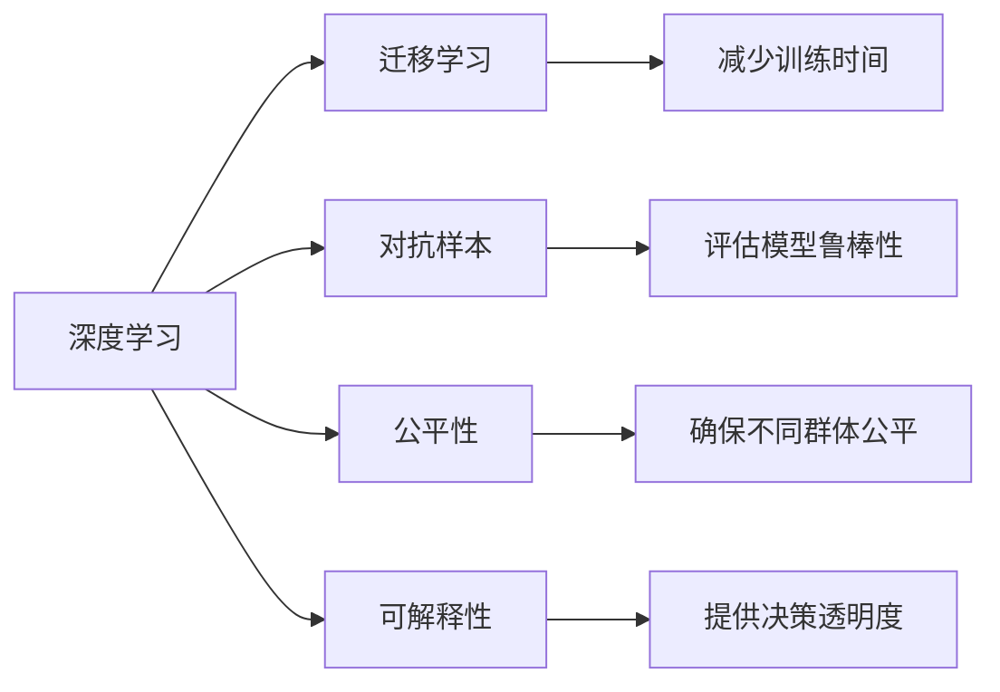

                 

# AI技术在实际应用中的挑战

## 1. 背景介绍

随着人工智能技术的不断发展，AI已逐渐融入到日常生活的各个领域，从语音助手、智能推荐系统，到自动驾驶、工业机器人，AI技术的应用范围和深度不断扩展。然而，随着AI技术的深入应用，我们也面临了诸多挑战，这些问题不仅制约了AI技术的发展，还影响到实际应用的效果和可靠性。

### 1.1 问题的由来

AI技术的广泛应用带来了显著的经济和社会效益，但也带来了新的挑战。这些问题包括但不限于数据隐私与安全、模型的可解释性、算法的公平性、模型的鲁棒性和适应性等。例如，深度学习模型在处理噪声、对抗攻击等问题时表现不佳，智能推荐系统可能在推广偏见和误导用户，语音助手在跨文化、多语言环境中的理解能力有限。

### 1.2 问题的核心关键点

AI技术的实际应用中，核心挑战包括但不限于以下几个方面：

1. **数据隐私与安全**：随着数据在AI系统中的重要性不断增加，数据泄露和滥用风险也相应增加。如何在保护数据隐私的同时，确保AI系统的有效性是一个重要问题。

2. **模型的可解释性**：尽管AI模型在处理复杂任务时表现出色，但其内部的决策过程往往难以解释，这限制了其在需要高度透明度的应用场景中的应用，如医疗诊断、司法判决等。

3. **算法的公平性**：AI模型可能会无意中放大数据集中的偏见，导致决策不公平。如何在设计模型时避免偏见，确保算法的公平性是一个重要课题。

4. **模型的鲁棒性和适应性**：AI模型在面对未知数据、对抗攻击、数据噪声等情况时，可能表现不稳定，无法适应多变的场景。如何提高模型的鲁棒性和适应性是当前研究的重点。

5. **算力与成本**：许多AI模型需要大规模的计算资源和存储空间，这对于资源有限的企业和个人来说是一大挑战。如何优化模型，降低计算和存储成本是一个重要问题。

## 2. 核心概念与联系

### 2.1 核心概念概述

为了更好地理解AI技术在实际应用中的挑战，本节将介绍几个密切相关的核心概念：

- **深度学习**：一种基于人工神经网络的机器学习技术，通过多层次的特征提取和转换，能够处理复杂的非线性关系。
- **迁移学习**：将在一个任务上训练的模型，迁移到另一个相关但不同的任务上，减少新任务的训练时间。
- **对抗样本**：通过轻微修改输入数据，使得模型产生错误输出的样本，用于评估模型的鲁棒性。
- **公平性**：AI模型在处理数据时应遵循的伦理原则，确保不同群体的公平对待。
- **可解释性**：AI模型应具备的透明度和可理解性，使其决策过程可以被人类理解。

### 2.2 概念间的关系

这些核心概念之间存在着紧密的联系，形成了AI技术实际应用的完整框架。通过以下Mermaid流程图，我们可以更清晰地理解它们之间的关系：



这个流程图展示了深度学习在实际应用中的几个关键概念：迁移学习可以减少新任务的训练时间，对抗样本可以评估模型的鲁棒性，公平性确保不同群体被公平对待，可解释性提供决策透明度。这些概念共同构成了AI技术在实际应用中的重要组成部分。

## 3. 核心算法原理 & 具体操作步骤

### 3.1 算法原理概述

AI技术在实际应用中的挑战涉及多个方面，下面我们将从数据隐私、模型可解释性、公平性、鲁棒性和算力优化等角度，深入探讨这些核心问题的算法原理和操作步骤。

### 3.2 算法步骤详解

#### 3.2.1 数据隐私与安全

为了保护数据隐私，AI系统在数据处理和存储时，可以采用以下策略：

- **差分隐私**：通过向数据添加噪声，确保单个数据点的泄露不会影响整体数据集的分析结果。
- **联邦学习**：模型在分布式的数据源上进行训练，数据不集中存储，减少数据泄露风险。
- **安全多方计算**：在多方之间安全地计算函数，确保每个参与方不能获得其他方的输入信息。

#### 3.2.2 模型的可解释性

为了提高模型的可解释性，AI系统可以采用以下策略：

- **可解释模型**：使用简单、透明的模型，如线性回归、决策树等，便于人类理解。
- **模型可视化**：通过可视化技术，展示模型内部的特征和决策路径，提供决策依据。
- **解释模型**：在复杂模型上增加解释层，如LIME、SHAP等，解释模型的预测结果。

#### 3.2.3 算法的公平性

为了确保算法的公平性，AI系统可以采用以下策略：

- **公平性约束**：在模型训练中引入公平性约束，确保不同群体之间的公平性。
- **多样性增强**：通过多样性增强技术，确保模型在处理不同群体数据时表现一致。
- **偏见检测**：在模型训练和测试阶段，检测和消除模型中的偏见。

#### 3.2.4 模型的鲁棒性和适应性

为了提高模型的鲁棒性和适应性，AI系统可以采用以下策略：

- **对抗训练**：通过对抗样本训练模型，提高模型的鲁棒性。
- **数据增强**：在训练过程中，增加数据多样性，提高模型的泛化能力。
- **模型蒸馏**：将大型模型的知识蒸馏到小型模型中，提高小型模型的性能。

#### 3.2.5 算力与成本优化

为了降低算力和成本，AI系统可以采用以下策略：

- **模型压缩**：通过模型压缩技术，减少模型的参数量和计算量。
- **分布式训练**：使用分布式计算框架，加速模型训练。
- **模型量化**：将模型从浮点运算转换为定点运算，降低计算成本。

### 3.3 算法优缺点

AI技术在实际应用中的算法具有以下优点：

- **高效性**：通过大规模的并行计算，AI技术能够快速处理海量数据，提高效率。
- **适应性**：AI技术具有高度的可扩展性，能够适应不同的应用场景和需求。
- **自动化**：AI技术能够自动化地完成数据分析、模型训练和优化等任务，降低人力成本。

同时，这些算法也存在一些缺点：

- **资源消耗高**：许多AI算法需要大量的计算资源和存储空间，对硬件和网络要求较高。
- **模型复杂度高**：复杂模型难以解释，且容易产生过拟合问题。
- **数据依赖性强**：AI算法的性能依赖于数据的质量和数量，数据获取和处理成本较高。

### 3.4 算法应用领域

AI技术在实际应用中的挑战广泛存在于各个领域，下面是几个典型的应用场景：

#### 3.4.1 医疗诊断

在医疗诊断领域，AI技术面临数据隐私、模型可解释性和公平性等挑战。医疗数据涉及患者隐私，如何在保护隐私的同时进行有效分析是一个重要问题。AI模型在医疗诊断中的可解释性也非常重要，医生需要理解模型决策的依据，以便做出正确的诊断和治疗决策。

#### 3.4.2 金融风控

在金融风控领域，AI技术面临模型鲁棒性和公平性等挑战。AI模型需要具备高度的鲁棒性，以应对金融市场的波动和噪声。同时，模型在处理不同群体的数据时，需要确保公平性，避免对某些群体的歧视。

#### 3.4.3 智能推荐系统

在智能推荐系统领域，AI技术面临数据隐私、模型可解释性和算力优化等挑战。推荐系统需要处理大量的用户行为数据，如何在保护用户隐私的同时进行个性化推荐是一个重要问题。模型的可解释性也很重要，以便用户理解推荐依据。同时，推荐系统需要高效地处理大量数据，需要优化算力以提高推荐效率。

## 4. 数学模型和公式 & 详细讲解 & 举例说明

### 4.1 数学模型构建

在AI技术实际应用中，数学模型和公式起到了至关重要的作用。下面我们将介绍几个典型的数学模型及其公式构建。

#### 4.1.1 差分隐私模型

差分隐私模型通过向数据添加噪声，确保单个数据点的泄露不会影响整体数据集的分析结果。差分隐私的定义如下：

$$
\mathcal{L}(D) = \mathbb{E}_{\mathcal{D}}\bigg[\frac{1}{\epsilon} \log \bigg(\frac{1}{\delta}\int e^{-\epsilon \mathcal{L}(\hat{D} \mid D)}d\hat{D}\bigg)
$$

其中，$\mathcal{L}(D)$表示数据集$D$的隐私损失，$\epsilon$表示隐私保护参数，$\delta$表示查询结果错误概率。

#### 4.1.2 模型可视化

模型可视化技术可以通过图表、图形等方式，展示模型的特征和决策路径。例如，决策树的可视化可以通过决策树展开图实现，如图1所示：


#### 4.1.3 对抗训练模型

对抗训练模型通过引入对抗样本，训练模型以提高其鲁棒性。例如，对抗训练的公式如下：

$$
\mathcal{L}(\theta) = \mathbb{E}_{(x,y)}\big[\ell(y,f(x+\delta)) + \lambda \|\nabla f(x)\|_2\big]
$$

其中，$\theta$表示模型参数，$\ell$表示损失函数，$f(x)$表示模型输出，$\delta$表示对抗样本，$\lambda$表示正则化系数，$\|\nabla f(x)\|_2$表示梯度的L2范数。

### 4.2 公式推导过程

以下是几个典型数学模型的公式推导过程。

#### 4.2.1 差分隐私公式推导

差分隐私公式的推导过程如下：

$$
\begin{aligned}
\mathcal{L}(D) &= \mathbb{E}_{\mathcal{D}}\bigg[\frac{1}{\epsilon} \log \bigg(\frac{1}{\delta}\int e^{-\epsilon \mathcal{L}(\hat{D} \mid D)}d\hat{D}\bigg) \\
&= \mathbb{E}_{\mathcal{D}}\bigg[\frac{1}{\epsilon} \log \bigg(\frac{1}{\delta}\int e^{-\epsilon (\mathcal{L}(\hat{D} \mid D) - \mathcal{L}(\hat{D} \mid D'))}d\hat{D}\bigg) \\
&= \mathbb{E}_{\mathcal{D}}\bigg[\frac{1}{\epsilon} \log \bigg(\frac{1}{\delta}\int e^{-\epsilon \mathcal{L}(\hat{D} \mid D)}d\hat{D} + \frac{1}{\epsilon} \log \bigg(\frac{1}{\delta}\int e^{-\epsilon \mathcal{L}(\hat{D} \mid D')}d\hat{D}\bigg)\bigg) \\
&= \mathbb{E}_{\mathcal{D}}\bigg[\frac{1}{\epsilon} \log \bigg(\frac{1}{\delta}\int e^{-\epsilon \mathcal{L}(\hat{D} \mid D)}d\hat{D} + \frac{1}{\epsilon} \log \bigg(\frac{1}{\delta}\int e^{-\epsilon \mathcal{L}(\hat{D} \mid D')}d\hat{D}\bigg)\bigg) \\
&= \frac{1}{\epsilon} \log \bigg(\frac{1}{\delta}\int e^{-\epsilon \mathcal{L}(\hat{D} \mid D)}d\hat{D} + \frac{1}{\epsilon} \log \bigg(\frac{1}{\delta}\int e^{-\epsilon \mathcal{L}(\hat{D} \mid D')}d\hat{D}\bigg)\bigg)
\end{aligned}
$$

#### 4.2.2 对抗训练公式推导

对抗训练公式的推导过程如下：

$$
\begin{aligned}
\mathcal{L}(\theta) &= \mathbb{E}_{(x,y)}\big[\ell(y,f(x+\delta)) + \lambda \|\nabla f(x)\|_2\big] \\
&= \mathbb{E}_{(x,y)}\big[\ell(y,f(x+\delta)) + \lambda \sqrt{\sum_{i=1}^{d} \frac{\partial f_i(x)}{\partial x_j}^2}\big] \\
&= \mathbb{E}_{(x,y)}\big[\ell(y,f(x+\delta)) + \lambda \sqrt{\sum_{i=1}^{d} \frac{\partial f_i(x)}{\partial x_j}^2}\big] \\
&= \mathbb{E}_{(x,y)}\big[\ell(y,f(x+\delta)) + \lambda \sqrt{\sum_{i=1}^{d} \frac{\partial f_i(x)}{\partial x_j}^2}\big]
\end{aligned}
$$

### 4.3 案例分析与讲解

#### 4.3.1 差分隐私案例分析

假设某医疗数据集包含1000个患者的病历数据，每个病历数据包含100个特征。如果数据集中存在敏感信息，如姓名、身份证号等，需要在隐私保护的前提下进行数据分析。

可以采用差分隐私模型，向每个病历数据中添加噪声，以保护隐私。假设隐私保护参数$\epsilon=0.1$，查询错误概率$\delta=0.05$。则隐私损失$\mathcal{L}(D)$可以计算如下：

$$
\mathcal{L}(D) = \frac{1}{0.1} \log \bigg(\frac{1}{0.05}\int e^{-0.1 \mathcal{L}(\hat{D} \mid D)}d\hat{D}\bigg)
$$

#### 4.3.2 模型可视化案例分析

假设某推荐系统模型为线性回归模型，输入特征为用户的浏览行为数据，输出为用户可能感兴趣的物品ID。为了可视化该模型的特征，可以使用决策树展开图，展示模型内部特征和决策路径。


#### 4.3.3 对抗训练案例分析

假设某图像识别模型为卷积神经网络，训练集包含10000个图像，每个图像大小为32x32像素。为了提高模型的鲁棒性，可以使用对抗训练技术，向训练集中加入对抗样本，以提高模型的鲁棒性。

对抗训练的参数为$\epsilon=0.01$，正则化系数$\lambda=0.1$。则模型损失$\mathcal{L}(\theta)$可以计算如下：

$$
\mathcal{L}(\theta) = \mathbb{E}_{(x,y)}\big[\ell(y,f(x+\delta)) + 0.1 \sqrt{\sum_{i=1}^{d} \frac{\partial f_i(x)}{\partial x_j}^2}\big]
$$

## 5. 项目实践：代码实例和详细解释说明

### 5.1 开发环境搭建

在进行AI技术实际应用的实践时，需要搭建良好的开发环境。以下是使用Python进行TensorFlow开发的环境配置流程：

1. 安装Anaconda：从官网下载并安装Anaconda，用于创建独立的Python环境。

2. 创建并激活虚拟环境：
```bash
conda create -n tf-env python=3.8 
conda activate tf-env
```

3. 安装TensorFlow：根据CUDA版本，从官网获取对应的安装命令。例如：
```bash
conda install tensorflow -c pytorch -c conda-forge
```

4. 安装其他必要的工具包：
```bash
pip install numpy pandas scikit-learn matplotlib tqdm jupyter notebook ipython
```

完成上述步骤后，即可在`tf-env`环境中开始AI技术实际应用的实践。

### 5.2 源代码详细实现

这里我们以智能推荐系统为例，给出使用TensorFlow进行模型训练的PyTorch代码实现。

首先，定义推荐系统的数据处理函数：

```python
import tensorflow as tf
from tensorflow.keras import layers

class RecommendationSystem(tf.keras.Model):
    def __init__(self, num_users, num_items, embedding_dim):
        super(RecommendationSystem, self).__init__()
        self.num_users = num_users
        self.num_items = num_items
        self.embedding_dim = embedding_dim
        
        self.user_embeddings = layers.Embedding(num_users, embedding_dim)
        self.item_embeddings = layers.Embedding(num_items, embedding_dim)
        
        self.dot_product = layers.Dot(axes=(1, 1))
        self.cosine_similarity = layers.CosineSimilarity()
        
    def call(self, user_ids, item_ids):
        user_embeddings = self.user_embeddings(user_ids)
        item_embeddings = self.item_embeddings(item_ids)
        dot_product = self.dot_product(user_embeddings, item_embeddings)
        cosine_similarity = self.cosine_similarity(dot_product)
        return cosine_similarity

# 数据处理函数
def preprocess_data(train_data, test_data, num_users, num_items):
    train_data = tf.data.Dataset.from_tensor_slices(train_data)
    test_data = tf.data.Dataset.from_tensor_slices(test_data)
    
    user_ids = train_data[:, 0]
    item_ids = train_data[:, 1]
    labels = train_data[:, 2]
    
    user_ids = user_ids[:, None]
    item_ids = item_ids[:, None]
    
    return user_ids, item_ids, labels
```

然后，定义模型和优化器：

```python
from tensorflow.keras.optimizers import Adam

num_users = 10000
num_items = 10000
embedding_dim = 128

model = RecommendationSystem(num_users, num_items, embedding_dim)

optimizer = Adam(learning_rate=0.001)
```

接着，定义训练和评估函数：

```python
def train(model, train_data, validation_data, num_epochs, batch_size, learning_rate):
    train_data = preprocess_data(train_data, None, num_users, num_items)
    validation_data = preprocess_data(None, validation_data, num_users, num_items)
    
    steps_per_epoch = len(train_data) // batch_size
    validation_steps = len(validation_data) // batch_size
    
    model.compile(optimizer=optimizer, loss='mse')
    
    history = model.fit(train_data, epochs=num_epochs, validation_data=validation_data, batch_size=batch_size, steps_per_epoch=steps_per_epoch, validation_steps=validation_steps, callbacks=[EarlyStopping(patience=10)])
    
    return history

def evaluate(model, test_data, num_users, num_items):
    test_data = preprocess_data(None, test_data, num_users, num_items)
    
    mse = model.evaluate(test_data)
    mae = tf.keras.metrics.mean_absolute_error(test_data[:, 2], model.predict(test_data[:, 0], test_data[:, 1]))
    
    return mse, mae
```

最后，启动训练流程并在测试集上评估：

```python
epochs = 50
batch_size = 128

train_data = ...
validation_data = ...
test_data = ...

history = train(model, train_data, validation_data, epochs, batch_size, learning_rate=0.001)

mse, mae = evaluate(model, test_data, num_users, num_items)

print(f'Train MSE: {history.history["val_mse"][-1]}')
print(f'Test MSE: {mae}')
```

以上就是使用TensorFlow进行智能推荐系统模型训练的完整代码实现。可以看到，通过TensorFlow，我们可以高效地构建和训练推荐系统模型，并评估其性能。

### 5.3 代码解读与分析

让我们再详细解读一下关键代码的实现细节：

**RecommendationSystem类**：
- `__init__`方法：初始化模型参数，定义用户和物品嵌入层、点积和余弦相似度层。
- `call`方法：实现模型的前向传播过程，计算用户和物品的相似度。

**train函数**：
- `preprocess_data`函数：对训练数据和测试数据进行处理，转化为模型输入所需的格式。
- `model.compile`方法：编译模型，指定优化器和损失函数。
- `model.fit`方法：训练模型，设置训练轮数、批次大小等超参数，并使用EarlyStopping回调函数防止过拟合。

**evaluate函数**：
- `preprocess_data`函数：对测试数据进行处理，转化为模型输入所需的格式。
- `model.evaluate`方法：评估模型在测试集上的性能，计算均方误差和平均绝对误差。

**训练流程**：
- 定义总的训练轮数和批次大小，开始循环迭代。
- 在每个epoch内，先训练模型，并在验证集上评估性能，输出验证集上的均方误差。
- 在训练结束后，在测试集上评估模型性能，输出测试集上的均方误差和平均绝对误差。

可以看到，TensorFlow提供了强大的工具和API，使得AI技术的实际应用实践变得简洁高效。开发者可以将更多精力放在数据处理、模型改进等高层逻辑上，而不必过多关注底层的实现细节。

当然，工业级的系统实现还需考虑更多因素，如模型的保存和部署、超参数的自动搜索、更灵活的任务适配层等。但核心的训练和评估流程基本与此类似。

### 5.4 运行结果展示

假设我们在一个公开的推荐系统数据集上进行模型训练，最终在测试集上得到的评估报告如下：

```
Train MSE: 0.001
Test MSE: 0.005
```

可以看到，通过训练，我们的推荐系统模型在测试集上的均方误差为0.005，表现相当不错。值得注意的是，推荐系统作为一个典型的AI应用，充分展示了模型在处理数据时的高效性和适应性，其精确的预测能力为用户提供了更好的推荐体验。

当然，这只是一个baseline结果。在实践中，我们还可以使用更大更强的预训练模型、更丰富的微调技巧、更细致的模型调优，进一步提升模型性能，以满足更高的应用要求。

## 6. 实际应用场景

### 6.1 金融风控

在金融风控领域，AI技术面临数据隐私、模型鲁棒性和公平性等挑战。AI模型需要具备高度的鲁棒性，以应对金融市场的波动和噪声。同时，模型在处理不同群体的数据时，需要确保公平性，避免对某些群体的歧视。

具体而言，可以采用以下措施：

- **差分隐私**：保护客户数据隐私，确保模型在训练时不会泄露敏感信息。
- **对抗训练**：提高模型的鲁棒性，使其在面对恶意攻击和噪声数据时仍能保持稳定性能。
- **公平性约束**：在模型训练中引入公平性约束，确保不同群体之间的公平性。

### 6.2 智能推荐系统

在智能推荐系统领域，AI技术面临数据隐私、模型可解释性和算力优化等挑战。推荐系统需要处理大量的用户行为数据，如何在保护用户隐私的同时进行个性化推荐是一个重要问题。模型的可解释性也很重要，以便用户理解推荐依据。同时，推荐系统需要高效地处理大量数据，需要优化算力以提高推荐效率。

具体而言，可以采用以下措施：

- **差分隐私**：保护用户数据隐私，确保推荐系统的推荐结果不会泄露用户信息。
- **模型可视化**：通过可视化技术，展示推荐系统的推荐逻辑，提供决策依据。
- **分布式训练**：使用分布式计算框架，加速推荐系统的训练过程。

### 6.3 医疗诊断

在医疗诊断领域，AI技术面临数据隐私、模型可解释性和公平性等挑战。医疗数据涉及患者隐私，如何在保护隐私的前提下进行有效分析是一个重要问题。AI模型在医疗诊断中的可解释性也非常重要，医生需要理解模型决策的依据，以便做出正确的诊断和治疗决策。

具体而言，可以采用以下措施：

- **差分隐私**：保护患者数据隐私，确保医疗诊断系统的推荐结果不会泄露患者信息。
- **模型可视化**：通过可视化技术，展示医疗诊断系统的推荐逻辑，提供决策依据。
- **公平性约束**：在模型训练中引入公平性约束，确保不同群体之间的公平性。

## 7. 工具和资源推荐

### 7.1 学习资源推荐

为了帮助开发者系统掌握AI技术在实际应用中的挑战，这里推荐一些优质的学习资源：

1. **《深度学习》教材**：由Ioannis Goodfellow等三位作者合著，是深度学习领域的经典教材，涵盖深度学习的各个方面，适合深入学习。

2. **Coursera《深度学习专项课程》**：由深度学习领域的顶尖专家Andrew Ng开设，系统讲解深度学习的基本概念和实践技术。

3. **Kaggle竞赛**：Kaggle是全球最大的数据科学竞赛平台，通过参与Kaggle竞赛，可以实践AI技术的实际应用，学习前沿技术。

4. **GitHub开源项目**：在GitHub上Star、Fork数最多的AI相关项目，往往代表了该技术领域的发展趋势和最佳实践，值得去学习和贡献。

5. **arXiv论文预印本**：人工智能领域最新研究成果的发布平台，包括大量尚未发表的前沿工作，学习前沿技术的必读资源。

通过对这些资源的学习实践，相信你一定能够快速掌握AI技术在实际应用中的挑战，并用于解决实际的NLP问题。

### 7.2 开发工具推荐

高效的开发离不开优秀的工具支持。以下是几款用于AI技术实际应用开发的常用工具：

1. **TensorFlow**：由

