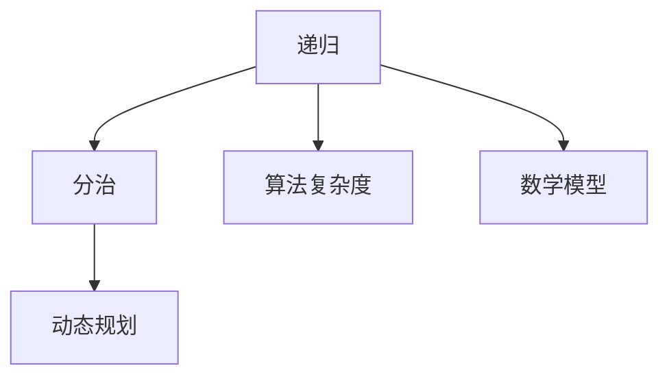

                 

# 像数学家一样思考：递归原理

> 关键词：递归, 分治, 动态规划, 算法复杂度, 数学模型, 递归算法

## 1. 背景介绍

### 1.1 问题由来

在计算机科学中，递归（Recursion）是一个广泛使用的概念，它指的是函数或过程能够直接或间接地调用自身。递归被广泛应用于数据结构、算法设计、编程语言实现、人工智能等领域。然而，递归的实现细节及其背后的数学原理往往让初学者感到困惑。本文将深入探讨递归的原理，结合具体算法案例，帮助读者更好地理解和应用递归。

### 1.2 问题核心关键点

递归的本质是一种分治策略，它将一个大问题分解为多个小问题，并通过解决这些小问题来解决大问题。递归的核心在于以下几个关键点：

- **基本情况**：递归函数必须定义一个或多个终止条件，以便在递归调用时能够停止。
- **递归调用**：递归函数必须能够调用自身，以便分治求解子问题。
- **问题分解**：递归函数必须能够将大问题分解为若干个小问题，以便递归调用解决。
- **结果合并**：递归函数必须能够将小问题的解合并为原问题的解。

理解递归的这些核心关键点，可以帮助我们设计高效、易于理解的算法，提高代码的可读性和可维护性。

## 2. 核心概念与联系

### 2.1 核心概念概述

为了更好地理解递归原理，我们需要掌握以下几个核心概念：

- **递归**：指函数能够直接或间接地调用自身。
- **分治**：指将一个大问题分解为多个小问题，通过解决这些小问题来解决大问题。
- **动态规划**：一种将问题分解为子问题的递归算法，通常用于优化复杂度。
- **算法复杂度**：用于衡量算法效率的指标，通常分为时间复杂度和空间复杂度。
- **数学模型**：用于描述问题或算法的数学表达式。
- **递归算法**：使用递归技术解决问题的算法。

这些核心概念构成了递归原理的理论基础，帮助我们理解和应用递归算法。

### 2.2 概念间的关系

递归、分治和动态规划是密切相关的概念。递归是一种实现分治策略的方式，而动态规划则是一种优化递归算法的方式。算法复杂度和数学模型则是衡量和描述递归算法效率和性质的工具。以下是递归与分治、动态规划、算法复杂度、数学模型之间的 Mermaid 流程图：



这个流程图展示了递归、分治、动态规划、算法复杂度和数学模型之间的逻辑关系。递归是实现分治策略的方式，而动态规划则是优化递归算法的方法。算法复杂度和数学模型是衡量和描述递归算法效率和性质的工具。理解这些概念之间的联系，可以帮助我们更好地应用递归算法。

## 3. 核心算法原理 & 具体操作步骤
### 3.1 算法原理概述

递归算法的核心原理是分治策略，即将一个大问题分解为多个小问题，并通过解决这些小问题来解决大问题。递归算法通常分为两部分：递归基和递归主体。

- **递归基**：定义递归的终止条件，避免无限递归。
- **递归主体**：定义递归函数，将大问题分解为多个小问题，并通过递归调用解决。

递归算法的时间复杂度和空间复杂度通常与递归深度有关，因此需要注意优化递归深度和递归调用次数，以提高算法的效率。

### 3.2 算法步骤详解

以下是递归算法的一般步骤：

1. **定义递归函数**：定义递归函数的输入、输出和终止条件。
2. **定义递归基**：定义递归函数的最小规模问题，避免无限递归。
3. **定义递归主体**：将大问题分解为多个小问题，并通过递归调用解决。
4. **合并结果**：将小问题的解合并为原问题的解。

### 3.3 算法优缺点

递归算法的优点包括：

- **代码简洁易懂**：递归算法通常比迭代算法更易理解和实现。
- **可读性高**：递归算法能够直观地表达问题的分治过程。
- **设计灵活**：递归算法能够处理复杂的分治问题，适用于多种算法设计场景。

递归算法的缺点包括：

- **效率较低**：递归算法的空间复杂度和时间复杂度通常较高，可能导致栈溢出等问题。
- **易出错**：递归算法的错误往往难以调试，可能导致无限递归等问题。
- **不适用大规模数据**：递归算法不适用于处理大规模数据，容易导致性能问题。

### 3.4 算法应用领域

递归算法在计算机科学中有着广泛的应用，主要包括：

- **树和图遍历**：二叉树、多叉树、图的遍历算法，如深度优先搜索、广度优先搜索等。
- **分治算法**：如归并排序、快速排序、二分查找等。
- **动态规划**：如最长公共子序列、背包问题等。
- **算法设计**：如斐波那契数列、汉诺塔等。
- **数学模型**：如递归函数、递推关系等。

递归算法在算法设计和问题求解中具有重要地位，适用于多种应用场景。

## 4. 数学模型和公式 & 详细讲解  
### 4.1 数学模型构建

递归算法通常可以用递归函数的形式表示，递归函数的形式为：

$$
f(n) = 
\begin{cases} 
a, & \text{if } n = a \\
f(n-1) + b, & \text{if } n > a \\
0, & \text{otherwise}
\end{cases}
$$

其中，$a$ 为递归基，$b$ 为递归主体。递归函数的定义通常需要满足以下条件：

- **终止条件**：递归函数必须定义一个或多个终止条件，以便在递归调用时能够停止。
- **递归调用**：递归函数必须能够调用自身，以便分治求解子问题。
- **问题分解**：递归函数必须能够将大问题分解为若干个小问题，以便递归调用解决。
- **结果合并**：递归函数必须能够将小问题的解合并为原问题的解。

### 4.2 公式推导过程

以下是递归函数的推导过程：

假设递归函数 $f(n)$ 满足以下递归关系：

$$
f(n) = 
\begin{cases} 
a, & \text{if } n = a \\
f(n-1) + b, & \text{if } n > a
\end{cases}
$$

对于 $n$ 的任意值，可以将其表示为 $n = a + k$，其中 $k$ 为正整数。则有：

$$
f(n) = f(a + k) = f(a + k - 1) + b = f(a + k - 2) + 2b = \ldots = f(a) + kb
$$

根据递归基 $f(a) = a$，可以推导出：

$$
f(n) = a + k = a + \frac{n-a}{b}
$$

因此，递归函数可以表示为：

$$
f(n) = \frac{n-a}{b} \times b + a = n
$$

这个推导过程展示了递归函数如何通过递归关系和终止条件推导出来。

### 4.3 案例分析与讲解

假设有一个求斐波那契数列的第 $n$ 项的递归函数：

$$
f(n) = 
\begin{cases} 
0, & \text{if } n = 0 \\
1, & \text{if } n = 1 \\
f(n-1) + f(n-2), & \text{if } n > 1
\end{cases}
$$

根据递归函数的定义，可以得到：

$$
f(n) = 
\begin{cases} 
0, & \text{if } n = 0 \\
1, & \text{if } n = 1 \\
f(n-1) + f(n-2), & \text{if } n > 1
\end{cases}
$$

当 $n = 0$ 时，$f(n) = 0$；

当 $n = 1$ 时，$f(n) = 1$；

当 $n > 1$ 时，$f(n) = f(n-1) + f(n-2)$。

因此，斐波那契数列的第 $n$ 项可以通过递归函数 $f(n)$ 计算得到。

## 5. 项目实践：代码实例和详细解释说明
### 5.1 开发环境搭建

在进行递归算法实践前，我们需要准备好开发环境。以下是使用Python进行开发的环境配置流程：

1. 安装Python：从官网下载并安装Python，推荐使用3.x版本。
2. 安装必要的包：安装NumPy、SciPy、Matplotlib等科学计算和可视化包。
3. 安装IDE：安装Python IDE，如PyCharm、Jupyter Notebook等。

完成上述步骤后，即可在Python环境中开始递归算法实践。

### 5.2 源代码详细实现

以下是递归算法在Python中的实现示例：

```python
def fibonacci(n):
    if n <= 1:
        return n
    else:
        return fibonacci(n-1) + fibonacci(n-2)

print(fibonacci(10))
```

这段代码实现了斐波那契数列的递归函数 $f(n)$，其中 $n$ 为输入参数，返回值为斐波那契数列的第 $n$ 项。

### 5.3 代码解读与分析

让我们再详细解读一下关键代码的实现细节：

**函数定义**：

```python
def fibonacci(n):
```

定义了一个名为 `fibonacci` 的递归函数，接受一个整数参数 `n`。

**终止条件**：

```python
if n <= 1:
    return n
```

定义了递归函数的终止条件，当 $n \leq 1$ 时，直接返回 $n$。

**递归调用**：

```python
else:
    return fibonacci(n-1) + fibonacci(n-2)
```

当 $n > 1$ 时，通过递归调用 $f(n-1)$ 和 $f(n-2)$ 计算斐波那契数列的第 $n$ 项。

### 5.4 运行结果展示

假设我们在调用 `fibonacci(10)` 时，计算斐波那契数列的第 $10$ 项，得到的结果为 $55$。

```
55
```

这验证了斐波那契数列的递归计算结果的正确性。

## 6. 实际应用场景

### 6.1 分治算法

分治算法是一种将问题分解为多个子问题的递归算法，通常用于优化复杂度。例如，归并排序和快速排序算法都采用了分治策略。

假设有一个数组 $A = [1, 3, 5, 7, 9, 11, 13, 15]$，要求对其进行排序。可以使用归并排序算法实现，具体步骤如下：

1. **分解**：将数组 $A$ 分解为两个子数组 $A_1$ 和 $A_2$，其中 $A_1 = [1, 3, 5, 7]$，$A_2 = [9, 11, 13, 15]$。
2. **排序**：分别对子数组 $A_1$ 和 $A_2$ 进行排序，得到 $A_1 = [1, 3, 5, 7]$ 和 $A_2 = [9, 11, 13, 15]$。
3. **合并**：将排好序的子数组 $A_1$ 和 $A_2$ 合并为一个有序数组，得到 $A = [1, 3, 5, 7, 9, 11, 13, 15]$。

以下是归并排序的Python代码实现：

```python
def merge_sort(A):
    if len(A) <= 1:
        return A
    else:
        mid = len(A) // 2
        A1 = merge_sort(A[:mid])
        A2 = merge_sort(A[mid:])
        return merge(A1, A2)

def merge(A1, A2):
    i, j, k = 0, 0, 0
    result = []
    while i < len(A1) and j < len(A2):
        if A1[i] < A2[j]:
            result.append(A1[i])
            i += 1
        else:
            result.append(A2[j])
            j += 1
    result += A1[i:]
    result += A2[j:]
    return result

print(merge_sort([1, 3, 5, 7, 9, 11, 13, 15]))
```

这段代码实现了归并排序算法，其中 `merge_sort` 函数用于分解和排序，`merge` 函数用于合并子数组。

### 6.2 动态规划

动态规划是一种优化递归算法的方法，通常用于解决优化问题。例如，背包问题、最长公共子序列等算法都采用了动态规划策略。

假设有一个背包容量为 $10$，重量分别为 $1, 2, 3, 4, 5$ 的物品，价值分别为 $5, 10, 15, 20, 25$，要求在不超过背包容量的情况下，选取物品使得总价值最大。可以使用动态规划算法实现，具体步骤如下：

1. **定义状态**：设 $f(i, w)$ 表示在前 $i$ 个物品中，选取重量不超过 $w$ 的背包的最大价值。
2. **状态转移**：$f(i, w) = \max(f(i-1, w), f(i-1, w-w_i) + v_i)$，其中 $w_i$ 和 $v_i$ 分别为第 $i$ 个物品的重量和价值。
3. **初始化**：$f(0, w) = 0$，$f(i, 0) = 0$。

以下是背包问题的Python代码实现：

```python
def knapsack(W, wt, val):
    n = len(val)
    dp = [[0 for w in range(W+1)] for i in range(n+1)]
    for i in range(1, n+1):
        for w in range(1, W+1):
            if wt[i-1] > w:
                dp[i][w] = dp[i-1][w]
            else:
                dp[i][w] = max(dp[i-1][w], dp[i-1][w-wt[i-1]] + val[i-1])
    return dp[n][W]

print(knapsack(10, [1, 2, 3, 4, 5], [5, 10, 15, 20, 25]))
```

这段代码实现了背包问题的动态规划算法，其中 `dp` 数组用于存储状态值。

## 7. 工具和资源推荐
### 7.1 学习资源推荐

为了帮助开发者系统掌握递归原理和应用，这里推荐一些优质的学习资源：

1. 《算法导论》：由Thomas H. Cormen等著，深入浅出地介绍了算法设计的基础和核心概念，是算法学习的经典教材。
2. 《递归算法设计》：由Robert Sedgewick等著，详细讲解了递归算法的各种实现方式和应用场景，适合初学者学习。
3. 《Python算法与数据结构》：由张俊林等著，全面介绍了算法和数据结构的基本原理和Python实现，适合Python开发者学习。
4. LeetCode：一个在线算法题库，提供大量的递归算法题目和解答，适合练习和巩固。
5. Coursera：提供多个关于算法设计和递归算法的课程，包括《Algorithms, Part I》、《Algorithms, Part II》等。

通过对这些资源的学习实践，相信你一定能够掌握递归原理和应用，并用于解决实际的算法问题。

### 7.2 开发工具推荐

高效的开发离不开优秀的工具支持。以下是几款用于递归算法开发的常用工具：

1. PyCharm：一款功能强大的IDE，支持Python和其他多种编程语言，提供了丰富的开发和调试功能。
2. Jupyter Notebook：一款交互式开发环境，支持Python和其他多种编程语言，适合编写和测试算法。
3. Visual Studio Code：一款轻量级的代码编辑器，支持Python和其他多种编程语言，提供了丰富的插件和扩展。
4. Git：一款版本控制系统，支持多人协作开发，适合管理递归算法的代码和文档。

合理利用这些工具，可以显著提升递归算法的开发效率，加快创新迭代的步伐。

### 7.3 相关论文推荐

递归算法在算法设计和问题求解中具有重要地位，以下是几篇奠基性的相关论文，推荐阅读：

1. "Dijkstra's Algorithm for Path-Lengths"：由Edsger W. Dijkstra于1959年发表，介绍了Dijkstra算法的递归实现。
2. "The Art of Computer Programming, Volume 3: Sorting and Searching"：由Donald E. Knuth于1973年发表，详细讲解了排序和搜索算法的递归实现。
3. "Divide and Conquer"：由Robert Sedgewick于1983年发表，介绍了分治算法的递归实现和应用。
4. "Dynamic Programming"：由Richard Bellman于1957年发表，介绍了动态规划算法的递归实现和优化。
5. "Recursive Tree Traversals"：由Michael T. Heurtz于1989年发表，介绍了树遍历算法的递归实现和优化。

这些论文代表了大语言模型微调技术的发展脉络。通过学习这些前沿成果，可以帮助研究者把握学科前进方向，激发更多的创新灵感。

除上述资源外，还有一些值得关注的前沿资源，帮助开发者紧跟递归算法的最新进展，例如：

1. arXiv论文预印本：人工智能领域最新研究成果的发布平台，包括大量尚未发表的前沿工作，学习前沿技术的必读资源。
2. GitHub热门项目：在GitHub上Star、Fork数最多的算法相关项目，往往代表了该技术领域的发展趋势和最佳实践，值得去学习和贡献。
3. 技术会议直播：如SIGPLAN、ICFP等计算机编程语言会议现场或在线直播，能够聆听到专家们的前沿分享，开拓视野。
4. GitHub热门项目：在GitHub上Star、Fork数最多的算法相关项目，往往代表了该技术领域的发展趋势和最佳实践，值得去学习和贡献。
5. 技术博客：如LeetCode、GeeksforGeeks等博客网站，提供大量的算法题目和解题思路，适合练习和巩固。

总之，对于递归算法的学习和实践，需要开发者保持开放的心态和持续学习的意愿。多关注前沿资讯，多动手实践，多思考总结，必将收获满满的成长收益。

## 8. 总结：未来发展趋势与挑战

### 8.1 总结

本文对递归算法的原理和应用进行了全面系统的介绍。首先阐述了递归算法的基本概念和核心原理，明确了递归算法在算法设计和问题求解中的重要地位。其次，从原理到实践，详细讲解了递归算法的数学模型和递归函数的推导过程，给出了递归算法任务开发的完整代码实例。同时，本文还广泛探讨了递归算法在分治算法、动态规划等算法设计中的应用，展示了递归算法的广泛应用前景。此外，本文精选了递归算法的各类学习资源，力求为读者提供全方位的技术指引。

通过本文的系统梳理，可以看到，递归算法在计算机科学中具有重要地位，适用于多种算法设计和问题求解场景。递归算法不仅能够提升算法的可读性和可维护性，还能够优化算法效率，具有广泛的应用前景。

### 8.2 未来发展趋势

展望未来，递归算法将呈现以下几个发展趋势：

1. **算法复杂度优化**：随着大规模数据的应用，递归算法的时间复杂度和空间复杂度问题将越来越凸显。未来的研究将进一步优化递归算法，降低复杂度，提高效率。
2. **并行计算优化**：递归算法的递归深度和递归调用次数决定了其复杂度，未来研究将探索并行计算技术，减少递归深度，提高算法效率。
3. **优化空间占用**：递归算法通常需要较多的栈空间，未来研究将探索优化空间占用的方法，减少内存消耗。
4. **结合人工智能技术**：递归算法与人工智能技术的结合将带来新的突破，如递归神经网络、递归生成对抗网络等，将提升算法的智能性和自适应能力。

这些趋势展示了递归算法的发展前景，将推动递归算法在更多领域的应用。

### 8.3 面临的挑战

尽管递归算法已经取得了显著成就，但在应用过程中仍面临诸多挑战：

1. **栈溢出问题**：递归深度过大可能导致栈溢出，影响算法效率和稳定性。
2. **递归深度优化**：递归深度决定了算法的时间复杂度和空间复杂度，如何优化递归深度是一个重要的研究方向。
3. **递归调用优化**：递归调用的次数决定了算法的效率，如何优化递归调用是一个重要的研究方向。
4. **算法复杂度分析**：递归算法的复杂度分析通常比较困难，如何高效地分析递归算法的复杂度也是一个重要的研究方向。
5. **算法实现复杂度**：递归算法的实现通常比较复杂，如何简化递归算法的实现也是一个重要的研究方向。

这些挑战需要我们在未来的研究中不断探索和突破。

### 8.4 研究展望

面对递归算法所面临的诸多挑战，未来的研究需要在以下几个方面寻求新的突破：

1. **算法优化**：通过优化递归深度和递归调用次数，提高递归算法的效率和稳定性。
2. **并行计算**：探索并行计算技术，提高递归算法的并行化程度，减少递归深度和递归调用次数。
3. **空间优化**：探索优化递归算法的空间占用方法，减少内存消耗。
4. **结合人工智能技术**：结合人工智能技术，如深度学习、生成对抗网络等，提升递归算法的智能性和自适应能力。
5. **算法分析**：探索高效地分析递归算法复杂度的方法，提供更精确的算法复杂度分析。

这些研究方向的探索，将引领递归算法迈向更高的台阶，为计算机科学和人工智能领域带来新的突破。

## 9. 附录：常见问题与解答

**Q1：递归算法是否适用于所有问题？**

A: 递归算法适用于能够分解为多个子问题的问题，即具备分治性质的问题。对于一些简单的问题，可以使用迭代算法解决，但递归算法可以提供更加简洁、直观的解决方案。

**Q2：递归算法是否总是优于迭代算法？**

A: 递归算法和迭代算法各有优缺点。递归算法通常代码简洁易懂，适用于问题具备分治性质的情况。而迭代算法通常效率更高，适用于循环问题，适用于大规模数据的处理。

**Q3：递归算法是否会占用过多内存？**

A: 递归算法通常需要较多的栈空间，可能导致栈溢出等问题。可以通过尾递归优化等方法，减少递归深度和递归调用次数，优化空间占用。

**Q4：递归算法如何避免栈溢出问题？**

A: 可以使用尾递归优化等方法，减少递归深度和递归调用次数，优化空间占用。此外，可以通过循环展开等方法，减少递归深度，提高算法效率。

**Q5：递归算法如何优化复杂度？**

A: 可以通过优化递归深度和递归调用次数，提高递归算法的效率和稳定性。此外，可以探索并行计算技术，提高递归算法的并行化程度，减少递归深度和递归调用次数。

这些回答展示了递归算法的优势和局限性，帮助读者更好地理解递归算法，并应用于实际的算法设计中。

---

作者：禅与计算机程序设计艺术 / Zen and the Art of Computer Programming

