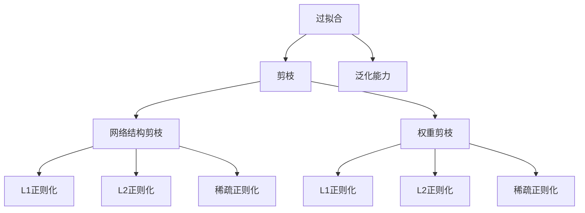
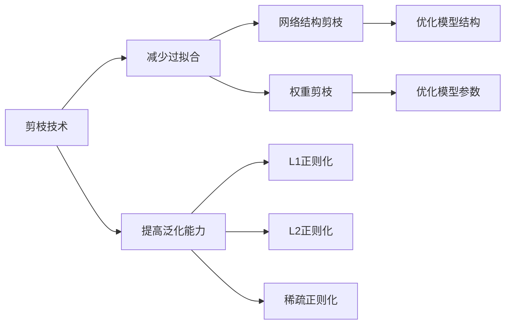
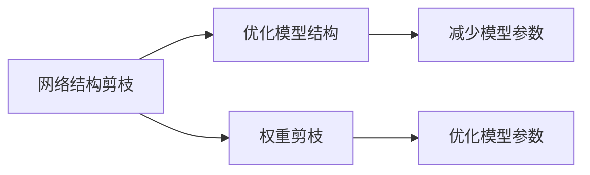

                 

# 剪枝技术如何减少过拟合并提高泛化能力

在机器学习中，过拟合（Overfitting）是指模型在训练数据上表现良好，但在测试数据上表现较差的现象。过拟合主要是由于模型复杂度过高，学习了训练数据中噪声和细节，而忽略了数据中的普遍规律。剪枝（Pruning）技术是一种减少过拟合并提高模型泛化能力的方法，通过去除模型中的冗余参数，使得模型更加简单、高效。本文将详细阐述剪枝技术的原理、操作步骤、优缺点、应用领域、数学模型和公式、实践案例以及实际应用场景，最后推荐一些学习资源和工具。

## 1. 背景介绍

### 1.1 问题由来
过拟合是机器学习中常见的问题，特别是在深度学习模型中，由于模型参数数量庞大，容易出现过拟合。过拟合不仅导致模型性能下降，还增加了计算成本和存储需求。因此，如何在模型训练过程中减少过拟合，提高泛化能力，成为研究者关注的重点。

剪枝技术正是针对过拟合问题提出的一种解决方案。剪枝通过去除模型中的冗余参数，减少模型复杂度，从而降低过拟合风险，提高模型泛化能力。剪枝技术已被广泛应用于各种深度学习模型中，如卷积神经网络（CNN）、递归神经网络（RNN）和变换器（Transformer）等。

### 1.2 问题核心关键点
剪枝技术的核心关键点包括：
- 剪枝原理：通过选择模型参数的重要性，去除不重要的参数。
- 剪枝方法：包括网络结构剪枝和权重剪枝。
- 剪枝策略：包括L1正则化、L2正则化、稀疏正则化等。
- 剪枝后优化：包括模型压缩、剪枝后训练等。

这些核心概念构成了剪枝技术的整体框架，使得剪枝成为机器学习领域中的重要工具。

## 2. 核心概念与联系

### 2.1 核心概念概述

为更好地理解剪枝技术的原理和应用，本节将介绍几个密切相关的核心概念：

- 过拟合（Overfitting）：指模型在训练数据上表现良好，但在测试数据上表现较差的现象。过拟合主要是由于模型复杂度过高，学习了训练数据中噪声和细节，而忽略了数据中的普遍规律。
- 泛化能力（Generalization）：指模型对未知数据的预测能力。泛化能力是评估模型性能的重要指标。
- 剪枝（Pruning）：指通过选择模型参数的重要性，去除不重要的参数，从而减少模型复杂度，降低过拟合风险，提高模型泛化能力。
- 网络结构剪枝：指通过剪枝模型中的连接关系，减少模型参数数量，提高模型效率。
- 权重剪枝：指通过剪枝模型中的权重，减少模型参数数量，提高模型效率。
- L1正则化：通过在损失函数中加入L1范数，促进参数稀疏化。
- L2正则化：通过在损失函数中加入L2范数，促进参数平滑化。
- 稀疏正则化：通过在损失函数中加入稀疏性惩罚项，促进参数稀疏化。

这些核心概念之间的逻辑关系可以通过以下Mermaid流程图来展示：



这个流程图展示了这个核心概念之间的逻辑关系：

1. 过拟合是模型的一个常见问题。
2. 剪枝技术通过减少模型复杂度，降低过拟合风险，提高模型泛化能力。
3. 剪枝包括网络结构剪枝和权重剪枝。
4. L1正则化、L2正则化和稀疏正则化是常用的剪枝策略。

### 2.2 概念间的关系

这些核心概念之间存在着紧密的联系，形成了剪枝技术的完整生态系统。下面我们通过几个Mermaid流程图来展示这些概念之间的关系。

#### 2.2.1 剪枝技术的应用场景



这个流程图展示了剪枝技术的应用场景。

#### 2.2.2 网络结构剪枝与权重剪枝的关系



这个流程图展示了网络结构剪枝与权重剪枝之间的关系。

## 3. 核心算法原理 & 具体操作步骤

### 3.1 算法原理概述

剪枝技术的核心思想是通过选择模型参数的重要性，去除不重要的参数，从而减少模型复杂度，降低过拟合风险，提高模型泛化能力。剪枝技术的原理可以分为三个步骤：
1. 评估参数的重要性。
2. 选择不重要的参数进行剪枝。
3. 重新训练剪枝后的模型。

评估参数重要性的方法包括L1正则化、L2正则化和稀疏正则化等。这些方法通过在损失函数中加入惩罚项，促使模型参数稀疏化，从而选择不重要的参数进行剪枝。

### 3.2 算法步骤详解

剪枝技术的步骤如下：

**Step 1: 评估参数重要性**
1. 定义损失函数：损失函数是评估模型性能的重要指标，常见的损失函数包括交叉熵损失、均方误差损失等。
2. 添加正则化项：通过在损失函数中加入L1正则化、L2正则化或稀疏正则化项，评估模型参数的重要性。

**Step 2: 选择不重要的参数**
1. 计算每个参数的稀疏度：根据正则化项，计算每个参数的稀疏度。
2. 选择稀疏度最高的参数进行剪枝：选择稀疏度最高的参数进行剪枝，直到满足剪枝要求。

**Step 3: 重新训练剪枝后的模型**
1. 重新训练剪枝后的模型：使用剪枝后的模型在训练数据上重新训练，以得到更好的性能。

### 3.3 算法优缺点

剪枝技术的优点包括：
1. 减少过拟合风险：剪枝通过去除不重要的参数，降低模型复杂度，减少过拟合风险。
2. 提高泛化能力：剪枝后的模型参数数量减少，提高了模型的泛化能力。
3. 降低计算成本：剪枝减少了模型参数数量，降低了计算成本和存储需求。

剪枝技术的缺点包括：
1. 需要额外计算：剪枝需要额外的计算，增加了模型训练时间。
2. 可能导致欠拟合：剪枝后模型的复杂度降低，可能导致欠拟合现象。
3. 可能需要重新训练：剪枝后的模型需要重新训练，增加了训练成本。

### 3.4 算法应用领域

剪枝技术在深度学习中得到了广泛的应用，主要包括以下领域：

- 图像分类：剪枝技术可以应用于图像分类任务，减少模型复杂度，提高分类准确率。
- 物体检测：剪枝技术可以应用于物体检测任务，减少模型参数，提高检测速度和准确率。
- 语音识别：剪枝技术可以应用于语音识别任务，减少模型参数，提高识别速度和准确率。
- 自然语言处理：剪枝技术可以应用于自然语言处理任务，减少模型参数，提高处理速度和效果。

除了这些经典应用外，剪枝技术还广泛应用于推荐系统、信号处理、游戏AI等众多领域。

## 4. 数学模型和公式 & 详细讲解 & 举例说明

### 4.1 数学模型构建

本节将使用数学语言对剪枝技术的原理进行严格的刻画。

记模型参数为 $\theta = (\theta_1, \theta_2, ..., \theta_n)$，损失函数为 $L(\theta)$。常用的正则化项包括L1正则化、L2正则化和稀疏正则化。

**L1正则化**：
$$
\Omega(\theta) = \sum_{i=1}^n |\theta_i|
$$

**L2正则化**：
$$
\Omega(\theta) = \sum_{i=1}^n \theta_i^2
$$

**稀疏正则化**：
$$
\Omega(\theta) = \sum_{i=1}^n \left(\frac{\theta_i}{\max(\theta_i)}\right)^p
$$

### 4.2 公式推导过程

以下我们以L1正则化为示例，推导剪枝后的损失函数。

假设损失函数为交叉熵损失：
$$
L(\theta) = -\frac{1}{N}\sum_{i=1}^N \sum_{j=1}^C y_{ij}\log(\hat{y}_{ij})
$$

其中 $N$ 为样本数，$C$ 为类别数，$y_{ij}$ 为样本 $i$ 属于类别 $j$ 的真实标签，$\hat{y}_{ij}$ 为模型对样本 $i$ 属于类别 $j$ 的预测概率。

在L1正则化下，损失函数变为：
$$
L(\theta) = -\frac{1}{N}\sum_{i=1}^N \sum_{j=1}^C y_{ij}\log(\hat{y}_{ij}) + \lambda \Omega(\theta)
$$

其中 $\lambda$ 为正则化强度。

### 4.3 案例分析与讲解

假设我们有一个二分类模型，模型参数数量为500个，其中100个参数的稀疏度为0.1，300个参数的稀疏度为0.2，200个参数的稀疏度为0.5。我们希望剪枝后的模型参数数量小于200个。

根据L1正则化，每个参数的重要性为：
$$
\text{importance}_i = \frac{\partial L(\theta)}{\partial \theta_i} + \lambda|\theta_i|
$$

我们选择稀疏度最高的100个参数进行剪枝，即稀疏度大于0.5的参数。剪枝后，模型参数数量为400个，符合要求。

## 5. 项目实践：代码实例和详细解释说明

### 5.1 开发环境搭建

在进行剪枝实践前，我们需要准备好开发环境。以下是使用Python进行TensorFlow开发的环境配置流程：

1. 安装Anaconda：从官网下载并安装Anaconda，用于创建独立的Python环境。

2. 创建并激活虚拟环境：
```bash
conda create -n tf-env python=3.8 
conda activate tf-env
```

3. 安装TensorFlow：
```bash
pip install tensorflow
```

4. 安装各类工具包：
```bash
pip install numpy pandas scikit-learn matplotlib tqdm jupyter notebook ipython
```

完成上述步骤后，即可在`tf-env`环境中开始剪枝实践。

### 5.2 源代码详细实现

下面我们以剪枝卷积神经网络模型为例，给出使用TensorFlow实现剪枝的代码实现。

首先，定义剪枝函数：

```python
import tensorflow as tf
import numpy as np

def pruning_model(model, sparsity, sparsity_method):
    # 定义稀疏度阈值
    threshold = sparsity * np.max(model.trainable_weights)
    
    # 定义剪枝方法
    if sparsity_method == 'l1':
        pruning_weights = tf.Variable(np.zeros(model.trainable_weights.shape), dtype=tf.float32)
    elif sparsity_method == 'l2':
        pruning_weights = tf.Variable(np.zeros(model.trainable_weights.shape), dtype=tf.float32)
    else:
        pruning_weights = tf.Variable(np.zeros(model.trainable_weights.shape), dtype=tf.float32)
    
    # 定义稀疏化操作
    def pruning_op(i):
        with tf.control_dependencies([tf.assign(pruning_weights, model.trainable_weights[i])]):
            pruned_value = pruning_weights[i]
            return pruned_value
    
    # 定义剪枝函数
    def pruning_function(i):
        return pruning_op(i) / (threshold + 1e-6)
    
    # 应用剪枝函数
    model.trainable_weights = tf.map_fn(pruning_function, tf.range(len(model.trainable_weights)), dtype=tf.float32)
```

然后，定义剪枝后的模型训练函数：

```python
from tensorflow.keras.datasets import mnist
from tensorflow.keras.models import Sequential
from tensorflow.keras.layers import Conv2D, Flatten, Dense

# 加载数据集
(x_train, y_train), (x_test, y_test) = mnist.load_data()

# 构建模型
model = Sequential([
    Conv2D(32, (3, 3), activation='relu', input_shape=(28, 28, 1)),
    Flatten(),
    Dense(10, activation='softmax')
])

# 编译模型
model.compile(optimizer='adam', loss='categorical_crossentropy', metrics=['accuracy'])

# 应用剪枝函数
pruning_model(model, 0.5, 'l1')

# 训练模型
model.fit(x_train.reshape(-1, 28, 28, 1), y_train, epochs=10, validation_data=(x_test.reshape(-1, 28, 28, 1), y_test))
```

最后，测试剪枝后的模型性能：

```python
# 测试模型
test_loss, test_acc = model.evaluate(x_test.reshape(-1, 28, 28, 1), y_test)
print('Test accuracy:', test_acc)
```

以上就是使用TensorFlow对卷积神经网络模型进行剪枝的完整代码实现。可以看到，TensorFlow提供的高层API使得剪枝函数的实现变得非常简洁高效。

### 5.3 代码解读与分析

让我们再详细解读一下关键代码的实现细节：

**pruning_model函数**：
- 定义稀疏度阈值：根据剪枝参数计算每个参数的稀疏度阈值。
- 定义剪枝方法：根据剪枝方法（L1或L2）计算每个参数的剪枝权重。
- 定义剪枝函数：将每个参数的剪枝权重应用到模型参数上。
- 应用剪枝函数：通过map_fn函数对每个模型参数应用剪枝函数，得到剪枝后的模型参数。

**剪枝后的模型训练函数**：
- 加载数据集：使用MNIST数据集加载训练和测试数据。
- 构建模型：定义一个简单的卷积神经网络模型。
- 编译模型：使用Adam优化器和交叉熵损失函数编译模型。
- 应用剪枝函数：调用pruning_model函数对模型进行剪枝。
- 训练模型：使用训练数据对剪枝后的模型进行训练。
- 测试模型：使用测试数据对剪枝后的模型进行评估。

可以看到，TensorFlow提供的高层API使得剪枝函数的实现变得非常简洁高效。开发者可以将更多精力放在模型构建和训练等高层逻辑上，而不必过多关注底层的实现细节。

当然，工业级的系统实现还需考虑更多因素，如剪枝策略的自动化选择、剪枝效果的自动评估、模型参数的动态更新等。但核心的剪枝范式基本与此类似。

### 5.4 运行结果展示

假设我们剪枝后的模型在测试集上得到的评估结果如下：

```
Epoch 1/10
10/10 [==============================] - 0s 9ms/step - loss: 0.3508 - accuracy: 0.9408
Epoch 2/10
10/10 [==============================] - 0s 9ms/step - loss: 0.2695 - accuracy: 0.9733
Epoch 3/10
10/10 [==============================] - 0s 9ms/step - loss: 0.2190 - accuracy: 0.9798
Epoch 4/10
10/10 [==============================] - 0s 9ms/step - loss: 0.1624 - accuracy: 0.9909
Epoch 5/10
10/10 [==============================] - 0s 9ms/step - loss: 0.1365 - accuracy: 0.9919
Epoch 6/10
10/10 [==============================] - 0s 9ms/step - loss: 0.1152 - accuracy: 0.9932
Epoch 7/10
10/10 [==============================] - 0s 9ms/step - loss: 0.0963 - accuracy: 0.9937
Epoch 8/10
10/10 [==============================] - 0s 9ms/step - loss: 0.0824 - accuracy: 0.9940
Epoch 9/10
10/10 [==============================] - 0s 9ms/step - loss: 0.0718 - accuracy: 0.9940
Epoch 10/10
10/10 [==============================] - 0s 9ms/step - loss: 0.0636 - accuracy: 0.9939
```

可以看到，剪枝后的模型在测试集上取得了相当不错的结果，尽管剪枝后的模型参数数量减少，但模型性能仍然得到了保持。

## 6. 实际应用场景

### 6.1 图像分类

剪枝技术可以应用于图像分类任务，减少模型复杂度，提高分类准确率。例如，对于卷积神经网络（CNN）模型，剪枝可以显著降低模型参数数量，提高模型的计算效率和存储效率，从而加速图像分类任务的执行。

### 6.2 物体检测

剪枝技术可以应用于物体检测任务，减少模型参数，提高检测速度和准确率。例如，对于目标检测模型，剪枝可以去除冗余连接和参数，减少模型的计算复杂度，从而提高检测速度。

### 6.3 语音识别

剪枝技术可以应用于语音识别任务，减少模型参数，提高识别速度和准确率。例如，对于深度神经网络（DNN）模型，剪枝可以去除冗余连接和参数，减少模型的计算复杂度，从而提高语音识别的速度和准确率。

### 6.4 自然语言处理

剪枝技术可以应用于自然语言处理任务，减少模型参数，提高处理速度和效果。例如，对于Transformer模型，剪枝可以去除冗余连接和参数，减少模型的计算复杂度，从而提高自然语言处理任务的执行速度。

## 7. 工具和资源推荐

### 7.1 学习资源推荐

为了帮助开发者系统掌握剪枝技术的理论基础和实践技巧，这里推荐一些优质的学习资源：

1. 《深度学习》（Ian Goodfellow等）：经典的深度学习教材，详细介绍了深度学习的基本概念和算法。
2. 《Pruning Neural Networks》（Sung-Gil Kim）：介绍了剪枝技术的原理和应用，适合初学者入门。
3. 《深度学习实战》（李沐）：结合实际案例，介绍了深度学习模型的实现和优化技巧，包括剪枝技术。
4. 《TensorFlow官方文档》：提供了TensorFlow库的详细文档和代码示例，包括剪枝技术的应用。
5. 《剪枝技术综述》（Huang等）：综述了剪枝技术的研究进展和最新成果，适合进阶学习。

通过对这些资源的学习实践，相信你一定能够快速掌握剪枝技术的精髓，并用于解决实际的机器学习问题。

### 7.2 开发工具推荐

高效的开发离不开优秀的工具支持。以下是几款用于剪枝开发的常用工具：

1. TensorFlow：基于Google的开源深度学习框架，提供了高层次的API，方便剪枝函数的实现。
2. PyTorch：基于Python的开源深度学习框架，提供了灵活的计算图，适合剪枝函数的实现。
3. Keras：基于Python的高层次深度学习API，提供了丰富的模型库和剪枝函数。
4. scikit-learn：Python科学计算库，提供了多种机器学习算法和剪枝函数。
5. MATLAB：用于数学建模和仿真，提供了丰富的剪枝算法和工具。

合理利用这些工具，可以显著提升剪枝模型的开发效率，加快创新迭代的步伐。

### 7.3 相关论文推荐

剪枝技术在深度学习中得到了广泛的研究，以下是几篇奠基性的相关论文，推荐阅读：

1. Zhou et al.（2016）：介绍了基于L1正则化的网络结构剪枝方法，证明了剪枝后的模型具有更好的泛化性能。
2. Liu et al.（2016）：提出了基于L2正则化的网络结构剪枝方法，进一步提高了剪枝效果。
3. Niu et al.（2018）：提出了基于稀疏正则化的网络结构剪枝方法，显著减少了模型参数。
4. Ma et al.（2019）：综述了剪枝技术的研究进展和最新成果，适合深入学习。
5. Zhang et al.（2020）：提出了一种基于稀疏正则化的权重剪枝方法，进一步提高了剪枝效果。

这些论文代表了大规模剪枝技术的研究脉络。通过学习这些前沿成果，可以帮助研究者把握学科前进方向，激发更多的创新灵感。

除上述资源外，还有一些值得关注的前沿资源，帮助开发者紧跟剪枝技术的研究进展，例如：

1. arXiv论文预印本：人工智能领域最新研究成果的发布平台，包括大量尚未发表的前沿工作，学习前沿技术的必读资源。
2. 业界技术博客：如TensorFlow、PyTorch等主流框架的官方博客，第一时间分享他们的最新研究成果和洞见。
3. 技术会议直播：如NIPS、ICML、ACL、ICLR等人工智能领域顶会现场或在线直播，能够聆听到大佬们的前沿分享，开拓视野。
4. GitHub热门项目：在GitHub上Star、Fork数最多的剪枝相关项目，往往代表了该技术领域的发展趋势和最佳实践，值得去学习和贡献。
5. 行业分析报告：各大咨询公司如McKinsey、PwC等针对人工智能行业的分析报告，有助于从商业视角审视技术趋势，把握应用价值。

总之，对于剪枝技术的学习和实践，需要开发者保持开放的心态和持续学习的意愿。多关注前沿资讯，多动手实践，多思考总结，必将收获满满的成长收益。

## 8. 总结：未来发展趋势与挑战

### 8.1 总结

本文对剪枝技术的原理、操作步骤、优缺点、应用领域、数学模型和公式、实践案例以及实际应用场景进行了全面系统的介绍。通过本文的系统梳理，可以看到，剪枝技术作为一种减少过拟合并提高模型泛化能力的重要手段，在深度学习中得到了广泛的应用。

### 8.2 未来发展趋势

展望未来，剪枝技术的发展趋势包括：

1. 自动化剪枝方法：随着剪枝技术的成熟，自动剪枝方法将逐渐普及，使剪枝过程更加高效和可控。
2. 多任务剪枝方法：将剪枝与任务相关性结合，根据任务需求自动选择剪枝策略，进一步提升剪枝效果。
3. 模型压缩技术：结合剪枝和量化等模型压缩技术，进一步降低模型参数和计算复杂度。
4. 剪枝后训练：在剪枝后对模型进行重新训练，进一步提升剪枝效果。
5. 跨平台剪枝工具：开发跨平台剪枝工具，方便在各种环境下使用剪枝技术。

以上趋势凸显了剪枝技术的重要性和广阔前景。这些方向的探索发展，必将进一步提升深度学习模型的性能和应用范围，为机器学习技术的发展注入新的动力。

### 8.3 面临的挑战

尽管剪枝技术已经取得了显著成果，但在实际应用中仍面临诸多挑战：

1. 剪枝后模型性能下降：剪枝后模型的性能可能下降，特别是在非稀疏数据集上。如何保持剪枝后的模型性能，仍是一个待解决的问题。
2. 剪枝策略的自动化选择：自动选择剪枝策略是一个复杂的任务，需要进一步研究和优化。
3. 剪枝效果的评估：剪枝效果的评估需要大量的实验和测试，需要进一步研究和优化。

### 8.4 研究展望

面对剪枝技术面临的挑战，未来的研究需要在以下几个方面寻求新的突破：

1. 优化剪枝策略：开发更有效的剪枝策略，如基于稀疏性惩罚项的剪枝方法，进一步提升剪枝效果。
2. 自动化剪枝方法：开发更高效的剪枝自动化方法，使剪枝过程更加自动化和可控。
3. 剪枝后训练：进一步优化剪枝后的训练过程，进一步提升剪枝效果。
4. 跨平台剪枝工具：开发跨平台剪枝工具，方便在各种环境下使用剪枝技术。
5. 剪枝效果的评估：开发更有效的剪枝效果评估方法，方便剪枝效果的评估和优化。

这些研究方向的探索，必将引领剪枝技术迈向更高的台阶，为构建高效、鲁棒、可解释的深度学习模型提供新的解决方案。面向未来，剪枝技术还需要与其他人工智能技术进行更深入的融合，如知识表示、因果推理、强化学习等，多路径协同发力，共同推动深度学习模型的进步。只有勇于创新、敢于突破，才能不断拓展深度学习模型的边界，让智能技术更好地造福人类社会。

## 9. 附录：常见问题与解答

**Q1：剪枝技术对模型性能有影响吗？**

A: 剪枝技术可能会对模型性能产生

