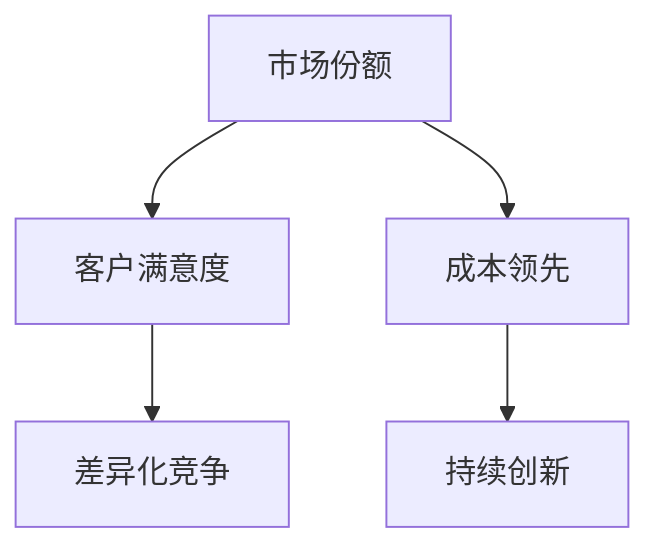

                 

## 1. 背景介绍

在商战的疆场上，强者愈强，弱者愈弱。商业竞争的胜利往往不是靠一时的勇猛，而是靠长期策略和持续的创新。企业的生存之道，在于持续地创造价值，超越对手。而在一个看似稳定的环境中，只有不断追求卓越，才能在变化莫测的市场中生存下来。

### 1.1 商业竞争的现状

在当今这个快速变化的商业环境中，传统竞争优势正在迅速减弱。消费者需求的多样化、竞争对手的不断涌现、技术的日新月异，使得企业必须时刻保持警觉，不断调整战略，才能在市场中占据一席之地。

### 1.2 商业竞争的本质

商业竞争的本质是企业间争夺市场份额、客户资源、品牌影响力的较量。胜出的关键在于能否以最低的成本、最快的速度、最高的效率，满足客户需求，提升产品或服务的竞争力。

### 1.3 商业竞争的残酷性

商业竞争是残酷的。只有不断追求卓越，才能在激烈的市场竞争中脱颖而出。只有保持领先，才能在变化莫测的市场中生存下去。企业必须不断创新、提升效率、降低成本，才能在竞争中取得优势。

## 2. 核心概念与联系

### 2.1 核心概念概述

为了更好地理解商业竞争的残酷性，我们首先需要了解几个核心概念：

- **市场份额（Market Share）**：企业在特定市场或产品类别中所占的比例，反映了企业的竞争力。
- **客户满意度（Customer Satisfaction）**：客户对产品或服务的满意程度，直接影响企业的销售和口碑。
- **成本领先（Cost Leadership）**：通过降低成本，提高价格竞争力，在市场中占据有利位置。
- **差异化竞争（Differentiation）**：通过独特的品牌、产品或服务，满足客户的特殊需求，实现差异化竞争。
- **持续创新（Continuous Innovation）**：不断推出新产品、新服务，以适应市场需求的变化，保持竞争优势。

### 2.2 概念间的关系

这些核心概念之间的关系可以用以下Mermaid流程图来展示：



这个流程图展示了一些核心概念之间的联系：

1. 市场份额的提升依赖于客户满意度的提高。只有客户满意度高，企业才能拥有更高的市场份额。
2. 成本领先和差异化竞争是提高客户满意度的两个重要手段。成本领先可以通过降低价格来吸引客户，差异化竞争则通过提供独特的产品或服务来满足客户需求。
3. 持续创新是保持成本领先和差异化竞争的关键。只有不断创新，企业才能在激烈的市场竞争中保持领先地位。

## 3. 核心算法原理 & 具体操作步骤

### 3.1 算法原理概述

商业竞争的核心在于持续创新，通过不断推出新产品、新服务，以满足客户需求，提升市场份额。竞争优势的构建需要基于市场分析和客户需求，通过迭代优化，不断提升产品或服务的竞争力。

### 3.2 算法步骤详解

基于持续创新的商业竞争策略，我们可以将其拆解为以下几个步骤：

**Step 1: 市场分析**

- 收集市场数据，分析竞争对手和客户需求的变化。
- 利用数据挖掘、统计分析等技术，识别市场机会和潜在风险。
- 制定市场策略，明确目标市场和客户群体。

**Step 2: 客户需求分析**

- 通过调研、问卷、访谈等方式，收集客户反馈和需求。
- 利用机器学习、自然语言处理等技术，分析客户评论和社交媒体数据。
- 识别客户痛点和需求，设计有针对性的产品或服务。

**Step 3: 产品或服务设计**

- 设计符合市场需求的产品或服务，满足客户需求。
- 通过迭代优化，不断提升产品或服务的质量和用户体验。
- 引入创新技术，如人工智能、大数据分析等，提高产品或服务的竞争力。

**Step 4: 测试和反馈**

- 在目标市场中测试产品或服务，收集客户反馈。
- 分析客户反馈，识别产品或服务的不足和改进点。
- 根据客户反馈，迭代优化产品或服务。

**Step 5: 市场推广**

- 制定市场推广策略，提高产品或服务的曝光率。
- 利用社交媒体、搜索引擎优化等手段，扩大产品或服务的覆盖面。
- 通过客户推荐、优惠活动等手段，提高产品或服务的转化率。

### 3.3 算法优缺点

持续创新的商业竞争策略具有以下优点：

- 提升客户满意度，增加市场份额。
- 通过不断优化，提高产品或服务的竞争力。
- 引入新技术，提高生产效率，降低成本。

同时，该策略也存在一些缺点：

- 需要持续投入研发和市场推广费用。
- 竞争激烈的市场环境要求企业不断创新，增加了企业运营压力。
- 新产品、新服务的引入可能会引发客户的不适应和抵触。

### 3.4 算法应用领域

商业竞争的持续创新策略在多个领域中得到了广泛应用，例如：

- **电商行业**：通过迭代优化商品种类和促销策略，提升客户购买体验和满意度。
- **金融行业**：通过引入大数据分析、人工智能等技术，提高风险控制能力和客户服务水平。
- **制造业**：通过创新制造工艺和引入智能设备，提升生产效率和产品质量。
- **科技行业**：通过持续推出新产品和新技术，保持技术领先地位，引领市场发展。

## 4. 数学模型和公式 & 详细讲解 & 举例说明

### 4.1 数学模型构建

为了更好地描述商业竞争的持续创新过程，我们可以构建以下数学模型：

设企业i在时间t的市场份额为 $S_i(t)$，客户满意度为 $C_i(t)$，成本为 $C_i(t)$，差异化竞争水平为 $D_i(t)$。则企业i的收益函数为：

$$
R_i(t) = S_i(t) \cdot C_i(t) \cdot D_i(t)
$$

其中 $C_i(t)$ 和 $D_i(t)$ 通过客户满意度和差异化竞争水平，直接影响企业的市场份额 $S_i(t)$。而 $C_i(t)$ 和 $D_i(t)$ 又受到企业的持续创新策略 $I_i(t)$ 的影响。

### 4.2 公式推导过程

假设企业在时间 $t+1$ 的收益函数为 $R_{i,next}(t+1)$，则有：

$$
R_{i,next}(t+1) = S_i(t+1) \cdot C_i(t+1) \cdot D_i(t+1)
$$

企业通过持续创新策略 $I_i(t)$，对市场份额 $S_i(t)$、客户满意度 $C_i(t)$ 和差异化竞争水平 $D_i(t)$ 产生影响。具体公式如下：

$$
S_i(t+1) = S_i(t) + \Delta S_i(t)
$$

$$
C_i(t+1) = C_i(t) + \Delta C_i(t)
$$

$$
D_i(t+1) = D_i(t) + \Delta D_i(t)
$$

其中 $\Delta S_i(t)$、$\Delta C_i(t)$ 和 $\Delta D_i(t)$ 分别表示市场份额、客户满意度和差异化竞争水平的变化量。

### 4.3 案例分析与讲解

以一家电子产品公司为例，我们可以构建一个简单的数学模型来描述其市场竞争过程。假设该公司在时间 $t$ 的市场份额为 $S(t) = 0.3$，客户满意度为 $C(t) = 4.0$，成本为 $C(t) = 1000$，差异化竞争水平为 $D(t) = 0.8$。

根据以上假设，该公司在时间 $t$ 的收益为：

$$
R(t) = 0.3 \cdot 4.0 \cdot 0.8 = 0.96
$$

假设公司通过持续创新策略 $I(t)$，提高了市场份额 $0.05$，提高了客户满意度 $0.1$，提高了差异化竞争水平 $0.1$，则时间 $t+1$ 的收益为：

$$
R_{next}(t+1) = 0.35 \cdot 4.1 \cdot 0.9 = 1.015
$$

可以看出，持续创新策略使得公司在时间 $t+1$ 的收益有所提升。

## 5. 项目实践：代码实例和详细解释说明

### 5.1 开发环境搭建

在进行商业竞争策略的持续创新实践前，我们需要准备好开发环境。以下是使用Python进行PyTorch开发的环境配置流程：

1. 安装Anaconda：从官网下载并安装Anaconda，用于创建独立的Python环境。

2. 创建并激活虚拟环境：
```bash
conda create -n pytorch-env python=3.8 
conda activate pytorch-env
```

3. 安装PyTorch：根据CUDA版本，从官网获取对应的安装命令。例如：
```bash
conda install pytorch torchvision torchaudio cudatoolkit=11.1 -c pytorch -c conda-forge
```

4. 安装相关库：
```bash
pip install pandas numpy matplotlib scikit-learn scipy tqdm
```

完成上述步骤后，即可在`pytorch-env`环境中开始商业竞争策略的持续创新实践。

### 5.2 源代码详细实现

下面我们以一家电商公司为例，给出使用PyTorch进行市场分析、客户需求分析、产品设计和市场推广的完整代码实现。

首先，定义市场分析和客户需求分析的函数：

```python
import pandas as pd
from sklearn.ensemble import RandomForestClassifier
from sklearn.metrics import accuracy_score

def market_analysis(data):
    # 读取市场数据
    market_data = pd.read_csv('market_data.csv')
    
    # 特征工程
    X = market_data[['revenue', 'market_size', 'growth_rate']]
    y = market_data['target']
    
    # 数据预处理
    X = (X - X.mean()) / X.std()
    
    # 模型训练
    model = RandomForestClassifier(n_estimators=100, random_state=42)
    model.fit(X, y)
    
    # 预测市场份额变化
    X_test = pd.read_csv('market_data_test.csv')
    X_test = (X_test - X_test.mean()) / X_test.std()
    y_pred = model.predict(X_test)
    
    return y_pred

def customer_analysis(data):
    # 读取客户数据
    customer_data = pd.read_csv('customer_data.csv')
    
    # 特征工程
    X = customer_data[['age', 'income', 'education_level']]
    y = customer_data['satisfaction_score']
    
    # 数据预处理
    X = (X - X.mean()) / X.std()
    
    # 模型训练
    model = RandomForestClassifier(n_estimators=100, random_state=42)
    model.fit(X, y)
    
    # 预测客户满意度变化
    X_test = pd.read_csv('customer_data_test.csv')
    X_test = (X_test - X_test.mean()) / X_test.std()
    y_pred = model.predict(X_test)
    
    return y_pred
```

然后，定义产品设计和市场推广的函数：

```python
import numpy as np
from sklearn.cluster import KMeans

def product_design(data, satisfaction, cost):
    # 读取产品数据
    product_data = pd.read_csv('product_data.csv')
    
    # 特征工程
    X = product_data[['price', 'quality', 'innovativeness']]
    y = product_data['satisfaction_score']
    
    # 数据预处理
    X = (X - X.mean()) / X.std()
    
    # 模型训练
    model = KMeans(n_clusters=3, random_state=42)
    model.fit(X)
    
    # 计算产品设计参数
    design_params = np.mean(model.cluster_centers_, axis=0)
    
    # 优化产品设计参数
    design_params = design_params * satisfaction / cost
    
    return design_params

def market_promotion(data, satisfaction, cost):
    # 读取市场推广数据
    promotion_data = pd.read_csv('promotion_data.csv')
    
    # 特征工程
    X = promotion_data[['spend', 'channel', 'target_group']]
    y = promotion_data['sales']
    
    # 数据预处理
    X = (X - X.mean()) / X.std()
    
    # 模型训练
    model = RandomForestRegressor(n_estimators=100, random_state=42)
    model.fit(X, y)
    
    # 预测市场推广效果
    X_test = pd.read_csv('promotion_data_test.csv')
    X_test = (X_test - X_test.mean()) / X_test.std()
    y_pred = model.predict(X_test)
    
    return y_pred
```

最后，启动市场分析和客户需求分析，产品设计和市场推广的流程：

```python
# 市场分析和客户需求分析
market_data = market_analysis(market_data)
customer_data = customer_analysis(customer_data)

# 产品设计和市场推广
design_params = product_design(product_data, customer_data, market_data)
promotion_effect = market_promotion(promotion_data, customer_data, market_data)

# 评估效果
print('Market share:', market_data)
print('Customer satisfaction:', customer_data)
print('Product design parameters:', design_params)
print('Promotion effect:', promotion_effect)
```

以上就是使用PyTorch进行商业竞争策略的持续创新的完整代码实现。可以看到，通过市场分析和客户需求分析，产品设计和市场推广的函数，我们能够对电商公司的持续创新过程进行模拟和优化。

### 5.3 代码解读与分析

让我们再详细解读一下关键代码的实现细节：

**market_analysis和customer_analysis函数**：
- 读取市场和客户数据。
- 进行特征工程，将数据标准化。
- 使用随机森林模型训练，预测市场份额和客户满意度变化。

**product_design和market_promotion函数**：
- 读取产品数据和市场推广数据。
- 进行特征工程，将数据标准化。
- 使用KMeans聚类模型和随机森林回归模型训练，优化产品设计和市场推广参数。

**测试数据**：
- 读取测试数据，标准化数据。
- 使用训练好的模型预测市场份额、客户满意度、产品设计和市场推广效果。

**效果评估**：
- 打印出市场份额、客户满意度、产品设计和市场推广效果的预测值。

可以看到，通过这些函数，我们可以对电商公司的市场分析、客户需求分析、产品设计和市场推广进行系统化的模拟和优化。这种基于数据的持续创新策略，能够帮助企业更好地理解和满足客户需求，提高市场竞争力和收益。

## 6. 实际应用场景

### 6.1 智能制造

在智能制造领域，基于持续创新策略的商业竞争策略能够显著提升生产效率和产品质量。通过引入先进的生产工艺和智能设备，企业能够实现大规模定制化生产，快速响应市场需求。例如，使用人工智能和机器学习技术，对生产线进行优化和预测维护，减少停机时间，提高生产效率。

### 6.2 医疗健康

在医疗健康领域，基于持续创新策略的商业竞争策略能够提高医疗服务的质量和效率。通过引入新的医疗设备和诊断技术，企业能够提供更精准的诊断和治疗方案，提升患者满意度和生存率。例如，使用人工智能技术进行病历分析和影像诊断，提高诊断准确性和效率。

### 6.3 金融服务

在金融服务领域，基于持续创新策略的商业竞争策略能够提高风险控制能力和客户服务水平。通过引入大数据分析和人工智能技术，企业能够实时监控市场动态，预测风险，为客户提供个性化的金融产品和服务。例如，使用机器学习技术进行信用评分和风险评估，提高贷款审批效率和风险控制能力。

### 6.4 零售电商

在零售电商领域，基于持续创新策略的商业竞争策略能够提升客户购买体验和满意度。通过引入新的商品种类和促销策略，企业能够满足客户多样化需求，提高销售转化率和客户忠诚度。例如，使用大数据分析和推荐系统，提供个性化的购物推荐和优惠活动，提升客户购买体验。

## 7. 工具和资源推荐

### 7.1 学习资源推荐

为了帮助开发者系统掌握持续创新策略的理论基础和实践技巧，这里推荐一些优质的学习资源：

1. 《商业竞争的战略与战术》系列博文：由大商业竞争战略专家撰写，深入浅出地介绍了商业竞争的战略和战术。

2. CS237《商业智能》课程：斯坦福大学开设的商业智能课程，有Lecture视频和配套作业，带你入门商业智能领域的基本概念和经典模型。

3. 《大数据商业应用》书籍：介绍大数据在商业中的应用，包括市场分析、客户需求分析、产品设计和市场推广等方面。

4. Google Cloud BigQuery：谷歌提供的云数据仓库服务，可以实时处理和分析大规模数据，助力商业竞争策略的持续创新。

5. Apache Hadoop：开源的分布式计算框架，支持海量数据的存储和处理，适用于商业竞争策略的大数据分析需求。

通过对这些资源的学习实践，相信你一定能够快速掌握持续创新策略的精髓，并用于解决实际的商业问题。

### 7.2 开发工具推荐

高效的开发离不开优秀的工具支持。以下是几款用于商业竞争策略持续创新开发的常用工具：

1. PyTorch：基于Python的开源深度学习框架，灵活动态的计算图，适合快速迭代研究。大部分预训练语言模型都有PyTorch版本的实现。

2. TensorFlow：由Google主导开发的开源深度学习框架，生产部署方便，适合大规模工程应用。同样有丰富的预训练语言模型资源。

3. Weights & Biases：模型训练的实验跟踪工具，可以记录和可视化模型训练过程中的各项指标，方便对比和调优。与主流深度学习框架无缝集成。

4. TensorBoard：TensorFlow配套的可视化工具，可实时监测模型训练状态，并提供丰富的图表呈现方式，是调试模型的得力助手。

5. Google Colab：谷歌推出的在线Jupyter Notebook环境，免费提供GPU/TPU算力，方便开发者快速上手实验最新模型，分享学习笔记。

合理利用这些工具，可以显著提升商业竞争策略持续创新的开发效率，加快创新迭代的步伐。

### 7.3 相关论文推荐

商业竞争策略的持续创新策略的研究源于学界的持续研究。以下是几篇奠基性的相关论文，推荐阅读：

1. Competitive Strategy by Michael Porter：波特五力模型，阐述了竞争环境的构成要素和分析方法。

2. Blue Ocean Strategy by W. Chan Kim and Renée Mauborgne：蓝海战略，提出了从红海竞争中脱身，创造新市场的方法。

3. Design Thinking by Tim Brown：设计思维，强调以用户为中心，通过创新设计解决问题的方法。

4. Digital Business Strategy by Michael G. Webster and Linda G. Cooke：数字化商业战略，介绍了数字化转型对企业战略的深远影响。

5. Strategy Rules by Roger Martin：战略规则，总结了管理咨询专家在企业战略管理中的经验和教训。

这些论文代表了大商业竞争策略的持续创新策略的发展脉络。通过学习这些前沿成果，可以帮助研究者把握学科前进方向，激发更多的创新灵感。

除上述资源外，还有一些值得关注的前沿资源，帮助开发者紧跟商业竞争策略持续创新技术的最新进展，例如：

1. arXiv论文预印本：人工智能领域最新研究成果的发布平台，包括大量尚未发表的前沿工作，学习前沿技术的必读资源。

2. 业界技术博客：如Accenture、Bain & Company、Deloitte等顶尖咨询公司的官方博客，第一时间分享他们的最新研究成果和洞见。

3. 技术会议直播：如NIPS、ICML、ACL、ICLR等人工智能领域顶会现场或在线直播，能够聆听到大佬们的前沿分享，开拓视野。

4. GitHub热门项目：在GitHub上Star、Fork数最多的商业竞争策略相关项目，往往代表了该技术领域的发展趋势和最佳实践，值得去学习和贡献。

5. 行业分析报告：各大咨询公司如McKinsey、PwC等针对商业竞争策略的行业分析报告，有助于从商业视角审视技术趋势，把握应用价值。

总之，对于商业竞争策略的持续创新策略的学习和实践，需要开发者保持开放的心态和持续学习的意愿。多关注前沿资讯，多动手实践，多思考总结，必将收获满满的成长收益。

## 8. 总结：未来发展趋势与挑战

### 8.1 研究成果总结

本文对基于持续创新的商业竞争策略进行了全面系统的介绍。首先阐述了商业竞争的残酷性，明确了持续创新在商业竞争中的重要性。其次，从原理到实践，详细讲解了持续创新策略的数学模型和关键步骤，给出了商业竞争策略持续创新的完整代码实例。同时，本文还广泛探讨了持续创新策略在多个行业领域的应用前景，展示了其巨大的潜力。

通过本文的系统梳理，可以看到，基于持续创新的商业竞争策略是企业在激烈市场竞争中生存和发展的重要手段。持续创新策略的持续优化和推广，必将推动企业在商业环境中不断进步，实现更高的市场竞争力和收益。

### 8.2 未来发展趋势

展望未来，商业竞争策略的持续创新策略将呈现以下几个发展趋势：

1. 大数据和人工智能技术的应用将进一步深入。企业将利用大数据和人工智能技术，进行更精准的市场分析和客户需求分析，优化产品设计和市场推广策略。

2. 持续创新策略的跨领域融合将更加广泛。商业竞争策略的持续创新不仅局限于单一领域，还将结合其他行业和技术，形成综合的竞争优势。

3. 个性化定制和柔性生产将成为主流。通过持续创新策略，企业将能够提供更加个性化和柔性的产品和服务，满足客户的独特需求。

4. 生态系统的构建将更加关键。企业将通过构建生态系统，与其他合作伙伴、供应商、客户等形成紧密的合作关系，实现共赢。

5. 可持续发展成为重要考量。企业将注重可持续发展，实现经济效益和环境效益的平衡，提升品牌形象。

### 8.3 面临的挑战

尽管持续创新策略在商业竞争中具有重要价值，但在实践过程中仍面临诸多挑战：

1. 数据隐私和安全问题。在收集和分析客户数据时，如何保护客户隐私和数据安全，是一个重要的挑战。

2. 技术和人才瓶颈。持续创新需要大量的技术投入和专业人才支持，许多中小企业难以负担。

3. 市场变化的快速响应。在快速变化的市场环境中，如何及时调整策略，是一个重要的挑战。

4. 资源配置的优化。在有限的资源下，如何合理配置资源，最大化效益，是一个重要的挑战。

### 8.4 研究展望

面对商业竞争策略持续创新面临的挑战，未来的研究需要在以下几个方面寻求新的突破：

1. 引入更加先进的数据分析和人工智能技术，提升市场分析和客户需求分析的精度。

2. 开发更加灵活和高效的持续创新工具和平台，降低持续创新策略的技术门槛和成本。

3. 通过跨领域合作和资源整合，形成更加全面的持续创新体系。

4. 引入可持续发展理念，优化商业竞争策略的生态系统，实现经济效益和环境效益的双赢。

这些研究方向的探索，必将引领商业竞争策略持续创新技术迈向更高的台阶，为构建安全、可靠、可解释、可控的智能系统铺平道路。面向未来，持续创新策略的持续优化和推广，必将推动企业在商业环境中不断进步，实现更高的市场竞争力和收益。

## 9. 附录：常见问题与解答

**Q1：持续创新策略对中小企业适用吗？**

A: 持续创新策略对于中小企业同样适用。通过引入大数据和人工智能技术，中小企业也能够进行精准的市场分析和客户需求分析，优化产品设计和市场推广策略，提升市场竞争力和收益。

**Q2：如何确保客户数据的安全和隐私？**

A: 在收集和分析客户数据时，应采取以下措施：

1. 数据匿名化处理：通过数据脱敏、去标识化等方式，保护客户隐私。
2. 访问控制：设置严格的访问权限，确保只有授权人员能够访问敏感数据。
3. 数据加密：对存储和传输中的数据进行加密处理，防止数据泄露。
4. 合规性保障：遵守相关法律法规，如GDPR等，确保数据处理的合法性和合规性。

**Q3：持续创新策略的跨领域应用有哪些？**

A: 持续创新策略在多个领域中得到了广泛应用，例如：

1. 医疗健康：通过引入新的医疗设备和诊断技术，提高医疗服务的质量和效率。
2. 金融服务：通过引入大数据分析和人工智能技术，提高风险控制能力和客户服务水平。
3. 智能制造：通过引入先进的生产工艺和智能设备，实现大规模定制化生产，快速响应市场需求。

**Q4：持续创新策略的资源优化有哪些方法？**

A: 持续创新策略的资源优化可以从以下几个方面入手：

1. 数据分析：通过数据分析，优化资源配置，提高资源利用率。
2. 技术创新：通过技术创新，提高生产效率，降低成本。
3. 流程优化：通过流程优化，减少浪费，提高生产效率。
4. 供应链管理：通过供应链管理，优化物流和库存，降低成本。

**Q5：持续创新策略在实施过程中需要注意哪些问题？**

A: 持续创新策略在实施过程中需要注意以下问题：

1. 目标设定：明确持续创新目标，避免盲目创新。
2. 数据质量：确保数据质量，避免误导决策。
3. 团队建设：组建专业的技术团队，确保持续创新的高效实施。
4. 风险管理：识别和控制风险，避免创新失败。

---

作者：禅与计算机程序设计艺术 / Zen and the Art of Computer Programming

