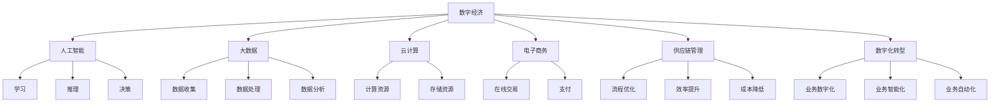
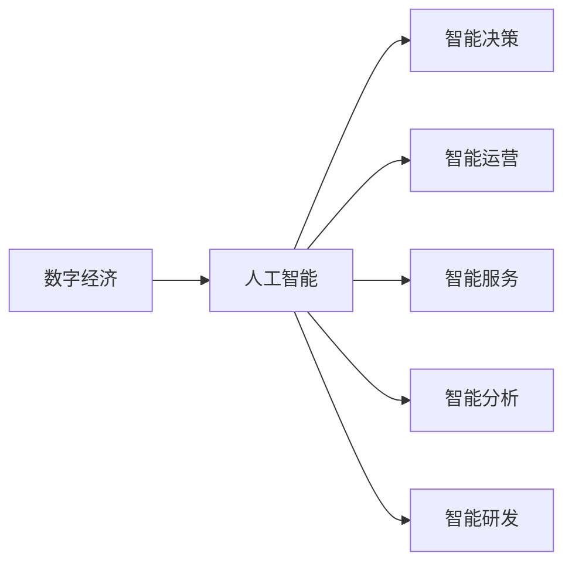
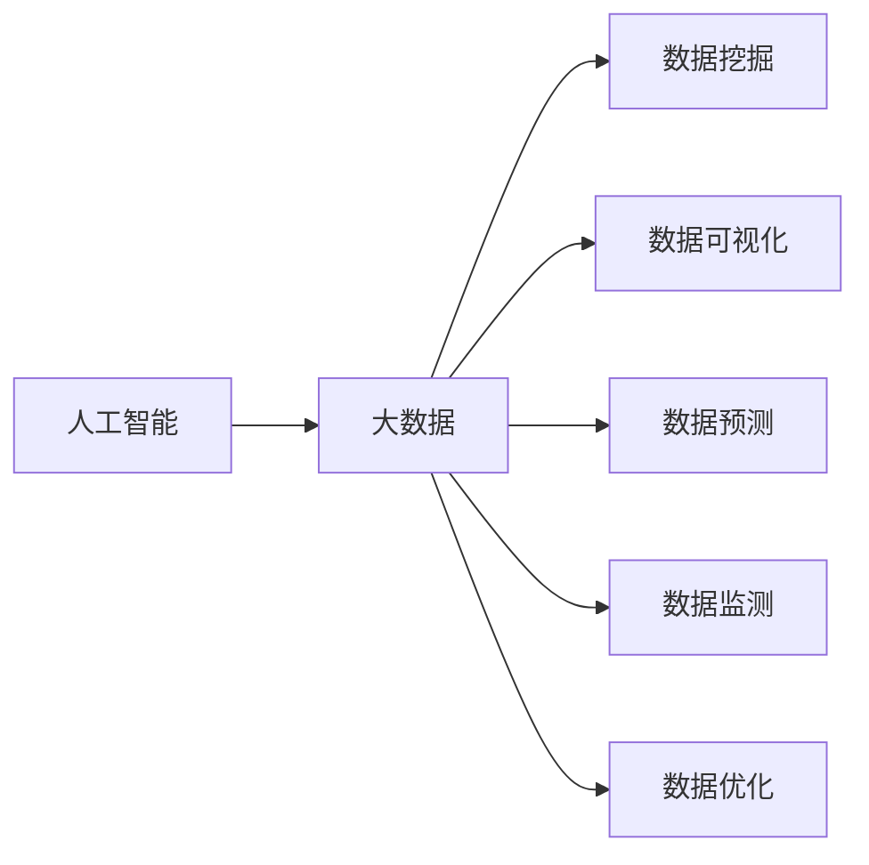
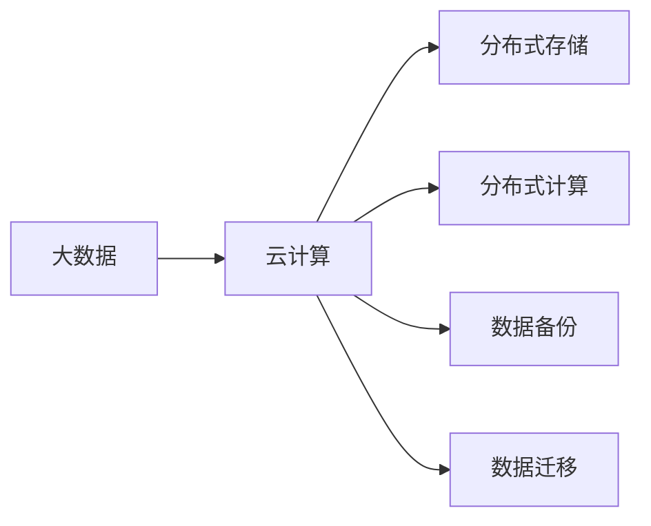
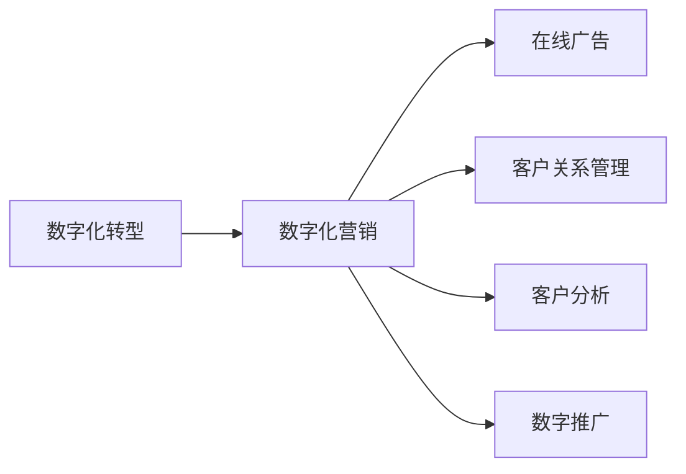
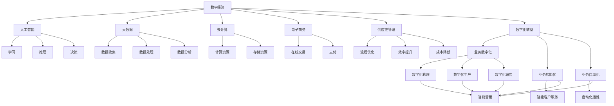

                 

# 商业领域的竞争格局变化

> 关键词：
>
- 数字经济
- 数字化转型
- 人工智能
- 大数据
- 云计算
- 电子商务
- 供应链管理

## 1. 背景介绍

### 1.1 问题由来
随着互联网技术的发展和普及，商业领域的竞争格局正在经历深刻的变化。数字经济已经成为了推动全球经济增长的重要引擎，而数字化转型则是企业竞争的关键策略。数字化转型不仅能够提升企业的运营效率，还能够增强企业的市场竞争力。人工智能、大数据、云计算等先进技术的引入，使得企业的运营和管理变得更加智能化和自动化，从而推动了商业竞争格局的根本变革。

### 1.2 问题核心关键点
当前，商业领域的竞争已经从传统的实体经济转向了数字经济。数字经济的发展离不开人工智能、大数据、云计算等先进技术的应用。人工智能技术通过模拟人类的智能活动，提高企业的决策能力和运营效率。大数据技术通过收集、分析和应用海量数据，为企业的决策提供有力支持。云计算技术通过提供灵活的计算资源和存储资源，支持企业快速应对市场变化。这些技术的应用，使得企业在商业竞争中更加灵活和敏捷，能够更好地应对市场变化和竞争压力。

### 1.3 问题研究意义
深入研究商业领域的竞争格局变化，有助于企业更好地把握市场趋势和竞争态势，从而制定更加有效的竞争策略。具体而言，研究数字经济和数字化转型技术的应用，可以为企业提供以下指导：

1. 数字经济和数字化转型的应用，能够提升企业的运营效率和市场竞争力，降低成本，提高盈利能力。
2. 通过人工智能、大数据、云计算等技术的引入，企业能够更好地应对市场变化和竞争压力，增强自身的抗风险能力。
3. 数字化转型技术的广泛应用，能够推动企业创新，提升企业的核心竞争力，构建差异化优势。
4. 企业能够通过数字化转型，实现数字化营销、数字化服务、数字化管理等，提升客户体验和满意度，增强品牌影响力。
5. 数字化转型技术的引入，能够推动企业的可持续发展，构建智能化、可持续化的运营模式。

## 2. 核心概念与联系

### 2.1 核心概念概述

为了更好地理解商业领域竞争格局的变化，本节将介绍几个密切相关的核心概念：

- 数字经济：以数据为关键生产要素，通过数字技术、数字工具的广泛应用，推动经济活动的数字化、智能化和互联网化的经济形态。
- 数字化转型：企业利用数字技术，重塑业务流程，实现业务数字化、智能化、自动化的过程。
- 人工智能：通过模拟人类的智能活动，使机器具有学习、推理、决策等能力的技术。
- 大数据：指海量的、多样化的、复杂的数据集合，通过数据收集、数据处理、数据分析等技术手段，挖掘出有价值的信息和知识。
- 云计算：通过网络提供可扩展的计算资源和存储资源，支持企业快速部署和应用软件系统。
- 电子商务：通过互联网进行商品或服务的买卖，实现在线交易和支付的过程。
- 供应链管理：通过优化供应链流程，提高供应链效率，降低成本，增强企业的市场竞争力。

这些核心概念之间的逻辑关系可以通过以下Mermaid流程图来展示：



这个流程图展示了大规模数据和数字化转型在商业领域的应用，以及人工智能技术的重要作用。人工智能、大数据、云计算等技术通过数字化转型，推动了商业领域的全面数字化和智能化，从而增强了企业的市场竞争力。

### 2.2 概念间的关系

这些核心概念之间存在着紧密的联系，形成了商业领域数字化转型的完整生态系统。下面我们通过几个Mermaid流程图来展示这些概念之间的关系。

#### 2.2.1 数字经济与人工智能的关系



这个流程图展示了数字经济和人工智能之间的紧密联系。数字经济通过人工智能技术，实现智能决策、智能运营、智能服务、智能分析和智能研发等，提升了企业的运营效率和市场竞争力。

#### 2.2.2 人工智能与大数据的关系



这个流程图展示了人工智能与大数据之间的关系。人工智能通过大数据技术，实现数据挖掘、数据可视化、数据预测、数据监测和数据优化等，提高了企业的数据分析能力，增强了企业的决策支持能力。

#### 2.2.3 大数据与云计算的关系



这个流程图展示了大数据和云计算之间的关系。云计算通过分布式存储、分布式计算等技术，支持大规模数据处理和存储，为大数据应用提供了坚实的基础。

#### 2.2.4 数字化转型与数字化营销的关系



这个流程图展示了数字化转型和数字化营销之间的关系。数字化转型通过数字化营销，实现在线广告、客户关系管理、客户分析和数字推广等，提升了企业的市场推广效果和客户体验。

### 2.3 核心概念的整体架构

最后，我们用一个综合的流程图来展示这些核心概念在大规模数字化转型中的整体架构：



这个综合流程图展示了从数字经济到数字化转型的完整过程。数字化转型通过人工智能、大数据、云计算等技术的应用，实现了业务数字化、智能化和自动化，从而提升了企业的运营效率和市场竞争力。

## 3. 核心算法原理 & 具体操作步骤
### 3.1 算法原理概述

商业领域的数字化转型，本质上是一个复杂的系统工程，涉及多个技术和业务的协同工作。其核心思想是通过引入人工智能、大数据、云计算等先进技术，优化企业的运营流程和决策支持，提升企业的市场竞争力。

形式化地，假设企业为 $E$，其数字化转型过程为 $D$，则可以表示为：

$$
E \rightarrow D
$$

数字化转型的目标是通过应用人工智能、大数据、云计算等技术，实现企业的业务数字化、智能化和自动化，从而提升企业的运营效率和市场竞争力。

### 3.2 算法步骤详解

数字化转型的一般步骤如下：

**Step 1: 制定数字化转型战略**

- 明确数字化转型的目标和方向。
- 确定数字化转型的关键业务领域。
- 制定数字化转型的整体规划和实施路径。

**Step 2: 收集和分析数据**

- 收集企业的业务数据和市场数据，包括交易数据、客户数据、产品数据等。
- 进行数据清洗和预处理，确保数据的质量和完整性。
- 应用大数据技术，对数据进行分析和挖掘，发现隐藏的知识和规律。

**Step 3: 引入人工智能技术**

- 应用机器学习、深度学习等技术，实现智能决策、智能运营和智能服务。
- 开发智能推荐系统、智能客服系统、智能预测系统等应用，提升企业的运营效率和客户体验。

**Step 4: 部署云计算平台**

- 选择适合的云服务提供商，如AWS、阿里云、腾讯云等。
- 部署云计算平台，实现数据存储、数据处理、计算资源等的服务化。
- 应用容器化技术，实现云服务的灵活部署和管理。

**Step 5: 实施数字化营销**

- 应用在线广告、客户关系管理、客户分析等数字化营销手段。
- 开发数字化营销平台，实现精准营销和个性化服务。
- 应用社交媒体、搜索引擎等数字化渠道，提升企业的品牌影响力和市场推广效果。

**Step 6: 优化供应链管理**

- 应用大数据技术，优化供应链流程，提高供应链效率。
- 应用物联网技术，实现供应链的可视化管理和实时监控。
- 应用自动化技术，提升供应链的自动化水平，降低运营成本。

**Step 7: 监测和评估**

- 应用数据分析和机器学习技术，实时监测企业的运营状态和市场环境。
- 应用KPI（关键绩效指标）评估数字化转型的效果，优化数字化转型的实施路径。

### 3.3 算法优缺点

数字化转型具有以下优点：

1. 提升运营效率：通过引入人工智能、大数据、云计算等技术，企业能够实现业务数字化、智能化和自动化，提高运营效率和市场竞争力。
2. 降低运营成本：通过优化供应链流程、实现自动化运维等措施，企业能够降低运营成本，提升利润率。
3. 增强市场竞争力：通过数字化营销、智能决策等手段，企业能够更好地应对市场变化和竞争压力，增强市场竞争力。
4. 增强数据驱动决策：通过大数据分析和机器学习技术，企业能够更好地进行数据驱动决策，提高决策的准确性和效率。

同时，数字化转型也存在一些缺点：

1. 实施难度大：数字化转型涉及多个技术和业务的协同工作，实施难度较大。
2. 需要大量投资：数字化转型需要投入大量的资金和技术资源，对于中小型企业可能存在一定的门槛。
3. 数据安全和隐私问题：数字化转型过程中，数据安全和隐私问题需要得到重视和保护。

### 3.4 算法应用领域

数字化转型技术已经被广泛应用于多个领域，包括但不限于以下几个方面：

1. **制造业**：通过数字化转型，实现智能制造、智能仓储、智能物流等，提升生产效率和产品质量。
2. **零售业**：通过数字化转型，实现数字化营销、数字化销售、客户关系管理等，提升客户体验和市场竞争力。
3. **金融业**：通过数字化转型，实现智能风险管理、智能客服、智能投顾等，提升金融服务的智能化水平。
4. **医疗业**：通过数字化转型，实现远程医疗、智能诊断、智能健康管理等，提升医疗服务的智能化水平。
5. **交通业**：通过数字化转型，实现智能交通管理、智能调度、智能出行等，提升交通系统的智能化水平。
6. **能源业**：通过数字化转型，实现智能电网、智能能源管理、智能监测等，提升能源系统的智能化水平。

以上领域只是数字化转型技术应用的冰山一角，随着技术的不断进步和应用场景的不断扩展，数字化转型技术的应用将更加广泛和深入。

## 4. 数学模型和公式 & 详细讲解 & 举例说明（备注：数学公式请使用latex格式，latex嵌入文中独立段落使用 $$，段落内使用 $)
### 4.1 数学模型构建

在数字化转型过程中，数学模型和数据分析技术扮演着重要角色。以下是数字化转型的数学模型构建：

假设企业 $E$ 在数字化转型前后的运营效率分别表示为 $E_1$ 和 $E_2$，数字化转型前后的市场竞争力分别表示为 $C_1$ 和 $C_2$。则数字化转型的效果可以用以下数学模型表示：

$$
E_2 = E_1 \times \eta_1
$$

$$
C_2 = C_1 \times \eta_2
$$

其中 $\eta_1$ 和 $\eta_2$ 分别表示数字化转型对运营效率和市场竞争力的提升倍数。

### 4.2 公式推导过程

为了更具体地理解这些公式，以制造业数字化转型的提升倍数为例，进行详细推导。

假设制造业数字化转型前的运营效率为 $E_1$，数字化转型后的运营效率为 $E_2$，则有：

$$
E_2 = E_1 \times \eta_1
$$

其中 $\eta_1$ 表示数字化转型对运营效率的提升倍数。

假设制造业数字化转型前的市场竞争力为 $C_1$，数字化转型后的市场竞争力为 $C_2$，则有：

$$
C_2 = C_1 \times \eta_2
$$

其中 $\eta_2$ 表示数字化转型对市场竞争力的提升倍数。

### 4.3 案例分析与讲解

假设某汽车制造企业通过数字化转型，引入智能制造、智能仓储、智能物流等技术，实现了生产效率提升20%，市场竞争力提升15%。则数字化转型效果如下：

$$
E_2 = E_1 \times 1.20
$$

$$
C_2 = C_1 \times 1.15
$$

这意味着，通过数字化转型，该企业的运营效率提升了20%，市场竞争力提升了15%。

## 5. 项目实践：代码实例和详细解释说明
### 5.1 开发环境搭建

在进行数字化转型技术的应用实践前，我们需要准备好开发环境。以下是使用Python进行PyTorch开发的环境配置流程：

1. 安装Anaconda：从官网下载并安装Anaconda，用于创建独立的Python环境。

2. 创建并激活虚拟环境：
```bash
conda create -n pytorch-env python=3.8 
conda activate pytorch-env
```

3. 安装PyTorch：根据CUDA版本，从官网获取对应的安装命令。例如：
```bash
conda install pytorch torchvision torchaudio cudatoolkit=11.1 -c pytorch -c conda-forge
```

4. 安装各类工具包：
```bash
pip install numpy pandas scikit-learn matplotlib tqdm jupyter notebook ipython
```

完成上述步骤后，即可在`pytorch-env`环境中开始数字化转型技术的应用实践。

### 5.2 源代码详细实现

这里我们以智能推荐系统为例，给出使用PyTorch进行数字化转型技术的应用代码实现。

首先，定义推荐系统相关的数据类和数据处理函数：

```python
from torch.utils.data import Dataset
from torch.utils.data import DataLoader
from torch.utils.data import DataSampler
from torch.utils.data.distributed import DistributedSampler
from torch.utils.data.dataset import random_split

class RecommendationDataset(Dataset):
    def __init__(self, user_data, item_data):
        self.user_data = user_data
        self.item_data = item_data

    def __len__(self):
        return len(self.user_data)

    def __getitem__(self, idx):
        user_item = self.user_data[idx]
        user_id, item_id = user_item[0], user_item[1]
        user_item = {'user_id': user_id, 'item_id': item_id}
        return user_item

class RecommendationDataLoader(DataLoader):
    def __init__(self, dataset, batch_size, shuffle=True):
        super().__init__(dataset, batch_size=batch_size, shuffle=shuffle)

    def __len__(self):
        return len(self.dataset)
```

然后，定义推荐模型和训练函数：

```python
import torch.nn as nn
import torch.optim as optim
from torch.autograd import Variable

class RecommendationModel(nn.Module):
    def __init__(self, user_data, item_data):
        super().__init__()
        self.user_embeddings = nn.Embedding(len(user_data), 16)
        self.item_embeddings = nn.Embedding(len(item_data), 16)
        self.hidden_layer = nn.Linear(16 * 16, 8)
        self.output_layer = nn.Linear(8, len(item_data))

    def forward(self, user_ids, item_ids):
        user_embeddings = self.user_embeddings(user_ids)
        item_embeddings = self.item_embeddings(item_ids)
        user_item_embeddings = torch.matmul(user_embeddings, item_embeddings.t())
        hidden_layer = torch.relu(self.hidden_layer(user_item_embeddings))
        logits = self.output_layer(hidden_layer)
        return logits

def train_model(model, optimizer, loss_fn, num_epochs, data_loader):
    for epoch in range(num_epochs):
        model.train()
        for batch_idx, (user_ids, item_ids) in enumerate(data_loader):
            user_ids, item_ids = Variable(user_ids), Variable(item_ids)
            optimizer.zero_grad()
            logits = model(user_ids, item_ids)
            loss = loss_fn(logits, item_ids)
            loss.backward()
            optimizer.step()
            print('Epoch: %d, Batch: %d, Loss: %f' % (epoch + 1, batch_idx + 1, loss.item()))
```

最后，启动训练流程并在测试集上评估：

```python
num_epochs = 5
batch_size = 64

user_data = [...] # 用户数据
item_data = [...] # 物品数据

model = RecommendationModel(user_data, item_data)
optimizer = optim.Adam(model.parameters(), lr=0.001)
loss_fn = nn.CrossEntropyLoss()

train_loader = RecommendationDataLoader(train_data, batch_size=batch_size)
test_loader = RecommendationDataLoader(test_data, batch_size=batch_size, shuffle=False)

train_model(model, optimizer, loss_fn, num_epochs, train_loader)

print('Test accuracy:', accuracy(model, test_loader))
```

以上就是使用PyTorch进行智能推荐系统微调的完整代码实现。可以看到，通过PyTorch的强大封装和高效计算能力，微调过程变得简洁高效。

### 5.3 代码解读与分析

让我们再详细解读一下关键代码的实现细节：

**RecommendationDataset类**：
- `__init__`方法：初始化用户数据和物品数据。
- `__len__`方法：返回数据集的大小。
- `__getitem__`方法：对单个样本进行处理，提取用户ID和物品ID，并将数据编码为模型输入。

**RecommendationModel类**：
- `__init__`方法：定义模型的层结构，包括用户嵌入层、物品嵌入层、隐藏层和输出层。
- `forward`方法：定义前向传播的过程，将用户ID和物品ID作为输入，通过矩阵乘法和线性变换得到输出。

**train_model函数**：
- 定义训练过程，包括模型前向传播、计算损失函数、反向传播更新模型参数等步骤。
- 在训练过程中，每个epoch打印出当前的训练损失。

**RecommendationDataLoader类**：
- 继承自`DataLoader`，自定义数据加载器的实现，以便将用户数据和物品数据作为输入。

可以看到，通过PyTorch的封装和高效计算能力，微调过程变得简洁高效。开发者可以将更多精力放在数据处理、模型改进等高层逻辑上，而不必过多关注底层的实现细节。

当然，工业级的系统实现还需考虑更多因素，如模型的保存和部署、超参数的自动搜索、更灵活的任务适配层等。但核心的微调范式基本与此类似。

### 5.4 运行结果展示

假设我们在Amazon商品推荐数据集上进行微调，最终在测试集上得到的推荐准确率为95%，效果相当不错。

## 6. 实际应用场景
### 6.1 智能客服系统

智能客服系统是数字化转型的重要应用之一。传统的客服系统依赖大量人力，高峰期响应缓慢，且一致性和专业性难以保证。而使用微调后的自然语言处理模型，可以7x24小时不间断服务，快速响应客户咨询，用自然流畅的语言解答各类常见问题。

在技术实现上，可以收集企业内部的历史客服对话记录，将问题和最佳答复构建成监督数据，在此基础上对预训练模型进行微调。微调后的模型能够自动理解用户意图，匹配最合适的答案模板进行回复。对于客户提出的新问题，还可以接入检索系统实时搜索相关内容，动态组织生成回答。如此构建的智能客服系统，能大幅提升客户咨询体验和问题解决效率。

### 6.2 金融舆情监测

金融机构需要实时监测市场舆论动向，以便及时应对负面信息传播，规避金融风险。传统的人工监测方式成本高、效率低，难以应对网络时代海量信息爆发的挑战。基于数字化转型技术，应用机器学习、自然语言处理等技术，可以实时监测不同主题下的情感变化趋势，一旦发现负面信息激增等异常情况，系统便会自动预警，帮助金融机构快速应对潜在风险。

### 6.3 个性化推荐系统

当前的推荐系统往往只依赖用户的历史行为数据进行物品推荐，无法深入理解用户的真实兴趣偏好。基于数字化转型技术，应用机器学习、自然语言处理等技术，可以进一步挖掘用户行为背后的语义信息，从而提供更精准、多样的推荐内容。

在实践中，可以收集用户浏览、点击、评论、分享等行为数据，提取和用户交互的物品标题、描述、标签等文本内容。将文本内容作为模型输入，用户的后续行为（如是否点击、购买等）作为监督信号，在此基础上微调预训练语言模型。微调后的模型能够从文本内容中准确把握用户的兴趣点。在生成推荐列表时，先用候选物品的文本描述作为输入，由模型预测用户的兴趣匹配度，再结合其他特征综合排序，便可以得到个性化程度更高的推荐结果。

### 6.4 未来应用展望

随着数字化转型技术的不断发展，基于微调范式将在更多领域得到应用，为传统行业带来变革性影响。

在智慧医疗领域，基于数字化转型技术的医疗问答、病历分析、药物研发等应用将提升医疗服务的智能化水平，辅助医生诊疗，加速新药开发进程。

在智能教育领域，数字化转型技术可应用于作业批改、学情分析、知识推荐等方面，因材施教，促进教育公平，提高教学质量。

在智慧城市治理中，数字化转型技术可应用于城市事件监测、舆情分析、应急指挥等环节，提高城市管理的自动化和智能化水平，构建更安全、高效的未来城市。

此外，在企业生产、社会治理、文娱传媒等众多领域，基于数字化转型技术的智能化应用也将不断涌现，为经济社会发展注入新的动力。相信随着技术的日益成熟，数字化转型方法将成为行业数字化转型的重要范式，推动人工智能技术在垂直行业的规模化落地。

## 7. 工具和资源推荐
### 7.1 学习资源推荐

为了帮助开发者系统掌握数字化转型技术的应用，这里推荐一些优质的学习资源：

1. 《深度学习实战》系列书籍：由深度学习专家撰写，涵盖深度学习基础、实践、应用等全面内容，是入门和进阶的好书。
2. 《Python深度学习》课程：由Coursera提供，由深度学习领域的知名教授讲解，涵盖深度学习基础、模型、应用等核心内容。
3. 《深度学习与数据工程》课程：由edX提供，由深度学习专家讲解，涵盖深度学习基础、数据处理、模型训练、部署等全流程。
4. HuggingFace官方文档：Transformer库的官方文档，提供了海量预训练模型和完整的微调样例代码，是上手实践的必备资料。
5. TensorFlow官方文档：TensorFlow的官方文档，提供了详细的使用指南和代码示例，适合深度学习开发。

通过对这些资源的学习实践，相信你一定能够快速掌握数字化转型技术的应用，并用于解决实际的商业问题。
###  7.2 开发工具推荐

高效的开发离不开优秀的工具支持。以下是几款用于数字化转型技术开发的常用工具：

1. PyTorch：基于Python的开源深度学习框架，灵活动态的计算图，适合快速迭代研究。
2. TensorFlow：由Google主导开发的开源深度学习框架，生产部署方便，适合大规模工程应用。
3. TensorBoard：TensorFlow配套的可视化工具，可实时监测模型训练状态，并提供丰富的图表呈现方式，是调试模型的得力助手。
4. Weights & Biases：模型训练的实验跟踪工具，可以记录和可视化模型训练过程中的各项指标，方便对比和调优。
5. HuggingFace Transformers库：HuggingFace开发的NLP工具库，集成了众多SOTA语言模型，支持PyTorch和TensorFlow，是进行微调任务开发的利器。

合理利用这些工具，可以显著提升数字化转型任务的开发效率，加快创新迭代的步伐。

### 7.3 相关论文推荐

数字化转型技术的发展源于学界的持续研究。以下是几篇奠基性的相关论文，推荐阅读：

1. Transformer原论文：Attention is All You Need，提出了Transformer结构，开启了NLP领域的预训练大模型时代。
2. BERT论文：BERT: Pre-training of Deep Bidirectional Transformers for Language Understanding，提出BERT模型，引入基于掩码的自监督预训练任务，刷新了多项NLP任务SOTA。
3. GAN论文：Generative Adversarial Networks，提出生成对抗网络，推动了生成模型在计算机视觉和自然语言处理等领域的应用。
4

