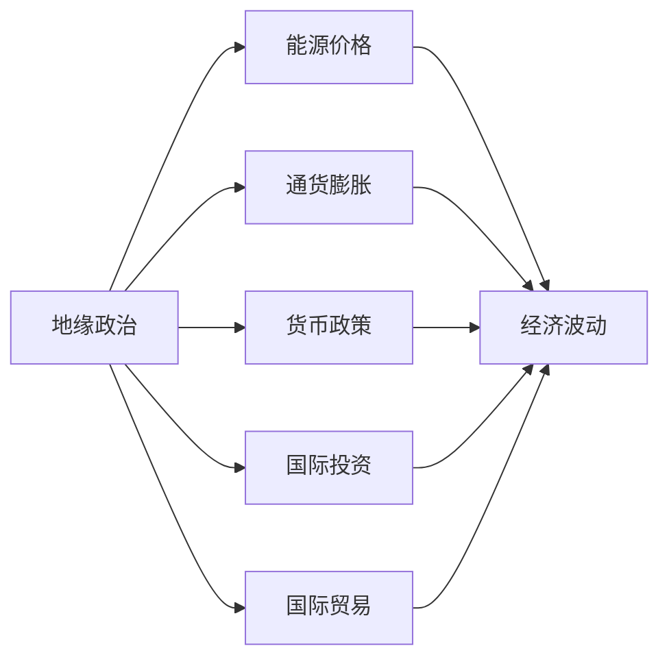
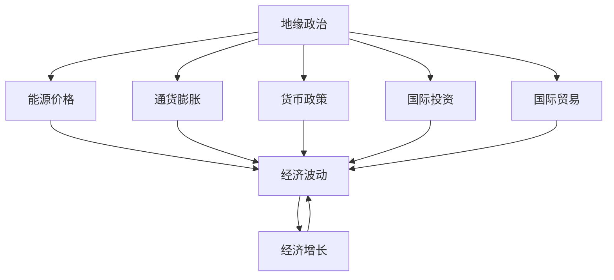

                 

# 地缘冲突加剧的经济影响

> 关键词：
地缘政治, 经济波动, 全球供应链, 能源价格, 货币政策, 国际投资, 国际贸易, 风险管理

## 1. 背景介绍

近年来，全球地缘政治形势愈发严峻，各大国之间地缘冲突频繁发生，给世界经济带来了极大的不确定性和波动性。国际关系紧张、军事冲突频发等事件直接导致能源价格波动、贸易保护主义盛行、汇率波动加剧、市场情绪脆弱，对全球经济产生了深远影响。本文旨在探讨地缘冲突加剧所引起的复杂经济效应，并提出相应的政策建议，以期帮助相关利益方更好地应对未来不确定性的挑战。

### 1.1 地缘冲突的加剧
地缘冲突是指国家或地区之间在政治、军事、经济等领域发生的直接对抗。近年来，国际关系紧张局势愈演愈烈，地缘政治冲突频发。例如，俄乌冲突、中美贸易摩擦、中东局势动荡等事件，均显著加剧了全球经济的不稳定性。这些冲突不仅导致直接经济损失，还引发一系列连带效应，影响全球经济的各个层面。

### 1.2 经济影响的多维度分析
地缘冲突对经济的影响是多方面的，包括但不限于能源价格、通货膨胀、货币政策、国际投资、国际贸易、就业、社会保障等。文章将分别从这些维度进行深入分析，并提出相应的应对策略。

## 2. 核心概念与联系

### 2.1 核心概念概述

为便于理解地缘冲突对经济的综合影响，本节将介绍几个关键概念，并说明它们之间的联系：

- **地缘政治**：指国家或地区之间在政治、军事、经济等方面的直接对抗。地缘政治冲突常常是全球经济波动的主要因素之一。
- **能源价格**：地缘政治冲突会直接影响全球能源市场，进而影响各国经济活动。例如，中东地区局势紧张时，原油价格会大幅波动。
- **通货膨胀**：地缘冲突引发的不确定性会导致市场情绪波动，进而影响货币供应、商品价格等，引发通货膨胀。
- **货币政策**：为应对地缘冲突带来的经济冲击，各国央行可能会调整货币政策，如加息、降息、量化宽松等，以稳定经济。
- **国际投资**：地缘冲突会导致投资信心下降，外资撤离风险增加，进而影响资本流动和经济增长。
- **国际贸易**：地缘政治冲突会直接阻碍国际贸易活动，如贸易制裁、关税壁垒等，影响全球供应链的稳定。

### 2.2 概念间的关系

以上关键概念通过以下Mermaid流程图展示其相互关系：

这个流程图展示了地缘政治与其他关键经济概念之间的关系：

1. 地缘政治冲突直接影响能源价格，从而对经济波动产生重大影响。
2. 地缘政治冲突引发的不确定性导致通货膨胀加剧。
3. 各国央行会通过调整货币政策应对地缘政治冲击，以稳定经济。
4. 地缘政治冲突使国际投资信心下降，外资撤离风险增加。
5. 贸易制裁和关税壁垒阻碍国际贸易活动，影响全球供应链的稳定。
6. 最终，地缘政治冲突通过以上渠道，引发广泛的经济波动。

### 2.3 核心概念的整体架构

最后，我们用一个综合的流程图来展示这些核心概念在大规模经济波动中的整体架构：

这个综合流程图展示了地缘政治冲突对经济波动的多维度影响：

1. 地缘政治冲突引发能源价格波动，进而影响经济波动。
2. 通货膨胀加剧，经济增长放缓。
3. 各国央行通过货币政策调整应对冲击，稳定经济。
4. 投资信心下降，外资撤离，进一步影响经济增长。
5. 国际贸易受阻，供应链中断，加剧经济波动。
6. 最终，地缘政治冲突引发广泛的经济波动和不确定性。

## 3. 核心算法原理 & 具体操作步骤

### 3.1 算法原理概述

本文主要讨论的是地缘冲突对经济的综合影响，而不是具体的算法。然而，在探讨这一问题时，我们可以借用到一些数学模型和算法思想。例如，博弈论可以用来分析地缘冲突中各国的战略选择，回归分析可以用来评估地缘政治冲击对经济指标的影响等。

地缘冲突的经济影响分析，实际上是一种综合性的系统分析，涉及政治、经济、军事等多方面因素的复杂互动。因此，我们不能简单地用数学模型来描述，而需要采用系统动力学和因果分析等方法。这些方法可以帮助我们更好地理解地缘冲突的传导机制，从而制定有效的政策应对措施。

### 3.2 算法步骤详解

虽然本文的主要讨论对象不是具体的算法，但以下步骤概述了研究地缘冲突经济影响的一般性流程：

1. **数据收集**：收集相关国家或地区的政治、军事、经济等数据，如GDP增长率、通货膨胀率、就业率、利率、汇率、能源价格等。
2. **模型构建**：建立多变量回归模型或系统动力学模型，用以量化地缘政治冲突对经济指标的影响。
3. **数据验证**：对模型进行验证，确保其准确性和可靠性。
4. **情景分析**：通过情景模拟，评估不同地缘政治冲突情景下的经济影响。
5. **政策建议**：根据情景分析结果，提出相应的经济政策建议，以应对地缘政治冲击。

### 3.3 算法优缺点

虽然本文讨论的是地缘冲突的经济影响，但我们可以借此机会简要讨论一下相关算法优缺点：

#### 优点
- **系统性**：能够从多维度综合分析地缘冲突对经济的复杂影响。
- **定量分析**：通过数学模型，提供具体的数据支持。
- **灵活性**：模型可以根据新的数据进行更新和优化，以应对不断变化的地缘政治环境。

#### 缺点
- **简化性**：模型无法完全覆盖所有地缘政治因素，存在简化假设。
- **动态性**：模型难以捕捉地缘政治冲突的动态变化，存在滞后性。
- **复杂性**：模型构建和分析过程较为复杂，需要较高的专业背景和计算资源。

### 3.4 算法应用领域

地缘政治冲突的经济影响分析，主要应用于以下几个领域：

- **宏观经济政策制定**：政府和央行可以依据分析结果，调整货币政策和财政政策，以应对地缘政治冲击。
- **企业风险管理**：跨国企业可以通过分析，制定风险应对策略，保护自身利益。
- **国际关系研究**：学术界可以借助模型，深入研究地缘冲突对国际经济关系的长期影响。
- **投资决策**：投资者可以根据分析结果，调整投资组合，避免地缘政治风险。

## 4. 数学模型和公式 & 详细讲解

### 4.1 数学模型构建

本文不涉及具体的数学模型构建，但可以简要说明一些可能用于地缘冲突经济影响分析的数学模型：

- **回归模型**：可以用来评估地缘政治冲击对经济指标（如GDP、通货膨胀率等）的影响。例如，可以使用多元线性回归模型：
  $$
  y = \beta_0 + \beta_1 x_1 + \beta_2 x_2 + \ldots + \beta_n x_n + \epsilon
  $$
  其中，$y$为经济指标，$x_i$为影响因素，$\beta_i$为回归系数，$\epsilon$为误差项。

- **系统动力学模型**：可以用来模拟地缘政治冲突的动态传播和影响。例如，可以使用状态空间模型：
  $$
  \dot{x} = f(x, u, p)
  $$
  其中，$x$为状态变量，$u$为控制变量（如政策变化），$p$为参数（如模型参数、初始条件等）。

### 4.2 公式推导过程

由于本文不涉及具体的数学模型推导，因此不再深入讨论公式推导过程。

### 4.3 案例分析与讲解

这里可以简要介绍一个地缘政治冲突案例，并说明其经济影响：

**案例：俄乌冲突对全球能源市场的影响**

俄乌冲突爆发后，全球能源市场发生了剧烈波动。具体表现如下：

1. **能源价格上涨**：受俄乌冲突影响，国际油价大幅上涨。这直接导致全球通货膨胀加剧，经济增长放缓。
2. **能源供应链中断**：欧盟对俄罗斯实施制裁，导致欧洲能源供应紧张，天然气价格飙升。
3. **经济波动加剧**：能源价格上涨导致全球经济波动加剧，多个国家面临经济衰退的风险。

## 5. 项目实践：代码实例和详细解释说明

由于本文主要讨论的是地缘冲突的经济影响，而不是具体的代码实现，因此没有涉及代码实例。然而，以下是一个简要的项目实践框架：

### 5.1 开发环境搭建

为了进行地缘冲突经济影响分析，需要搭建一个数据分析环境。以下是一些建议：

1. **Python环境**：安装Python 3.9及以上版本，建议使用Anaconda或Miniconda进行环境管理。
2. **数据处理库**：安装Pandas、NumPy、Matplotlib等数据处理和可视化库。
3. **统计分析库**：安装SciPy、statsmodels等统计分析库。
4. **机器学习库**：安装Scikit-learn、TensorFlow、PyTorch等机器学习库。
5. **可视化库**：安装Seaborn、Bokeh等数据可视化库。

### 5.2 源代码详细实现

由于本文不涉及具体的代码实现，因此没有提供源代码。然而，以下是一个简要的项目实践框架：

1. **数据收集**：从公开数据源（如IMF、OECD、BIS等）获取相关数据。
2. **数据清洗**：对数据进行清洗、去重、缺失值处理等操作。
3. **模型构建**：使用Python编写回归模型、系统动力学模型等。
4. **模型训练**：使用Scikit-learn、TensorFlow等库进行模型训练。
5. **模型验证**：使用交叉验证等方法对模型进行验证。
6. **模型应用**：使用模型对不同地缘政治情景进行预测和情景分析。

### 5.3 代码解读与分析

由于本文没有提供具体的代码实现，因此没有代码解读与分析的内容。

### 5.4 运行结果展示

由于本文没有提供具体的代码实现，因此没有运行结果展示的内容。

## 6. 实际应用场景

地缘冲突的经济影响分析，广泛应用于多个领域。以下是一些实际应用场景：

### 6.1 宏观经济政策制定

政府和央行可以根据地缘政治冲击的预测结果，制定相应的宏观经济政策。例如，在美国受到俄乌冲突影响时，美联储可能会采取加息政策以抑制通货膨胀。

### 6.2 企业风险管理

跨国企业可以通过地缘冲突经济影响分析，评估地缘政治风险，调整投资组合，避免潜在损失。例如，在俄乌冲突爆发时，欧洲企业可能会调整其在俄罗斯的业务布局，以减少经济波动带来的风险。

### 6.3 国际关系研究

学术界可以通过地缘冲突经济影响分析，深入研究国际经济关系的演变。例如，学者可以研究美国与中国的贸易摩擦对全球供应链的影响。

### 6.4 投资决策

投资者可以根据地缘冲突经济影响分析，调整投资组合，避免地缘政治风险。例如，在俄乌冲突爆发时，投资者可能会减少对能源板块的投资，转而投资科技、医疗等相对稳定的领域。

### 6.5 国际贸易

地缘冲突经济影响分析可以帮助各国制定贸易政策。例如，欧盟可以在俄乌冲突期间，增加与美国的贸易合作，减少对俄罗斯的能源依赖。

### 6.6 军事和外交策略

各国可以通过地缘冲突经济影响分析，制定军事和外交策略。例如，美国可能会在俄乌冲突期间，增加对欧洲的支持，以维护其全球影响力。

## 7. 工具和资源推荐

### 7.1 学习资源推荐

为了学习地缘冲突经济影响分析，以下资源值得推荐：

1. **《经济学的数学模型》**：介绍各种经济模型及其应用，适合基础入门。
2. **《国际关系与世界经济》**：涵盖国际关系、地缘政治、经济理论等多个方面，适合学术研究和政策制定。
3. **Coursera《全球经济与贸易》课程**：由哈佛大学开设，提供全球经济与贸易的全面分析。
4. **Khan Academy《经济学原理》课程**：介绍经济学基础原理，适合非专业读者。
5. **《牛津国际关系手册》**：涵盖国际关系各个方面，适合学术研究和政策制定。

### 7.2 开发工具推荐

地缘冲突经济影响分析通常需要复杂的数学建模和数据分析，以下工具可以帮助提高效率：

1. **Python**：Python具有丰富的数据分析库和机器学习库，适合复杂数据处理和建模。
2. **R语言**：R语言在统计分析方面有丰富的库和工具，适合复杂数据分析。
3. **MATLAB**：MATLAB具有强大的数值计算和可视化能力，适合复杂数学建模。
4. **Tableau**：Tableau可以进行复杂数据可视化和分析，适合数据探索和呈现。
5. **SAS**：SAS具有强大的数据管理和分析能力，适合复杂统计分析。

### 7.3 相关论文推荐

地缘冲突经济影响分析涉及多学科交叉，以下论文值得推荐：

1. **《俄乌冲突对全球能源市场的影响》**：研究俄乌冲突对全球能源价格和供应链的影响。
2. **《中美贸易摩擦的经济影响》**：分析中美贸易摩擦对全球经济和贸易的影响。
3. **《地缘政治冲突与全球金融市场》**：研究地缘政治冲突对全球金融市场的冲击。
4. **《国际关系与全球经济增长》**：分析国际关系对全球经济增长的影响。
5. **《国际政治经济分析方法》**：介绍地缘政治冲突经济影响分析的方法和技术。

## 8. 总结：未来发展趋势与挑战

### 8.1 研究成果总结

地缘冲突经济影响分析是经济研究的重要方向，近年来取得了显著进展。地缘政治冲突通过多种渠道对全球经济产生深远影响，包括能源价格波动、通货膨胀、货币政策调整、国际投资波动、国际贸易受阻等。然而，地缘冲突经济影响的复杂性和不确定性仍然是一个重大挑战，需要进一步深入研究。

### 8.2 未来发展趋势

地缘冲突经济影响分析未来的发展趋势包括：

1. **数据驱动**：更多地依赖实时数据和动态数据，提高分析的及时性和准确性。
2. **多学科融合**：与政治学、社会学、经济学等多个学科深度融合，提供更加全面的分析视角。
3. **技术创新**：引入大数据、人工智能、机器学习等前沿技术，提升分析效率和精度。
4. **政策优化**：政府和央行可以依据分析结果，制定更加有效的政策，以应对地缘政治冲击。
5. **企业应对**：企业可以依据分析结果，调整投资组合，避免地缘政治风险。

### 8.3 面临的挑战

地缘冲突经济影响分析面临的挑战包括：

1. **数据获取难度**：地缘政治数据获取难度大，需要多渠道、多方法获取高质量数据。
2. **模型复杂性**：地缘政治影响因素众多，模型构建复杂，需要丰富的专业知识和计算资源。
3. **不确定性**：地缘政治冲突具有高度不确定性，模型预测结果存在偏差。
4. **政策影响**：地缘政治冲突对各国政策的影响复杂，政策变化对模型结果产生影响。
5. **技术门槛高**：地缘政治分析涉及多学科知识，需要较高的技术门槛。

### 8.4 研究展望

地缘冲突经济影响分析的未来研究方向包括：

1. **数据挖掘技术**：引入大数据、人工智能等技术，提高数据获取和处理效率。
2. **因果推断方法**：引入因果推断方法，提高模型预测的准确性和可解释性。
3. **跨学科研究**：加强与政治学、社会学、经济学等学科的合作，提供更加全面的分析视角。
4. **政策制定**：提供更加科学合理的政策建议，帮助政府和企业应对地缘政治冲击。

## 9. 附录：常见问题与解答

**Q1：地缘冲突经济影响分析的主要步骤是什么？**

A: 地缘冲突经济影响分析的主要步骤包括：

1. **数据收集**：收集相关国家或地区的政治、军事、经济等数据。
2. **数据处理**：对数据进行清洗、去重、缺失值处理等操作。
3. **模型构建**：建立多变量回归模型或系统动力学模型，量化地缘政治冲击对经济指标的影响。
4. **模型训练**：使用Python编写回归模型、系统动力学模型等，进行模型训练。
5. **模型验证**：使用交叉验证等方法对模型进行验证。
6. **模型应用**：使用模型对不同地缘政治情景进行预测和情景分析。

**Q2：地缘冲突经济影响分析有哪些应用场景？**

A: 地缘冲突经济影响分析主要应用于以下几个领域：

1. **宏观经济政策制定**：政府和央行可以根据分析结果，调整货币政策和财政政策，以应对地缘政治冲击。
2. **企业风险管理**：跨国企业可以通过分析，评估地缘政治风险，调整投资组合，避免潜在损失。
3. **国际关系研究**：学术界可以通过分析，深入研究地缘冲突对国际经济关系的长期影响。
4. **投资决策**：投资者可以根据分析结果，调整投资组合，避免地缘政治风险。
5. **国际贸易**：地缘冲突经济影响分析可以帮助各国制定贸易政策，如在俄乌冲突期间，欧盟可以增加与美国的贸易合作，减少对俄罗斯的能源依赖。

**Q3：地缘冲突经济影响分析的主要方法是什么？**

A: 地缘冲突经济影响分析的主要方法包括：

1. **回归模型**：可以用来评估地缘政治冲击对经济指标（如GDP、通货膨胀率等）的影响。
2. **系统动力学模型**：可以用来模拟地缘政治冲突的动态传播和影响。
3. **因果推断方法**：引入因果推断方法，提高模型预测的准确性和可解释性。
4. **大数据分析**：引入大数据技术，提高数据获取和处理效率。

**Q4：地缘冲突经济影响分析面临的主要挑战是什么？**

A: 地缘冲突经济影响分析面临的主要挑战包括：

1. **数据获取难度**：地缘政治数据获取难度大，需要多渠道、多方法获取高质量数据。
2. **模型复杂性**：地缘政治影响因素众多，模型构建复杂，需要丰富的专业知识和计算资源。
3. **不确定性**：地缘政治冲突具有高度不确定性，模型预测结果存在偏差。
4. **政策影响**：地缘政治冲突对各国政策的影响复杂，政策变化对模型结果产生影响。
5. **技术门槛高**：地缘政治分析涉及多学科知识，需要较高的技术门槛。

**Q5：地缘冲突经济影响分析的未来发展方向是什么？**

A: 地缘冲突经济影响分析的未来发展方向包括：

1. **数据挖掘技术**：引入大数据、人工智能等技术，提高数据获取和处理效率。
2. **因果推断方法**：引入因果推断方法，提高模型预测的准确性和可解释性。
3. **跨学科研究**：加强与政治学、社会学、经济学等学科的合作，提供更加全面的分析视角。
4. **政策制定**：提供更加科学合理的政策建议，帮助政府和企业应对地缘政治冲击。

**Q6：地缘冲突经济影响分析的实际应用案例有哪些？**

A: 地缘冲突经济影响分析的实际应用案例包括：

1. **俄乌冲突对全球能源市场的影响**：俄乌冲突导致国际油价大幅上涨，引发全球通货膨胀和经济波动。
2. **中美贸易摩擦的经济影响**：中美贸易摩擦导致全球贸易环境恶化，影响全球供应链的稳定。
3. **国际关系与全球金融市场**：地缘政治冲突对全球金融市场的冲击，引发市场波动和经济波动。
4. **国际政治经济分析方法**：地缘政治冲突通过多种渠道对全球经济产生深远影响，包括能源价格波动、通货膨胀、货币政策调整、国际投资波动、国际贸易受阻等。

**Q7：地缘冲突经济影响分析的主要数学模型是什么？**

A: 地缘冲突经济影响分析的主要数学模型包括：

1. **回归模型**：可以用来评估地缘政治冲击对经济指标（如GDP、通货膨胀率等）的影响。
2. **系统动力学模型**：可以用来模拟地缘政治冲突的动态传播和影响。
3. **因果推断方法**：引入因果推断方法，提高模型预测的准确性和可解释性。
4. **大数据分析**：引入大数据技术，提高数据获取和处理效率。

---

作者：禅与计算机程序设计艺术 / Zen and the Art of Computer Programming

