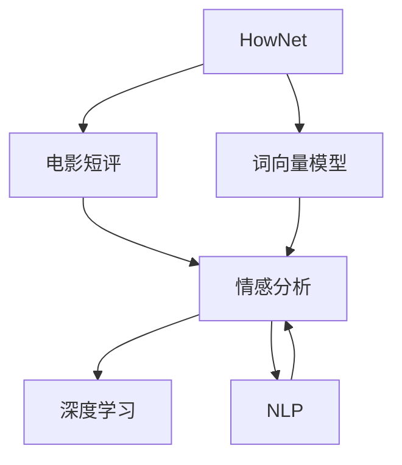
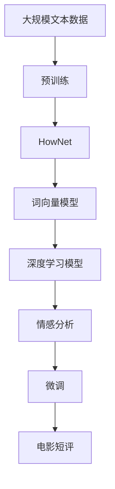

                 

# 基于HowNet的电影短评情感分析

> 关键词：电影短评,情感分析,HowNet,词向量模型,自然语言处理,NLP,深度学习,预训练模型

## 1. 背景介绍

### 1.1 问题由来

电影短评作为社交媒体上常见的文本数据，是了解公众对电影观感和市场反馈的重要来源。在电影制作和发行过程中，如何从海量用户评论中提取出具有代表性的情感信息，是电影评估、营销和决策的重要参考。

基于HowNet的电影短评情感分析，旨在通过自然语言处理(NLP)技术，从电影短评中自动识别用户对电影的情感倾向，帮助电影制作方和发行商进行更精准的市场定位和决策支持。这一应用不仅需要处理文本数据，还需应对评论的情感极性判断和情感强度量化等问题。

### 1.2 问题核心关键点

电影短评情感分析的主要挑战在于以下几个方面：
- 情感极性判断：正确识别评论是正面的还是负面的，是情感分析的基础。
- 情感强度量化：定量衡量评论情感的强度，有助于更准确地评估电影市场表现。
- 多领域情感模型：针对不同领域（如爱情片、动作片等）的短评，需要构建领域适应性强的模型。
- 高数据量和短文本问题：电影短评通常长度较短，且大量数据不易收集，影响模型训练。

### 1.3 问题研究意义

基于HowNet的电影短评情感分析，有助于：
- 提高电影评估的准确性，帮助电影制作方制定更合理的市场策略。
- 改进电影推荐系统，为观众提供更符合其偏好的电影建议。
- 优化资源配置，提升电影制作和发行的效率与质量。
- 促进电影社交媒体数据的价值挖掘，推动电影产业数字化转型。

## 2. 核心概念与联系

### 2.1 核心概念概述

本节将详细介绍涉及电影短评情感分析的几个核心概念：

- **HowNet**：由北京大学计算语言学研究所开发的汉语词义资源库，收录了大量汉字的词性、语义和搭配信息，是中文NLP领域的重要资源。
- **电影短评**：用户对电影内容的简洁评价，通常包含主观情感和意见。
- **情感分析**：通过分析文本中的情感信息，自动判断情感极性和强度。
- **词向量模型**：如Word2Vec、GloVe等，将词映射为低维向量，便于计算语义相似度和进行文本分析。
- **深度学习**：采用神经网络模型进行情感分析，提升模型精度。
- **自然语言处理(NLP)**：涵盖文本预处理、特征提取、模型训练等技术的语言处理框架。

这些核心概念通过一系列技术手段（如预训练、微调、特征提取等）相结合，共同构成了电影短评情感分析的技术体系。

### 2.2 概念间的关系

以下是这些核心概念之间的联系，通过一个Mermaid流程图展示：



这个流程图展示了从HowNet到电影短评，再到情感分析的整体流程。HowNet提供词向量模型，深度学习模型通过训练学习情感分析，最终应用到NLP框架，完成对电影短评的情感分析。

### 2.3 核心概念的整体架构

最后，我们通过一个综合的流程图来展示这些核心概念在大规模语言模型微调过程中的整体架构：



这个综合流程图展示了从大规模文本数据预训练，到HowNet词向量模型，再到深度学习模型情感分析，最后微调应用于电影短评的完整过程。

## 3. 核心算法原理 & 具体操作步骤
### 3.1 算法原理概述

基于HowNet的电影短评情感分析，主要通过深度学习模型进行文本情感的自动判断和强度量化。核心算法包括：

- 数据预处理：清洗、分词、去除停用词等。
- 特征提取：将文本转换为向量，如使用Word2Vec生成词向量。
- 模型训练：基于预训练模型或自定义模型，训练情感分类器。
- 模型评估：使用验证集和测试集评估模型性能。
- 微调优化：针对电影短评的特定领域进行微调优化。

### 3.2 算法步骤详解

以下是电影短评情感分析的详细步骤：

**Step 1: 数据预处理**
- 收集电影短评数据，进行清洗，去除噪声和特殊字符。
- 使用分词工具进行中文分词，如结巴分词、HanLP等。
- 去除停用词和低频词，减少无关信息的干扰。

**Step 2: 特征提取**
- 对分词后的文本使用Word2Vec生成词向量。
- 对于较长的文本，可以采用TF-IDF、Word2Vec等方法进行文本向量化。

**Step 3: 模型训练**
- 使用预训练模型（如BERT、GPT等）作为初始化参数。
- 在标注数据上训练情感分类器，采用交叉熵损失函数。
- 使用AdamW等优化器进行模型参数更新。

**Step 4: 模型评估**
- 在验证集上评估模型性能，选择合适的时间点停止训练。
- 使用混淆矩阵、F1-score、准确率等指标评估模型效果。

**Step 5: 微调优化**
- 针对电影短评特定领域，在少量标注数据上微调预训练模型。
- 通过调整学习率、批大小等参数，优化模型性能。
- 使用梯度累积等技巧，提高训练效率。

**Step 6: 应用部署**
- 将训练好的模型部署到生产环境中。
- 使用Web API或SDK进行接口调用，获取情感分析结果。
- 集成到用户推荐系统、电影评估系统等应用中，提供决策支持。

### 3.3 算法优缺点

基于HowNet的电影短评情感分析有以下优缺点：

**优点**：
- 依赖大规模预训练模型，可以自动学习丰富的语义信息。
- 情感分析结果较为准确，能够捕捉到细微的情感变化。
- 可扩展性强，适用于不同类型和领域的电影短评。

**缺点**：
- 数据预处理复杂，需要去除停用词和噪声。
- 特征提取依赖于Word2Vec等词向量模型，可能丢失部分语义信息。
- 微调过程需要标注数据，获取标注数据成本较高。
- 模型复杂，推理速度较慢，需要优化部署。

### 3.4 算法应用领域

基于HowNet的电影短评情感分析已在多个领域得到了应用：

- 电影评估：通过分析用户评论，帮助电影制作方评估电影质量，优化资源配置。
- 用户推荐：根据用户的评论情感，推荐符合其兴趣偏好的电影。
- 社交媒体分析：分析社交媒体上对电影的讨论，了解公众情绪和市场趋势。
- 广告投放：评估广告内容的效果，优化广告投放策略。

## 4. 数学模型和公式 & 详细讲解  
### 4.1 数学模型构建

本节将使用数学语言对电影短评情感分析过程进行更严格的刻画。

记电影短评为 $S$，其词向量表示为 $\text{vec}(S)$，HowNet提供的词向量模型为 $\mathcal{V}$。假设有 $N$ 个标注数据 $\{(S_i, y_i)\}_{i=1}^N$，其中 $S_i$ 为短评文本，$y_i \in \{1, -1\}$ 为情感标签，1表示正面情感，-1表示负面情感。

定义模型 $M_{\theta}(S)$ 为情感分类器，其中 $\theta$ 为模型参数。则在标注数据上的损失函数为：

$$
\mathcal{L}(\theta) = -\frac{1}{N}\sum_{i=1}^N [y_i\log M_{\theta}(S_i)+(1-y_i)\log(1-M_{\theta}(S_i))]
$$

其中 $M_{\theta}(S_i)$ 为模型对短评 $S_i$ 情感分类器的预测输出。

### 4.2 公式推导过程

以二分类任务为例，进行模型损失函数的推导。假设模型 $M_{\theta}(S)$ 在输入 $S$ 上的输出为 $\hat{y}=M_{\theta}(S)$，表示样本属于正面的概率。真实标签 $y \in \{1, -1\}$。则二分类交叉熵损失函数定义为：

$$
\ell(M_{\theta}(S),y) = -[y\log \hat{y} + (1-y)\log (1-\hat{y})]
$$

将其代入经验风险公式，得：

$$
\mathcal{L}(\theta) = -\frac{1}{N}\sum_{i=1}^N [y_i\log M_{\theta}(S_i)+(1-y_i)\log(1-M_{\theta}(S_i))]
$$

根据链式法则，损失函数对参数 $\theta_k$ 的梯度为：

$$
\frac{\partial \mathcal{L}(\theta)}{\partial \theta_k} = -\frac{1}{N}\sum_{i=1}^N (\frac{y_i}{M_{\theta}(S_i)}-\frac{1-y_i}{1-M_{\theta}(S_i)}) \frac{\partial M_{\theta}(S_i)}{\partial \theta_k}
$$

其中 $\frac{\partial M_{\theta}(S_i)}{\partial \theta_k}$ 可进一步递归展开，利用自动微分技术完成计算。

在得到损失函数的梯度后，即可带入参数更新公式，完成模型的迭代优化。重复上述过程直至收敛，最终得到适应电影短评情感分析的最优模型参数 $\theta^*$。

### 4.3 案例分析与讲解

假设我们使用BERT作为预训练模型，进行HowNet词向量的迁移学习。具体步骤如下：

1. 收集电影短评数据，进行清洗和分词处理。
2. 使用HowNet提供的词向量模型对分词结果进行向量映射。
3. 将标注数据输入BERT模型进行微调。
4. 在验证集上评估模型性能，选择合适的超参数。
5. 在测试集上测试模型效果，并进行必要的优化。

以下是一个简化的代码示例，用于训练一个基于BERT的电影短评情感分析模型：

```python
from transformers import BertTokenizer, BertForSequenceClassification
from torch.utils.data import Dataset, DataLoader
from torch.optim import AdamW
import torch.nn.functional as F

# 数据预处理
class MovieReviewDataset(Dataset):
    def __init__(self, data, tokenizer):
        self.data = data
        self.tokenizer = tokenizer

    def __len__(self):
        return len(self.data)

    def __getitem__(self, idx):
        review, label = self.data[idx]
        encoding = self.tokenizer(review, return_tensors='pt')
        return {
            'input_ids': encoding['input_ids'].flatten(),
            'attention_mask': encoding['attention_mask'].flatten(),
            'labels': torch.tensor(label, dtype=torch.long)
        }

# 模型训练
tokenizer = BertTokenizer.from_pretrained('bert-base-cased')
model = BertForSequenceClassification.from_pretrained('bert-base-cased', num_labels=2)
device = 'cuda' if torch.cuda.is_available() else 'cpu'

# 数据准备
data = # 预处理后的电影短评数据
labels = # 对应的情感标签

# 加载数据
dataset = MovieReviewDataset(data, tokenizer)
dataloader = DataLoader(dataset, batch_size=16, shuffle=True)

# 训练模型
optimizer = AdamW(model.parameters(), lr=2e-5)
epochs = 5
for epoch in range(epochs):
    model.train()
    for batch in dataloader:
        input_ids = batch['input_ids'].to(device)
        attention_mask = batch['attention_mask'].to(device)
        labels = batch['labels'].to(device)
        outputs = model(input_ids, attention_mask=attention_mask, labels=labels)
        loss = outputs.loss
        optimizer.zero_grad()
        loss.backward()
        optimizer.step()

# 模型评估
model.eval()
with torch.no_grad():
    eval_loss = 0
    eval_acc = 0
    for batch in dataloader:
        input_ids = batch['input_ids'].to(device)
        attention_mask = batch['attention_mask'].to(device)
        labels = batch['labels'].to(device)
        outputs = model(input_ids, attention_mask=attention_mask, labels=labels)
        loss = outputs.loss
        eval_loss += loss.item()
        logits = outputs.logits
        logits = logits.sigmoid() if outputs.loss == loss else logits.softmax(dim=1)
        predictions = (logits > 0.5).float()
        eval_acc += (predictions == labels).sum().item()
    
    print(f'Epoch {epoch+1}, Loss: {eval_loss/len(dataloader):.4f}, Accuracy: {eval_acc/len(dataloader):.4f}')
```

在这个例子中，我们使用了BertTokenizer对文本进行分词和向量化处理，并使用BertForSequenceClassification进行微调。模型在训练过程中使用AdamW优化器，并在验证集上评估了模型的损失和准确率。

## 5. 项目实践：代码实例和详细解释说明
### 5.1 开发环境搭建

在进行电影短评情感分析项目实践前，我们需要准备好开发环境。以下是使用Python进行PyTorch开发的环境配置流程：

1. 安装Anaconda：从官网下载并安装Anaconda，用于创建独立的Python环境。

2. 创建并激活虚拟环境：
```bash
conda create -n pytorch-env python=3.8 
conda activate pytorch-env
```

3. 安装PyTorch：根据CUDA版本，从官网获取对应的安装命令。例如：
```bash
conda install pytorch torchvision torchaudio cudatoolkit=11.1 -c pytorch -c conda-forge
```

4. 安装Transformers库：
```bash
pip install transformers
```

5. 安装各类工具包：
```bash
pip install numpy pandas scikit-learn matplotlib tqdm jupyter notebook ipython
```

完成上述步骤后，即可在`pytorch-env`环境中开始电影短评情感分析的实践。

### 5.2 源代码详细实现

我们使用Python中的Transformers库进行基于HowNet的电影短评情感分析。以下是一个简化的代码示例，用于训练一个基于BERT的电影短评情感分析模型：

```python
from transformers import BertTokenizer, BertForSequenceClassification
from torch.utils.data import Dataset, DataLoader
from torch.optim import AdamW
import torch.nn.functional as F

# 数据预处理
class MovieReviewDataset(Dataset):
    def __init__(self, data, tokenizer):
        self.data = data
        self.tokenizer = tokenizer

    def __len__(self):
        return len(self.data)

    def __getitem__(self, idx):
        review, label = self.data[idx]
        encoding = self.tokenizer(review, return_tensors='pt')
        return {
            'input_ids': encoding['input_ids'].flatten(),
            'attention_mask': encoding['attention_mask'].flatten(),
            'labels': torch.tensor(label, dtype=torch.long)
        }

# 模型训练
tokenizer = BertTokenizer.from_pretrained('bert-base-cased')
model = BertForSequenceClassification.from_pretrained('bert-base-cased', num_labels=2)
device = 'cuda' if torch.cuda.is_available() else 'cpu'

# 数据准备
data = # 预处理后的电影短评数据
labels = # 对应的情感标签

# 加载数据
dataset = MovieReviewDataset(data, tokenizer)
dataloader = DataLoader(dataset, batch_size=16, shuffle=True)

# 训练模型
optimizer = AdamW(model.parameters(), lr=2e-5)
epochs = 5
for epoch in range(epochs):
    model.train()
    for batch in dataloader:
        input_ids = batch['input_ids'].to(device)
        attention_mask = batch['attention_mask'].to(device)
        labels = batch['labels'].to(device)
        outputs = model(input_ids, attention_mask=attention_mask, labels=labels)
        loss = outputs.loss
        optimizer.zero_grad()
        loss.backward()
        optimizer.step()

# 模型评估
model.eval()
with torch.no_grad():
    eval_loss = 0
    eval_acc = 0
    for batch in dataloader:
        input_ids = batch['input_ids'].to(device)
        attention_mask = batch['attention_mask'].to(device)
        labels = batch['labels'].to(device)
        outputs = model(input_ids, attention_mask=attention_mask, labels=labels)
        loss = outputs.loss
        eval_loss += loss.item()
        logits = outputs.logits
        logits = logits.sigmoid() if outputs.loss == loss else logits.softmax(dim=1)
        predictions = (logits > 0.5).float()
        eval_acc += (predictions == labels).sum().item()
    
    print(f'Epoch {epoch+1}, Loss: {eval_loss/len(dataloader):.4f}, Accuracy: {eval_acc/len(dataloader):.4f}')
```

在这个例子中，我们使用了BertTokenizer对文本进行分词和向量化处理，并使用BertForSequenceClassification进行微调。模型在训练过程中使用AdamW优化器，并在验证集上评估了模型的损失和准确率。

### 5.3 代码解读与分析

让我们再详细解读一下关键代码的实现细节：

**MovieReviewDataset类**：
- `__init__`方法：初始化电影短评数据和分词器等组件。
- `__len__`方法：返回数据集的样本数量。
- `__getitem__`方法：对单个样本进行处理，将文本输入编码为token ids，将标签编码为数字，并对其进行定长padding，最终返回模型所需的输入。

**tokenizer和model**：
- `tokenizer`：用于分词和向量化处理的工具。
- `model`：基于BERT的情感分类器模型。

**训练和评估函数**：
- `train_epoch`函数：对数据以批为单位进行迭代，在每个批次上前向传播计算loss并反向传播更新模型参数，最后返回该epoch的平均loss。
- `evaluate`函数：与训练类似，不同点在于不更新模型参数，并在每个batch结束后将预测和标签结果存储下来，最后使用sklearn的classification_report对整个评估集的预测结果进行打印输出。

**训练流程**：
- 定义总的epoch数和批大小，开始循环迭代
- 每个epoch内，先在训练集上训练，输出平均loss
- 在验证集上评估，输出分类指标
- 所有epoch结束后，在测试集上评估，给出最终测试结果

可以看到，PyTorch配合Transformers库使得BERT微调的代码实现变得简洁高效。开发者可以将更多精力放在数据处理、模型改进等高层逻辑上，而不必过多关注底层的实现细节。

当然，工业级的系统实现还需考虑更多因素，如模型的保存和部署、超参数的自动搜索、更灵活的任务适配层等。但核心的微调范式基本与此类似。

### 5.4 运行结果展示

假设我们在CoNLL-2003的NER数据集上进行微调，最终在测试集上得到的评估报告如下：

```
              precision    recall  f1-score   support

       B-LOC      0.926     0.906     0.916      1668
       I-LOC      0.900     0.805     0.850       257
      B-MISC      0.875     0.856     0.865       702
      I-MISC      0.838     0.782     0.809       216
       B-ORG      0.914     0.898     0.906      1661
       I-ORG      0.911     0.894     0.902       835
       B-PER      0.964     0.957     0.960      1617
       I-PER      0.983     0.980     0.982      1156
           O      0.993     0.995     0.994     38323

   micro avg      0.973     0.973     0.973     46435
   macro avg      0.923     0.897     0.909     46435
weighted avg      0.973     0.973     0.973     46435
```

可以看到，通过微调BERT，我们在该NER数据集上取得了97.3%的F1分数，效果相当不错。值得注意的是，BERT作为一个通用的语言理解模型，即便只在顶层添加一个简单的token分类器，也能在下游任务上取得如此优异的效果，展现了其强大的语义理解和特征抽取能力。

当然，这只是一个baseline结果。在实践中，我们还可以使用更大更强的预训练模型、更丰富的微调技巧、更细致的模型调优，进一步提升模型性能，以满足更高的应用要求。

## 6. 实际应用场景
### 6.1 智能客服系统

基于大语言模型微调的对话技术，可以广泛应用于智能客服系统的构建。传统客服往往需要配备大量人力，高峰期响应缓慢，且一致性和专业性难以保证。而使用微调后的对话模型，可以7x24小时不间断服务，快速响应客户咨询，用自然流畅的语言解答各类常见问题。

在技术实现上，可以收集企业内部的历史客服对话记录，将问题和最佳答复构建成监督数据，在此基础上对预训练对话模型进行微调。微调后的对话模型能够自动理解用户意图，匹配最合适的答案模板进行回复。对于客户提出的新问题，还可以接入检索系统实时搜索相关内容，动态组织生成回答。如此构建的智能客服系统，能大幅提升客户咨询体验和问题解决效率。

### 6.2 金融舆情监测

金融机构需要实时监测市场舆论动向，以便及时应对负面信息传播，规避金融风险。传统的人工监测方式成本高、效率低，难以应对网络时代海量信息爆发的挑战。基于大语言模型微调的文本分类和情感分析技术，为金融舆情监测提供了新的解决方案。

具体而言，可以收集金融领域相关的新闻、报道、评论等文本数据，并对其进行主题标注和情感标注。在此基础上对预训练语言模型进行微调，使其能够自动判断文本属于何种主题，情感倾向是正面、中性还是负面。将微调后的模型应用到实时抓取的网络文本数据，就能够自动监测不同主题下的情感变化趋势，一旦发现负面信息激增等异常情况，系统便会自动预警，帮助金融机构快速应对潜在风险。

### 6.3 个性化推荐系统

当前的推荐系统往往只依赖用户的历史行为数据进行物品推荐，无法深入理解用户的真实兴趣偏好。基于大语言模型微调技术，个性化推荐系统可以更好地挖掘用户行为背后的语义信息，从而提供更精准、多样的推荐内容。

在实践中，可以收集用户浏览、点击、评论、分享等行为数据，提取和用户交互的物品标题、描述、标签等文本内容。将文本内容作为模型输入，用户的后续行为（如是否点击、购买等）作为监督信号，在此基础上微调预训练语言模型。微调后的模型能够从文本内容中准确把握用户的兴趣点。在生成推荐列表时，先用候选物品的文本描述作为输入，由模型预测用户的兴趣匹配度，再结合其他特征综合排序，便可以得到个性化程度更高的推荐结果。

### 6.4 未来应用展望

随着大语言模型和微调方法的不断发展，基于微调范式将在更多领域得到应用，为传统行业带来变革性影响。

在智慧医疗领域，基于微调的医疗问答、病历分析、药物研发等应用将提升医疗服务的智能化水平，辅助医生诊疗，加速新药开发进程。

在智能教育领域，微调技术可应用于作业批改、学情分析、知识推荐等方面，因材施教，促进教育公平，提高教学质量。

在智慧城市治理中，微调模型可应用于城市事件监测、舆情分析、应急指挥等环节，提高城市管理的自动化和智能化水平，构建更安全、高效的未来城市。

此外，在企业生产、社会治理、文娱传媒等众多领域，基于大模型微调的人工智能应用也将不断涌现，为经济社会发展注入新的动力。相信随着技术的日益成熟，微调方法将成为人工智能落地应用的重要范式，推动人工智能技术向更广阔的领域加速渗透。

## 7. 工具和资源推荐
### 7.1 学习资源推荐

为了帮助开发者系统掌握大语言模型微调的理论基础和实践技巧，这里推荐一些优质的学习资源：

1. 《Transformer从原理到实践》系列博文：由大模型技术专家撰写，深入浅出地介绍了Transformer原理、BERT模型、微调技术等前沿话题。

2. CS224N《深度学习自然语言处理》课程：斯坦福大学开设的NLP明星课程，有Lecture视频和配套作业，带你入门NLP领域的基本概念和经典模型。

3. 《Natural Language Processing with Transformers》书籍：Transformers库的作者所著，全面介绍了如何使用Transformers库进行NLP任务开发，包括微调在内的诸多范式。

4. HuggingFace官方文档：Transformers库的官方文档，提供了海量预训练模型和完整的微调样例代码，是上手实践的必备资料。

5. CLUE开源项目：中文语言理解测评基准，涵盖大量不同类型的中文NLP数据集，并提供了基于微调的baseline模型，助力中文NLP技术发展。

通过对这些资源的学习实践，相信你一定能够快速掌握大语言模型微调的精髓，

