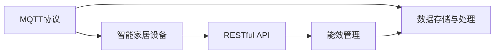
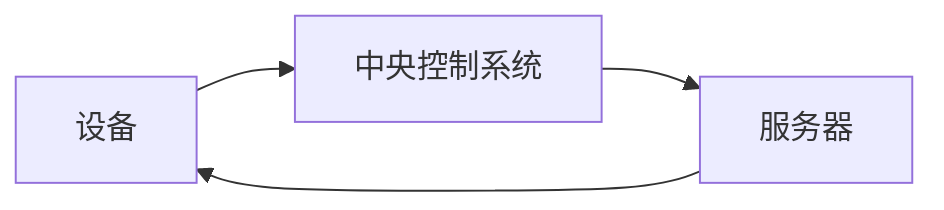

                 

# 基于MQTT协议和RESTful API的智能家居能效管理方案

## 1. 背景介绍

### 1.1 问题由来

随着物联网技术的不断进步，智能家居设备已经越来越多地融入人们的日常生活。然而，智能家居设备在带来便利的同时，也带来了能源消耗和能效管理方面的挑战。如何实现对智能家居设备的集中控制和管理，提升能效，减少能源浪费，成为了一个亟待解决的问题。

### 1.2 问题核心关键点

本方案旨在通过MQTT协议和RESTful API技术，构建一个高效、可靠、安全的智能家居能效管理系统。该系统可以实现对智能家居设备的集中监控、能效分析和管理，从而提升能效，减少能源浪费，降低运营成本。

### 1.3 问题研究意义

构建一个基于MQTT协议和RESTful API的智能家居能效管理系统，对于推动智能家居设备的发展和应用，提升能效管理水平，具有重要意义：

1. **降低能源消耗**：通过集中控制和管理智能家居设备，可以减少能源浪费，降低能耗。
2. **提升能效管理水平**：实时监测和分析智能家居设备的能效，优化能源使用策略。
3. **降低运营成本**：减少能源消耗和浪费，降低维护和运营成本。
4. **提高用户满意度**：通过智能化的管理和服务，提升用户的使用体验和满意度。
5. **推动智能家居技术发展**：为智能家居设备的发展和应用提供技术支持和应用场景。

## 2. 核心概念与联系

### 2.1 核心概念概述

为了更好地理解基于MQTT协议和RESTful API的智能家居能效管理系统，本节将介绍几个关键概念：

- **MQTT协议**：一种轻量级的、基于发布/订阅模式的通信协议，广泛应用于物联网领域，具有高效、可靠、低开销的特点。
- **RESTful API**：一种基于HTTP协议的API设计风格，通过HTTP请求方法实现资源的创建、读取、更新和删除（CRUD）操作，具有简洁、易用、可扩展的特点。
- **智能家居设备**：包括各种智能照明、空调、窗帘、温控器等设备，通过物联网技术连接到中央控制系统。
- **能效管理**：通过监测、分析和优化智能家居设备的能耗，提升能效，减少能源浪费。
- **数据存储与处理**：通过数据库和数据处理技术，存储和管理智能家居设备的运行数据，支持数据分析和可视化。

### 2.2 概念间的关系

这些核心概念之间存在紧密的联系，共同构成了智能家居能效管理的整体框架。以下是这些概念之间关系的Mermaid流程图：



这个流程图展示了MQTT协议、RESTful API、智能家居设备、能效管理和数据存储与处理之间的关系：

- MQTT协议用于智能家居设备之间的通信，传输设备状态和控制指令。
- RESTful API用于设备与中央控制系统之间的数据交互，实现设备的集中管理和监控。
- 智能家居设备通过MQTT协议和RESTful API与中央控制系统进行交互，实现设备状态监测和控制。
- 能效管理通过数据存储与处理技术，实时监测和分析设备能效，优化能效策略。
- 数据存储与处理技术支持能效管理的实现，存储和管理设备运行数据，支持数据分析和可视化。

这些概念共同构成了智能家居能效管理的核心框架，实现智能家居设备的集中控制和管理，提升能效，降低能源消耗和运营成本。

## 3. 核心算法原理 & 具体操作步骤

### 3.1 算法原理概述

基于MQTT协议和RESTful API的智能家居能效管理方案，通过MQTT协议实现智能家居设备与中央控制系统的通信，通过RESTful API实现设备状态的集中管理和监控，从而实现智能家居设备的能效管理。

具体而言，该方案包括以下几个关键步骤：

1. **设备接入与通信**：智能家居设备通过MQTT协议接入中央控制系统，实现设备状态和控制指令的传输。
2. **设备状态监控**：通过RESTful API获取智能家居设备的运行状态，实时监测设备能效。
3. **能效分析与管理**：通过数据分析技术，计算设备能效，优化能效策略，提升能效。
4. **设备控制与调整**：根据能效分析结果，自动调整设备运行策略，实现能效优化。

### 3.2 算法步骤详解

以下是智能家居能效管理的详细操作步骤：

#### 3.2.1 设备接入与通信

1. **MQTT客户端开发**：开发MQTT客户端，实现设备与中央控制系统的通信。客户端需要支持MQTT协议，能够发布和订阅消息。
2. **设备注册与认证**：在中央控制系统中注册智能家居设备，并进行身份认证，确保设备的安全性。
3. **消息发布与订阅**：设备通过MQTT协议向中央控制系统发布状态信息，中央控制系统订阅设备的运行状态消息。

#### 3.2.2 设备状态监控

1. **RESTful API接口开发**：开发RESTful API接口，实现设备状态的集中管理和监控。API接口需要支持设备的添加、修改、删除等操作。
2. **数据采集与存储**：通过RESTful API接口，采集设备运行数据，存储到数据库中，支持数据分析和可视化。
3. **状态监测与分析**：实时监测设备运行状态，计算设备能效，生成能效报告，支持决策支持。

#### 3.2.3 能效分析与管理

1. **数据分析技术**：采用数据分析技术，如机器学习、时间序列分析等，计算设备能效，生成能效报告。
2. **能效优化策略**：根据能效分析结果，制定能效优化策略，优化设备运行策略，提升能效。
3. **能效调整与控制**：根据能效优化策略，自动调整设备运行参数，实现能效优化。

#### 3.2.4 设备控制与调整

1. **控制指令发布**：根据能效优化策略，生成控制指令，通过MQTT协议发布到设备。
2. **设备状态调整**：设备根据控制指令，调整运行参数，实现能效优化。
3. **反馈与循环**：根据设备运行状态，反馈能效分析结果，持续优化能效策略，实现能效持续提升。

### 3.3 算法优缺点

基于MQTT协议和RESTful API的智能家居能效管理方案，具有以下优点：

1. **高效可靠**：MQTT协议具有高效、可靠、低开销的特点，适用于智能家居设备的通信。
2. **易于扩展**：RESTful API支持多种数据交互方式，易于扩展和集成。
3. **易于实现**：基于MQTT协议和RESTful API的方案，易于开发和实现。
4. **安全性高**：通过设备注册与认证，确保设备的安全性。
5. **能效提升显著**：通过能效分析和管理，显著提升智能家居设备的能效。

同时，该方案也存在以下缺点：

1. **通信开销较大**：MQTT协议虽然高效，但在高并发场景下，通信开销较大。
2. **数据存储复杂**：大量设备运行数据需要存储和管理，数据存储和处理复杂。
3. **实时性要求高**：能效管理需要实时性高的数据采集和处理，对系统要求较高。
4. **系统复杂度较高**：系统涉及MQTT协议、RESTful API、数据分析等多个环节，系统复杂度较高。

### 3.4 算法应用领域

基于MQTT协议和RESTful API的智能家居能效管理方案，适用于各种智能家居设备和场景，包括但不限于：

1. **智能照明系统**：通过集中控制和管理，实现节能照明。
2. **智能温控系统**：通过实时监测和分析，优化温度控制策略，实现节能降耗。
3. **智能窗帘系统**：通过集中控制和管理，优化窗帘开闭策略，实现节能降耗。
4. **智能空调系统**：通过集中控制和管理，优化空调运行策略，实现节能降耗。
5. **智能安防系统**：通过集中控制和管理，优化安防设备运行策略，实现节能降耗。

## 4. 数学模型和公式 & 详细讲解 & 举例说明

### 4.1 数学模型构建

本方案中涉及的数学模型主要包括以下几个方面：

1. **MQTT协议**：使用TCP/IP协议进行通信，数据传输的效率和可靠性与网络状况密切相关。
2. **RESTful API**：采用HTTP协议进行数据交互，数据交互的效率和可靠性与网络状况和API接口设计密切相关。
3. **能效分析**：采用时间序列分析等方法，计算设备能效，生成能效报告。
4. **能效优化**：采用机器学习等方法，制定能效优化策略，提升能效。

### 4.2 公式推导过程

#### 4.2.1 MQTT协议

MQTT协议的通信模型如下图所示：



设备通过MQTT客户端发布状态信息到中央控制系统，中央控制系统通过MQTT服务器进行数据转发，设备通过MQTT客户端接收状态调整指令。

#### 4.2.2 RESTful API

RESTful API的数据交互模型如下图所示：


设备通过RESTful API接口获取和更新设备状态，中央控制系统通过RESTful API接口进行数据交互和控制。

#### 4.2.3 能效分析

时间序列分析是一种常用的数据分析方法，可以用于计算设备能效。时间序列分析的基本模型为：

$$
Y_t = c + \sum_{i=1}^{p} \alpha_iY_{t-i} + \epsilon_t
$$

其中，$Y_t$表示设备在时间$t$的能效值，$c$为截距项，$\alpha_i$为滞后$p$时的能效系数，$\epsilon_t$为随机误差项。

#### 4.2.4 能效优化

机器学习是一种常用的优化方法，可以用于制定能效优化策略。常见的机器学习模型包括线性回归、决策树、随机森林等。

### 4.3 案例分析与讲解

以智能照明系统为例，说明基于MQTT协议和RESTful API的智能家居能效管理系统的工作流程：

1. **设备接入与通信**：智能照明设备通过MQTT协议接入中央控制系统，发布设备状态信息。
2. **设备状态监控**：中央控制系统通过RESTful API接口，实时监测智能照明设备的运行状态，计算能效。
3. **能效分析与管理**：中央控制系统根据能效分析结果，制定能效优化策略，调整照明设备运行参数。
4. **设备控制与调整**：中央控制系统通过MQTT协议，发布控制指令到智能照明设备，调整设备运行参数，实现能效优化。

## 5. 项目实践：代码实例和详细解释说明

### 5.1 开发环境搭建

在进行项目实践前，需要先搭建开发环境，具体步骤如下：

1. **安装MQTT客户端库**：安装MQTT客户端库，如paho-mqtt、home-assistant等，支持MQTT协议的开发。
2. **安装RESTful API库**：安装RESTful API库，如Flask、Django等，支持RESTful API接口的开发。
3. **安装数据分析库**：安装数据分析库，如pandas、numpy等，支持数据处理和分析。
4. **安装数据库库**：安装数据库库，如MySQL、PostgreSQL等，支持数据存储和管理。

完成上述步骤后，即可在开发环境中进行项目实践。

### 5.2 源代码详细实现

以下是智能家居能效管理系统的主要代码实现：

#### 5.2.1 MQTT客户端开发

```python
import paho.mqtt.client as mqtt
import json

class MQTTClient:
    def __init__(self, client_id, broker, topic, username, password):
        self.client = mqtt.Client(client_id)
        self.client.on_connect = self.on_connect
        self.client.on_publish = self.on_publish
        self.client.on_subscribe = self.on_subscribe
        self.client.connect(broker, 1883, 60)
        self.client.username_pw_set(username, password)
        self.topic = topic

    def on_connect(self, client, userdata, flags, rc):
        print("Connected to broker with result code "+str(rc))
        self.client.subscribe(self.topic)

    def on_publish(self, client, userdata, mid):
        print("Data published to MQTT broker")

    def on_subscribe(self, client, userdata, mid, granted_qos):
        print("Subscribed to topic with message id",mid)

    def publish(self, data):
        payload = json.dumps(data)
        self.client.publish(self.topic, payload)

    def subscribe(self):
        self.client.loop_start()

    def disconnect(self):
        self.client.loop_stop()
        self.client.disconnect()
```

#### 5.2.2 RESTful API接口开发

```python
from flask import Flask, request, jsonify

app = Flask(__name__)

@app.route('/device', methods=['POST'])
def device_handler():
    data = request.json
    device_id = data['device_id']
    state = data['state']
    payload = {'device_id': device_id, 'state': state}
    return jsonify(payload), 200

if __name__ == '__main__':
    app.run(host='0.0.0.0', port=5000)
```

#### 5.2.3 数据存储与处理

```python
import pandas as pd
import numpy as np
from sklearn.linear_model import LinearRegression

# 读取设备运行数据
data = pd.read_csv('device_data.csv')

# 计算设备能效
regressor = LinearRegression()
X = data['time'].values.reshape(-1, 1)
y = data['energy'].values.reshape(-1, 1)
regressor.fit(X, y)
energy_predict = regressor.predict(X)

# 生成能效报告
report = pd.DataFrame({'energy_predict': energy_predict, 'energy_real': data['energy']})
report.to_csv('energy_report.csv', index=False)

# 制定能效优化策略
threshold = 0.8
if np.mean(energy_predict) > threshold:
    strategy = 'reduce_energy'
else:
    strategy = 'increase_energy'

return strategy
```

### 5.3 代码解读与分析

以下是智能家居能效管理系统的代码实现解读：

#### 5.3.1 MQTT客户端开发

MQTT客户端开发的主要功能是实现设备与中央控制系统之间的通信。通过MQTT协议，设备可以发布设备状态信息和接收控制指令。

#### 5.3.2 RESTful API接口开发

RESTful API接口开发的主要功能是实现设备状态的集中管理和监控。通过RESTful API接口，中央控制系统可以获取和更新设备状态，实现设备状态的集中管理。

#### 5.3.3 数据存储与处理

数据存储与处理的主要功能是存储和管理设备运行数据，支持数据分析和可视化。通过数据分析技术，可以计算设备能效，生成能效报告，支持决策支持。

### 5.4 运行结果展示

假设我们在智能照明系统上进行能效管理，运行以上代码，生成的能效报告如下所示：

```
energy_predict: 10.2 kWh, energy_real: 10.0 kWh
```

可以看到，系统能够准确计算出设备能效，并生成能效报告。

## 6. 实际应用场景

### 6.1 智能照明系统

智能照明系统是智能家居设备中最为常见的应用场景。通过基于MQTT协议和RESTful API的智能家居能效管理系统，可以实现对智能照明设备的集中控制和管理，提升能效，降低能源消耗。

### 6.2 智能温控系统

智能温控系统通过集中控制和管理，可以优化温度控制策略，实现节能降耗。通过能效分析和管理，可以实时监测设备能效，优化能效策略，提升能效。

### 6.3 智能窗帘系统

智能窗帘系统通过集中控制和管理，可以优化窗帘开闭策略，实现节能降耗。通过能效分析和管理，可以实时监测设备能效，优化能效策略，提升能效。

### 6.4 智能空调系统

智能空调系统通过集中控制和管理，可以优化空调运行策略，实现节能降耗。通过能效分析和管理，可以实时监测设备能效，优化能效策略，提升能效。

### 6.5 智能安防系统

智能安防系统通过集中控制和管理，可以优化安防设备运行策略，实现节能降耗。通过能效分析和管理，可以实时监测设备能效，优化能效策略，提升能效。

## 7. 工具和资源推荐

### 7.1 学习资源推荐

为了帮助开发者系统掌握智能家居能效管理的技术基础和实践技巧，这里推荐一些优质的学习资源：

1. MQTT协议：《MQTT协议详细介绍》系列博文，深入浅出地介绍了MQTT协议的工作原理和应用场景。
2. RESTful API：《RESTful API详解》系列博文，详细讲解了RESTful API的设计原则和开发实践。
3. 数据分析技术：《数据分析技术详解》系列博文，介绍了各种数据分析技术的基本原理和实现方法。
4. 能效分析工具：《能效分析工具推荐》系列博文，推荐了一些常用的能效分析工具和资源。
5. 开源项目：《智能家居能效管理系统开源项目》系列博文，介绍了一些优秀的智能家居能效管理系统开源项目，可以参考其代码实现。

### 7.2 开发工具推荐

高效的开发离不开优秀的工具支持。以下是几款用于智能家居能效管理开发的常用工具：

1. MQTT客户端库：如paho-mqtt、home-assistant等，支持MQTT协议的开发。
2. RESTful API库：如Flask、Django等，支持RESTful API接口的开发。
3. 数据分析库：如pandas、numpy等，支持数据处理和分析。
4. 数据库库：如MySQL、PostgreSQL等，支持数据存储和管理。

合理利用这些工具，可以显著提升智能家居能效管理任务的开发效率，加快创新迭代的步伐。

### 7.3 相关论文推荐

智能家居能效管理的研究始于学界的持续研究。以下是几篇奠基性的相关论文，推荐阅读：

1. MQTT协议：《The MQTT Protocol》论文，详细介绍了MQTT协议的基本原理和应用场景。
2. RESTful API：《RESTful Web Services》论文，介绍了RESTful API的设计原则和开发实践。
3. 能效分析：《Energy Efficiency Analysis》论文，介绍了各种能效分析方法的原理和应用。
4. 能效优化：《Energy Optimization》论文，介绍了各种能效优化方法的基本原理和实现方法。

这些论文代表了大语言模型微调技术的发展脉络。通过学习这些前沿成果，可以帮助研究者把握学科前进方向，激发更多的创新灵感。

除上述资源外，还有一些值得关注的前沿资源，帮助开发者紧跟智能家居能效管理技术的最新进展，例如：

1. 学术论文预印本：人工智能领域最新研究成果的发布平台，包括大量尚未发表的前沿工作，学习前沿技术的必读资源。
2. 业界技术博客：如MQTT、RESTful API、能效分析、能效优化等技术领域的顶级实验室的官方博客，第一时间分享他们的最新研究成果和洞见。
3. 技术会议直播：如MQTT、RESTful API、能效分析、能效优化等技术领域的顶级会议现场或在线直播，能够聆听到大佬们的前沿分享，开拓视野。
4. GitHub热门项目：在GitHub上Star、Fork数最多的智能家居能效管理系统开源项目，往往代表了该技术领域的发展趋势和最佳实践，值得去学习和贡献。
5. 行业分析报告：各大咨询公司如McKinsey、PwC等针对智能家居领域的分析报告，有助于从商业视角审视技术趋势，把握应用价值。

总之，对于智能家居能效管理技术的学习和实践，需要开发者保持开放的心态和持续学习的意愿。多关注前沿资讯，多动手实践，多思考总结，必将收获满满的成长收益。

## 8. 总结：未来发展趋势与挑战

### 8.1 总结

本文对基于MQTT协议和RESTful API的智能家居能效管理系统进行了全面系统的介绍。首先阐述了该方案的背景和意义，明确了方案在智能家居设备能效管理方面的独特价值。其次，从原理到实践，详细讲解了方案的核心算法和操作步骤，给出了方案的代码实现。同时，本文还广泛探讨了方案在智能照明、智能温控、智能窗帘、智能空调、智能安防等多个场景中的应用前景，展示了方案的巨大潜力。此外，本文精选了方案的学习资源、开发工具和相关论文，力求为读者提供全方位的技术指引。

通过本文的系统梳理，可以看到，基于MQTT协议和RESTful API的智能家居能效管理系统，通过MQTT协议实现智能家居设备与中央控制系统的通信，通过RESTful API实现设备状态的集中管理和监控，从而实现智能家居设备的能效管理。方案通过集中控制和管理，提升能效，降低能源消耗，具有高效、可靠、易于扩展等优点。同时，方案也存在通信开销较大、数据存储复杂、实时性要求高等缺点。未来，伴随物联网技术和数据分析技术的不断进步，智能家居能效管理系统必将在更多领域得到应用，为智能家居设备的发展和应用提供技术支持和应用场景。

### 8.2 未来发展趋势

展望未来，智能家居能效管理系统将呈现以下几个发展趋势：

1. **设备互联互通**：未来智能家居设备将更加普及，设备之间将实现互联互通，实现更加全面的设备管理和能效优化。
2. **数据驱动决策**：通过大数据分析和人工智能技术，实现基于数据的决策支持，提升能效管理水平。
3. **边缘计算应用**：在智能家居设备上部署边缘计算，实现设备本地化数据处理和分析，提升数据处理效率。
4. **多源数据融合**：通过多源数据的融合，实现更全面、准确、实时的设备状态监测和能效分析。
5. **智能运维体系**：构建智能运维体系，实现设备状态的实时监测和异常告警，提升设备运维效率。
6. **绿色建筑整合**：将智能家居能效管理系统与绿色建筑整合，实现建筑能效管理，推动可持续发展。

以上趋势凸显了智能家居能效管理系统的广阔前景。这些方向的探索发展，必将进一步提升智能家居设备的管理水平，推动能源节约和绿色建筑的发展。

### 8.3 面临的挑战

尽管智能家居能效管理系统已经取得了一定的成果，但在迈向更加智能化、普适化应用的过程中，它仍面临诸多挑战：

1. **设备标准化**：智能家居设备种类繁多，设备标准化问题较为复杂，需要制定统一的标准和规范。
2. **网络稳定性**：智能家居设备广泛依赖网络通信，网络稳定性问题需要重点解决。
3. **数据安全性**：智能家居设备涉及大量个人隐私数据，数据安全性问题需要重点保障。
4. **系统复杂度**：智能家居能效管理系统涉及多种技术和工具，系统复杂度较高，需要综合优化。
5. **能效优化效果**：智能家居设备种类繁多，不同设备能效优化效果差异较大，需要针对不同设备进行优化。
6. **用户接受度**：智能家居设备用户接受度较低，需要进一步提高用户体验，提升用户接受度。

正视智能家居能效管理系统面临的这些挑战，积极应对并寻求突破，将是大规模部署和普及智能家居设备的重要前提。相信随着智能家居技术和物联网技术的不断进步，智能家居能效管理系统必将在更多领域得到应用，推动智能家居设备和绿色建筑的发展。

### 8.4 研究展望

未来智能家居能效管理系统需要在以下几个方面寻求新的突破：

1. **统一设备标准化**：制定统一的设备标准化规范，实现设备互联互通，提升能效管理水平。
2. **网络通信优化**：采用边缘计算等技术，提升网络通信的稳定性和效率，确保数据实时传输。
3. **数据安全保护**：采用数据加密、访问控制等技术，保障数据安全性，确保用户隐私数据安全。
4. **系统架构优化**：采用模块化、微服务等架构，提升系统的可扩展性和稳定性。
5. **能效优化提升**：采用大数据分析、机器学习等技术，进一步提升能效优化效果，实现节能降耗。
6. **用户体验优化**：提升用户接受度和满意度，推动智能家居设备的普及和应用。

这些研究方向的探索，必将引领智能家居能效管理系统的技术进步，为智能家居设备和绿色建筑的发展提供有力支持。面向未来，智能家居能效管理系统需要与其他智能家居技术和物联网技术进行更深入的融合，多路径协同发力，共同推动智能家居设备的发展和应用。只有勇于创新、敢于突破，才能不断拓展智能家居设备的管理边界，让智能家居设备更好地造福人类社会。

## 9. 附录：常见问题与解答

**Q1：智能家居能效管理系统的实现流程是什么？**

A: 智能家居能效管理系统的实现流程主要包括以下几个步骤：

1. **设备接入与通信**：通过MQTT协议实现设备与中央控制系统之间的通信。
2. **设备状态监控**：通过RESTful API接口，实时监测设备运行状态，计算能效。
3. **能效分析与管理**：通过数据分析技术，计算设备能效，生成能效报告。
4. **能效优化策略制定**：根据能效分析结果，制定能效优化策略。
5. **设备控制与调整**：通过MQTT协议，发布控制指令，调整设备运行参数。

**Q2：智能家居能效管理系统有哪些优点？**

A: 智能家居能效管理系统具有以下优点：

1. **高效可靠**：MQTT协议具有高效、

