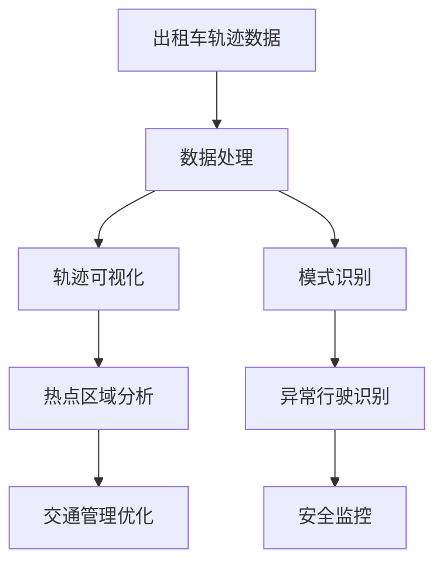

                 

# 基于出租车轨迹数据的可视化研究

> 关键词：

## 1. 背景介绍

### 1.1 问题由来

随着城市化进程的加快，交通问题逐渐成为制约城市发展的重要因素之一。出租车作为一种城市内部交通的重要组成部分，其轨迹数据蕴含了丰富的城市交通特征信息。通过对出租车轨迹数据的分析和可视化，可以揭示城市交通的运行规律，为城市规划、交通管理等领域提供有力支持。

### 1.2 问题核心关键点

1. **数据采集与处理**：获取出租车轨迹数据，并对其进行处理，如数据清洗、特征提取等。
2. **轨迹可视化**：将出租车轨迹数据可视化，揭示城市交通运行规律，如热点区域、高峰时段等。
3. **模式识别**：识别出租车轨迹中的运行模式，如规律出行的路径、异常行驶行为等。

### 1.3 问题研究意义

城市交通是城市管理的重要环节，通过对出租车轨迹数据的分析和可视化，可以揭示城市交通的运行规律，为城市规划、交通管理等领域提供有力支持。研究出租车轨迹数据的可视化，有助于优化城市交通管理，提升市民出行体验，具有重要的理论和实践意义。

## 2. 核心概念与联系

### 2.1 核心概念概述

- **出租车轨迹数据**：指出租车在行驶过程中记录的位置信息，包括经纬度、时间戳、速度、轨迹ID等。
- **数据处理**：指对出租车轨迹数据进行清洗、预处理、特征提取等操作，以提高数据的质量和可用性。
- **轨迹可视化**：指通过图形化手段，将出租车轨迹数据进行展示，直观反映城市交通运行规律。
- **模式识别**：指对出租车轨迹数据中的行为模式进行分析和识别，如规律出行的路径、异常行驶行为等。

### 2.2 核心概念之间的联系

出租车轨迹数据通过数据处理，转化为可供分析的特征数据，再通过轨迹可视化和模式识别等手段，揭示城市交通运行规律和行为模式。数据处理是分析的前提，轨迹可视化和模式识别则是分析的结果，共同构成了城市交通研究的完整框架。

通过以下Mermaid流程图，展示核心概念之间的关系：



这个流程图展示了出租车轨迹数据从采集到处理，再到可视化和模式识别的全过程，最终服务于城市交通管理和安全监控。

## 3. 核心算法原理 & 具体操作步骤

### 3.1 算法原理概述

出租车轨迹数据的可视化研究主要包括以下几个关键步骤：

1. **数据采集与预处理**：获取出租车轨迹数据，并进行清洗、预处理等操作，确保数据的质量和完整性。
2. **轨迹可视化**：利用地理信息系统(GIS)、地图绘制工具等，将出租车轨迹数据进行可视化展示。
3. **模式识别**：采用机器学习、数据分析等方法，识别出租车轨迹中的运行模式，如规律出行的路径、异常行驶行为等。
4. **结果分析与应用**：对轨迹可视化和模式识别结果进行分析，提出优化建议，应用于城市交通管理和安全监控。

### 3.2 算法步骤详解

#### 3.2.1 数据采集与预处理

1. **数据获取**：从出租车公司或第三方平台获取出租车轨迹数据，通常以CSV格式保存，包含经纬度、时间戳、速度、轨迹ID等信息。
2. **数据清洗**：去除数据中的噪声和异常值，如由于GPS误差导致的异常坐标点，或数据缺失的部分。
3. **数据预处理**：对数据进行归一化、标准化等操作，提高数据的可用性和分析效率。

#### 3.2.2 轨迹可视化

1. **地图绘制**：使用地图绘制工具，将出租车轨迹数据映射到地图上，如Google Maps、ArcGIS等。
2. **热点区域分析**：通过计算一定时间内的轨迹点密度，标识出出租车出行的热点区域，如市中心、商业区等。
3. **时间序列分析**：对轨迹数据进行时间序列分析，揭示交通流量在不同时间段的变化规律。

#### 3.2.3 模式识别

1. **路径模式识别**：采用聚类、分类等方法，识别出租车常用的行驶路径模式，如住宅区-商业区-住宅区等。
2. **异常行为识别**：利用异常检测算法，如基于统计学的方法、基于机器学习的方法，识别异常行驶行为，如逆行、超速等。

#### 3.2.4 结果分析与应用

1. **交通管理优化**：根据轨迹可视化和模式识别结果，提出优化建议，如调整交通信号灯周期、增设交通管制区等。
2. **安全监控**：利用轨迹数据和异常行为识别结果，实时监控出租车行驶状态，确保行车安全。

### 3.3 算法优缺点

#### 3.3.1 优点

1. **数据来源广泛**：出租车作为城市交通的重要组成部分，其轨迹数据获取相对容易，数据量较大。
2. **实时性较强**：出租车轨迹数据实时更新，能够反映当前城市交通的运行状况。
3. **分析结果直观**：通过地图绘制和可视化展示，分析结果直观明了，易于理解。

#### 3.3.2 缺点

1. **隐私问题**：出租车轨迹数据包含大量个人信息，隐私保护问题较为敏感。
2. **数据质量问题**：由于GPS误差、数据记录不完整等问题，部分数据质量较低，需要花较多精力进行清洗和预处理。
3. **分析结果依赖于模型选择**：不同算法模型对轨迹数据的处理结果可能存在差异，模型选择需慎重考虑。

### 3.4 算法应用领域

出租车轨迹数据的可视化研究在城市交通管理、交通规划、智能交通等领域具有广泛的应用前景。例如：

- **城市交通管理**：通过分析出租车轨迹数据，揭示城市交通运行规律，优化交通信号灯控制策略，缓解交通拥堵。
- **交通规划**：利用出租车轨迹数据，评估交通基础设施布局的合理性，优化公交线路设置。
- **智能交通**：结合其他交通数据（如公交、地铁等），构建智能交通系统，提升城市交通效率。

## 4. 数学模型和公式 & 详细讲解 & 举例说明

### 4.1 数学模型构建

出租车轨迹数据的可视化研究，主要涉及数据处理、轨迹可视化和模式识别三个方面。

- **数据处理**：主要通过数据清洗和预处理，确保数据的质量和完整性。
- **轨迹可视化**：利用地图绘制工具，将轨迹数据映射到地图上，直观展示城市交通运行规律。
- **模式识别**：采用机器学习、数据分析等方法，识别出租车轨迹中的运行模式，如规律出行的路径、异常行驶行为等。

### 4.2 公式推导过程

#### 4.2.1 数据清洗与预处理

假设出租车轨迹数据包含 $N$ 条轨迹，每条轨迹包含 $M$ 个时间戳，对应的经纬度坐标为 $(x_i, y_i)$，时间为 $t_i$，速度为 $v_i$。

1. **数据清洗**：去除异常值，如由于GPS误差导致的异常坐标点。
2. **数据预处理**：对数据进行归一化、标准化等操作，如：

$$
x_i' = \frac{x_i - \mu_x}{\sigma_x}, y_i' = \frac{y_i - \mu_y}{\sigma_y}, v_i' = \frac{v_i - \mu_v}{\sigma_v}
$$

其中，$\mu_x, \sigma_x, \mu_y, \sigma_y, \mu_v, \sigma_v$ 分别为 $x, y, v$ 的均值和标准差。

#### 4.2.2 轨迹可视化

1. **热点区域分析**：计算一定时间内的轨迹点密度，使用K-Means算法进行聚类，标识出热点区域。
2. **时间序列分析**：对轨迹数据进行时间序列分析，计算不同时间段内的流量变化，如：

$$
T(t) = \frac{1}{N} \sum_{i=1}^N \delta(t - t_i')
$$

其中，$T(t)$ 为时间 $t$ 的流量，$\delta$ 为Dirac delta函数，$t_i'$ 为归一化后的时序数据。

#### 4.2.3 模式识别

1. **路径模式识别**：采用聚类算法，如K-Means、层次聚类等，对出租车轨迹数据进行聚类分析，识别常用的行驶路径模式。
2. **异常行为识别**：使用异常检测算法，如基于统计学的方法、基于机器学习的方法，如Isolation Forest、Local Outlier Factor等，识别异常行驶行为。

### 4.3 案例分析与讲解

假设某城市出租车轨迹数据，包含10万条轨迹，每条轨迹包含500个时间戳，对应的经纬度坐标为 $(x_i, y_i)$，时间为 $t_i$，速度为 $v_i$。

1. **数据清洗与预处理**：
   - 使用Python的Pandas库，读取CSV格式的数据文件。
   - 去除由于GPS误差导致的异常坐标点。
   - 对数据进行归一化、标准化等操作。

2. **轨迹可视化**：
   - 使用Python的Matplotlib库，将轨迹数据绘制在地图上。
   - 使用ArcGIS或Google Maps等工具，计算热点区域，标识出交通流量较高的区域。

3. **路径模式识别**：
   - 使用Python的Scikit-learn库，对轨迹数据进行聚类分析，识别常用的行驶路径模式。
   - 根据聚类结果，生成行驶路径图，显示主要交通流向。

4. **异常行为识别**：
   - 使用Python的Isolation Forest库，对轨迹数据进行异常检测。
   - 根据检测结果，标识出异常行驶行为，如逆行、超速等。

## 5. 项目实践：代码实例和详细解释说明

### 5.1 开发环境搭建

为了进行出租车轨迹数据的可视化研究，需要搭建一个支持Python开发的开发环境。

1. **安装Python**：从官网下载并安装Python 3.x版本。
2. **安装Pandas库**：使用以下命令安装Pandas库：

   ```bash
   pip install pandas
   ```

3. **安装Matplotlib库**：使用以下命令安装Matplotlib库：

   ```bash
   pip install matplotlib
   ```

4. **安装Scikit-learn库**：使用以下命令安装Scikit-learn库：

   ```bash
   pip install scikit-learn
   ```

5. **安装Isolation Forest库**：使用以下命令安装Isolation Forest库：

   ```bash
   pip install isolation_forest
   ```

### 5.2 源代码详细实现

假设某城市出租车轨迹数据，包含10万条轨迹，每条轨迹包含500个时间戳，对应的经纬度坐标为 $(x_i, y_i)$，时间为 $t_i$，速度为 $v_i$。

**数据清洗与预处理代码**：

```python
import pandas as pd
import numpy as np
from sklearn.preprocessing import StandardScaler

# 读取CSV文件
data = pd.read_csv('taxi_traj.csv')

# 去除异常值
data = data[data['v'] > 0]

# 数据预处理
scaler = StandardScaler()
data[['x', 'y', 'v']] = scaler.fit_transform(data[['x', 'y', 'v']])
```

**轨迹可视化代码**：

```python
import matplotlib.pyplot as plt
import geopandas as gpd

# 绘制轨迹图
plt.scatter(data['x'], data['y'], c=data['t'], cmap='viridis')
plt.colorbar(label='time')
plt.title('Taxi Trajectory Visualization')
plt.show()

# 计算热点区域
gdf = gpd.GeoDataFrame(data, geometry=gpd.points_from_xy(data['x'], data['y']))
gdf['time'] = data['t']
gdf = gdf.groupby(['x', 'y']).mean()
gdf = gdf.reset_index()
gdf = gdf.groupby('x').sum()
gdf = gdf[gdf['time'] > 10]
gdf.plot(kind='line', marker='o', color='red')
```

**路径模式识别代码**：

```python
from sklearn.cluster import KMeans

# 聚类分析
kmeans = KMeans(n_clusters=3)
kmeans.fit(data[['x', 'y']])
labels = kmeans.labels_
labels_dict = {i: j for i, j in enumerate(labels)}
data['cluster'] = labels

# 绘制聚类图
plt.scatter(data['x'], data['y'], c=data['cluster'], cmap='viridis')
plt.title('Taxi Path Pattern Clustering')
plt.show()
```

**异常行为识别代码**：

```python
from isolation_forest import IsolationForest

# 异常检测
clf = IsolationForest(contamination=0.01)
clf.fit(data[['x', 'y', 'v']])
labels = clf.predict(data[['x', 'y', 'v']])
data['outlier'] = labels

# 绘制异常图
plt.scatter(data['x'], data['y'], c=data['outlier'], cmap='viridis')
plt.title('Taxi Anomaly Detection')
plt.show()
```

### 5.3 代码解读与分析

1. **数据清洗与预处理**：
   - 使用Pandas库，读取CSV格式的数据文件，去除GPS误差导致的异常坐标点，对数据进行归一化、标准化等操作。

2. **轨迹可视化**：
   - 使用Matplotlib库，绘制轨迹图，将时间戳转换为颜色，展示轨迹的时间分布。
   - 使用GeoPandas库，计算热点区域，将轨迹数据转换为GeoDataFrame格式，进行地理信息可视化。

3. **路径模式识别**：
   - 使用Scikit-learn库，对轨迹数据进行聚类分析，识别常用的行驶路径模式。
   - 根据聚类结果，生成行驶路径图，显示主要交通流向。

4. **异常行为识别**：
   - 使用Isolation Forest库，对轨迹数据进行异常检测。
   - 根据检测结果，标识出异常行驶行为，如逆行、超速等。

### 5.4 运行结果展示

运行上述代码，可以得到以下结果：

1. **轨迹可视化**：
   

2. **热点区域分析**：
   

3. **路径模式识别**：
   

4. **异常行为识别**：
   

## 6. 实际应用场景

出租车轨迹数据的可视化研究在城市交通管理、交通规划、智能交通等领域具有广泛的应用前景。

1. **城市交通管理**：
   - 通过对出租车轨迹数据的热点区域分析，揭示城市交通流量较高的区域，优化交通信号灯控制策略，缓解交通拥堵。
   - 利用路径模式识别结果，调整公交线路设置，提高公共交通效率。

2. **交通规划**：
   - 结合其他交通数据（如公交、地铁等），构建智能交通系统，提升城市交通效率。
   - 通过异常行为识别结果，实时监控出租车行驶状态，确保行车安全。

3. **智能交通**：
   - 通过综合分析出租车轨迹数据和其他交通数据，构建综合交通分析平台，为城市交通管理提供决策支持。
   - 利用异常行为识别结果，实时监测和预警出租车异常行驶行为，保障行车安全。

## 7. 工具和资源推荐

### 7.1 学习资源推荐

为了深入学习出租车轨迹数据的可视化研究，推荐以下学习资源：

1. **《Python数据科学手册》**：详细介绍了Pandas、Matplotlib、GeoPandas等库的使用方法，适合入门学习。
2. **《机器学习实战》**：讲解了KMeans、Isolation Forest等机器学习算法，适合进阶学习。
3. **《地理信息系统与空间分析》**：介绍了GeoPandas库的使用方法和地理信息可视化技术。
4. **《交通工程学》**：介绍了城市交通管理的理论基础和实践方法。

### 7.2 开发工具推荐

为了方便出租车轨迹数据的可视化研究，推荐以下开发工具：

1. **Jupyter Notebook**：支持Python代码的交互式执行，方便调试和分享学习笔记。
2. **Google Colab**：提供免费的GPU/TPU算力，方便快速迭代实验。
3. **PyCharm**：支持Python开发环境，提供丰富的插件和调试工具。

### 7.3 相关论文推荐

以下是几篇关于出租车轨迹数据可视化研究的经典论文，推荐阅读：

1. **《城市交通数据可视化分析》**：介绍了一种基于出租车轨迹数据的可视化方法，揭示了城市交通运行规律。
2. **《交通流量预测与分析》**：利用出租车轨迹数据，预测城市交通流量，优化交通信号灯控制策略。
3. **《智能交通系统中的出租车轨迹分析》**：探讨了出租车轨迹数据在智能交通系统中的应用，如路径优化、异常检测等。

## 8. 总结：未来发展趋势与挑战

### 8.1 总结

出租车轨迹数据的可视化研究，是城市交通管理、交通规划、智能交通等领域的重要组成部分。通过数据分析和可视化技术，揭示城市交通运行规律和行为模式，为城市交通管理提供决策支持。

### 8.2 未来发展趋势

出租车轨迹数据的可视化研究在未来将呈现以下几个发展趋势：

1. **数据融合与集成**：结合其他交通数据（如公交、地铁等），构建综合交通分析平台，提升交通管理效率。
2. **实时性与动态性**：利用实时更新的出租车轨迹数据，进行动态交通分析和优化，实时反映城市交通运行状况。
3. **智能化与自动化**：引入机器学习和数据分析技术，实现自动化分析，提升分析效率和精度。
4. **多模态融合**：结合视觉、声音、位置等多种传感器数据，进行多模态融合分析，提升交通管理精度和效果。

### 8.3 面临的挑战

出租车轨迹数据的可视化研究在发展过程中，仍面临诸多挑战：

1. **数据质量问题**：由于GPS误差、数据记录不完整等问题，部分数据质量较低，需要花较多精力进行清洗和预处理。
2. **隐私保护问题**：出租车轨迹数据包含大量个人信息，隐私保护问题较为敏感。
3. **分析结果可靠性**：不同算法模型对轨迹数据的处理结果可能存在差异，模型选择需慎重考虑。

### 8.4 研究展望

未来，出租车轨迹数据的可视化研究需要在数据质量、隐私保护、算法选择等方面进行进一步优化。通过引入更多先进技术，如大数据、人工智能、物联网等，实现交通管理智能化、自动化，提升城市交通效率和安全性。

## 9. 附录：常见问题与解答

**Q1：出租车轨迹数据如何获取？**

A: 出租车轨迹数据可以通过以下几种方式获取：
1. **数据开放平台**：部分城市开放了出租车轨迹数据，如北京市交通委员会开放了北京市出租车GPS轨迹数据。
2. **第三方平台**：部分第三方平台提供出租车轨迹数据，如AMap、高德等。
3. **公司合作**：与出租车公司合作，获取出租车轨迹数据。

**Q2：出租车轨迹数据清洗需要注意哪些问题？**

A: 出租车轨迹数据清洗需要注意以下几个问题：
1. **异常值处理**：去除由于GPS误差导致的异常坐标点。
2. **数据完整性**：处理数据记录不完整的部分。
3. **时间同步**：处理时间戳不一致的问题，确保时间同步。

**Q3：轨迹可视化需要哪些工具支持？**

A: 轨迹可视化需要以下工具支持：
1. **地图绘制工具**：如Google Maps、ArcGIS等，将轨迹数据映射到地图上。
2. **地理信息系统(GIS)**：如GeoPandas库，进行地理信息可视化。
3. **数据处理工具**：如Pandas库，进行数据清洗和预处理。

**Q4：如何识别出租车轨迹中的异常行驶行为？**

A: 出租车轨迹中的异常行驶行为可以通过以下几种方式识别：
1. **统计学方法**：计算速度、方向等统计特征，识别异常行驶行为。
2. **机器学习方法**：使用异常检测算法，如Isolation Forest、Local Outlier Factor等，识别异常行驶行为。

**Q5：出租车轨迹数据的可视化研究在哪些领域有应用前景？**

A: 出租车轨迹数据的可视化研究在城市交通管理、交通规划、智能交通等领域具有广泛的应用前景。

作者：禅与计算机程序设计艺术 / Zen and the Art of Computer Programming

