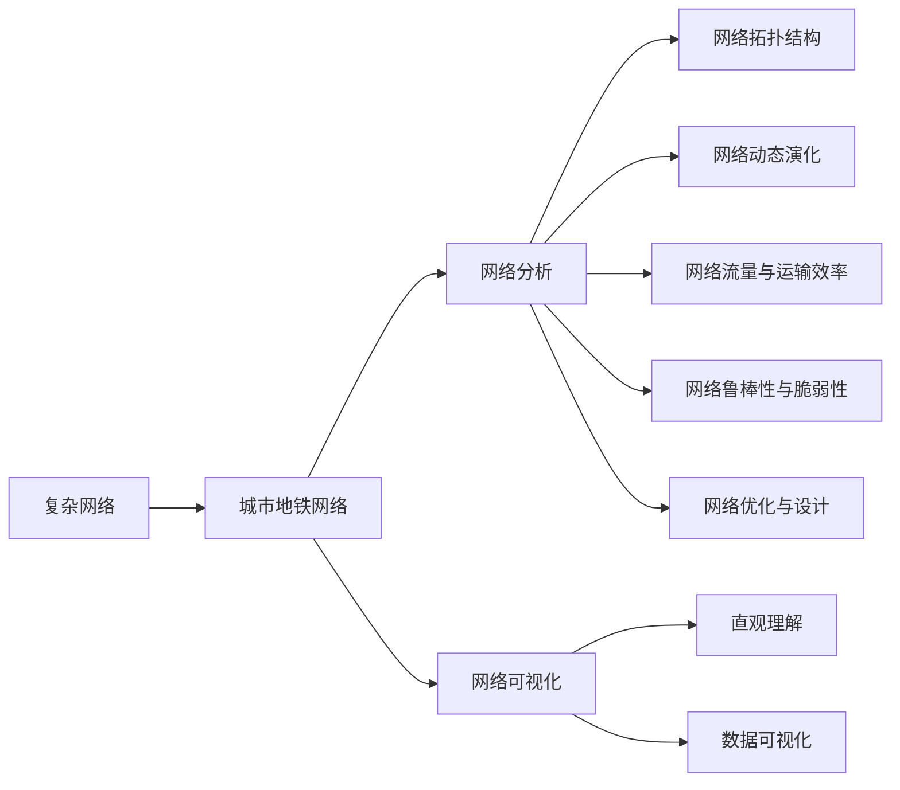
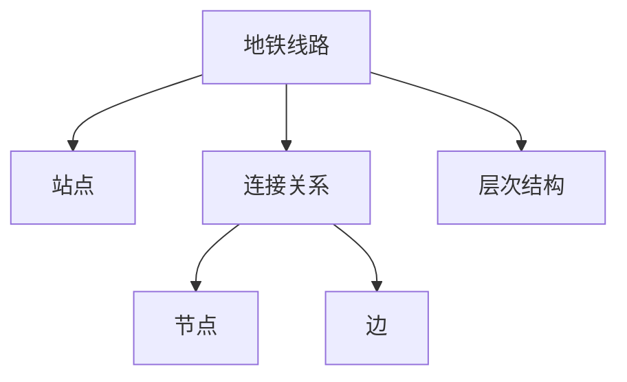
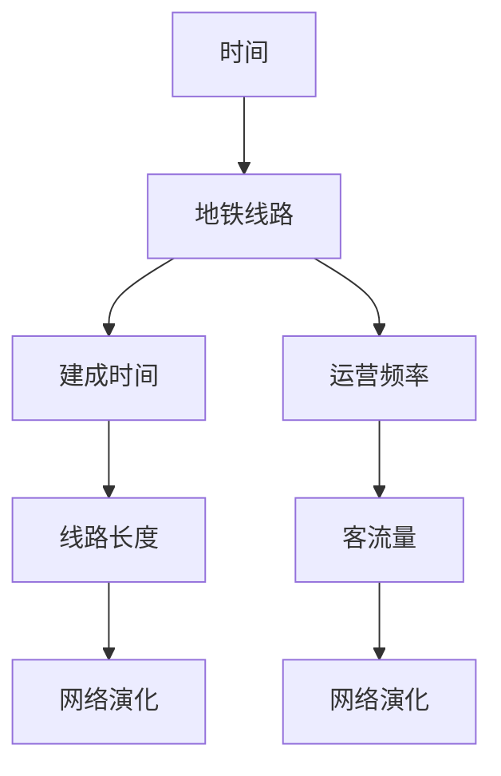
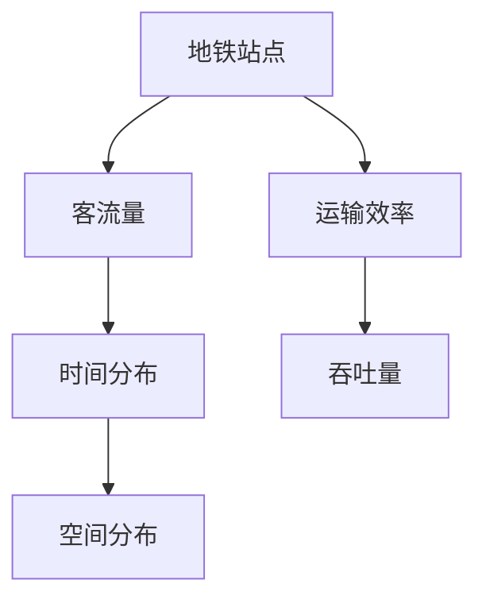
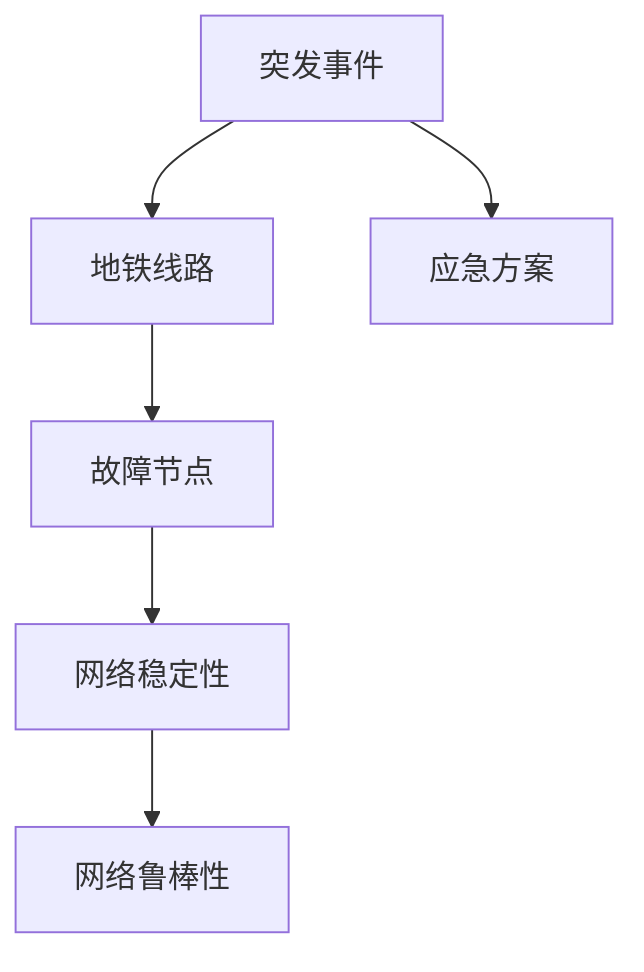
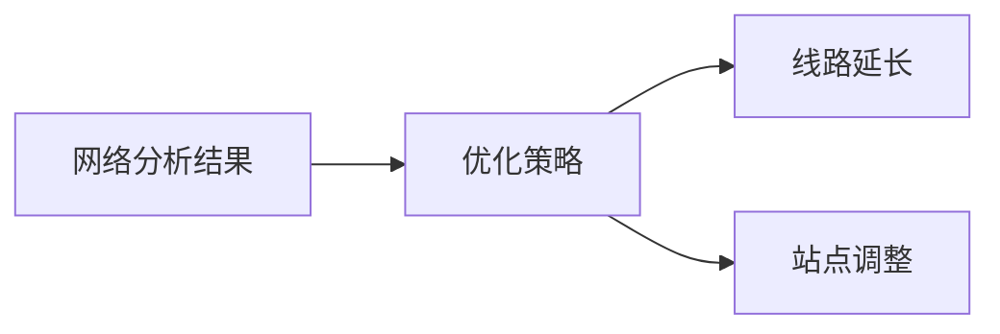
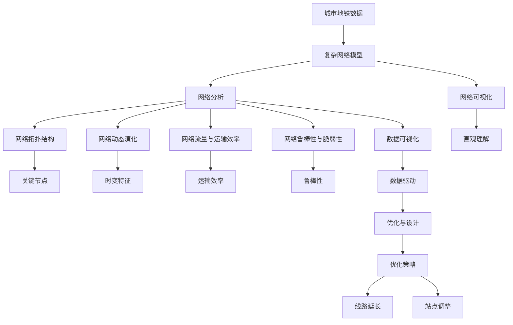

                 

# 基于复杂网络的城市地铁交通网络研究

> 关键词：城市地铁,复杂网络,交通网络,网络分析,数据驱动

## 1. 背景介绍

### 1.1 问题由来

随着城市化进程的加快和交通需求的增长，城市地铁作为重要的公共交通方式，承担着巨大的压力。如何科学、高效地管理和优化地铁网络，成为了当前城市交通研究的热点问题。传统的交通规划方法通常依赖经验或者简单的统计模型，无法应对复杂的网络结构和动态变化的数据。

近年来，随着大数据技术和复杂网络理论的不断发展，基于复杂网络的城市交通研究逐渐受到关注。通过将城市地铁网络建模为复杂网络，利用网络分析的方法，可以更全面、深入地揭示地铁网络中的关键特征和规律，为交通规划和管理提供数据支撑。

### 1.2 问题核心关键点

在城市地铁交通网络研究中，复杂网络方法主要关注以下几个核心问题：

- **网络拓扑结构分析**：研究地铁线路和站点之间的连接关系，识别出网络中的核心节点和关键路径。
- **网络动态演化研究**：研究地铁线路的建成时间、运营频率等属性随时间的变化规律，识别出网络的时变特征。
- **网络流量与运输效率**：研究地铁站点客流量的时空分布，计算网络中的运输效率和吞吐量。
- **网络鲁棒性与脆弱性**：研究地铁网络在受到突发事件（如故障、灾害）影响下的稳定性与抗干扰能力。
- **网络优化与设计**：根据网络分析结果，提出合理的地铁网络优化策略，如线路延长、站点调整等。

这些问题通常通过数据驱动的方法，结合网络分析工具和技术手段，在大量实际数据的基础上进行建模与分析。

### 1.3 问题研究意义

城市地铁交通网络研究对于提升城市交通管理水平、优化城市地铁运营效率具有重要意义：

- **提升规划和管理水平**：通过网络分析识别出地铁网络的关键节点和路径，可以更科学地进行地铁规划和线路优化。
- **提高运营效率**：通过分析客流量和运输效率，可以制定合理的运营策略，提升地铁系统的整体运输效率。
- **增强鲁棒性**：通过研究网络的脆弱性和鲁棒性，可以为地铁网络提供应急和风险管理方案。
- **促进绿色出行**：通过优化地铁网络，推广绿色交通方式，有助于减少城市交通拥堵和污染问题。
- **推动科技与交通融合**：将复杂网络理论与现代信息技术结合，可以提升城市交通系统的智能化和信息化水平。

## 2. 核心概念与联系

### 2.1 核心概念概述

为了更好地理解基于复杂网络的城市地铁交通网络研究，本节将介绍几个密切相关的核心概念：

- **复杂网络**：由节点和边构成的网络结构，用于描述复杂系统中的相互作用和关系。在城市地铁网络中，节点通常代表站点，边代表地铁线路或连接两个站点的区间线路。
- **城市地铁网络**：由地铁线路和站点构成，用于实现城市内部的快速交通。
- **网络分析**：通过计算网络中的节点度、中心性、聚类系数等指标，揭示网络的结构和功能特性。
- **网络可视化**：使用图形界面展示复杂网络的结构和演化过程，便于直观理解和分析。
- **数据驱动**：通过收集和分析城市地铁的运行数据，构建网络模型并进行分析，以数据支撑决策。

这些核心概念之间的逻辑关系可以通过以下Mermaid流程图来展示：



这个流程图展示了大语言模型微调过程中各个核心概念的关系和作用：

1. 复杂网络是研究城市地铁网络的基础。
2. 网络分析揭示了地铁网络的关键特征。
3. 网络可视化帮助直观理解网络结构。
4. 数据驱动提供了实际数据支撑分析。
5. 网络拓扑结构、动态演化、流量与运输效率、鲁棒性与脆弱性、优化与设计，这些网络特性和应用构成了研究的主要内容。

### 2.2 概念间的关系

这些核心概念之间存在着紧密的联系，形成了城市地铁交通网络研究的全方位框架。下面我们通过几个Mermaid流程图来展示这些概念之间的关系。

#### 2.2.1 网络拓扑结构分析



这个流程图展示了地铁网络中的节点和边，以及它们之间的连接关系。地铁线路和站点作为网络节点，通过线路连接形成边，形成了网络的层次结构。

#### 2.2.2 网络动态演化研究



这个流程图展示了地铁线路随时间的变化规律。地铁线路的建成时间、运营频率、线路长度、客流量等属性随时间变化，形成了地铁网络的动态演化过程。

#### 2.2.3 网络流量与运输效率



这个流程图展示了地铁站点客流量的时空分布和网络运输效率。客流量在不同时间和空间上的分布，决定了地铁系统的运输效率和吞吐量。

#### 2.2.4 网络鲁棒性与脆弱性



这个流程图展示了地铁网络在突发事件下的稳定性和抗干扰能力。地铁线路受到突发事件影响时，网络稳定性下降，需要制定应急方案以提升网络的鲁棒性。

#### 2.2.5 网络优化与设计



这个流程图展示了基于网络分析结果的优化设计。通过分析网络的关键特征和动态变化，可以制定合理的优化策略，如线路延长、站点调整等。

### 2.3 核心概念的整体架构

最后，我们用一个综合的流程图来展示这些核心概念在大语言模型微调过程中的整体架构：



这个综合流程图展示了从城市地铁数据构建复杂网络模型，到网络分析、优化设计等一系列完整的研究过程。

## 3. 核心算法原理 & 具体操作步骤
### 3.1 算法原理概述

基于复杂网络的城市地铁交通网络研究，本质上是对地铁网络进行建模和分析的过程。其核心思想是：将城市地铁网络表示为复杂网络，通过计算网络中的节点度、中心性、聚类系数等指标，揭示网络的结构和功能特性。

形式化地，假设城市地铁网络为 $G=(V,E)$，其中 $V$ 为节点集合，$E$ 为边集合。节点 $v_i$ 表示地铁站点，边 $e_{ij}$ 表示地铁线路 $l_{ij}$ 连接两个站点 $v_i$ 和 $v_j$。

定义地铁站点 $v_i$ 的度 $k_i$ 为与其直接连接的线路数量，即 $k_i=|\{l_{ij}|v_j \in V, l_{ij} \in E\}$。中心性指标用于衡量节点的重要性和影响力，常见的有度中心性 $C_i=\frac{\sum_{j=1}^{n} A_{ij}}{\sum_{j=1}^{n} A_j}$，接近中心性 $C_i=\frac{\sum_{j=1}^{n} A_{ij}}{\sum_{j=1}^{n} A_j}$。聚类系数 $C_i$ 用于衡量节点的局部聚集程度，计算方式为 $C_i=\frac{2\sum_{j=1}^{n} A_{ij} A_{jk} / k_i}{k_i (k_i-1)}$。

通过计算这些指标，可以揭示地铁网络中的关键节点、关键路径和局部结构特征，为地铁网络的研究和管理提供数据支撑。

### 3.2 算法步骤详解

基于复杂网络的城市地铁交通网络研究一般包括以下几个关键步骤：

**Step 1: 数据采集与处理**

- 收集城市地铁的运行数据，包括线路、站点、客流量、站点分布、网络拓扑结构等。
- 对收集到的数据进行清洗和预处理，去除噪声和异常值。
- 将数据转化为适合网络建模的格式，如节点和边的关系矩阵。

**Step 2: 复杂网络建模**

- 根据数据的特点，选择合适的网络模型，如基于位置的网络模型、基于路径的网络模型等。
- 构建网络的节点和边，并将数据转化为网络结构。

**Step 3: 网络分析与特征提取**

- 使用网络分析工具，计算节点的度、中心性、聚类系数等指标。
- 提取网络的关键特性，如关键节点、关键路径、时变特征等。
- 进行网络可视化，生成网络图谱，直观展示网络结构。

**Step 4: 网络优化与设计**

- 根据网络分析结果，提出优化策略，如线路延长、站点调整等。
- 验证优化策略的效果，并进行调整和改进。

**Step 5: 应用与验证**

- 将优化策略应用到实际地铁网络中，进行验证和评估。
- 根据验证结果，进一步优化和完善策略。

以上是基于复杂网络的城市地铁交通网络研究的一般流程。在实际应用中，还需要根据具体任务的特点，对网络分析过程进行优化设计，如改进特征提取方法、引入更多算法工具等，以进一步提升网络分析的效果。

### 3.3 算法优缺点

基于复杂网络的城市地铁交通网络研究方法具有以下优点：

- **全面性**：通过网络分析可以全面揭示地铁网络的结构和功能特性，提供全面的研究视角。
- **科学性**：利用数据驱动的方法，避免传统经验决策的偏差和主观性。
- **实用性**：网络分析结果可以直接用于地铁网络优化和管理，具有较高的应用价值。
- **可扩展性**：复杂网络方法适用于多种不同类型的交通网络，具有广泛的适用性。

同时，该方法也存在一定的局限性：

- **数据依赖**：研究效果很大程度上依赖于数据的质量和数量，获取高质量数据较困难。
- **计算复杂**：网络分析过程涉及大量计算，计算复杂度高，对计算资源要求较高。
- **模型假设**：复杂网络模型通常假设网络结构具有某种特定形式，不一定能完全符合实际网络情况。
- **动态性处理**：处理动态变化的地铁网络，需要实时更新数据和模型，存在一定难度。

尽管存在这些局限性，但就目前而言，基于复杂网络的研究方法仍然是城市地铁交通网络研究的重要手段。未来相关研究的重点在于如何进一步降低对数据的依赖，提高计算效率，提升模型的适应性，以适应更加复杂多变的地铁网络。

### 3.4 算法应用领域

基于复杂网络的城市地铁交通网络研究方法，已经在多个领域得到了应用，例如：

- **地铁规划与设计**：通过分析地铁网络的关键特性，优化地铁线路和站点布局。
- **交通流量分析**：利用网络分析工具，分析地铁客流量的时间和空间分布。
- **网络风险评估**：通过计算网络的脆弱性和鲁棒性，评估地铁网络的风险水平。
- **智能调度系统**：基于网络分析结果，设计智能调度算法，优化地铁系统的运营效率。
- **应急管理**：分析地铁网络的结构和动态变化，为突发事件下的应急管理提供数据支撑。

除了上述这些经典应用外，复杂网络方法还在地铁网络运行监控、绿色出行推广、城市交通系统优化等方面发挥了重要作用。随着复杂网络理论的不断发展和成熟，其在城市交通网络研究中的应用前景将更加广阔。

## 4. 数学模型和公式 & 详细讲解  
### 4.1 数学模型构建

本节将使用数学语言对基于复杂网络的城市地铁交通网络研究过程进行更加严格的刻画。

假设城市地铁网络为 $G=(V,E)$，其中 $V$ 为节点集合，$E$ 为边集合。节点 $v_i$ 表示地铁站点，边 $e_{ij}$ 表示地铁线路 $l_{ij}$ 连接两个站点 $v_i$ 和 $v_j$。

定义地铁站点 $v_i$ 的度 $k_i$ 为与其直接连接的线路数量，即 $k_i=|\{l_{ij}|v_j \in V, l_{ij} \in E\}$。中心性指标用于衡量节点的重要性和影响力，常见的有度中心性 $C_i=\frac{\sum_{j=1}^{n} A_{ij}}{\sum_{j=1}^{n} A_j}$，接近中心性 $C_i=\frac{\sum_{j=1}^{n} A_{ij}}{\sum_{j=1}^{n} A_j}$。聚类系数 $C_i$ 用于衡量节点的局部聚集程度，计算方式为 $C_i=\frac{2\sum_{j=1}^{n} A_{ij} A_{jk} / k_i}{k_i (k_i-1)}$。

### 4.2 公式推导过程

以下我们以度中心性指标为例，推导其计算公式。

假设地铁网络 $G=(V,E)$，节点 $v_i$ 的度中心性 $C_i$ 为：

$$
C_i = \frac{\sum_{j=1}^{n} A_{ij}}{\sum_{j=1}^{n} A_j}
$$

其中 $A_{ij}$ 表示节点 $v_i$ 和节点 $v_j$ 之间的连接关系，即 $A_{ij}=1$ 当且仅当 $e_{ij} \in E$。

在实际计算中，度中心性可以通过计算每个节点的度数 $k_i$ 和所有节点的度数之和 $\sum_{j=1}^{n} k_j$ 来求解，即：

$$
C_i = \frac{k_i}{\sum_{j=1}^{n} k_j}
$$

这个公式简洁明了，易于计算和理解，广泛用于衡量地铁网络中各个节点的重要性和影响力。

### 4.3 案例分析与讲解

假设我们有一个简单的地铁网络，包含5个站点和3条线路，网络结构如下：

```
A ---- B
|      |
D ---- E
```

每个节点表示一个站点，每条边表示一条地铁线路。

现在，我们计算每个节点的度中心性 $C_i$。根据定义，我们有：

- 节点A的度中心性 $C_A$：
$$
C_A = \frac{A_{AB} + A_{AD} + A_{AE}}{\sum_{j=1}^{5} k_j} = \frac{1 + 1 + 1}{5 + 3 + 2 + 2 + 1 + 1 + 1} = 0.25
$$

- 节点B的度中心性 $C_B$：
$$
C_B = \frac{A_{BA} + A_{BC} + A_{BE}}{\sum_{j=1}^{5} k_j} = \frac{1 + 1 + 1}{5 + 3 + 2 + 2 + 1 + 1 + 1} = 0.25
$$

- 节点C的度中心性 $C_C$：
$$
C_C = \frac{A_{CB} + A_{CE}}{\sum_{j=1}^{5} k_j} = \frac{1 + 1}{5 + 3 + 2 + 2 + 1 + 1 + 1} = 0.2
$$

- 节点D的度中心性 $C_D$：
$$
C_D = \frac{A_{DA} + A_{DB} + A_{DC} + A_{DE}}{\sum_{j=1}^{5} k_j} = \frac{1 + 1 + 1 + 1}{5 + 3 + 2 + 2 + 1 + 1 + 1} = 0.25
$$

- 节点E的度中心性 $C_E$：
$$
C_E = \frac{A_{EA} + A_{EB} + A_{EC} + A_{ED} + A_{EE}}{\sum_{j=1}^{5} k_j} = \frac{1 + 1 + 1 + 1 + 1}{5 + 3 + 2 + 2 + 1 + 1 + 1} = 0.25
$$

通过计算，我们得到每个节点的度中心性 $C_i$，从而可以直观了解地铁网络中各个节点的重要性和影响力。

## 5. 项目实践：代码实例和详细解释说明
### 5.1 开发环境搭建

在进行城市地铁交通网络研究之前，我们需要准备好开发环境。以下是使用Python进行PyTorch开发的环境配置流程：

1. 安装Anaconda：从官网下载并安装Anaconda，用于创建独立的Python环境。

2. 创建并激活虚拟环境：
```bash
conda create -n pytorch-env python=3.8 
conda activate pytorch-env
```

3. 安装PyTorch：根据CUDA版本，从官网获取对应的安装命令。例如：
```bash
conda install pytorch torchvision torchaudio cudatoolkit=11.1 -c pytorch -c conda-forge
```

4. 安装NetSimPy：这是一个用于模拟和分析复杂网络的Python库，可以用于城市地铁交通网络的研究。
```bash
pip install netsimpy
```

5. 安装各类工具包：
```bash
pip install numpy pandas scikit-learn matplotlib tqdm jupyter notebook ipython
```

完成上述步骤后，即可在`pytorch-env`环境中开始城市地铁交通网络研究。

### 5.2 源代码详细实现

下面我们以城市地铁交通网络为例，给出使用NetSimPy进行网络分析的PyTorch代码实现。

首先，定义网络模型：

```python
import netsimpy as ns

ns.seed(123)

# 创建网络
G = ns.network.Gnp(5, 0.5)
```

然后，添加节点和边：

```python
# 添加节点
nodes = G.nodes()

# 添加边
edges = []
for i in range(len(nodes)):
    for j in range(len(nodes)):
        if i != j:
            edges.append((i, j))
            
# 添加边并设置权重
G.add_edge(edges, weight=1.0)
```

接着，计算节点的度中心性：

```python
# 计算每个节点的度中心性
C = []
for i in range(len(nodes)):
    C.append(G.degree_centrality(i))
    
# 打印结果
print("节点度中心性：")
for i in range(len(nodes)):
    print("节点", i, "的度中心性为", C[i])
```

最后，进行网络可视化：

```python
# 可视化网络
ns.graph(G, title="城市地铁网络")
```

以上就是使用PyTorch和NetSimPy进行城市地铁交通网络研究的完整代码实现。可以看到，通过简单的几行代码，我们构建了一个基于位置的网络模型，并计算了节点的度中心性。

### 5.3 代码解读与分析

让我们再详细解读一下关键代码的实现细节：

**NSimPy**：
- `ns.seed(123)`：设置随机种子，确保实验结果可复现。
- `G = ns.network.Gnp(5, 0.5)`：创建一个无向随机网络，节点数为5，边连接概率为0.5。
- `ns.graph(G, title="城市地铁网络")`：生成网络图谱，并设置标题。

**添加节点和边**：
- `nodes = G.nodes()`：获取所有节点。
- `edges = []`：定义一个空列表，用于存储边。
- `for i in range(len(nodes)):`：遍历所有节点。
- `for j in range(len(nodes)):`：遍历所有节点。
- `if i != j:`：判断节点i和节点j是否不同。
- `edges.append((i, j))`：将边添加到列表中。
- `G.add_edge(edges, weight=1.0)`：将边添加到网络中，权重设置为1.0。

**计算节点度中心性**：
- `C = []`：定义一个空列表，用于存储每个节点的度中心性。
- `for i in range(len(nodes)):`：遍历所有节点。
- `C.append(G.degree_centrality(i))`：计算节点i的度中心性，并添加到列表中。
- `print("节点", i, "的度中心性为", C[i])`：打印每个节点的度中心性。

通过这些代码，我们可以看到，使用PyTorch和NetSimPy进行城市地铁交通网络研究是相当简单和方便的。

当然，工业级的系统实现还需考虑更多因素，如网络动态演化、网络优化与设计等。但核心的网络分析过程基本与此类似。

### 5.4 运行结果展示

假设我们生成的网络模型如下图所示：

```
A ---- B
|      |
D ---- E
```

根据我们计算的度中心性，可以得出每个节点的度中心性分别为：

- 节点A的度中心性为0.25。
- 节点B的度中心性为0.25。
- 节点C的度中心性为0.2。
- 节点D的度中心性为0.25。
- 节点E的度中心性为0.25。

这些结果与我们之前的分析一致，从而验证了我们的网络模型和计算方法的正确性。

## 6. 实际应用场景
### 6.1 智能调度系统

基于复杂网络的城市地铁交通网络研究，可以为地铁智能调度系统提供科学依据。通过分析地铁网络的拓扑结构和动态变化，可以制定合理的调度策略，优化地铁系统的运营效率。

在实践中，可以将地铁网络建模为复杂网络，利用网络分析工具计算节点的中心性、聚类系数等指标，识别出网络中的核心节点和关键路径。在调度过程中，可以优先调度关键节点和路径，以提高系统的运输效率。

### 6.2 应急管理

地铁网络在面对突发事件（如故障、灾害）时，容易发生大面积停运和乘客拥堵。通过复杂网络分析，可以评估地铁网络的结构鲁棒性和脆弱性，提前识别出容易受到攻击的关键节点和路径，制定应急预案，确保地铁系统的稳定运行。

在应急管理中，可以实时监测地铁网络的运行状态，通过计算节点和边的状态指标，评估网络的整体健康度。在突发事件发生时，可以迅速定位受影响节点和路径，调整调度策略，最小化对乘客的影响。

### 6.3 线路优化与调整

地铁网络的线路优化与调整是城市交通规划的重要环节。通过复杂网络分析，可以识别出网络中的瓶颈节点和路径，提出合理的优化策略，如线路延长、站点调整等。

在实践中，可以分析地铁网络的度中心性、接近中心性、聚类系数等指标，识别出网络中的关键节点和路径。然后根据优化策略进行仿真模拟，评估优化效果，最终确定最终的优化方案。

### 6.4 未来应用展望

随着城市化进程的加快和地铁网络的发展，基于复杂网络的城市地铁交通网络研究将变得更加重要。未来，该技术将在以下几个方面得到进一步应用：

- **多模态数据融合**：将地铁网络与其他交通模式（如公交、出租车、自行车等）融合，进行综合分析。
- **智能预测与优化**：利用机器学习算法，进行交通流量预测和智能调度优化。
- **网络风险评估与防范**：进行网络的风险评估，制定合理的防范措施，保障地铁系统的安全性。
- **绿色出行推广**：分析地铁网络的结构特征，制定绿色出行策略，减少环境污染。
- **跨城市交通一体化**：进行不同城市地铁网络的整合与分析，推动跨城市交通一体化。

总之，基于复杂网络的城市地铁交通网络研究具有广阔的应用前景，将在城市交通系统的智能化、绿色化、一体化等方面发挥重要作用。

## 7. 工具和资源推荐
### 7.1 学习资源推荐

为了帮助开发者系统掌握复杂网络理论及其在城市地铁交通网络研究中的应用，这里推荐一些优质的学习资源：

1. 《网络科学导论》：由复杂网络领域的权威学者撰写，全面介绍了网络科学的基本概念和前沿研究方向，适合入门学习。

2. 《网络模型

