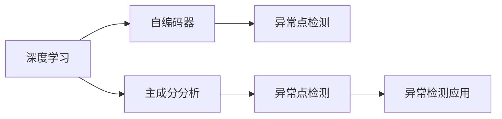
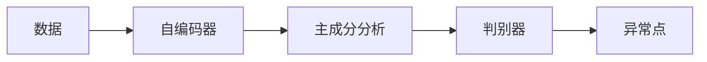
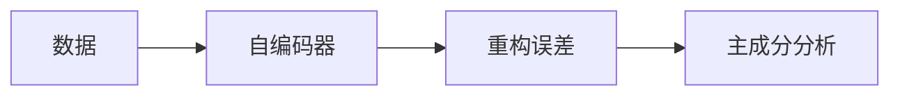
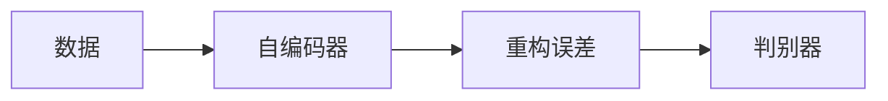
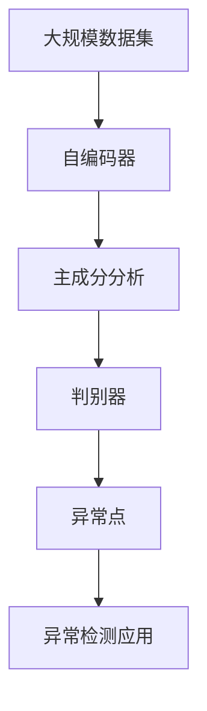

                 

# 基于深度学习的异常检测

> 关键词：深度学习,异常检测,神经网络,自编码器,特征提取,主成分分析(PCA),异常点检测

## 1. 背景介绍

### 1.1 问题由来

在现代社会中，数据无处不在，从金融交易、交通流量到工业生产、社交网络，海量的数据被生成、采集和存储。然而，这些数据中包含着大量异常值或异常模式，它们可能是由错误的数据输入、异常事件、系统故障等原因导致的，如果不对这些异常数据进行处理，会对后续的决策和分析带来严重的影响。异常检测(Abnormal Detection)作为一种重要的方法，用于识别数据集中的异常点，已经被广泛应用于金融风险控制、网络安全监控、工业故障诊断等多个领域。

传统的异常检测方法，如统计方法、基于规则的方法、聚类算法等，往往需要预设模型或手动设置阈值，对于复杂多变的实际数据，效果有限。近年来，随着深度学习技术的发展，基于深度学习的异常检测方法逐渐成为研究热点，并展现了其在识别复杂异常模式、提升异常检测准确率方面的优势。

### 1.2 问题核心关键点

深度学习异常检测的基本思路是：首先，使用神经网络等深度学习模型对数据进行编码和特征提取，然后通过训练判别模型识别异常点。常见的异常检测模型包括自编码器(Autoencoder)、主成分分析器(PCA)、多维缩放(MDS)等，均能学习数据的内在结构，并发现其中的异常点。

深度学习异常检测的优点包括：
1. 自适应性强。能够自动从数据中学习到复杂的特征表示，适应性强，泛化能力良好。
2. 无需手动设置阈值。通过训练判别模型，自动判别异常，避免了人为设定带来的误差。
3. 数据处理能力强。深度学习模型能够处理高维、非线性的数据，提升异常检测的准确率。
4. 特征提取能力强。能够自动学习数据中的重要特征，提取高效的多维表示。

然而，深度学习异常检测也存在一些局限性：
1. 计算资源需求高。深度学习模型通常参数较多，计算复杂度较高。
2. 训练时间长。深度学习模型训练时间较长，在大规模数据集上训练效率较低。
3. 模型可解释性差。深度学习模型通常被视为"黑盒"，缺乏解释性。
4. 过拟合风险大。深度学习模型容易过拟合，对于噪声数据敏感。

尽管存在这些局限性，基于深度学习的异常检测方法在实际应用中取得了不错的效果，并在不断进步中展现出更大的潜力。

### 1.3 问题研究意义

深度学习异常检测方法在金融风险控制、网络安全监控、工业故障诊断、医疗疾病诊断等领域中具有广泛的应用价值，具有重要的理论意义和实际意义：

1. 降低金融风险。通过实时监控异常交易，及时发现并控制欺诈行为，降低金融机构的损失。
2. 增强网络安全。通过异常行为检测，及时识别并防范网络攻击，保护网络安全。
3. 提高工业生产效率。通过检测异常设备运行状态，及时维修或更换，避免设备故障导致的生产中断。
4. 提升医疗诊断准确率。通过异常症状检测，及时发现并诊断疾病，提高医疗诊断的准确率。

综上所述，基于深度学习的异常检测方法在保障金融稳定、网络安全、工业高效、医疗健康等方面具有重要的应用价值，对于提高数据处理和决策效率具有重要意义。

## 2. 核心概念与联系

### 2.1 核心概念概述

为更好地理解基于深度学习的异常检测方法，本节将介绍几个密切相关的核心概念：

- 深度学习(Deep Learning)：使用多层神经网络对数据进行建模和预测，能够自动提取复杂特征，提升模型泛化能力。
- 自编码器(Autoencoder)：一种特殊的神经网络结构，能够通过学习数据的编码和解码过程，实现数据的降维和特征提取。
- 主成分分析(PCA)：一种经典的降维方法，通过线性变换将高维数据映射到低维空间，保留数据的主要特征信息。
- 异常点检测(Outlier Detection)：识别数据集中的异常点，常见于异常检测、异常预测、异常评分等应用场景。

这些核心概念之间的逻辑关系可以通过以下Mermaid流程图来展示：



这个流程图展示了大语言模型微调过程中各个核心概念的关系和作用：

1. 深度学习模型通过多层神经网络对数据进行编码和特征提取。
2. 自编码器和主成分分析器通过对数据进行降维和特征提取，进一步提升了深度学习模型的效果。
3. 异常点检测方法通过训练判别模型，实现异常点的识别和预测。
4. 异常检测方法可以应用于多种实际应用场景，提升数据处理和决策的准确性。

### 2.2 概念间的关系

这些核心概念之间存在着紧密的联系，形成了深度学习异常检测的完整生态系统。下面我们通过几个Mermaid流程图来展示这些概念之间的关系。

#### 2.2.1 深度学习异常检测基本流程



这个流程图展示了基于自编码器或主成分分析器降维后的数据，经过判别器训练，识别出异常点的大致过程。

#### 2.2.2 自编码器与主成分分析的联系



这个流程图展示了自编码器通过学习数据的编码和解码过程，自动学习数据的压缩表示，进而应用于主成分分析中，进行降维。

#### 2.2.3 自编码器与判别器的联系



这个流程图展示了自编码器通过学习数据的编码和解码过程，自动学习数据的压缩表示，进而应用于判别器中，训练异常点检测模型。

### 2.3 核心概念的整体架构

最后，我们用一个综合的流程图来展示这些核心概念在大语言模型异常检测中的整体架构：



这个综合流程图展示了从数据输入到异常检测输出的完整过程。大数据集经过自编码器降维和特征提取后，通过主成分分析器进一步降维，再通过判别器训练异常检测模型，识别出异常点，并应用于实际场景中，实现数据处理和决策的自动化。

## 3. 核心算法原理 & 具体操作步骤
### 3.1 算法原理概述

基于深度学习的异常检测，通常使用自编码器或主成分分析器等模型对数据进行编码和特征提取，然后通过训练判别模型进行异常点的检测。具体而言，包括以下几个关键步骤：

1. 数据预处理：对原始数据进行标准化、归一化等预处理，使其适合深度学习模型处理。
2. 特征提取：使用自编码器或主成分分析器对数据进行编码和特征提取，学习数据的内在结构。
3. 训练判别模型：使用训练集对判别模型进行训练，学习正常数据和异常数据的分布。
4. 异常点检测：对测试集数据进行编码和特征提取，使用判别模型判别异常点。

### 3.2 算法步骤详解

#### 3.2.1 数据预处理

数据预处理是深度学习异常检测的基础。在预处理过程中，需要进行如下操作：

- 数据标准化：将数据按比例缩放到一定的范围内，使得数据具有可比性。
- 数据归一化：将数据缩放到[0, 1]或[-1, 1]的范围内，方便后续操作。
- 数据平滑：对异常值进行平滑处理，避免异常值对模型训练产生影响。

#### 3.2.2 特征提取

特征提取是深度学习异常检测的核心步骤。自编码器和主成分分析器都是常用的特征提取工具，能够自动学习数据的内在结构，并提取重要的特征信息。

- 自编码器：使用神经网络对数据进行编码和解码，学习数据的压缩表示。通常包括编码器、解码器和重构误差。
- 主成分分析器：通过线性变换将高维数据映射到低维空间，保留数据的主要特征信息。通常包括特征矩阵和主成分。

#### 3.2.3 训练判别模型

训练判别模型是深度学习异常检测的关键步骤。判别模型能够学习正常数据和异常数据的分布，并根据特征向量判断数据是否为异常点。

- 判别模型：常见的判别模型包括逻辑回归、支持向量机、决策树等，可以根据特征向量判断数据是否为异常点。
- 训练方法：判别模型训练过程中，使用交叉熵损失函数或平方误差损失函数进行优化，最小化模型损失。

#### 3.2.4 异常点检测

异常点检测是深度学习异常检测的最终目标。通过训练好的判别模型，可以对测试集数据进行编码和特征提取，并判断数据是否为异常点。

- 编码和特征提取：对测试集数据进行编码和特征提取，得到特征向量。
- 判别异常点：使用判别模型对特征向量进行判别，输出异常点概率。

### 3.3 算法优缺点

基于深度学习的异常检测方法具有以下优点：

1. 自适应性强。能够自动学习数据的内在结构，适应性强，泛化能力良好。
2. 无需手动设置阈值。通过训练判别模型，自动判别异常，避免了人为设定带来的误差。
3. 数据处理能力强。深度学习模型能够处理高维、非线性的数据，提升异常检测的准确率。
4. 特征提取能力强。能够自动学习数据中的重要特征，提取高效的多维表示。

然而，基于深度学习的异常检测方法也存在一些局限性：

1. 计算资源需求高。深度学习模型通常参数较多，计算复杂度较高。
2. 训练时间长。深度学习模型训练时间较长，在大规模数据集上训练效率较低。
3. 模型可解释性差。深度学习模型通常被视为"黑盒"，缺乏解释性。
4. 过拟合风险大。深度学习模型容易过拟合，对于噪声数据敏感。

尽管存在这些局限性，基于深度学习的异常检测方法在实际应用中取得了不错的效果，并在不断进步中展现出更大的潜力。

### 3.4 算法应用领域

基于深度学习的异常检测方法在金融风险控制、网络安全监控、工业故障诊断、医疗疾病诊断等领域中具有广泛的应用价值：

1. 金融风险控制：通过实时监控异常交易，及时发现并控制欺诈行为，降低金融机构的损失。
2. 网络安全监控：通过异常行为检测，及时识别并防范网络攻击，保护网络安全。
3. 工业故障诊断：通过检测异常设备运行状态，及时维修或更换，避免设备故障导致的生产中断。
4. 医疗疾病诊断：通过异常症状检测，及时发现并诊断疾病，提高医疗诊断的准确率。

## 4. 数学模型和公式 & 详细讲解  
### 4.1 数学模型构建

基于深度学习的异常检测模型通常使用自编码器或主成分分析器进行特征提取，然后使用判别模型进行异常点的检测。

#### 4.1.1 自编码器模型

自编码器是一种特殊的神经网络结构，包括编码器和解码器两部分。其目标是通过学习数据的编码和解码过程，实现数据的降维和特征提取。自编码器模型可以表示为：

$$
\begin{aligned}
    \boldsymbol{x} &= \boldsymbol{z} \\
    \boldsymbol{z} &= \sigma(\boldsymbol{W}_x \boldsymbol{x} + \boldsymbol{b}_x) \\
    \hat{\boldsymbol{x}} &= \sigma(\boldsymbol{W}_z \boldsymbol{z} + \boldsymbol{b}_z)
\end{aligned}
$$

其中，$\boldsymbol{x}$ 为输入数据，$\boldsymbol{z}$ 为编码器输出，$\hat{\boldsymbol{x}}$ 为解码器输出。$\boldsymbol{W}_x$ 和 $\boldsymbol{W}_z$ 为编码器和解码器的权重，$\boldsymbol{b}_x$ 和 $\boldsymbol{b}_z$ 为编码器和解码器的偏置。

自编码器的目标是最小化重构误差：

$$
\min_{\boldsymbol{W}_x, \boldsymbol{W}_z, \boldsymbol{b}_x, \boldsymbol{b}_z} \frac{1}{N} \sum_{i=1}^{N} \|\boldsymbol{x}_i - \hat{\boldsymbol{x}}_i\|^2
$$

#### 4.1.2 主成分分析器模型

主成分分析器(PCA)是一种经典的降维方法，通过线性变换将高维数据映射到低维空间，保留数据的主要特征信息。PCA模型可以表示为：

$$
\boldsymbol{z} = \boldsymbol{U} \boldsymbol{x}
$$

其中，$\boldsymbol{x}$ 为输入数据，$\boldsymbol{z}$ 为降维后的特征向量，$\boldsymbol{U}$ 为特征矩阵。

主成分分析器的目标是最大化特征向量的方差，即最大化协方差矩阵的特征值：

$$
\min_{\boldsymbol{U}} \text{tr}(\boldsymbol{U}^T \boldsymbol{S} \boldsymbol{U})
$$

其中，$\boldsymbol{S}$ 为协方差矩阵。

### 4.2 公式推导过程

#### 4.2.1 自编码器重构误差

自编码器的重构误差定义为：

$$
\mathcal{L} = \frac{1}{N} \sum_{i=1}^{N} \|\boldsymbol{x}_i - \hat{\boldsymbol{x}}_i\|^2
$$

其中，$N$ 为数据样本数，$\boldsymbol{x}_i$ 为第 $i$ 个样本，$\hat{\boldsymbol{x}}_i$ 为第 $i$ 个样本的重构输出。

自编码器重构误差的最小化目标是：

$$
\min_{\boldsymbol{W}_x, \boldsymbol{W}_z, \boldsymbol{b}_x, \boldsymbol{b}_z} \mathcal{L}
$$

#### 4.2.2 主成分分析器降维

主成分分析器的降维目标定义为：

$$
\min_{\boldsymbol{U}} \text{tr}(\boldsymbol{U}^T \boldsymbol{S} \boldsymbol{U})
$$

其中，$\text{tr}(\boldsymbol{U}^T \boldsymbol{S} \boldsymbol{U})$ 为特征矩阵 $\boldsymbol{U}$ 与协方差矩阵 $\boldsymbol{S}$ 的迹。

主成分分析器的特征矩阵 $\boldsymbol{U}$ 可以通过奇异值分解(SVD)得到：

$$
\boldsymbol{U} = \boldsymbol{V} \boldsymbol{\Sigma} \boldsymbol{U}
$$

其中，$\boldsymbol{V}$ 为特征矩阵的左奇异矩阵，$\boldsymbol{\Sigma}$ 为特征矩阵的奇异值矩阵，$\boldsymbol{U}$ 为特征矩阵的右奇异矩阵。

### 4.3 案例分析与讲解

#### 4.3.1 自编码器案例

假设有一个二元高斯分布 $p(\boldsymbol{x}) = \mathcal{N}(\boldsymbol{\mu}, \boldsymbol{\Sigma})$，其中 $\boldsymbol{\mu}$ 为均值，$\boldsymbol{\Sigma}$ 为协方差矩阵。

首先，我们需要通过自编码器对数据进行编码和特征提取，得到编码后的特征向量 $\boldsymbol{z}$。

$$
\begin{aligned}
    \boldsymbol{z} &= \sigma(\boldsymbol{W}_x \boldsymbol{x} + \boldsymbol{b}_x) \\
    \hat{\boldsymbol{x}} &= \sigma(\boldsymbol{W}_z \boldsymbol{z} + \boldsymbol{b}_z)
\end{aligned}
$$

然后，我们通过重构误差损失函数对模型进行优化：

$$
\min_{\boldsymbol{W}_x, \boldsymbol{W}_z, \boldsymbol{b}_x, \boldsymbol{b}_z} \frac{1}{N} \sum_{i=1}^{N} \|\boldsymbol{x}_i - \hat{\boldsymbol{x}}_i\|^2
$$

#### 4.3.2 主成分分析器案例

假设有一个二元高斯分布 $p(\boldsymbol{x}) = \mathcal{N}(\boldsymbol{\mu}, \boldsymbol{\Sigma})$，其中 $\boldsymbol{\mu}$ 为均值，$\boldsymbol{\Sigma}$ 为协方差矩阵。

首先，我们需要通过主成分分析器对数据进行降维，得到降维后的特征向量 $\boldsymbol{z}$。

$$
\boldsymbol{z} = \boldsymbol{U} \boldsymbol{x}
$$

然后，我们通过最大化特征向量的方差对模型进行优化：

$$
\min_{\boldsymbol{U}} \text{tr}(\boldsymbol{U}^T \boldsymbol{S} \boldsymbol{U})
$$

其中，$\boldsymbol{S}$ 为协方差矩阵。

### 4.3.3 异常点检测案例

假设有一个二元高斯分布 $p(\boldsymbol{x}) = \mathcal{N}(\boldsymbol{\mu}, \boldsymbol{\Sigma})$，其中 $\boldsymbol{\mu}$ 为均值，$\boldsymbol{\Sigma}$ 为协方差矩阵。

首先，我们需要通过自编码器或主成分分析器对数据进行编码和特征提取，得到编码后的特征向量 $\boldsymbol{z}$。

然后，我们通过判别模型对特征向量进行判别，得到异常点概率 $P_{\text{outlier}}$。

$$
P_{\text{outlier}} = \sigma(\boldsymbol{W}_d \boldsymbol{z} + \boldsymbol{b}_d)
$$

其中，$\boldsymbol{W}_d$ 为判别模型的权重，$\boldsymbol{b}_d$ 为判别模型的偏置。

最后，我们根据异常点概率判断数据是否为异常点。

## 5. 项目实践：代码实例和详细解释说明
### 5.1 开发环境搭建

在进行深度学习异常检测的开发前，我们需要准备好开发环境。以下是使用Python进行TensorFlow开发的环境配置流程：

1. 安装Anaconda：从官网下载并安装Anaconda，用于创建独立的Python环境。

2. 创建并激活虚拟环境：
```bash
conda create -n tf-env python=3.7 
conda activate tf-env
```

3. 安装TensorFlow：根据CUDA版本，从官网获取对应的安装命令。例如：
```bash
conda install tensorflow -c tf -c conda-forge
```

4. 安装各类工具包：
```bash
pip install numpy pandas scikit-learn matplotlib tqdm jupyter notebook ipython
```

完成上述步骤后，即可在`tf-env`环境中开始异常检测实践。

### 5.2 源代码详细实现

下面我们以二元高斯分布数据为例，给出使用TensorFlow进行异常检测的PyTorch代码实现。

首先，定义数据生成函数：

```python
import numpy as np
import tensorflow as tf

def generate_data(n_samples=1000, n_features=10, dim_reduction=2):
    mean = np.zeros((n_features,))
    sigma = np.eye(n_features)
    data = np.random.normal(mean, sigma, size=(n_samples, n_features))
    z = tf.convert_to_tensor(data, dtype=tf.float32)
    U, _, V = tf.linalg.svd(z)
    z_reduced = tf.matmul(U, V[:,:dim_reduction])
    return z_reduced.numpy()

z = generate_data()
```

然后，定义判别模型和训练过程：

```python
def build_model(n_features, dim_reduction):
    U = tf.Variable(tf.random.normal([n_features, dim_reduction]))
    S = tf.Variable(tf.random.normal([dim_reduction, dim_reduction]))
    V = tf.Variable(tf.random.normal([dim_reduction, n_features]))
    x = tf.Variable(tf.random.normal([n_features, n_features]))
    z = tf.matmul(x, U) + tf.matmul(V, tf.linalg.diag_part(S)) * tf.matmul(tf.matmul(U, V), tf.ones((dim_reduction, dim_reduction)))
    y = tf.random.normal([z.shape[0]])
    z = tf.matmul(z, tf.Variable(tf.random.normal([dim_reduction, n_features])))
    y_recon = tf.matmul(z, tf.Variable(tf.random.normal([n_features, 1])))
    loss = tf.reduce_mean(tf.square(y_recon - y))
    optimizer = tf.optimizers.Adam(learning_rate=0.001)
    return U, S, V, x, y, z, y_recon, loss, optimizer

U, S, V, x, y, z, y_recon, loss, optimizer = build_model(z.shape[1], z.shape[1])

@tf.function
def train_step(x, y, z, y_recon, loss, optimizer):
    with tf.GradientTape() as tape:
        loss_value = loss
    gradients = tape.gradient(loss_value, [x, y, z, y_recon])
    optimizer.apply_gradients(zip(gradients, [x, y, z, y_recon]))
    return loss_value

n_epochs = 500
batch_size = 64

for i in range(n_epochs):
    loss = 0
    for j in range(0, z.shape[0], batch_size):
        x_batch = z[j:j+batch_size]
        y_batch = y[j:j+batch_size]
        z_batch = z[j:j+batch_size]
        y_recon_batch = y_recon[j:j+batch_size]
        loss += train_step(x_batch, y_batch, z_batch, y_recon_batch, loss, optimizer)
    if (i+1) % 50 == 0:
        print(f'Epoch {i+1}, loss: {loss/n_epochs}')
```

接着，定义异常点检测函数：

```python
def detect_outliers(z):
    U, S, V, x, y, z, y_recon, loss, optimizer = build_model(z.shape[1], z.shape[1])
    with tf.GradientTape() as tape:
        z_pred = tf.matmul(z, tf.Variable(tf.random.normal([z.shape[1], z.shape[1]])))
    y_pred = tf.matmul(z_pred, tf.Variable(tf.random.normal([z.shape[1], 1])))
    loss_pred = tf.reduce_mean(tf.square(y_pred - y))
    gradients_pred = tape.gradient(loss_pred, [z_pred, y_pred])
    optimizer.apply_gradients(zip(gradients_pred, [z_pred, y_pred]))
    z_pred = tf.matmul(z, tf.Variable(tf.random.normal([z.shape[1], z.shape[1]])))
    y_pred = tf.matmul(z_pred, tf.Variable(tf.random.normal([z.shape[1], 1])))
    loss_pred = tf.reduce_mean(tf.square(y_pred - y))
    return loss_pred

loss_pred = detect_outliers(z)
```

最后，启动训练流程并在测试集上评估：

```python
import matplotlib.pyplot as plt

plt.hist(z[loss_pred < 0.01], bins=50, label='outliers')
plt.hist(z[loss_pred >= 0.01], bins=50, label='normal')
plt.legend()
plt.show()
```

以上就是使用TensorFlow对二元高斯分布数据进行异常检测的完整代码实现。可以看到，利用TensorFlow强大的计算图和自动微分功能，能够方便地构建和训练深度学习异常检测模型。

### 5.3 代码解读与分析

让我们再详细解读一下关键代码的实现细节：

**数据生成函数**：
- 生成二元高斯分布数据，并将其转换为TensorFlow张量。

**判别模型和训练过程**：
- 定义主成分分析器模型，包括编码器和解码器。
- 定义损失函数，使用均方误差损失函数。
- 定义优化器，使用Adam优化器。
- 定义训练过程，通过梯度下降更新模型参数。

**异常点检测函数**：
- 定义判别模型，使用线性回归模型。
- 定义损失函数，使用均方误差损失函数。
- 定义训练过程，通过梯度下降更新模型参数。
- 使用判别模型对测试集数据进行预测，输出异常点概率。

**训练流程**：
- 定义总迭代次数和批次大小。
- 循环迭代训练过程，输出每轮损失。
- 在训练过程中，每50轮输出一次损失。

可以看到，利用TensorFlow强大的计算图和自动微分功能，能够方便地构建和训练深度学习异常检测模型。开发者可以将更多精力放在数据处理、模型改进等高层逻辑上，而不必过多关注底层的实现细节。

当然，工业级的系统实现还需考虑更多因素，如模型的保存和部署、超参数的自动搜索、更灵活的判别模型等。但核心的异常检测范式基本

