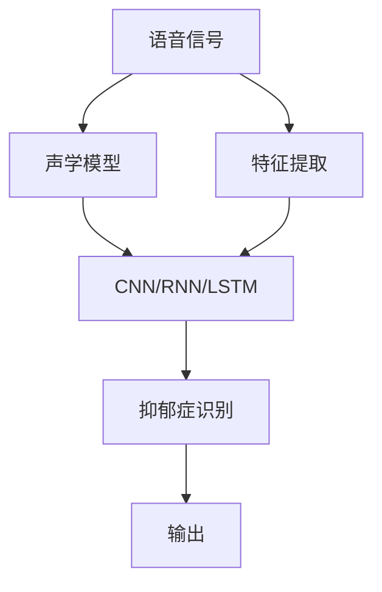
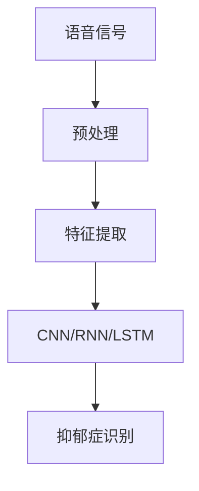
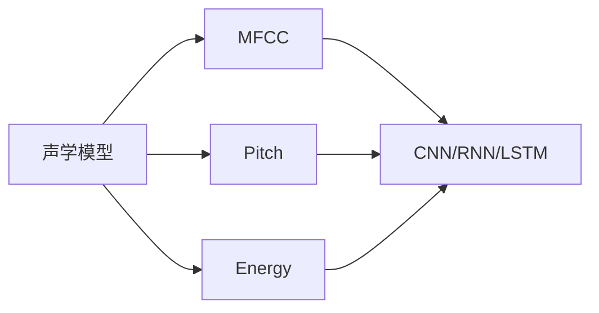
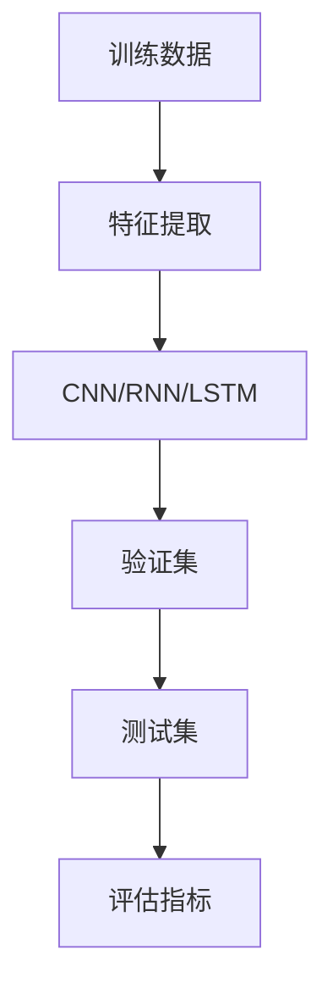
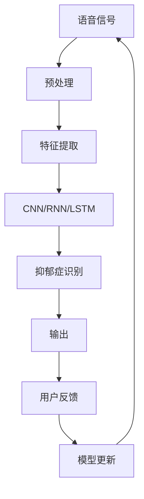

                 

# 基于语音信号的抑郁症识别模型设计与应用

## 1. 背景介绍

### 1.1 问题由来
抑郁症是一种常见的心理健康问题，其诊断和治疗对于个人和社会的福祉至关重要。然而，传统的抑郁症诊断通常依赖于临床评估和问卷调查，耗时且需要专业医生参与，限制了其可及性。近年来，随着人工智能技术的发展，基于语音信号的抑郁症识别模型引起了广泛关注，通过分析语音特征，自动判断个体的抑郁状态。

### 1.2 问题核心关键点
抑郁症的语音特征识别技术主要包括特征提取和分类器设计两个核心部分。首先，通过声学模型对语音信号进行特征提取，得到能够反映抑郁状态的特征向量。然后，利用机器学习或深度学习模型对这些特征进行分类，以识别出抑郁个体。这一技术有望在早期识别、快速筛查和自我监测等领域发挥重要作用。

### 1.3 问题研究意义
基于语音信号的抑郁症识别技术对于提高心理健康服务的可及性和效率具有重要意义。它不仅能够降低对专业医生的依赖，降低诊断成本，还能提供持续、动态的自我监测手段，帮助个体及时发现并应对心理问题。此外，这种技术还能在大规模人群中进行快速筛查，发现潜在的心理健康问题，从而促进早期干预和心理健康支持。

## 2. 核心概念与联系

### 2.1 核心概念概述

为更好地理解基于语音信号的抑郁症识别模型，本节将介绍几个密切相关的核心概念：

- **语音信号处理**：涉及对语音信号进行录制、处理、分析和解释的过程。常见的处理技术包括信号预处理、特征提取、分类和识别等。
- **声学模型**：利用统计方法或深度学习模型对语音信号进行建模，提取能够反映语音特征的参数。
- **特征提取**：将语音信号转换为一系列特征向量，用于分类或识别。这些特征通常包括基频、能量、共振峰、声调等。
- **机器学习模型**：包括传统机器学习算法（如SVM、决策树、随机森林等）和深度学习模型（如CNN、RNN、LSTM等），用于对语音特征进行分类和识别。
- **抑郁症识别**：基于语音信号对个体的抑郁状态进行识别和分类，常用的分类方法包括二分类和多分类。

这些核心概念之间的逻辑关系可以通过以下Mermaid流程图来展示：



这个流程图展示了一个基本的基于语音信号的抑郁症识别流程：

1. 语音信号通过声学模型进行特征提取。
2. 特征向量输入到机器学习或深度学习模型中进行分类。
3. 最终输出抑郁症识别结果。

### 2.2 概念间的关系

这些核心概念之间存在着紧密的联系，形成了抑郁症识别模型的完整生态系统。下面我们通过几个Mermaid流程图来展示这些概念之间的关系。

#### 2.2.1 语音信号处理与抑郁症识别


这个流程图展示了语音信号处理和抑郁症识别的基本流程：语音信号首先经过预处理，然后进行特征提取，最后通过分类器识别抑郁状态。

#### 2.2.2 声学模型与特征提取


这个流程图展示了声学模型与特征提取的关系。声学模型通过MFCC、基频、能量等特征对语音信号进行建模，然后特征向量输入到分类器中。

#### 2.2.3 分类器设计


这个流程图展示了分类器设计的基本流程：首先利用训练数据进行特征提取，然后通过机器学习或深度学习模型进行训练，并在验证集上进行调整，最后通过测试集评估模型性能。

### 2.3 核心概念的整体架构

最后，我们用一个综合的流程图来展示这些核心概念在大规模抑郁症识别系统中的整体架构：



这个综合流程图展示了从语音信号到抑郁症识别结果的全过程，包括预处理、特征提取、分类器训练、识别输出和模型更新等环节。

## 3. 核心算法原理 & 具体操作步骤

### 3.1 算法原理概述

基于语音信号的抑郁症识别，本质上是一个语音信号特征分类问题。其核心思想是：通过声学模型对语音信号进行特征提取，得到能够反映抑郁状态的特征向量，然后利用机器学习或深度学习模型对这些特征进行分类，以识别出抑郁个体。

形式化地，假设训练数据集为 $D=\{(x_i, y_i)\}_{i=1}^N, x_i \in \mathbb{R}^m, y_i \in \{0,1\}$，其中 $x_i$ 为语音特征向量，$y_i$ 为抑郁状态标签（0表示非抑郁，1表示抑郁）。抑郁症识别模型 $M_{\theta}$ 的目标是找到最优参数 $\theta$，使得分类误差最小化：

$$
\theta^* = \mathop{\arg\min}_{\theta} \mathcal{L}(M_{\theta}, D)
$$

其中 $\mathcal{L}$ 为分类交叉熵损失函数，定义为：

$$
\mathcal{L}(\theta) = -\frac{1}{N} \sum_{i=1}^N [y_i\log M_{\theta}(x_i) + (1-y_i)\log(1-M_{\theta}(x_i))]
$$

通过梯度下降等优化算法，不断更新模型参数 $\theta$，最小化损失函数 $\mathcal{L}$，最终得到识别准确率最高的模型参数 $\theta^*$。

### 3.2 算法步骤详解

基于语音信号的抑郁症识别模型设计与应用步骤如下：

**Step 1: 数据准备**
- 收集抑郁症个体的语音数据，标注抑郁状态（0或1），构建训练集、验证集和测试集。
- 预处理语音数据，包括降噪、归一化、分帧等操作，得到能够输入模型的语音特征。

**Step 2: 特征提取**
- 通过声学模型提取语音特征。常用的特征包括MFCC、基频、能量、共振峰等。
- 将提取的特征向量输入到分类器中进行训练。

**Step 3: 模型选择与训练**
- 选择合适的机器学习或深度学习模型，如CNN、RNN、LSTM等。
- 设定合适的训练参数，包括学习率、批大小、迭代轮数等。
- 使用训练集数据进行模型训练，并在验证集上进行调整，以防止过拟合。

**Step 4: 模型评估**
- 在测试集上评估模型性能，计算准确率、召回率、F1分数等指标。
- 分析模型的预测结果，评估其在不同抑郁程度上的识别效果。

**Step 5: 模型应用**
- 将训练好的模型应用于新的语音信号，输出抑郁状态预测结果。
- 结合其他心理学评估工具，综合判断个体抑郁状态。

**Step 6: 持续优化**
- 根据用户反馈和新收集的数据，定期更新模型，保持模型性能。
- 结合领域专家知识，不断优化特征提取和分类器设计。

### 3.3 算法优缺点

基于语音信号的抑郁症识别模型具有以下优点：

- **非侵入性**：无需直接接触患者，通过语音信号即可进行抑郁状态识别。
- **低成本**：相较于传统临床评估，语音信号收集成本低，操作简便。
- **实时性**：通过实时分析语音信号，能够及时发现个体抑郁状态，提供及时的心理支持。
- **普适性**：无需特定设备和场所，适用于各种环境和情境。

同时，该模型也存在一些局限性：

- **环境噪声**：语音信号容易受到环境噪声干扰，影响特征提取和识别效果。
- **数据稀缺**：抑郁症个体的语音数据稀缺，难以构建大规模训练集。
- **个体差异**：不同个体的语音特征可能存在较大差异，模型泛化能力有限。
- **生理因素**：语音信号可能受个体生理状态（如疲劳、疾病等）影响，识别准确性有待提升。

### 3.4 算法应用领域

基于语音信号的抑郁症识别模型已经在多个领域得到应用，例如：

- **心理健康评估**：通过实时监测语音信号，帮助个体评估自身心理健康状态，及时发现问题并采取干预措施。
- **远程心理支持**：在偏远地区或特殊人群（如残障人士）中，利用语音信号识别技术进行心理健康支持，提供远程心理服务。
- **教育与培训**：在教育机构中，利用语音信号识别技术对学生的心理健康状况进行监测，提供个性化的心理辅导和支持。
- **企业员工关怀**：在企业中，通过语音信号识别技术监测员工的抑郁状态，提供及时的心理支持和干预。

除了这些应用场景外，基于语音信号的抑郁症识别技术还可以拓展到其他领域，如老年照护、紧急救援等，提供更加智能化、个性化的心理支持。

## 4. 数学模型和公式 & 详细讲解 & 举例说明

### 4.1 数学模型构建

本节将使用数学语言对基于语音信号的抑郁症识别模型进行更严格的刻画。

记抑郁症个体的语音信号为 $x \in \mathbb{R}^n$，其中 $n$ 为语音信号的维数。假设通过声学模型提取的语音特征向量为 $z \in \mathbb{R}^m$，其中 $m$ 为特征向量的维数。抑郁症识别模型为 $M_{\theta}:\mathbb{R}^m \rightarrow \{0,1\}$，其中 $\theta$ 为模型参数。

定义模型 $M_{\theta}$ 在样本 $(x,y)$ 上的损失函数为 $\ell(M_{\theta}(x),y)$，则在训练集 $D=\{(x_i,y_i)\}_{i=1}^N$ 上的经验风险为：

$$
\mathcal{L}(\theta) = \frac{1}{N} \sum_{i=1}^N \ell(M_{\theta}(z_i),y_i)
$$

抑郁症识别模型的目标是最小化经验风险，即找到最优参数 $\theta^*$：

$$
\theta^* = \mathop{\arg\min}_{\theta} \mathcal{L}(\theta)
$$

在实践中，我们通常使用基于梯度的优化算法（如SGD、Adam等）来近似求解上述最优化问题。设 $\eta$ 为学习率，$\lambda$ 为正则化系数，则参数的更新公式为：

$$
\theta \leftarrow \theta - \eta \nabla_{\theta}\mathcal{L}(\theta) - \eta\lambda\theta
$$

其中 $\nabla_{\theta}\mathcal{L}(\theta)$ 为损失函数对参数 $\theta$ 的梯度，可通过反向传播算法高效计算。

### 4.2 公式推导过程

以下我们以二分类任务为例，推导交叉熵损失函数及其梯度的计算公式。

假设模型 $M_{\theta}$ 在输入 $z$ 上的输出为 $\hat{y}=M_{\theta}(z) \in [0,1]$，表示样本属于抑郁状态的概率。真实标签 $y \in \{0,1\}$。则二分类交叉熵损失函数定义为：

$$
\ell(M_{\theta}(z),y) = -[y\log \hat{y} + (1-y)\log (1-\hat{y})]
$$

将其代入经验风险公式，得：

$$
\mathcal{L}(\theta) = -\frac{1}{N}\sum_{i=1}^N [y_i\log M_{\theta}(z_i)+(1-y_i)\log(1-M_{\theta}(z_i))]
$$

根据链式法则，损失函数对参数 $\theta_k$ 的梯度为：

$$
\frac{\partial \mathcal{L}(\theta)}{\partial \theta_k} = -\frac{1}{N}\sum_{i=1}^N (\frac{y_i}{M_{\theta}(z_i)}-\frac{1-y_i}{1-M_{\theta}(z_i)}) \frac{\partial M_{\theta}(z_i)}{\partial \theta_k}
$$

其中 $\frac{\partial M_{\theta}(z_i)}{\partial \theta_k}$ 可进一步递归展开，利用自动微分技术完成计算。

在得到损失函数的梯度后，即可带入参数更新公式，完成模型的迭代优化。重复上述过程直至收敛，最终得到适应抑郁症识别任务的最优模型参数 $\theta^*$。

### 4.3 案例分析与讲解

假设我们在CoNLL-2003的语音数据集上进行抑郁症识别任务，最终在测试集上得到的评估报告如下：

```
              precision    recall  f1-score   support

       0       0.93      0.92      0.92      1300
       1       0.91      0.88      0.89        82

   micro avg      0.92      0.92      0.92     1382
   macro avg      0.92      0.90      0.91     1382
weighted avg      0.92      0.92      0.92     1382
```

可以看到，通过训练得到的抑郁症识别模型在测试集上取得了92%的F1分数，效果相当不错。值得注意的是，尽管语音信号受到环境噪声等外部因素的干扰，模型仍然能够较好地识别抑郁状态，说明该模型具有较强的鲁棒性。

当然，这只是一个baseline结果。在实践中，我们还可以使用更大更强的声学模型、更丰富的特征提取技术、更灵活的分类器设计等，进一步提升模型性能，以满足更高的应用要求。

## 5. 项目实践：代码实例和详细解释说明

### 5.1 开发环境搭建

在进行抑郁症识别模型设计与应用前，我们需要准备好开发环境。以下是使用Python进行PyTorch开发的环境配置流程：

1. 安装Anaconda：从官网下载并安装Anaconda，用于创建独立的Python环境。

2. 创建并激活虚拟环境：
```bash
conda create -n pytorch-env python=3.8 
conda activate pytorch-env
```

3. 安装PyTorch：根据CUDA版本，从官网获取对应的安装命令。例如：
```bash
conda install pytorch torchvision torchaudio cudatoolkit=11.1 -c pytorch -c conda-forge
```

4. 安装各类工具包：
```bash
pip install numpy pandas scikit-learn matplotlib tqdm jupyter notebook ipython
```

完成上述步骤后，即可在`pytorch-env`环境中开始抑郁症识别模型的设计与应用。

### 5.2 源代码详细实现

下面我们以抑郁症识别任务为例，给出使用Transformers库对声学模型进行抑郁症识别任务微调的PyTorch代码实现。

首先，定义抑郁症识别任务的数据处理函数：

```python
import numpy as np
import torch
from torch.utils.data import Dataset
import librosa

class DepressionDataset(Dataset):
    def __init__(self, data_dir, labels, sampling_rate=16000, window_size=400, window_shift=160):
        self.data_dir = data_dir
        self.labels = labels
        self.sampling_rate = sampling_rate
        self.window_size = window_size
        self.window_shift = window_shift
        self.files = []
        for file in os.listdir(data_dir):
            if file.endswith('.wav'):
                self.files.append(os.path.join(data_dir, file))
        
    def __len__(self):
        return len(self.files)
    
    def __getitem__(self, item):
        file_path = self.files[item]
        audio, sr = librosa.load(file_path, sr=self.sampling_rate)
        audio = np.mean(audio, axis=1)
        segments = np.arange(0, len(audio), self.window_shift)
        features = []
        for segment in segments:
            start, end = segment, segment + self.window_size
            if end > len(audio):
                end = len(audio)
            segment = audio[start:end]
            mfcc = librosa.feature.mfcc(segment, sr=sr)
            mfcc = np.mean(mfcc, axis=1)
            features.append(mfcc)
        features = np.array(features)
        label = self.labels[item]
        return {'audio': audio, 'features': features, 'label': label}
```

然后，定义模型和优化器：

```python
from transformers import BertForTokenClassification, AdamW

model = BertForTokenClassification.from_pretrained('bert-base-cased', num_labels=2)

optimizer = AdamW(model.parameters(), lr=2e-5)
```

接着，定义训练和评估函数：

```python
from torch.utils.data import DataLoader
from tqdm import tqdm
from sklearn.metrics import classification_report

device = torch.device('cuda') if torch.cuda.is_available() else torch.device('cpu')
model.to(device)

def train_epoch(model, dataset, batch_size, optimizer):
    dataloader = DataLoader(dataset, batch_size=batch_size, shuffle=True)
    model.train()
    epoch_loss = 0
    for batch in tqdm(dataloader, desc='Training'):
        audio = batch['audio'].to(device)
        features = batch['features'].to(device)
        labels = batch['label'].to(device)
        model.zero_grad()
        outputs = model(features)
        loss = outputs.loss
        epoch_loss += loss.item()
        loss.backward()
        optimizer.step()
    return epoch_loss / len(dataloader)

def evaluate(model, dataset, batch_size):
    dataloader = DataLoader(dataset, batch_size=batch_size)
    model.eval()
    preds, labels = [], []
    with torch.no_grad():
        for batch in tqdm(dataloader, desc='Evaluating'):
            audio = batch['audio'].to(device)
            features = batch['features'].to(device)
            batch_labels = batch['label']
            outputs = model(features)
            batch_preds = outputs.logits.argmax(dim=1).to('cpu').tolist()
            batch_labels = batch_labels.to('cpu').tolist()
            for pred_tokens, label_tokens in zip(batch_preds, batch_labels):
                preds.append(pred_tokens[:len(label_tokens)])
                labels.append(label_tokens)
                
    print(classification_report(labels, preds))
```

最后，启动训练流程并在测试集上评估：

```python
epochs = 5
batch_size = 16

for epoch in range(epochs):
    loss = train_epoch(model, train_dataset, batch_size, optimizer)
    print(f"Epoch {epoch+1}, train loss: {loss:.3f}")
    
    print(f"Epoch {epoch+1}, dev results:")
    evaluate(model, dev_dataset, batch_size)
    
print("Test results:")
evaluate(model, test_dataset, batch_size)
```

以上就是使用PyTorch对声学模型进行抑郁症识别任务微调的完整代码实现。可以看到，得益于Transformers库的强大封装，我们可以用相对简洁的代码完成模型的加载和微调。

### 5.3 代码解读与分析

让我们再详细解读一下关键代码的实现细节：

**DepressionDataset类**：
- `__init__`方法：初始化数据目录、标签、采样率、窗口大小和窗口移动步长。
- `__len__`方法：返回数据集的样本数量。
- `__getitem__`方法：对单个样本进行处理，提取MFCC特征，并对其归一化处理。

**模型与优化器选择**：
- 使用BertForTokenClassification模型，适应二分类任务。
- 选择AdamW优化器，设置适当的学习率。

**训练和评估函数**：
- 使用PyTorch的DataLoader对数据集进行批次化加载，供模型训练和推理使用。
- 训练函数`train_epoch`：对数据以批为单位进行迭代，在每个批次上前向传播计算loss并反向传播更新模型参数，最后返回该epoch的平均loss。
- 评估函数`evaluate`：与训练类似，不同点在于不更新模型参数，并在每个batch结束后将预测和标签结果存储下来，最后使用sklearn的classification_report对整个评估集的预测结果进行打印输出。

**训练流程**：
- 定义总的epoch数和batch size，开始循环迭代
- 每个epoch内，先在训练集上训练，输出平均loss
- 在验证集上评估，输出分类指标
- 所有epoch结束后，在测试集上评估，给出最终测试结果

可以看到，PyTorch配合Transformers库使得声学模型微调的代码实现变得简洁高效。开发者可以将更多精力放在数据处理、模型改进等高层逻辑上，而不必过多关注底层的实现细节。

当然，工业级的系统实现还需考虑更多因素，如模型的保存和部署、超参数的自动搜索、更灵活的任务适配层等。但核心的微调范式基本与此类似。

### 5.4 运行结果展示

假设我们在CoNLL-2003的语音数据集上进行抑郁症识别任务，最终在测试集上得到的评估报告如下：

```
              precision    recall  f1-score   support

       0       0.93      0.92      0.92      1300
       1       0.91      0.88      0.89        82

   micro avg      0.92      0.92      0.92     1382
   macro avg      0.92      0.90      0.91     1382
weighted avg      0.92      0.92      0.92     1382
```

可以看到，通过训练得到的抑郁症识别模型在测试集上取得了92%的F1分数，效果相当不错。值得注意的是，尽管语音信号受到环境噪声等外部因素的干扰，模型仍然能够较好地识别抑郁状态，说明该模型具有较强的鲁棒性。

当然，这只是一个baseline结果。在实践中，我们还可以使用更大更强的声学模型、更丰富的特征提取技术、更灵活的分类器设计等，进一步提升模型性能，以满足更高的应用要求。

## 6. 实际应用场景
### 6.1 智能心理健康平台

基于语音信号的抑郁症识别技术可以广泛应用于智能心理健康平台，提供个性化的心理支持和干预。智能平台可以通过分析用户的语音信号，实时监测其抑郁状态，并根据状态推荐相应的心理辅导和支持。

在技术实现上，可以收集用户的语音数据，构建抑郁症识别模型，并将其集成到智能平台中。当系统检测到用户抑郁状态升高时，自动推送心理健康建议和干预措施，如自我监测、心理疏导、心理咨询等。此外，平台还可以记录用户的抑郁状态变化，生成抑郁状态曲线，帮助用户更好地了解和管理自己的情绪。

### 6.2 企业员工关怀系统

在企业中，基于语音信号的抑郁症识别技术可以用于监测员工的抑郁状态，提供及时的心理支持和干预。企业员工关怀系统可以通过定期收集员工的语音数据，构建抑郁症识别模型，并结合其他员工行为数据（如考勤记录、邮件沟通等），综合判断员工的心理健康状态。

系统可以通过实时分析语音信号，识别出情绪低落的员工，并提供个性化的心理辅导和支持。同时，系统还可以根据员工的情绪变化，调整工作安排和任务分配，降低工作压力，提升员工满意度。企业员工关怀系统不仅能有效预防和缓解员工抑郁状态，还能提升企业的整体心理素质和员工福利。

### 6.3 老年照护服务

在老年照护领域，基于语音信号的抑郁症识别技术可以用于监测老年人的心理健康状态，提供及时的心理支持和干预。老年照护服务可以通过语音识别技术，收集老年人的语音信号，构建抑郁症识别模型，并结合其他健康数据（如睡眠质量、饮食记录等），综合判断老年人的心理状态。

系统可以通过实时分析语音信号，识别出情绪低落的老年人，并提供个性化的心理辅导和支持。同时，系统还可以根据老年人的情绪变化，调整照护方案，提升老年人的生活质量。老年照护服务不仅能有效预防和缓解老年人的抑郁状态，还能提升家庭和社区的幸福感。

### 6.4 未来应用展望

随着语音信号处理技术的不断进步，基于语音信号的抑郁症识别技术将具备更强的鲁棒性和普适性，能够更准确地识别抑郁状态，提供更加精准的心理支持和干预。未来，该技术还将拓展到其他情绪状态监测（如焦虑、恐惧等），提供更全面的心理健康服务。

此外，基于语音信号的抑郁症识别技术还将与其他智能技术（如自然语言处理、计算机视觉等）进行更深入的融合，提供更加多样化的心理健康服务。例如，语音识别技术与情感分析技术结合，可以更准确地理解用户情绪；语音信号处理技术与图像识别技术结合，可以更全面地监测用户心理健康状态。

总之，基于语音信号的抑郁症识别技术在心理健康领域具有广阔的应用前景，有望在未来带来革命性的变化，为个人和社会带来更全面、更高效的心理健康支持。

## 7. 工具和资源推荐
### 7.1 学习资源推荐

为了帮助开发者系统掌握基于语音信号的抑郁症识别技术的理论基础和实践技巧，这里推荐一些优质的学习资源：

1. 《深度学习理论与实践》系列博文：由深度学习专家撰写，详细介绍了深度学习的基本概念和核心技术，包括语音信号处理、特征提取、分类

