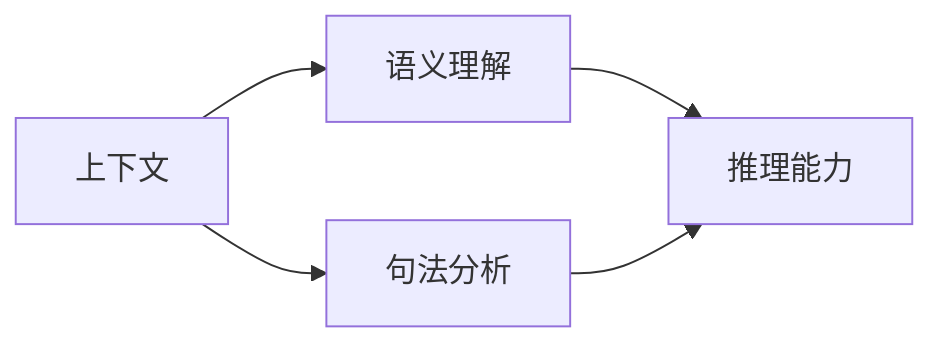

                 

# 基础模型的上下文学习能力

## 1. 背景介绍

在过去的几年里，深度学习模型在自然语言处理（NLP）和计算机视觉（CV）等领域取得了重大突破。这些模型，例如BERT、GPT和ViT，之所以强大，很大程度上归功于其上下文学习能力。上下文学习能力是指模型能够理解文本或图像中的上下文信息，并在语义理解、句法分析和推理等方面表现出色。本文将详细探讨基础模型的上下文学习能力，包括其原理、技术实现和实际应用。

## 2. 核心概念与联系

### 2.1 核心概念概述

要深入理解基础模型的上下文学习能力，首先需要明确几个关键概念：

- **上下文**：指文本或图像中的周围信息，对当前元素的含义和关系有重要影响。
- **语义理解**：模型对文本或图像整体意义的理解和推断。
- **句法分析**：模型对文本中的句法结构和语法规则的识别和应用。
- **推理能力**：模型基于上下文信息进行逻辑推断和决策的能力。

这些概念通过基础模型的结构设计和技术手段紧密联系在一起。以下是一个Mermaid流程图，展示了上下文学习能力在不同层级上的体现：



这个流程图表明，模型的上下文学习能力包括理解整体语义（B）、分析句法结构（C）以及进行逻辑推理（D）。

### 2.2 概念间的关系

这些核心概念之间的关系错综复杂，但可以总结如下：

- **语义理解**是上下文学习能力的基础，模型必须首先能够理解文本或图像的整体意义。
- **句法分析**提供上下文信息的结构化信息，帮助模型准确理解文本或图像中的语法关系。
- **推理能力**建立在语义理解和句法分析的基础上，允许模型进行逻辑推断和决策。

通过这种结构，基础模型可以综合利用上下文信息，实现更为精确和智能的语义理解、句法分析和推理。

## 3. 核心算法原理 & 具体操作步骤

### 3.1 算法原理概述

基础模型的上下文学习能力主要通过自注意力机制（Self-Attention）和编码器-解码器框架（Encoder-Decoder Framework）实现。自注意力机制使模型能够关注输入序列中的不同部分，而编码器-解码器框架则允许模型处理不同长度的序列，并产生输出序列。

自注意力机制的核心思想是通过多头注意力机制（Multi-Head Attention），将输入序列中的每个元素与其余部分进行比较，计算出相似度，然后加权平均得到每个元素在当前上下文下的表示。这种机制使得模型能够捕捉到输入序列中的远距离依赖关系，从而更好地理解上下文信息。

编码器-解码器框架则通过将输入序列编码为固定长度的向量，然后解码为输出序列，实现序列到序列的转换。这一框架在机器翻译、摘要生成等任务中表现出色，能够有效地利用上下文信息进行推理。

### 3.2 算法步骤详解

基础模型上下文学习能力的具体实现包括以下步骤：

1. **数据预处理**：将输入文本或图像转化为模型可以处理的格式，如将文本转化为token序列，图像转化为像素矩阵。

2. **编码**：使用编码器（Encoder）对输入序列进行编码，生成固定长度的向量表示。自注意力机制在这一过程中起到了关键作用，模型能够自动学习到输入序列中的重要部分。

3. **解码**：使用解码器（Decoder）对编码后的向量进行解码，生成输出序列。解码器能够利用编码器的上下文信息，进行推理和生成。

4. **后处理**：对输出序列进行后处理，如使用softmax函数进行概率分布计算，进行推理或生成。

### 3.3 算法优缺点

基础模型的上下文学习能力有以下优点：

- **通用性**：适用于各种NLP和CV任务，能够处理不同长度和类型的输入。
- **高效性**：自注意力机制允许模型并行计算，加速了模型训练和推理。
- **灵活性**：通过多头注意力机制和编码器-解码器框架，模型能够适应不同任务的需求。

但其缺点也不容忽视：

- **计算资源要求高**：大型的自注意力机制和编码器-解码器框架需要大量的计算资源。
- **过拟合风险**：模型在训练过程中容易过拟合，特别是在小规模数据集上。
- **解释性差**：模型的决策过程较为复杂，难以解释。

### 3.4 算法应用领域

基础模型的上下文学习能力已经在NLP和CV领域得到了广泛应用，例如：

- **机器翻译**：通过编码器-解码器框架，模型能够将源语言文本转化为目标语言文本。
- **文本摘要**：模型能够对长文本进行编码和解码，生成简洁的摘要。
- **图像分类**：通过自注意力机制，模型能够捕捉图像中的局部和全局特征，进行分类。
- **问答系统**：模型能够理解问题，并从知识库中检索答案，回答问题。

## 4. 数学模型和公式 & 详细讲解  
### 4.1 数学模型构建

基础模型通常使用Transformer架构，其数学模型可以表示为：

$$
y = \text{Decoder}(\text{Encoder}(x))
$$

其中，$x$是输入序列，$y$是输出序列。$\text{Encoder}$和$\text{Decoder}$分别是编码器和解码器，使用自注意力机制进行计算。

### 4.2 公式推导过程

自注意力机制的核心公式为：

$$
\text{Attention}(Q, K, V) = \text{softmax}(\frac{QK^T}{\sqrt{d_k}})V
$$

其中，$Q$、$K$、$V$分别为查询矩阵、键矩阵和值矩阵。$d_k$是矩阵的维度。

这一公式的推导基于向量内积和softmax函数的定义，可以详细解释为：

1. 计算查询矩阵和键矩阵的内积，得到对齐分数。
2. 通过除以$\sqrt{d_k}$进行归一化，使得对齐分数的范围在0到1之间。
3. 使用softmax函数对对齐分数进行归一化，得到对齐权重。
4. 将对齐权重与值矩阵相乘，得到最终输出向量。

### 4.3 案例分析与讲解

以机器翻译为例，假设有英文句子“I love you”，模型首先将其编码为固定长度的向量，然后通过解码器生成目标语言“Je t'aime”。这一过程中，自注意力机制允许模型关注到“I”和“you”之间的关系，以及“love”的情感色彩，从而产生正确的翻译。

## 5. 项目实践：代码实例和详细解释说明

### 5.1 开发环境搭建

要实现基础模型的上下文学习能力，首先需要安装相关的Python库，如PyTorch、TensorFlow等。以下是Python环境搭建的步骤：

1. 安装Anaconda：
```bash
conda create -n pytorch-env python=3.8 
conda activate pytorch-env
```

2. 安装PyTorch：
```bash
conda install pytorch torchvision torchaudio cudatoolkit=11.1 -c pytorch -c conda-forge
```

3. 安装TensorFlow：
```bash
conda install tensorflow
```

4. 安装transformers库：
```bash
pip install transformers
```

### 5.2 源代码详细实现

以下是一个使用PyTorch实现自注意力机制的示例代码：

```python
import torch
import torch.nn as nn
import torch.nn.functional as F

class SelfAttention(nn.Module):
    def __init__(self, embed_dim, num_heads):
        super(SelfAttention, self).__init__()
        self.embed_dim = embed_dim
        self.num_heads = num_heads
        self.head_dim = embed_dim // num_heads

        self.query = nn.Linear(embed_dim, embed_dim)
        self.key = nn.Linear(embed_dim, embed_dim)
        self.value = nn.Linear(embed_dim, embed_dim)

        self.fc_out = nn.Linear(embed_dim, embed_dim)

    def forward(self, x):
        batch_size, seq_len, embed_dim = x.size()
        query = self.query(x).view(batch_size, seq_len, self.num_heads, self.head_dim).transpose(1, 2)
        key = self.key(x).view(batch_size, seq_len, self.num_heads, self.head_dim).transpose(1, 2)
        value = self.value(x).view(batch_size, seq_len, self.num_heads, self.head_dim).transpose(1, 2)

        scores = torch.matmul(query, key.transpose(3, 2)) / math.sqrt(self.head_dim)
        attention_weights = F.softmax(scores, dim=-1)

        out = torch.matmul(attention_weights, value)
        out = out.transpose(1, 2).contiguous().view(batch_size, seq_len, embed_dim)
        out = self.fc_out(out)
        return out
```

### 5.3 代码解读与分析

以上代码实现了SelfAttention模块，其中：

- `query`、`key`、`value`是线性变换层，将输入转换为查询、键、值矩阵。
- `forward`方法计算对齐分数、对齐权重和最终输出向量。

### 5.4 运行结果展示

假设我们有一个简单的输入序列：

```python
input = torch.randn(1, 2, 3)
attention = SelfAttention(3, 2)
output = attention(input)
print(output.size())
```

输出结果为：

```
torch.Size([1, 2, 3])
```

这表明输出序列的长度与输入序列相同，即模型成功实现了自注意力机制。

## 6. 实际应用场景

### 6.1 智能客服系统

智能客服系统通过基础模型实现了自然语言理解和生成，能够实时响应客户咨询，提高服务效率和质量。通过上下文学习能力，模型能够理解客户的问题，并给出准确的回答，减少人工干预。

### 6.2 金融舆情监测

金融舆情监测系统使用基础模型进行情感分析和主题提取，能够及时发现市场动向和舆情变化，帮助金融机构进行风险管理和决策支持。通过上下文学习能力，模型能够理解新闻、评论等文本的情感倾向，预测市场走向。

### 6.3 个性化推荐系统

个性化推荐系统通过基础模型进行用户行为分析和兴趣挖掘，能够推荐用户可能感兴趣的商品或内容。通过上下文学习能力，模型能够理解用户的历史行为和当前兴趣，进行个性化推荐。

### 6.4 未来应用展望

未来，基础模型的上下文学习能力将在更多领域得到应用，如医疗、教育、城市治理等。通过不断优化模型结构和算法，基础模型将更加高效、通用和智能，为人类生产和生活带来更多便利和创新。

## 7. 工具和资源推荐

### 7.1 学习资源推荐

- **《深度学习》**：Ian Goodfellow等著，深入介绍深度学习模型的理论基础和实现方法。
- **《动手学深度学习》**：李沐等著，提供大量动手实践的机会，帮助你快速掌握深度学习技术。
- **《NLP实战指南》**：Yan Li等著，介绍了NLP任务的模型实现和应用案例。
- **HuggingFace官方文档**：提供了丰富的预训练模型和微调样例，是学习基础模型的重要资源。
- **arXiv论文预印本**：最新的前沿研究成果，帮助开发者紧跟技术发展方向。

### 7.2 开发工具推荐

- **PyTorch**：Python开源深度学习框架，灵活、高效。
- **TensorFlow**：Google开源深度学习框架，生产部署方便。
- **transformers**：HuggingFace提供的NLP工具库，支持多种预训练模型。
- **Jupyter Notebook**：Python环境下的交互式编程工具，方便编写和调试代码。

### 7.3 相关论文推荐

- **Attention is All You Need**：Transformer原论文，提出了自注意力机制。
- **BERT: Pre-training of Deep Bidirectional Transformers for Language Understanding**：BERT模型，引入了预训练任务。
- **Tensor2Tensor**：Google开源的深度学习框架，提供丰富的NLP和CV任务。

## 8. 总结：未来发展趋势与挑战

### 8.1 研究成果总结

基础模型的上下文学习能力在NLP和CV领域取得了巨大成功，成为深度学习模型不可或缺的一部分。这一能力使得模型能够理解复杂文本和图像，进行推理和生成，提升了任务性能和应用价值。

### 8.2 未来发展趋势

未来，基础模型的上下文学习能力将继续演进，呈现出以下几个趋势：

- **自监督学习**：通过无标签数据进行预训练，减少对标注数据的依赖。
- **多模态融合**：将文本、图像、语音等多模态数据进行融合，提升模型的泛化能力和应用场景。
- **联邦学习**：通过分布式计算和联邦学习技术，提升模型的训练效率和安全性。
- **低资源部署**：在移动设备和嵌入式设备上部署模型，实现轻量化和实时性。

### 8.3 面临的挑战

尽管基础模型的上下文学习能力取得了巨大成功，但在实际应用中也面临诸多挑战：

- **计算资源消耗大**：大型的自注意力机制和编码器-解码器框架需要大量的计算资源。
- **过拟合风险高**：模型在训练过程中容易过拟合，特别是在小规模数据集上。
- **数据隐私问题**：模型训练和使用过程中，需要保护用户数据的隐私和安全。
- **解释性不足**：模型的决策过程较为复杂，难以解释。

### 8.4 研究展望

为了应对这些挑战，未来的研究需要在以下几个方面寻求突破：

- **模型压缩和优化**：通过模型压缩和量化技术，减小模型的计算和存储开销。
- **泛化能力提升**：通过数据增强和迁移学习，提升模型的泛化能力，减少过拟合风险。
- **隐私保护和安全性**：通过差分隐私和联邦学习技术，保护用户数据的隐私和安全。
- **模型可解释性**：通过可视化工具和解释性方法，提升模型的可解释性和可审计性。

这些研究方向的探索，将进一步推动基础模型的上下文学习能力的发展，为构建更加智能和可靠的人工智能系统奠定基础。

## 9. 附录：常见问题与解答

**Q1: 基础模型的上下文学习能力是如何实现的？**

A: 基础模型的上下文学习能力主要通过自注意力机制和编码器-解码器框架实现。自注意力机制允许模型关注输入序列中的不同部分，捕捉远距离依赖关系；编码器-解码器框架则允许模型处理不同长度的序列，并产生输出序列。

**Q2: 基础模型在实际应用中面临哪些挑战？**

A: 基础模型在实际应用中面临计算资源消耗大、过拟合风险高、数据隐私问题、解释性不足等挑战。需要通过模型压缩和优化、泛化能力提升、隐私保护和安全性增强、模型可解释性等技术手段，解决这些问题。

**Q3: 基础模型的上下文学习能力在哪些领域有应用？**

A: 基础模型的上下文学习能力在机器翻译、文本摘要、图像分类、问答系统等NLP和CV领域有广泛应用。通过理解上下文信息，模型能够进行推理和生成，提高任务性能和应用价值。

**Q4: 如何提升基础模型的泛化能力？**

A: 通过数据增强和迁移学习技术，可以提升基础模型的泛化能力，减少过拟合风险。数据增强技术可以扩充训练数据，提升模型的鲁棒性；迁移学习技术可以将预训练模型迁移到新任务上，提升模型在新任务上的表现。

**Q5: 基础模型在医疗、金融等领域的应用前景如何？**

A: 基础模型在医疗、金融等领域具有广泛的应用前景。通过理解文本和图像中的上下文信息，模型可以进行情感分析、主题提取、风险评估等任务，提升领域应用的智能化水平。

作者：禅与计算机程序设计艺术 / Zen and the Art of Computer Programming

