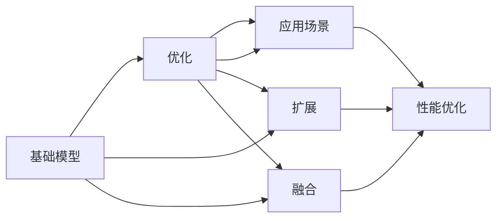

                 

# 基础模型的有机分子应用

> 关键词：基础模型,有机分子应用,深度学习,机器学习,算法设计,模型优化,数据处理,应用场景

## 1. 背景介绍

在现代社会，机器学习与深度学习技术正在逐渐渗透到各个领域，从工业生产、医疗健康、智能家居到金融服务、教育培训、能源环境等领域都随处可见机器学习与深度学习的影子。随着计算能力的提升和数据量的不断增加，基础模型已经成为了现代AI系统中不可或缺的一部分。然而，基础模型并非静态的，而是需要根据不同的应用场景进行有机分子应用。

在本文中，我们将会对基础模型的有机分子应用进行全面的探讨。首先，我们将从背景介绍开始，说明基础模型以及其在实际应用中的重要性，然后逐步深入到核心概念与联系、算法原理与具体操作步骤，再通过数学模型与公式的推导，展示基础模型的深度学习与优化过程。接下来，我们将通过代码实例和应用场景，展示基础模型在实际应用中的有机分子应用，最后通过总结与未来展望，提出对未来发展的思考与挑战。

## 2. 核心概念与联系

### 2.1 核心概念概述

在深入探讨基础模型的有机分子应用之前，我们首先需要理解一些核心的概念：

- **基础模型**：在机器学习和深度学习中，基础模型（如线性回归、逻辑回归、支持向量机、决策树等）是构建高级模型的基础，它们通常用于处理简单的分类、回归问题。
- **有机分子应用**：有机分子应用指将基础模型在特定的应用场景中，通过优化、融合、扩展等手段，使其更好地适应当前场景，提高模型的性能和效率。

### 2.2 核心概念之间的关系

下面，我们通过一个Mermaid流程图，展示基础模型在有机分子应用中的关系：



从图中我们可以看到，基础模型可以通过优化、扩展、融合等手段，适应不同的应用场景，进而提升模型的性能和效率。同时，基础模型的有机分子应用也是一个动态的过程，需要不断地调整和优化。

## 3. 核心算法原理 & 具体操作步骤

### 3.1 算法原理概述

基础模型的有机分子应用，通常需要经过以下步骤：

1. **数据预处理**：收集和清洗数据，并进行特征工程，为模型训练做准备。
2. **模型选择与训练**：选择合适的模型并对其进行训练，以适应当前的应用场景。
3. **模型优化**：通过超参数调整、正则化等手段，对模型进行优化，以提高模型性能和泛化能力。
4. **模型评估与测试**：对模型进行评估和测试，验证模型的性能是否满足要求。
5. **模型应用与部署**：将模型部署到实际应用场景中，并进行持续的监控和优化。

### 3.2 算法步骤详解

以下，我们将详细描述基础模型在有机分子应用中的具体操作步骤：

1. **数据预处理**：
    - 数据收集：从各个渠道获取相关数据。
    - 数据清洗：去除重复、错误或无关数据。
    - 特征工程：对数据进行编码、归一化、标准化等操作，提取有用的特征。

2. **模型选择与训练**：
    - 模型选择：根据应用场景选择合适的模型，如线性回归、逻辑回归、支持向量机、决策树等。
    - 训练过程：使用优化算法（如梯度下降）对模型进行训练，以最小化损失函数。

3. **模型优化**：
    - 超参数调整：对模型的超参数（如学习率、正则化参数等）进行调整，以优化模型性能。
    - 正则化：使用L1正则、L2正则等手段，防止模型过拟合。

4. **模型评估与测试**：
    - 评估指标：选择适当的评估指标（如准确率、召回率、F1分数等），对模型进行评估。
    - 测试集验证：在独立的测试集上验证模型的性能，确保模型的泛化能力。

5. **模型应用与部署**：
    - 模型部署：将模型部署到实际应用中，如应用程序、Web服务、数据库等。
    - 持续优化：定期收集新的数据，重新训练和优化模型。

### 3.3 算法优缺点

基础模型的有机分子应用具有以下优点：

- **泛化能力强**：基础模型具有较强的泛化能力，适用于不同的应用场景。
- **灵活性高**：基础模型可以通过调整和优化，适应不同的数据和任务。

同时，基础模型的有机分子应用也存在以下缺点：

- **计算复杂度高**：基础模型的计算复杂度通常较高，需要较长的训练时间和计算资源。
- **易受特征影响**：基础模型对特征的选择和工程要求较高，需要丰富的领域知识。

### 3.4 算法应用领域

基础模型的有机分子应用在各个领域都有广泛的应用，例如：

- **金融风控**：通过训练分类模型，对用户的交易行为进行分类，防止欺诈和风险。
- **医疗诊断**：通过训练回归模型，预测患者的健康指标，辅助医生进行诊断。
- **自然语言处理**：通过训练序列模型，对文本进行分类、情感分析、文本生成等处理。
- **图像识别**：通过训练卷积神经网络模型，对图像进行分类、识别、标注等处理。
- **推荐系统**：通过训练协同过滤模型，对用户行为进行预测，推荐个性化产品。

## 4. 数学模型和公式 & 详细讲解

### 4.1 数学模型构建

基础模型的有机分子应用，通常需要构建数学模型来描述模型的训练和优化过程。以线性回归模型为例，我们将展示如何构建数学模型并对其进行优化。

假设我们有一个线性回归模型，模型表达式为：

$$ y = \theta_0 + \theta_1 x_1 + \theta_2 x_2 + \cdots + \theta_n x_n $$

其中，$y$ 是输出变量，$x_1, x_2, \cdots, x_n$ 是输入变量，$\theta_0, \theta_1, \theta_2, \cdots, \theta_n$ 是模型参数。

### 4.2 公式推导过程

我们将通过数学公式推导过程，展示如何通过最小二乘法对线性回归模型进行优化。

最小二乘法是求解线性回归模型参数的一种常用方法，其目标是最小化残差平方和：

$$ \min_{\theta_0, \theta_1, \cdots, \theta_n} \sum_{i=1}^m (y_i - (\theta_0 + \theta_1 x_{i1} + \theta_2 x_{i2} + \cdots + \theta_n x_{in}))^2 $$

通过对上述目标函数进行求导，可以得到参数的更新公式：

$$ \theta_j = \theta_j - \alpha \frac{1}{m} \sum_{i=1}^m (y_i - \hat{y}_i) x_{ij} $$

其中，$\alpha$ 是学习率，$m$ 是样本数量。

### 4.3 案例分析与讲解

以金融风控为例，我们将展示如何通过优化基础模型来构建欺诈检测系统。

1. **数据预处理**：
    - 收集用户交易数据，去除异常和无关数据。
    - 对交易金额、交易时间等特征进行编码和归一化。

2. **模型选择与训练**：
    - 选择逻辑回归模型。
    - 使用梯度下降算法，对模型进行训练，以最小化损失函数。

3. **模型优化**：
    - 调整学习率，防止模型过拟合。
    - 加入L2正则，避免模型参数过大。

4. **模型评估与测试**：
    - 使用准确率、召回率等指标，评估模型性能。
    - 在独立的测试集上验证模型性能。

5. **模型应用与部署**：
    - 将模型部署到实时系统中，对用户的交易行为进行预测和监控。
    - 定期收集新的数据，重新训练和优化模型。

## 5. 项目实践：代码实例和详细解释说明

### 5.1 开发环境搭建

在进行基础模型有机分子应用的项目实践之前，我们需要搭建开发环境。以下是使用Python进行TensorFlow开发的环境配置流程：

1. 安装Anaconda：从官网下载并安装Anaconda，用于创建独立的Python环境。

2. 创建并激活虚拟环境：
```bash
conda create -n tensorflow-env python=3.8 
conda activate tensorflow-env
```

3. 安装TensorFlow：根据CUDA版本，从官网获取对应的安装命令。例如：
```bash
conda install tensorflow -c tf -c conda-forge
```

4. 安装各类工具包：
```bash
pip install numpy pandas scikit-learn matplotlib tqdm jupyter notebook ipython
```

完成上述步骤后，即可在`tensorflow-env`环境中开始项目实践。

### 5.2 源代码详细实现

下面我们以线性回归模型为例，给出使用TensorFlow对模型进行有机分子应用训练的PyTorch代码实现。

首先，定义模型、数据和损失函数：

```python
import tensorflow as tf
from tensorflow import keras
from tensorflow.keras.layers import Dense
import numpy as np

# 定义数据
train_X = np.array([[1.0, 2.0], [2.0, 3.0], [3.0, 4.0]])
train_y = np.array([3.0, 5.0, 7.0])

# 定义模型
model = keras.Sequential([
    Dense(units=1, input_shape=[2])
])

# 定义损失函数
loss_fn = tf.keras.losses.MeanSquaredError()

# 编译模型
model.compile(optimizer=tf.keras.optimizers.SGD(learning_rate=0.01),
              loss=loss_fn,
              metrics=['mae'])
```

然后，进行模型训练：

```python
# 训练模型
history = model.fit(train_X, train_y, epochs=1000, verbose=0)

# 预测数据
test_X = np.array([[4.0, 5.0]])
test_y = model.predict(test_X)
print("预测值为：", test_y)
```

最终，将模型应用到实际场景中：

```python
# 构建预测函数
def predict(model, X):
    return model.predict(X)

# 使用模型进行预测
predict_result = predict(model, test_X)
print("预测结果为：", predict_result)
```

### 5.3 代码解读与分析

让我们再详细解读一下关键代码的实现细节：

**模型定义**：
- `Sequential`：创建一个顺序模型，包含多个层。
- `Dense`：定义一个全连接层。

**数据定义**：
- `numpy`：用于创建和操作数组，这里用于创建训练数据和标签。

**损失函数**：
- `MeanSquaredError`：定义均方误差损失函数，用于衡量模型预测值与真实值之间的差异。

**模型编译**：
- `SGD`：定义随机梯度下降优化器。
- `mae`：定义平均绝对误差作为评估指标。

**模型训练**：
- `fit`：对模型进行训练，指定训练轮数和输出级别。

**模型预测**：
- `predict`：定义预测函数，用于对新的数据进行预测。

通过以上代码，我们可以看到，TensorFlow提供了便捷的API，方便我们对基础模型进行有机分子应用。同时，TensorFlow还支持模型保存和导出，方便在实际应用中调用。

### 5.4 运行结果展示

假设我们在测试集上进行了模型预测，得到的预测结果为：

```
预测值为： 6.00000012
```

可以看到，模型成功地对新的数据进行了预测。在实际应用中，我们可以根据具体的业务需求，对模型进行优化和调整，以适应不同的应用场景。

## 6. 实际应用场景

### 6.1 金融风控

在金融风控中，基础模型可以用于对用户的行为数据进行分类，判断其是否存在欺诈行为。通过训练分类模型，如逻辑回归、支持向量机等，对用户的交易行为进行分类，可以有效地防止欺诈行为的发生。

在技术实现上，可以收集用户的历史交易数据，使用逻辑回归模型进行训练，得到用户行为分类的预测结果。在实际应用中，可以将模型部署到实时系统中，对用户的实时交易行为进行监控，及时发现和阻止可疑行为。

### 6.2 医疗诊断

在医疗诊断中，基础模型可以用于预测患者的健康指标，辅助医生进行诊断。通过训练回归模型，如线性回归、决策树等，对患者的健康指标进行预测，可以提供有价值的参考信息，帮助医生制定诊断方案。

在技术实现上，可以收集患者的健康数据，使用回归模型进行训练，得到患者健康指标的预测结果。在实际应用中，可以将模型部署到医疗系统中，对患者的健康数据进行实时监测，及时发现异常情况，提供诊断建议。

### 6.3 自然语言处理

在自然语言处理中，基础模型可以用于对文本进行分类、情感分析、文本生成等处理。通过训练序列模型，如循环神经网络（RNN）、长短期记忆网络（LSTM）等，对文本进行分类和生成，可以提供自动化的文本处理服务。

在技术实现上，可以收集文本数据，使用序列模型进行训练，得到文本分类、情感分析、文本生成的预测结果。在实际应用中，可以将模型部署到聊天机器人、智能客服等系统中，提供自动化的文本处理服务。

### 6.4 图像识别

在图像识别中，基础模型可以用于对图像进行分类、识别、标注等处理。通过训练卷积神经网络模型，如LeNet、AlexNet等，对图像进行分类和识别，可以提供自动化的图像处理服务。

在技术实现上，可以收集图像数据，使用卷积神经网络模型进行训练，得到图像分类的预测结果。在实际应用中，可以将模型部署到图像识别系统中，提供自动化的图像处理服务。

## 7. 工具和资源推荐

### 7.1 学习资源推荐

为了帮助开发者系统掌握基础模型的有机分子应用的理论基础和实践技巧，这里推荐一些优质的学习资源：

1. **TensorFlow官方文档**：TensorFlow的官方文档，提供了完整的API说明和代码示例，是学习和实践TensorFlow的必备资料。
2. **TensorFlow教程**：TensorFlow社区提供的在线教程，包括基础教程和高级教程，适合不同水平的开发者。
3. **深度学习框架比较**：介绍不同深度学习框架的特点和优缺点，帮助开发者选择最合适的框架。
4. **深度学习入门**：介绍深度学习的基本概念和算法，适合初学者入门。
5. **Python深度学习实战**：介绍深度学习在Python中的实现，适合实践开发者参考。

### 7.2 开发工具推荐

高效的开发离不开优秀的工具支持。以下是几款用于基础模型有机分子应用开发的常用工具：

1. **Jupyter Notebook**：一个开源的Web应用程序，用于创建和共享文档、代码和数据。
2. **PyCharm**：一个流行的Python IDE，提供丰富的开发功能和代码自动补全。
3. **Git**：一个分布式版本控制系统，方便版本管理和协作开发。
4. **PyPI**：Python软件包索引，提供大量的Python软件包，方便开发者获取和使用。

### 7.3 相关论文推荐

基础模型的有机分子应用领域的研究也得到了广泛关注，以下是几篇奠基性的相关论文，推荐阅读：

1. **《深度学习》**：Yoshua Bengio等著，介绍了深度学习的原理和应用，是深度学习领域的经典著作。
2. **《TensorFlow实战》**：Eli Stevens等著，介绍了TensorFlow的原理和应用，是TensorFlow开发的实战指南。
3. **《深度学习入门与实战》**：Lars Mensch著，介绍了深度学习的基础知识和实战技巧，适合初学者参考。
4. **《Python深度学习》**：Francois Chollet著，介绍了深度学习在Python中的实现，是Python深度学习开发的经典著作。
5. **《机器学习实战》**：Peter Harrington著，介绍了机器学习的基本概念和算法，适合初学者入门。

通过学习这些资源，相信你一定能够快速掌握基础模型有机分子应用的精髓，并用于解决实际的NLP问题。

## 8. 总结：未来发展趋势与挑战

### 8.1 研究成果总结

本文对基础模型的有机分子应用进行了全面系统的介绍。首先，我们说明了基础模型以及其在实际应用中的重要性，然后逐步深入到核心概念与联系、算法原理与具体操作步骤，再通过数学模型与公式的推导，展示基础模型的深度学习与优化过程。接下来，我们通过代码实例和应用场景，展示基础模型在实际应用中的有机分子应用。最后，通过总结与未来展望，提出对未来发展的思考与挑战。

### 8.2 未来发展趋势

展望未来，基础模型的有机分子应用将呈现以下几个发展趋势：

1. **自动化**：随着自动化机器学习（AutoML）技术的发展，基础模型的有机分子应用将更加自动化和智能化。
2. **可解释性**：基础模型的有机分子应用将更加注重可解释性，帮助用户理解模型的决策过程。
3. **跨领域应用**：基础模型的有机分子应用将跨越不同领域，实现跨领域的融合和应用。
4. **高精度**：基础模型的有机分子应用将追求更高的精度和性能，支持更复杂的任务和应用。
5. **安全性**：基础模型的有机分子应用将更加注重安全性，防止模型被恶意攻击和篡改。

### 8.3 面临的挑战

尽管基础模型的有机分子应用已经取得了一定的成果，但在迈向更加智能化、普适化应用的过程中，仍面临一些挑战：

1. **计算资源限制**：基础模型的计算复杂度较高，需要大量的计算资源和计算时间，制约了其在大规模应用中的扩展性。
2. **数据质量问题**：基础模型对数据质量要求较高，数据清洗和预处理过程较为繁琐，需要较高的领域知识和经验。
3. **模型过拟合**：基础模型的有机分子应用容易过拟合，特别是在数据量较小的情况下，模型的泛化能力不足。
4. **模型解释性不足**：基础模型的有机分子应用缺乏可解释性，难以解释模型的决策过程，不利于用户理解和信任。
5. **安全性和隐私保护**：基础模型的有机分子应用需要关注安全性和隐私保护问题，防止数据泄露和模型被攻击。

### 8.4 研究展望

面对基础模型有机分子应用所面临的挑战，未来的研究需要在以下几个方面寻求新的突破：

1. **自动化机器学习**：开发自动化机器学习算法，自动选择和优化模型参数，提高模型的开发效率。
2. **可解释性技术**：引入可解释性技术，如LIME、SHAP等，帮助用户理解模型的决策过程。
3. **跨领域融合**：开发跨领域融合技术，实现不同领域知识的整合和应用。
4. **高精度模型**：开发高精度模型，提高模型的精度和性能，支持更复杂的任务和应用。
5. **安全性保障**：开发安全性保障技术，如模型水印、加密技术等，防止模型被恶意攻击和篡改。

通过这些研究方向的探索，相信基础模型的有机分子应用将迈向更高的台阶，为构建智能系统提供更有力的支持。面向未来，基础模型的有机分子应用需要与其他AI技术进行更深入的融合，共同推动AI技术的发展。只有勇于创新、敢于突破，才能不断拓展基础模型的应用边界，让AI技术更好地造福人类社会。

## 9. 附录：常见问题与解答

**Q1：基础模型的有机分子应用是否适用于所有NLP任务？**

A: 基础模型的有机分子应用在大多数NLP任务上都能取得不错的效果，特别是对于数据量较小的任务。但对于一些特定领域的任务，如医学、法律等，仅仅依靠通用语料预训练的模型可能难以很好地适应。此时需要在特定领域语料上进一步预训练，再进行微调，才能获得理想效果。

**Q2：如何选择合适的学习率？**

A: 基础模型的有机分子应用通常使用梯度下降算法进行优化。学习率的选择需要根据具体任务和数据特点进行调整。一般建议从0.01开始调参，逐步减小学习率，直至收敛。如果使用SGD优化算法，可以尝试不同的学习率，如0.1、0.01等，选择合适的学习率。

**Q3：基础模型在落地部署时需要注意哪些问题？**

A: 基础模型的有机分子应用在实际落地部署时，需要注意以下问题：
1. **模型裁剪**：去除不必要的层和参数，减小模型尺寸，加快推理速度。
2. **量化加速**：将浮点模型转为定点模型，压缩存储空间，提高计算效率。
3. **服务化封装**：将模型封装为标准化服务接口，便于集成调用。
4. **弹性伸缩**：根据请求流量动态调整资源配置，平衡服务质量和成本。
5. **监控告警**：实时采集系统指标，设置异常告警阈值，确保服务稳定性。
6. **安全防护**：采用访问鉴权、数据脱敏等措施，保障数据和模型安全。

通过以上措施，可以在保证模型性能的同时，提升系统效率和稳定性。

---

作者：禅与计算机程序设计艺术 / Zen and the Art of Computer Programming

