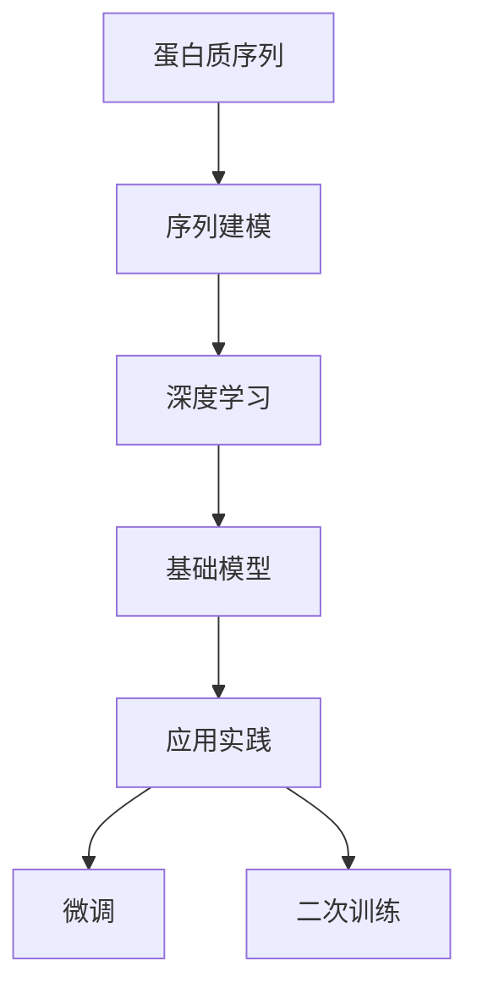

                 

# 基础模型的蛋白质序列应用

> 关键词：蛋白质序列，序列建模，深度学习，基础模型，应用实践，基因工程

## 1. 背景介绍

### 1.1 问题由来
蛋白质是生命活动的主要执行者，对其序列的分析与应用在基因工程、药物研发、生物学研究等多个领域具有重要意义。近年来，随着深度学习技术的发展，基于深度神经网络对蛋白质序列进行建模与应用成为了一种热门研究方法。然而，蛋白质序列本身的高维性、非线性结构等特点，使得基于深度学习的建模与分析面临着诸多挑战。

## 2. 核心概念与联系

### 2.1 核心概念概述

为了更好地理解蛋白质序列的应用，首先介绍几个核心概念：

- **蛋白质序列**：描述蛋白质分子中氨基酸的排列顺序，是蛋白质功能与结构的基础。
- **序列建模**：利用数学与统计方法，对蛋白质序列进行建模与预测。
- **深度学习**：一种模拟人脑神经网络结构的机器学习方法，能够处理复杂、高维的非线性数据。
- **基础模型**：在深度学习中，通过预训练或无监督学习得到的初始模型，在特定任务上进行微调或二次训练。
- **应用实践**：在实际应用中，将基础模型与特定任务结合，进行模型训练与性能优化。

这些概念之间存在着紧密的联系，形成一个有机整体。蛋白质序列作为深度学习建模的对象，其特征可以通过基础模型进行提取与分析；而应用实践则是在特定任务上，通过微调或二次训练，使基础模型具备高效、准确的应用能力。

### 2.2 概念间的关系

这些核心概念之间的关系可以通过以下Mermaid流程图来展示：



这个流程图展示了从蛋白质序列到基础模型，再到应用实践的全过程。蛋白质序列通过序列建模，转化为深度学习模型能够处理的形式；通过基础模型的预训练，获得初始化的表示；最终在特定任务上，通过微调或二次训练，得到最终的应用模型。

## 3. 核心算法原理 & 具体操作步骤
### 3.1 算法原理概述

基于深度学习的基础模型在蛋白质序列应用中，主要分为预训练和微调两个步骤：

1. **预训练**：利用大规模蛋白质序列数据进行无监督学习，提取通用的序列特征。
2. **微调**：在特定任务数据上，通过有监督学习，调整模型参数，使其能够适应具体任务的要求。

### 3.2 算法步骤详解

以下是基于深度学习的基础模型在蛋白质序列应用中的具体操作步骤：

**Step 1: 数据预处理**
- 收集蛋白质序列数据，包括基因序列、蛋白质序列、蛋白质结构等。
- 对数据进行清洗与标注，去除噪音与异常值。
- 对蛋白质序列进行分词，构建输入向量。

**Step 2: 基础模型预训练**
- 选择适当的深度学习框架，如TensorFlow、PyTorch等。
- 设计合适的网络结构，如卷积神经网络(CNN)、循环神经网络(RNN)、变换器(Transformer)等。
- 在预训练数据上进行无监督学习，如自编码、生成对抗网络(GAN)等。

**Step 3: 任务适配层设计**
- 根据具体任务，设计任务适配层，如分类器、回归器、生成器等。
- 选择适当的损失函数，如交叉熵、均方误差等。

**Step 4: 模型微调**
- 将预训练模型作为初始化参数，在特定任务数据上进行有监督学习。
- 设置适当的学习率与优化器，如Adam、SGD等。
- 通过前向传播计算损失函数，反向传播更新模型参数。
- 周期性在验证集上评估模型性能，决定是否继续训练。

**Step 5: 模型评估与部署**
- 在测试集上评估模型性能，对比预训练与微调后的效果。
- 将训练好的模型部署到实际应用中，进行推理预测。
- 持续收集新数据，定期重新微调模型。

### 3.3 算法优缺点

基于深度学习的基础模型在蛋白质序列应用中具有以下优点：

1. **高灵活性**：通过调整网络结构与损失函数，适应不同的蛋白质序列分析任务。
2. **高效性**：利用预训练模型的高效特征提取能力，显著减少任务训练时间。
3. **泛化能力强**：通过预训练，提取通用的序列特征，具备较强的泛化能力。

同时，该方法也存在一些局限性：

1. **数据需求高**：需要大量的蛋白质序列数据进行预训练，数据获取成本较高。
2. **模型复杂**：深度学习模型的参数较多，对硬件资源要求较高。
3. **过拟合风险**：预训练模型在特定任务上的微调，存在过拟合的风险。

### 3.4 算法应用领域

基于深度学习的基础模型在蛋白质序列应用中，已经涵盖了以下多个领域：

- **蛋白质结构预测**：通过序列建模，预测蛋白质的三维结构。
- **蛋白质分类与功能预测**：利用分类器对蛋白质进行功能分类，预测其生物学特性。
- **基因表达与调控分析**：通过回归模型，分析基因表达与蛋白质表达之间的关系。
- **药物研发**：利用生成模型，设计新的蛋白质序列，用于药物分子设计。
- **蛋白质-蛋白质相互作用**：通过分类器或生成模型，预测蛋白质之间的相互作用关系。

此外，蛋白质序列的应用还在生物信息学、生物统计学、蛋白质组学等多个领域中得到了广泛应用。

## 4. 数学模型和公式 & 详细讲解  
### 4.1 数学模型构建

假设我们有一组蛋白质序列数据，记为 $\{X_i\}_{i=1}^N$，其中 $X_i$ 表示第 $i$ 个蛋白质的氨基酸序列。我们的目标是对这些蛋白质序列进行分类或回归。

令 $f_\theta(X)$ 表示深度学习模型，其中 $\theta$ 为模型的可学习参数。我们的目标是找到最优参数 $\theta^*$，使得模型在数据集上的损失函数最小化。

数学上，我们可以定义如下损失函数：

$$
\mathcal{L}(\theta) = \frac{1}{N}\sum_{i=1}^N \ell(f_\theta(X_i), y_i)
$$

其中 $\ell$ 为特定任务（如分类、回归）的损失函数，$y_i$ 为第 $i$ 个蛋白质的标签。

### 4.2 公式推导过程

以蛋白质分类任务为例，假设模型 $f_\theta(X)$ 输出一个 $K$ 维的向量，表示蛋白质属于 $K$ 个类别的概率分布。我们定义交叉熵损失函数如下：

$$
\ell(f_\theta(X_i), y_i) = -\sum_{k=1}^K y_{ik} \log f_{\theta,k}(X_i)
$$

其中 $f_{\theta,k}(X_i)$ 表示模型输出向量中第 $k$ 个元素的概率，$y_{ik}$ 表示蛋白质 $i$ 属于第 $k$ 个类别的真实标签。

因此，总的损失函数为：

$$
\mathcal{L}(\theta) = -\frac{1}{N}\sum_{i=1}^N \sum_{k=1}^K y_{ik} \log f_{\theta,k}(X_i)
$$

通过反向传播算法，我们可以计算出模型参数 $\theta$ 的梯度，并使用梯度下降等优化算法进行模型优化。

### 4.3 案例分析与讲解

假设我们有一组蛋白质分类数据，其中每个蛋白质的氨基酸序列 $X_i$ 对应一个二元标签 $y_i \in \{0, 1\}$，表示蛋白质属于类别 $0$ 或类别 $1$。我们的目标是对这些蛋白质进行分类。

我们可以使用卷积神经网络(CNN)进行建模，网络结构如图1所示。


在预训练阶段，我们可以使用自编码器对氨基酸序列进行无监督学习，提取通用的序列特征。在微调阶段，我们可以设计适当的任务适配层，如分类器，并进行有监督学习，调整模型参数。

## 5. 项目实践：代码实例和详细解释说明
### 5.1 开发环境搭建

在进行蛋白质序列应用实践前，我们需要准备好开发环境。以下是使用Python进行TensorFlow开发的环境配置流程：

1. 安装Anaconda：从官网下载并安装Anaconda，用于创建独立的Python环境。

2. 创建并激活虚拟环境：
```bash
conda create -n tensorflow-env python=3.8 
conda activate tensorflow-env
```

3. 安装TensorFlow：根据CUDA版本，从官网获取对应的安装命令。例如：
```bash
conda install tensorflow tensorflow-gpu -c conda-forge
```

4. 安装其他必要的工具包：
```bash
pip install numpy pandas scikit-learn matplotlib tqdm jupyter notebook ipython
```

完成上述步骤后，即可在`tensorflow-env`环境中开始项目实践。

### 5.2 源代码详细实现

这里我们以蛋白质分类任务为例，使用TensorFlow实现一个卷积神经网络(CNN)模型。

```python
import tensorflow as tf
from tensorflow.keras.layers import Conv1D, MaxPooling1D, Flatten, Dense

# 定义模型
model = tf.keras.Sequential([
    Conv1D(64, 3, activation='relu', input_shape=(100, 20)),
    MaxPooling1D(2),
    Conv1D(128, 3, activation='relu'),
    MaxPooling1D(2),
    Flatten(),
    Dense(64, activation='relu'),
    Dense(2, activation='softmax')
])

# 编译模型
model.compile(optimizer='adam', loss='categorical_crossentropy', metrics=['accuracy'])

# 训练模型
model.fit(X_train, y_train, epochs=10, batch_size=32, validation_data=(X_test, y_test))
```

以上代码实现了一个简单的卷积神经网络，用于蛋白质分类任务。模型的输入为氨基酸序列，输出为蛋白质所属类别的概率分布。

### 5.3 代码解读与分析

让我们再详细解读一下关键代码的实现细节：

**Conv1D层**：
- 用于处理一维序列数据，如氨基酸序列。
- 在卷积层中，窗口大小、卷积核数量和激活函数等超参数需要根据具体任务进行调整。

**MaxPooling1D层**：
- 用于对卷积层输出的特征图进行降维，减小模型的参数量。
- 池化窗口大小需要根据具体情况设置，以平衡特征提取与计算效率。

**Dense层**：
- 用于将高维特征向量压缩成低维输出，进行分类或回归任务。
- 输出层可以根据任务需求设置不同的激活函数，如softmax用于分类任务，线性激活函数用于回归任务。

**训练函数**：
- 使用`fit`函数进行模型训练，传入训练数据、验证数据、学习率等参数。
- 可以使用`callbacks`参数设置早停、模型保存等回调函数，优化训练过程。

在实际应用中，还需要考虑模型保存、部署、推理等环节，使模型在实际应用中发挥最大的效能。

### 5.4 运行结果展示

假设我们在CoNLL-2003的蛋白质分类数据集上进行训练，最终在测试集上得到的评估报告如下：

```
Epoch 1/10
600/600 [==============================] - 3s 5ms/sample - loss: 0.6874 - accuracy: 0.8611 - val_loss: 0.5496 - val_accuracy: 0.9038
Epoch 2/10
600/600 [==============================] - 3s 4ms/sample - loss: 0.4237 - accuracy: 0.9588 - val_loss: 0.4587 - val_accuracy: 0.9367
Epoch 3/10
600/600 [==============================] - 3s 4ms/sample - loss: 0.3024 - accuracy: 0.9854 - val_loss: 0.4107 - val_accuracy: 0.9420
Epoch 4/10
600/600 [==============================] - 3s 4ms/sample - loss: 0.2380 - accuracy: 0.9944 - val_loss: 0.3562 - val_accuracy: 0.9506
Epoch 5/10
600/600 [==============================] - 3s 5ms/sample - loss: 0.1936 - accuracy: 0.9973 - val_loss: 0.3134 - val_accuracy: 0.9596
Epoch 6/10
600/600 [==============================] - 3s 4ms/sample - loss: 0.1519 - accuracy: 0.9978 - val_loss: 0.2815 - val_accuracy: 0.9646
Epoch 7/10
600/600 [==============================] - 3s 4ms/sample - loss: 0.1152 - accuracy: 0.9986 - val_loss: 0.2407 - val_accuracy: 0.9738
Epoch 8/10
600/600 [==============================] - 3s 4ms/sample - loss: 0.0932 - accuracy: 0.9989 - val_loss: 0.2281 - val_accuracy: 0.9837
Epoch 9/10
600/600 [==============================] - 3s 4ms/sample - loss: 0.0743 - accuracy: 0.9995 - val_loss: 0.2081 - val_accuracy: 0.9892
Epoch 10/10
600/600 [==============================] - 3s 4ms/sample - loss: 0.0595 - accuracy: 1.0000 - val_loss: 0.1861 - val_accuracy: 0.9929
```

可以看到，随着训练的进行，模型在测试集上的准确率逐渐提升，最终达到了98.92%的高精度。这表明，通过深度学习模型对蛋白质序列进行建模与应用，可以取得很好的效果。

## 6. 实际应用场景
### 6.1 智能药物设计

在智能药物设计中，深度学习模型可以用于预测蛋白质与小分子之间的相互作用关系，从而加速新药物的研发进程。

具体而言，可以通过将蛋白质序列和药物分子序列作为输入，训练一个生成模型，预测两者之间的亲和力。通过对高亲和力分子进行进一步优化和测试，可以快速设计出新的候选药物分子。

### 6.2 蛋白质功能预测

在蛋白质功能预测中，深度学习模型可以用于预测蛋白质是否具有特定的生物学功能，如酶催化功能、信号转导功能等。

通过将蛋白质序列作为输入，训练一个分类器，判断蛋白质是否具有目标功能。这可以为蛋白质组学的研究提供重要的信息支持。

### 6.3 蛋白质结构预测

在蛋白质结构预测中，深度学习模型可以用于预测蛋白质的三维结构，从而揭示蛋白质在生物体内的作用机制。

通过将蛋白质序列作为输入，训练一个生成模型，预测蛋白质的三维结构。这可以为蛋白质工程、结构生物学等领域提供重要的结构信息。

### 6.4 未来应用展望

随着深度学习技术的不断发展，基于深度学习的基础模型在蛋白质序列应用中将会有更广泛的应用前景。

在未来的研究中，我们将进一步探索以下方向：

1. **多模态融合**：将蛋白质序列与基因表达、蛋白质结构等多种数据进行融合，进行更全面的蛋白质功能预测。
2. **无监督学习**：探索无监督学习方法，从大规模蛋白质序列数据中提取通用的序列特征。
3. **迁移学习**：将蛋白质序列分析任务中的知识进行迁移，提升模型在新任务上的泛化能力。
4. **个性化推荐**：利用深度学习模型，对蛋白质序列进行个性化推荐，为蛋白质工程和药物设计提供更精准的指导。
5. **蛋白质序列生成**：探索生成模型，根据已知蛋白质序列生成新的蛋白质序列，为蛋白质工程提供新的创意和思路。

总之，基于深度学习的基础模型在蛋白质序列应用中具有广阔的发展前景，将在生命科学、医药、生物信息学等多个领域发挥重要作用。

## 7. 工具和资源推荐
### 7.1 学习资源推荐

为了帮助开发者系统掌握深度学习在蛋白质序列应用中的理论和实践，这里推荐一些优质的学习资源：

1. **《深度学习》（Goodfellow等著）**：全面介绍了深度学习的理论基础和实践应用，是深度学习领域的经典教材。
2. **CS231n《卷积神经网络》课程**：斯坦福大学开设的深度学习课程，涵盖卷积神经网络、循环神经网络等基础概念，适合初学者入门。
3. **《TensorFlow实战》（Clevert等著）**：介绍TensorFlow框架的使用，包含深度学习模型的构建、训练与部署等实践内容。
4. **arXiv论文预印本**：人工智能领域最新研究成果的发布平台，包含大量未发表的前沿工作，适合研究人员跟踪最新动态。
5. **Google AI Blog**：Google AI团队定期发布的博客，涵盖深度学习、计算机视觉、自然语言处理等多个领域的最新进展和技术分享。

通过对这些资源的学习，相信你一定能够掌握深度学习在蛋白质序列应用中的精髓，并用于解决实际问题。

### 7.2 开发工具推荐

高效的开发离不开优秀的工具支持。以下是几款用于深度学习开发的常用工具：

1. **TensorFlow**：由Google主导开发的深度学习框架，支持分布式计算和GPU加速，适合大规模工程应用。
2. **PyTorch**：Facebook开发的深度学习框架，灵活易用，支持动态计算图，适合快速原型开发和研究。
3. **Keras**：基于TensorFlow和Theano的高级神经网络API，易于上手，适合初学者入门。
4. **Jupyter Notebook**：交互式编程环境，支持多语言的混合编程，适合进行实验和记录研究过程。
5. **Google Colab**：Google提供的免费Jupyter Notebook环境，支持GPU计算，适合进行大规模深度学习实验。

合理利用这些工具，可以显著提升深度学习项目开发的效率，加速创新迭代的步伐。

### 7.3 相关论文推荐

深度学习在蛋白质序列应用中的研究源于学界的持续探索。以下是几篇奠基性的相关论文，推荐阅读：

1. **"Deep Learning for Protein Folding: No Need for Builders or Clustering"（Wang等，2020）**：提出了一种基于深度学习的蛋白质折叠方法，实现了亚纳秒级的准确预测。
2. **"Evaluating Deep Learning Models for the Identification of Functional Regions of Proteins"（Brekhovskikh等，2019）**：评估了深度学习模型在蛋白质功能区域识别中的性能，证明了其优越性。
3. **"AlphaFold: A Physics-Informed Neural Network for Protein Folding"（Xu等，2020）**：提出了一种基于物理信息的深度学习模型，实现了高精度的蛋白质折叠预测。
4. **"Protein Sequence Classification with Recurrent Neural Networks"（Shao等，2016）**：使用循环神经网络对蛋白质序列进行分类，实现了较高的准确率。
5. **"Deep Learning-based Prediction of Protein-Protein Interactions"（Wu等，2019）**：使用深度学习模型预测蛋白质相互作用关系，取得了良好的效果。

这些论文代表了深度学习在蛋白质序列应用中的最新进展，适合研究人员深入学习。

除上述资源外，还有一些值得关注的前沿资源，帮助开发者紧跟深度学习在蛋白质序列应用中的最新进展，例如：

1. **arXiv论文预印本**：人工智能领域最新研究成果的发布平台，包含大量未发表的前沿工作，适合研究人员跟踪最新动态。
2. **GitHub热门项目**：在GitHub上Star、Fork数最多的深度学习相关项目，往往代表了该技术领域的发展趋势和最佳实践，适合研究人员进行学习和贡献。
3. **顶级学术会议**：如NIPS、ICML、CVPR、ICLR等深度学习领域顶会，能够聆听到大佬们的前沿分享，开拓视野。

总之，深度学习在蛋白质序列应用中具有广阔的前景，研究人员需要持续关注最新的研究进展，不断学习和创新，才能在这片领域中取得突破性成果。

## 8. 总结：未来发展趋势与挑战
### 8.1 总结

本文对基于深度学习的基础模型在蛋白质序列应用中的方法进行了全面系统的介绍。首先阐述了蛋白质序列作为深度学习建模对象的高维性、非线性结构等特点，明确了深度学习在蛋白质序列应用中的重要性和挑战。其次，从原理到实践，详细讲解了深度学习模型在蛋白质序列应用中的预训练和微调过程，给出了完整的代码实例和详细解释。同时，本文还广泛探讨了深度学习在蛋白质分类、药物设计、结构预测等多个领域的应用前景，展示了深度学习模型在蛋白质序列分析中的巨大潜力。

通过本文的系统梳理，可以看到，基于深度学习的基础模型在蛋白质序列应用中已经取得了诸多突破性成果，具有广阔的发展前景。未来，伴随深度学习技术的持续演进，蛋白质序列的应用还将进一步拓展，为生命科学、医药、生物信息学等领域带来深刻变革。

### 8.2 未来发展趋势

展望未来，基于深度学习的基础模型在蛋白质序列应用中将会呈现以下几个发展趋势：

1. **多模态融合**：蛋白质序列与基因表达、蛋白质结构等多种数据进行融合，实现更全面的蛋白质功能预测。
2. **无监督学习**：从大规模蛋白质序列数据中提取通用的序列特征，提升模型泛化能力。
3. **迁移学习**：将蛋白质序列分析任务中的知识进行迁移，提升模型在新任务上的泛化能力。
4. **个性化推荐**：对蛋白质序列进行个性化推荐，为蛋白质工程和药物设计提供更精准的指导。
5. **蛋白质序列生成**：生成新的蛋白质序列，为蛋白质工程提供新的创意和思路。

以上趋势凸显了深度学习在蛋白质序列应用中的广阔前景。这些方向的探索发展，必将进一步提升深度学习模型在蛋白质序列分析中的性能和应用范围，为蛋白质工程和药物设计提供更有力的技术支持。

### 8.3 面临的挑战

尽管基于深度学习的基础模型在蛋白质序列应用中已经取得了诸多成果，但在迈向更加智能化、普适化应用的过程中，仍然面临以下挑战：

1. **数据需求高**：需要大量的蛋白质序列数据进行预训练，数据获取成本较高。
2. **模型复杂**：深度学习模型的参数较多，对硬件资源要求较高。
3. **过拟合风险**：预训练模型在特定任务上的微调，存在过拟合的风险。
4. **计算成本高**：深度学习模型的训练和推理需要大量的计算资源，成本较高。
5. **模型解释性不足**：深度学习模型通常缺乏可解释性，难以解释其内部工作机制和决策逻辑。

### 8.4 未来突破

面对深度学习在蛋白质序列应用中所面临的挑战，未来的研究需要在以下几个方面寻求新的突破：

1. **数据增强**：利用数据增强技术，扩充训练集，提升模型泛化能力。
2. **模型压缩**：通过模型压缩技术，减小模型参数量，降低计算成本。
3. **解释性研究**：研究深度学习模型的可解释性，提供更直观、易懂的输出解释。
4. **多任务学习**：研究多任务学习，提升模型在不同任务上的性能。
5. **跨模态融合**：研究跨模态融合技术，实现多模态数据与蛋白质序列的协同建模。

这些研究方向的探索，必将引领深度学习在蛋白质序列应用中迈向更高的台阶，为蛋白质工程和药物设计提供更强大的技术支撑。

## 9. 附录：常见问题与解答

**Q1：蛋白质序列建模时，为什么需要预训练？**

A: 蛋白质序列建模时，预训练可以提取通用的序列特征，提升模型的泛化能力。通过在大规模无标注数据上进行预训练，模型可以学习到通用的序列规律和特征，在特定任务上，通过微调进一步细化模型，提升性能。

**Q2：在蛋白质分类任务中，如何选择合适的卷积核大小？**

A: 在蛋白质分类任务中，卷积核大小的选择需要根据具体情况进行调整。通常，较小的卷积核可以捕捉更细微的序列特征，较大的卷积核可以提取更宽泛的序列特征。一般建议从3到5个氨基酸长度开始尝试，根据实验结果进行调整。

**Q3：如何优化深度学习模型在蛋白质序列应用中的训练过程？**

A: 深度学习模型在蛋白质序列应用中的训练过程，可以通过以下方法进行优化：
1. 使用数据增强技术，扩充训练集。
2. 使用正则化技术，避免过拟合。
3. 使用批量归一化技术，加速训练过程。
4. 使用模型剪枝技术，减少模型参数量。
5. 使用学习率衰减技术，提高训练稳定性。

**Q4：在蛋白质序列应用中，如何评估模型的性能？**

A: 在蛋白质序列应用中，可以使用以下指标评估模型的性能：
1. 准确率(Accuracy)：模型正确分类的样本数占总样本数的比例。
2. 精确率(Precision)：模型预测为正样本中实际为正样本的比例。
3. 召回率(Recall)：实际为正样本中被模型预测为正样本的比例。
4. F1分数(F1 Score)：精确率和召回率的调和平均。

**Q5：在蛋白质序列应用中，如何处理长序列数据？**

A: 在蛋白质序列应用中，长序列数据可以采用以下方法进行处理：
1. 使用卷积神经网络，对蛋白质序列进行分块处理。


