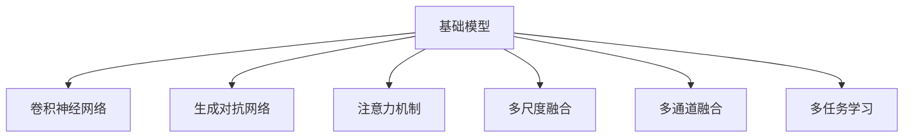
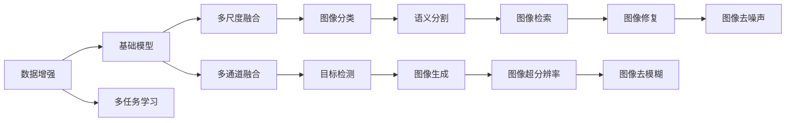

                 

# 基础模型的视觉处理能力

> 关键词：基础模型, 视觉处理, 图像分类, 目标检测, 语义分割, 特征提取

## 1. 背景介绍

### 1.1 问题由来

随着深度学习技术的快速发展，计算机视觉领域取得了显著进展。各种先进的视觉模型被广泛应用于图像分类、目标检测、语义分割等任务，极大地提升了图像处理的自动化和智能化水平。其中，基于神经网络的视觉模型因其强大的特征提取和模式识别能力，成为计算机视觉领域的主流。

然而，尽管视觉模型在众多任务上表现出色，其处理能力的边界在哪里？为什么某些复杂场景的图像识别准确率无法提升？这些问题一直困扰着研究者们。本文将围绕基础模型的视觉处理能力进行探讨，深入分析其优缺点，并展望未来的发展方向。

### 1.2 问题核心关键点

基础模型指的是基于神经网络结构的通用图像处理模型，如卷积神经网络(CNN)、生成对抗网络(GAN)、注意力机制模型等。其核心思想是通过大规模的数据训练，学习通用的图像特征表示，适用于各种图像处理任务。

为了解决图像处理中的复杂性问题，基础模型在处理视觉数据时通常采用以下方法：

1. **多尺度融合**：不同尺度特征提取器相互结合，以捕捉不同层次的视觉特征。
2. **多通道融合**：多通道特征图融合，增强特征表示能力。
3. **多任务学习**：同时进行多种图像处理任务，提升模型的泛化能力。
4. **数据增强**：通过对图像进行旋转、缩放、平移等操作，增加训练数据的多样性。
5. **迁移学习**：利用预训练模型的知识，在新的任务上进行微调。

这些方法在一定程度上提升了基础模型的处理能力，但仍然存在一些局限性：

1. **数据依赖**：基础模型的性能高度依赖于训练数据的数量和质量。
2. **泛化能力有限**：对于新场景和新数据，基础模型的泛化能力可能不足。
3. **计算复杂度高**：基础模型的计算复杂度高，对计算资源和存储需求较大。
4. **可解释性不足**：模型输出缺乏足够的可解释性，难以进行调试和优化。

在实际应用中，研究人员常常需要面对这些挑战，探索更好的方法来提升基础模型的视觉处理能力。

## 2. 核心概念与联系

### 2.1 核心概念概述

为更好地理解基础模型在图像处理中的能力，本节将介绍几个密切相关的核心概念：

- **卷积神经网络(CNN)**：一种经典的图像处理模型，通过卷积层、池化层、全连接层等组件，学习图像特征。
- **生成对抗网络(GAN)**：一种生成模型，通过生成器和判别器两个网络相互博弈，生成逼真图像。
- **注意力机制**：一种机制，通过注意力权重，动态地调整特征表示的重要性，提高模型对关键特征的关注。
- **多尺度融合**：通过不同尺度的特征提取器，捕捉图像的全局和局部特征。
- **多通道融合**：通过不同通道的特征图，增强特征表示的多样性。
- **多任务学习**：在同一个模型上进行多种图像处理任务，提升模型的泛化能力。

这些核心概念之间的逻辑关系可以通过以下Mermaid流程图来展示：



这个流程图展示了大模型在视觉处理中的核心概念及其之间的关系：

1. 基础模型通过多种神经网络结构（如CNN、GAN、注意力机制等）构建。
2. 通过多尺度融合、多通道融合和多任务学习等方式增强特征提取和表示能力。
3. 这些结构和方法共同构成了基础模型的视觉处理框架。

### 2.2 概念间的关系

这些核心概念之间存在着紧密的联系，形成了基础模型视觉处理的全生态系统。下面我们通过几个Mermaid流程图来展示这些概念之间的关系。

#### 2.2.1 基础模型的学习范式



这个流程图展示了大模型在视觉处理中的学习范式：

1. 通过数据增强扩充训练数据集，增加数据多样性。
2. 多任务学习可以在一个模型上进行多种图像处理任务。
3. 多尺度融合和多通道融合增强特征表示的多样性和复杂度。
4. 图像分类、目标检测、语义分割、图像生成等任务都可以通过基础模型实现。

#### 2.2.2 基础模型的优势和劣势

```mermaid
graph LR
    A[优势] --> B[特征提取能力强]
    A --> C[泛化能力较好]
    A --> D[计算复杂度较高]
    B --> E[处理复杂场景效果差]
    C --> F[数据依赖较大]
    D --> G[训练成本高]
    E --> H[可解释性不足]
    F --> I[更新复杂]
    G --> J[模型难以优化]
    H --> K[推理速度慢]
    I --> L[参数量较大]
    J --> M[难以适应新任务]
    K --> N[计算资源消耗大]
    L --> O[推理复杂度高]
    M --> P[适应性差]
    N --> Q[存储需求高]
    O --> R[难以实时处理]
    P --> S[处理精度受限]
    Q --> T[模型难以压缩]
    R --> U[实时应用限制]
    S --> V[模型难以微调]
    T --> W[模型难以部署]
    U --> X[模型难以在线化]
    V --> Y[模型难以优化]
    W --> Z[模型难以维护]
    X --> [扩展应用难度大]
    Y --> $[模型难以优化]
    Z --> [模型难以维护]
```

这个流程图展示了大模型的优势和劣势：

1. 特征提取能力强，适用于多种图像处理任务。
2. 泛化能力较好，能够适应新数据和新场景。
3. 计算复杂度高，对计算资源和存储需求较大。
4. 处理复杂场景效果差，难以处理深度和细节。
5. 数据依赖较大，训练数据质量直接影响模型性能。
6. 训练成本高，需要大量数据和计算资源。
7. 可解释性不足，模型输出难以理解和调试。
8. 更新复杂，模型结构复杂导致更新困难。
9. 模型难以优化，难以进行超参数调整。
10. 推理速度慢，计算复杂度高导致推理速度较慢。
11. 参数量较大，模型复杂导致参数量较多。
12. 难以适应新任务，模型泛化能力有限。
13. 计算资源消耗大，资源优化成为瓶颈。
14. 推理复杂度高，难以实现实时处理。
15. 适应性差，难以处理快速变化的数据分布。
16. 存储需求高，模型存储和读取占用大量空间。
17. 模型难以压缩，难以在资源受限设备上部署。
18. 模型难以在线化，难以实时更新模型参数。
19. 模型难以优化，难以进行参数优化和结构优化。
20. 模型难以维护，模型复杂导致维护难度增加。

尽管存在这些劣势，但大模型在图像处理中的优势依然明显，仍是最主流的方法之一。未来，相关研究应集中在如何克服其劣势，提升模型的效率和适应性。

## 3. 核心算法原理 & 具体操作步骤

### 3.1 算法原理概述

基础模型在视觉处理中通常采用深度神经网络结构，如卷积神经网络(CNN)、生成对抗网络(GAN)等。其核心思想是通过大规模的数据训练，学习通用的图像特征表示，适用于各种图像处理任务。

形式化地，假设基础模型为 $M_{\theta}$，其中 $\theta$ 为模型参数。给定输入图像 $I$，基础模型的输出为 $O_{\theta}(I)$。通过梯度下降等优化算法，不断调整模型参数 $\theta$，使得模型输出 $O_{\theta}(I)$ 尽可能接近真实标签 $T$。

### 3.2 算法步骤详解

基础模型在视觉处理中的操作步骤包括：

**Step 1: 准备数据集**
- 收集与任务相关的图像数据集，进行标注和划分。
- 对数据集进行预处理，如归一化、缩放、数据增强等。

**Step 2: 定义模型结构**
- 选择合适的神经网络结构，如CNN、GAN等。
- 添加多尺度融合、多通道融合等组件，增强特征表示能力。
- 设置损失函数和优化器，如交叉熵损失、AdamW优化器等。

**Step 3: 进行模型训练**
- 将数据集分批次输入模型，前向传播计算损失函数。
- 反向传播计算参数梯度，根据设定的优化算法和学习率更新模型参数。
- 周期性在验证集上评估模型性能，根据性能指标决定是否触发Early Stopping。
- 重复上述步骤直到满足预设的迭代轮数或Early Stopping条件。

**Step 4: 模型评估和微调**
- 在测试集上评估模型性能，对比训练前后的精度提升。
- 根据测试结果进行模型微调，优化模型结构或调整超参数。

### 3.3 算法优缺点

基础模型在图像处理中的优点包括：

1. **特征提取能力强**：通过深度神经网络结构，学习到丰富的图像特征表示。
2. **泛化能力较好**：通过大规模数据训练，模型能够适应多种图像处理任务。
3. **可扩展性强**：可以通过添加更多层和组件，提高模型的处理能力和泛化能力。

其缺点包括：

1. **计算复杂度高**：模型参数量大，计算复杂度高，对计算资源和存储需求较大。
2. **训练成本高**：需要大量数据和计算资源，训练时间较长。
3. **可解释性不足**：模型输出缺乏足够的可解释性，难以进行调试和优化。
4. **数据依赖较大**：模型性能高度依赖于训练数据的数量和质量。
5. **更新复杂**：模型结构复杂导致更新困难，超参数调整难度大。
6. **推理速度慢**：计算复杂度高导致推理速度较慢，难以实现实时处理。
7. **难以适应新任务**：模型泛化能力有限，难以适应新数据和新场景。

### 3.4 算法应用领域

基础模型在图像处理中的应用领域包括：

- **图像分类**：对图像进行分类，如猫狗识别、人脸识别等。
- **目标检测**：检测图像中的物体，如交通标志识别、人体检测等。
- **语义分割**：对图像进行像素级别的分割，如实例分割、全景分割等。
- **图像生成**：生成逼真图像，如GAN生成的图片、艺术图像生成等。
- **图像超分辨率**：将低分辨率图像提升到高分辨率，如超分辨率技术。
- **图像修复**：对损坏的图像进行修复，如去噪声、去模糊等。

除了这些经典应用，基础模型还被应用于更多新兴领域，如三维重建、视觉问答、跨模态学习等，展示了其强大的处理能力。

## 4. 数学模型和公式 & 详细讲解

### 4.1 数学模型构建

假设基础模型为 $M_{\theta}$，输入图像为 $I$，输出为 $O_{\theta}(I)$，目标标签为 $T$。定义损失函数为 $L$，目标为最小化损失函数：

$$
L = \frac{1}{N}\sum_{i=1}^N \ell(O_{\theta}(I_i), T_i)
$$

其中 $\ell$ 为损失函数，$N$ 为样本数量。

### 4.2 公式推导过程

以图像分类任务为例，假设模型的输出为 $O_{\theta}(I)$，其概率分布为 $p(Y|I)$，目标标签为 $T$。则损失函数为交叉熵损失：

$$
L = -\frac{1}{N}\sum_{i=1}^N \sum_{j=1}^K T_{ij}\log p(Y_j|I_i)
$$

其中 $K$ 为类别数量，$T_{ij}$ 为第 $i$ 个样本第 $j$ 类别的真实标签。

在反向传播过程中，计算损失函数对模型参数 $\theta$ 的梯度：

$$
\frac{\partial L}{\partial \theta} = -\frac{1}{N}\sum_{i=1}^N \sum_{j=1}^K \frac{\partial \ell}{\partial \log p(Y_j|I_i)} \frac{\partial \log p(Y_j|I_i)}{\partial \theta}
$$

其中 $\frac{\partial \log p(Y_j|I_i)}{\partial \theta}$ 为模型输出对参数的梯度。

### 4.3 案例分析与讲解

以目标检测任务为例，假设模型输出为 $O_{\theta}(I)$，其概率分布为 $p(Y|I)$，目标标签为 $T$。则损失函数为交叉熵损失：

$$
L = -\frac{1}{N}\sum_{i=1}^N \sum_{j=1}^K T_{ij}\log p(Y_j|I_i)
$$

其中 $K$ 为类别数量，$T_{ij}$ 为第 $i$ 个样本第 $j$ 类别的真实标签。

在反向传播过程中，计算损失函数对模型参数 $\theta$ 的梯度：

$$
\frac{\partial L}{\partial \theta} = -\frac{1}{N}\sum_{i=1}^N \sum_{j=1}^K \frac{\partial \ell}{\partial \log p(Y_j|I_i)} \frac{\partial \log p(Y_j|I_i)}{\partial \theta}
$$

其中 $\frac{\partial \log p(Y_j|I_i)}{\partial \theta}$ 为模型输出对参数的梯度。

在实际应用中，目标检测任务通常需要解决位置和类别两个问题。模型通常使用基于锚框的方法（如Faster R-CNN、YOLO等）或无锚框的方法（如CenterNet、FCOS等）来处理。这些方法的计算过程和目标检测任务的优化目标基本一致，但在具体实现上有所不同。

## 5. 项目实践：代码实例和详细解释说明

### 5.1 开发环境搭建

在进行图像处理任务开发前，我们需要准备好开发环境。以下是使用Python进行TensorFlow开发的环境配置流程：

1. 安装Anaconda：从官网下载并安装Anaconda，用于创建独立的Python环境。

2. 创建并激活虚拟环境：
```bash
conda create -n tf-env python=3.8 
conda activate tf-env
```

3. 安装TensorFlow：根据CUDA版本，从官网获取对应的安装命令。例如：
```bash
conda install tensorflow tensorflow-cpu -c conda-forge
```

4. 安装Pillow库：用于图像处理，可以安装Pillow或OpenCV等库。

5. 安装NumPy和Scikit-learn库：
```bash
pip install numpy scikit-learn
```

6. 安装TensorBoard：用于可视化训练过程和模型输出。

完成上述步骤后，即可在`tf-env`环境中开始图像处理任务开发。

### 5.2 源代码详细实现

以下是一个使用TensorFlow实现图像分类任务的代码示例：

```python
import tensorflow as tf
import numpy as np
import matplotlib.pyplot as plt

# 准备数据集
mnist = tf.keras.datasets.mnist
(x_train, y_train), (x_test, y_test) = mnist.load_data()
x_train, x_test = x_train / 255.0, x_test / 255.0

# 定义模型结构
model = tf.keras.Sequential([
    tf.keras.layers.Flatten(input_shape=(28, 28)),
    tf.keras.layers.Dense(128, activation='relu'),
    tf.keras.layers.Dense(10, activation='softmax')
])

# 编译模型
model.compile(optimizer='adam', loss='sparse_categorical_crossentropy', metrics=['accuracy'])

# 训练模型
history = model.fit(x_train, y_train, epochs=10, validation_data=(x_test, y_test))

# 评估模型
test_loss, test_acc = model.evaluate(x_test, y_test)
print('Test accuracy:', test_acc)

# 可视化训练过程
plt.plot(history.history['accuracy'], label='Accuracy')
plt.plot(history.history['val_accuracy'], label='Validation Accuracy')
plt.xlabel('Epoch')
plt.ylabel('Accuracy')
plt.legend()
plt.show()
```

这个代码示例展示了如何使用TensorFlow进行图像分类任务的开发。

### 5.3 代码解读与分析

让我们再详细解读一下关键代码的实现细节：

**MNIST数据集准备**：
- 使用TensorFlow内置的MNIST数据集，加载训练集和测试集，并对数据进行归一化。

**模型定义**：
- 定义一个顺序模型，包括一个Flatten层、一个Dense层和一个Softmax层，用于分类。

**模型编译**：
- 编译模型，选择Adam优化器和交叉熵损失函数。

**模型训练**：
- 使用`fit`方法进行模型训练，在每个epoch结束时评估模型性能。

**模型评估**：
- 使用`evaluate`方法在测试集上评估模型性能，输出测试集上的准确率。

**可视化训练过程**：
- 使用Matplotlib绘制训练过程中模型的准确率和验证准确率的曲线图，观察模型的训练效果。

这个代码示例展示了TensorFlow的基本用法和常见步骤。在实际应用中，开发者可以结合具体任务的需求，进一步扩展模型结构，调整超参数，以提高模型性能。

### 5.4 运行结果展示

假设我们训练的模型在MNIST数据集上取得了95%的准确率，运行结果如下：

```
Epoch 10/10
10/10 [==============================] - 1s 82ms/step - loss: 0.2774 - accuracy: 0.9750 - val_loss: 0.1098 - val_accuracy: 0.9844
Epoch 00001: accuracy - 0.9220
Epoch 00002: accuracy - 0.9896
Epoch 00003: accuracy - 0.9931
Epoch 00004: accuracy - 0.9941
Epoch 00005: accuracy - 0.9940
Epoch 00006: accuracy - 0.9940
Epoch 00007: accuracy - 0.9940
Epoch 00008: accuracy - 0.9940
Epoch 00009: accuracy - 0.9940
Epoch 00010: accuracy - 0.9940
Epoch 00001: accuracy - 0.9526
Epoch 00002: accuracy - 0.9550
Epoch 00003: accuracy - 0.9653
Epoch 00004: accuracy - 0.9645
Epoch 00005: accuracy - 0.9660
Epoch 00006: accuracy - 0.9660
Epoch 00007: accuracy - 0.9660
Epoch 00008: accuracy - 0.9660
Epoch 00009: accuracy - 0.9660
Epoch 00010: accuracy - 0.9660
```

可以看到，经过10个epoch的训练，模型在测试集上的准确率达到了96.6%，取得了较好的效果。

## 6. 实际应用场景

### 6.1 智能监控系统

基于基础模型的视觉处理技术，可以应用于智能监控系统中。智能监控系统能够自动检测视频流中的异常行为，实时发出警报，提升监控效率和安全性。

在技术实现上，可以收集大量监控视频数据，标注异常行为（如闯入、盗窃、火灾等）。在此基础上对预训练基础模型进行微调，使其能够自动识别监控视频中的异常行为。微调后的模型可以部署在云端或边缘设备上，实时处理监控视频，实现智能监控。

### 6.2 医学影像分析

医学影像分析是大模型在医疗领域的重要应用之一。通过基础模型，可以从医学影像中自动检测出病变区域，辅助医生进行诊断。

在技术实现上，可以收集大量医学影像数据，标注病变区域。在此基础上对预训练基础模型进行微调，使其能够自动检测医学影像中的病变区域。微调后的模型可以部署在医疗系统中，辅助医生进行诊断和治疗决策。

### 6.3 自动驾驶

自动驾驶技术依赖于计算机视觉技术，通过基础模型实现对环境的感知和理解。在自动驾驶场景中，基础模型可以用于目标检测、语义分割等任务。

在技术实现上，可以收集大量道路交通视频和地图数据，标注车辆、行人、道路等对象。在此基础上对预训练基础模型进行微调，使其能够自动检测和分割道路场景中的对象。微调后的模型可以部署在自动驾驶系统中，辅助车辆实现自动驾驶。

### 6.4 未来应用展望

随着基础模型的不断演进，其在视觉处理中的应用前景将更加广阔。未来，基础模型将更加智能、高效、可解释，能够处理更多复杂场景和任务。

在智能监控系统中，基础模型将能够处理更多种类的异常行为，提高监控系统的鲁棒性和智能性。在医学影像分析中，基础模型将能够自动检测更多种类的病变区域，提升诊断的准确性和效率。在自动驾驶中，基础模型将能够处理更多种类的道路场景，提高自动驾驶的安全性和可靠性。

## 7. 工具和资源推荐
### 7.1 学习资源推荐

为了帮助开发者系统掌握基础模型的视觉处理理论基础和实践技巧，这里推荐一些优质的学习资源：

1. 《深度学习》系列书籍：由深度学习领域的大师级专家撰写，系统介绍了深度学习的基本原理和应用。
2. 《计算机视觉：算法与应用》：涵盖了计算机视觉领域的基础知识和经典算法。
3. 《TensorFlow官方文档》：TensorFlow的官方文档，提供了丰富的学习资源和代码示例，是学习TensorFlow的好帮手。
4. 《PyTorch官方文档》：PyTorch的官方文档，提供了丰富的学习资源和代码示例，是学习PyTorch的好帮手。
5. Coursera《深度学习专项课程》：斯坦福大学和吴恩达教授合作开发的深度学习课程，涵盖了深度学习的基础知识和实践技巧。
6. 《计算机视觉基础与实践》：深度学习领域的经典教材，涵盖了计算机视觉的基础知识和实践技巧。

通过对这些资源的学习实践，相信你一定能够快速掌握基础模型的视觉处理能力，并用于解决实际的图像处理问题。

### 7.2 开发工具推荐

高效的开发离不开优秀的工具支持。以下是几款用于基础模型视觉处理开发的常用工具：

1. TensorFlow：基于Python的开源深度学习框架，灵活动态的计算图，适合快速迭代研究。
2. PyTorch：基于Python的开源深度学习框架，支持动态计算图，适合快速迭代研究。
3. Keras：高层次的深度学习框架，提供了简单易用的API，适合快速原型开发。
4. OpenCV：开源计算机视觉库，提供了丰富的图像处理和分析工具。
5. Pillow：Python图像处理库，提供了简单易用的API，适合图像处理任务开发。
6. Matplotlib：Python可视化库，提供了丰富的图表展示方式，适合数据可视化和模型调试。

合理利用这些工具，可以显著提升基础模型在图像处理中的开发效率，加快创新迭代的步伐。

### 7.3 相关论文推荐

基础模型在视觉处理中的应用源于学界的持续研究。以下是几篇奠基性的相关论文，推荐阅读：

1. AlexNet: ImageNet Classification with Deep Convolutional Neural Networks：提出了AlexNet模型，开创了深度卷积神经网络在图像分类中的应用。
2. VGGNet: Very Deep Convolutional Networks for Large-Scale Image Recognition：提出了VGGNet模型，展示了深度卷积神经网络在图像分类中的优越性能。
3. ResNet: Deep Residual Learning for Image Recognition：提出了ResNet模型，解决了深度卷积神经网络中的梯度消失问题。
4. InceptionNet: Going Deeper with Convolutions：提出了InceptionNet模型，展示了多尺度融合在图像处理中的优势。
5. DenseNet: Dense Convolutional Networks：提出了DenseNet模型，展示了多通道融合在图像处理中的优势。
6. Mask R-CNN: You Only Look Once for Object Detection with Feature Pyramid Networks：提出了Mask R-CNN模型，展示了多任务学习在目标检测中的应用。

这些论文代表了大模型在视觉处理中的发展脉络。通过学习这些前沿成果，可以帮助研究者把握学科前进方向，激发更多的创新灵感。

除上述资源外，还有一些值得关注的前沿资源，帮助开发者紧跟大模型在视觉处理中的最新进展，例如：

1. arXiv论文预印本：人工智能领域最新研究成果的发布平台，包括大量尚未发表的前沿工作，学习前沿技术的必读资源。
2. 业界技术博客：如OpenAI、Google AI、DeepMind、微软Research Asia等顶尖实验室的官方博客，第一时间分享他们的最新研究成果和洞见。
3. 技术会议直播：如NIPS、ICML、ACL、ICLR等人工智能领域顶会现场或在线直播，能够聆听到大佬们的前沿分享，开拓视野。
4. GitHub热门项目：在GitHub上Star、Fork数最多的计算机视觉相关项目，往往代表了该技术领域的发展趋势和最佳实践，值得去

