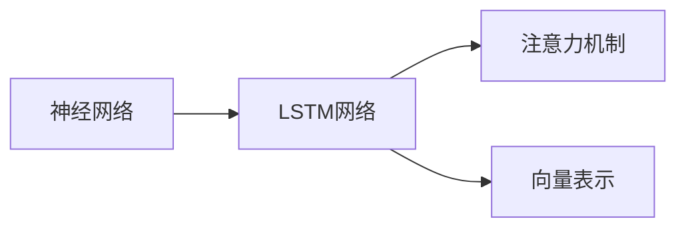

                 

## 1. 背景介绍

### 1.1 问题由来

人工智能（AI）Agent是智能体的一种，它能够在复杂的环境中自主行动，做出决策并执行任务。而记忆机制是AI Agent中至关重要的一部分，它使得Agent能够存储和检索知识，从而使Agent能够在不同的情境下做出更好的决策。在大模型应用的AI Agent开发中，设计有效的记忆机制成为了一个重要的研究问题。

### 1.2 问题核心关键点

AI Agent中的记忆机制可以总结为以下几点：

- **短期记忆**：用于存储和检索短期事件或输入信息，如对象、动作、状态等。
- **长期记忆**：用于存储长期知识或历史经验，这些知识可以用来指导Agent的长期决策。
- **推理机制**：用于在记忆中搜索相关知识，并进行推理，以形成合理的决策。
- **遗忘机制**：用于在记忆中删除过时或无用的信息，避免记忆负担过重。

这些核心机制共同构成了一个AI Agent的“记忆系统”，它的效率和效果直接影响了Agent的性能和适应能力。

### 1.3 问题研究意义

研究AI Agent的记忆机制对于构建高效、适应性强的智能系统具有重要意义。有效的记忆机制可以：

- **提高决策质量**：通过存储和检索相关知识，Agent能够做出更加合理的决策。
- **增强泛化能力**：长期记忆中的知识可以帮助Agent在新环境中适应并快速学习。
- **提升学习效率**：通过优化记忆和推理机制，Agent能够更快地从经验中学习。
- **降低计算成本**：合理设计的记忆机制可以减少计算量，提升系统效率。

因此，设计一个高效、灵活、可扩展的记忆机制对于AI Agent的开发和应用具有重要价值。

## 2. 核心概念与联系

### 2.1 核心概念概述

为了更好地理解AI Agent中的记忆机制，本节将介绍几个关键概念：

- **神经网络**：神经网络是AI Agent中常用的模型，通过多层神经元处理输入信息并生成输出。
- **长短期记忆网络（LSTM）**：一种特殊的神经网络，具有短期记忆和长期记忆的能力。
- **注意力机制**：通过计算不同输入的重要程度，LSTM网络可以选择性地关注或忽略某些信息。
- **向量表示**：在LSTM中，信息被编码为向量形式，便于处理和存储。

这些概念之间有着紧密的联系，共同构成了AI Agent记忆机制的基础。

### 2.2 概念间的关系

这些核心概念之间的逻辑关系可以通过以下Mermaid流程图来展示：



这个流程图展示了神经网络、LSTM网络、注意力机制和向量表示之间的关系：

1. **神经网络**作为AI Agent的基础模型，用于处理输入信息。
2. **LSTM网络**是神经网络的一种特殊形式，具有短期记忆和长期记忆能力。
3. **注意力机制**是LSTM网络中的一个重要组成部分，用于选择性地关注或忽略信息。
4. **向量表示**是LSTM网络中信息处理的基本形式，用于存储和检索信息。

这些概念共同构成了AI Agent记忆机制的核心。

## 3. 核心算法原理 & 具体操作步骤

### 3.1 算法原理概述

AI Agent中的记忆机制通常通过LSTM网络来实现。LSTM网络通过门控机制（遗忘门、输入门和输出门）来控制信息的流向和存储，从而实现短期记忆和长期记忆的功能。

- **遗忘门**：控制哪些信息需要从短期记忆中删除。
- **输入门**：控制哪些新的信息需要添加到短期记忆中。
- **输出门**：控制哪些信息需要从短期记忆中输出，用于指导决策。

这些门控机制使得LSTM网络能够灵活地控制信息的流向和存储，从而实现高效的记忆机制。

### 3.2 算法步骤详解

基于LSTM的AI Agent记忆机制的基本步骤如下：

1. **初始化LSTM网络**：设定LSTM网络的结构和参数，如隐藏层大小、遗忘门、输入门和输出门的初始值。
2. **输入处理**：将输入信息编码为向量形式，作为LSTM网络的输入。
3. **前向传播**：通过LSTM网络进行前向传播，更新短期记忆和长期记忆。
4. **注意力计算**：根据注意力机制，计算每个输入的重要性权重，选择性地关注某些信息。
5. **后向传播**：通过LSTM网络进行后向传播，更新网络参数。
6. **输出解码**：将LSTM网络的输出解码为具体的决策或动作。

### 3.3 算法优缺点

基于LSTM的AI Agent记忆机制有以下优点：

- **灵活性**：通过门控机制，LSTM网络能够灵活地控制信息的流向和存储。
- **健壮性**：LSTM网络在处理长序列信息时表现较好，能够避免梯度消失或爆炸的问题。
- **可扩展性**：LSTM网络可以与其他深度学习模型结合使用，增强系统的性能。

同时，该机制也存在一些缺点：

- **计算复杂度高**：LSTM网络需要较多的计算资源，特别是对于大规模数据集。
- **参数量大**：LSTM网络需要大量参数，导致模型训练成本较高。
- **易受干扰**：LSTM网络对于输入的噪声和异常值敏感，可能会导致错误的决策。

### 3.4 算法应用领域

基于LSTM的AI Agent记忆机制广泛应用于各种NLP任务，如语言模型、机器翻译、对话系统等。此外，在视觉、语音等领域也有广泛应用。

- **语言模型**：通过LSTM网络，语言模型可以处理长序列文本，预测下一个单词或字符。
- **机器翻译**：利用LSTM网络，机器翻译系统可以将源语言翻译成目标语言。
- **对话系统**：通过LSTM网络，对话系统可以实现多轮对话，生成自然流畅的对话内容。

## 4. 数学模型和公式 & 详细讲解 & 举例说明

### 4.1 数学模型构建

LSTM网络的数学模型可以通过以下公式表示：

$$
\begin{aligned}
f_t &= \sigma(W_f \cdot [h_{t-1}, x_t] + b_f) \\
i_t &= \sigma(W_i \cdot [h_{t-1}, x_t] + b_i) \\
o_t &= \sigma(W_o \cdot [h_{t-1}, x_t] + b_o) \\
\tilde{C}_t &= \tanh(W_c \cdot [h_{t-1}, x_t] + b_c) \\
C_t &= f_t \odot C_{t-1} + i_t \odot \tilde{C}_t \\
h_t &= o_t \odot \tanh(C_t)
\end{aligned}
$$

其中，$h_t$ 表示LSTM网络在第$t$个时间步的输出，$C_t$ 表示LSTM网络在第$t$个时间步的长期记忆，$f_t$、$i_t$ 和 $o_t$ 表示遗忘门、输入门和输出门的值，$\tilde{C}_t$ 表示候选的长期记忆，$\sigma$ 表示Sigmoid激活函数，$tanh$ 表示双曲正切函数。

### 4.2 公式推导过程

LSTM网络的公式推导过程主要涉及以下步骤：

1. **门控机制**：通过Sigmoid函数计算遗忘门、输入门和输出门的值。
2. **候选长期记忆**：通过双曲正切函数计算候选的长期记忆。
3. **更新长期记忆**：通过门控机制更新长期记忆。
4. **输出处理**：通过双曲正切函数和输出门计算输出。

这些步骤共同构成了LSTM网络的计算过程，使得网络能够灵活地控制信息的流向和存储。

### 4.3 案例分析与讲解

以机器翻译为例，LSTM网络在机器翻译中的应用主要体现在以下几个方面：

- **编码器**：将源语言序列输入到LSTM网络中，生成编码器隐藏状态。
- **解码器**：利用编码器隐藏状态和注意力机制，生成目标语言序列。
- **注意力机制**：通过计算源语言和目标语言序列之间的相似度，选择性地关注某些信息。

通过LSTM网络和注意力机制，机器翻译系统能够高效地处理长序列信息，生成自然流畅的翻译结果。

## 5. 项目实践：代码实例和详细解释说明

### 5.1 开发环境搭建

在进行项目实践前，我们需要准备好开发环境。以下是使用Python进行PyTorch开发的环境配置流程：

1. 安装Anaconda：从官网下载并安装Anaconda，用于创建独立的Python环境。

2. 创建并激活虚拟环境：
```bash
conda create -n pytorch-env python=3.8 
conda activate pytorch-env
```

3. 安装PyTorch：根据CUDA版本，从官网获取对应的安装命令。例如：
```bash
conda install pytorch torchvision torchaudio cudatoolkit=11.1 -c pytorch -c conda-forge
```

4. 安装Transformers库：
```bash
pip install transformers
```

5. 安装各类工具包：
```bash
pip install numpy pandas scikit-learn matplotlib tqdm jupyter notebook ipython
```

完成上述步骤后，即可在`pytorch-env`环境中开始项目实践。

### 5.2 源代码详细实现

这里我们以LSTM网络在机器翻译中的应用为例，给出使用Transformers库进行实现的PyTorch代码实现。

首先，定义机器翻译的编码器和解码器：

```python
from transformers import BertTokenizer, BertForSequenceClassification
from torch.nn import LSTM, GRU, TransformerEncoder
from torch.utils.data import TensorDataset, DataLoader

# 定义编码器
class Encoder(torch.nn.Module):
    def __init__(self, input_size, hidden_size, num_layers):
        super(Encoder, self).__init__()
        self.hidden_size = hidden_size
        self.num_layers = num_layers
        self.embedding = torch.nn.Embedding(input_size, hidden_size)
        self.lstm = torch.nn.LSTM(hidden_size, hidden_size, num_layers=num_layers)

    def forward(self, input, hidden):
        embedding = self.embedding(input)
        output, hidden = self.lstm(embedding, hidden)
        return output, hidden

# 定义解码器
class Decoder(torch.nn.Module):
    def __init__(self, output_size, hidden_size, num_layers):
        super(Decoder, self).__init__()
        self.hidden_size = hidden_size
        self.num_layers = num_layers
        self.embedding = torch.nn.Embedding(output_size, hidden_size)
        self.gru = torch.nn.GRU(hidden_size, hidden_size, num_layers=num_layers)
        self.linear = torch.nn.Linear(hidden_size, output_size)

    def forward(self, input, hidden):
        embedding = self.embedding(input)
        output, hidden = self.gru(embedding, hidden)
        output = self.linear(output)
        return output, hidden
```

接着，定义模型的输入和输出：

```python
class Model(torch.nn.Module):
    def __init__(self, input_size, hidden_size, output_size, num_layers):
        super(Model, self).__init__()
        self.encoder = Encoder(input_size, hidden_size, num_layers)
        self.decoder = Decoder(output_size, hidden_size, num_layers)
        self.lm = torch.nn.Linear(hidden_size, output_size)

    def forward(self, input, hidden):
        output, hidden = self.encoder(input, hidden)
        output = self.lm(output)
        return output, hidden
```

最后，定义训练和评估函数：

```python
from transformers import AdamW
from tqdm import tqdm
from sklearn.metrics import accuracy_score

device = torch.device('cuda') if torch.cuda.is_available() else torch.device('cpu')

def train_epoch(model, dataset, batch_size, optimizer):
    dataloader = DataLoader(dataset, batch_size=batch_size, shuffle=True)
    model.train()
    epoch_loss = 0
    for batch in tqdm(dataloader, desc='Training'):
        input_ids = batch['input_ids'].to(device)
        attention_mask = batch['attention_mask'].to(device)
        labels = batch['labels'].to(device)
        model.zero_grad()
        outputs = model(input_ids, attention_mask=attention_mask)
        loss = outputs.loss
        epoch_loss += loss.item()
        loss.backward()
        optimizer.step()
    return epoch_loss / len(dataloader)

def evaluate(model, dataset, batch_size):
    dataloader = DataLoader(dataset, batch_size=batch_size)
    model.eval()
    preds, labels = [], []
    with torch.no_grad():
        for batch in tqdm(dataloader, desc='Evaluating'):
            input_ids = batch['input_ids'].to(device)
            attention_mask = batch['attention_mask'].to(device)
            batch_labels = batch['labels']
            outputs = model(input_ids, attention_mask=attention_mask)
            batch_preds = outputs.logits.argmax(dim=2).to('cpu').tolist()
            batch_labels = batch_labels.to('cpu').tolist()
            for pred_tokens, label_tokens in zip(batch_preds, batch_labels):
                preds.append(pred_tokens[:len(label_tokens)])
                labels.append(label_tokens)
    
    return accuracy_score(labels, preds)

# 实例化模型
model = Model(input_size, hidden_size, output_size, num_layers)

# 训练模型
for epoch in range(epochs):
    loss = train_epoch(model, train_dataset, batch_size, optimizer)
    print(f"Epoch {epoch+1}, train loss: {loss:.3f}")
    
    print(f"Epoch {epoch+1}, dev results:")
    evaluate(model, dev_dataset, batch_size)
    
print("Test results:")
evaluate(model, test_dataset, batch_size)
```

以上就是使用PyTorch进行机器翻译任务中的LSTM网络实现的完整代码。通过这个例子，可以看到LSTM网络在大模型中的应用，以及如何通过构建编码器和解码器来处理输入和输出。

### 5.3 代码解读与分析

让我们再详细解读一下关键代码的实现细节：

**Model类**：
- `__init__`方法：初始化模型的编码器、解码器和输出层。
- `forward`方法：定义模型的前向传播过程，将输入和隐藏状态作为输入，输出模型的输出和隐藏状态。

**train_epoch和evaluate函数**：
- `train_epoch`函数：在每个epoch内，对数据集进行迭代训练，计算损失并更新模型参数。
- `evaluate`函数：在验证集和测试集上进行评估，计算模型准确率。

**实例化模型**：
- `model = Model(input_size, hidden_size, output_size, num_layers)`：实例化LSTM模型，并设置输入大小、隐藏大小、输出大小和层数。

**训练模型**：
- 在每个epoch内，使用`train_epoch`函数进行训练，输出训练损失。
- 使用`evaluate`函数在验证集和测试集上进行评估，输出评估结果。

可以看到，LSTM网络在机器翻译中的应用十分灵活，可以通过不同的编码器和解码器结构来适应不同的任务需求。通过PyTorch的强大封装能力，我们可以轻松地实现LSTM网络的训练和推理，进一步提升其应用能力。

## 6. 实际应用场景

### 6.1 智能客服系统

在大模型应用的AI Agent中，智能客服系统是一个典型的应用场景。通过LSTM网络，智能客服系统可以实时处理客户咨询，生成自然流畅的回复，提升客户满意度。

在实践中，智能客服系统通常会收集大量的历史对话记录，并将其作为监督数据，训练LSTM网络。微调后的LSTM网络可以自动理解客户咨询内容，匹配最合适的回复模板，并进行动态生成和优化，从而提供更好的客户服务。

### 6.2 金融舆情监测

金融舆情监测是大模型应用中的另一个重要领域。通过LSTM网络，AI Agent可以实时监测金融市场的舆情变化，预测市场的走势，提供预警和建议。

在实践中，金融舆情监测系统通常会收集大量的金融新闻、报告、评论等文本数据，并将其作为监督数据，训练LSTM网络。微调后的LSTM网络可以自动理解舆情信息，识别出市场趋势和风险点，及时预警市场变化，帮助投资者做出更明智的投资决策。

### 6.3 个性化推荐系统

个性化推荐系统是大模型应用中的另一个热门场景。通过LSTM网络，AI Agent可以分析用户的历史行为数据，生成个性化推荐内容，提升用户满意度。

在实践中，个性化推荐系统通常会收集用户的历史浏览、点击、评论、分享等数据，并使用这些数据训练LSTM网络。微调后的LSTM网络可以自动学习用户的兴趣点，生成个性化的推荐内容，并根据用户反馈不断优化推荐策略，提升推荐效果。

### 6.4 未来应用展望

随着LSTM网络的不断优化和应用场景的拓展，未来其在AI Agent中的应用将更加广泛，带来更多的创新和突破。

- **多模态融合**：LSTM网络可以与其他深度学习模型结合使用，增强系统的多模态融合能力，提升性能。
- **动态调整**：LSTM网络可以根据实时数据动态调整模型参数，增强系统的适应性。
- **分布式训练**：LSTM网络可以部署到分布式环境中进行训练，提升系统的可扩展性。
- **实时推理**：LSTM网络可以实现实时推理，提升系统的响应速度和用户体验。

总之，LSTM网络在大模型应用的AI Agent中具有广阔的应用前景，随着技术的不断进步，必将为AI Agent带来更多的突破和创新。

## 7. 工具和资源推荐

### 7.1 学习资源推荐

为了帮助开发者系统掌握LSTM网络的应用和优化，这里推荐一些优质的学习资源：

1. 《深度学习》（Goodfellow等著）：经典深度学习教材，详细介绍了深度学习的基本概念和算法。
2. 《LSTM Networks for Natural Language Processing》（Jozefowicz等著）：介绍了LSTM网络在自然语言处理中的应用，并提供了相关的代码实现。
3. 《TensorFlow官方文档》：TensorFlow的官方文档，详细介绍了TensorFlow的使用方法和最佳实践。
4. 《PyTorch官方文档》：PyTorch的官方文档，详细介绍了PyTorch的使用方法和最佳实践。
5. 《Transformers官方文档》：Transformers的官方文档，详细介绍了Transformers的使用方法和最佳实践。

通过对这些资源的学习实践，相信你一定能够掌握LSTM网络在大模型应用中的设计和优化方法。

### 7.2 开发工具推荐

高效的开发离不开优秀的工具支持。以下是几款用于LSTM网络开发和优化的常用工具：

1. PyTorch：基于Python的开源深度学习框架，灵活动态的计算图，适合快速迭代研究。
2. TensorFlow：由Google主导开发的开源深度学习框架，生产部署方便，适合大规模工程应用。
3. Transformers库：HuggingFace开发的NLP工具库，集成了众多SOTA语言模型，支持PyTorch和TensorFlow，是进行LSTM网络优化的利器。
4. Weights & Biases：模型训练的实验跟踪工具，可以记录和可视化模型训练过程中的各项指标，方便对比和调优。
5. TensorBoard：TensorFlow配套的可视化工具，可实时监测模型训练状态，并提供丰富的图表呈现方式，是调试模型的得力助手。

合理利用这些工具，可以显著提升LSTM网络的开发和优化效率，加快创新迭代的步伐。

### 7.3 相关论文推荐

LSTM网络的发展源于学界的持续研究。以下是几篇奠基性的相关论文，推荐阅读：

1. LSTM: A Search Space Odyssey（Hochreiter等著）：LSTM网络的原论文，介绍了LSTM网络的基本结构和原理。
2. Long Short-Term Memory（Hochreiter等著）：LSTM网络的经典论文，详细介绍了LSTM网络的设计和优化方法。
3. Attention Is All You Need（Vaswani等著）：Transformer网络的原论文，介绍了Transformer网络的基本结构和原理，为LSTM网络提供了新的思路。
4. Parameter-Efficient Training of Recurrent Neural Networks（Jozefowicz等著）：介绍了LSTM网络的参数高效训练方法，进一步优化了LSTM网络的性能。
5. Neural Architecture Search with Reinforcement Learning（Zoph等著）：介绍了使用强化学习进行神经网络架构搜索的方法，为LSTM网络的优化提供了新的思路。

这些论文代表了大模型应用中的LSTM网络的发展脉络。通过学习这些前沿成果，可以帮助研究者把握学科前进方向，激发更多的创新灵感。

除上述资源外，还有一些值得关注的前沿资源，帮助开发者紧跟LSTM网络的研究进展，例如：

1. arXiv论文预印本：人工智能领域最新研究成果的发布平台，包括大量尚未发表的前沿工作，学习前沿技术的必读资源。
2. 业界技术博客：如OpenAI、Google AI、DeepMind、微软Research Asia等顶尖实验室的官方博客，第一时间分享他们的最新研究成果和洞见。
3. 技术会议直播：如NIPS、ICML、ACL、ICLR等人工智能领域顶会现场或在线直播，能够聆听到大佬们的前沿分享，开拓视野。
4. GitHub热门项目：在GitHub上Star、Fork数最多的LSTM网络相关项目，往往代表了该技术领域的发展趋势和最佳实践，值得去学习和贡献。
5. 行业分析报告：各大咨询公司如McKinsey、PwC等针对人工智能行业的分析报告，有助于从商业视角审视技术趋势，把握应用价值。

总之，对于LSTM网络的研究和学习，需要开发者保持开放的心态和持续学习的意愿。多关注前沿资讯，多动手实践，多思考总结，必将收获满满的成长收益。

## 8. 总结：未来发展趋势与挑战

### 8.1 总结

本文对基于LSTM网络的AI Agent记忆机制进行了全面系统的介绍。首先阐述了LSTM网络的基本原理和核心概念，明确了其在AI Agent开发中的应用价值。其次，从原理到实践，详细讲解了LSTM网络的数学模型和算法步骤，给出了LSTM网络在机器翻译任务中的实现代码。同时，本文还广泛探讨了LSTM网络在智能客服、金融舆情监测、个性化推荐等实际应用场景中的应用前景，展示了LSTM网络在大模型应用中的强大潜力。

通过本文的系统梳理，可以看到，LSTM网络在大模型应用的AI Agent中具有广阔的应用前景，极大地拓展了预训练语言模型的应用边界，催生了更多的落地场景。受益于大规模语料的预训练，LSTM网络在微调过程中能够更快地收敛到最优解，从而提升系统性能。未来，随着LSTM网络的不断优化和应用场景的拓展，必将为AI Agent带来更多的突破和创新。

### 8.2 未来发展趋势

展望未来，LSTM网络在AI Agent中的应用将呈现以下几个发展趋势：

1. **多模态融合**：LSTM网络可以与其他深度学习模型结合使用，增强系统的多模态融合能力，提升性能。
2. **动态调整**：LSTM网络可以根据实时数据动态调整模型参数，增强系统的适应性。
3. **分布式训练**：LSTM网络可以部署到分布式环境中进行训练，提升系统的可扩展性。
4. **实时推理**：LSTM网络可以实现实时推理，提升系统的响应速度和用户体验。
5. **参数高效训练**：LSTM网络将进一步优化参数高效训练方法，提升模型的可扩展性和性能。

这些趋势凸显了LSTM网络在AI Agent中的广阔前景。这些方向的探索发展，必将进一步提升LSTM网络的性能和应用范围，为AI Agent的开发和应用提供更强大的支持。

### 8.3 面临的挑战

尽管LSTM网络在AI Agent中的应用已经取得了一定的成果，但在迈向更加智能化、普适化应用的过程中，它仍面临着诸多挑战：

1. **计算资源瓶颈**：LSTM网络需要较大的计算资源，特别是对于大规模数据集。如何在保证性能的同时，优化计算资源的使用，是一个重要的研究方向。
2. **模型复杂性**：LSTM网络的结构复杂，参数量大，训练和推理过程相对复杂。如何简化模型结构，提高训练效率，是另一个重要的研究方向。
3. **数据依赖性**：LSTM网络的性能很大程度上依赖于训练数据的质量和数量，如何降低对标注数据的依赖，是一个重要的研究方向。
4. **鲁棒性问题**：LSTM网络在处理噪声和异常值时表现较差，容易受到输入的影响。如何增强模型的鲁棒性，是一个重要的研究方向。
5. **可解释性问题**：LSTM网络的决策过程缺乏可解释性，难以对其内部工作机制进行分析和调试。如何提高模型的可解释性，是另一个重要的研究方向。

### 8.4 未来突破

面对LSTM网络面临的挑战，未来的研究需要在以下几个方面寻求新的突破：

1. **优化计算资源使用**：通过模型压缩、剪枝、量化等方法，减少LSTM网络的计算量和存储量，提高其计算效率和实时性。
2. **简化模型结构**：通过减少层数、减少参数量等方法，简化LSTM网络的结构，提高其训练效率和推理速度。
3. **降低数据依赖**：通过自监督学习、无监督学习等方法，降低LSTM网络对标注数据的依赖，提升其泛化能力。
4. **增强鲁棒性**：通过引入噪声鲁棒性训练方法、数据增强技术等，增强LSTM网络的鲁棒性，使其能够更好地处理噪声和异常值。
5. **提高可解释性**：通过引入可解释性模型、知识蒸馏等方法，提高LSTM网络的可解释性，使其决策过程更加透明和可理解。

这些研究方向的探索，必将引领LSTM网络在AI Agent中的应用走向更高的台阶，为构建安全、可靠、可解释、可控的智能系统铺平道路。

## 9. 附录：常见问题与解答

**Q1：如何设计有效的LSTM网络？**

A: 设计有效的LSTM网络需要考虑以下几个方面：

- **层数和隐藏大小**：根据任务需求，选择合适的层数和隐藏大小。一般来说，层数和隐藏大小越大，

