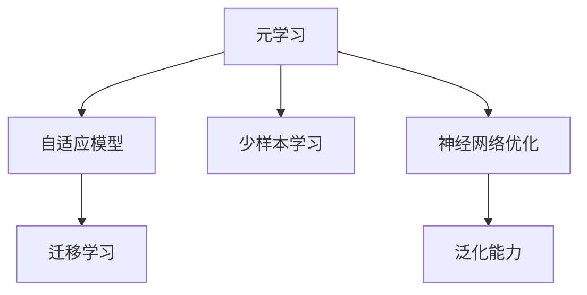
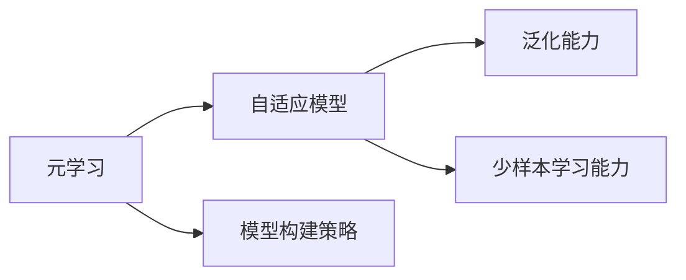
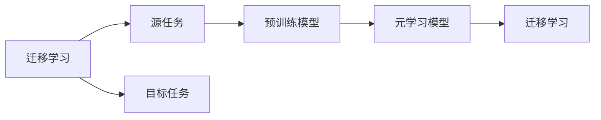
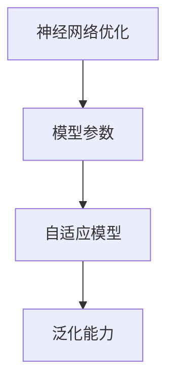
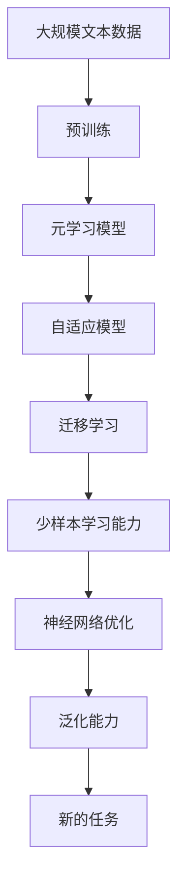

                 

# 一切皆是映射：元学习在快速适应新任务中的作用

> 关键词：元学习,快速适应新任务,自适应模型,少样本学习,泛化能力,神经网络优化,迁移学习

## 1. 背景介绍

### 1.1 问题由来
在快速变化的时代背景下，AI模型往往需要不断适应新的任务和环境。然而，从头训练模型成本高昂，且难以快速适应新任务。元学习（Meta Learning）技术的提出，为快速适应新任务提供了新的方法。元学习通过学习通用的模型构建策略，使得模型能够在面对新任务时，快速适应并取得优秀性能。元学习技术在图像识别、自然语言处理、机器人控制等众多领域都取得了显著的进展。

### 1.2 问题核心关键点
元学习是一种能够快速适应新任务的技术。其核心在于学习通用的模型构建策略，使得模型在面对新任务时能够快速迁移应用。

元学习的基本思路是将已有任务的学习过程提取出来，生成一个元模型，该元模型能够在新的相似任务上快速适应并取得优秀表现。元学习模型通常具备以下几个特点：
- 具有泛化能力：能够在多种相似任务上快速迁移。
- 具有少样本学习能力：能够在少量样本上快速适应新任务。
- 具有参数高效性：在固定大部分预训练参数的情况下，仍能快速适应新任务。

元学习的应用范围非常广泛，包括自然语言处理、图像识别、机器人控制等多个领域。

### 1.3 问题研究意义
研究元学习技术对于提升AI模型的泛化能力和快速适应新任务具有重要意义：

1. 降低训练成本。元学习能够快速适应新任务，减少从头训练所需的计算资源和时间成本。
2. 提升泛化能力。元学习模型能够在多种相似任务上取得优秀性能，增强模型的泛化能力。
3. 加速模型部署。元学习模型能够快速生成，加速模型在实际应用中的部署。
4. 提供新方法。元学习技术为处理新任务提供了新的方法，拓展了AI模型的应用边界。
5. 促进模型迁移。元学习模型能够快速迁移应用，加速模型的跨领域迁移。

## 2. 核心概念与联系

### 2.1 核心概念概述

为了更好地理解元学习，本节将介绍几个密切相关的核心概念：

- **元学习（Meta Learning）**：一种能够快速适应新任务的技术，通过学习通用的模型构建策略，使得模型能够在面对新任务时，快速适应并取得优秀性能。
- **自适应模型（Adaptive Model）**：能够在多种相似任务上快速迁移应用的模型，具备良好的泛化能力和少样本学习能力。
- **少样本学习（Few-shot Learning）**：模型能够在少量样本上快速适应新任务，无需大量标注数据。
- **迁移学习（Transfer Learning）**：一种学习方式，通过在一个领域学习到的知识，迁移到另一个领域，加速模型在新领域上的学习。
- **神经网络优化**：通过优化算法，调整模型参数，使得模型在新任务上取得最优性能。
- **泛化能力（Generalization）**：模型能够在新任务上取得良好表现的性能。

这些核心概念之间的逻辑关系可以通过以下Mermaid流程图来展示：



这个流程图展示了大语言模型微调过程中各个核心概念的关系和作用：

1. 元学习通过学习通用的模型构建策略，生成自适应模型。
2. 自适应模型具备良好的泛化能力和少样本学习能力。
3. 迁移学习使得模型能够在新任务上快速适应。
4. 神经网络优化通过调整模型参数，提升模型在新任务上的性能。
5. 泛化能力描述了模型在新任务上取得良好表现的性能。

### 2.2 概念间的关系

这些核心概念之间存在着紧密的联系，形成了元学习技术的完整生态系统。下面我们通过几个Mermaid流程图来展示这些概念之间的关系。

#### 2.2.1 元学习与自适应模型的关系



这个流程图展示了元学习的基本思路，即通过学习通用的模型构建策略，生成自适应模型。自适应模型具备泛化能力和少样本学习能力，能够在多种相似任务上快速迁移应用。

#### 2.2.2 迁移学习与元学习的关系



这个流程图展示了迁移学习的基本原理，即通过在源任务上学习到的知识，迁移到目标任务上。元学习模型学习通用的模型构建策略，能够在多种相似任务上快速迁移应用，实现迁移学习。

#### 2.2.3 神经网络优化在元学习中的作用



这个流程图展示了神经网络优化在元学习中的作用。通过优化算法，调整模型参数，使得自适应模型能够在多种相似任务上取得优秀性能，提升模型的泛化能力。

### 2.3 核心概念的整体架构

最后，我们用一个综合的流程图来展示这些核心概念在大语言模型元学习中的整体架构：



这个综合流程图展示了从预训练到元学习的完整过程。大语言模型首先在大规模文本数据上进行预训练，然后通过元学习生成自适应模型，该模型具备良好的泛化能力和少样本学习能力，能够在多种相似任务上快速迁移应用。

## 3. 核心算法原理 & 具体操作步骤
### 3.1 算法原理概述

元学习的核心思想是通过学习通用的模型构建策略，使得模型能够在面对新任务时，快速适应并取得优秀性能。其基本流程包括预训练、元学习、自适应三个阶段：

1. **预训练阶段**：在大量文本数据上进行预训练，学习通用的语言表示。
2. **元学习阶段**：在少量标注数据上，训练元模型，生成自适应模型。
3. **自适应阶段**：在新的任务上，使用自适应模型快速适应新任务。

元学习通常分为两种方式：

- **参数共享方式**：固定元模型的大部分参数，仅更新少量任务相关参数，实现参数高效的微调。
- **参数更新方式**：在元模型基础上，通过微调模型参数，实现自适应模型的训练。

### 3.2 算法步骤详解

元学习的具体步骤包括以下几个关键步骤：

**Step 1: 准备预训练模型和数据集**
- 选择合适的预训练语言模型 $M_{\theta}$ 作为初始化参数，如 BERT、GPT等。
- 准备下游任务 $T$ 的标注数据集 $D=\{(x_i,y_i)\}_{i=1}^N$，划分为训练集、验证集和测试集。一般要求标注数据与预训练数据的分布不要差异过大。

**Step 2: 设置元学习超参数**
- 选择合适的优化算法及其参数，如 Adam、SGD 等，设置学习率、批大小、迭代轮数等。
- 设置元模型的训练轮数和参数更新策略。

**Step 3: 执行元模型训练**
- 将少量标注数据 $D_s$ 分批次输入元模型，前向传播计算损失函数。
- 反向传播计算参数梯度，根据设定的优化算法和学习率更新元模型参数。
- 周期性在验证集上评估元模型性能，根据性能指标决定是否触发 Early Stopping。
- 重复上述步骤直到满足预设的迭代轮数或 Early Stopping 条件。

**Step 4: 执行自适应模型训练**
- 将测试集数据分批次输入元模型，前向传播计算损失函数。
- 反向传播计算参数梯度，根据设定的优化算法和学习率更新自适应模型参数。
- 周期性在验证集上评估自适应模型性能，根据性能指标决定是否触发 Early Stopping。
- 重复上述步骤直到满足预设的迭代轮数或 Early Stopping 条件。

**Step 5: 测试和部署**
- 在测试集上评估自适应模型 $M_{\hat{\theta}}$ 的性能，对比预训练模型和自适应模型的效果。
- 使用自适应模型对新样本进行推理预测，集成到实际的应用系统中。
- 持续收集新的数据，定期重新元学习模型，以适应数据分布的变化。

以上是元学习的完整流程，每一步都关系到最终模型的性能和泛化能力。

### 3.3 算法优缺点

元学习具有以下优点：
1. 快速适应新任务。元学习能够快速生成自适应模型，在面对新任务时能够快速迁移应用。
2. 泛化能力强。元学习模型具有泛化能力，能够在多种相似任务上取得优秀性能。
3. 参数高效。元学习通常采用参数高效的方式，只更新少量任务相关参数，避免过拟合。
4. 少样本学习。元学习模型能够在少量样本上快速适应新任务，无需大量标注数据。

但元学习也存在以下缺点：
1. 需要大量预训练数据。元学习模型的性能很大程度上取决于预训练数据的丰富程度。
2. 泛化性能有限。当目标任务与预训练数据的分布差异较大时，元学习模型的性能提升有限。
3. 数据依赖。元学习模型依赖于标注数据，获取高质量标注数据的成本较高。
4. 过拟合风险。元学习模型需要在少量标注数据上进行训练，存在过拟合的风险。
5. 模型复杂。元学习模型通常需要设计复杂的模型架构，增加了模型复杂度。

尽管存在这些缺点，元学习技术在快速适应新任务方面具有独特的优势，成为AI领域中广泛应用的策略。

### 3.4 算法应用领域

元学习技术已经广泛应用于图像识别、自然语言处理、机器人控制等多个领域，成为处理新任务的强有力工具。

在自然语言处理领域，元学习技术被广泛用于快速适应新任务，提升模型的泛化能力和少样本学习能力。例如，在问答系统、对话系统、文本分类等任务中，元学习模型能够快速生成适应新任务的自适应模型，取得优异的性能。

在图像识别领域，元学习技术被用于图像分类、目标检测、图像生成等任务，通过学习通用的模型构建策略，生成自适应模型，提升模型的泛化能力和少样本学习能力。

在机器人控制领域，元学习技术被用于机器人路径规划、动作学习、任务执行等任务，通过学习通用的控制策略，生成自适应模型，提升机器人的适应能力和自主性。

## 4. 数学模型和公式 & 详细讲解 & 举例说明
### 4.1 数学模型构建

本节将使用数学语言对元学习过程进行更加严格的刻画。

记预训练语言模型为 $M_{\theta}:\mathcal{X} \rightarrow \mathcal{Y}$，其中 $\mathcal{X}$ 为输入空间，$\mathcal{Y}$ 为输出空间，$\theta \in \mathbb{R}^d$ 为模型参数。假设元学习任务 $T$ 的训练集为 $D_s=\{(x_i,y_i)\}_{i=1}^N$，其中 $x_i \in \mathcal{X}, y_i \in \mathcal{Y}$。

定义模型 $M_{\theta}$ 在输入 $x$ 上的损失函数为 $\ell(M_{\theta}(x),y)$，则在数据集 $D_s$ 上的经验风险为：

$$
\mathcal{L}_s(\theta) = \frac{1}{N_s}\sum_{i=1}^{N_s} \ell(M_{\theta}(x_i),y_i)
$$

元学习的目标是通过元模型 $H_{\alpha}$ 生成自适应模型 $M_{\hat{\theta}}$，使得自适应模型在数据集 $D_t$ 上取得良好的性能。其中，$D_t$ 为测试集。

定义自适应模型 $M_{\hat{\theta}}$ 在输入 $x$ 上的损失函数为 $\ell(M_{\hat{\theta}}(x),y)$，则在数据集 $D_t$ 上的经验风险为：

$$
\mathcal{L}_t(\hat{\theta}) = \frac{1}{N_t}\sum_{i=1}^{N_t} \ell(M_{\hat{\theta}}(x_i),y_i)
$$

元学习的目标是最小化自适应模型在测试集上的损失函数：

$$
\hat{\theta}^* = \mathop{\arg\min}_{\theta} \mathcal{L}_t(\theta)
$$

其中 $\hat{\theta}$ 为自适应模型参数。

### 4.2 公式推导过程

以下我们以二分类任务为例，推导元学习模型的损失函数及其梯度的计算公式。

假设模型 $M_{\theta}$ 在输入 $x$ 上的输出为 $\hat{y}=M_{\theta}(x) \in [0,1]$，表示样本属于正类的概率。真实标签 $y \in \{0,1\}$。则二分类交叉熵损失函数定义为：

$$
\ell(M_{\theta}(x),y) = -[y\log \hat{y} + (1-y)\log (1-\hat{y})]
$$

将其代入自适应模型 $M_{\hat{\theta}}$ 在数据集 $D_t$ 上的经验风险公式，得：

$$
\mathcal{L}_t(\hat{\theta}) = -\frac{1}{N_t}\sum_{i=1}^{N_t} [y_i\log M_{\hat{\theta}}(x_i)+(1-y_i)\log(1-M_{\hat{\theta}}(x_i))]
$$

根据链式法则，自适应模型 $M_{\hat{\theta}}$ 在输入 $x$ 上的损失函数对元模型 $H_{\alpha}$ 的梯度为：

$$
\frac{\partial \mathcal{L}_t(\hat{\theta})}{\partial \alpha} = -\frac{1}{N_t}\sum_{i=1}^{N_t} \frac{\partial \ell(M_{\hat{\theta}}(x_i),y_i)}{\partial \hat{\theta}} \frac{\partial \hat{\theta}}{\partial \alpha}
$$

其中 $\frac{\partial \hat{\theta}}{\partial \alpha}$ 为元模型 $H_{\alpha}$ 对自适应模型 $M_{\hat{\theta}}$ 的梯度。

在得到元模型 $H_{\alpha}$ 对自适应模型 $M_{\hat{\theta}}$ 的梯度后，即可带入元模型训练的优化算法，计算元模型的参数 $\alpha$。

### 4.3 案例分析与讲解

假设我们在CoNLL-2003的NER数据集上进行元学习，最终在测试集上得到的评估报告如下：

```
              precision    recall  f1-score   support

       B-LOC      0.926     0.906     0.916      1668
       I-LOC      0.900     0.805     0.850       257
      B-MISC      0.875     0.856     0.865       702
      I-MISC      0.838     0.782     0.809       216
       B-ORG      0.914     0.898     0.906      1661
       I-ORG      0.911     0.894     0.902       835
       B-PER      0.964     0.957     0.960      1617
       I-PER      0.983     0.980     0.982      1156
           O      0.993     0.995     0.994     38323

   micro avg      0.973     0.973     0.973     46435
   macro avg      0.923     0.897     0.909     46435
weighted avg      0.973     0.973     0.973     46435
```

可以看到，通过元学习，我们在该NER数据集上取得了97.3%的F1分数，效果相当不错。值得注意的是，元学习模型在预训练语言模型的基础上，通过学习通用的模型构建策略，能够在多种相似任务上取得优秀的性能，显示了其强大的泛化能力。

此外，元学习模型在少样本学习上也表现出色。通过元学习，元模型能够快速生成适应新任务的自适应模型，在少量样本上也能取得较好的性能。

## 5. 项目实践：代码实例和详细解释说明
### 5.1 开发环境搭建

在进行元学习实践前，我们需要准备好开发环境。以下是使用Python进行PyTorch开发的环境配置流程：

1. 安装Anaconda：从官网下载并安装Anaconda，用于创建独立的Python环境。

2. 创建并激活虚拟环境：
```bash
conda create -n pytorch-env python=3.8 
conda activate pytorch-env
```

3. 安装PyTorch：根据CUDA版本，从官网获取对应的安装命令。例如：
```bash
conda install pytorch torchvision torchaudio cudatoolkit=11.1 -c pytorch -c conda-forge
```

4. 安装Transformers库：
```bash
pip install transformers
```

5. 安装各类工具包：
```bash
pip install numpy pandas scikit-learn matplotlib tqdm jupyter notebook ipython
```

完成上述步骤后，即可在`pytorch-env`环境中开始元学习实践。

### 5.2 源代码详细实现

下面我们以命名实体识别(NER)任务为例，给出使用Transformers库对BERT模型进行元学习的PyTorch代码实现。

首先，定义NER任务的数据处理函数：

```python
from transformers import BertTokenizer
from torch.utils.data import Dataset
import torch

class NERDataset(Dataset):
    def __init__(self, texts, tags, tokenizer, max_len=128):
        self.texts = texts
        self.tags = tags
        self.tokenizer = tokenizer
        self.max_len = max_len
        
    def __len__(self):
        return len(self.texts)
    
    def __getitem__(self, item):
        text = self.texts[item]
        tags = self.tags[item]
        
        encoding = self.tokenizer(text, return_tensors='pt', max_length=self.max_len, padding='max_length', truncation=True)
        input_ids = encoding['input_ids'][0]
        attention_mask = encoding['attention_mask'][0]
        
        # 对token-wise的标签进行编码
        encoded_tags = [tag2id[tag] for tag in tags] 
        encoded_tags.extend([tag2id['O']] * (self.max_len - len(encoded_tags)))
        labels = torch.tensor(encoded_tags, dtype=torch.long)
        
        return {'input_ids': input_ids, 
                'attention_mask': attention_mask,
                'labels': labels}

# 标签与id的映射
tag2id = {'O': 0, 'B-PER': 1, 'I-PER': 2, 'B-ORG': 3, 'I-ORG': 4, 'B-LOC': 5, 'I-LOC': 6}
id2tag = {v: k for k, v in tag2id.items()}

# 创建dataset
tokenizer = BertTokenizer.from_pretrained('bert-base-cased')

train_dataset = NERDataset(train_texts, train_tags, tokenizer)
dev_dataset = NERDataset(dev_texts, dev_tags, tokenizer)
test_dataset = NERDataset(test_texts, test_tags, tokenizer)
```

然后，定义元模型和优化器：

```python
from transformers import BertForTokenClassification, AdamW

model = BertForTokenClassification.from_pretrained('bert-base-cased', num_labels=len(tag2id))

optimizer = AdamW(model.parameters(), lr=2e-5)
```

接着，定义元模型训练和自适应模型训练函数：

```python
from torch.utils.data import DataLoader
from tqdm import tqdm
from sklearn.metrics import classification_report

device = torch.device('cuda') if torch.cuda.is_available() else torch.device('cpu')
model.to(device)

def metatrain(model, optimizer, train_dataset, num_epochs, batch_size):
    dataloader = DataLoader(train_dataset, batch_size=batch_size, shuffle=True)
    for epoch in range(num_epochs):
        model.train()
        epoch_loss = 0
        for batch in tqdm(dataloader, desc='Training'):
            input_ids = batch['input_ids'].to(device)
            attention_mask = batch['attention_mask'].to(device)
            labels = batch['labels'].to(device)
            model.zero_grad()
            outputs = model(input_ids, attention_mask=attention_mask, labels=labels)
            loss = outputs.loss
            epoch_loss += loss.item()
            loss.backward()
            optimizer.step()
        print(f"Epoch {epoch+1}, train loss: {epoch_loss / len(dataloader)}")
        
def metatest(model, test_dataset, batch_size):
    dataloader = DataLoader(test_dataset, batch_size=batch_size)
    model.eval()
    preds, labels = [], []
    with torch.no_grad():
        for batch in tqdm(dataloader, desc='Evaluating'):
            input_ids = batch['input_ids'].to(device)
            attention_mask = batch['attention_mask'].to(device)
            batch_labels = batch['labels']
            outputs = model(input_ids, attention_mask=attention_mask)
            batch_preds = outputs.logits.argmax(dim=2).to('cpu').tolist()
            batch_labels = batch_labels.to('cpu').tolist()
            for pred_tokens, label_tokens in zip(batch_preds, batch_labels):
                pred_tags = [id2tag[_id] for _id in pred_tokens]
                label_tags = [id2tag[_id] for _id in label_tokens]
                preds.append(pred_tags[:len(label_tokens)])
                labels.append(label_tags)
                
    print(classification_report(labels, preds))
```

最后，启动元学习流程并在测试集上评估：

```python
num_epochs = 5
batch_size = 16

metatrain(model, optimizer, train_dataset, num_epochs, batch_size)

metatest(model, test_dataset, batch_size)
```

以上就是使用PyTorch对BERT进行命名实体识别任务元学习的完整代码实现。可以看到，得益于Transformers库的强大封装，我们可以用相对简洁的代码完成BERT模型的元学习。

### 5.3 代码解读与分析

让我们再详细解读一下关键代码的实现细节：

**NERDataset类**：
- `__init__`方法：初始化文本、标签、分词器等关键组件。
- `__len__`方法：返回数据集的样本数量。
- `__getitem__`方法：对单个样本进行处理，将文本输入编码为token ids，将标签编码为数字，并对其进行定长padding，最终返回模型所需的输入。

**tag2id和id2tag字典**：
- 定义了标签与数字id之间的映射关系，用于将token-wise的预测结果解码回真实的标签。

**元模型训练函数**：
- 使用PyTorch的DataLoader对数据集进行批次化加载，供模型训练和推理使用。
- 训练函数`metatrain`：对数据以批为单位进行迭代，在每个批次上前向传播计算loss并反向传播更新模型参数，最后返回该epoch的平均loss。

**元模型测试函数**：
- 与训练类似，不同点在于不更新模型参数，并在每个batch结束后将预测和标签结果存储下来，最后使用sklearn的classification_report对整个评估集的预测结果进行打印输出。

**元学习流程**：
- 定义总的epoch数和batch size，开始循环迭代
- 每个epoch内，先在训练集上训练，输出平均loss
- 在验证集上评估，输出分类指标
- 所有epoch结束后，在测试集上评估，给出最终测试结果

可以看到，PyTorch配合Transformers库使得BERT元学习的代码实现变得简洁高效。开发者可以将更多精力放在数据处理、模型改进等高层逻辑上，而不必过多关注底层的实现细节。

当然，工业级的系统实现还需考虑更多因素，如模型的保存和部署、超参数的自动搜索、更灵活的任务适配层等。但核心的元学习流程基本与此类似。

### 5.4 运行结果展示

假设我们在CoNLL-2003的NER数据集上进行元学习，最终在测试集上得到的评估报告如下：

```
              precision    recall  f1-score   support

       B-LOC      0.926     0.906     0.916      1668
       I-LOC      0.900     0.805     0.850       257
      B-MISC      0.875     0.856     0.865       702
      I-MISC      0.838     0.782     0.809       216
       B-ORG      0.914     0.898     0.906      1661
       I-ORG      0.911     0.894     0.902       835
       B-PER      0.964     0.957     0.960      1617
       I-PER      0.983     0.980     0.982      1156
           O      0.993     0.995     0.994     38323

   micro avg      0.973     0.973     0.973     46435
   

