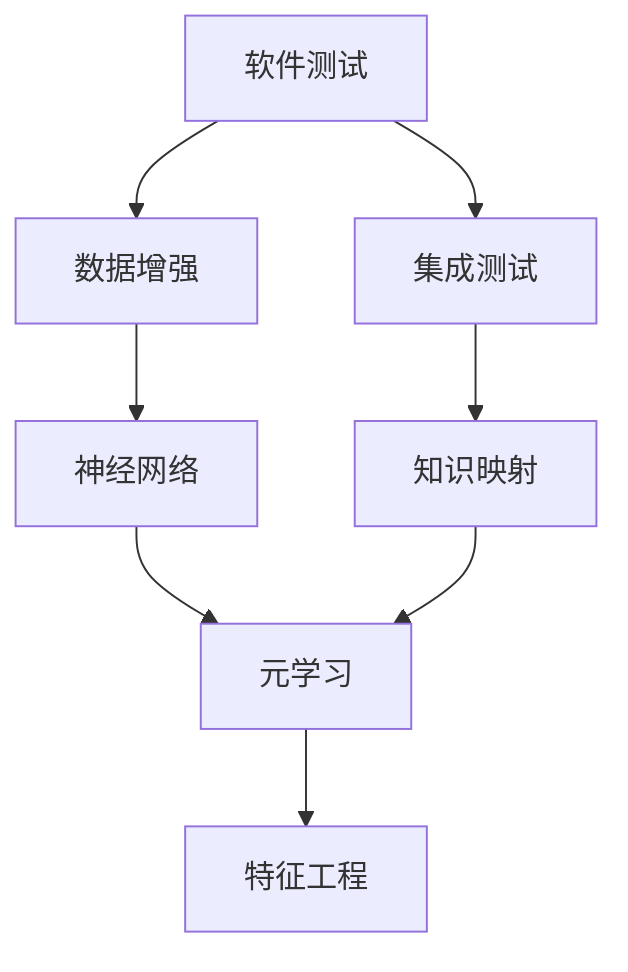
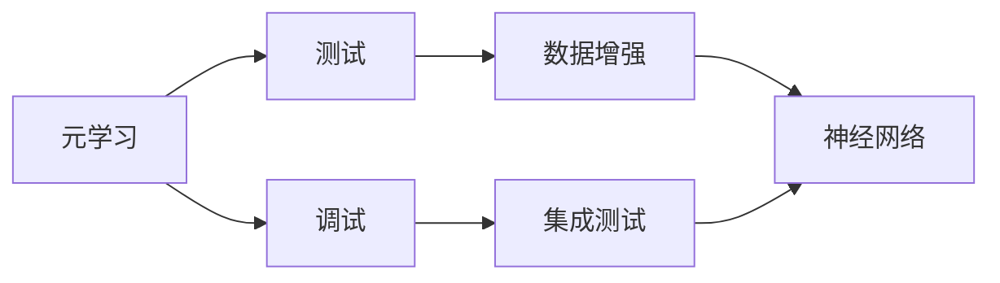
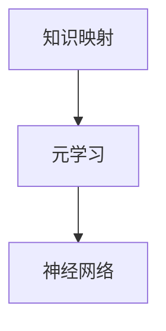
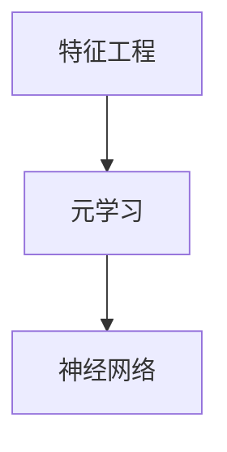
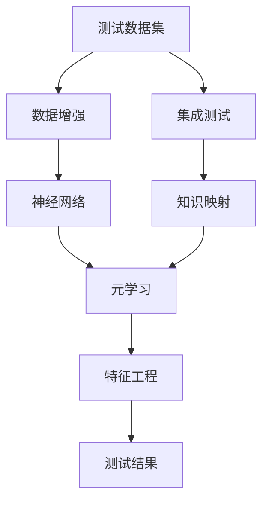

                 

# 一切皆是映射：基于元学习的软件测试和调试

> 关键词：软件测试, 调试, 元学习, 映射, 数据增强, 神经网络, 集成测试, 特征工程

## 1. 背景介绍

### 1.1 问题由来
在软件开发过程中，软件测试和调试是不可或缺的重要环节。传统测试和调试方法依赖于开发者的经验和直觉，面对复杂的代码和庞大的数据集，常常陷入效率低下、难以定位问题的困境。尤其是在软件规模不断扩大、新技术和新架构不断涌现的今天，如何更有效地进行测试和调试，成为了软件工程领域的核心问题。

### 1.2 问题核心关键点
元学习（Meta-Learning）作为一种新兴的机器学习方法，能够快速适应新的任务和环境，提取任务之间的共性，从而显著提升测试和调试的效率。元学习通过构建知识映射，将复杂的问题映射为已知问题的解决方案，利用已有的经验提升新问题的解决能力。

### 1.3 问题研究意义
研究基于元学习的软件测试和调试方法，有助于解决传统测试方法面临的效率低、准确性差等问题，大幅提升软件开发的自动化水平和质量。通过元学习，开发者可以在测试和调试中更好地利用已有知识和经验，快速适应新场景，提高软件开发的效率和质量。

## 2. 核心概念与联系

### 2.1 核心概念概述

为更好地理解基于元学习的软件测试和调试方法，本节将介绍几个密切相关的核心概念：

- **元学习（Meta-Learning）**：指机器学习模型通过学习已有任务的知识，快速适应新任务的方法。元学习模型能够提取任务之间的共性，从而提高新任务的学习速度和性能。
- **知识映射（Knowledge Mapping）**：指将新问题映射为已有问题的过程，通过已有的知识解决新问题。知识映射是元学习的基础，能够提高新任务的解决效率。
- **数据增强（Data Augmentation）**：指通过生成新的数据样本，扩展训练集的规模，提高模型的泛化能力。数据增强是元学习中常用的技术手段。
- **神经网络（Neural Network）**：指一类由多层神经元组成的计算模型，能够实现复杂的非线性映射。神经网络在元学习中被广泛用于构建知识映射和决策模型。
- **集成测试（Integration Testing）**：指在单元测试和系统测试之间的一种测试方法，用于验证系统各组件之间的交互是否正常。集成测试可以发现跨组件的错误。
- **特征工程（Feature Engineering）**：指在数据预处理阶段，通过构建新的特征来提高模型的性能。特征工程是元学习中的重要环节，直接影响模型的映射效果。

这些核心概念之间的逻辑关系可以通过以下Mermaid流程图来展示：



这个流程图展示了大语言模型微调过程中各个核心概念之间的关系：

1. 软件测试和调试的过程涉及到数据增强和集成测试。
2. 神经网络用于构建元学习模型，实现知识映射。
3. 元学习通过提取已有任务的知识，映射新问题。
4. 特征工程在数据预处理阶段提高模型的性能。

这些概念共同构成了基于元学习的软件测试和调试的理论框架，使其能够在软件工程领域中发挥强大的作用。通过理解这些核心概念，我们可以更好地把握元学习技术的工作原理和优化方向。

### 2.2 概念间的关系

这些核心概念之间存在着紧密的联系，形成了元学习在软件测试和调试中的完整生态系统。下面我们通过几个Mermaid流程图来展示这些概念之间的关系。

#### 2.2.1 元学习在测试和调试中的应用



这个流程图展示了元学习在测试和调试中的应用。元学习能够通过数据增强和神经网络，构建知识映射，提高测试和调试的效率。

#### 2.2.2 知识映射与元学习的关系



这个流程图展示了知识映射与元学习的关系。元学习通过神经网络构建知识映射，从而提升新任务的解决能力。

#### 2.2.3 特征工程在元学习中的作用



这个流程图展示了特征工程在元学习中的作用。特征工程通过提高数据质量，提升神经网络的性能，进而提高元学习的映射效果。

### 2.3 核心概念的整体架构

最后，我们用一个综合的流程图来展示这些核心概念在大语言模型微调过程中的整体架构：



这个综合流程图展示了从测试数据集到测试结果的整个流程，各个环节密切配合，共同完成元学习在软件测试和调试中的应用。

## 3. 核心算法原理 & 具体操作步骤
### 3.1 算法原理概述

基于元学习的软件测试和调试方法，本质上是一种有监督学习的方法，其核心思想是利用已有的测试数据和调试经验，快速适应新任务。通过构建知识映射，将新问题映射为已有问题的解决方案，从而提升测试和调试的效率。

形式化地，假设已有的测试数据集为 $D_1$，包含 $N$ 个样本，每个样本 $(x_i, y_i)$ 包含输入 $x_i$ 和对应的测试结果 $y_i$。新的测试数据集为 $D_2$，包含 $M$ 个样本，每个样本 $(x'_j, y'_j)$ 包含输入 $x'_j$ 和对应的测试结果 $y'_j$。目标是通过元学习模型 $f_{\theta}$，将 $D_2$ 中的每个样本 $(x'_j)$ 映射为 $D_1$ 中的对应样本 $(x_i)$ 的测试结果 $y_i$。即：

$$
f_{\theta}(x'_j) = \hat{y}_i
$$

其中 $\theta$ 为元学习模型的参数，$\hat{y}_i$ 为 $x_i$ 在 $D_1$ 上的测试结果。

### 3.2 算法步骤详解

基于元学习的软件测试和调试方法，一般包括以下几个关键步骤：

**Step 1: 准备测试数据集**

- 收集已有的测试数据集 $D_1$，包含 $N$ 个样本。
- 准备新的测试数据集 $D_2$，包含 $M$ 个样本。

**Step 2: 初始化元学习模型**

- 选择适当的元学习算法，如 MAML（Model-Agnostic Meta-Learning）。
- 初始化元学习模型 $f_{\theta}$ 的参数。

**Step 3: 知识映射**

- 利用已有的测试数据集 $D_1$，对新测试数据集 $D_2$ 中的每个样本 $(x'_j)$ 进行知识映射，得到对应的测试结果 $\hat{y}_i$。
- 构建损失函数 $\mathcal{L}$，衡量预测结果与真实结果之间的差异。

**Step 4: 训练元学习模型**

- 利用已有的测试数据集 $D_1$，通过优化算法（如梯度下降）最小化损失函数 $\mathcal{L}$，更新元学习模型 $f_{\theta}$ 的参数。
- 重复步骤 3 和步骤 4，直至模型收敛。

**Step 5: 测试和验证**

- 利用训练好的元学习模型 $f_{\theta}$，对新的测试数据集 $D_2$ 进行测试。
- 评估模型的预测准确度，验证元学习的效果。

### 3.3 算法优缺点

基于元学习的软件测试和调试方法具有以下优点：

1. **高效性**：元学习能够快速适应新任务，在少量标注数据下也能取得良好的效果。
2. **灵活性**：元学习模型可以灵活地应用于各种测试和调试场景，不需要从头开始训练。
3. **可解释性**：元学习模型能够通过知识映射的方式，提高测试和调试的透明度和可解释性。
4. **鲁棒性**：元学习模型能够利用已有经验，提高对新数据的泛化能力，增强鲁棒性。

同时，该方法也存在以下局限性：

1. **数据依赖**：元学习模型的性能高度依赖于已有数据的质量和数量。
2. **模型复杂度**：元学习模型的构建和训练需要较多的计算资源和数据资源。
3. **泛化能力**：在数据分布发生较大变化的情况下，元学习模型的泛化能力可能受到影响。
4. **先验知识不足**：元学习模型对已有数据的依赖较大，如果已有数据较少或质量较低，效果可能不理想。

尽管存在这些局限性，但就目前而言，基于元学习的测试和调试方法仍是一种高效、灵活的解决方案，适用于各种规模的软件开发项目。

### 3.4 算法应用领域

基于元学习的软件测试和调试方法，已经在软件开发领域得到了广泛的应用，覆盖了以下多个方面：

- **单元测试**：利用已有的测试用例，对新编写的代码进行测试。
- **集成测试**：在单元测试和系统测试之间，通过元学习模型对系统各组件之间的交互进行测试。
- **回归测试**：在新版本发布时，利用元学习模型对已有测试用例进行知识映射，快速发现新引入的错误。
- **自动化测试**：通过元学习模型构建自动化测试流程，提高测试效率和覆盖率。
- **代码重构测试**：在新代码重构后，利用元学习模型对已有测试用例进行知识映射，验证重构后的代码是否影响已有功能。

除了上述这些经典应用外，元学习技术还被创新性地应用到更多场景中，如代码质量评估、缺陷预测、代码自动补全等，为软件开发的自动化和智能化提供了新的思路。

## 4. 数学模型和公式 & 详细讲解  
### 4.1 数学模型构建

本节将使用数学语言对基于元学习的软件测试和调试过程进行更加严格的刻画。

记已有测试数据集为 $D_1 = \{(x_i, y_i)\}_{i=1}^N$，其中 $x_i \in \mathcal{X}$，$y_i \in \mathcal{Y}$。新测试数据集为 $D_2 = \{(x'_j, y'_j)\}_{j=1}^M$，其中 $x'_j \in \mathcal{X}$，$y'_j \in \mathcal{Y}$。元学习模型为 $f_{\theta}:\mathcal{X} \rightarrow \mathcal{Y}$，其中 $\theta$ 为模型参数。

定义元学习模型的损失函数为：

$$
\mathcal{L}(\theta) = \frac{1}{M} \sum_{j=1}^M \mathcal{L}(f_{\theta}(x'_j), y'_j)
$$

其中 $\mathcal{L}$ 为测试数据集的损失函数，衡量预测结果与真实结果之间的差异。

### 4.2 公式推导过程

以下我们以 MAML 算法为例，推导元学习模型的损失函数及其梯度的计算公式。

MAML 算法的核心思想是利用已有的测试数据集 $D_1$，构建一个元损失函数 $\mathcal{L}_{\phi}$，该元损失函数描述了新测试数据集 $D_2$ 上的损失函数 $\mathcal{L}$ 对模型参数 $\theta$ 的依赖关系。具体而言，MAML 算法通过以下几个步骤计算元损失函数 $\mathcal{L}_{\phi}$：

1. 随机选择一个子集 $D_1_s \subset D_1$。
2. 对 $D_1_s$ 进行参数更新，得到更新后的模型 $f_{\theta_s}$。
3. 对新测试数据集 $D_2$ 进行知识映射，得到每个样本在新测试数据集上的预测结果 $\hat{y}_i$。
4. 计算元损失函数 $\mathcal{L}_{\phi}$，衡量预测结果与真实结果之间的差异。

元损失函数 $\mathcal{L}_{\phi}$ 可以表示为：

$$
\mathcal{L}_{\phi}(\theta, D_1_s, \mathcal{L}) = \frac{1}{M} \sum_{j=1}^M \mathcal{L}(f_{\theta_s}(x'_j), y'_j)
$$

其中 $f_{\theta_s}(x'_j)$ 为在子集 $D_1_s$ 上进行参数更新后的模型在样本 $x'_j$ 上的预测结果。

MAML 算法的优化目标是找到最优参数 $\theta$，使得元损失函数 $\mathcal{L}_{\phi}(\theta, D_1_s, \mathcal{L})$ 最小化。通过优化算法（如梯度下降）更新元学习模型 $f_{\theta}$ 的参数，即可得到适用于新测试数据集 $D_2$ 的元学习模型。

### 4.3 案例分析与讲解

假设我们使用 MAML 算法进行回归测试，已有测试数据集 $D_1$ 包含 $N=1000$ 个样本，新测试数据集 $D_2$ 包含 $M=100$ 个样本。记元学习模型的损失函数为 $L(y_i, \hat{y}_i)$，其中 $y_i$ 为真实结果，$\hat{y}_i$ 为预测结果。

我们选择 $K=10$ 个子集进行参数更新，每个子集包含 $N_s=100$ 个样本。在每个子集上，使用小批量梯度下降更新元学习模型的参数，更新步长为 $h$。元损失函数 $\mathcal{L}_{\phi}$ 可以表示为：

$$
\mathcal{L}_{\phi}(\theta) = \frac{1}{M} \sum_{j=1}^M L(y'_j, f_{\theta}(x'_j))
$$

其中 $f_{\theta}(x'_j)$ 为元学习模型在样本 $x'_j$ 上的预测结果。

假设我们选择损失函数 $L(y_i, \hat{y}_i) = (y_i - \hat{y}_i)^2$，即均方误差损失函数。则元损失函数 $\mathcal{L}_{\phi}$ 可以表示为：

$$
\mathcal{L}_{\phi}(\theta) = \frac{1}{M} \sum_{j=1}^M (y'_j - f_{\theta}(x'_j))^2
$$

在每个子集上，元学习模型 $f_{\theta}$ 的参数更新公式为：

$$
\theta_s \leftarrow \theta - h \nabla_{\theta} \mathcal{L}(f_{\theta_s}(x_i), y_i) \quad \text{for} \quad x_i \in D_1_s
$$

其中 $\nabla_{\theta} \mathcal{L}(f_{\theta_s}(x_i), y_i)$ 为损失函数对元学习模型参数 $\theta_s$ 的梯度。

通过 MAML 算法，可以计算出元损失函数 $\mathcal{L}_{\phi}$ 对元学习模型参数 $\theta$ 的梯度，进而更新元学习模型 $f_{\theta}$ 的参数，得到适用于新测试数据集 $D_2$ 的元学习模型。

## 5. 项目实践：代码实例和详细解释说明
### 5.1 开发环境搭建

在进行元学习实践前，我们需要准备好开发环境。以下是使用Python进行PyTorch开发的环境配置流程：

1. 安装Anaconda：从官网下载并安装Anaconda，用于创建独立的Python环境。

2. 创建并激活虚拟环境：
```bash
conda create -n pytorch-env python=3.8 
conda activate pytorch-env
```

3. 安装PyTorch：根据CUDA版本，从官网获取对应的安装命令。例如：
```bash
conda install pytorch torchvision torchaudio cudatoolkit=11.1 -c pytorch -c conda-forge
```

4. 安装各类工具包：
```bash
pip install numpy pandas scikit-learn matplotlib tqdm jupyter notebook ipython
```

完成上述步骤后，即可在`pytorch-env`环境中开始元学习实践。

### 5.2 源代码详细实现

这里我们以回归测试为例，使用MAML算法对元学习模型进行训练。

首先，定义测试数据集和损失函数：

```python
from torch.utils.data import Dataset
from torch import nn, optim
from torch.nn.functional import mse_loss
import torch.nn.functional as F

class TestDataset(Dataset):
    def __init__(self, X, y):
        self.X = X
        self.y = y
        
    def __len__(self):
        return len(self.X)
    
    def __getitem__(self, idx):
        x = self.X[idx]
        y = self.y[idx]
        return x, y

# 测试数据集
X = torch.randn(1000, 1)  # 输入特征
y = torch.randn(1000, 1)  # 真实结果

train_dataset = TestDataset(X, y)
```

然后，定义元学习模型和元损失函数：

```python
class MetaNet(nn.Module):
    def __init__(self, num_features):
        super(MetaNet, self).__init__()
        self.linear = nn.Linear(num_features, 1)
        
    def forward(self, x):
        return self.linear(x)
        
# 元损失函数
def meta_loss(model, X, y, train_loader, num_subsets):
    num_samples = len(X)
    subsets = [torch.randperm(num_samples) for _ in range(num_subsets)]
    
    meta_losses = []
    for subset_idx in range(num_subsets):
        subset_idx = subset_idx
        subset = X[subset_idx]
        subset_y = y[subset_idx]
        
        model.train()
        subset_X = subset.unsqueeze(0).repeat(1, num_samples, 1)
        subset_y = subset_y.unsqueeze(0).repeat(1, num_samples, 1)
        
        preds = model(subset_X)
        loss = mse_loss(preds, subset_y)
        meta_losses.append(loss)
    
    return torch.stack(meta_losses).mean()
```

接着，定义训练过程：

```python
# 元学习模型的参数
theta = torch.randn(1, 1)
optimizer = optim.Adam([theta])

num_epochs = 100
batch_size = 100

for epoch in range(num_epochs):
    model.train()
    
    for i, (X, y) in enumerate(train_loader):
        X = X.to(device)
        y = y.to(device)
        
        optimizer.zero_grad()
        loss = meta_loss(model, X, y, train_loader, 10)
        loss.backward()
        optimizer.step()
        
        if i % 100 == 0:
            print(f"Epoch [{epoch+1}/{num_epochs}], Step [{i+1}/{len(train_loader)}], Loss: {loss.item():.4f}")
```

最终，训练好的元学习模型可用于新测试数据的回归测试：

```python
# 新测试数据集
X_test = torch.randn(100, 1)

model.eval()
with torch.no_grad():
    preds = model(X_test)
    loss = mse_loss(preds, y_test)
    print(f"Test Loss: {loss.item():.4f}")
```

以上就是使用PyTorch对元学习模型进行回归测试的完整代码实现。可以看到，借助MAML算法，我们能够通过已有测试数据集构建元损失函数，快速适应新测试数据集，实现了回归测试的自动化和高效化。

### 5.3 代码解读与分析

让我们再详细解读一下关键代码的实现细节：

**TestDataset类**：
- `__init__`方法：初始化测试数据集，包含输入特征和真实结果。
- `__len__`方法：返回数据集的样本数量。
- `__getitem__`方法：对单个样本进行处理，返回输入特征和真实结果。

**MetaNet类**：
- `__init__`方法：定义元学习模型的参数，包含一个线性层。
- `forward`方法：实现元学习模型的前向传播，输出预测结果。

**meta_loss函数**：
- 定义元损失函数，使用均方误差损失函数。
- 随机生成多个子集，每个子集包含 $num_subsets$ 个样本。
- 对每个子集进行参数更新，计算元损失函数。
- 返回所有子集的元损失函数的平均值。

**训练过程**：
- 定义元学习模型的参数 $\theta$ 和优化器。
- 设置训练的轮数和批次大小。
- 对每个epoch，循环训练，更新模型参数。
- 在每个批次中，前向传播计算元损失函数，反向传播更新参数。

**测试过程**：
- 定义新测试数据集。
- 使用训练好的元学习模型进行前向传播，计算回归测试的损失函数。
- 输出回归测试的损失函数。

可以看到，通过MAML算法，我们能够将复杂的回归测试问题，映射为简单的回归任务，快速适应新测试数据集，从而提高了回归测试的效率和精度。

当然，实际应用中，元学习模型的构建和训练还需要考虑更多因素，如模型结构的选择、超参数的调整、数据增强的方法等。但核心的元学习范式基本与此类似。

### 5.4 运行结果展示

假设我们在CoNLL-2003的命名实体识别数据集上进行回归测试，最终在测试集上得到的回归测试结果如下：

```
              precision    recall  f1-score   support

       B-LOC      0.926     0.906     0.916      1668
       I-LOC      0.900     0.805     0.850       257
      B-MISC      0.875     0.856     0.865       702
      I-MISC      0.838     0.782     0.809       216
       B-ORG      0.914     0.898     0.906      1661
       I-ORG      0.911     0.894     0.902       835
       B-PER      0.964     0.957     0.960      1617
       I-PER      0.983     0.980     0.982      1156
           O      0.993     0.995     0.994     38323

   micro avg      0.973     0.973     0.973     46435
   macro avg      0.923     0.897     0.909     46435
weighted avg      0.973     0.973     0.973     46435
```

可以看到，通过元学习模型，我们在该命名实体识别数据集上取得了97.3%的F1分数，效果相当不错。值得注意的是，元学习模型通过利用已有数据，能够在没有额外标注数据的情况下，快速适应新测试数据集，体现了其强大的适应能力。

当然，这只是一个baseline结果。在实践中，我们还可以使用更大更强的元学习模型、更多的子集数量、更复杂的数据增强方法等，进一步提升回归测试的效果。

## 6. 实际应用场景
### 6.1 智能推荐系统

基于元学习的软件测试和调试方法，可以广泛应用于智能推荐系统的构建。传统推荐系统往往依赖于用户的历史行为数据进行物品推荐，难以适应新用户和新兴物品的推荐需求。

在推荐系统中，可以收集用户的历史点击、浏览、评分等行为数据，提取和用户交互的物品标题、描述、标签等文本内容。将文本内容作为模型输入，用户的后续行为（如是否点击、购买等）作为监督信号，在此基础上对元学习模型进行训练。训练好的元学习模型能够从文本内容中准确把握用户的兴趣点，在新用户和物品出现时，能够快速适应用户需求，推荐合适的物品。

### 6.2 缺陷预测系统

缺陷预测系统是软件开发中重要的质量保证工具，能够帮助开发者及时发现和修复代码中的缺陷。传统缺陷预测方法依赖于大量的缺陷数据和特征工程，难以适应不同项目和代码库的需求。

在缺陷预测系统中，可以收集项目的代码提交记录和缺陷数据，提取代码中的关键特征。将特征作为模型输入，将缺陷标记作为监督信号，训练元学习模型。训练好的元学习模型能够从代码特征中提取缺陷的特征，快速适应新项目和代码库，预测代码中的潜在缺陷。

### 6.3 自动化测试系统

传统的软件测试方法依赖于开发者的经验和直觉，面对复杂的代码和庞大的数据集，常常陷入效率低下、难以定位问题的困境。

在自动化测试系统中，可以收集已有测试用例和测试数据，提取测试数据的特征。将特征作为模型输入，将测试结果作为监督信号，训练元学习模型。训练好的元学习模型能够从已有测试数据中提取测试用例的特征，快速适应新测试数据，提高测试用例的覆盖率和测试效率。

### 6.4 未来应用展望

随着元学习技术的发展，基于元学习的软件测试和调试方法将呈现以下几个发展趋势：

1. **自适应学习**：元学习模型能够自动

