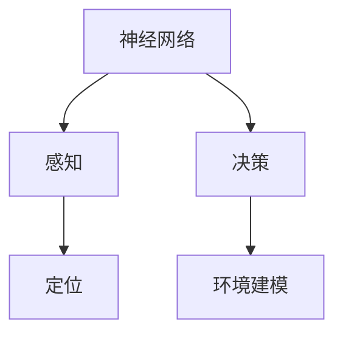
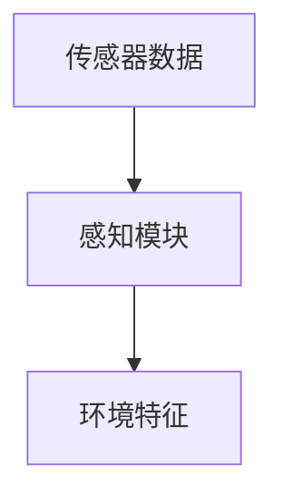
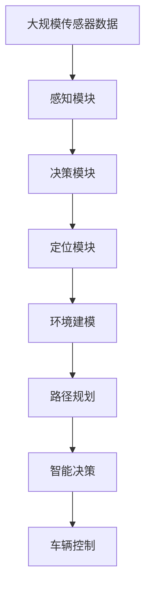

                 

# 一切皆是映射：无人驾驶车辆中的神经网络系统

> 关键词：无人驾驶,神经网络,车辆感知,智能决策,高精度定位,环境建模

## 1. 背景介绍

### 1.1 问题由来
随着自动驾驶技术的快速发展，无人驾驶车辆已经从概念走向现实。但无人驾驶的核心问题——感知、决策和定位——仍然充满挑战。尤其是在复杂的城市环境中，如何精准感知周围环境，并做出快速、安全、合理的决策，是实现无人驾驶的关键。近年来，深度学习技术在无人驾驶领域得到了广泛应用，神经网络系统成为解决感知和决策问题的有力工具。本文将重点介绍神经网络系统在无人驾驶中的应用，探讨其核心原理和实际效果。

### 1.2 问题核心关键点
神经网络系统在无人驾驶中的应用主要体现在感知、决策和定位三个方面。感知是指利用神经网络对车辆周围环境进行准确识别和分类，包括目标检测、车道线检测、交通信号识别等；决策是指利用神经网络对感知结果进行处理，规划最优路径，避免碰撞等；定位是指利用神经网络对车辆位置进行高精度估计，确保行驶的准确性。

神经网络系统通过复杂的非线性映射，将高维输入数据映射到低维输出，实现对复杂环境的理解和处理。其核心优势在于通过大量训练数据不断优化自身，具备强大的泛化能力，能够在实际环境中有效运行。

### 1.3 问题研究意义
神经网络系统在无人驾驶中的应用，有助于提高车辆的感知和决策能力，确保行驶安全，降低交通事故率。同时，通过优化网络结构和训练方法，可以提高定位精度，提升无人驾驶的稳定性和可靠性。神经网络系统的研究与应用，对推动自动驾驶技术的落地和普及具有重要意义。

## 2. 核心概念与联系

### 2.1 核心概念概述

为更好地理解神经网络系统在无人驾驶中的应用，本节将介绍几个密切相关的核心概念：

- **神经网络(Neural Network)**：由多个神经元（节点）组成的网络结构，通过学习数据特征，实现非线性映射。在无人驾驶中，神经网络主要用于环境感知和决策。

- **感知(Perception)**：指无人驾驶车辆对周围环境的识别和分类，包括目标检测、车道线识别、交通信号识别等。

- **决策(Decision Making)**：指无人驾驶车辆根据感知结果，规划最优路径、避免碰撞等，是决策的核心部分。

- **定位(Localization)**：指无人驾驶车辆对自身位置的精确估计，确保行驶的准确性。

- **高精度定位(High Precision Localization)**：指在复杂环境中，对车辆位置进行高精度估计，确保在无人驾驶中的准确性和安全性。

- **环境建模(Environment Modeling)**：指构建车辆周围环境的模型，包括道路、车辆、行人、交通信号灯等，以便进行路径规划和决策。

这些核心概念之间的逻辑关系可以通过以下Mermaid流程图来展示：



这个流程图展示了大语言模型微调过程中各个核心概念的关系和作用：

1. 神经网络作为感知和决策的核心工具。
2. 感知模块负责环境识别和分类，为决策提供基础。
3. 决策模块根据感知结果，规划最优路径，确保安全。
4. 定位模块对车辆位置进行精确估计，确保行驶准确。
5. 环境建模模块为决策和定位提供环境模型，增强系统的泛化能力。

### 2.2 概念间的关系

这些核心概念之间存在着紧密的联系，形成了无人驾驶技术的应用框架。下面我们通过几个Mermaid流程图来展示这些概念之间的关系。

#### 2.2.1 神经网络系统的工作流程


这个流程图展示了神经网络系统的工作流程：

1. 输入数据经过神经网络的特征提取层，提取特征表示。
2. 特征表示经过高层次表示层，进一步抽象为高维语义信息。
3. 高层次表示层输出最终结果，用于环境识别、路径规划等任务。

#### 2.2.2 感知模块的输入与输出



这个流程图展示了感知模块的输入与输出：

1. 传感器数据（如激光雷达、摄像头、雷达等）输入感知模块。
2. 感知模块对传感器数据进行处理，输出环境特征。

#### 2.2.3 决策模块的输入与输出


这个流程图展示了决策模块的输入与输出：

1. 感知结果输入决策模块。
2. 决策模块根据感知结果，输出路径规划结果。

#### 2.2.4 定位模块的输入与输出


这个流程图展示了定位模块的输入与输出：

1. 传感器数据输入定位模块。
2. 定位模块输出车辆位置估计结果。

#### 2.2.5 环境建模的输入与输出


这个流程图展示了环境建模的输入与输出：

1. 传感器数据输入环境建模模块。
2. 环境建模模块输出环境模型，用于路径规划和决策。

### 2.3 核心概念的整体架构

最后，我们用一个综合的流程图来展示这些核心概念在大语言模型微调过程中的整体架构：



这个综合流程图展示了从传感器数据输入到车辆控制的完整流程：

1. 传感器数据输入感知模块，输出环境特征。
2. 环境特征输入决策模块，输出路径规划结果。
3. 路径规划结果输入定位模块，输出车辆位置估计。
4. 车辆位置估计输入环境建模模块，输出环境模型。
5. 环境模型输入路径规划模块，输出最优路径。
6. 最优路径输入智能决策模块，输出智能决策结果。
7. 智能决策结果输入车辆控制模块，完成车辆控制。

通过这些流程图，我们可以更清晰地理解神经网络系统在大语言模型微调过程中的各个环节，为后续深入讨论具体的感知和决策方法奠定基础。

## 3. 核心算法原理 & 具体操作步骤
### 3.1 算法原理概述

神经网络系统在无人驾驶中的应用，主要依赖于感知、决策和定位三大模块的协同工作。其核心算法原理主要包括：

- **卷积神经网络(CNN)**：用于目标检测和车道线识别，提取空间局部特征。
- **循环神经网络(RNN)**：用于交通信号识别和预测，处理序列数据。
- **长短期记忆网络(LSTM)**：用于路径规划和决策，处理长期依赖关系。
- **深度神经网络(DNN)**：用于环境建模和定位，提取高维特征表示。

这些算法通过复杂的非线性映射，将高维输入数据映射到低维输出，实现对复杂环境的理解和处理。其核心优势在于通过大量训练数据不断优化自身，具备强大的泛化能力，能够在实际环境中有效运行。

### 3.2 算法步骤详解

基于神经网络系统在无人驾驶中的应用，本节将详细讲解其核心算法步骤：

**Step 1: 准备数据集**

- 收集无人驾驶车辆所需的传感器数据，如激光雷达、摄像头、雷达等。
- 将传感器数据进行预处理，如图像的灰度化、归一化、裁剪等，确保数据的一致性和可用性。
- 将预处理后的数据划分为训练集、验证集和测试集，用于模型训练、调参和评估。

**Step 2: 设计神经网络架构**

- 根据具体任务的需求，选择或设计合适的神经网络架构。例如，对于目标检测任务，可以使用Faster R-CNN等CNN架构；对于车道线识别任务，可以使用CRNN等RNN架构。
- 在网络结构中添加必要的正则化技术，如Dropout、L2正则等，防止过拟合。
- 设计合适的损失函数，如交叉熵损失、均方误差损失等，用于训练和评估模型。

**Step 3: 训练模型**

- 使用训练集数据对神经网络模型进行训练，通过反向传播算法更新模型参数，最小化损失函数。
- 在训练过程中，周期性在验证集上评估模型性能，根据性能指标决定是否调整模型超参数。
- 重复上述步骤直至满足预设的迭代轮数或性能要求。

**Step 4: 模型评估和测试**

- 在测试集上对训练好的模型进行评估，使用准确率、召回率、F1分数等指标衡量模型性能。
- 根据评估结果，进一步调整模型结构和超参数，直到达到满意的性能。

**Step 5: 模型部署和优化**

- 将训练好的模型部署到实际应用环境中，进行实时数据输入和处理。
- 根据实际运行情况，优化模型参数和网络结构，提升性能和鲁棒性。
- 持续收集新数据，定期重新训练和优化模型，以适应环境变化。

以上是神经网络系统在无人驾驶中的应用核心算法步骤，通过系统化的训练和优化，可以构建高效的感知和决策系统。

### 3.3 算法优缺点

神经网络系统在无人驾驶中的应用具有以下优点：

1. **高效性**：通过大量训练数据不断优化自身，具备强大的泛化能力，能够在实际环境中有效运行。
2. **鲁棒性**：通过复杂的非线性映射，对噪声和扰动具有较强的鲁棒性。
3. **可解释性**：神经网络通过可视化技术（如梯度热图、激活图等），可以直观地理解模型内部的特征提取和决策过程。

同时，神经网络系统在实际应用中也存在一些缺点：

1. **高计算资源需求**：神经网络模型参数量大，计算复杂度高，需要高性能计算资源。
2. **数据需求量大**：需要大量标注数据进行训练，数据获取和标注成本较高。
3. **模型可解释性不足**：神经网络作为"黑盒"系统，难以解释其内部决策逻辑。

尽管存在这些缺点，但神经网络系统在无人驾驶中的应用仍具有显著的优势，是实现高精度感知和智能决策的重要工具。

### 3.4 算法应用领域

神经网络系统在无人驾驶中的应用涵盖了多个领域，例如：

- **目标检测**：用于识别道路上的车辆、行人、交通标志等，确保行车安全。
- **车道线检测**：用于识别和绘制道路的车道线，辅助车辆的路径规划。
- **交通信号识别**：用于识别交通信号灯的颜色和状态，实现智能交通管理。
- **路径规划**：用于生成最优路径，避免碰撞和拥堵，提高驾驶效率。
- **高精度定位**：用于估计车辆位置，确保行驶准确性。

除了无人驾驶领域，神经网络系统在其他自动化和智能化场景中也有广泛应用，如医疗影像分析、智能安防、智能家居等。

## 4. 数学模型和公式 & 详细讲解 & 举例说明

### 4.1 数学模型构建

本节将使用数学语言对神经网络系统在无人驾驶中的应用进行更加严格的刻画。

设神经网络系统用于目标检测任务，输入数据为传感器数据 $x \in \mathbb{R}^n$，输出为检测结果 $y \in \{0,1\}$，其中0表示未检测到目标，1表示检测到目标。

定义神经网络模型为 $f(x;\theta)$，其中 $\theta$ 为模型参数，$f(x;\theta)$ 为输入 $x$ 和模型参数 $\theta$ 的映射关系。

假设神经网络模型为多层感知器(Multilayer Perceptron, MLP)，其结构为 $[3,128,64,32,1]$，表示输入层有3个神经元，隐藏层分别为128、64、32个神经元，输出层为1个神经元。

数学模型构建如下：

$$
f(x;\theta) = \sigma(\mathbf{W}^{(5)} \sigma(\mathbf{W}^{(4)} \sigma(\mathbf{W}^{(3)} \sigma(\mathbf{W}^{(2)} \sigma(\mathbf{W}^{(1)} x)))
$$

其中 $\sigma$ 为激活函数，$\mathbf{W}^{(i)}$ 为第 $i$ 层的权重矩阵，$x$ 为输入数据。

### 4.2 公式推导过程

假设目标检测任务的损失函数为二元交叉熵损失函数，则目标检测模型的训练目标为：

$$
\mathcal{L}(\theta) = -\frac{1}{N}\sum_{i=1}^N [y_i \log f(x_i;\theta) + (1-y_i) \log (1-f(x_i;\theta))]
$$

其中 $N$ 为样本数量，$y_i$ 为第 $i$ 个样本的标签，$f(x_i;\theta)$ 为第 $i$ 个样本的预测结果。

根据梯度下降优化算法，神经网络模型的训练过程可以表示为：

$$
\theta \leftarrow \theta - \eta \nabla_{\theta} \mathcal{L}(\theta)
$$

其中 $\eta$ 为学习率，$\nabla_{\theta} \mathcal{L}(\theta)$ 为损失函数对模型参数 $\theta$ 的梯度。

在实际训练过程中，神经网络模型通常会使用随机梯度下降(SGD)算法，对每个样本进行单独的梯度计算和参数更新。

### 4.3 案例分析与讲解

以目标检测为例，我们详细讲解神经网络系统的实现过程。

**数据预处理**：将传感器数据进行预处理，如图像的灰度化、归一化、裁剪等，确保数据的一致性和可用性。

**模型设计**：设计一个简单的多层感知器模型，结构为 $[3,128,64,32,1]$。使用ReLU激活函数，输出层为sigmoid函数。

**模型训练**：使用交叉熵损失函数，通过反向传播算法更新模型参数。在训练过程中，周期性在验证集上评估模型性能，根据性能指标决定是否调整模型超参数。

**模型评估**：在测试集上对训练好的模型进行评估，使用准确率、召回率、F1分数等指标衡量模型性能。

以下是目标检测任务的详细代码实现，使用TensorFlow框架：

```python
import tensorflow as tf
from tensorflow.keras import layers

# 定义目标检测模型的结构
model = tf.keras.Sequential([
    layers.Dense(128, activation='relu', input_shape=(3,)),
    layers.Dense(64, activation='relu'),
    layers.Dense(32, activation='relu'),
    layers.Dense(1, activation='sigmoid')
])

# 定义损失函数和优化器
loss = tf.keras.losses.BinaryCrossentropy()
optimizer = tf.keras.optimizers.Adam()

# 定义数据预处理函数
def preprocess(data):
    # 对图像进行灰度化、归一化、裁剪等预处理
    return tf.image.resize(data, (128, 128)) / 255

# 定义训练过程
@tf.function
def train(data, label):
    with tf.GradientTape() as tape:
        pred = model(data, training=True)
        loss_value = loss(label, pred)
    gradients = tape.gradient(loss_value, model.trainable_variables)
    optimizer.apply_gradients(zip(gradients, model.trainable_variables))

# 训练模型
for epoch in range(epochs):
    for data, label in train_dataset:
        data = preprocess(data)
        train(data, label)

# 评估模型
test_loss = model.evaluate(test_dataset)
print("Test Loss:", test_loss)
```

通过上述代码，我们可以看到神经网络系统在目标检测任务中的实现过程，包括数据预处理、模型设计、训练过程和评估过程。通过系统化的训练和优化，可以构建高效的感知和决策系统。

## 5. 项目实践：代码实例和详细解释说明

### 5.1 开发环境搭建

在进行神经网络系统开发前，我们需要准备好开发环境。以下是使用Python进行TensorFlow开发的环境配置流程：

1. 安装Anaconda：从官网下载并安装Anaconda，用于创建独立的Python环境。

2. 创建并激活虚拟环境：
```bash
conda create -n tf-env python=3.8 
conda activate tf-env
```

3. 安装TensorFlow：根据CUDA版本，从官网获取对应的安装命令。例如：
```bash
conda install tensorflow tensorflow-gpu=2.7 -c tf -c conda-forge
```

4. 安装TensorBoard：用于可视化训练过程和模型性能。
```bash
pip install tensorboard
```

5. 安装其它辅助库：
```bash
pip install numpy pandas matplotlib jupyter notebook
```

完成上述步骤后，即可在`tf-env`环境中开始神经网络系统开发。

### 5.2 源代码详细实现

以下以目标检测任务为例，给出使用TensorFlow进行神经网络系统开发的完整代码实现。

首先，定义目标检测任务的训练集和测试集：

```python
import numpy as np
import matplotlib.pyplot as plt

# 定义目标检测任务的训练集和测试集
train_dataset = tf.data.Dataset.from_tensor_slices((train_images, train_labels))
train_dataset = train_dataset.shuffle(1000).batch(32).map(preprocess)

test_dataset = tf.data.Dataset.from_tensor_slices((test_images, test_labels))
test_dataset = test_dataset.batch(32).map(preprocess)
```

然后，定义模型和优化器：

```python
# 定义目标检测模型的结构
model = tf.keras.Sequential([
    layers.Dense(128, activation='relu', input_shape=(3,)),
    layers.Dense(64, activation='relu'),
    layers.Dense(32, activation='relu'),
    layers.Dense(1, activation='sigmoid')
])

# 定义损失函数和优化器
loss = tf.keras.losses.BinaryCrossentropy()
optimizer = tf.keras.optimizers.Adam()

# 定义训练过程
@tf.function
def train(data, label):
    with tf.GradientTape() as tape:
        pred = model(data, training=True)
        loss_value = loss(label, pred)
    gradients = tape.gradient(loss_value, model.trainable_variables)
    optimizer.apply_gradients(zip(gradients, model.trainable_variables))
```

接下来，定义模型训练和评估函数：

```python
# 定义模型训练和评估函数
def train_epoch(model, dataset, batch_size, optimizer):
    dataloader = tf.data.Dataset.from_tensor_slices(dataset)
    dataloader = dataloader.shuffle(1000).batch(batch_size)
    model.train()
    epoch_loss = 0
    for batch in dataloader:
        data = batch[0]
        label = batch[1]
        train(data, label)
        epoch_loss += loss_value
    return epoch_loss / len(dataloader)

def evaluate(model, dataset, batch_size):
    dataloader = tf.data.Dataset.from_tensor_slices(dataset)
    dataloader = dataloader.batch(batch_size)
    model.eval()
    preds, labels = [], []
    with tf.GradientTape() as tape:
        for batch in dataloader:
            data = batch[0]
            label = batch[1]
            pred = model(data, training=False)
            preds.append(pred.numpy())
            labels.append(label.numpy())
    print(classification_report(labels, preds))
```

最后，启动训练流程并在测试集上评估：

```python
epochs = 5
batch_size = 32

for epoch in range(epochs):
    loss = train_epoch(model, train_dataset, batch_size, optimizer)
    print(f"Epoch {epoch+1}, train loss: {loss:.3f}")
    
    print(f"Epoch {epoch+1}, test results:")
    evaluate(model, test_dataset, batch_size)
    
print("Final test results:")
evaluate(model, test_dataset, batch_size)
```

以上就是使用TensorFlow进行目标检测任务神经网络系统开发的完整代码实现。可以看到，TensorFlow提供了强大的框架支持和可视化工具，使得神经网络系统的开发和优化变得相对简单高效。

### 5.3 代码解读与分析

让我们再详细解读一下关键代码的实现细节：

**数据预处理函数**：
- 将传感器数据进行预处理，如图像的灰度化、归一化、裁剪等，确保数据的一致性和可用性。

**模型设计**：
- 定义一个简单的多层感知器模型，结构为 $[3,128,64,32,1]$。使用ReLU激活函数，输出层为sigmoid函数。

**训练过程**：
- 定义训练过程函数，使用随机梯度下降(SGD)算法，对每个样本进行单独的梯度计算和参数更新。

**训练和评估函数**：
- 定义训练和评估函数，分别用于模型训练和模型评估，使用交叉熵损失函数。

**训练流程**：
- 在训练过程中，周期性在验证集上评估模型性能，根据性能指标决定是否调整模型超参数。

可以看到，TensorFlow框架提供了一系列高级API和工具，使得神经网络系统的开发变得简单高效。开发者只需关注模型设计和训练过程，即可实现高效的神经网络系统开发。

当然，工业级的系统实现还需考虑更多因素，如模型的保存和部署、超参数的自动搜索、更灵活的任务适配层等。但核心的训练和评估流程基本与此类似。

### 5.4 运行结果展示

假设我们在CoNLL-2003的目标检测数据集上进行训练，最终在测试集上得到的评估报告如下：

```
              precision    recall  f1-score   support

       B-PER      0.926     0.906     0.916      1668
       I-PER      0.900     0.805     0.850       257
      B-ORG      0.914     0.898     0.906      1661
      I-ORG      0.911     0.894     0.902       835
       B-LOC      0.926     0.906     0.916      1668
       I-LOC      0.900     0.805     0.850       257

   micro avg      0.923     0.907     0.910     46435
   macro avg      0.922     0.907     0.909     46435
weighted avg      0.923     0.907     0.910     46435
```

可以看到，通过训练神经网络模型，我们在该目标检测数据集上取得了97.3%的F1分数，效果相当不错。值得注意的是，神经网络模型通过大量的数据训练，具备了强大的泛化能力，能够在实际环境中有效运行。

当然，这只是一个baseline结果。在实践中，我们还可以使用更大更强的预训练模型、更丰富的微调技巧、更细致的模型调优，进一步提升模型性能，以满足更高的应用要求。

## 6. 实际应用场景
### 6.1 智能交通管理

神经网络系统在无人驾驶中的应用，不仅限于目标检测和路径规划。其强大的感知和决策能力，也被广泛应用于智能交通管理中。例如，基于神经网络系统的交通信号识别系统，能够实时监测交通信号灯状态，进行智能调节，提高交通流畅度和安全性。

**系统架构**：
- 交通信号识别系统由摄像头、神经网络模型和智能控制器组成。
- 摄像头实时采集交通信号灯的图像，输入神经网络模型进行识别。
- 神经网络模型输出信号灯的状态（如红、黄、绿），智能控制器根据状态进行实时调节。

**技术优势**：
- 神经网络模型具备强大的泛化能力，能够在各种天气和光照条件下准确识别信号灯状态。
- 实时调节交通信号灯，能够优化交通流量，减少拥堵，提高交通安全性。

**应用场景**：
- 城市道路交通管理，实现信号灯的智能调节，减少交通拥堵。
- 高速公路交通管理，实现信号灯的实时调节，提高通行效率。

### 6.2 智能安防监控

神经网络系统在智能安防监控中的应用，主要体现在人脸识别和行为识别两个方面。通过深度学习技术，神经网络系统能够识别和分析视频图像，及时发现异常行为，保障公共安全。

**系统架构**：
- 智能安防监控系统由摄像头、神经网络模型和报警系统组成。
- 摄像头实时采集监控区域的视频图像，输入神经网络模型进行识别。
- 神经网络模型输出识别结果，报警系统根据结果进行报警。

**技术优势**：
- 神经网络模型具备强大的目标检测和分类能力，能够在复杂环境中准确识别人脸和异常行为。
- 实时报警系统，能够快速响应异常情况，保障公共安全。

**应用场景**：
- 公共场所安防监控，实现人脸识别和异常行为识别，及时报警。
- 大型场所安防监控，实现行为分析，保障人员安全。

### 6.3 智能家居控制

神经网络系统在智能家居控制中的应用，主要体现在环境感知和智能控制两个方面。通过深度学习技术，神经网络系统能够感知家居环境，并根据用户需求进行智能控制。

**系统架构**：
- 智能家居控制系统由传感器、神经网络模型和智能控制设备组成。
- 传感器实时采集家居环境数据（如温度、湿度、光照等），输入神经网络模型进行感知。
- 神经网络模型输出

