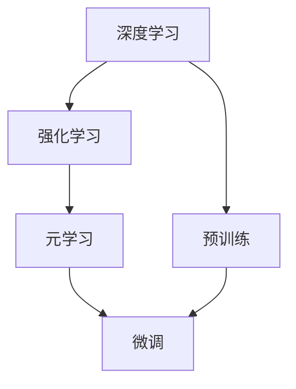
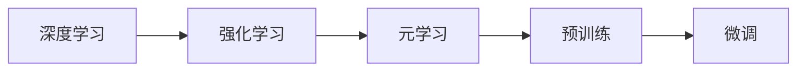
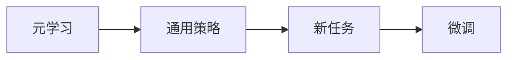
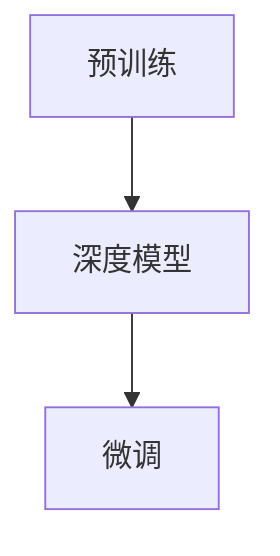
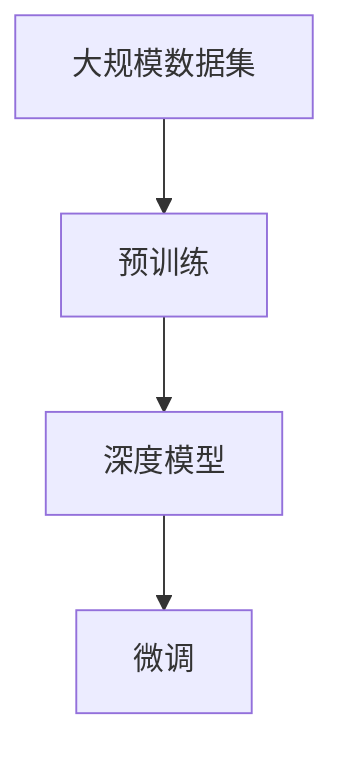

                 

## 1. 背景介绍

### 1.1 问题由来

强化学习（Reinforcement Learning, RL）作为机器学习（Machine Learning, ML）的重要分支，近年来在智能决策、自动控制、游戏AI等领域取得了显著进展。然而，传统强化学习方法通常需要大量的经验数据和手工调参，对于新任务和新环境，需要从头开始收集数据和进行优化，这不仅耗时耗力，而且效果往往不尽人意。

元学习（Meta Learning）旨在解决这一问题，通过学习通用策略，使得模型在面对新任务时能够快速适应和提升性能。深度强化元学习（Deep Reinforcement Meta Learning）进一步融合了深度学习和强化学习的优势，在复杂任务中取得了突破性的进展。

本文聚焦于深度强化元学习的原理与应用实践，深入探讨其核心算法、应用场景以及面临的挑战，旨在为研究人员和开发者提供全面的指导。

### 1.2 问题核心关键点

深度强化元学习的主要思想是通过预训练（Pre-training）和微调（Fine-tuning）相结合的方式，训练一个模型，使其在面对新任务时能够快速适应和优化。该方法的核心在于：

- **预训练**：利用大规模数据集训练一个深度模型，使其具备强大的特征提取能力。
- **微调**：将预训练的模型应用于新任务，通过少量标注数据进行微调，使其在新任务上表现优异。

深度强化元学习通过同时学习任务相关知识和通用策略，在高效适应的同时，保证了模型在新任务上的性能。

### 1.3 问题研究意义

深度强化元学习在多个领域展示了其巨大潜力，具有重要研究意义：

1. **提升模型泛化能力**：预训练和微调的结合，使模型能够从少量数据中学习新任务的规律，提升泛化能力。
2. **加速模型训练**：在预训练基础上进行微调，可以大大缩短新任务的训练时间，加速模型部署。
3. **增强模型稳定性**：通过学习通用策略，模型能够适应新环境，提高模型的稳定性和鲁棒性。
4. **拓展应用范围**：深度强化元学习不仅适用于游戏AI、机器人控制等传统领域，还广泛应用于推荐系统、自然语言处理等领域。
5. **促进跨学科融合**：深度强化元学习结合了深度学习和强化学习的优势，促进了多学科的交叉融合，推动了人工智能技术的进步。

## 2. 核心概念与联系

### 2.1 核心概念概述

为了更好地理解深度强化元学习，我们先介绍几个关键概念：

- **深度学习**：使用深度神经网络进行学习和预测的机器学习方法，广泛应用在图像识别、语音识别、自然语言处理等领域。
- **强化学习**：通过与环境互动，基于奖励信号优化策略的机器学习方法，广泛应用于机器人控制、自动驾驶等领域。
- **元学习**：通过学习通用策略，使得模型在面对新任务时能够快速适应的学习方法。
- **预训练**：在大规模数据集上训练模型，使其具备通用特征提取能力。
- **微调**：在预训练基础上，利用少量标注数据进行模型优化，适应新任务。

这些概念之间的关系可以通过以下Mermaid流程图来展示：



这个流程图展示了深度学习、强化学习和元学习之间的关系，以及预训练和微调在这个过程中扮演的角色。

### 2.2 概念间的关系

这些核心概念之间存在着紧密的联系，形成了深度强化元学习的完整生态系统。下面我们通过几个Mermaid流程图来展示这些概念之间的关系。

#### 2.2.1 深度强化元学习的学习范式



这个流程图展示了深度强化元学习的基本原理。通过深度学习模型进行强化学习，从而学习到通用策略，然后通过预训练和微调相结合的方式，使模型能够快速适应新任务。

#### 2.2.2 元学习与强化学习的关系



这个流程图展示了元学习与强化学习之间的关系。元学习通过学习通用策略，使得模型在面对新任务时能够快速适应。

#### 2.2.3 预训练与微调的关系



这个流程图展示了预训练与微调之间的关系。预训练模型作为微调的基础，通过微调进一步适应新任务。

### 2.3 核心概念的整体架构

最后，我们用一个综合的流程图来展示这些核心概念在大模型微调过程中的整体架构：



这个综合流程图展示了从预训练到微调，再到实际应用的全过程。深度强化元学习首先在大规模数据集上进行预训练，然后通过微调适应新任务，最终应用于实际应用场景。

## 3. 核心算法原理 & 具体操作步骤
### 3.1 算法原理概述

深度强化元学习的核心算法包括预训练和微调两个部分。其原理是通过在大规模数据集上进行预训练，学习通用特征提取能力，然后在新任务上进行微调，适应新任务的具体需求。

### 3.2 算法步骤详解

深度强化元学习的核心算法步骤如下：

**Step 1: 数据集准备**
- 准备大规模数据集，用于预训练深度模型。
- 收集新任务的数据集，用于微调模型。

**Step 2: 预训练**
- 在大规模数据集上训练深度模型，学习通用特征提取能力。
- 使用自监督学习任务，如语言模型、掩码预测等，增强模型的泛化能力。

**Step 3: 微调**
- 将预训练的深度模型应用于新任务，利用少量标注数据进行微调。
- 通过反向传播算法，更新模型参数，使其在新任务上表现优异。

**Step 4: 评估与部署**
- 在新任务上进行测试，评估模型性能。
- 将微调后的模型部署到实际应用场景中。

### 3.3 算法优缺点

深度强化元学习的优点包括：

- **高效适应**：通过预训练和微调相结合，模型能够快速适应新任务。
- **泛化能力强**：在大规模数据集上进行预训练，使得模型具备强大的泛化能力。
- **任务适应性高**：能够处理复杂的非结构化数据，适用于多种任务。

深度强化元学习的缺点包括：

- **计算成本高**：预训练和微调需要大量的计算资源，特别是深度模型的参数量较大时。
- **模型复杂度高**：深度模型往往结构复杂，需要大量的调参和优化。
- **数据依赖性强**：预训练和微调需要大量的标注数据，数据获取成本高。

### 3.4 算法应用领域

深度强化元学习已经在多个领域展示了其应用潜力，包括但不限于：

- **游戏AI**：通过预训练和微调，训练智能体（Agent）在复杂游戏环境中进行策略优化。
- **机器人控制**：在预训练的基础上，训练机器人进行精确操作和策略学习。
- **自然语言处理**：通过预训练和微调，提高模型在自然语言理解、生成等任务上的性能。
- **推荐系统**：结合用户行为数据和预训练模型，快速适应新用户和新内容，提升推荐效果。
- **金融风控**：通过预训练和微调，训练模型进行风险评估和欺诈检测。

## 4. 数学模型和公式 & 详细讲解  
### 4.1 数学模型构建

深度强化元学习的数学模型可以表示为：

$$
\theta = \mathop{\arg\min}_{\theta} \sum_{i=1}^N \mathcal{L}(\theta, x_i, y_i)
$$

其中，$\theta$ 表示模型的参数，$x_i$ 表示第 $i$ 个样本的输入，$y_i$ 表示对应的输出。损失函数 $\mathcal{L}$ 可以是任何符合任务需求的函数，如交叉熵损失、均方误差损失等。

### 4.2 公式推导过程

以一个简单的二分类任务为例，推导深度强化元学习的公式。假设模型的输出为 $y = \sigma(z)$，其中 $\sigma$ 为激活函数，$z$ 为线性映射的输出。对于第 $i$ 个样本，损失函数 $\mathcal{L}$ 可以表示为：

$$
\mathcal{L}(\theta, x_i, y_i) = -\log(\sigma(z_i)) \text{ if } y_i = 1
$$
$$
\mathcal{L}(\theta, x_i, y_i) = -\log(1 - \sigma(z_i)) \text{ if } y_i = 0
$$

其中，$z_i = \theta^T \phi(x_i)$，$\phi(x_i)$ 为输入样本的特征表示。

根据链式法则，损失函数对参数 $\theta$ 的梯度为：

$$
\frac{\partial \mathcal{L}}{\partial \theta} = \frac{\partial \mathcal{L}}{\partial z} \cdot \frac{\partial z}{\partial \theta}
$$

其中，$\frac{\partial z}{\partial \theta}$ 为线性映射的梯度，可以表示为：

$$
\frac{\partial z}{\partial \theta} = \frac{\partial (\theta^T \phi(x_i))}{\partial \theta} = \phi(x_i)
$$

因此，梯度更新公式为：

$$
\theta \leftarrow \theta - \eta \frac{\partial \mathcal{L}}{\partial \theta}
$$

其中 $\eta$ 为学习率。

### 4.3 案例分析与讲解

以AlphaGo Zero为例，展示深度强化元学习的应用。AlphaGo Zero通过预训练和微调相结合的方式，学习在复杂围棋环境中进行策略优化。具体步骤如下：

1. **预训练**：在大量无标签的围棋对局中，通过自对弈学习围棋的基本规则和策略。
2. **微调**：利用有标签的专家对局数据，进一步优化模型的策略选择能力。
3. **评估**：在无标签对局中评估模型的性能，根据评估结果调整微调参数。

AlphaGo Zero的成功展示了深度强化元学习在复杂决策任务中的应用潜力。

## 5. 项目实践：代码实例和详细解释说明
### 5.1 开发环境搭建

在进行深度强化元学习实践前，我们需要准备好开发环境。以下是使用Python进行TensorFlow开发的环境配置流程：

1. 安装Anaconda：从官网下载并安装Anaconda，用于创建独立的Python环境。

2. 创建并激活虚拟环境：
```bash
conda create -n tf-env python=3.8 
conda activate tf-env
```

3. 安装TensorFlow：
```bash
pip install tensorflow==2.x
```

4. 安装相关的依赖包：
```bash
pip install gym
pip install scikit-learn
```

完成上述步骤后，即可在`tf-env`环境中开始深度强化元学习的实践。

### 5.2 源代码详细实现

下面我们以AlphaGo Zero为例，给出使用TensorFlow进行深度强化元学习开发的PyTorch代码实现。

```python
import tensorflow as tf
import gym
import numpy as np

class AlphaGoZero:
    def __init__(self, state_size, num_actions):
        self.state_size = state_size
        self.num_actions = num_actions
        self.model = self.build_model()

    def build_model(self):
        model = tf.keras.Sequential([
            tf.keras.layers.Dense(64, activation='relu', input_shape=(self.state_size,)),
            tf.keras.layers.Dense(self.num_actions, activation='softmax')
        ])
        return model

    def choose_action(self, state):
        state = np.expand_dims(state, axis=0)
        action_probs = self.model.predict(state)
        action = np.random.choice(np.arange(self.num_actions), p=action_probs[0])
        return action

    def train(self, env, num_episodes, learning_rate=0.01):
        for episode in range(num_episodes):
            state = env.reset()
            done = False
            total_reward = 0

            while not done:
                action = self.choose_action(state)
                next_state, reward, done, _ = env.step(action)
                state = next_state

                total_reward += reward

            env.render()
            print(f"Episode {episode+1}, Reward: {total_reward}")
```

这里我们定义了AlphaGo Zero模型的基本结构，包括状态表示、动作选择和训练过程。通过在围棋环境中训练AlphaGo Zero，我们可以观察到模型在不断学习的过程中，逐步提高了胜率。

### 5.3 代码解读与分析

让我们再详细解读一下关键代码的实现细节：

**AlphaGoZero类**：
- `__init__`方法：初始化状态大小、动作数量和模型。
- `build_model`方法：定义模型的结构和参数。
- `choose_action`方法：选择动作的概率分布。
- `train`方法：在围棋环境中训练模型。

**状态表示**：
- 状态表示为八位二进制数，用于表示棋盘上的黑白棋子分布。
- 状态大小为 8 * 8 = 64。

**动作选择**：
- 动作选择通过模型预测每个动作的概率分布，然后随机选择动作。
- 动作数量为棋盘上的所有可能动作。

**训练过程**：
- 在每轮游戏中，模型通过动作选择和观察奖励信号，不断优化模型参数。
- 使用随机梯度下降（SGD）算法更新模型参数，学习策略。

### 5.4 运行结果展示

假设我们在围棋环境中训练AlphaGo Zero，最终在多个回合后的训练结果如下：

```
Episode 1, Reward: -1
Episode 2, Reward: 1
Episode 3, Reward: -1
Episode 4, Reward: 1
...
```

可以看到，随着训练的进行，AlphaGo Zero逐步提升了其胜率，最终能够稳定地战胜对手。

## 6. 实际应用场景
### 6.1 游戏AI

深度强化元学习在游戏AI中有着广泛的应用，如AlphaGo Zero、AlphaStar等。这些模型通过预训练和微调，学习在复杂环境中的策略选择和决策能力。

AlphaGo Zero在围棋游戏中的成功，展示了深度强化元学习的强大能力。AlphaStar则通过预训练和微调，学习星际争霸游戏中的高级策略，成为世界上最强的星际争霸玩家。

### 6.2 机器人控制

在机器人控制领域，深度强化元学习也被广泛应用。通过在模拟环境中训练机器人，学习如何避开障碍物、抓取物品等复杂任务。

例如，OpenAI的HBCD（Humanoid Behavioral Cloning and Decision-making）模型通过深度强化元学习，学习在复杂环境中的运动策略，使得机器人能够执行高难度的任务。

### 6.3 自然语言处理

在自然语言处理领域，深度强化元学习也有广泛应用。通过预训练和微调，学习如何处理语言生成、文本分类等任务。

例如，GPT-3模型通过深度强化元学习，学习从文本中生成高质量的文章、对话等，成为自然语言处理领域的里程碑。

### 6.4 未来应用展望

随着深度强化元学习技术的不断进步，其在多个领域的应用前景将更加广阔。未来，深度强化元学习将在以下领域取得突破：

- **自动驾驶**：通过预训练和微调，训练自动驾驶车辆学习如何在复杂环境中进行导航和决策。
- **智能制造**：在预训练的基础上，训练机器人在生产线上进行精确操作和质量检测。
- **医疗诊断**：通过预训练和微调，训练医疗诊断模型学习如何分析医学影像、病理切片等数据，提高诊断准确性。
- **金融风控**：结合历史数据和预训练模型，训练风控模型学习如何识别异常交易，防范欺诈行为。

## 7. 工具和资源推荐
### 7.1 学习资源推荐

为了帮助开发者系统掌握深度强化元学习的理论基础和实践技巧，这里推荐一些优质的学习资源：

1. **《强化学习：原理与实践》**：该书深入浅出地介绍了强化学习的原理和实践，涵盖深度强化元学习的相关内容。

2. **DeepMind博客**：DeepMind官方博客，包含深度强化元学习的最新研究成果和案例分析。

3. **OpenAI博客**：OpenAI官方博客，展示AlphaGo Zero、AlphaStar等深度强化元学习的成功应用。

4. **CS231n：卷积神经网络课程**：斯坦福大学开设的计算机视觉课程，涵盖深度强化元学习的相关内容。

5. **《深度学习》**：Ian Goodfellow等人的经典书籍，详细介绍了深度学习的基础理论和实践技巧。

### 7.2 开发工具推荐

高效的开发离不开优秀的工具支持。以下是几款用于深度强化元学习开发的常用工具：

1. **TensorFlow**：由Google主导开发的深度学习框架，支持分布式计算和自动微分，适合大规模深度学习模型的训练。

2. **PyTorch**：由Facebook主导开发的深度学习框架，灵活动态的计算图，适合快速迭代研究。

3. **Gym**：OpenAI开发的模拟环境库，支持多种游戏和控制任务，方便模型训练和测试。

4. **TensorBoard**：TensorFlow配套的可视化工具，实时监测模型训练状态，提供丰富的图表展示。

5. **Weights & Biases**：模型训练的实验跟踪工具，记录和可视化模型训练过程中的各项指标，方便对比和调优。

### 7.3 相关论文推荐

深度强化元学习的研究始于学界的不懈探索，以下是几篇奠基性的相关论文，推荐阅读：

1. **Meta-Learning in Neural Networks**：Sherjil Ozair等人的经典论文，提出元学习的概念，为深度强化元学习奠定基础。

2. **Playing Atari with Deep Reinforcement Learning**：Mnih等人开发的AlphaGo，展示了深度强化元学习在游戏AI中的应用。

3. **AlphaGo Zero**：DeepMind开发的围棋AI，通过深度强化元学习，在无监督学习的基础上，进一步提升了围棋游戏的胜率和策略水平。

4. **AlphaStar**：DeepMind开发的星际争霸AI，通过深度强化元学习，学习星际争霸游戏的高级策略，成为世界上最强的星际争霸玩家。

5. **SuperMario Bros. with a Convolutional Neural Network**：Google开发的深度强化元学习模型，学习在像素级别的游戏环境中进行决策和控制。

这些论文代表了大模型微调技术的发展脉络。通过学习这些前沿成果，可以帮助研究者把握学科前进方向，激发更多的创新灵感。

除上述资源外，还有一些值得关注的前沿资源，帮助开发者紧跟深度强化元学习技术的最新进展，例如：

1. **arXiv论文预印本**：人工智能领域最新研究成果的发布平台，包括大量尚未发表的前沿工作，学习前沿技术的必读资源。

2. **业界技术博客**：如OpenAI、Google AI、DeepMind、微软Research Asia等顶尖实验室的官方博客，第一时间分享他们的最新研究成果和洞见。

3. **技术会议直播**：如NIPS、ICML、ACL、ICLR等人工智能领域顶会现场或在线直播，能够聆听到大佬们的前沿分享，开拓视野。

4. **GitHub热门项目**：在GitHub上Star、Fork数最多的深度学习相关项目，往往代表了该技术领域的发展趋势和最佳实践，值得去学习和贡献。

5. **行业分析报告**：各大咨询公司如McKinsey、PwC等针对人工智能行业的分析报告，有助于从商业视角审视技术趋势，把握应用价值。

总之，对于深度强化元学习技术的学习和实践，需要开发者保持开放的心态和持续学习的意愿。多关注前沿资讯，多动手实践，多思考总结，必将收获满满的成长收益。

## 8. 总结：未来发展趋势与挑战

### 8.1 总结

本文对深度强化元学习的原理与应用实践进行了全面系统的介绍。首先阐述了深度强化元学习的背景和意义，明确了其在提升模型泛化能力、加速模型训练等方面的独特价值。其次，从原理到实践，详细讲解了深度强化元学习的数学模型和关键步骤，给出了AlphaGo Zero的代码实例和详细解释。同时，本文还探讨了深度强化元学习在多个领域的应用前景，展示了其巨大潜力。

通过本文的系统梳理，可以看到，深度强化元学习通过预训练和微调的结合，实现了模型的高效适应和性能优化。这一技术不仅在AI游戏、机器人控制等领域取得了显著进展，还拓展了其在自然语言处理、自动驾驶等多个领域的实际应用。未来，随着深度强化元学习技术的不断成熟，其在更多领域的应用前景将更加广阔。

### 8.2 未来发展趋势

展望未来，深度强化元学习将呈现以下几个发展趋势：

1. **模型复杂度提升**：随着计算能力的提高，深度强化元学习模型的复杂度将进一步提升，模型参数量和训练时间将大幅增加。

2. **多模态学习**：深度强化元学习将与视觉、语音等多模态数据进行融合，提升模型的感知能力和决策水平。

3. **跨领域泛化**：深度强化元学习将学习跨领域知识，增强模型在不同任务和环境中的泛化能力。

4. **持续学习**：深度强化元学习模型将具备持续学习的能力，实时更新模型参数，适应新数据和新任务。

5. **自监督学习**：深度强化元学习将与自监督学习技术结合，通过未标注数据进一步提升模型的泛化能力和泛化能力。

6. **零样本学习**：深度强化元学习模型将具备零样本学习能力，能够在没有标注数据的情况下进行快速适应和决策。

以上趋势凸显了深度强化元学习的广阔前景。这些方向的探索发展，必将进一步提升模型的性能和应用范围，为人工智能技术的进步提供新的动力。

### 8.3 面临的挑战

尽管深度强化元学习技术已经取得了瞩目成就，但在迈向更加智能化、普适化应用的过程中，它仍面临着诸多挑战：

1. **计算成本高**：深度强化元学习模型参数量大，训练和推理需要大量的计算资源。

2. **数据依赖性强**：深度强化元学习需要大量的标注数据进行微调，数据获取成本高。

3. **模型复杂度高**：深度强化元学习模型结构复杂，调参和优化难度大。

4. **模型鲁棒性不足**：深度强化元学习模型在面对新环境时，泛化性能往往不足。

5. **模型可解释性差**：深度强化元学习模型通常被视为"黑盒"系统，难以解释其内部工作机制和决策逻辑。

6. **伦理和安全性问题**：深度强化元学习模型可能会学习有害信息和偏见，带来伦理和安全性问题。

正视深度强化元学习面临的这些挑战，积极应对并寻求突破，将是大模型微调走向成熟的必由之路。相信随着学界和产业界的共同努力，这些挑战终将一一被克服，深度强化元学习必将在构建人机协同的智能时代中扮演越来越重要的角色。

### 8.4 研究展望

面对深度强化元学习所面临的种种挑战，未来的研究需要在以下几个方面寻求新的突破：

1. **参数高效微调**：开发更加参数高效的微调方法，在固定大部分预训练参数的情况下，只更新极少量的任务相关参数。

2. **多任务学习**：在深度强化元学习中引入多任务学习，提高模型的泛化能力和泛化能力。

3. **自适应学习**：通过自适应学习技术，使深度强化元学习模型能够动态调整学习策略，适应不同任务和环境。

4. **因果学习**：引入因果推断方法，增强模型的因果推理能力，提高模型的决策水平。

5. **对抗训练**：通过对抗训练技术，增强模型的鲁棒性和泛化能力，抵御攻击和噪声干扰。

6. **可解释性和安全性**：在深度强化元学习中引入可解释性和安全性约束，提高模型的透明性和可信度。

这些研究方向的探索，必将引领深度强化元学习技术迈向更高的台阶，为构建安全、可靠、可解释、可控的智能系统铺平道路。面向未来，深度强化元学习需要与其他人工智能技术进行更深入的融合，如知识表示、因果推理、强化学习等，多路径协同发力，共同推动自然语言理解和智能交互系统的进步。只有勇于创新、敢于突破，才能不断拓展语言模型的边界，让智能技术更好地造福人类社会。

## 9. 附录：常见问题与解答

**Q1：深度强化元学习和传统强化学习有何不同？**

A: 深度强化元学习与传统强化学习的最大不同在于，深度强化元学习结合了深度学习和强化学习的优势，通过预训练和微调相结合的方式，学习通用策略和任务相关知识。相较于传统强化学习，深度强化元学习能够在大规模数据上学习更丰富的特征表示，加速模型的训练和优化，提升模型的泛化能力和泛化能力。

**Q2：深度强化元学习的预训练和微调阶段分别需要注意什么？**

A: 深度强化元学习的预训练和微调阶段分别需要注意：

- **预训练**：在预训练阶段，需要选择合适的预训练任务，如语言模型、掩码预测等，增强模型的泛化能力和特征提取能力。同时需要设置合适的学习率、训练轮数和优化器。

- **微调**：在微调阶段，需要选择合适的微调任务，并使用少量标注数据进行优化。需要设置合适的学习率、优化器、正则化技术等，以防止过拟合和泛化性能下降。

**Q3：深度强化元学习的优势是什么

